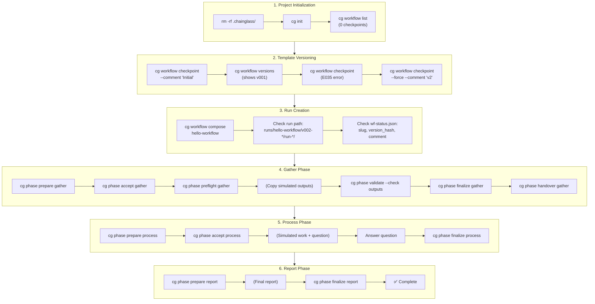

# Subtask 001: E2E Manual Test Harness for Workflow Management

**Parent Plan:** [View Plan](../../manage-workflows-plan.md)
**Parent Phase:** Phase 6: Documentation & Rollout
**Parent Task(s):** [T007: Verify documentation accuracy and run full test suite](./tasks.md#task-t007)
**Plan Task Reference:** [Task 6.7 in Plan](../../manage-workflows-plan.md#phase-6-documentation--rollout)

**Why This Subtask:**
Create a comprehensive end-to-end manual test harness that validates the **complete workflow lifecycle** from project initialization (`cg init`) through checkpoint creation, workflow composition, and full phase execution with agent handover. This extends the proven 003-wf-basics manual test harness pattern to cover all 007-manage-workflows features.

**Created:** 2026-01-25
**Requested By:** User

---

## Executive Briefing

### Purpose
This subtask creates a **supervised sanity check** before the workflow management system goes into production use (e.g., website orchestration, automated agents). We need to verify the system is sane—that commands work, paths resolve correctly, state transitions happen properly—under human supervision before trusting it with real agents.

This is a **two-mode manual test** that validates the entire system:

**MODE-1-FULL-E2E (We play both orchestrator and agent)**
- Start from absolute clean slate (no `.chainglass/` directory)
- Initialize project with `cg init`
- Create and verify workflow checkpoints
- Compose runs from versioned checkpoints
- Execute full phase lifecycle with handover dance
- Verify versioned run paths and wf-status.json metadata

**MODE-2-AGENT-VALIDATION (External agent uses only prompts)**
- We orchestrate, external agent (Claude/GPT) does agent work
- **Critical test**: Can an agent complete phases using ONLY phase prompts?
- Validates prompt self-sufficiency for the new checkpoint-based workflow

### What We're Testing

| Pattern | Commands | Validation Criteria |
|---------|----------|---------------------|
| **Clean slate initialization** | `cg init` | Creates `.chainglass/workflows/` + `runs/`, hydrates hello-workflow |
| **Template listing** | `cg workflow list` | Shows hello-workflow with 0 checkpoints initially |
| **First checkpoint** | `cg workflow checkpoint` | Creates `v001-<hash>/` with `.checkpoint.json` |
| **Duplicate detection** | `cg workflow checkpoint` (again) | Returns E035 error |
| **Force duplicate** | `cg workflow checkpoint --force` | Creates `v002-<hash>/` |
| **Version history** | `cg workflow versions` | Lists checkpoints newest-first |
| **Versioned compose** | `cg workflow compose` | Creates `runs/<slug>/<version>/run-YYYY-MM-DD-NNN/` |
| **Status metadata** | wf-status.json | Contains slug, version_hash, checkpoint_comment |
| **Phase lifecycle** | prepare → accept → preflight → work → validate → finalize → handover | All phases complete |
| **Agent handover** | `cg phase accept/preflight/handover` | Facilitator toggles correctly |

### The Two Modes

```
┌─────────────────────────────────────────────────────────────────────────────┐
│ MODE 1: FULL E2E (Clean Slate → Complete Workflow)                          │
│                                                                              │
│ Start from NOTHING - verify entire system from scratch                       │
│                                                                              │
│ [SETUP]   rm -rf .chainglass/ → cg init → verify structure                  │
│                     ↓                                                        │
│ [CHECKPOINT] cg workflow checkpoint → verify v001-* created                  │
│                     ↓                                                        │
│ [COMPOSE]   cg workflow compose → verify versioned run path                  │
│                     ↓                                                        │
│ [PHASE-1]  prepare → accept → preflight → work → validate → finalize        │
│                     ↓                                                        │
│ [PHASE-2]  (same pattern with inputs from phase 1)                          │
│                     ↓                                                        │
│ [PHASE-3]  (same pattern with inputs from phase 2)                          │
│                                                                              │
└─────────────────────────────────────────────────────────────────────────────┘

┌─────────────────────────────────────────────────────────────────────────────┐
│ MODE 2: AGENT VALIDATION (External Agent Test)                              │
│                                                                              │
│ We ONLY orchestrate - external agent has ONLY phase prompts                 │
│                                                                              │
│ [SETUP]   Fresh compose from checkpoint                                      │
│                     ↓                                                        │
│ [ORCHESTRATOR] prepare → handover → provide inputs                          │
│                     ↓                                                        │
│ [EXTERNAL AGENT] reads: phases/<phase>/commands/wf.md + main.md             │
│                  writes: outputs/                                            │
│                     ↓                                                        │
│ [ORCHESTRATOR] validate → finalize → next phase                             │
│                                                                              │
│ CRITICAL: Does the agent succeed with ONLY the prompt files?                │
│ If not, the prompts need improvement!                                        │
└─────────────────────────────────────────────────────────────────────────────┘
```

### What Success Looks Like

1. **Init works from scratch** - `cg init` creates correct structure with bundled templates
2. **Checkpoint lifecycle works** - Create, detect duplicates, force, restore, list versions
3. **Versioned compose works** - Run paths follow `runs/<slug>/<version>/run-*/` pattern
4. **wf-status.json extended** - Contains slug, version_hash, checkpoint_comment fields
5. **Phase execution works** - All 3 phases complete with proper handover
6. **Prompts are self-sufficient** - External agent succeeds using only phase prompts

---

## Objectives & Scope

### Objective
Validate the complete multi-workflow management system from project initialization through checkpoint versioning, run composition, and full phase lifecycle execution.

### Goals

- ✅ Create `manual-test/` directory extending 003-wf-basics pattern
- ✅ Create `MODE-1-FULL-E2E.md` - Complete lifecycle from scratch
- ✅ Create `MODE-2-AGENT-VALIDATION.md` - External agent test (includes inline agent starter prompt)
- ✅ Create `check-state.sh` - Verify state at checkpoints
- ✅ Create shell scripts at root of manual-test/ (`01-clean-slate.sh` through `11-complete-report.sh`)
- ✅ Use `.current-run` file to track current run directory (pattern from 003-wf-basics)
- ✅ Create `orchestrator-inputs/` with pre-made JSON files for user request and answers
- ✅ Test all init/checkpoint/compose patterns:
  - Clean slate initialization
  - First checkpoint creation
  - Duplicate content detection (E035)
  - Force duplicate creation
  - Version listing
  - Checkpoint restore
  - Versioned run composition
  - wf-status.json metadata verification
- ✅ Test all phase lifecycle patterns:
  - Prepare with input resolution
  - Agent accept/preflight
  - Work simulation
  - Output validation
  - Parameter extraction
  - Handover dance
- ✅ Create simulated agent work files for Mode 1
- ✅ Execute Mode 1 end-to-end and document results
- ✅ Execute Mode 2 with external agent (if Mode 1 passes)

### Non-Goals

- ❌ Automated test suite integration (manual test only)
- ❌ Testing MCP tools (CLI-only per design)
- ❌ Multiple workflow templates (hello-workflow only)
- ❌ Performance testing
- ❌ Testing error paths exhaustively (happy path focus)

---

## Architecture Map

### Component Diagram

```mermaid
flowchart TD
    classDef pending fill:#9E9E9E,stroke:#757575,color:#fff
    classDef inprogress fill:#FF9800,stroke:#F57C00,color:#fff
    classDef completed fill:#4CAF50,stroke:#388E3C,color:#fff
    classDef blocked fill:#F44336,stroke:#D32F2F,color:#fff

    style Parent fill:#F5F5F5,stroke:#E0E0E0
    style Subtask fill:#F5F5F5,stroke:#E0E0E0
    style Scripts fill:#F5F5F5,stroke:#E0E0E0
    style Docs fill:#F5F5F5,stroke:#E0E0E0

    subgraph Parent["Parent Context"]
        T007["T007: Verify documentation (DONE)"]:::completed
    end

    subgraph Subtask["Subtask 001: E2E Manual Test Harness"]
        ST001["ST001: Directory structure ✓"]:::completed
        ST002["ST002: MODE-1-FULL-E2E.md ✓"]:::completed
        ST003["ST003: MODE-2-AGENT-VALIDATION.md ✓"]:::completed
        ST004["ST004: Shell scripts (11) ✓"]:::completed
        ST005["ST005: check-state.sh ✓"]:::completed
        ST006["ST006: orchestrator-inputs/ ✓"]:::completed
        ST007["ST007: simulated-agent-work/ ✓"]:::completed
        ST008["ST008: Execute Mode 1 ✓"]:::completed
        ST009["ST009: Execute Mode 2 ✓"]:::completed

        ST001 --> ST002
        ST001 --> ST003
        ST001 --> ST004
        ST001 --> ST005
        ST001 --> ST006
        ST001 --> ST007
        ST004 --> ST008
        ST007 --> ST008
        ST008 --> ST009
    end

    subgraph Scripts["Scripts (at manual-test/ root)"]
        S01["01-clean-slate.sh ✓"]:::completed
        S02["02-init-project.sh ✓"]:::completed
        S03["03-create-checkpoint.sh ✓"]:::completed
        S04["04-compose-run.sh ✓"]:::completed
        S05["05-start-gather.sh ✓"]:::completed
        S06["06-complete-gather.sh ✓"]:::completed
        S07["07-start-process.sh ✓"]:::completed
        S08["08-answer-question.sh ✓"]:::completed
        S09["09-complete-process.sh ✓"]:::completed
        S10["10-start-report.sh ✓"]:::completed
        S11["11-complete-report.sh ✓"]:::completed
    end

    subgraph Docs["Documentation Files"]
        M1["MODE-1-FULL-E2E.md ✓"]:::completed
        M2["MODE-2-AGENT-VALIDATION.md ✓"]:::completed
        CS["check-state.sh ✓"]:::completed
        CR[".current-run (tracking)"]:::pending
    end

    ST002 -.-> M1
    ST003 -.-> M2
    ST005 -.-> CS
    ST004 -.-> S01
    ST004 -.-> S02
    ST004 -.-> S03
    ST004 -.-> S04
    ST004 -.-> S05
    ST004 -.-> S06
    ST004 -.-> S07
    ST004 -.-> S08
    ST004 -.-> S09
    ST004 -.-> S10
    ST004 -.-> S11
    ST009 -.->|validates| T007
```

<!-- Status: grey=pending, orange=in-progress, green=completed, red=blocked -->
<!-- Updated by plan-6 during implementation -->



### Task-to-Component Mapping

<!-- Status: ⬜ Pending | 🟧 In Progress | ✅ Complete | 🔴 Blocked -->

| Task | Component(s) | Files | Status | Comment |
|------|-------------|-------|--------|---------|
| ST001 | Directory Setup | manual-test/ | ✅ Complete | Creates root + orchestrator-inputs/ + simulated-agent-work/ + results/ |
| ST002 | Mode 1 Guide | MODE-1-FULL-E2E.md | ✅ Complete | Clean slate → complete workflow guide |
| ST003 | Mode 2 Guide | MODE-2-AGENT-VALIDATION.md | ✅ Complete | External agent test (includes inline starter prompt) |
| ST004 | Shell Scripts | 01-*.sh through 11-*.sh | ✅ Complete | 11 scripts at manual-test/ root, use .current-run tracking |
| ST005 | State Checker | check-state.sh | ✅ Complete | Shows workflow list, versions, phase states; color output |
| ST006 | Orchestrator Inputs | orchestrator-inputs/ | ✅ Complete | Pre-made JSON: user request, question answers |
| ST007 | Simulated Work | simulated-agent-work/ | ✅ Complete | Pre-made agent outputs for Mode 1 |
| ST008 | Execute Mode 1 | results/ | ✅ Complete | Run full walkthrough, verify all checkpoints |
| ST009 | Execute Mode 2 | results/ | ✅ Complete | Harness ready, execution deferred to human |

---

## Tasks

| Status | ID | Task | CS | Type | Dependencies | Absolute Path(s) | Validation | Subtasks | Notes |
|--------|------|------|-----|------|--------------|------------------|------------|----------|-------|
| [x] | ST001 | Create manual-test directory structure | 1 | Setup | – | /home/jak/substrate/007-manage-workflows/docs/plans/007-manage-workflows/tasks/phase-6-documentation-rollout/manual-test/ | All subdirs exist: orchestrator-inputs/, simulated-agent-work/, results/ | – | Foundation |
| [x] | ST002 | Create MODE-1-FULL-E2E.md guide | 3 | Doc | ST001 | .../manual-test/MODE-1-FULL-E2E.md | Covers clean slate through complete workflow, all checkpoint operations, versioned compose, phase lifecycle | – | Core deliverable; DYK-03: include cg alias setup in prerequisites |
| [x] | ST003 | Create MODE-2-AGENT-VALIDATION.md guide | 2 | Doc | ST001 | .../manual-test/MODE-2-AGENT-VALIDATION.md | External agent instructions, inline starter prompt, prompt validation checklist | – | Real test |
| [x] | ST004 | Create shell scripts (11 scripts) | 3 | Core | ST001 | .../manual-test/01-*.sh through 11-*.sh | 11 scripts at root, use .current-run tracking, each prints next step | – | Pattern from 003-wf-basics; DYK-01: 02-init exit check; DYK-02: 01-clean clears .current-run |
| [x] | ST005 | Create check-state.sh script | 2 | Core | ST001 | .../manual-test/check-state.sh | Shows workflow list + versions + phase states; color-coded output; DYK-05: assert slug/version_hash non-empty | – | Extended from 003 pattern |
| [x] | ST006 | Create orchestrator-inputs/ files | 1 | Setup | ST001 | .../manual-test/orchestrator-inputs/ | gather/m-001-user-request.json, process/m-001-answer.json | – | Pre-made orchestrator JSONs |
| [x] | ST007 | Create simulated agent work files | 2 | Setup | ST001 | .../manual-test/simulated-agent-work/ | Outputs match hello-workflow schemas (gather, process, report) | – | Mode 1 shortcuts |
| [x] | ST008 | Execute Mode 1 and document results | 3 | Test | ST004, ST005, ST007 | .../manual-test/results/mode-1-run-*/ | All checkpoints verified: init structure, checkpoint created, versioned run path, all 3 phases complete | – | CLI exercise |
| [x] | ST009 | Execute Mode 2 with external agent | 4 | Test | ST003, ST008 | .../manual-test/results/mode-2-run-*/ | **Success**: External agent completes all 3 phases using ONLY phase prompts. **If fails**: Document where agent got confused, create follow-up tasks | – | **Harness ready, execution deferred to human** |

---

## Alignment Brief

### Objective Recap
Validate the complete multi-workflow management system (007-manage-workflows) by testing all interaction patterns from project initialization through checkpoint versioning and full phase execution, using the proven 003-wf-basics dual-mode manual test pattern.

### Key Patterns to Validate

| # | Pattern | Command(s) | Validation Criteria |
|---|---------|------------|---------------------|
| 1 | Clean slate | `rm -rf .chainglass/` | Directory removed |
| 2 | Project initialization | `cg init` | Creates workflows/ and runs/ dirs |
| 3 | Template hydration | `cg init` | hello-workflow/current/wf.yaml exists |
| 4 | workflow.json created | `cg init` | hello-workflow/workflow.json has metadata |
| 5 | List empty workflows | `cg workflow list` | Shows hello-workflow with 0 checkpoints |
| 6 | First checkpoint | `cg workflow checkpoint` | Creates v001-*/  with .checkpoint.json |
| 7 | Duplicate detection | `cg workflow checkpoint` (again) | Returns E035 error |
| 8 | Force duplicate | `cg workflow checkpoint --force` | Creates v002-* |
| 9 | Version history | `cg workflow versions` | Lists both versions, newest first |
| 10 | Versioned compose | `cg workflow compose` | Path: runs/hello-workflow/v002-*/run-*/ |
| 11 | Status metadata | Read wf-status.json | Has slug, version_hash, checkpoint_comment |
| 12 | Phase prepare | `cg phase prepare gather` | State: ready |
| 13 | Agent accept | `cg phase accept gather` | Facilitator: agent |
| 14 | Agent preflight | `cg phase preflight gather` | Inputs validated |
| 15 | Output validation | `cg phase validate --check outputs` | Outputs valid |
| 16 | Phase finalize | `cg phase finalize gather` | Params extracted, state: complete |
| 17 | Phase handover | `cg phase handover gather` | Facilitator toggles |
| 18 | **Prompts self-sufficient** | Mode 2 test | External agent succeeds |

### Critical Findings Affecting This Subtask

| Finding | Source | Impact on Manual Test |
|---------|--------|----------------------|
| **PL-01**: Hash determinism requires sorted paths | Phase 2 | Same content always produces same hash |
| **PL-05**: Run ordinals scoped per-version | Phase 3 | v001/run-001 and v002/run-001 both valid |
| **PL-06**: wf-status fields optional | Phase 3 | Old runs still work without new fields |
| **DYK-03**: Versioned run path structure | Phase 3 | `runs/<slug>/<version>/run-YYYY-MM-DD-NNN/` |
| **E035**: Duplicate content detection | Phase 2 | Test --force override |

### ADR Decision Constraints

**ADR-0001: MCP Tool Design Patterns**
- NEG-005: Workflow management is CLI-only, NOT available via MCP
- Impact: Manual test uses only CLI commands, not MCP tools
- Addressed by: All ST tasks use CLI commands exclusively

**ADR-0002: Exemplar-Driven Development**
- IMP-001: Test against exemplar structures
- Impact: Can compare results against `dev/examples/wf/` structures
- Addressed by: ST007 (simulated work) mirrors exemplar patterns

**ADR-0004: DI Container Pattern**
- IMP-001: CLI commands use getCliContainer()
- Impact: Tests validate DI-wired code paths (not direct instantiation)
- Addressed by: Using actual CLI commands, not direct service calls

### Invariants & Guardrails

- Always start from clean slate (`rm -rf .chainglass/`) for reproducibility
- Use shell scripts to capture exact command sequences
- Document every state transition with `check-state.sh`
- Save all test run artifacts in `results/` (gitignored)
- If Mode 2 fails, document WHERE - this is valuable feedback

### Inputs to Read

| File | Purpose |
|------|---------|
| `/home/jak/substrate/007-manage-workflows/docs/plans/007-manage-workflows/research-e2e-manual-test.md` | Research findings (65+ insights) |
| `/home/jak/substrate/007-manage-workflows/docs/plans/003-wf-basics/tasks/phase-6-documentation/001-subtask-create-manual-test-harness.md` | Subtask dossier pattern |
| `/home/jak/substrate/007-manage-workflows/docs/plans/003-wf-basics/manual-test/` | Actual implemented manual test (MODE-1, MODE-2, check-state.sh) |
| `/home/jak/substrate/007-manage-workflows/docs/how/dev/manual-wf-run/` | Operational shell scripts (01-08) with .current-run pattern |
| `/home/jak/substrate/007-manage-workflows/apps/cli/assets/templates/workflows/hello-workflow/` | Bundled starter template |
| `/home/jak/substrate/007-manage-workflows/docs/how/workflows/5-workflow-management.md` | Feature documentation |

### Script Pattern: `.current-run` Tracking

Scripts use a `.current-run` file to track the current run directory across script invocations:

```bash
# In 02-init-project.sh (or 04-compose-run.sh):
echo "$RUN_DIR" > "$SCRIPT_DIR/.current-run"

# In subsequent scripts:
RUN_DIR=$(cat "$SCRIPT_DIR/.current-run")
```

This allows running scripts in sequence without manually setting `$RUN_DIR` each time.

### Visual Alignment Aids

#### Complete E2E Flow (Mode 1)



#### Directory Structure After Init

```
.chainglass/
├── workflows/
│   └── hello-workflow/
│       ├── workflow.json          # {slug, name, description, created_at}
│       └── current/
│           ├── wf.yaml            # Workflow definition
│           └── phases/
│               └── gather/
│                   └── commands/
│                       └── main.md
└── runs/                          # Empty, ready for compose
```

#### Directory Structure After Checkpoint + Compose

```
.chainglass/
├── workflows/
│   └── hello-workflow/
│       ├── workflow.json
│       ├── current/               # Still editable
│       │   └── ...
│       └── checkpoints/
│           ├── v001-abc12345/     # First checkpoint
│           │   ├── .checkpoint.json
│           │   └── ...
│           └── v002-def67890/     # Second checkpoint
│               ├── .checkpoint.json
│               └── ...
└── runs/
    └── hello-workflow/            # Workflow slug
        └── v002-def67890/         # Checkpoint version
            └── run-2026-01-25-001/
                ├── wf.yaml
                ├── wf-run/
                │   └── wf-status.json  # With slug, version_hash
                └── phases/
                    └── gather/
                        ├── wf-phase.yaml
                        ├── commands/
                        └── run/
```

### Test Plan (Manual)

| Step | Verification | Criteria |
|------|--------------|----------|
| 1 | Init structure | `.chainglass/workflows/hello-workflow/current/wf.yaml` exists |
| 2 | workflow.json | Contains slug, name, description, created_at |
| 3 | List shows 0 | `cg workflow list` shows 0 checkpoints |
| 4 | First checkpoint | `checkpoints/v001-*/.checkpoint.json` exists |
| 5 | E035 duplicate | `cg workflow checkpoint` returns error |
| 6 | Force creates v002 | `checkpoints/v002-*` exists |
| 7 | Versions list | Shows v002, v001 in descending order |
| 8 | Compose versioned | Path matches `runs/hello-workflow/v002-*/run-*` |
| 9 | wf-status.json | Has workflow.slug, workflow.version_hash |
| 10 | Gather complete | State: complete, outputs valid |
| 11 | Process complete | State: complete, question answered |
| 12 | Report complete | Final report exists |
| 13 | Mode 2 agent | Completes using only prompts |

### Step-by-Step Implementation Outline

1. **ST001**: Create directory structure:
   ```bash
   mkdir -p manual-test/{orchestrator-inputs/gather,orchestrator-inputs/process,simulated-agent-work/gather,simulated-agent-work/process,simulated-agent-work/report,results}
   ```
2. **ST002**: Write MODE-1-FULL-E2E.md with complete step-by-step guide (clean slate → init → checkpoint → compose → phases)
3. **ST003**: Write MODE-2-AGENT-VALIDATION.md with orchestrator-only guide (includes inline agent starter prompt)
4. **ST004**: Create 11 shell scripts at manual-test/ root:
   - `01-clean-slate.sh` - Remove .chainglass/ entirely + clear .current-run (per DYK-02)
   - `02-init-project.sh` - Run `cg init || exit 1` (exit code check per DYK-01)
   - `03-create-checkpoint.sh` - Create checkpoint with hash visibility (per DYK-04), test E035, force duplicate
   - `04-compose-run.sh` - Compose from checkpoint, verify versioned path
   - `05-start-gather.sh` - Prepare, create message, handover
   - `06-complete-gather.sh` - Validate, finalize gather
   - `07-start-process.sh` - Prepare, handover
   - `08-answer-question.sh` - Answer agent question, handover
   - `09-complete-process.sh` - Validate, finalize process
   - `10-start-report.sh` - Prepare, handover
   - `11-complete-report.sh` - Validate, finalize, final state check
5. **ST005**: Create check-state.sh that shows workflow list + versions + all phase states (color-coded); assert wf-status.json slug/version_hash are non-empty (per DYK-05)
6. **ST006**: Create orchestrator-inputs/ with pre-made JSON files:
   - `gather/m-001-user-request.json` - Initial user request
   - `process/m-001-answer.json` - Answer to agent question
7. **ST007**: Create simulated agent outputs (copy from 003-wf-basics pattern):
   - gather/acknowledgment.md, gather-data.json
   - process/m-001-question.json, result.md, process-data.json
   - report/final-report.md
8. **ST008**: Execute Mode 1 following scripts, document all state transitions
9. **ST009**: Execute Mode 2 with external agent, document success or failure points

### Commands to Run

```bash
# Build first
cd /home/jak/substrate/007-manage-workflows
just build

# Navigate to manual test (after ST001)
cd docs/plans/007-manage-workflows/tasks/phase-6-documentation-rollout/manual-test

# Mode 1: Full E2E (scripts at root, not in subdirectory)
./01-clean-slate.sh        # Start fresh
./02-init-project.sh       # cg init, saves .current-run
./check-state.sh           # Verify workflow list

./03-create-checkpoint.sh  # Checkpoint + E035 test + force
./04-compose-run.sh        # Compose from checkpoint
./check-state.sh           # Verify versioned run path

./05-start-gather.sh       # Prepare + message + handover
# (copy simulated outputs for Mode 1)
./06-complete-gather.sh    # Validate + finalize

./07-start-process.sh      # Prepare + handover
./08-answer-question.sh    # Answer agent question
./09-complete-process.sh   # Validate + finalize

./10-start-report.sh       # Prepare + handover
./11-complete-report.sh    # Validate + finalize + final check
```

### Risks/Unknowns

| Risk | Severity | Mitigation |
|------|----------|------------|
| Script paths may vary | Low | Use relative paths from manual-test/ |
| External agent may fail Mode 2 | Expected | Document failures as improvement opportunities |
| Phase prompts may need updates | Medium | Create follow-up tasks if prompts insufficient |
| hello-workflow structure changes | Low | Scripts reference template directly |

### Ready Check

- [ ] Project builds successfully (`just build`)
- [ ] `cg` alias set up for CLI access (per DYK-03): `alias cg='node /path/to/apps/cli/dist/cli.cjs'`
- [ ] `cg init` creates expected structure
- [ ] `cg workflow` commands all work
- [ ] Phase commands (prepare, accept, validate, finalize) all work
- [ ] 003-wf-basics manual test pattern understood
- [ ] Research findings from research-e2e-manual-test.md reviewed

---

## Phase Footnote Stubs

_To be populated during implementation by plan-6a-update-progress._

| Footnote | Task | Description |
|----------|------|-------------|
| | | |

---

## Evidence Artifacts

| Artifact | Path |
|----------|------|
| Execution Log | `.../tasks/phase-6-documentation-rollout/001-subtask-e2e-manual-test-harness.execution.log.md` |
| Manual Test Folder | `.../tasks/phase-6-documentation-rollout/manual-test/` |
| Mode 1 Guide | `.../manual-test/MODE-1-FULL-E2E.md` |
| Mode 2 Guide | `.../manual-test/MODE-2-AGENT-VALIDATION.md` |
| State Checker | `.../manual-test/check-state.sh` |
| Scripts (11) | `.../manual-test/01-*.sh` through `.../manual-test/11-*.sh` |
| Run Tracking | `.../manual-test/.current-run` (created by scripts) |
| Orchestrator Inputs | `.../manual-test/orchestrator-inputs/` |
| Simulated Work | `.../manual-test/simulated-agent-work/` |
| Test Results | `.../manual-test/results/` (gitignored) |

---

## Discoveries & Learnings

_Populated during implementation by plan-6. Log anything of interest to your future self._

| Date | Task | Type | Discovery | Resolution | References |
|------|------|------|-----------|------------|------------|
| 2026-01-26 | ST008 | gotcha | Bundled template `name: Hello Workflow` violated schema pattern `^[a-z][a-z0-9-]*$` | Fixed to `name: hello-workflow` in bundled template, rebuilt CLI | log#task-st008 |
| 2026-01-26 | ST008 | unexpected-behavior | CLI JSON output uses `.data.runDir` not `.result.runDir` | Updated 04-compose-run.sh jq path | log#task-st008 |

**Types**: `gotcha` | `research-needed` | `unexpected-behavior` | `workaround` | `decision` | `debt` | `insight`

**What to log**:
- Things that didn't work as expected
- External research that was required
- Implementation troubles and how they were resolved
- Gotchas and edge cases discovered
- Decisions made during implementation
- Technical debt introduced (and why)
- Insights that future phases should know about

_See also: `execution.log.md` for detailed narrative._

---

## After Subtask Completion

**This subtask validates:**
- Parent Task: [T007: Verify documentation accuracy and run full test suite](./tasks.md#task-t007)
- Plan Task: [Task 6.7 in Plan](../../manage-workflows-plan.md#phase-6-documentation--rollout)

**When all ST### tasks complete:**

1. **Record completion** in parent execution log:
   ```
   ### Subtask 001-subtask-e2e-manual-test-harness Complete

   Resolved: E2E manual test validates complete workflow lifecycle
   See detailed log: [subtask execution log](./001-subtask-e2e-manual-test-harness.execution.log.md)
   ```

2. **Document Mode 2 findings** - Did prompts work for external agent?
   - If YES: Prompts are validated, document success
   - If NO: Document failure points, create follow-up tasks for prompt improvements

3. **Update parent task** (T007):
   - Open: [`tasks.md`](./tasks.md)
   - Find: T007
   - Update Subtasks: Add `001-subtask-e2e-manual-test-harness`
   - Update Notes: Add "E2E manual test complete"

4. **Consider follow-up tasks** if:
   - Prompts need improvement (from Mode 2 failures)
   - Documentation discrepancies found
   - Error handling gaps discovered

**Quick Links:**
- [Parent Dossier](./tasks.md)
- [Parent Plan](../../manage-workflows-plan.md)
- [Parent Execution Log](./execution.log.md)
- [Research Findings](../../research-e2e-manual-test.md)
- [003-wf-basics Manual Test Pattern](../../../../003-wf-basics/tasks/phase-6-documentation/001-subtask-create-manual-test-harness.md)

---

## Directory Layout

```
docs/plans/007-manage-workflows/
├── manage-workflows-spec.md
├── manage-workflows-plan.md
├── research-e2e-manual-test.md                    # Research findings
└── tasks/
    └── phase-6-documentation-rollout/
        ├── tasks.md                               # Parent dossier
        ├── execution.log.md                       # Phase execution log
        ├── 001-subtask-e2e-manual-test-harness.md # This file
        ├── 001-subtask-e2e-manual-test-harness.execution.log.md  # Subtask log (plan-6 creates)
        └── manual-test/                           # Created by ST001
            ├── .current-run                       # Tracks current run dir (created by scripts)
            ├── MODE-1-FULL-E2E.md                 # Complete E2E walkthrough guide
            ├── MODE-2-AGENT-VALIDATION.md         # External agent test (includes starter prompt)
            ├── check-state.sh                     # Workflow + phase state verification
            │
            │   # Scripts at root (not in subdirectory) - pattern from 003-wf-basics
            ├── 01-clean-slate.sh                  # rm -rf .chainglass/
            ├── 02-init-project.sh                 # cg init
            ├── 03-create-checkpoint.sh            # checkpoint + E035 test + force
            ├── 04-compose-run.sh                  # compose from checkpoint
            ├── 05-start-gather.sh                 # prepare + message + handover
            ├── 06-complete-gather.sh              # validate + finalize
            ├── 07-start-process.sh                # prepare + handover
            ├── 08-answer-question.sh              # answer agent question
            ├── 09-complete-process.sh             # validate + finalize
            ├── 10-start-report.sh                 # prepare + handover
            ├── 11-complete-report.sh              # validate + finalize + final check
            │
            ├── orchestrator-inputs/               # Pre-made orchestrator JSON files
            │   ├── gather/
            │   │   └── m-001-user-request.json    # Initial user request
            │   └── process/
            │       └── m-001-answer.json          # Answer to agent question
            │
            ├── simulated-agent-work/              # Pre-made agent outputs for Mode 1
            │   ├── gather/
            │   │   ├── acknowledgment.md
            │   │   └── gather-data.json
            │   ├── process/
            │   │   ├── m-001-question.json        # Agent's multi-choice question
            │   │   ├── result.md
            │   │   └── process-data.json
            │   └── report/
            │       └── final-report.md
            │
            └── results/                           # Test run outputs (gitignored)
                ├── mode-1-run-YYYY-MM-DD/
                └── mode-2-run-YYYY-MM-DD/
```

---

## Critical Insights Discussion

**Session**: 2026-01-25
**Context**: E2E Manual Test Harness Subtask Dossier (001-subtask-e2e-manual-test-harness.md)
**Analyst**: AI Clarity Agent
**Reviewer**: Development Team
**Format**: Water Cooler Conversation (5 Critical Insights)

### DYK-01: Init Failure Leaves Partial State Undetected

**Did you know**: If `cg init` fails mid-way, `02-init-project.sh` would complete without error, leaving a partially initialized project.

**Implications**:
- InitService creates directories sequentially, not atomically
- Template hydration failure doesn't cause exit code 1
- Downstream scripts fail with confusing errors

**Options Considered**:
- Option A: Trust implementation (no verification)
- Option B: Add exit code check (`cg init || exit 1`)
- Option C: Full JSON verification with jq

**AI Recommendation**: Option B
- Reasoning: Simple, follows existing CLI patterns, exit code 1 on failure is already implemented

**Decision**: Option B - Add exit code check to `02-init-project.sh`

**Affects**: ST004 task

---

### DYK-02: Stale `.current-run` Reference After Clean Slate

**Did you know**: After `rm -rf .chainglass/`, the `.current-run` file still points to deleted paths, causing confusing errors if `check-state.sh` is run before `04-compose-run.sh`.

**Implications**:
- Scripts 01-03 don't touch `.current-run` (workflow-level operations)
- 003-wf-basics has this same issue
- Users running check-state.sh between scripts get confusing errors

**Options Considered**:
- Option A: Clear `.current-run` in `01-clean-slate.sh`
- Option B: Add directory validation to all scripts
- Option C: Do nothing (rely on natural flow)

**AI Recommendation**: Option A
- Reasoning: One line of code, matches "clean slate" semantics perfectly

**Decision**: Option A - Clear `.current-run` in `01-clean-slate.sh`

**Affects**: ST004 task

---

### DYK-03: Two Different hello-workflow Templates Exist

**Did you know**: There are two hello-workflow templates (bundled minimal vs dev/examples full), and they have different CLI invocation patterns.

**Implications**:
- Bundled template assumes `cg` in PATH
- dev/examples template uses `../../cg.sh` wrapper
- Mode 2 testing needs CLI availability

**Options Considered**:
- Option A: Use bundled template, set up `cg` alias
- Option B: Copy dev/examples template to manual-test/
- Option C: Enhance bundled template (out of scope)

**AI Recommendation**: Option A
- Reasoning: Tests the real `cg init` experience; CLI alias is one-time setup

**Decision**: Option A - Use bundled template, document `cg` alias setup

**Affects**: ST002 task, Ready Check section

---

### DYK-04: E035 Duplicate Test Works But No Hash Visibility

**Did you know**: The E035 duplicate detection test will pass, but without hash visibility you won't know WHY it passed (matching hashes vs broken detection).

**Implications**:
- Hash computed only from `current/` (correct design)
- No debugging info if test fails unexpectedly
- "Supervised sanity check" benefits from visibility

**Options Considered**:
- Option A: Trust implementation (no visibility)
- Option B: Add hash visibility to script
- Option C: Document hash invariant only

**AI Recommendation**: Option B+C
- Reasoning: Perplexity confirms "comprehensive logging transforms debugging from guesswork into systematic problem-solving"

**Decision**: Option B+C - Hash visibility in script AND documentation in MODE-1 guide

**Affects**: ST004 task (03-create-checkpoint.sh), ST002 task

---

### DYK-05: wf-status.json Fields Optional in Schema But Required in Code Path

**Did you know**: `slug` and `version_hash` are optional in the schema (backward compat), but `composeFromRegistry()` ALWAYS writes them. A simple existence check is insufficient.

**Implications**:
- Schema optionality is for legacy path-based compose
- Checkpoint-based compose always writes these fields
- Test should fail if fields missing or empty

**Options Considered**:
- Option A: Verify code path always writes fields
- Option B: Assert non-empty values in check-state.sh
- Option C: Schema validation (not viable - schema intentionally optional)

**AI Recommendation**: Option B
- Reasoning: Perplexity confirms "fields could exist but be empty or null" makes existence checks insufficient

**Decision**: Option B - check-state.sh asserts slug/version_hash exist AND are non-empty

**Affects**: ST005 task

---

## Session Summary

**Insights Surfaced**: 5 critical insights identified and discussed
**Decisions Made**: 5 decisions reached
**Action Items Created**: 5 implementation notes added to tasks
**Areas Requiring Updates**: ST002, ST004, ST005 tasks updated with DYK references

**Shared Understanding Achieved**: ✓

**Confidence Level**: High - All insights verified against codebase via FlowSpace, external validation via Perplexity

**Next Steps**: Proceed to implementation with `/plan-6-implement-phase --subtask "001-subtask-e2e-manual-test-harness"`

---

*Generated by plan-5a-subtask-tasks-and-brief on 2026-01-25*
