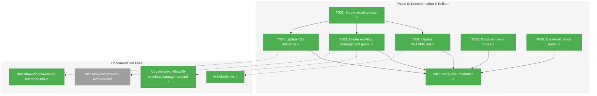
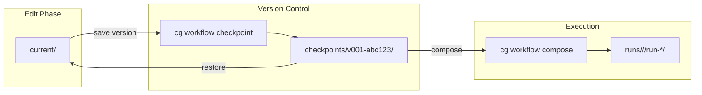
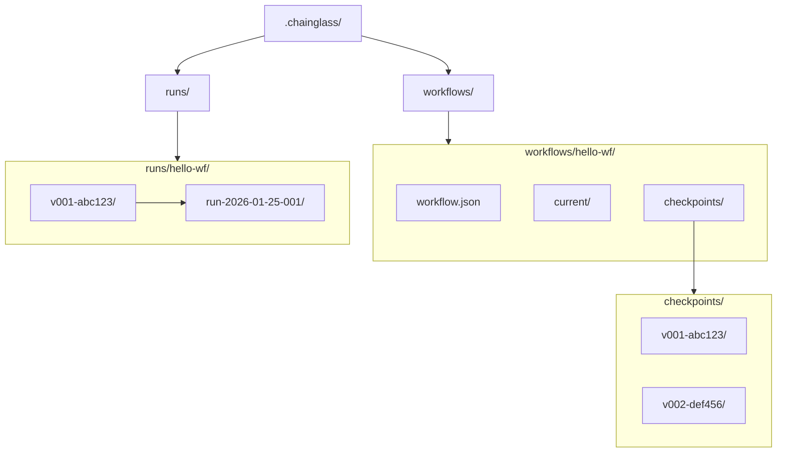

# Phase 6: Documentation & Rollout – Tasks & Alignment Brief

**Spec**: [../../manage-workflows-spec.md](../../manage-workflows-spec.md)
**Plan**: [../../manage-workflows-plan.md](../../manage-workflows-plan.md)
**Date**: 2026-01-25
**Testing Approach**: Lightweight (documentation phase)

---

## Executive Briefing

### Purpose
This phase documents the complete multi-workflow management system delivered in Phases 1-5. Users need comprehensive guides to understand the new template versioning, checkpoint workflow, and organized run storage. Without documentation, the powerful features remain undiscoverable.

### What We're Building
Documentation artifacts covering:
- **README.md update**: Add `cg init` to Quick Start section and document the new `cg workflow` command suite
- **Comprehensive workflow management guide** (`docs/how/workflows/5-workflow-management.md`): 1000+ words covering template structure, checkpoint workflow, restore flow, and error resolution
- **CLI reference update** (`docs/how/workflows/3-cli-reference.md`): Document all 6 new `cg workflow` subcommands
- **Error code documentation**: E030, E033-E039 with causes and remediation

### User Value
- New users can quickly set up projects with `cg init`
- Teams understand the checkpoint-based versioning model
- Error messages become actionable with documented remediation steps
- The lifecycle (`current/` → checkpoint → compose → run) is clearly explained

### Example
**Before Phase 6**: User runs `cg workflow checkpoint hello-wf` and doesn't understand what "checkpoint" means or where files go.

**After Phase 6**: User reads `5-workflow-management.md`, understands the `current/` → `checkpoints/<version>/` flow, knows checkpoints are immutable, and can compose runs from specific versions.

---

## Objectives & Scope

### Objective
Complete documentation for the multi-workflow management system per AC-01 through AC-24, enabling users to discover and effectively use all features delivered in Phases 1-5.

### Behavior Checklist
- [x] `cg init` documented with quick start example
- [x] `cg workflow list/info/checkpoint/restore/versions/compose` documented with syntax, options, examples
- [x] Error codes E030, E033-E039 documented with causes and remediation
- [x] Template versioning lifecycle explained (current/ → checkpoint → compose)
- [x] Versioned run path structure documented
- [x] Migration notes for users familiar with flat runs

### Goals

- ✅ Update README.md with `cg init` section and new workflow commands
- ✅ Create comprehensive `5-workflow-management.md` guide (1000+ words)
- ✅ Update `3-cli-reference.md` with all 6 `cg workflow` subcommands
- ✅ Document error codes E030, E033-E039 with actionable remediation
- ✅ Create migration notes for flat run → versioned run awareness
- ✅ Verify all documentation links work and examples are accurate

### Non-Goals

- ❌ Web UI documentation (deferred per spec)
- ❌ API reference documentation (CLI-focused phase)
- ❌ Tutorial videos or multimedia content
- ❌ Internationalization/translation
- ❌ Code changes (documentation only)
- ❌ Comprehensive error code glossary (only E030, E033-E039)

---

## Architecture Map

### Component Diagram
<!-- Status: grey=pending, orange=in-progress, green=completed, red=blocked -->
<!-- Updated by plan-6 during implementation -->



### Task-to-Component Mapping

<!-- Status: ⬜ Pending | 🟧 In Progress | ✅ Complete | 🔴 Blocked -->

| Task | Component(s) | Files | Status | Comment |
|------|-------------|-------|--------|---------|
| T001 | Research | docs/how/ | ✅ Complete | Understand existing structure |
| T002 | README | /README.md | ✅ Complete | Add init + workflow commands |
| T003 | Guide | /docs/how/workflows/5-workflow-management.md | ✅ Complete | Comprehensive guide |
| T004 | CLI Ref | /docs/how/workflows/3-cli-reference.md | ✅ Complete | Document 6 new commands |
| T005 | Errors | /docs/how/workflows/5-workflow-management.md | ✅ Complete | E030, E033-E039 |
| T006 | Migration | /docs/how/workflows/5-workflow-management.md | ✅ Complete | Flat → versioned awareness |
| T007 | Verification | All docs | ✅ Complete | Links, examples, test suite |

---

## Tasks

| Status | ID | Task | CS | Type | Dependencies | Absolute Path(s) | Validation | Subtasks | Notes |
|--------|------|------|-----|------|--------------|------------------|------------|----------|-------|
| [x] | T001 | Survey existing docs/how/ structure and identify update targets | 1 | Setup | – | /home/jak/substrate/007-manage-workflows/docs/how/ | List of files needing updates documented | – | |
| [x] | T002 | Update README.md with cg init and cg workflow sections | 2 | Doc | T001 | /home/jak/substrate/007-manage-workflows/README.md | README has cg init in Quick Start; workflow commands in CLI section | – | |
| [x] | T003 | Create docs/how/workflows/5-workflow-management.md | 3 | Doc | T001 | /home/jak/substrate/007-manage-workflows/docs/how/workflows/5-workflow-management.md | Guide is 1000+ words; covers template structure, checkpoint flow, restore | – | |
| [x] | T004 | Update 3-cli-reference.md with cg workflow commands | 2 | Doc | T001 | /home/jak/substrate/007-manage-workflows/docs/how/workflows/3-cli-reference.md | All 6 subcommands documented with syntax, options, examples | – | |
| [x] | T005 | Document error codes E030, E033-E039 | 2 | Doc | T001 | /home/jak/substrate/007-manage-workflows/docs/how/workflows/5-workflow-management.md | Each code has cause + remediation | – | |
| [x] | T006 | Create migration notes section | 1 | Doc | T001 | /home/jak/substrate/007-manage-workflows/docs/how/workflows/5-workflow-management.md | Legacy flat runs explained; versioned path documented | – | |
| [x] | T007 | Verify documentation accuracy and run full test suite | 1 | QA | T002, T003, T004, T005, T006 | /home/jak/substrate/007-manage-workflows/ | All links work; examples match implementation; 1038+ tests pass | – | |

---

## Alignment Brief

### Prior Phases Review

#### Phase-by-Phase Summary

**Phase 1: Core IWorkflowRegistry Infrastructure**
- Created `IWorkflowRegistry` interface with `list()`, `info()`, `getCheckpointDir()`, `checkpoint()`, `restore()`, `versions()` methods
- Created `IHashGenerator` interface and `HashGeneratorAdapter` for SHA-256 hashing
- Created `FakeWorkflowRegistry` with call capture and preset configuration
- Defined error codes E030, E033-E039
- Created CLI DI container factory (`createCliProductionContainer`, `createCliTestContainer`)
- 32 tests added

**Phase 2: Checkpoint & Versioning System**
- Implemented `checkpoint()` with ordinal generation (max+1 pattern for gap handling)
- Implemented content hash generation (8-char SHA-256 prefix)
- Implemented `restore()` with copy from checkpoint to current/
- Implemented `versions()` with descending sort
- Implemented duplicate content detection (E035)
- Implemented workflow.json auto-generation
- Extracted `generateWorkflowJson()` utility for Phase 4 reuse
- 44 tests added (checkpoint: 25, restore: 7, versions: 6, security: 6)

**Phase 3: Compose Extension for Versioned Runs**
- Extended `compose()` to require checkpoints (E034 if none)
- Implemented checkpoint resolution by ordinal or full version name
- Implemented versioned run paths: `.chainglass/runs/<slug>/<version>/<run>/`
- Extended `wf-status.json` with `slug`, `version_hash`, `checkpoint_comment`
- Updated `wf-status.schema.json` with new optional fields
- 13 tests added

**Phase 4: Init Command with Starter Templates**
- Created `IInitService` with `init()`, `isInitialized()`, `getInitializationStatus()`
- Created `FakeInitService` with call capture
- Extended `IFileSystem` with `copyDirectory()` method
- Created `cg init` command handler
- Created bundled starter template: `hello-workflow`
- Updated `esbuild.config.ts` to bundle assets
- 43 tests added (27 init service + 16 copyDirectory)

**Phase 5: CLI Commands**
- Created `cg workflow` command group with 6 subcommands
- Consolidated deprecated `cg wf` → `cg workflow`
- Added ConsoleOutputAdapter formatters for workflow.* commands
- Verified MCP tool exclusion (7 negative tests)
- 28 tests added (15 formatter + 7 MCP exclusion + 6 parser)

#### Cumulative Deliverables

**Interfaces (from @chainglass/shared)**:
- `IHashGenerator` - SHA-256 hashing
- `IFileSystem.copyDirectory()` - Recursive directory copy

**Interfaces (from @chainglass/workflow)**:
- `IWorkflowRegistry` - Template and checkpoint management
- `IInitService` - Project initialization

**Services**:
- `WorkflowRegistryService` - Full registry implementation
- `InitService` - Project initialization
- `WorkflowService.compose()` - Extended with checkpoint resolution

**Fakes**:
- `FakeHashGenerator`
- `FakeWorkflowRegistry`
- `FakeInitService`

**CLI Commands**:
- `cg init` - Initialize project
- `cg workflow list` - List workflows
- `cg workflow info <slug>` - Show workflow details
- `cg workflow checkpoint <slug>` - Create checkpoint
- `cg workflow restore <slug> <version>` - Restore checkpoint
- `cg workflow versions <slug>` - List versions
- `cg workflow compose <slug>` - Create run from checkpoint

**Error Codes**:
- E030: WORKFLOW_NOT_FOUND
- E033: VERSION_NOT_FOUND
- E034: NO_CHECKPOINT
- E035: DUPLICATE_CONTENT
- E036: INVALID_TEMPLATE
- E037: DIR_READ_FAILED
- E038: CHECKPOINT_FAILED
- E039: RESTORE_FAILED

**Key File Paths**:
- `/packages/shared/src/interfaces/hash-generator.interface.ts`
- `/packages/shared/src/adapters/hash-generator.adapter.ts`
- `/packages/workflow/src/interfaces/workflow-registry.interface.ts`
- `/packages/workflow/src/services/workflow-registry.service.ts`
- `/packages/workflow/src/interfaces/init-service.interface.ts`
- `/packages/workflow/src/services/init.service.ts`
- `/packages/workflow/src/fakes/fake-workflow-registry.ts`
- `/packages/workflow/src/fakes/fake-init-service.ts`
- `/apps/cli/src/commands/workflow.command.ts`
- `/apps/cli/src/commands/init.command.ts`
- `/apps/cli/src/lib/container.ts`
- `/apps/cli/assets/templates/workflows/hello-workflow/`

#### Cumulative Test Count
- Phase 1: 32 tests
- Phase 2: 44 tests
- Phase 3: 13 tests
- Phase 4: 43 tests
- Phase 5: 28 tests
- **Total New**: 160 tests
- **Project Total**: 1038 tests passing

### Critical Findings Affecting This Phase

| Finding | Impact on Documentation |
|---------|------------------------|
| **CD01: Error Code Collision** | Document E033-E039 range, explain E031-E032 skipped |
| **CD03: workflow.json Lifecycle** | Document auto-generation on first checkpoint |
| **CD04: CLI DI Container** | N/A (internal detail, not user-facing) |
| **MD13: wf-status.json Extension** | Document new fields: slug, version_hash, checkpoint_comment |

### ADR Decision Constraints

**ADR-0001: MCP Tool Design Patterns**
- NEG-005: "Tool curation pressure may conflict with feature requests"
- Impact: Document that workflow management commands are CLI-only, NOT available via MCP
- Addressed by: T003 (workflow management guide should note MCP exclusion)

**ADR-0002: Exemplar-Driven Development**
- IMP-001: Exemplars in `dev/examples/`
- Impact: Documentation can reference exemplar files for concrete examples
- Addressed by: T003 (can link to dev/examples/wf/ structures)

### Invariants & Guardrails

- All documentation must use actual command outputs, not fictional examples
- All error codes must have actionable remediation guidance
- No time estimates in documentation (per constitution)
- Links must be relative to repository root where possible

### Inputs to Read

| File | Purpose |
|------|---------|
| `/home/jak/substrate/007-manage-workflows/README.md` | Current state, identify update locations |
| `/home/jak/substrate/007-manage-workflows/docs/how/workflows/1-overview.md` | Current architecture diagrams |
| `/home/jak/substrate/007-manage-workflows/docs/how/workflows/3-cli-reference.md` | Current CLI documentation format |
| `/home/jak/substrate/007-manage-workflows/apps/cli/src/commands/workflow.command.ts` | Actual command help text |
| `/home/jak/substrate/007-manage-workflows/apps/cli/src/commands/init.command.ts` | Init command help text |
| `/home/jak/substrate/007-manage-workflows/packages/workflow/src/services/workflow-registry.service.ts` | Error codes and messages |

### Visual Alignment Aids

#### Workflow Lifecycle (for 5-workflow-management.md)



#### Directory Structure (for 5-workflow-management.md)



### Test Plan (Lightweight)

Since this is a documentation phase, no automated tests are written. Validation is manual:

| Validation | Method | Criteria |
|------------|--------|----------|
| Links work | Manual browser/IDE check | No 404s |
| Examples accurate | Run commands in terminal | Output matches documentation |
| No regressions | `just test` | All 1038+ tests pass |
| Build succeeds | `just build` | No errors |

### Step-by-Step Implementation Outline

1. **T001**: Read existing docs/how/ structure, list files to update
2. **T002**: Edit README.md:
   - Add `cg init` to Quick Start section
   - Add workflow commands to CLI Commands table
   - Update "Workflow Commands" section with checkpoint flow
3. **T003**: Create 5-workflow-management.md:
   - Template structure section
   - Checkpoint workflow section (with mermaid diagram)
   - Restore flow section
   - Error codes section (E030, E033-E039)
   - Versioned run structure section
4. **T004**: Update 3-cli-reference.md:
   - Add `cg init` command
   - Add `cg workflow list/info/checkpoint/restore/versions/compose` commands
   - Update Command Overview table
5. **T005**: Add error code documentation to 5-workflow-management.md
6. **T006**: Add migration notes section to 5-workflow-management.md
7. **T007**: Verify all documentation:
   - Check all internal links
   - Run `just test` to ensure no regressions
   - Test example commands in terminal

### Commands to Run

```bash
# Pre-flight verification
just test                    # All tests should pass
just typecheck               # No type errors
just build                   # Build succeeds

# Verify CLI commands work for documentation
node apps/cli/dist/cli.cjs --help
node apps/cli/dist/cli.cjs init --help
node apps/cli/dist/cli.cjs workflow --help
node apps/cli/dist/cli.cjs workflow list --help
node apps/cli/dist/cli.cjs workflow info --help
node apps/cli/dist/cli.cjs workflow checkpoint --help
node apps/cli/dist/cli.cjs workflow restore --help
node apps/cli/dist/cli.cjs workflow versions --help
node apps/cli/dist/cli.cjs workflow compose --help

# Post-documentation verification
just test                    # Still all pass
```

### Risks/Unknowns

| Risk | Severity | Mitigation |
|------|----------|------------|
| Documentation drifts from implementation | Medium | Use actual command outputs; verify examples work |
| Links break with future refactoring | Low | Use relative links where possible |
| Examples become outdated | Low | Keep examples simple; tie to stable interfaces |

### Ready Check

- [x] All prior phase execution logs reviewed (synthesized above)
- [x] Error codes E030, E033-E039 identified and ready to document
- [x] Existing documentation structure understood
- [x] ADR constraints noted (MCP exclusion, exemplar references)
- [x] No unresolved questions about documentation scope

---

## Phase Footnote Stubs

_To be populated during implementation by plan-6._

| Diff-Touched Path | Footnote Tag | Plan Ledger Entry |
|-------------------|--------------|-------------------|
| | | |

---

## Evidence Artifacts

Implementation artifacts:
- `PHASE_DIR/execution.log.md` - Detailed implementation log ✓

Documentation files delivered:
- ✓ Updated `/README.md`
- ✓ New `/docs/how/workflows/5-workflow-management.md` (1476 words)
- ✓ Updated `/docs/how/workflows/3-cli-reference.md`
- ✓ Updated `/docs/how/workflows/1-overview.md`

Verification results:
- All 1038 tests pass
- TypeCheck clean
- All documentation links verified

---

## Discoveries & Learnings

_Populated during implementation by plan-6. Log anything of interest to your future self._

| Date | Task | Type | Discovery | Resolution | References |
|------|------|------|-----------|------------|------------|
| | | | | | |

**Types**: `gotcha` | `research-needed` | `unexpected-behavior` | `workaround` | `decision` | `debt` | `insight`

**What to log**:
- Things that didn't work as expected
- External research that was required
- Implementation troubles and how they were resolved
- Gotchas and edge cases discovered
- Decisions made during implementation
- Technical debt introduced (and why)
- Insights that future phases should know about

_See also: `execution.log.md` for detailed narrative._

---

## Directory Layout

```
docs/plans/007-manage-workflows/
├── manage-workflows-spec.md
├── manage-workflows-plan.md
└── tasks/
    └── phase-6-documentation-rollout/
        ├── tasks.md              # This file
        └── execution.log.md      # Created by plan-6
```

---

*Generated by plan-5-phase-tasks-and-brief on 2026-01-25*
