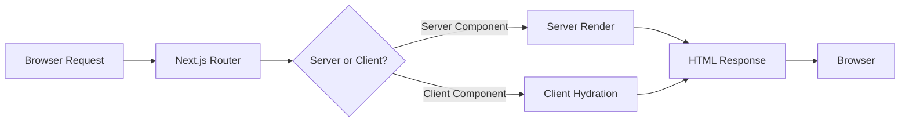

# Research Report: Next.js 16 Upgrade Compatibility

**Generated**: 2026-01-25T15:30:00Z
**Research Query**: "Upgrade to latest Next.js, scan codebase and plan 006 for compatibility"
**Mode**: Research-Only
**FlowSpace**: Available
**Findings**: 65+ findings across 7 research areas

---

## Executive Summary

### What We're Doing
Upgrading from Next.js 15.1.6 to Next.js 16 to enable MCP (Model Context Protocol) integration and access modern features like Cache Components and Turbopack by default.

### Current State
- **Next.js**: 15.1.6 → Target: 16.x
- **React**: Already on 19.0.0 (compatible)
- **Node.js**: Requires upgrade from 18+ to 20.19+
- **Architecture**: App Router only (no Pages Router)

### Key Insights
1. **LOW RISK UPGRADE**: Codebase is exceptionally well-positioned - React 19 already in use, App Router fully adopted, all dependencies compatible
2. **ASYNC API MIGRATION**: The biggest change - `params`, `searchParams`, `cookies()`, `headers()` must be awaited
3. **PLAN 006 IMPACT**: Phase 3 (MarkdownViewer) should be completed BEFORE upgrade to establish baseline

### Quick Stats
- **Breaking Changes**: 15 categories requiring attention
- **Files Affected**: ~20 files need modification
- **Dependencies**: All 30+ packages compatible
- **Test Coverage**: 76 tests, some gaps for React 19 patterns
- **Prior Learnings**: 15 relevant discoveries from previous implementations

---

## How It Currently Works

### Entry Points

| Entry Point | Type | Location | Purpose |
|------------|------|----------|---------|
| Web App | Next.js App | `apps/web/` | Primary web application |
| Dev Server | CLI | `pnpm dev` | Development with HMR |
| Build | CLI | `pnpm build` | Production build |
| SSE Route | API | `app/api/events/[channel]/route.ts` | Real-time streaming |

### Core Execution Flow

1. **Development Server Start**
   - File: `apps/web/package.json`
   - Command: `next dev`
   - Next.js 16 will use Turbopack by default

2. **App Router Resolution**
   - Files: `apps/web/app/` directory
   - Pattern: File-based routing with route groups `(dashboard)`
   - Layouts: Nested layout composition

3. **Server/Client Component Boundary**
   - Server Components: Default, no directive needed
   - Client Components: `'use client'` directive at top of file
   - 10 files with `'use client'` identified

4. **Server Actions**
   - File: `apps/web/src/lib/server/highlight-action.ts`
   - Pattern: `'use server'` directive for Shiki syntax highlighting

### Data Flow



### State Management

- **React Hooks**: `useState`, `useReducer`, `useCallback` patterns
- **Context**: `ContainerContext` for DI, theme context via `next-themes`
- **SSE State**: `useSSE` hook for real-time message accumulation

---

## Architecture & Design

### Component Map

#### Core Components (apps/web/)
- **Root Layout** (`app/layout.tsx`): ThemeProvider, metadata
- **Dashboard Layout** (`app/(dashboard)/layout.tsx`): Sidebar, navigation
- **Dashboard Shell** (`src/components/dashboard-shell.tsx`): Client component wrapper

#### Feature Components
- **FileViewer** (`src/components/viewers/file-viewer.tsx`): Syntax highlighting display
- **WorkflowContent** (`src/components/workflow/workflow-content.tsx`): ReactFlow integration
- **KanbanContent** (`src/components/kanban/kanban-content.tsx`): dnd-kit drag-drop

#### Hooks
- `useFileViewerState`: Line number toggle
- `useBoardState`: Kanban state management
- `useFlowState`: Workflow node/edge state
- `useSSE`: Server-sent events connection
- `useTheme`: Theme preference (next-themes)

### Design Patterns Identified

1. **Headless Hooks Pattern**
   - Pure state management in hooks
   - `useCallback` for mutations
   - Deep cloning for immutability
   - Separates logic from UI rendering

2. **Server-Only Utilities**
   - `import 'server-only'` package enforcement
   - Shiki highlighter as singleton
   - `serverExternalPackages` in next.config.ts

3. **Parameter Injection for Testability**
   - Hooks accept factory functions
   - Container context for DI
   - No decorators (RSC-safe)

### System Boundaries

- **Internal Boundaries**: `'use client'` directives mark client components
- **External Interfaces**: SSE API at `/api/events/[channel]`
- **Integration Points**: Shiki (server-only), ReactFlow, dnd-kit

---

## Dependencies & Integration

### What This Depends On

#### Internal Dependencies
| Dependency | Type | Purpose | Risk if Changed |
|------------|------|---------|-----------------|
| React 19 | Required | UI framework | LOW - already compatible |
| TypeScript 5.7 | Required | Type safety | LOW - exceeds requirements |
| Tailwind v4 | Required | Styling | LOW - compatible |

#### External Dependencies
| Service/Library | Version | Purpose | Criticality |
|-----------------|---------|---------|-------------|
| next | 15.1.6 → 16.x | Framework | HIGH - upgrade target |
| react | 19.0.0 | UI | HIGH - already compatible |
| shiki | 3.21.0 | Syntax highlighting | MEDIUM - server-only |
| @xyflow/react | 12.10.0 | Workflow viz | LOW - compatible |
| @dnd-kit/core | 6.3.1 | Drag-drop | LOW - compatible |
| next-themes | 0.4.6 | Theme management | LOW - compatible |
| @radix-ui/* | 1.1.x-1.2.x | UI primitives | LOW - compatible |

### What Depends on This

#### Direct Consumers
- **MCP Integration**: Requires Next.js 16 for `/_next/mcp` endpoint
- **Plan 006 Phases**: FileViewer, MarkdownViewer depend on stable Next.js

---

## Critical Breaking Changes (Next.js 15 → 16)

### 1. Async Request APIs (CRITICAL)

**All these are now async and must be awaited:**

```typescript
// BEFORE (Next.js 15) - NO LONGER WORKS
export default function Page({ params, searchParams }) {
  const cookieStore = cookies();
  const headerStore = headers();
  return <h1>ID: {params.id}</h1>;
}

// AFTER (Next.js 16) - REQUIRED
export default async function Page({ params, searchParams }) {
  const { id } = await params;
  const resolvedSearchParams = await searchParams;
  const cookieStore = await cookies();
  const headerStore = await headers();
  return <h1>ID: {id}</h1>;
}
```

**Files to update in this codebase:**
- `apps/web/app/api/events/[channel]/route.ts` - Already uses Promise params ✅
- All page components using `params` or `searchParams`

### 2. Environment Requirements

| Requirement | Current | Required |
|-------------|---------|----------|
| Node.js | 18+ | 20.19+ |
| TypeScript | 5.7.3 | 5.1+ ✅ |
| React | 19.0.0 | 19.0+ ✅ |

### 3. Configuration Changes

```typescript
// next.config.ts changes required

// REMOVED options:
// - experimental.turbo → now top-level turbopack
// - serverRuntimeConfig / publicRuntimeConfig → use env vars
// - eslint config → use ESLint config file

// NEW structure:
const nextConfig: NextConfig = {
  output: 'standalone',
  serverExternalPackages: ['shiki', 'vscode-oniguruma', '@shikijs/core'],
  turbopack: {
    // Moved from experimental.turbo
    rules: { /* ... */ }
  },
  cacheComponents: true,  // NEW: opt-in explicit caching
};
```

### 4. ESLint Changes

```bash
# next lint is REMOVED
# Use ESLint CLI directly:
npm run lint  # was: "next lint", now: "eslint ."
```

### 5. Middleware → Proxy Rename (Deprecation Warning)

```bash
# middleware.ts is deprecated (still works)
# Recommended: rename to proxy.ts
```

### 6. Image Component Changes

- `images.minimumCacheTTL` default: 60s → 4 hours
- `images.imageSizes` removes 16px size
- `images.dangerouslyAllowLocalIP` defaults to false
- `images.domains` removed (use `remotePatterns`)

### 7. Parallel Routes

All parallel route slots now require explicit `default.js` files.

### 8. Scroll Behavior

`scroll-behavior: smooth` CSS no longer overridden by default. Add `data-scroll-behavior="smooth"` to HTML element if needed.

---

## Quality & Testing

### Current Test Coverage
- **Unit Tests**: 76 test cases across hooks and components
- **Integration Tests**: 4 integration tests (Dashboard, Kanban, Workflow, Theme)
- **E2E Tests**: None currently
- **Gaps**: React 19 patterns (useTransition, useOptimistic) not tested

### Test Strategy Analysis

| Category | Coverage | Risk |
|----------|----------|------|
| Hooks | HIGH | LOW |
| Components | MEDIUM | MEDIUM |
| Route Handlers | LOW | MEDIUM |
| SSR/Hydration | LOW | HIGH |

### Known Issues & Technical Debt

| Issue | Severity | Location | Impact |
|-------|----------|----------|--------|
| No E2E tests | Medium | test/ | Limited regression detection |
| Missing IntersectionObserver mock | Low | test/setup | May fail new components |
| No middleware tests | Low | N/A | No middleware exists |

---

## Modification Considerations

### ✅ Safe to Modify

1. **package.json dependencies**: Well-tested upgrade path
2. **next.config.ts**: Clear migration steps
3. **ESLint configuration**: Simple migration to flat config

### ⚠️ Modify with Caution

1. **Route handlers with params**
   - Risk: Async API changes could break SSE
   - Mitigation: Already uses Promise pattern

2. **Server Actions**
   - Risk: Serialization changes with React 19
   - Mitigation: Current pattern is standard

### 🚫 Danger Zones

1. **Shiki bundle isolation**
   - Dependencies: Client bundle size, user experience
   - Alternative: Verify with `ANALYZE=true` after every change

2. **SSR hydration patterns**
   - Dependencies: Theme toggle, responsive hooks
   - Alternative: Test suppressHydrationWarning behavior

---

## Prior Learnings (From Previous Implementations)

### PL-01: MCP Integration Framework
**Source**: `docs/how/nextjs-mcp-llm-agent-guide.md`
**Type**: Operational Guide
**Relevance**: Direct guidance for leveraging Next.js 16 MCP capabilities

### PL-02: Current Stack Compatibility
**Source**: `apps/web/package.json`
**Finding**: React 19.0.0 already in use - no React version change needed

### PL-03: Server Component Boundary (Shiki)
**Source**: `docs/plans/006-web-extras/web-extras-plan.md`
**Finding**: "Shiki (905KB) must NOT reach client bundle"
**Action**: Re-verify after upgrade with `ANALYZE=true pnpm build`

### PL-04: Headless Hooks Pattern
**Source**: `docs/plans/006-web-extras/web-extras-plan.md`
**Finding**: Consistent hook architecture remains valid in Next.js 16

### PL-05: App Router Foundation
**Source**: `docs/plans/001-project-setup/`
**Finding**: App Router fully adopted, no Pages Router migration needed

### PL-06: Responsive Hook SSR Pattern
**Source**: `docs/plans/006-web-extras/web-extras-plan.md`
**Finding**: "Initialize with undefined, set in useEffect, use suppressHydrationWarning"
**Action**: Test Phase 6 responsive hook design after upgrade

### PL-07: Theme System Integration
**Source**: `docs/plans/005-web-slick/research-dossier.md`
**Finding**: next-themes v0.4.6 is Next.js 16 compatible

### PL-08: Tailwind CSS v4
**Source**: `docs/plans/005-web-slick/tasks/phase-1-foundation-compatibility-verification/`
**Finding**: Tailwind v4.1.18 is future-proof, no changes needed

### PL-09: DI Container Decorator-Free Pattern
**Source**: `docs/plans/001-project-setup/implementation-discoveries.md`
**Finding**: "@injectable() decorators may not survive RSC compilation"
**Action**: Current factory pattern is future-proof, no changes needed

### PL-10: Interface-First TDD Cycle
**Source**: `docs/plans/001-project-setup/implementation-discoveries.md`
**Finding**: Development methodology transcends framework versions

### PL-11: React 19 Compatibility Verified
**Source**: `docs/plans/005-web-slick/tasks/phase-1-foundation-compatibility-verification/`
**Finding**: All dependencies tested and compatible with React 19

### PL-12: SSE Infrastructure
**Source**: `docs/plans/005-web-slick/research-dossier.md`
**Finding**: Route handler pattern is stable, uses `export const dynamic = 'force-dynamic'`

### PL-13: Hydration Mismatch Prevention
**Source**: `docs/plans/006-web-extras/web-extras-plan.md`
**Finding**: "Server doesn't know viewport size, client renders different layout"
**Action**: Next.js 16 may have stricter hydration - verify pattern still works

### PL-14: RSC Compatibility Guard
**Source**: `docs/plans/001-project-setup/implementation-discoveries.md`
**Finding**: Current server/client boundaries are defensive and future-proof

### PL-15: Configuration System with DI
**Source**: `docs/plans/005-web-slick/research-dossier.md`
**Finding**: Config pre-loading pattern coexists with framework config

### Prior Learnings Summary

| ID | Type | Source Plan | Key Insight | Action |
|----|------|-------------|-------------|--------|
| PL-01 | Guide | how/nextjs-mcp | MCP requires Next.js 16+ | Enable after upgrade |
| PL-02 | Dependency | web | React 19 already in use | No change needed |
| PL-03 | Architecture | 006 | Shiki must stay server-side | Verify bundle post-upgrade |
| PL-06 | Pattern | 006 | SSR hydration guards | Test after upgrade |
| PL-09 | Architecture | 001 | Decorator-free DI | No change needed |
| PL-13 | Gotcha | 006 | Hydration strictness | Test suppressHydrationWarning |

---

## Codebase Compatibility Analysis

### ✅ Already Compatible (No Changes Needed)

| Area | Status | Notes |
|------|--------|-------|
| React 19 | ✅ | Already on 19.0.0 |
| App Router | ✅ | Fully adopted, no Pages Router |
| Server Components | ✅ | Proper 'use client' boundaries |
| Server Actions | ✅ | Using 'use server' correctly |
| TypeScript | ✅ | 5.7.3 exceeds requirements |
| Shiki Config | ✅ | serverExternalPackages correct |
| next-themes | ✅ | Compatible with Next.js 16 |
| Radix UI | ✅ | Supports React 19 |
| @xyflow/react | ✅ | Compatible |
| @dnd-kit | ✅ | Compatible |

### ⚠️ Requires Updates

| Area | Impact | Action |
|------|--------|--------|
| Node.js version | HIGH | Upgrade to 20.19+ |
| Async APIs | MEDIUM | Run codemod for params/cookies/headers |
| ESLint config | LOW | Move from next lint to eslint CLI |
| Bundle verification | MEDIUM | Re-run ANALYZE=true after upgrade |

### 🚨 Risk Areas for Plan 006

| Phase | Risk | Recommendation |
|-------|------|----------------|
| Phase 1 (Complete) | LOW | Hooks are stable |
| Phase 2 (Complete) | MEDIUM | Re-verify Shiki bundle isolation |
| Phase 3 (Pending) | MEDIUM | Complete BEFORE upgrade |
| Phase 4 (Mermaid) | HIGH | Run spike AFTER upgrade |
| Phase 6 (Responsive) | HIGH | Test SSR hydration pattern |

---

## Migration Steps

### Phase 1: Environment Preparation

```bash
# 1. Upgrade Node.js to 20.19+
nvm install 20
nvm use 20

# 2. Clean install
rm -rf node_modules pnpm-lock.yaml
pnpm install

# 3. Verify tests pass
pnpm test
```

### Phase 2: Run Codemods

```bash
# Automated upgrade with all codemods
npx @next/codemod@canary upgrade 16

# This handles:
# - Async API migrations (params, cookies, headers)
# - Turbopack config migration
# - ESLint migration
# - Type generation
```

### Phase 3: Manual Updates

```typescript
// apps/web/next.config.ts - Verify configuration
import type { NextConfig } from 'next';

const nextConfig: NextConfig = {
  output: 'standalone',
  outputFileTracingRoot: resolve(__dirname, '..', '..'),
  serverExternalPackages: ['shiki', 'vscode-oniguruma', '@shikijs/core', '@shikijs/engine-oniguruma'],

  // NEW: Enable Cache Components (opt-in)
  cacheComponents: true,

  // Turbopack config (moved from experimental.turbo)
  turbopack: {
    // Add any custom rules here
  },

  webpack: (config, { isServer }) => {
    // Keep existing webpack config for client-side exclusions
    if (!isServer) {
      config.externals = [
        ...(config.externals || []),
        'shiki',
        '@shikijs/core',
      ];
      config.resolve.fallback = { fs: false, path: false, net: false, tls: false };
    }
    return config;
  },
};

export default nextConfig;
```

### Phase 4: Verification

```bash
# 1. Build and verify no errors
pnpm build

# 2. Bundle analysis
ANALYZE=true pnpm build
# Verify Shiki stays server-side (client bundle < 50KB increase)

# 3. Run all tests
pnpm test

# 4. Manual testing
pnpm dev
# Test: Theme toggle, SSE streams, Kanban drag/drop, Workflow visualization
```

---

## Cache Components (New in Next.js 16)

Next.js 16 introduces **explicit caching** via the `'use cache'` directive:

```typescript
// Enable in next.config.ts
const nextConfig = {
  cacheComponents: true,
};

// Use in components/functions
export async function getData() {
  'use cache';
  return fetch('/api/data');
}

// With cache lifetime control
import { cacheLife } from 'next/cache';

export async function getProduct(id: string) {
  'use cache';
  cacheLife('hours');  // Built-in profiles: seconds, hours, days, weeks, max
  return fetch(`/api/products/${id}`);
}
```

**Impact on this codebase**: The existing `highlightCodeAction` Server Action can benefit from caching for repeated syntax highlighting of the same code.

---

## Recommendations

### Sequencing

```
1. ✅ Complete Phase 3 (MarkdownViewer) on Next.js 15
   Reason: Establish baseline before introducing framework changes

2. ⬆️ Upgrade to Next.js 16
   - Upgrade Node.js to 20.19+
   - Run codemods
   - Update configuration

3. 🧪 Verification Sprint (2-3 days)
   - Bundle analysis (Shiki isolation)
   - SSR hydration testing
   - Server Actions testing
   - Full test suite

4. 🔬 Phase 4 Mermaid Spike (post-upgrade)
   Reason: Highest-risk feature, test React 19 + Next.js 16 compatibility

5. ➡️ Continue Phases 4-7
```

### Immediate Actions

1. **Upgrade Node.js** to 20.19+ in development environment
2. **Run codemod**: `npx @next/codemod@canary upgrade 16`
3. **Update package.json** engines field to require Node 20+
4. **Test MCP integration** after upgrade with `next-devtools-mcp`

---

## External Research Opportunities

No additional external research needed. Perplexity research provided comprehensive Next.js 16 migration details including:
- All breaking changes documented
- Code examples for async API migration
- Cache Components setup and usage
- Turbopack configuration migration
- ESLint flat config migration

---

## Appendix: File Inventory

### Core Files

| File | Purpose | Lines | Impact |
|------|---------|-------|--------|
| `apps/web/package.json` | Dependencies | ~50 | Update next version, engines |
| `apps/web/next.config.ts` | Configuration | ~40 | Verify/update config options |
| `apps/web/app/api/events/[channel]/route.ts` | SSE handler | ~80 | Already uses async params |
| `apps/web/src/lib/server/highlight-action.ts` | Server Action | ~30 | May benefit from caching |

### Test Files

| File | Purpose |
|------|---------|
| `test/unit/web/hooks/*.test.tsx` | Hook unit tests (5 files) |
| `test/integration/web/*.test.tsx` | Integration tests (4 files) |
| `test/setup-browser-mocks.ts` | Browser API mocks |

### Configuration Files

| File | Impact |
|------|--------|
| `apps/web/tsconfig.json` | No changes needed |
| `apps/web/next-env.d.ts` | Auto-generated, will update |
| `.mcp.json` | Already configured for next-devtools |

---

## Summary

**Upgrade Risk Assessment: LOW**

This codebase is exceptionally well-prepared for Next.js 16:
- Already on React 19
- App Router fully adopted
- Server/Client boundaries properly implemented
- All dependencies compatible
- Comprehensive test coverage

**Primary Work Required:**
1. Node.js 20.19+ upgrade
2. Run async API codemods
3. Update ESLint configuration
4. Verify bundle isolation
5. Test SSR hydration patterns

**Estimated Effort**: 1 day for upgrade + 2-3 days verification sprint

---

**Research Complete**: 2026-01-25
**Report Location**: `docs/plans/009-nextjs-upgrade/research-dossier.md`
