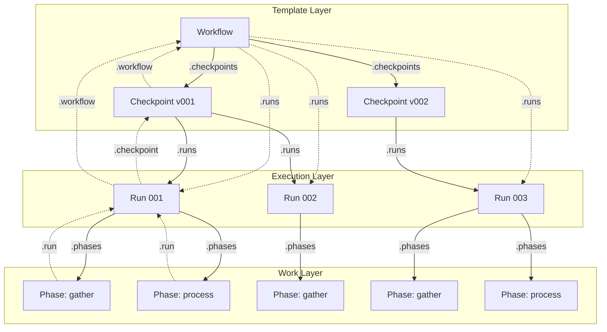
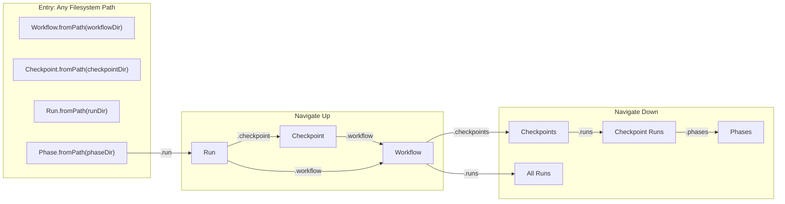
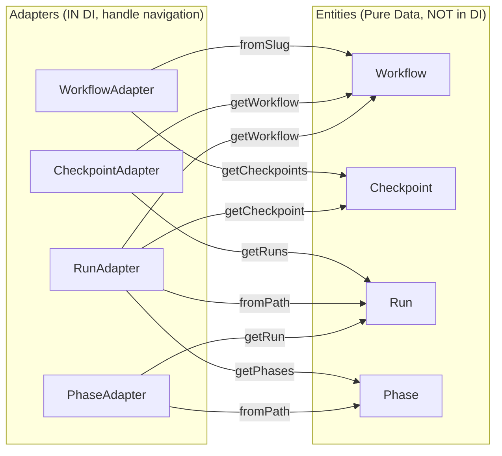
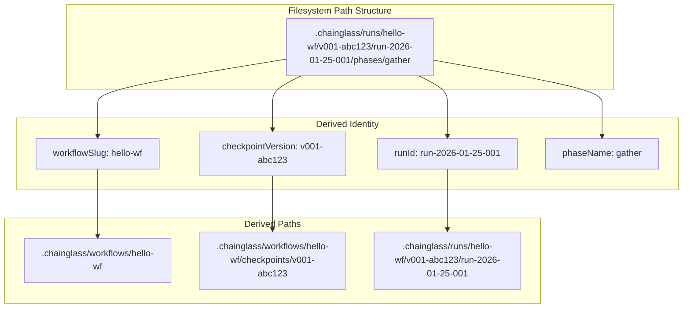
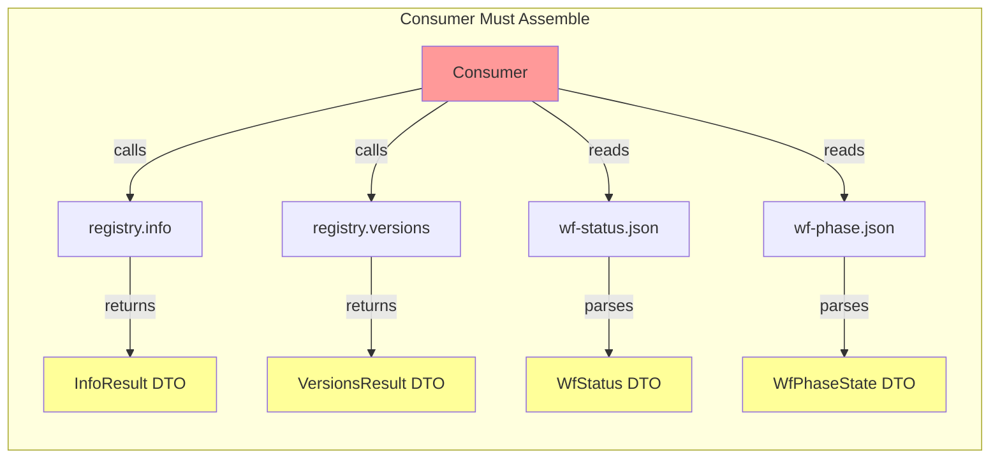
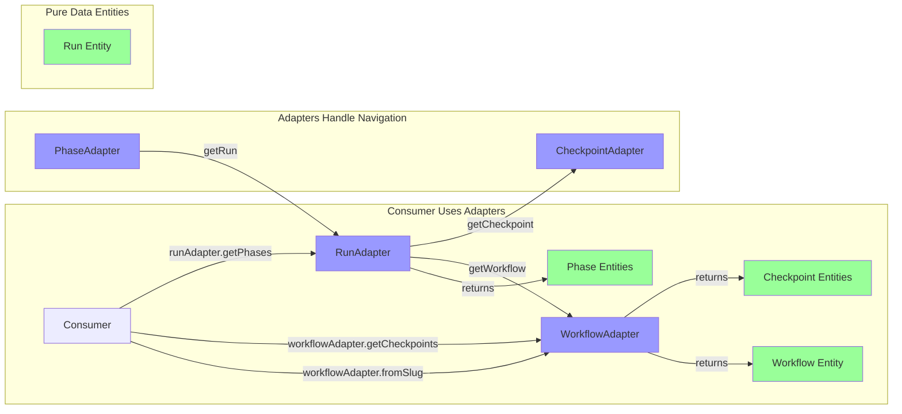

# Entity Graph Architecture for Workflow Management

**Plan**: 010-entity-upgrade
**Created**: 2026-01-26
**Status**: Draft
**Mode**: Full

---

## Research Context

This specification incorporates findings from `research-dossier.md`.

- **Components Affected**: `packages/workflow/src/` (entities, adapters, services), `apps/cli/src/commands/`
- **Critical Dependencies**: IFileSystem, IPathResolver, IYamlParser adapters (all exist)
- **Modification Risks**: Services currently return DTOs; must maintain backward compatibility during transition
- **Key Finding**: No entity classes exist today. Workflow, Run, and Phase are "diffuse concepts" expressed via service calls and scattered JSON files. No `fromPath()` hydration anywhere.

See `research-dossier.md` for full analysis (82 findings across 7 research domains).

---

## Summary

**WHAT**: Create a navigable entity graph for Workflows, Checkpoints, Runs, and Phases that can be entered from any filesystem path and traversed bidirectionally.

**WHY**:
1. Current architecture requires mentally assembling entities from scattered service calls and JSON files
2. `cg runs list` is impossible without entities that know how to discover themselves
3. Web integration requires serializable objects (`toJSON()`) not ad-hoc DTO mapping
4. Testing entity invariants is impossible when entities don't exist

---

## Goals

1. **Pure data entities**: Workflow, Checkpoint, Run, and Phase are instantiable classes with identity and computed properties - NO adapter references, NOT in DI
2. **Adapters handle navigation**: Adapters (in DI) create entities and handle all expansion/navigation via methods like `runAdapter.getWorkflow(run)`
3. **Enter from any point**: Load a Phase directly from its folder via `phaseAdapter.fromPath()` and expand up to Run, Checkpoint, Workflow
4. **On-demand expansion**: Children/parents loaded via adapter calls, never stored on entities - no caching, always fresh reads
5. **Run discovery**: `cg runs list` command using `runAdapter.list(filter)`
6. **Web-ready serialization**: `toJSON()` on every entity is trivial (pure data, no adapter refs to exclude)
7. **Service integration**: Services use adapters; adapters return pure entities

---

## Non-Goals

1. **Plugin/extension system**: All entities are hardcoded, first-class citizens
2. **Complex DDD patterns**: No aggregates, bounded contexts, or event sourcing
3. **Database persistence**: Entities hydrate from filesystem only
4. **Breaking existing CLI**: Maintain backward compatibility for existing commands
5. **Full kubectl parity**: Only adopt patterns that fit our domain (no namespaces, selectors, etc.)

---

## Entity Graph Model

### Graph Structure



**Legend**:
- Solid arrows: Child navigation (lazy-loaded)
- Dashed arrows: Parent navigation (path-derived)

### Entry Points



### Expansion Pattern (Adapter-Driven Navigation)



**Key Principle**: Entities never hold adapter references. Navigation always goes through adapters:

```typescript
// Entities: pure data
class Run {
  constructor(
    readonly runId: string,
    readonly runDir: string,
    readonly workflowSlug: string,      // For adapter to derive parent
    readonly checkpointVersion: string,  // For adapter to derive parent
    readonly status: RunStatus,
    readonly createdAt: Date
  ) {}

  get isComplete(): boolean { return this.status === 'complete'; }
  toJSON(): object { /* trivial - no adapters to exclude */ }
}

// Adapters: in DI, handle expansion
class RunAdapter {
  constructor(
    private readonly fs: IFileSystem,
    private readonly workflowAdapter: IWorkflowAdapter,
    private readonly phaseAdapter: IPhaseAdapter
  ) {}

  async fromPath(runDir: string): Promise<Run> { /* returns pure data */ }
  async getWorkflow(run: Run): Promise<Workflow> { /* expand to parent */ }
  async getPhases(run: Run): Promise<Phase[]> { /* expand to children */ }
}
```

### Path-Based Parent Derivation



---

## Complexity

**Score**: CS-3 (medium)

**Breakdown**:
| Dimension | Score | Rationale |
|-----------|-------|-----------|
| Surface Area (S) | 2 | New entities, adapters, CLI commands across packages/workflow and apps/cli |
| Integration (I) | 1 | Uses existing IFileSystem, IPathResolver, IYamlParser adapters |
| Data/State (D) | 0 | No schema changes; reads existing JSON files |
| Novelty (N) | 1 | Entity pattern is new but well-understood; some design decisions needed |
| Non-Functional (F) | 0 | Standard performance requirements |
| Testing/Rollout (T) | 1 | Integration tests for graph navigation; no feature flags needed |

**Total**: 5 → CS-3

**Confidence**: 0.85
- High confidence on entity design (research validated current gaps)
- Moderate uncertainty on service integration scope

**Assumptions**:
1. Existing adapters (IFileSystem, etc.) sufficient for entity hydration
2. Path conventions stable (no changes to folder structure)
3. Services can be incrementally updated to use adapters

**Dependencies**:
- None blocking; all adapters exist

**Risks**:
1. **Adapter injection complexity**: Entities need adapters for navigation; DI required
2. **Circular references**: Workflow ↔ Checkpoint ↔ Run could create memory issues if not lazy
3. **Cache staleness**: Entities cache children; mutations via services invalidate caches

**Suggested Phases**:
1. Phase A: Entity & Adapter Foundation (entities, adapters, tests)
2. Phase B: Runs CLI Commands (`cg runs list/get`)
3. Phase C: Service Refactor (services use adapters)
4. Phase D: CLI Polish (aliases, context)
5. Phase E: Web Integration (REST routes, hooks)

---

## Acceptance Criteria

### Entity Foundation (Pure Data + Adapter Navigation)

**AC-01**: Given a workflow exists at `.chainglass/workflows/hello-wf/`, when I call `workflowAdapter.fromSlug('hello-wf')`, then I receive a Workflow entity with `slug`, `name`, `version`, and `phaseDefinitions` properties (pure data, no adapter refs).

**AC-02**: Given a Workflow entity, when I call `workflowAdapter.getCheckpoints(workflow)`, then I receive an array of Checkpoint entities sorted by ordinal descending (newest first).

**AC-03**: Given a Checkpoint entity, when I call `checkpointAdapter.getRuns(checkpoint)`, then I receive an array of Run entities created from that checkpoint version.

**AC-04**: Given a Run entity, when I call `runAdapter.getPhases(run)`, then I receive an array of Phase entities with `name`, `order`, `status`, and duration helpers.

### Bidirectional Navigation (via Adapters)

**AC-05**: Given a Phase loaded via `phaseAdapter.fromPath(phaseDir)`, when I call `phaseAdapter.getRun(phase)`, then I receive the parent Run entity (derived from filesystem path).

**AC-06**: Given a Run entity, when I call `runAdapter.getCheckpoint(run)`, then I receive the Checkpoint entity that was used to create this run.

**AC-07**: Given a Run entity, when I call `runAdapter.getWorkflow(run)`, then I receive the Workflow entity (derived from `workflowSlug` in path).

**AC-08**: Given a Checkpoint entity, when I call `checkpointAdapter.getWorkflow(checkpoint)`, then I receive the parent Workflow entity.

### Entry From Any Point

**AC-09**: Given a phase folder path `.chainglass/runs/hello-wf/v001-abc/run-001/phases/gather`, when I call `phaseAdapter.fromPath(phaseDir)`, then I can expand via `phaseAdapter.getRun(phase)` then `runAdapter.getWorkflow(run)` to arrive at the `hello-wf` Workflow entity.

**AC-10**: Given a run folder path, when I call `runAdapter.fromPath(runDir)`, then I can expand up (`runAdapter.getWorkflow(run)`) and down (`runAdapter.getPhases(run)`) without prior context.

### CLI Commands

**AC-11**: Given runs exist under `.chainglass/runs/`, when I run `cg runs list`, then I see a table of all runs with columns: NAME, WORKFLOW, VERSION, STATUS, AGE.

**AC-12**: Given runs exist, when I run `cg runs list --workflow hello-wf`, then I see only runs for that workflow.

**AC-13**: Given runs exist, when I run `cg runs list --status failed`, then I see only failed runs.

**AC-14**: Given runs exist, when I run `cg runs list -o json`, then I receive JSON array of run objects with `toJSON()` output.

**AC-15**: Given a specific run exists, when I run `cg runs get run-2026-01-25-001`, then I see detailed run information including phases and progress.

### Fresh Reads (No Caching)

**AC-16**: Given a Workflow entity, when I call `workflow.checkpoints()` twice, then both calls read from filesystem (no caching).

**AC-17**: Given a new checkpoint was created via service after loading a Workflow, when I call `workflow.checkpoints()`, then the new checkpoint is included (always fresh).

### Serialization

**AC-18**: Given any entity (Workflow, Checkpoint, Run, Phase), when I call `entity.toJSON()`, then I receive a plain object suitable for `JSON.stringify()`.

**AC-19**: Given a Run entity, when I call `run.toFullJSON()`, then the output includes nested `phases` array and `progress` object.

---

## Risks & Assumptions

### Risks

| Risk | Impact | Mitigation |
|------|--------|------------|
| Adapter injection in entities | Entities need adapters to navigate; complex constructors | Use factory methods in adapters; entities receive adapters via constructor |
| Memory from deep graph traversal | Traversing full graph could be expensive | No caching means each call is independent; no accumulated memory |
| Filesystem read overhead | No caching means repeated reads | Acceptable for CLI/web request-response; filesystem is fast for small JSON |
| Backward compatibility | Existing code expects DTOs, not entities | Services continue returning DTOs; entities are additive |

### Assumptions

1. Folder structure conventions are stable (no changes to `.chainglass/runs/<slug>/<version>/run-*` pattern)
2. All required adapters (IFileSystem, IPathResolver, IYamlParser) exist and are sufficient
3. Entity classes can be instantiated via DI container factory methods
4. Existing tests can be extended rather than rewritten

---

## Open Questions

1. ~~**[RESOLVED: Cache invalidation strategy]**~~ - No caching; always read from filesystem.

2. ~~**[RESOLVED: Error handling for missing parents]**~~ - Throw `EntityNotFoundError`; fail fast on data corruption.

3. ~~**[RESOLVED: Adapter injection pattern]**~~ - Entities are pure data; adapters handle creation and navigation. Expansion on-demand via adapter methods.

---

## ADR Seeds (Optional)

### ADR-010-01: Entity Adapter Pattern vs Repository Pattern

**Decision Drivers**:
- Need to hydrate entities from filesystem paths
- Entities need to navigate to parents/children
- Must integrate with existing DI container
- **Entities should NOT be in DI** (clarified in Q7)

**Decision**: **Option C - Adapter-Creates-Entity**
- Adapters (in DI) own entity creation and all navigation
- Entities are pure data with no adapter references
- Navigation via `adapter.getParent(entity)` not `entity.parent()`

**Rationale**:
- Entities stay simple and testable (just data + computed props)
- Serialization is trivial (no adapters to exclude)
- DI coupling only in adapters, not entities
- Expansion is explicit and on-demand

**Stakeholders**: Core workflow team

---

### ADR-010-02: Parent Navigation via Path Derivation vs Stored References

**Decision Drivers**:
- Need to navigate from Phase → Run → Checkpoint → Workflow
- Don't want to store circular references
- Filesystem paths contain full ancestry information

**Candidate Alternatives**:
- A: **Path Derivation** - Parse parent paths from entity's folder path (current proposal)
- B: **Stored References** - Store parent ID/path in entity; risk of stale references
- C: **Lookup Tables** - Maintain index mapping children to parents

**Stakeholders**: Core workflow team

---

## Visual Summary

### Current State (Diffuse)



### Target State (Pure Data Entities + Adapter Navigation)



**Legend**:
- Green: Pure data entities (NOT in DI)
- Blue: Adapters (IN DI, handle all navigation)

---

## Testing Strategy

**Approach**: Full TDD
**Rationale**: Entity graph with bidirectional navigation requires comprehensive test coverage to ensure navigation correctness and adapter-entity contracts.

**Focus Areas**:
- Entity hydration from filesystem paths (unit tests per entity)
- Graph navigation: down (Workflow→Phase) and up (Phase→Workflow)
- Entry from any point (Phase.fromPath then climb to Workflow)
- Fresh reads verification (no caching per Q5 resolution)
- Adapter contract tests (fake vs real parity)
- CLI command integration tests

**Excluded**:
- Web integration (Phase E) may use lighter testing initially
- kubectl-style aliases (Phase D) are simple wiring

**Mock Usage**: Fakes via DI (no vi.mock/jest.mock)
- **Policy**: Use Fake classes registered in test DI containers, never vi.mock() or jest.mock()
- **Rationale**: Codebase has 16+ established Fake classes following two patterns:
  - **State Storage** (FakeFileSystem, FakeYamlParser): Map-based with setFile()/getFile() helpers
  - **Call Capture** (FakePhaseService, FakeWorkflowService): Records calls with getLastCall()/getCalls()
- **Contract Tests**: Required for fake/real parity (both run identical test suite)
- **DI Pattern**: Production uses `useFactory`, tests use `useValue` with shared fake instances
- **Exception**: `vi.spyOn()` allowed for external side effects (console.log) where no fake exists

**New Fakes Required**:
- `FakeWorkflowAdapter` - State storage pattern for entity hydration
- `FakeRunAdapter` - State storage + call capture for run discovery
- `FakePhaseAdapter` - State storage for phase hydration
- `FakeCheckpointAdapter` - State storage for checkpoint hydration

---

## Documentation Strategy

**Location**: docs/how/ only
**Rationale**: Entity architecture is internal infrastructure; CLI commands documented via `--help`. Developers extending or integrating need architecture docs, not README quick-start.

**Content Plan**:
- `docs/how/entity-graph.md` - Architecture overview, navigation patterns, entry points
- `docs/how/entity-adapters.md` - How to create/use adapters, fake patterns for testing
- `docs/how/cg-runs-command.md` - CLI usage for `cg runs list/get` (or inline in existing CLI docs)

**Target Audience**:
- Developers extending the entity layer
- Web integration developers
- Contributors adding new entity types

**Maintenance**:
- Update when entity patterns change
- Keep in sync with adapter interfaces

---

## Clarifications

### Session 2026-01-26

**Q1: Workflow Mode**
- **Answer**: B (Full)
- **Rationale**: CS-3 feature with 5 phases touching multiple packages; requires comprehensive gates and dossiers.

**Q2: Testing Strategy**
- **Answer**: A (Full TDD)
- **Rationale**: Entity graph with bidirectional navigation requires comprehensive test coverage.

**Q3: Mock Usage**
- **Answer**: Fakes via DI (variant of A - avoid mocks)
- **Rationale**: Codebase uses 16+ Fake classes with DI container swap pattern. No vi.mock() in unit tests. Contract tests ensure fake/real parity.

**Q4: Documentation Strategy**
- **Answer**: B (docs/how/ only)
- **Rationale**: Entity architecture is internal infrastructure for developers; CLI commands self-document via --help.

**Q5: Cache invalidation strategy**
- **Answer**: C (No caching)
- **Rationale**: Always read from filesystem on each navigation call. Simplifies design - no stale cache concerns, no invalidateCache() needed.

**Q6: Error handling for missing parents**
- **Answer**: A (Throw error)
- **Rationale**: Missing parent indicates data corruption; fail fast with clear error. E.g., `EntityNotFoundError: Checkpoint v001-abc123 not found for run run-2026-01-25-001`.

**Q7: Adapter injection pattern**
- **Answer**: C (Adapter-creates-entity) with expand pattern
- **Rationale**: Entities should NOT be in DI. Entities are pure data; adapters (in DI) handle creation and navigation. Expansion is on-demand via adapter methods, not stored on entities.
- **Pattern**: `runAdapter.fromPath(dir)` returns shallow Run; `runAdapter.getPhases(run)` expands to phases; `runAdapter.getWorkflow(run)` expands to parent.

---

## Clarification Summary

| Question | Answer | Impact |
|----------|--------|--------|
| Q1: Mode | Full | Multi-phase plan with all gates |
| Q2: Testing | Full TDD | Comprehensive entity + adapter tests |
| Q3: Mocks | Fakes via DI | New Fake*Adapter classes needed |
| Q4: Docs | docs/how/ only | Architecture docs for developers |
| Q5: Caching | No caching | Always fresh reads, simpler design |
| Q6: Missing parents | Throw error | Fail fast on data corruption |
| Q7: Adapter pattern | Adapter-creates-entity | Entities pure data, adapters in DI |

**All open questions resolved.**

---

## Next Steps

1. ~~**Run `/plan-2-clarify`** to resolve open questions~~ (complete)
2. **Run `/plan-3-architect`** to generate phased implementation plan
