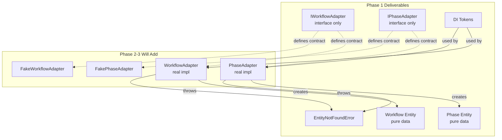
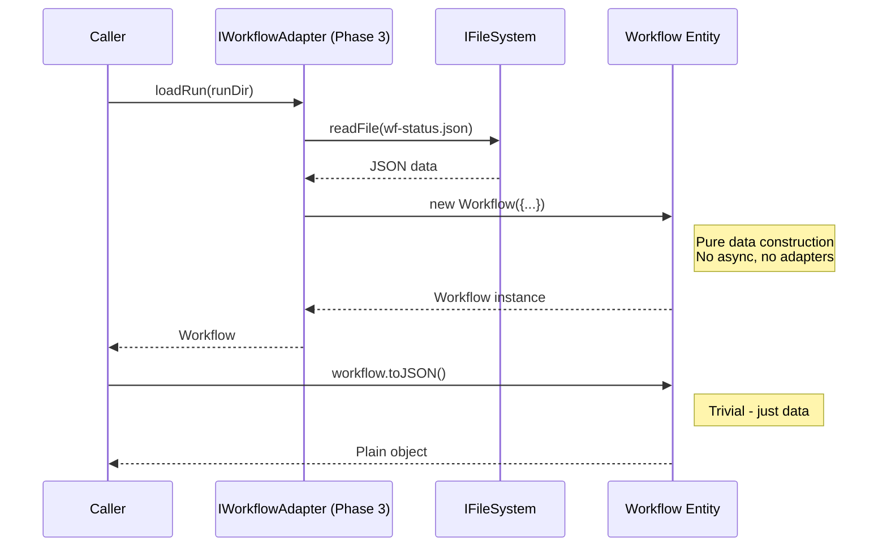

# Phase 1: Entity Interfaces & Pure Data Classes – Tasks & Alignment Brief

**Spec**: [../../entity-upgrade-spec.md](../../entity-upgrade-spec.md)
**Plan**: [../../entity-upgrade-plan.md](../../entity-upgrade-plan.md)
**Date**: 2026-01-26

---

## Executive Briefing

### Purpose

This phase establishes the foundational entity classes and adapter interfaces that enable a navigable workflow graph. Without these primitives, the `cg runs list` command is impossible and web integration requires manual DTO assembly.

### What We're Building

Pure data entity classes and adapter interfaces that define the unified workflow model:

1. **Entity Classes** (pure data, NOT in DI):
   - `Workflow` - Unified model representing current/, checkpoint/, or run/ (same structure, different populated state)
   - `Phase` - Same structure for template and run phases (values populated or not)

2. **Adapter Interfaces** (will be implemented in Phase 2-3):
   - `IWorkflowAdapter` - Unified: `loadCurrent()`, `loadCheckpoint()`, `loadRun()`, `listRuns()`, `listCheckpoints()`
   - `IPhaseAdapter` - `loadFromPath()`, `listForWorkflow()`

3. **Error Infrastructure**:
   - `EntityNotFoundError` - Thrown when entity data is missing/corrupt
   - Run CLI error classes E040-E049 for `cg runs` commands

4. **DI Tokens**:
   - `WORKFLOW_ADAPTER`, `PHASE_ADAPTER` tokens in WORKFLOW_DI_TOKENS

### User Value

- `cg runs list` becomes possible (requires entity discovery)
- Web components can render Workflow/Phase via `toJSON()` without manual DTO mapping
- Single `<WorkflowCard>` component renders current/checkpoint/run by checking boolean flags
- Testing entity invariants becomes possible (entities exist!)

### Example

**Before (diffuse concepts)**:
```typescript
// Consumer assembles "entity" mentally from scattered calls
const info = await registry.info(slug);
const versions = await registry.versions(slug);
const statusJson = await fs.readFile(runDir + '/wf-status.json');
// Manual assembly...
```

**After (first-class entities)**:
```typescript
// Unified model - same Workflow class for all sources
const current = await workflowAdapter.loadCurrent('hello-wf');
const checkpoint = await workflowAdapter.loadCheckpoint('hello-wf', 'v001-abc');
const run = await workflowAdapter.loadRun(runDir);

// Navigation via adapter
const phases = await phaseAdapter.listForWorkflow(run);

// Web-ready serialization
console.log(JSON.stringify(run.toJSON()));  // Pure data, no adapters to exclude
```

---

## Objectives & Scope

### Objective

Create the foundational entity interfaces, adapter interfaces, and pure data entity classes per plan acceptance criteria. Establish the unified model where Workflow represents current/, checkpoint/, or run/ and Phase has the same structure for template and run sources.

### Goals

- ✅ Create `EntityNotFoundError` error class with context fields
- ✅ Create CLI error classes for E040-E049 (RunNotFoundError, etc.)
- ✅ Define `IWorkflowAdapter` interface (unified: current/checkpoint/run)
- ✅ Define `IPhaseAdapter` interface (unified: template/run)
- ✅ Create `Workflow` entity class (pure data, unified model)
- ✅ Create `Phase` entity class (full data model from plan § Entity Data Models)
- ✅ Add DI tokens: `WORKFLOW_ADAPTER`, `PHASE_ADAPTER`
- ✅ Create barrel exports for entities and interfaces
- ✅ All entity tests passing with TDD approach

### Non-Goals

- ❌ Implementing adapters (Phase 2-3)
- ❌ Creating fakes (Phase 2)
- ❌ CLI commands (Phase 4)
- ❌ Container registration beyond tokens (Phase 2-3)
- ❌ Service refactoring (Phase 6)
- ❌ Navigation methods on entities (adapters handle navigation per spec Q7)
- ❌ Caching or lazy loading (spec Q5: always fresh reads)
- ❌ Async methods on entities (pure data only per Critical Discovery 01)

---

## Architecture Map

### Component Diagram

```mermaid
flowchart TD
    classDef pending fill:#9E9E9E,stroke:#757575,color:#fff
    classDef inprogress fill:#FF9800,stroke:#F57C00,color:#fff
    classDef completed fill:#4CAF50,stroke:#388E3C,color:#fff
    classDef blocked fill:#F44336,stroke:#D32F2F,color:#fff

    style Phase1 fill:#F5F5F5,stroke:#E0E0E0
    style Errors fill:#E3F2FD,stroke:#1976D2
    style Interfaces fill:#E8F5E9,stroke:#388E3C
    style Entities fill:#FFF3E0,stroke:#F57C00
    style DI fill:#F3E5F5,stroke:#7B1FA2

    subgraph Phase1["Phase 1: Entity Interfaces & Pure Data Classes"]
        subgraph Errors["Error Classes"]
            T001["T001: Test EntityNotFoundError ✓"]:::completed
            T002["T002: Impl EntityNotFoundError ✓"]:::completed
            T003["T003: Impl CLI errors E050-E059 ✓"]:::completed
            T001 --> T002
            T002 --> T003
        end

        subgraph Interfaces["Adapter Interfaces"]
            T004["T004: Define IWorkflowAdapter ✓"]:::completed
            T005["T005: Define IPhaseAdapter ✓"]:::completed
        end

        subgraph Entities["Entity Classes"]
            T006["T006: Test Workflow (current) ✓"]:::completed
            T007["T007: Test Workflow (checkpoint) ✓"]:::completed
            T008["T008: Test Workflow (run) ✓"]:::completed
            T009["T009: Impl Workflow ✓"]:::completed
            T010["T010: Test Phase ✓"]:::completed
            T011["T011: Impl Phase ✓"]:::completed
            T006 --> T009
            T007 --> T009
            T008 --> T009
            T010 --> T011
        end

        subgraph DI["DI & Exports"]
            T012["T012: Add DI tokens ✓"]:::completed
            T013["T013: Barrel entities ✓"]:::completed
            T014["T014: Barrel interfaces ✓"]:::completed
        end
    end

    subgraph Files["Files"]
        F1["/packages/workflow/src/errors/entity-not-found.error.ts ✓"]:::completed
        F2["/packages/workflow/src/errors/run-errors.ts ✓"]:::completed
        F3["/packages/workflow/src/interfaces/workflow-adapter.interface.ts ✓"]:::completed
        F4["/packages/workflow/src/interfaces/phase-adapter.interface.ts ✓"]:::completed
        F5["/packages/workflow/src/entities/workflow.ts ✓"]:::completed
        F6["/packages/workflow/src/entities/phase.ts ✓"]:::completed
        F7["/packages/shared/src/di-tokens.ts ✓"]:::completed
        F8["/packages/workflow/src/entities/index.ts ✓"]:::completed
        F9["/packages/workflow/src/interfaces/index.ts ✓"]:::completed
        FT1["/test/unit/workflow/entity-not-found-error.test.ts ✓"]:::completed
        FT2["/test/unit/workflow/workflow-entity.test.ts ✓"]:::completed
        FT3["/test/unit/workflow/phase-entity.test.ts ✓"]:::completed
    end

    T001 -.-> FT1
    T002 -.-> F1
    T003 -.-> F2
    T004 -.-> F3
    T005 -.-> F4
    T006 -.-> FT2
    T007 -.-> FT2
    T008 -.-> FT2
    T009 -.-> F5
    T010 -.-> FT3
    T011 -.-> F6
    T012 -.-> F7
    T013 -.-> F8
    T014 -.-> F9
```

<!-- Status: grey=pending, orange=in-progress, green=completed, red=blocked -->
<!-- Updated by plan-6 during implementation -->



### Task-to-Component Mapping

<!-- Status: ⬜ Pending | 🟧 In Progress | ✅ Complete | 🔴 Blocked -->

| Task | Component(s) | Files | Status | Comment |
|------|-------------|-------|--------|---------|
| T001 | EntityNotFoundError Test | test/unit/workflow/entity-not-found-error.test.ts | ✅ Complete | TDD: Write failing test first |
| T002 | EntityNotFoundError | packages/workflow/src/errors/entity-not-found.error.ts | ✅ Complete | Core error class for adapters |
| T003 | Run CLI Errors | packages/workflow/src/errors/run-errors.ts | ✅ Complete | E050-E059 for `cg runs` commands |
| T004 | IWorkflowAdapter | packages/workflow/src/interfaces/workflow-adapter.interface.ts | ✅ Complete | Unified adapter interface |
| T005 | IPhaseAdapter | packages/workflow/src/interfaces/phase-adapter.interface.ts | ✅ Complete | Phase loading interface |
| T006 | Workflow Test (current) | test/unit/workflow/workflow-entity.test.ts | ✅ Complete | TDD: current/ source |
| T007 | Workflow Test (checkpoint) | test/unit/workflow/workflow-entity.test.ts | ✅ Complete | TDD: checkpoint/ source |
| T008 | Workflow Test (run) | test/unit/workflow/workflow-entity.test.ts | ✅ Complete | TDD: run/ source with runtime state |
| T009 | Workflow Entity | packages/workflow/src/entities/workflow.ts | ✅ Complete | Unified entity class |
| T010 | Phase Test | test/unit/workflow/phase-entity.test.ts | ✅ Complete | TDD: Full data model |
| T011 | Phase Entity | packages/workflow/src/entities/phase.ts | ✅ Complete | Complex entity with all fields |
| T012 | DI Tokens | packages/shared/src/di-tokens.ts | ✅ Complete | WORKFLOW_ADAPTER, PHASE_ADAPTER |
| T013 | Entity Barrel | packages/workflow/src/entities/index.ts | ✅ Complete | Export Workflow, Phase |
| T014 | Interface Barrel | packages/workflow/src/interfaces/index.ts | ✅ Complete | Export adapters |

---

## Tasks

| Status | ID | Task | CS | Type | Dependencies | Absolute Path(s) | Validation | Subtasks | Notes |
|--------|-----|------|----|------|--------------|------------------|------------|----------|-------|
| [x] | T001 | Write tests for EntityNotFoundError | 1 | Test | – | /home/jak/substrate/007-manage-workflows/test/unit/workflow/entity-not-found-error.test.ts | Tests verify: message format, properties (entityType, identifier, path, parentContext), extends Error, name property | – | TDD: RED first |
| [x] | T002 | Implement EntityNotFoundError class | 1 | Core | T001 | /home/jak/substrate/007-manage-workflows/packages/workflow/src/errors/entity-not-found.error.ts | All tests from T001 pass | – | Per Critical Discovery 07 |
| [x] | T003 | Create CLI error classes E050-E059 | 1 | Core | T002 | /home/jak/substrate/007-manage-workflows/packages/workflow/src/errors/run-errors.ts | Error classes: RunNotFoundError (E050), RunsDirNotFoundError (E051), InvalidRunStatusError (E052), RunCorruptError (E053). All extend base error with code property. Tests included. **Uses E050-E059 range per DYK-05 (E040-E049 already used by InitService).** | – | Phase 4 will use these. Error range (DYK-05). |
| [x] | T004 | Define IWorkflowAdapter interface | 2 | Interface | – | /home/jak/substrate/007-manage-workflows/packages/workflow/src/interfaces/workflow-adapter.interface.ts | Methods: loadCurrent(slug), loadCheckpoint(slug, version), loadRun(runDir), listCheckpoints(slug), listRuns(slug, filter?), exists(slug). JSDoc on each. Includes RunListFilter type. Types exported. **Uses `load*()` naming per DYK-04.** | – | Unified: handles current/checkpoint/run. Naming convention (DYK-04). |
| [x] | T005 | Define IPhaseAdapter interface | 1 | Interface | – | /home/jak/substrate/007-manage-workflows/packages/workflow/src/interfaces/phase-adapter.interface.ts | Methods: loadFromPath(phaseDir), listForWorkflow(workflow). JSDoc on each. Types exported. **Uses `load*()` naming per DYK-04.** | – | Unified: template and run phases. Naming convention (DYK-04). |
| [x] | T006 | Write tests for Workflow entity (current mode) | 2 | Test | T004 | /home/jak/substrate/007-manage-workflows/test/unit/workflow/workflow-entity.test.ts | Tests: Workflow.createCurrent() factory, isCurrent=true, isCheckpoint=false, isRun=false, checkpoint=null (not undefined), run=null, phases array, toJSON() with camelCase keys. Use factory methods not constructor. | – | TDD: RED first. Factory (DYK-02), serialization (DYK-03). |
| [x] | T007 | Write tests for Workflow entity (checkpoint mode) | 2 | Test | T004 | /home/jak/substrate/007-manage-workflows/test/unit/workflow/workflow-entity.test.ts | Tests: Workflow.createCheckpoint() factory, isCheckpoint=true, checkpoint metadata (ordinal, hash, createdAt→ISO string, comment), run=null, source getter, toJSON() camelCase. Use factory methods not constructor. | – | TDD: RED first. Factory (DYK-02), serialization (DYK-03). |
| [x] | T008 | Write tests for Workflow entity (run mode) | 2 | Test | T004 | /home/jak/substrate/007-manage-workflows/test/unit/workflow/workflow-entity.test.ts | Tests: Workflow.createRun() factory, isRun=true, run metadata (runId, runDir, status, createdAt→ISO string), phases have runtime state, toJSON() camelCase with recursive phases. Use factory methods not constructor. | – | TDD: RED first. Factory (DYK-02), serialization (DYK-03). |
| [x] | T009 | Implement Workflow entity class | 2 | Core | T006, T007, T008 | /home/jak/substrate/007-manage-workflows/packages/workflow/src/entities/workflow.ts | All tests from T006-T008 pass. Unified model for all sources. Pure readonly properties + computed getters. No adapter refs. **Constructor is private; creation only via static factory methods (Workflow.createCurrent(), Workflow.createCheckpoint(), Workflow.createRun()) or adapter methods. Tests use factory methods.** toJSON() rules (DYK-03): camelCase keys, undefined→null, Date→ISO string, recursive for phases[]. | – | Per Key Invariant 1: isCurrent XOR isCheckpoint XOR isRun. Factory pattern (DYK-02). Serialization rules (DYK-03). |
| [x] | T010 | Write tests for Phase entity | 3 | Test | T005 | /home/jak/substrate/007-manage-workflows/test/unit/workflow/phase-entity.test.ts | Tests: full data model (inputFiles, inputParameters, inputMessages, outputs, outputParameters), exists/answered/valid flags, status helpers, duration, toJSON(). Both template (unpopulated) and run (populated) modes. **toJSON() tests per DYK-03: camelCase keys, undefined→null, Date→ISO, recursive arrays.** | – | Complex entity per plan § Entity Data Models. Serialization rules (DYK-03). |
| [x] | T011 | Implement Phase entity class | 2 | Core | T010 | /home/jak/substrate/007-manage-workflows/packages/workflow/src/entities/phase.ts | All tests from T010 pass. Includes all fields from plan § Entity Data Models. Pure readonly + computed getters. toJSON() rules (DYK-03): camelCase keys, undefined→null, Date→ISO string, recursive for nested arrays (inputFiles, outputs, etc.). | – | Per Key Invariant 2: same structure template/run. Serialization rules (DYK-03). |
| [x] | T012 | Add DI tokens to WORKFLOW_DI_TOKENS | 1 | Setup | – | /home/jak/substrate/007-manage-workflows/packages/shared/src/di-tokens.ts | 2 new tokens: WORKFLOW_ADAPTER: 'IWorkflowAdapter', PHASE_ADAPTER: 'IPhaseAdapter' | – | Follow existing token pattern |
| [x] | T013 | Create barrel exports for entities | 1 | Setup | T009, T011 | /home/jak/substrate/007-manage-workflows/packages/workflow/src/entities/index.ts | `import { Workflow, Phase } from '@chainglass/workflow'` works via packages/workflow/src/index.ts | – | Export classes and types |
| [x] | T014 | Create/update barrel exports for interfaces | 1 | Setup | T004, T005 | /home/jak/substrate/007-manage-workflows/packages/workflow/src/interfaces/index.ts | IWorkflowAdapter, IPhaseAdapter, RunListFilter exported. Also export from packages/workflow/src/index.ts | – | Update existing barrel |

---

## Alignment Brief

### Critical Findings Affecting This Phase

From plan § Critical Research Findings, these discoveries directly impact Phase 1:

| Finding | Constraint | Tasks Affected |
|---------|------------|----------------|
| **Discovery 01: Entity Constructors Must Be Pure Data** | Entities have readonly properties only. No adapter refs, no async methods, no private cache fields. | T009, T011 |
| **Discovery 05: DI Token Pattern Required** | Add tokens to WORKFLOW_DI_TOKENS following existing pattern (`TOKEN: 'IInterface'`). | T012 |
| **Discovery 07: Error Handling - EntityNotFoundError** | Create error class with entityType, identifier, path, parentContext fields. Throw on missing required data. | T001, T002 |

### ADR Decision Constraints

| ADR | Decision | Constraint | Tasks Affected |
|-----|----------|------------|----------------|
| **ADR-0004: DI Container Architecture** | Use `useFactory` pattern for DI registration | Tokens must be string constants in WORKFLOW_DI_TOKENS. Adapters will be registered via useFactory (Phase 2-3). | T012 |
| **ADR-0004** | No `@injectable()` decorators | Entity classes must not use decorators (RSC incompatible). | T009, T011 |

### Invariants & Guardrails

From plan § Key Invariants (Unified Model):

1. **Workflow Source Exclusivity**: `isCurrent XOR isCheckpoint XOR isRun`
   - A Workflow is loaded from EXACTLY ONE source
   - **Enforced via factory pattern**: Private constructor + static factory methods (`createCurrent()`, `createCheckpoint()`, `createRun()`) ensure invariant cannot be violated (DYK-02 decision)

2. **Phase Structure Identity**: Template Phase ≡ Run Phase
   - Same fields, different populated values
   - Template: exists=false, value=undefined, status='pending'
   - Run: exists=true/false, value=populated, status=runtime

3. **Adapter Responsibility**: Adapters do I/O → Entities are pure data
   - No adapter references in entities
   - No async methods on entities

4. **Data Locality**: Each entity loads from its OWN filesystem path
   - Not enforced in Phase 1 (adapters in Phase 3)

### Inputs to Read

| File | Purpose |
|------|---------|
| `/home/jak/substrate/007-manage-workflows/packages/shared/src/di-tokens.ts` | Existing token pattern |
| `/home/jak/substrate/007-manage-workflows/packages/workflow/src/interfaces/workflow-registry.interface.ts` | Interface pattern reference |
| `/home/jak/substrate/007-manage-workflows/packages/workflow/src/types/wf.types.ts` | WfDefinition, PhaseDefinition types |
| `/home/jak/substrate/007-manage-workflows/packages/workflow/src/types/wf-phase.types.ts` | PhaseStatus, Facilitator types |
| `/home/jak/substrate/007-manage-workflows/packages/shared/src/interfaces/results/base.types.ts` | ResultError pattern |

### Visual Alignment Aids

#### System Flow Diagram



#### Entity Construction Sequence



### Test Plan

**Approach**: Full TDD per plan § Testing Philosophy

**Test Files**:

| Test File | Tests | Purpose |
|-----------|-------|---------|
| `test/unit/workflow/entity-not-found-error.test.ts` | 4-5 | Error class contract |
| `test/unit/workflow/workflow-entity.test.ts` | 15-20 | Workflow unified model (current/checkpoint/run) |
| `test/unit/workflow/phase-entity.test.ts` | 20-25 | Phase full data model |

**Test Naming**: Given-When-Then or "should" format

**Fixtures**: None needed - entities are pure data constructed in tests

**TDD Workflow**:
1. Write test (T001, T006, T007, T008, T010) → verify RED
2. Implement class (T002, T009, T011) → verify GREEN
3. Refactor if needed → verify still GREEN

### Step-by-Step Implementation Outline

| Step | Task(s) | Action |
|------|---------|--------|
| 1 | T001 | Write EntityNotFoundError tests - verify they fail |
| 2 | T002 | Implement EntityNotFoundError - verify tests pass |
| 3 | T003 | Implement CLI error classes E040-E049 with inline tests |
| 4 | T004 | Define IWorkflowAdapter interface with JSDoc |
| 5 | T005 | Define IPhaseAdapter interface with JSDoc |
| 6 | T012 | Add DI tokens (unblocks nothing but good to do early) |
| 7 | T006, T007, T008 | Write Workflow entity tests (all three modes) - verify RED |
| 8 | T009 | Implement Workflow entity - verify tests pass |
| 9 | T010 | Write Phase entity tests - verify RED |
| 10 | T011 | Implement Phase entity - verify tests pass |
| 11 | T013 | Create entities barrel export |
| 12 | T014 | Update interfaces barrel export |
| 13 | – | Run `pnpm typecheck && pnpm test && pnpm lint` - verify all green |

### Commands to Run

```bash
# Environment setup
cd /home/jak/substrate/007-manage-workflows
pnpm install

# Run specific tests during TDD
pnpm test --filter @chainglass/workflow -- --grep "EntityNotFoundError"
pnpm test --filter @chainglass/workflow -- --grep "Workflow entity"
pnpm test --filter @chainglass/workflow -- --grep "Phase entity"

# Run all workflow package tests
pnpm test --filter @chainglass/workflow

# Type check
pnpm typecheck --filter @chainglass/workflow

# Lint
pnpm lint --filter @chainglass/workflow

# Full quality check
pnpm typecheck && pnpm lint && pnpm test

# Build to verify exports work
pnpm build --filter @chainglass/workflow
```

### Risks/Unknowns

| Risk | Severity | Mitigation |
|------|----------|------------|
| Interface design changes later | Medium | Thorough review before Phase 2 proceeds |
| Entity property gaps | Low | Compare against wf-status.json schema during implementation |
| Status enum values don't match existing types | Low | Verify against wf-phase.types.ts |

### Ready Check

- [ ] ADR constraints mapped to tasks (ADR-0004 → T012, T009, T011)
- [ ] Critical findings mapped to tasks (CD-01 → T009/T011, CD-05 → T012, CD-07 → T001/T002)
- [ ] All absolute paths verified to exist or be new files
- [ ] Test files have TDD: RED first in Validation column
- [ ] No time estimates in tasks (CS scores only)
- [ ] Entity Data Models section reviewed for Phase field completeness

---

## Phase Footnote Stubs

<!-- Populated by plan-6a-update-progress during implementation -->

| Footnote | Description | Task | Date |
|----------|-------------|------|------|
| | | | |

---

## Evidence Artifacts

**Execution Log**: `./execution.log.md` (created by plan-6 during implementation)

**Supporting Files**:
- Test output captured via `pnpm test --reporter=verbose`
- TypeScript errors captured via `pnpm typecheck 2>&1`

---

## Discoveries & Learnings

_Populated during implementation by plan-6. Log anything of interest to your future self._

| Date | Task | Type | Discovery | Resolution | References |
|------|------|------|-----------|------------|------------|
| 2026-01-26 | T009 | decision | DYK-02: XOR invariant (isCurrent/isCheckpoint/isRun) has no enforcement mechanism in original plan - constructor parameter `isCurrent` could be set inconsistently with `checkpoint`/`run` fields | Factory pattern: Private constructor + static factory methods (`createCurrent()`, `createCheckpoint()`, `createRun()`) enforce invariant structurally. Complies with Constitution HD-08 (no throwing). | /didyouknow session, Insight #2 |
| 2026-01-26 | T009, T011 | decision | DYK-03: toJSON() serialization rules underspecified - codebase has snake_case files (wf-status.json) vs camelCase CLI envelope; mixed undefined handling (null vs omit) | Explicit rules: (1) camelCase property names in output, (2) undefined optional fields → null, (3) Date objects → ISO-8601 strings, (4) recursive toJSON() for nested arrays/objects. | /didyouknow session, Insight #3 |
| 2026-01-26 | T004, T005 | decision | DYK-04: Plan proposed `from*()` method names (fromCurrent, fromCheckpoint, fromRun) but codebase has zero `from*()` methods - would introduce second naming idiom | Use `load*()` naming: loadCurrent(), loadCheckpoint(), loadRun(), loadFromPath(). Maintains single idiom; `load` clearly communicates filesystem hydration. | /didyouknow session, Insight #4 |
| 2026-01-26 | T003 | decision | DYK-05: Plan proposed E040-E049 for run errors, but E040-E041 already allocated to InitService (init.service.ts:97-115) for directory/template failures | Use E050-E059 range for run errors: E050 (RunNotFoundError), E051 (RunsDirNotFoundError), E052 (InvalidRunStatusError), E053 (RunCorruptError). Preserves existing codes; clear domain separation. | /didyouknow session, Insight #5 |

**Types**: `gotcha` | `research-needed` | `unexpected-behavior` | `workaround` | `decision` | `debt` | `insight`

**What to log**:
- Things that didn't work as expected
- External research that was required
- Implementation troubles and how they were resolved
- Gotchas and edge cases discovered
- Decisions made during implementation
- Technical debt introduced (and why)
- Insights that future phases should know about

_See also: `execution.log.md` for detailed narrative._

---

## Directory Layout

```
docs/plans/010-entity-upgrade/
├── entity-upgrade-spec.md
├── entity-upgrade-plan.md
└── tasks/
    └── phase-1-entity-interfaces-pure-data-classes/
        ├── tasks.md                    # This file
        └── execution.log.md            # Created by plan-6 during implementation
```

---

*Phase 1 Tasks v1.0.0 - Generated 2026-01-26*

---

## Critical Insights Discussion

**Session**: 2026-01-26
**Context**: Phase 1 Entity Interfaces & Pure Data Classes - Tasks Dossier Review
**Analyst**: AI Clarity Agent
**Reviewer**: Development Team
**Format**: Water Cooler Conversation (5 Critical Insights)

### Insight 1: Phase Entity Complexity Scoring

**Did you know**: The Phase entity (T010/T011) has 20+ nested properties across 7 field groups, but T010 (tests) is scored CS-3 while T011 (implementation) is only CS-2 - which seems inverted.

**Implications**:
- PhaseService precedent shows tests are MORE complex than implementation (1,576 vs 1,065 LOC)
- Codebase test-to-code ratio is consistently 1.5-2.1x for complex services
- TDD approach means implementation is mechanical after comprehensive tests

**Options Considered**:
- Option A: Keep current scoring - trust TDD makes implementation mechanical
- Option B: Bump T011 to CS-3 - recognize implementation complexity
- Option C: Split into smaller subtasks
- Option D: Create incrementally (Not Feasible - contradicts TDD mandate)

**AI Recommendation**: Option A - Keep current scoring
- Reasoning: PhaseService proves the pattern; TDD makes implementation mechanical after tests define contracts

**Discussion Summary**: User agreed that PhaseService precedent validates the TDD approach where tests are genuinely harder than implementation.

**Decision**: Keep current scoring (T010: CS-3, T011: CS-2)

**Action Items**: None - scoring remains as planned

**Affects**: No changes

---

### Insight 2: XOR Invariant Enforcement Gap

**Did you know**: The "isCurrent XOR isCheckpoint XOR isRun" invariant is documented but has no enforcement mechanism - `isCurrent` is a constructor parameter that could be set inconsistently with `checkpoint`/`run` fields.

**Implications**:
- Constructor parameter asymmetry creates violation risk
- Constitution HD-08 prohibits throwing exceptions
- Factory pattern is already implicit in plan's "adapters handle creation" approach

**Options Considered**:
- Option A: Runtime validation (throw) - Not Feasible (violates Constitution HD-08)
- Option B: Factory functions only - private constructor, static factories
- Option C: Type-level enforcement (discriminated unions) - non-idiomatic
- Option D: Trust adapters - insufficient enforcement

**AI Recommendation**: Option B - Factory functions only
- Reasoning: Enforces invariant structurally; matches plan's documented approach; complies with Constitution

**Discussion Summary**: User agreed that factory pattern provides structural enforcement without relying on discipline.

**Decision**: Private constructor + static factory methods (createCurrent, createCheckpoint, createRun)

**Action Items**:
- [x] Update T006-T009 validation criteria to use factory methods

**Affects**: T006, T007, T008, T009 (Workflow entity tests and implementation)

---

### Insight 3: toJSON() Serialization Rules Underspecified

**Did you know**: The plan says toJSON() should be "web-ready" with camelCase, but there's a naming mismatch - wf-status.json uses snake_case while CLI envelope uses camelCase, and undefined handling is inconsistent across the codebase.

**Implications**:
- File format (snake_case) vs web API (camelCase) needs transformation
- Mixed undefined handling: some → null, some omitted, some deleted at runtime
- No recursive serialization pattern documented

**Options Considered**:
- Option A: JSON.stringify defaults - doesn't address snake→camel transformation
- Option B: Explicit serialization rules - document and test exact format
- Option C: Serialization library - adds dependency, uses decorators (prohibited)
- Option D: Match existing output - inconsistent, doesn't solve gap

**AI Recommendation**: Option B - Explicit serialization rules
- Reasoning: Addresses real gap; standardizes undefined→null; enables recursive serialization

**Discussion Summary**: User agreed explicit rules provide consistency and predictability for web consumers.

**Decision**: Explicit toJSON() rules: camelCase keys, undefined→null, Date→ISO, recursive for nested objects

**Action Items**:
- [x] Update T006-T011 with serialization rule requirements

**Affects**: T006, T007, T008, T009, T010, T011 (all entity tests and implementations)

---

### Insight 4: Adapter Method Naming Introduces New Idiom

**Did you know**: The plan proposes `from*()` method names (fromCurrent, fromCheckpoint, fromRun) but the codebase has zero `from*()` methods anywhere - this would introduce a second naming idiom.

**Implications**:
- Existing patterns: `get*()` for retrieval, action verbs for operations
- Two naming conventions increases cognitive load
- `from*()` is semantically clear but non-idiomatic

**Options Considered**:
- Option A: Keep plan's `from*()` names - non-idiomatic but clear
- Option B: Align with `get*()` pattern - ambiguous about source
- Option C: Use `load*()` pattern - clear intent, single idiom
- Option D: Keep as intentional distinction - two idioms to learn

**AI Recommendation**: Option D initially, then reconsidered
- User preference: Single idiom is better; `load*()` communicates filesystem hydration clearly

**Discussion Summary**: User preferred consistency over distinction, chose `load*()` naming to maintain single idiom.

**Decision**: Use `load*()` naming: loadCurrent(), loadCheckpoint(), loadRun(), loadFromPath()

**Action Items**:
- [x] Update T004, T005 method names
- [x] Update example code and diagrams

**Affects**: T004, T005 (adapter interfaces), Executive Briefing examples

---

### Insight 5: Error Code Range E040-E049 Already Allocated

**Did you know**: T003 plans to create run error classes E040-E049, but E040-E041 are already used by InitService for initialization failures.

**Implications**:
- E040 = "Failed to create directory structure" (init.service.ts:97)
- E041 = "Failed to hydrate templates" (init.service.ts:112)
- E030-E039 used for workflow registry operations
- E050+ range is unallocated

**Options Considered**:
- Option A: Reassign init codes to E050+ - breaking change
- Option B: Use E050-E059 for run errors - no breaking changes
- Option C: Extend E030 with context - less specific handling
- Option D: Defer to Phase 4 - delays error infrastructure

**AI Recommendation**: Option B - Use E050-E059 for run errors
- Reasoning: No breaking changes; clear domain separation; maintains plan structure

**Discussion Summary**: User agreed that avoiding breaking changes while maintaining clear separation is the right approach.

**Decision**: Use E050-E059 for run errors (E050-RunNotFoundError, E051-RunsDirNotFoundError, etc.)

**Action Items**:
- [x] Update T003 error code range

**Affects**: T003 (CLI error classes)

---

## Session Summary

**Insights Surfaced**: 5 critical insights identified and discussed
**Decisions Made**: 5 decisions reached through collaborative discussion
**Action Items Created**: 5 areas updated (T003, T004, T005, T006-T011)
**Areas Updated**:
- T003: Error codes E040-E049 → E050-E059
- T004: Method names from*() → load*()
- T005: Method name fromPath() → loadFromPath()
- T006-T008: Factory method usage, serialization rules
- T009: Factory pattern, serialization rules
- T010-T011: Serialization rules

**Shared Understanding Achieved**: ✓

**Confidence Level**: High - All gaps identified, decisions documented, tasks updated

**Next Steps**:
Proceed to implementation with `/plan-6-implement-phase --phase "Phase 1: Entity Interfaces & Pure Data Classes"`

**Notes**:
- 5 DYK entries added to Discoveries & Learnings table
- All method names, error codes, and serialization rules now explicitly documented
- Factory pattern enforces XOR invariant structurally
