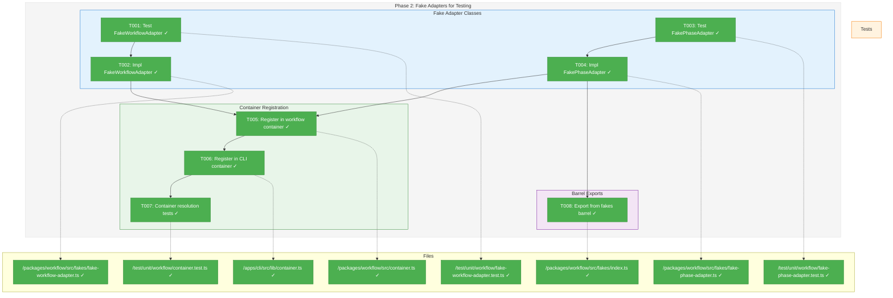
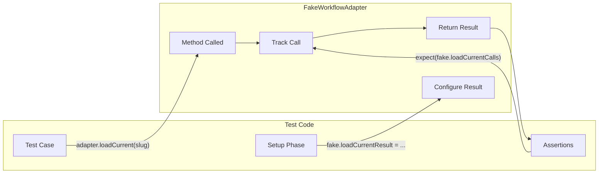
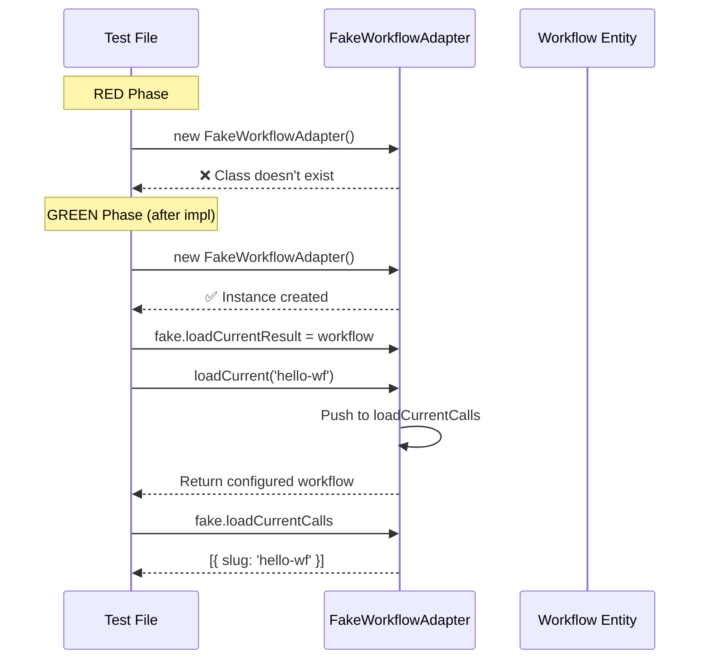

# Phase 2: Fake Adapters for Testing – Tasks & Alignment Brief

**Spec**: [../../entity-upgrade-spec.md](../../entity-upgrade-spec.md)
**Plan**: [../../entity-upgrade-plan.md](../../entity-upgrade-plan.md)
**Date**: 2026-01-26

---

## Executive Briefing

### Purpose

This phase creates FakeWorkflowAdapter and FakePhaseAdapter classes that implement the interfaces defined in Phase 1. These fakes enable TDD development of production adapters (Phase 3) and provide configurable test doubles for all consuming code.

### What We're Building

Two fake adapter classes following the established fake patterns in the codebase:

1. **FakeWorkflowAdapter** implementing `IWorkflowAdapter`:
   - Configurable responses for all methods (loadCurrent, loadCheckpoint, loadRun, listCheckpoints, listRuns, exists)
   - Call tracking arrays for test assertions
   - Error injection support via configurable error results
   - Reset helper for test isolation

2. **FakePhaseAdapter** implementing `IPhaseAdapter`:
   - Configurable responses for loadFromPath and listForWorkflow
   - Call tracking for assertions
   - Reset helper

3. **Test Container Registration**:
   - Fakes registered in workflow test container
   - Fakes registered in CLI test container
   - Container resolution tests

### User Value

- Enables TDD: Write tests first, implement adapters later
- Test isolation: No filesystem dependencies in unit tests
- Contract enforcement: Fakes must implement same interface as production
- Verification: Call tracking enables assertion of correct adapter usage

### Example

**Before (no fakes)**:
```typescript
// Can't test consumer code without hitting filesystem
const adapter = new WorkflowAdapter(fs, pathResolver); // Needs real filesystem
const workflow = await adapter.loadCurrent('hello-wf');
```

**After (with fakes)**:
```typescript
// Configure fake with test data
const fake = new FakeWorkflowAdapter();
fake.loadCurrentResult = Workflow.createCurrent({ slug: 'hello-wf', ... });

// Inject into container or directly
const workflow = await fake.loadCurrent('hello-wf');

// Verify correct method was called
expect(fake.loadCurrentCalls).toHaveLength(1);
expect(fake.loadCurrentCalls[0].slug).toBe('hello-wf');
```

---

## Objectives & Scope

### Objective

Create fake implementations for IWorkflowAdapter and IPhaseAdapter that enable TDD and test isolation. Per plan § Phase 2: "Create fake implementations for entity adapters to enable TDD of production adapters."

### Goals

- ✅ Create FakeWorkflowAdapter implementing IWorkflowAdapter
- ✅ Create FakePhaseAdapter implementing IPhaseAdapter
- ✅ Configurable return values for each method
- ✅ Call tracking for test verification (per existing fake patterns)
- ✅ Register fakes in workflow test container
- ✅ Register fakes in CLI test container
- ✅ Container resolution tests
- ✅ Barrel exports for fakes

### Non-Goals

- ❌ Production adapter implementation (Phase 3)
- ❌ Contract tests between fake/real (Phase 3)
- ❌ Filesystem operations (fakes are pure in-memory)
- ❌ Complex filtering logic in fakes (simple configurable results suffice)
- ❌ CLI command integration (Phase 4)
- ❌ Caching in fakes (spec Q5: always fresh reads - but fakes don't do real reads)

---

## Architecture Map

### Component Diagram
<!-- Status: grey=pending, orange=in-progress, green=completed, red=blocked -->
<!-- Updated by plan-6 during implementation -->



### Task-to-Component Mapping

<!-- Status: ⬜ Pending | 🟧 In Progress | ✅ Complete | 🔴 Blocked -->

| Task | Component(s) | Files | Status | Comment |
|------|-------------|-------|--------|---------|
| T001 | FakeWorkflowAdapter Tests | /test/unit/workflow/fake-workflow-adapter.test.ts | ✅ Complete | TDD RED: 24 tests fail with "not a constructor" |
| T002 | FakeWorkflowAdapter Class | /packages/workflow/src/fakes/fake-workflow-adapter.ts | ✅ Complete | All 24 tests pass |
| T003 | FakePhaseAdapter Tests | /test/unit/workflow/fake-phase-adapter.test.ts | ✅ Complete | TDD RED: 11 tests fail with "not a constructor" |
| T004 | FakePhaseAdapter Class | /packages/workflow/src/fakes/fake-phase-adapter.ts | ✅ Complete | All 11 tests pass |
| T005 | Workflow Container | /packages/workflow/src/container.ts | ✅ Complete | Fakes registered with useValue |
| T006 | CLI Container | /apps/cli/src/lib/container.ts | ✅ Complete | Fakes registered with useValue |
| T007 | Container Tests | /test/unit/workflow/container.test.ts | ✅ Complete | 5 tests pass |
| T008 | Barrel Export | /packages/workflow/src/fakes/index.ts | ✅ Complete | Exports verified |

---

## Tasks

| Status | ID | Task | CS | Type | Dependencies | Absolute Path(s) | Validation | Subtasks | Notes |
|--------|------|-------------------------------------|-----|------|--------------|------------------|------------|----------|-------|
| [x] | T001 | Write tests for FakeWorkflowAdapter | 2 | Test | – | /home/jak/substrate/007-manage-workflows/test/unit/workflow/fake-workflow-adapter.test.ts | Tests fail with "class doesn't exist" | – | Per plan 2.1; follow FakeWorkflowRegistry pattern |
| [x] | T002 | Implement FakeWorkflowAdapter class | 3 | Core | T001 | /home/jak/substrate/007-manage-workflows/packages/workflow/src/fakes/fake-workflow-adapter.ts | All T001 tests pass | – | Per plan 2.2; unified for current/checkpoint/run |
| [x] | T003 | Write tests for FakePhaseAdapter | 2 | Test | – | /home/jak/substrate/007-manage-workflows/test/unit/workflow/fake-phase-adapter.test.ts | Tests fail with "class doesn't exist" | – | Per plan 2.3 |
| [x] | T004 | Implement FakePhaseAdapter class | 2 | Core | T003 | /home/jak/substrate/007-manage-workflows/packages/workflow/src/fakes/fake-phase-adapter.ts | All T003 tests pass | – | Per plan 2.4 |
| [x] | T005 | Register fakes in workflow test container | 2 | Setup | T002, T004 | /home/jak/substrate/007-manage-workflows/packages/workflow/src/container.ts | container.resolve(WORKFLOW_DI_TOKENS.WORKFLOW_ADAPTER) returns FakeWorkflowAdapter | – | Per plan 2.5; use useValue pattern |
| [x] | T006 | Register fakes in CLI test container | 2 | Setup | T005 | /home/jak/substrate/007-manage-workflows/apps/cli/src/lib/container.ts | CLI test container resolves both adapters | – | Per plan 2.6 |
| [x] | T007 | Write container resolution tests | 1 | Test | T005, T006 | /home/jak/substrate/007-manage-workflows/test/unit/workflow/container.test.ts | Tests verify both adapters resolve from test container | – | Per plan 2.7 |
| [x] | T008 | Create barrel exports for fakes | 1 | Setup | T002, T004 | /home/jak/substrate/007-manage-workflows/packages/workflow/src/fakes/index.ts | `import { FakeWorkflowAdapter, FakePhaseAdapter } from '@chainglass/workflow'` works | – | Per plan 2.8 |

---

## Alignment Brief

### Prior Phases Review

#### Phase 1: Entity Interfaces & Pure Data Classes (Complete)

**A. Deliverables Created**:
- `/home/jak/substrate/007-manage-workflows/packages/workflow/src/errors/entity-not-found.error.ts` — EntityNotFoundError class with context fields
- `/home/jak/substrate/007-manage-workflows/packages/workflow/src/errors/run-errors.ts` — CLI error classes E050-E053
- `/home/jak/substrate/007-manage-workflows/packages/workflow/src/interfaces/workflow-adapter.interface.ts` — IWorkflowAdapter with 6 methods
- `/home/jak/substrate/007-manage-workflows/packages/workflow/src/interfaces/phase-adapter.interface.ts` — IPhaseAdapter with 2 methods
- `/home/jak/substrate/007-manage-workflows/packages/workflow/src/entities/workflow.ts` — Workflow entity with factory pattern
- `/home/jak/substrate/007-manage-workflows/packages/workflow/src/entities/phase.ts` — Phase entity with 7 field groups, 20+ properties
- `/home/jak/substrate/007-manage-workflows/packages/shared/src/di-tokens.ts` — Added WORKFLOW_ADAPTER, PHASE_ADAPTER tokens

**B. Lessons Learned**:
- Factory pattern (DYK-02) enforces XOR invariant via private constructor + static factories
- load*() naming convention (DYK-04) for adapter methods - not from*()
- toJSON() rules (DYK-03): camelCase, undefined→null, Date→ISO

**C. Technical Discoveries**:
- Forward slashes in JSDoc need escaping to avoid TypeScript parser issues
- Object.freeze() on arrays for immutability in entities
- Error prototype chain requires Object.setPrototypeOf for proper extension

**D. Dependencies Exported for Phase 2**:
- `IWorkflowAdapter` interface with methods: `loadCurrent(slug)`, `loadCheckpoint(slug, version)`, `loadRun(runDir)`, `listCheckpoints(slug)`, `listRuns(slug, filter?)`, `exists(slug)`
- `IPhaseAdapter` interface with methods: `loadFromPath(phaseDir)`, `listForWorkflow(workflow)`
- `RunListFilter` type for listRuns filtering
- `Workflow` class with `createCurrent()`, `createCheckpoint()`, `createRun()` factories
- `Phase` class with full input for construction
- `EntityNotFoundError` for error throwing
- `WORKFLOW_DI_TOKENS.WORKFLOW_ADAPTER` and `WORKFLOW_DI_TOKENS.PHASE_ADAPTER`

**E. Critical Findings Applied**:
- Discovery 01 (entities pure data): Workflow/Phase have no adapter references, no async methods
- Discovery 05 (DI tokens): WORKFLOW_ADAPTER and PHASE_ADAPTER tokens added

**F. Incomplete/Blocked Items**: None - all 14 tasks complete

**G. Test Infrastructure**: 62 entity tests created:
- `/home/jak/substrate/007-manage-workflows/test/unit/workflow/entity-not-found-error.test.ts` (10 tests)
- `/home/jak/substrate/007-manage-workflows/test/unit/workflow/run-errors.test.ts` (5 tests)
- `/home/jak/substrate/007-manage-workflows/test/unit/workflow/workflow-entity.test.ts` (22 tests)
- `/home/jak/substrate/007-manage-workflows/test/unit/workflow/phase-entity.test.ts` (25 tests)

**H. Technical Debt**: None

**I. Architectural Decisions**:
- Unified entity model: Workflow for current/checkpoint/run with same structure, different populated state
- Phase has same structure for template and run (values populated or not)
- Factory pattern enforces source exclusivity (isCurrent XOR isCheckpoint XOR isRun)

**J. Scope Changes**: Error codes changed from E040-E049 to E050-E059 (per DYK-05)

**K. Key Log References**:
- Phase 1 execution log: `./phase-1-entity-interfaces-pure-data-classes/execution.log.md`

### Critical Findings Affecting This Phase

1. **Discovery 05: DI Token Pattern Required**
   - Constrains: Fakes must be registered via `useValue` pattern in test containers
   - Addressed by: T005, T006, T007

2. **Discovery 06: Fake Adapter Contract Tests Required**
   - Constrains: Fakes must implement exact same interface as production adapters
   - Addressed by: T002, T004 (implement interface), Phase 3 (contract tests)

### ADR Decision Constraints

**ADR-0004: DI Container Architecture**
- Decision: Use `useFactory` for production, `useValue` for test with fake instances
- Constrains: Test containers use `useValue` with fake adapter instances
- Addressed by: T005, T006

### Invariants & Guardrails

- Fakes must implement exact interface (no extra public methods except test helpers)
- Call tracking arrays must be readonly to prevent mutation
- Reset must clear ALL state (results, calls, errors)
- Default behavior: return configured result or throw EntityNotFoundError

### Inputs to Read

1. **Interface definitions** (implement these):
   - `/home/jak/substrate/007-manage-workflows/packages/workflow/src/interfaces/workflow-adapter.interface.ts`
   - `/home/jak/substrate/007-manage-workflows/packages/workflow/src/interfaces/phase-adapter.interface.ts`

2. **Existing fake patterns** (follow these):
   - `/home/jak/substrate/007-manage-workflows/packages/workflow/src/fakes/fake-workflow-registry.ts` — Call tracking pattern
   - `/home/jak/substrate/007-manage-workflows/packages/workflow/src/fakes/fake-message-service.ts` — Multiple method fake pattern

3. **Entity classes** (return these from fakes):
   - `/home/jak/substrate/007-manage-workflows/packages/workflow/src/entities/workflow.ts`
   - `/home/jak/substrate/007-manage-workflows/packages/workflow/src/entities/phase.ts`

4. **DI tokens** (use these for registration):
   - `/home/jak/substrate/007-manage-workflows/packages/shared/src/di-tokens.ts` — WORKFLOW_DI_TOKENS

5. **Container patterns** (follow these for registration):
   - `/home/jak/substrate/007-manage-workflows/packages/workflow/src/container.ts`
   - `/home/jak/substrate/007-manage-workflows/apps/cli/src/lib/container.ts`

### Visual Alignment Aids

#### Flow Diagram: Fake Adapter Usage



#### Sequence Diagram: TDD Workflow



### Test Plan (TDD, Fakes via DI)

Following Full TDD strategy: RED tests first, GREEN implementation.

#### FakeWorkflowAdapter Tests (T001)

| Test Name | Rationale | Fixture | Expected |
|-----------|-----------|---------|----------|
| should create instance | Constructor works | None | Instance created |
| should return loadCurrentResult when set | Configurable responses | Workflow.createCurrent() | Returns configured workflow |
| should throw EntityNotFoundError when loadCurrentResult not set | Default error behavior | None | Throws EntityNotFoundError |
| should track loadCurrent calls | Call tracking | Workflow.createCurrent() | loadCurrentCalls has entry |
| should return loadCheckpointResult when set | Configurable responses | Workflow.createCheckpoint() | Returns configured workflow |
| should track loadCheckpoint calls with slug and version | Call tracking | Workflow.createCheckpoint() | loadCheckpointCalls has entry with both params |
| should return loadRunResult when set | Configurable responses | Workflow.createRun() | Returns configured workflow |
| should track loadRun calls with runDir | Call tracking | Workflow.createRun() | loadRunCalls has runDir |
| should return listCheckpointsResult when set | Configurable responses | Array of workflows | Returns array |
| should return empty array for listCheckpoints when not set | Default behavior | None | Returns [] |
| should return listRunsResult when set | Configurable responses | Array of workflows | Returns array |
| should filter listRuns by status when filter provided | Filter support | Mixed status runs | Only matching returned |
| should return existsResult when set | Configurable responses | true | Returns true |
| should return false for exists when not set | Default behavior | None | Returns false |
| should clear all state on reset | Reset helper | Various | All cleared |

#### FakePhaseAdapter Tests (T003)

| Test Name | Rationale | Fixture | Expected |
|-----------|-----------|---------|----------|
| should create instance | Constructor works | None | Instance created |
| should return loadFromPathResult when set | Configurable responses | Phase | Returns phase |
| should throw EntityNotFoundError when loadFromPathResult not set | Default error | None | Throws |
| should track loadFromPath calls | Call tracking | Phase | loadFromPathCalls has entry |
| should return listForWorkflowResult when set | Configurable responses | Phase[] | Returns array |
| should return empty array for listForWorkflow when not set | Default behavior | None | Returns [] |
| should clear all state on reset | Reset helper | Various | All cleared |

### Step-by-Step Implementation Outline

1. **T001: Write FakeWorkflowAdapter tests** (RED)
   - Create test file with all test cases
   - Import non-existent FakeWorkflowAdapter
   - Run tests → all fail (class doesn't exist)

2. **T002: Implement FakeWorkflowAdapter** (GREEN)
   - Create class implementing IWorkflowAdapter
   - Add result properties for each method
   - Add call tracking arrays for each method
   - Implement each interface method
   - Add reset() helper
   - Run tests → all pass

3. **T003: Write FakePhaseAdapter tests** (RED)
   - Create test file
   - Run tests → all fail

4. **T004: Implement FakePhaseAdapter** (GREEN)
   - Create class implementing IPhaseAdapter
   - Run tests → all pass

5. **T005: Register in workflow container**
   - Add useValue registration in createWorkflowTestContainer
   - Verify no type errors

6. **T006: Register in CLI container**
   - Add useValue registration in createCliTestContainer
   - Verify no type errors

7. **T007: Write container resolution tests**
   - Test that test container resolves FakeWorkflowAdapter
   - Test that test container resolves FakePhaseAdapter

8. **T008: Update barrel exports**
   - Add exports to fakes/index.ts
   - Verify imports work

### Commands to Run

```bash
# Install dependencies (if needed)
pnpm install

# Run all tests to verify baseline
pnpm test --filter @chainglass/workflow

# Run specific fake adapter tests (after creating)
pnpm test --filter @chainglass/workflow -- --grep "FakeWorkflowAdapter"
pnpm test --filter @chainglass/workflow -- --grep "FakePhaseAdapter"

# Type check
pnpm typecheck --filter @chainglass/workflow

# Build to verify exports
pnpm build --filter @chainglass/workflow

# Run container tests
pnpm test --filter @chainglass/workflow -- --grep "container"
```

### Risks/Unknowns

| Risk | Severity | Mitigation |
|------|----------|------------|
| Fake behavior diverges from expected real behavior | Medium | Contract tests in Phase 3 will catch divergence |
| Filter logic in listRuns becomes complex | Low | Keep fake filters simple; real adapter handles complex logic |
| Container registration patterns differ between packages | Low | Follow existing patterns exactly |

### Ready Check

- [x] Phase 1 complete (all 14 tasks) ✅
- [x] Interfaces to implement are understood (IWorkflowAdapter, IPhaseAdapter) ✅
- [x] Existing fake patterns reviewed (FakeWorkflowRegistry, FakeMessageService) ✅
- [x] Entity classes understood (Workflow, Phase factory patterns) ✅
- [x] DI tokens exist (WORKFLOW_ADAPTER, PHASE_ADAPTER) ✅
- [x] Container patterns understood (useValue for test containers) ✅
- [x] ADR constraints mapped to tasks (ADR-0004 → T005, T006) ✅

**Phase 2 Complete** — All 8 tasks implemented and verified.

---

## Phase Footnote Stubs

| Footnote | Task | Description | Added |
|----------|------|-------------|-------|
| | | | |

_Populated by plan-6 during implementation._

---

## Evidence Artifacts

**Execution Log**: `./execution.log.md` (created by plan-6)

**Test Evidence**:
- FakeWorkflowAdapter tests: `/home/jak/substrate/007-manage-workflows/test/unit/workflow/fake-workflow-adapter.test.ts`
- FakePhaseAdapter tests: `/home/jak/substrate/007-manage-workflows/test/unit/workflow/fake-phase-adapter.test.ts`
- Container tests: `/home/jak/substrate/007-manage-workflows/test/unit/workflow/container.test.ts`

---

## Discoveries & Learnings

_Populated during implementation by plan-6. Log anything of interest to your future self._

| Date | Task | Type | Discovery | Resolution | References |
|------|------|------|-----------|------------|------------|
| | | | | | |

**Types**: `gotcha` | `research-needed` | `unexpected-behavior` | `workaround` | `decision` | `debt` | `insight`

**What to log**:
- Things that didn't work as expected
- External research that was required
- Implementation troubles and how they were resolved
- Gotchas and edge cases discovered
- Decisions made during implementation
- Technical debt introduced (and why)
- Insights that future phases should know about

_See also: `execution.log.md` for detailed narrative._

---

## Directory Layout

```
docs/plans/010-entity-upgrade/
├── entity-upgrade-spec.md
├── entity-upgrade-plan.md
└── tasks/
    ├── phase-1-entity-interfaces-pure-data-classes/
    │   ├── tasks.md
    │   └── execution.log.md
    └── phase-2-fake-adapters-for-testing/
        ├── tasks.md
        └── execution.log.md  # created by plan-6
```

---

## Critical Insights Discussion

**Session**: 2026-01-26
**Context**: Phase 2 Fake Adapters for Testing - Pre-implementation clarity session
**Analyst**: Claude Opus 4.5
**Reviewer**: Development Team
**Format**: Water Cooler Conversation (5 Critical Insights)

### Insight 1: Default Error Behavior Pattern

**Did you know**: The tasks plan says fakes should "throw EntityNotFoundError when result not configured," but existing fakes never throw - they return result objects with error arrays or sensible defaults.

**Implications**:
- FakeWorkflowRegistry.info() returns `{ errors: [E030], workflow: undefined }`
- FakeWorkflowRegistry.list() returns `{ errors: [], workflows: [] }` (empty success)
- FakeMessageService.create() auto-generates message IDs

**Options Considered**:
- Option A: Follow existing pattern - result objects with errors
- Option B: Throw EntityNotFoundError as tasks plan says
- Option C: Hybrid approach

**AI Recommendation**: Option A - Result objects
- Reasoning: Matches all 7+ existing fakes, consistent with error handling patterns

**Discussion Summary**:
Interface signature matters - IWorkflowAdapter returns `Promise<Workflow>` not `Promise<Result<Workflow>>`. For entity lookups that must return an entity, throwing is required. For collections, return empty arrays.

**Decision**: Follow result-based pattern where possible; throw EntityNotFoundError for entity lookups (interface constraint requires returning Workflow or throwing)

**Action Items**: None - clarified implementation approach

**Affects**: T001 test cases, T002 implementation

---

### Insight 2: Container Registration Complexity

**Did you know**: T005/T006 are marked CS-2, but unit tests don't actually use containers - they instantiate services directly with injected fakes.

**Implications**:
- Test containers exist with `useValue` pattern
- Unit tests bypass containers: `new SomeService(fakeAdapter)`
- Workflow test container missing FakeHashGenerator that CLI has

**Options Considered**:
- Option A: Register in containers anyway (per plan)
- Option B: Skip container registration, direct instantiation only
- Option C: Register + document the dual pattern

**AI Recommendation**: Option C - Register + Document
- Reasoning: Containers needed for integration/CLI tests; unit tests use direct instantiation

**Discussion Summary**:
Both patterns are valid for different contexts. Containers for integration tests, direct instantiation for unit tests.

**Decision**: Register fakes in containers + document the dual usage pattern

**Action Items**:
- [ ] Add comment in container.ts explaining when to use containers vs direct instantiation

**Affects**: T005, T006, T007

---

### Insight 3: listRuns Filter Over-Specification

**Did you know**: RunListFilter has four fields (status, createdAfter, createdBefore, limit), but the plan says "keep fake filters simple" and only tests status filtering.

**Implications**:
- Full filter logic would be CS-3 complexity
- Status-only is ~10 lines of code
- Contract tests will verify production adapter handles full complexity

**Options Considered**:
- Option A: Full filter logic (all four criteria)
- Option B: Status-only filtering
- Option C: No filtering - return all configured runs

**AI Recommendation**: Option B - Status-only
- Reasoning: Simple, matches plan's test case, demonstrates intent without over-engineering

**Discussion Summary**:
Fake should demonstrate filter intent without duplicating production complexity.

**Decision**: Implement status-only filtering in FakeWorkflowAdapter.listRuns()

**Action Items**: None

**Affects**: T001 test cases (only test status filter), T002 implementation

---

### Insight 4: Call Tracking Immutability

**Did you know**: The codebase already solves call tracking immutability through private arrays + spread operator getters. No Object.freeze() or complex readonly types needed.

**Implications**:
- All 28+ fakes use this pattern
- Spread operator creates shallow copy - tests can't mutate internal state
- Zero mutation attempts found in test suite

**Options Considered**:
- Option A: Add Object.freeze() to returned arrays
- Option B: Use TypeScript readonly return types
- Option C: Follow existing pattern (private + spread)

**AI Recommendation**: Option C - Existing pattern
- Reasoning: Proven across 28+ fakes, no extra complexity needed

**Discussion Summary**:
Don't fix what isn't broken. Established pattern works.

**Decision**: Follow existing pattern - private arrays + spread operator getters

**Action Items**: None

**Affects**: T002, T004 implementation patterns

---

### Insight 5: Export Pattern Confirmation

**Did you know**: The tasks plan's T008 validation (`import { FakeWorkflowAdapter } from '@chainglass/workflow'`) is exactly how all existing fakes are exported - main barrel re-export.

**Implications**:
- Main barrel has dedicated `// Fakes` section
- All 7 existing fakes exported this way
- No subpath exports for testing utilities

**Options Considered**:
- Option A: Main barrel export (current pattern)
- Option B: Separate /testing subpath
- Option C: Internal only (no main barrel)

**AI Recommendation**: Option A - Main barrel
- Reasoning: Matches all existing fakes, satisfies T008 validation requirement

**Discussion Summary**:
This wasn't really a choice - pattern and validation both require Option A.

**Decision**: Export from main barrel following established pattern

**Action Items**: None

**Affects**: T008 implementation

---

### Pre-Implementation Discovery: FakeFileSystem Not Needed

**Did you know**: FakeWorkflowAdapter and FakePhaseAdapter should be pure in-memory test doubles, NOT use FakeFileSystem.

**Implications**:
- Two fake patterns exist: State Storage (FakeFileSystem) vs Call Capture (FakeWorkflowService)
- Adapters use Call Capture pattern - preset results + tracks calls
- Tests configure results directly, not filesystem structures

**Decision**: Use call capture pattern (like FakeWorkflowService), not filesystem simulation

**Affects**: T002, T004 - pure in-memory implementation with configurable results

---

## Session Summary

**Insights Surfaced**: 5 critical insights + 1 pre-implementation discovery
**Decisions Made**: 6 decisions reached through collaborative discussion
**Action Items Created**: 1 follow-up task (document container usage pattern)
**Areas Requiring Updates**: None - insights clarify implementation approach

**Shared Understanding Achieved**: ✓

**Confidence Level**: High - All patterns verified against codebase, clear implementation path

**Next Steps**: Proceed with T001 (write FakeWorkflowAdapter tests) and T003 (write FakePhaseAdapter tests) in parallel
