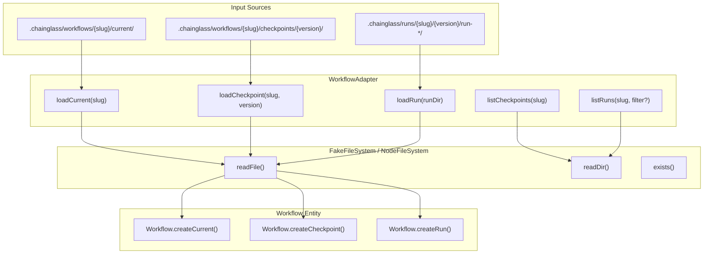
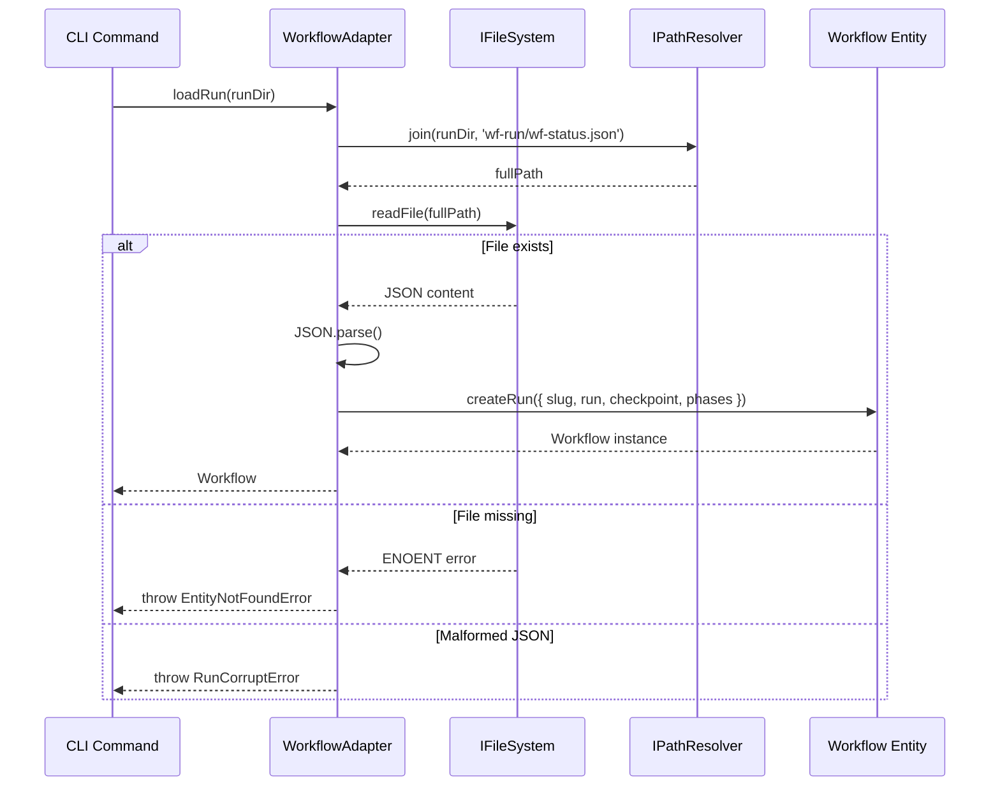
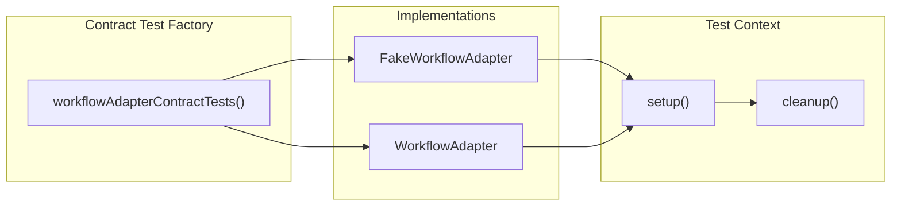

# Phase 3: Production Adapters – Tasks & Alignment Brief

**Spec**: [../../entity-upgrade-spec.md](../../entity-upgrade-spec.md)
**Plan**: [../../entity-upgrade-plan.md](../../entity-upgrade-plan.md)
**Date**: 2026-01-26

---

## Executive Briefing

### Purpose

This phase implements the real `WorkflowAdapter` and `PhaseAdapter` classes that hydrate entities from the filesystem. Without these adapters, the `cg runs list` command cannot discover runs and web integration cannot load workflow data. The fakes from Phase 2 enable TDD development; now we build the production implementations.

### What We're Building

Two production adapter classes that read from the `.chainglass/` directory structure:

1. **WorkflowAdapter** implementing `IWorkflowAdapter`:
   - `loadCurrent(slug)` - Read from `.chainglass/workflows/{slug}/current/`
   - `loadCheckpoint(slug, version)` - Read from `.chainglass/workflows/{slug}/checkpoints/{version}/`
   - `loadRun(runDir)` - Read from run directory, parse `wf-run/wf-status.json`
   - `listCheckpoints(slug)` - Scan checkpoints folder, return sorted by ordinal desc
   - `listRuns(slug, filter?)` - Scan runs folder with status/date/limit filtering
   - `exists(slug)` - Check workflow directory exists with valid `workflow.json`

2. **PhaseAdapter** implementing `IPhaseAdapter`:
   - `loadFromPath(phaseDir)` - Read `wf-phase.yaml` and `wf-data/wf-phase.json`
   - `listForWorkflow(workflow)` - List all phases for a workflow (template or run)

3. **Contract Tests** - Single test suite that runs against BOTH fake AND real adapters to verify parity. This catches drift between fake behavior and real implementation.

### User Value

- `cg runs list --workflow hello-wf` now works (discovers and lists run entities)
- `cg runs list --status active` filters runs by status
- Web UI can load workflow entities via adapters for rendering `<WorkflowCard>`
- Phase navigation enables workflow graph traversal

### Example

**Before (no adapters)**:
```typescript
// Manual assembly from scattered JSON reads
const statusJson = await fs.readFile(runDir + '/wf-run/wf-status.json');
const parsed = JSON.parse(statusJson);
const workflow = { slug: parsed.workflow.slug, ... }; // Ad-hoc construction
```

**After (with adapters)**:
```typescript
// Clean adapter pattern - single call returns hydrated entity
const adapter = container.resolve<IWorkflowAdapter>(WORKFLOW_DI_TOKENS.WORKFLOW_ADAPTER);
const run = await adapter.loadRun(runDir);

// Unified entity with all metadata populated
console.log(run.slug);           // 'hello-wf'
console.log(run.run?.status);    // 'active'
console.log(run.checkpoint?.ordinal);  // 1

// List with filtering
const activeRuns = await adapter.listRuns('hello-wf', { status: 'active' });
```

---

## Objectives & Scope

### Objective

Implement production WorkflowAdapter and PhaseAdapter classes that hydrate Workflow and Phase entities from the filesystem. Create contract tests that verify fake/real parity. Per plan § Phase 3: "Implement real adapters that hydrate entities from filesystem and provide navigation."

**Behavior Checklist** (from plan acceptance criteria):
- [x] WorkflowAdapter.loadCurrent() returns Workflow with isCurrent=true
- [x] WorkflowAdapter.loadCheckpoint() returns Workflow with checkpoint metadata
- [x] WorkflowAdapter.loadRun() returns Workflow with run metadata from wf-status.json
- [x] WorkflowAdapter.listCheckpoints() returns sorted array (ordinal desc)
- [x] WorkflowAdapter.listRuns() applies status filter before hydration
- [x] PhaseAdapter.loadFromPath() reads wf-phase.yaml and wf-data/wf-phase.json
- [x] PhaseAdapter.listForWorkflow() returns phases in execution order
- [x] All adapters use pathResolver.join() (no direct path.join())
- [x] Contract tests pass for both fake and real implementations

### Goals

- ✅ Write tests for WorkflowAdapter.loadCurrent() (TDD RED first)
- ✅ Write tests for WorkflowAdapter.loadCheckpoint()
- ✅ Write tests for WorkflowAdapter.loadRun()
- ✅ Write tests for WorkflowAdapter.listCheckpoints()
- ✅ Write tests for WorkflowAdapter.listRuns() with filtering
- ✅ Implement WorkflowAdapter class (TDD GREEN)
- ✅ Write tests for PhaseAdapter.loadFromPath()
- ✅ Write tests for PhaseAdapter.listForWorkflow()
- ✅ Implement PhaseAdapter class
- ✅ Create contract test factory for WorkflowAdapter
- ✅ Create contract test factory for PhaseAdapter
- ✅ Register adapters in production containers
- ✅ Create barrel exports for adapters

### Non-Goals

- ❌ CLI command implementation (Phase 4)
- ❌ Service refactoring to use adapters (Phase 6)
- ❌ Caching of any kind (spec Q5: always fresh reads)
- ❌ Full filter implementation in fakes (Phase 2 only does status-only)
- ❌ Web component integration (future work)
- ❌ Performance optimization (defer to Phase 6 if needed)
- ❌ Error recovery/retry logic (fail fast per spec Q6)

---

## Architecture Map

### Component Diagram

```mermaid
flowchart TD
    classDef pending fill:#9E9E9E,stroke:#757575,color:#fff
    classDef inprogress fill:#FF9800,stroke:#F57C00,color:#fff
    classDef completed fill:#4CAF50,stroke:#388E3C,color:#fff
    classDef blocked fill:#F44336,stroke:#D32F2F,color:#fff

    style Phase3 fill:#F5F5F5,stroke:#E0E0E0
    style WorkflowAdapter fill:#E3F2FD,stroke:#1976D2
    style PhaseAdapter fill:#E8F5E9,stroke:#388E3C
    style ContractTests fill:#FFF3E0,stroke:#F57C00
    style Container fill:#F3E5F5,stroke:#7B1FA2

    subgraph Phase3["Phase 3: Production Adapters"]
        subgraph WorkflowAdapter["WorkflowAdapter"]
            T001["T001: Test loadCurrent() ✓"]:::completed
            T002["T002: Test loadCheckpoint() ✓"]:::completed
            T003["T003: Test loadRun() ✓"]:::completed
            T004["T004: Test listCheckpoints() ✓"]:::completed
            T005["T005: Test listRuns() ✓"]:::completed
            T006["T006: Impl WorkflowAdapter ✓"]:::completed
            T001 --> T006
            T002 --> T006
            T003 --> T006
            T004 --> T006
            T005 --> T006
        end

        subgraph PhaseAdapter["PhaseAdapter"]
            T007["T007: Test loadFromPath() ✓"]:::completed
            T008["T008: Test listForWorkflow() ✓"]:::completed
            T009["T009: Impl PhaseAdapter ✓"]:::completed
            T007 --> T009
            T008 --> T009
        end

        subgraph ContractTests["Contract Tests"]
            T010["T010: WA contract factory ✓"]:::completed
            T011["T011: PA contract factory ✓"]:::completed
            T012["T012: Run WA contracts ✓"]:::completed
            T013["T013: Run PA contracts ✓"]:::completed
            T006 --> T010
            T009 --> T011
            T010 --> T012
            T011 --> T013
        end

        subgraph Container["DI & Exports"]
            T014["T014: Nav integration tests ✓"]:::completed
            T015["T015: Register in wf container ✓"]:::completed
            T016["T016: Register in CLI container ✓"]:::completed
            T017["T017: Barrel exports ✓"]:::completed
            T006 --> T014
            T009 --> T014
            T012 --> T015
            T013 --> T015
            T015 --> T016
            T016 --> T017
        end
    end

    subgraph Files["Files"]
        F1["/packages/workflow/src/adapters/workflow.adapter.ts ✓"]:::completed
        F2["/packages/workflow/src/adapters/phase.adapter.ts ✓"]:::completed
        F3["/packages/workflow/src/adapters/index.ts ✓"]:::completed
        F4["/packages/workflow/src/container.ts ✓"]:::completed
        F5["/apps/cli/src/lib/container.ts ✓"]:::completed
        FT1["/test/unit/workflow/workflow-adapter.test.ts ✓"]:::completed
        FT2["/test/unit/workflow/phase-adapter.test.ts ✓"]:::completed
        FC1["/test/contracts/workflow-adapter.contract.test.ts ✓"]:::completed
        FC2["/test/contracts/phase-adapter.contract.test.ts ✓"]:::completed
        FI1["/test/unit/workflow/entity-navigation.test.ts ✓"]:::completed
    end

    T001 -.-> FT1
    T002 -.-> FT1
    T003 -.-> FT1
    T004 -.-> FT1
    T005 -.-> FT1
    T006 -.-> F1
    T007 -.-> FT2
    T008 -.-> FT2
    T009 -.-> F2
    T010 -.-> FC1
    T011 -.-> FC2
    T014 -.-> FI1
    T015 -.-> F4
    T016 -.-> F5
    T017 -.-> F3
```

<!-- Status: grey=pending, orange=in-progress, green=completed, red=blocked -->
<!-- Updated by plan-6 during implementation -->



### Task-to-Component Mapping

<!-- Status: ⬜ Pending | 🟧 In Progress | ✅ Complete | 🔴 Blocked -->

| Task | Component(s) | Files | Status | Comment |
|------|-------------|-------|--------|---------|
| T001 | WorkflowAdapter.loadCurrent Tests | /test/unit/workflow/workflow-adapter.test.ts | ✅ Complete | TDD RED: Tests for current/ loading |
| T002 | WorkflowAdapter.loadCheckpoint Tests | /test/unit/workflow/workflow-adapter.test.ts | ✅ Complete | TDD RED: Tests for checkpoint loading |
| T003 | WorkflowAdapter.loadRun Tests | /test/unit/workflow/workflow-adapter.test.ts | ✅ Complete | TDD RED: Tests for run loading with wf-status.json |
| T004 | WorkflowAdapter.listCheckpoints Tests | /test/unit/workflow/workflow-adapter.test.ts | ✅ Complete | TDD RED: Tests for listing checkpoints sorted |
| T005 | WorkflowAdapter.listRuns Tests | /test/unit/workflow/workflow-adapter.test.ts | ✅ Complete | TDD RED: Tests for listing runs with filters |
| T006 | WorkflowAdapter Implementation | /packages/workflow/src/adapters/workflow.adapter.ts | ✅ Complete | CS-4: Core adapter with 6 methods |
| T007 | PhaseAdapter.loadFromPath Tests | /test/unit/workflow/phase-adapter.test.ts | ✅ Complete | TDD RED: Tests for phase loading |
| T008 | PhaseAdapter.listForWorkflow Tests | /test/unit/workflow/phase-adapter.test.ts | ✅ Complete | TDD RED: Tests for listing phases |
| T009 | PhaseAdapter Implementation | /packages/workflow/src/adapters/phase.adapter.ts | ✅ Complete | CS-3: Adapter with 2 methods |
| T010 | WorkflowAdapter Contract Factory | /test/contracts/workflow-adapter.contract.test.ts | ✅ Complete | Factory pattern for fake/real parity |
| T011 | PhaseAdapter Contract Factory | /test/contracts/phase-adapter.contract.test.ts | ✅ Complete | Factory pattern for fake/real parity |
| T012 | Run WorkflowAdapter Contracts | /test/contracts/workflow-adapter.contract.test.ts | ✅ Complete | Verify both implementations pass |
| T013 | Run PhaseAdapter Contracts | /test/contracts/phase-adapter.contract.test.ts | ✅ Complete | Verify both implementations pass |
| T014 | Entity Navigation Tests | /test/unit/workflow/entity-navigation.test.ts | ✅ Complete | Test: Workflow→phases, Phase→parent |
| T015 | Register in Workflow Container | /packages/workflow/src/container.ts | ✅ Complete | useFactory for production container |
| T016 | Register in CLI Container | /apps/cli/src/lib/container.ts | ✅ Complete | useFactory for production container |
| T017 | Barrel Exports | /packages/workflow/src/adapters/index.ts | ✅ Complete | Export WorkflowAdapter, PhaseAdapter |

---

## Tasks

| Status | ID | Task | CS | Type | Dependencies | Absolute Path(s) | Validation | Subtasks | Notes |
|--------|------|-------------------------------------|-----|------|--------------|------------------|------------|----------|-------|
| [x] | T001 | Write tests for WorkflowAdapter.loadCurrent() | 2 | Test | – | /home/jak/substrate/007-manage-workflows/test/unit/workflow/workflow-adapter.test.ts | Tests: loads from current/, returns Workflow with isCurrent=true, phases unpopulated | – | Per plan 3.1; Use FakeFileSystem |
| [x] | T002 | Write tests for WorkflowAdapter.loadCheckpoint() | 2 | Test | – | /home/jak/substrate/007-manage-workflows/test/unit/workflow/workflow-adapter.test.ts | Tests: loads from checkpoints/vXXX-hash/, returns Workflow with checkpoint metadata | – | Per plan 3.2 |
| [x] | T003 | Write tests for WorkflowAdapter.loadRun() | 2 | Test | – | /home/jak/substrate/007-manage-workflows/test/unit/workflow/workflow-adapter.test.ts | Tests: loads from runs/, returns Workflow with run metadata, parses wf-status.json | – | Per plan 3.3; Per Critical Discovery 02 (data locality) |
| [x] | T004 | Write tests for WorkflowAdapter.listCheckpoints() | 2 | Test | – | /home/jak/substrate/007-manage-workflows/test/unit/workflow/workflow-adapter.test.ts | Tests: lists checkpoints sorted by ordinal desc | – | Per plan 3.4 |
| [x] | T005 | Write tests for WorkflowAdapter.listRuns() | 3 | Test | – | /home/jak/substrate/007-manage-workflows/test/unit/workflow/workflow-adapter.test.ts | Tests: lists runs with status/date/limit filters, filters before hydration | – | Per plan 3.5; Critical for CLI |
| [x] | T006 | Implement WorkflowAdapter class | 4 | Core | T001, T002, T003, T004, T005 | /home/jak/substrate/007-manage-workflows/packages/workflow/src/adapters/workflow.adapter.ts | All tests from T001-T005 pass, uses pathResolver, handles all three sources | – | Per plan 3.6; Per Critical Discovery 04 (path security) |
| [x] | T007 | Write tests for PhaseAdapter.loadFromPath() | 2 | Test | – | /home/jak/substrate/007-manage-workflows/test/unit/workflow/phase-adapter.test.ts | Tests: loads phase from path, populates exists/valid/answered flags | – | Per plan 3.7 |
| [x] | T008 | Write tests for PhaseAdapter.listForWorkflow() | 2 | Test | – | /home/jak/substrate/007-manage-workflows/test/unit/workflow/phase-adapter.test.ts | Tests: lists all phases for a workflow (template or run), ordered by execution order | – | Per plan 3.8 |
| [x] | T009 | Implement PhaseAdapter class | 3 | Core | T007, T008 | /home/jak/substrate/007-manage-workflows/packages/workflow/src/adapters/phase.adapter.ts | All tests from T007-T008 pass | – | Per plan 3.9 |
| [x] | T010 | Create contract test factory for WorkflowAdapter | 2 | Test | T006 | /home/jak/substrate/007-manage-workflows/test/contracts/workflow-adapter.contract.test.ts | Single test suite runs against fake AND real | – | Per plan 3.10; Per Critical Discovery 06 |
| [x] | T011 | Create contract test factory for PhaseAdapter | 2 | Test | T009 | /home/jak/substrate/007-manage-workflows/test/contracts/phase-adapter.contract.test.ts | Single test suite runs against fake AND real | – | Per plan 3.11 |
| [x] | T012 | Run contract tests for WorkflowAdapter | 1 | Test | T010 | /home/jak/substrate/007-manage-workflows/test/contracts/workflow-adapter.contract.test.ts | Fake and real pass identical tests | – | Per plan 3.12 |
| [x] | T013 | Run contract tests for PhaseAdapter | 1 | Test | T011 | /home/jak/substrate/007-manage-workflows/test/contracts/phase-adapter.contract.test.ts | Fake and real pass identical tests | – | Per plan 3.13 |
| [x] | T014 | Write graph navigation integration tests | 2 | Test | T006, T009 | /home/jak/substrate/007-manage-workflows/test/unit/workflow/entity-navigation.test.ts | Test: Workflow (run) → phases, Phase → parent Workflow via adapters | – | Per plan 3.14 |
| [x] | T015 | Register adapters in workflow production container | 2 | Setup | T012, T013 | /home/jak/substrate/007-manage-workflows/packages/workflow/src/container.ts | createWorkflowProductionContainer() resolves both adapters | – | Per plan 3.15; Per ADR-0004 useFactory pattern |
| [x] | T016 | Register adapters in CLI production container | 2 | Setup | T015 | /home/jak/substrate/007-manage-workflows/apps/cli/src/lib/container.ts | createCliProductionContainer() resolves both adapters | – | Per plan 3.16 |
| [x] | T017 | Create barrel exports for adapters | 1 | Setup | T006, T009 | /home/jak/substrate/007-manage-workflows/packages/workflow/src/adapters/index.ts | WorkflowAdapter, PhaseAdapter exported from packages/workflow/src/adapters/index.ts | – | Per plan 3.17 |

---

## Alignment Brief

### Prior Phases Review

#### Phase 1: Entity Interfaces & Pure Data Classes (Complete)

**A. Deliverables Created**:
- `/home/jak/substrate/007-manage-workflows/packages/workflow/src/errors/entity-not-found.error.ts` — EntityNotFoundError class with context fields
- `/home/jak/substrate/007-manage-workflows/packages/workflow/src/errors/run-errors.ts` — CLI error classes E050-E053 (RunNotFoundError, RunsDirNotFoundError, InvalidRunStatusError, RunCorruptError)
- `/home/jak/substrate/007-manage-workflows/packages/workflow/src/interfaces/workflow-adapter.interface.ts` — IWorkflowAdapter with 6 methods
- `/home/jak/substrate/007-manage-workflows/packages/workflow/src/interfaces/phase-adapter.interface.ts` — IPhaseAdapter with 2 methods
- `/home/jak/substrate/007-manage-workflows/packages/workflow/src/entities/workflow.ts` — Workflow entity with factory pattern (createCurrent, createCheckpoint, createRun)
- `/home/jak/substrate/007-manage-workflows/packages/workflow/src/entities/phase.ts` — Phase entity with 7 field groups, 20+ properties
- `/home/jak/substrate/007-manage-workflows/packages/shared/src/di-tokens.ts` — Added WORKFLOW_ADAPTER, PHASE_ADAPTER tokens

**B. Lessons Learned**:
- Factory pattern (DYK-02) enforces XOR invariant via private constructor + static factories
- load*() naming convention (DYK-04) for adapter methods - not from*()
- toJSON() rules (DYK-03): camelCase, undefined→null, Date→ISO string
- JSDoc forward slashes need escaping to avoid TypeScript parser issues

**C. Technical Discoveries**:
- Object.freeze() on arrays for immutability in entities
- Error prototype chain requires Object.setPrototypeOf for proper extension
- Error codes moved to E050-E059 range (per DYK-05)

**D. Dependencies Exported for Phase 3**:
- `Workflow` class with `createCurrent()`, `createCheckpoint()`, `createRun()` factories
- `Phase` class with full data model (all 7 field groups)
- `IWorkflowAdapter` interface with 6 methods + `RunListFilter` type
- `IPhaseAdapter` interface with 2 methods
- `EntityNotFoundError`, `RunCorruptError`, `RunNotFoundError` for error handling
- `WORKFLOW_DI_TOKENS.WORKFLOW_ADAPTER`, `WORKFLOW_DI_TOKENS.PHASE_ADAPTER`

**E. Critical Findings Applied**: Discovery 01 (entities pure data), Discovery 05 (DI tokens)

**F. Incomplete/Blocked Items**: None - all 14 tasks complete

**G. Test Infrastructure**: 62 entity tests created (10 + 5 + 22 + 25)

**H. Technical Debt**: None

**I. Architectural Decisions**: Unified entity model, factory pattern, Phase same structure for template/run

**J. Scope Changes**: Error codes E040-E049 → E050-E059

**K. Key Log References**: `./phase-1-entity-interfaces-pure-data-classes/execution.log.md`

---

#### Phase 2: Fake Adapters for Testing (Complete)

**A. Deliverables Created**:
- `/home/jak/substrate/007-manage-workflows/packages/workflow/src/fakes/fake-workflow-adapter.ts` — FakeWorkflowAdapter with call tracking, configurable results
- `/home/jak/substrate/007-manage-workflows/packages/workflow/src/fakes/fake-phase-adapter.ts` — FakePhaseAdapter with call tracking, configurable results
- `/home/jak/substrate/007-manage-workflows/packages/workflow/src/fakes/index.ts` — Barrel exports for fakes
- `/home/jak/substrate/007-manage-workflows/packages/workflow/src/container.ts` — Test container registrations (useValue)
- `/home/jak/substrate/007-manage-workflows/apps/cli/src/lib/container.ts` — CLI test container registrations (useValue)

**B. Lessons Learned**:
- Call capture pattern (not FakeFileSystem) - fakes are pure in-memory
- EntityNotFoundError for entity lookups, empty arrays for collections
- Status-only filtering for listRuns (~10 lines, not full filter complexity)
- Private arrays + spread operator for immutability (matches 28+ existing fakes)
- useValue pattern for test containers (per ADR-0004)

**C. Technical Discoveries**:
- Interface signature determines behavior: `Promise<Workflow>` requires throw, not Result
- Fakes demonstrate intent without duplicating production complexity
- Both container patterns valid: containers for integration, direct instantiation for unit tests

**D. Dependencies Exported for Phase 3**:
- `FakeWorkflowAdapter` — For contract tests (run same tests against fake AND real)
- `FakePhaseAdapter` — For contract tests
- Call tracking types: `LoadCurrentCall`, `LoadCheckpointCall`, `LoadRunCall`, `ListCheckpointsCall`, `ListRunsCall`, `ExistsCall`
- Test container patterns established (useValue)

**E. Critical Findings Applied**: Discovery 05 (DI tokens), Discovery 06 (contract tests required)

**F. Incomplete/Blocked Items**: None - all 8 tasks complete

**G. Test Infrastructure**: 40 new tests (24 + 11 + 5):
- `/home/jak/substrate/007-manage-workflows/test/unit/workflow/fake-workflow-adapter.test.ts` (24 tests)
- `/home/jak/substrate/007-manage-workflows/test/unit/workflow/fake-phase-adapter.test.ts` (11 tests)
- `/home/jak/substrate/007-manage-workflows/test/unit/workflow/container.test.ts` (5 tests)

**H. Technical Debt**: None

**I. Architectural Decisions**:
- Call capture pattern over FakeFileSystem for adapter fakes
- Status-only filtering in fakes (full filter logic in production)
- Export from main barrel (follows established pattern)

**J. Scope Changes**: None

**K. Key Log References**: `./phase-2-fake-adapters-for-testing/execution.log.md`

---

### Cross-Phase Synthesis

**Phase-by-Phase Evolution**:
1. Phase 1 established interfaces and entities (pure data classes with factory pattern)
2. Phase 2 created fakes implementing those interfaces with call tracking
3. Phase 3 now implements production adapters with real filesystem I/O

**Cumulative Deliverables Available**:
- **Entities**: Workflow, Phase (from Phase 1)
- **Interfaces**: IWorkflowAdapter, IPhaseAdapter, RunListFilter (from Phase 1)
- **Errors**: EntityNotFoundError, RunCorruptError, RunNotFoundError, etc. (from Phase 1)
- **Fakes**: FakeWorkflowAdapter, FakePhaseAdapter (from Phase 2)
- **DI Tokens**: WORKFLOW_ADAPTER, PHASE_ADAPTER (from Phase 1)
- **Container Patterns**: useValue for test containers established (from Phase 2)

**Pattern Evolution**:
- Phase 1: Pure data entities with no adapter references
- Phase 2: Call capture fakes with configurable results
- Phase 3: Production adapters with real filesystem I/O

**Foundation for Current Phase**:
- Interfaces define exactly what adapters must implement
- Fakes demonstrate expected behavior for each method
- Entities provide the return types with factory constructors
- Error classes ready for throwing on invalid filesystem state

---

### Critical Findings Affecting This Phase

#### 1. Discovery 02: Data Locality - Load From Entity's Own Path
**What it constrains**: Each entity must load from its own filesystem location, never from parent sources.
**Impact on tasks**: WorkflowAdapter.loadRun() reads from `runDir/wf-run/wf-status.json`, not from checkpoint wf.yaml.
**Addressed by**: T003, T006

#### 2. Discovery 03: No Caching - Always Fresh Reads
**What it constrains**: Adapters must not cache results. Every method call does fresh I/O.
**Impact on tasks**: No `Map<string, Workflow>` caches in adapter implementations.
**Addressed by**: T006, T009

#### 3. Discovery 04: Path Security Mandatory
**What it constrains**: MANDATORY use of `IPathResolver.join()` for all path operations.
**Impact on tasks**: Never use `path.join()` directly in adapters.
**Addressed by**: T006, T009 (code review gate)

#### 4. Discovery 06: Fake Adapter Contract Tests Required
**What it constrains**: Contract tests must verify fake/real parity to prevent drift.
**Impact on tasks**: T010-T013 create and run contract test factories.
**Addressed by**: T010, T011, T012, T013

---

### ADR Decision Constraints

**ADR-0004: DI Container Architecture**
- Decision: Use `useFactory` for production adapters, `useValue` for test containers
- Constrains: Production container must use `useFactory` pattern (not `useClass`)
- Addressed by: T015, T016

---

### Invariants & Guardrails

- **Path Security**: All file paths MUST use `pathResolver.join()` (per Critical Discovery 04)
- **No Caching**: No `Map` or memoization in adapters (per spec Q5)
- **Data Locality**: Load from entity's own path (per Critical Discovery 02)
- **Fail Fast**: Throw errors immediately on invalid data (per spec Q6)
- **Interface Compliance**: Adapters must match IWorkflowAdapter/IPhaseAdapter exactly

---

### Inputs to Read

**Entity Definitions** (return these from adapters):
- `/home/jak/substrate/007-manage-workflows/packages/workflow/src/entities/workflow.ts`
- `/home/jak/substrate/007-manage-workflows/packages/workflow/src/entities/phase.ts`

**Interface Definitions** (implement these):
- `/home/jak/substrate/007-manage-workflows/packages/workflow/src/interfaces/workflow-adapter.interface.ts`
- `/home/jak/substrate/007-manage-workflows/packages/workflow/src/interfaces/phase-adapter.interface.ts`

**Fake Implementations** (use for contract tests):
- `/home/jak/substrate/007-manage-workflows/packages/workflow/src/fakes/fake-workflow-adapter.ts`
- `/home/jak/substrate/007-manage-workflows/packages/workflow/src/fakes/fake-phase-adapter.ts`

**Error Classes** (throw these):
- `/home/jak/substrate/007-manage-workflows/packages/workflow/src/errors/entity-not-found.error.ts`
- `/home/jak/substrate/007-manage-workflows/packages/workflow/src/errors/run-errors.ts`

**Existing Adapter Patterns** (follow these):
- `/home/jak/substrate/007-manage-workflows/packages/workflow/src/adapters/yaml-parser.adapter.ts`

**Filesystem Interface** (use for I/O):
- `/home/jak/substrate/007-manage-workflows/packages/shared/src/interfaces/filesystem.interface.ts`
- `/home/jak/substrate/007-manage-workflows/packages/shared/src/fakes/fake-filesystem.ts` (for tests)

**Container Patterns** (follow for registration):
- `/home/jak/substrate/007-manage-workflows/packages/workflow/src/container.ts`
- `/home/jak/substrate/007-manage-workflows/apps/cli/src/lib/container.ts`

**Contract Test Pattern** (follow for factory):
- `/home/jak/substrate/007-manage-workflows/test/contracts/filesystem.contract.ts`
- `/home/jak/substrate/007-manage-workflows/test/contracts/workflow-registry.contract.test.ts`

---

### Visual Alignment Aids

#### Flow Diagram: Adapter Loading Flow



#### Sequence Diagram: loadRun() with wf-status.json Parsing



#### Contract Test Factory Pattern



---

### Test Plan (TDD, FakeFileSystem for Production Adapter Tests)

Following Full TDD strategy: RED tests first, GREEN implementation.

#### WorkflowAdapter Tests (T001-T005)

| Test Name | Rationale | Fixture | Expected |
|-----------|-----------|---------|----------|
| loadCurrent: should load workflow from current/ | Core happy path | wf.yaml in current/ | isCurrent=true, isCheckpoint=false, isRun=false |
| loadCurrent: should throw EntityNotFoundError when current/ missing | Error handling | No files | EntityNotFoundError thrown |
| loadCheckpoint: should load workflow with checkpoint metadata | Core happy path | wf.yaml + checkpoint-metadata.json | isCheckpoint=true, checkpoint.ordinal populated |
| loadCheckpoint: should throw EntityNotFoundError when version missing | Error handling | No checkpoint dir | EntityNotFoundError thrown |
| loadRun: should load workflow from run with wf-status.json | Core happy path per Discovery 02 | wf-status.json in wf-run/ | isRun=true, run.status populated |
| loadRun: should throw EntityNotFoundError when runDir missing | Error handling | No run dir | EntityNotFoundError thrown |
| loadRun: should throw RunCorruptError when wf-status.json malformed | Fail fast per spec Q6 | Invalid JSON | RunCorruptError thrown |
| listCheckpoints: should return checkpoints sorted by ordinal desc | Sort order | 3 checkpoints (v001, v002, v003) | [v003, v002, v001] |
| listCheckpoints: should return empty array when no checkpoints | Empty case | No checkpoints dir | [] |
| listRuns: should return all runs when no filter | Default behavior | 3 runs | 3 Workflow entities |
| listRuns: should filter by status | Filter functionality | 2 active + 1 complete | filter active → 2 |
| listRuns: should filter by createdAfter | Date filter | Mixed dates | Only newer runs |
| listRuns: should filter by limit | Pagination | 5 runs | limit 2 → 2 |
| listRuns: should return empty when workflow has no runs | Empty case | No runs dir | [] |
| exists: should return true when workflow exists | Happy path | workflow.json exists | true |
| exists: should return false when workflow missing | Missing case | No workflow dir | false |

#### PhaseAdapter Tests (T007-T008)

| Test Name | Rationale | Fixture | Expected |
|-----------|-----------|---------|----------|
| loadFromPath: should load phase from wf-phase.yaml | Core happy path | wf-phase.yaml | Phase with definition fields |
| loadFromPath: should merge runtime state from wf-data/wf-phase.json | Runtime state | Both files | exists/valid/answered populated |
| loadFromPath: should work without wf-data (template phase) | Template case | Only wf-phase.yaml | status='pending' |
| loadFromPath: should throw EntityNotFoundError when phaseDir missing | Error handling | No dir | EntityNotFoundError thrown |
| listForWorkflow: should list phases in execution order | Sort order | 3 phases | ordered by `order` field |
| listForWorkflow: should work for template workflow | Template case | current/ workflow | Phases with unpopulated runtime |
| listForWorkflow: should work for run workflow | Run case | run/ workflow | Phases with runtime state |

#### Contract Tests (T010-T013)

| Test Suite | Implementations | Key Contracts |
|------------|-----------------|---------------|
| WorkflowAdapter Contract | FakeWorkflowAdapter, WorkflowAdapter | loadCurrent returns isCurrent=true, loadRun returns isRun=true, listRuns filters correctly |
| PhaseAdapter Contract | FakePhaseAdapter, PhaseAdapter | loadFromPath returns Phase, listForWorkflow returns ordered phases |

---

### Step-by-Step Implementation Outline

1. **T001-T005: Write WorkflowAdapter tests** (RED)
   - Create `/test/unit/workflow/workflow-adapter.test.ts`
   - Use `FakeFileSystem` to set up filesystem fixtures
   - Import `WorkflowAdapter` (will fail - class doesn't exist)
   - Run tests → all fail

2. **T006: Implement WorkflowAdapter** (GREEN)
   - Create `/packages/workflow/src/adapters/workflow.adapter.ts`
   - Inject `IFileSystem`, `IPathResolver`, `IYamlParser`
   - Implement all 6 methods using injected dependencies
   - **CRITICAL**: Use `pathResolver.join()` for ALL path operations
   - Run tests → all pass

3. **T007-T008: Write PhaseAdapter tests** (RED)
   - Create `/test/unit/workflow/phase-adapter.test.ts`
   - Use `FakeFileSystem` for fixtures
   - Run tests → all fail

4. **T009: Implement PhaseAdapter** (GREEN)
   - Create `/packages/workflow/src/adapters/phase.adapter.ts`
   - Inject `IFileSystem`, `IPathResolver`, `IYamlParser`
   - Implement both methods
   - Run tests → all pass

5. **T010-T011: Create contract test factories**
   - Create `/test/contracts/workflow-adapter.contract.test.ts`
   - Create `/test/contracts/phase-adapter.contract.test.ts`
   - Follow `fileSystemContractTests` pattern

6. **T012-T013: Run contract tests**
   - Wire up both FakeWorkflowAdapter and WorkflowAdapter to factory
   - Verify identical behavior

7. **T014: Write navigation integration tests**
   - Test Workflow → phases via PhaseAdapter
   - Test Phase → parent Workflow (via workflowDir reference)

8. **T015-T016: Register in production containers**
   - Add `useFactory` registrations to production containers
   - Test containers already have `useValue` with fakes (Phase 2)

9. **T017: Create barrel exports**
   - Export from `/packages/workflow/src/adapters/index.ts`
   - Ensure main barrel includes new exports

---

### Commands to Run

```bash
# Install dependencies (if needed)
pnpm install

# Verify baseline tests pass
pnpm test

# Run workflow package tests
pnpm test --filter @chainglass/workflow

# Run specific adapter tests (after creating)
pnpm test --filter @chainglass/workflow -- --grep "WorkflowAdapter"
pnpm test --filter @chainglass/workflow -- --grep "PhaseAdapter"

# Run contract tests
pnpm test -- --grep "contract"

# Type check
pnpm typecheck --filter @chainglass/workflow

# Build to verify exports
pnpm build --filter @chainglass/workflow

# Lint
pnpm lint --filter @chainglass/workflow
```

---

### Risks/Unknowns

| Risk | Severity | Mitigation |
|------|----------|------------|
| Filesystem structure assumptions wrong | High | Validate against existing manual-test runs |
| Path security vulnerability | Critical | Code review gate for pathResolver.join() usage |
| Fake behavior diverges from real | Medium | Contract tests catch this (T010-T013) |
| Performance with many runs | Medium | Filter before hydration (listRuns) |
| wf-status.json schema drift | Low | Validate against existing runs first |

---

### Ready Check

- [x] Phase 1 complete (all 14 tasks) ✅
- [x] Phase 2 complete (all 8 tasks) ✅
- [x] Interfaces to implement are understood (IWorkflowAdapter, IPhaseAdapter) ✅
- [x] Entity classes understood (Workflow, Phase factory patterns) ✅
- [x] Error classes available (EntityNotFoundError, RunCorruptError) ✅
- [x] FakeFileSystem pattern understood ✅
- [x] Contract test factory pattern understood ✅
- [x] ADR-0004 constraints mapped to tasks (T015, T016) ✅
- [x] Critical discoveries mapped to tasks ✅
  - Discovery 02 (data locality) → T003, T006
  - Discovery 03 (no caching) → T006, T009
  - Discovery 04 (path security) → T006, T009
  - Discovery 06 (contract tests) → T010-T013

**Status**: ✅ READY FOR GO

---

## Phase Footnote Stubs

| Footnote | Task | Description | Added |
|----------|------|-------------|-------|
| | | | |

_Populated by plan-6 during implementation._

---

## Evidence Artifacts

**Execution Log**: `./execution.log.md` (created by plan-6)

**Test Evidence**:
- WorkflowAdapter tests: `/home/jak/substrate/007-manage-workflows/test/unit/workflow/workflow-adapter.test.ts`
- PhaseAdapter tests: `/home/jak/substrate/007-manage-workflows/test/unit/workflow/phase-adapter.test.ts`
- WorkflowAdapter contract tests: `/home/jak/substrate/007-manage-workflows/test/contracts/workflow-adapter.contract.test.ts`
- PhaseAdapter contract tests: `/home/jak/substrate/007-manage-workflows/test/contracts/phase-adapter.contract.test.ts`
- Navigation tests: `/home/jak/substrate/007-manage-workflows/test/unit/workflow/entity-navigation.test.ts`

---

## Discoveries & Learnings

_Populated during implementation by plan-6. Log anything of interest to your future self._

| Date | Task | Type | Discovery | Resolution | References |
|------|------|------|-----------|------------|------------|
| | | | | | |

**Types**: `gotcha` | `research-needed` | `unexpected-behavior` | `workaround` | `decision` | `debt` | `insight`

**What to log**:
- Things that didn't work as expected
- External research that was required
- Implementation troubles and how they were resolved
- Gotchas and edge cases discovered
- Decisions made during implementation
- Technical debt introduced (and why)
- Insights that future phases should know about

_See also: `execution.log.md` for detailed narrative._

---

## Directory Layout

```
docs/plans/010-entity-upgrade/
├── entity-upgrade-spec.md
├── entity-upgrade-plan.md
└── tasks/
    ├── phase-1-entity-interfaces-pure-data-classes/
    │   ├── tasks.md
    │   └── execution.log.md
    ├── phase-2-fake-adapters-for-testing/
    │   ├── tasks.md
    │   └── execution.log.md
    └── phase-3-production-adapters/
        ├── tasks.md              # ← YOU ARE HERE
        └── execution.log.md      # created by plan-6
```

---

## Acceptance Criteria

- [x] All 17 tasks complete
- [x] All adapter tests passing (`pnpm test --filter @chainglass/workflow`)
- [x] Contract tests pass for both fake AND real (WorkflowAdapter and PhaseAdapter)
- [x] All adapters use pathResolver.join() (code review verified)
- [x] Graph navigation test passes (Workflow → phases, Phase → parent Workflow)
- [x] TypeScript strict mode passes (`pnpm typecheck`)
- [x] 1400+ tests still passing (no regressions) - 1508 tests passing

---

## Critical Insights Discussion

**Session**: 2026-01-26 05:25 UTC
**Context**: Phase 3: Production Adapters - Pre-implementation clarity session
**Analyst**: AI Clarity Agent
**Reviewer**: Development Team
**Format**: Water Cooler Conversation (5 Critical Insights)

### Insight 1: JSON.parse() Without Try-Catch Will Leak Generic Errors

**Did you know**: When `WorkflowAdapter.loadRun()` calls `JSON.parse()` on `wf-status.json`, a malformed file throws a generic `SyntaxError` instead of the structured `RunCorruptError` that the interface contract promises.

**Implications**:
- CLI error handling won't catch it properly (not a `RunCorruptError`)
- Error message won't include run path or actionable guidance
- Interface contract (`@throws RunCorruptError`) is violated
- Pattern would be copy-pasted into new adapter if not addressed

**Options Considered**:
- Option A: Try-catch wrapper at each parse site, throw `RunCorruptError`
- Option B: Centralized `parseJsonOrThrow()` utility function
- Option C: Use SchemaValidator for parse + validation (requires interface change)

**AI Recommendation**: Option A - Try-catch wrapper
- Reasoning: Simple, matches interface contract, uses existing `RunCorruptError` class (E053)

**Discussion Summary**: User agreed with Option A. Simple try-catch at each JSON.parse site is sufficient.

**Decision**: Wrap all `JSON.parse()` calls for wf-status.json in try-catch, throw `RunCorruptError`

**Action Items**:
- [ ] T006: Add try-catch around JSON.parse calls, throw RunCorruptError on failure

**Affects**: T006 (WorkflowAdapter implementation)

---

### Insight 2: FakeFileSystem is Ready - No Enhancement Needed

**Did you know**: FakeFileSystem already has 100% coverage of the IFileSystem interface (all 10 methods), plus test helpers (`setFile`, `setDir`, `reset`), and is verified by contract tests.

**Implications**:
- No pre-emptive audit needed
- No specialized MockAdapterFileSystem needed
- Tests can use `fs.setFile()` directly for fixture setup
- Contract tests catch any fake/real behavioral drift automatically

**Options Considered**:
- Option A: Use existing FakeFileSystem as-is
- Option B: Pre-emptive audit before starting tests
- Option C: Create MockAdapterFileSystem for adapter testing

**AI Recommendation**: Option A - Use existing FakeFileSystem as-is
- Reasoning: Already complete, proven pattern (20+ test files), contract tests verify correctness

**Discussion Summary**: User agreed. Proceed directly to T001 without prep work.

**Decision**: Use existing FakeFileSystem as-is for all adapter tests

**Action Items**: None - proceed directly to T001

**Affects**: T001-T005 (all WorkflowAdapter tests)

---

### Insight 3: Contract Test Factory Pattern is Already Established

**Did you know**: The codebase has 4 existing contract test suites using an identical factory pattern that Phase 3 should follow exactly.

**Implications**:
- Factory pattern with `setup()`/`cleanup()` is the standard
- Real adapter uses FakeFileSystem for setup; fake adapter uses `setResult()` properties
- This asymmetry is expected and handled by separate factory functions
- Same test suite runs against both implementations

**Options Considered**:
- Option A: Follow established factory pattern from workflow-registry.contract.test.ts
- Option B: Create shared fixture factory (new abstraction)
- Option C: Skip contract tests (violates Critical Discovery 08)

**AI Recommendation**: Option A - Follow established factory pattern
- Reasoning: Consistent with 4 existing contract test suites, proven at scale (856 lines in phase-service)

**Discussion Summary**: User agreed. Follow the template.

**Decision**: Follow established factory pattern from `workflow-registry.contract.test.ts`

**Action Items**: None - follow existing template

**Affects**: T010-T013 (contract test tasks)

---

### Insight 4: Filesystem Path Patterns Are Already Verified by Code

**Did you know**: The path patterns documented in the plan exactly match what's implemented, with regex patterns already validating naming conventions and security built into `PathResolverAdapter`.

**Implications**:
- Checkpoint pattern: `/^v(\d{3})-[a-f0-9]{8}$/` (regex validated)
- Run ID pattern: `/^run-${date}-(\d{3})$/` (regex validated)
- Path security: `PathSecurityError` thrown for traversal attempts
- Documentation in `5-workflow-management.md` matches implementation

**Options Considered**:
- Option A: Extract path patterns to shared constants (good follow-up)
- Option B: Add path integration tests (may be redundant)
- Option C: Trust documented paths, implement directly

**AI Recommendation**: Option C - Trust documented paths, implement directly
- Reasoning: Verification confirmed docs match implementation; security is built-in

**Discussion Summary**: User agreed. No prep work needed.

**Decision**: Use documented paths directly per plan

**Action Items**: None - follow plan's documented path patterns

**Affects**: T006, T009 (adapter implementations)

---

### Insight 5: Phase Ordering Needs Defensive Sorting for Duplicate Orders

**Did you know**: The existing `WorkflowService` sorts phases with simple numeric comparison that produces unstable ordering when two phases have the same order value.

**Implications**:
- Order field is required (schema catches missing orders)
- No duplicate validation exists - same-order phases have non-deterministic sort
- Interface contract requires sorted return
- Real adapter must explicitly sort (fake doesn't sort)

**Options Considered**:
- Option A: Strict validation - throw error on duplicate orders
- Option B: Defensive sorting with name-based tiebreaker
- Option C: Filename-based ordering (contradicts data model)

**AI Recommendation**: Option B - Defensive sorting with tiebreaker
- Reasoning: Stable, deterministic, non-breaking, satisfies interface contract

**Discussion Summary**: User agreed. Use tiebreaker for stable sorting.

**Decision**: Use `.sort((a, b) => a.order - b.order || a.name.localeCompare(b.name))`

**Action Items**:
- [ ] T009: Implement defensive sorting with name-based tiebreaker

**Affects**: T009 (PhaseAdapter implementation)

---

## Session Summary

**Insights Surfaced**: 5 critical insights identified and discussed
**Decisions Made**: 5 decisions reached through collaborative discussion
**Action Items Created**: 2 implementation notes for T006 and T009
**Areas Requiring Updates**: None - insights inform implementation, no plan changes needed

**Shared Understanding Achieved**: ✓

**Confidence Level**: High - All insights verified against codebase with FlowSpace

**Next Steps**: Proceed to T001 - Write tests for WorkflowAdapter.loadCurrent()

**Notes**:
- All 5 verification subagents completed successfully
- Insights grounded in actual code references, not assumptions
- Decisions align with existing codebase patterns
