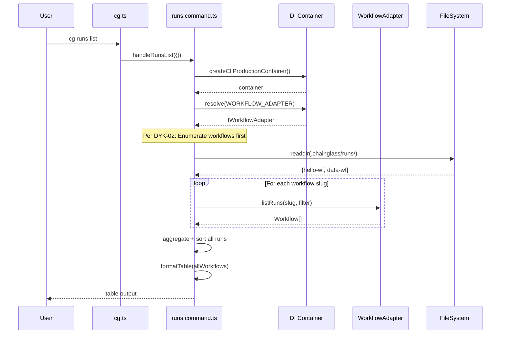
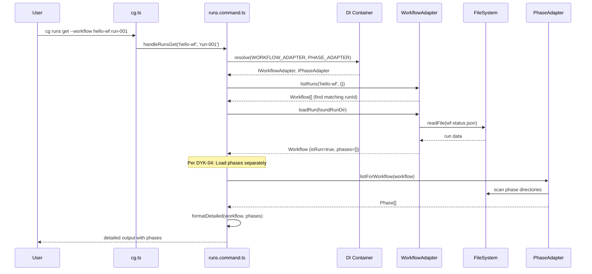

# Phase 4: CLI `cg runs` Commands – Tasks & Alignment Brief

**Spec**: [../entity-upgrade-spec.md](../entity-upgrade-spec.md)
**Plan**: [../entity-upgrade-plan.md](../entity-upgrade-plan.md)
**Date**: 2026-01-26

---

## Executive Briefing

### Purpose
This phase implements the `cg runs list` and `cg runs get` CLI commands, enabling users to view and inspect workflow runs from the command line. These commands are critical missing features that unlock visibility into the runs directory structure.

### What We're Building
A new `cg runs` command group with two subcommands:
- `cg runs list` — List all workflow runs with filtering by workflow slug and status
- `cg runs get --workflow <slug> <run-id>` — Display detailed information about a specific run including its phases

The commands leverage the `IWorkflowAdapter.listRuns()` and `loadRun()` methods implemented in Phase 3, following the established CLI patterns from `workflow.command.ts`.

### User Value
Users gain visibility into their workflow runs:
- See all runs across workflows or filtered by specific workflow
- Filter by status (pending, running, completed, failed)
- Inspect individual run details including phase progress
- Output in table format (human-readable) or JSON (automation-friendly)

### Example
```bash
# List all runs
$ cg runs list
NAME         WORKFLOW    VERSION   STATUS      AGE
run-001      hello-wf    v001      completed   2h
run-002      hello-wf    v001      running     5m
run-003      data-wf     v002      pending     1m

# Filter by workflow
$ cg runs list --workflow hello-wf

# Filter by status
$ cg runs list --status completed

# JSON output for automation
$ cg runs list -o json

# Get specific run details (requires workflow slug per DYK-01)
$ cg runs get --workflow hello-wf run-001
Run: run-001
Workflow: hello-wf
Version: v001-abc123
Status: completed
Created: 2026-01-26T10:00:00Z

Phases:
  NAME      STATUS      STARTED             COMPLETED
  gather    completed   10:00:05Z           10:01:23Z
  analyze   completed   10:01:25Z           10:05:42Z
  report    completed   10:05:44Z           10:08:15Z
```

---

## Objectives & Scope

### Objective
Implement `cg runs list` and `cg runs get` commands per plan Phase 4, using the unified WorkflowAdapter to provide run visibility through the CLI.

### Goals

- ✅ Create `registerRunsCommands()` function following `registerWorkflowCommands()` pattern
- ✅ Implement `cg runs list` handler calling `IWorkflowAdapter.listRuns()`
- ✅ Add `--workflow` filter flag for filtering by workflow slug
- ✅ Add `--status` filter flag for filtering by run status
- ✅ Add `-o/--output` format flag supporting: table (default), json
- ✅ Implement `cg runs get --workflow <slug> <run-id>` handler calling `IWorkflowAdapter.loadRun()`
- ✅ Create console output formatters for list and get commands
- ✅ Register runs commands in CLI entry point
- ✅ Full TDD with FakeWorkflowAdapter (no vi.mock)

### Non-Goals

- ❌ Authentication/authorization (not in scope for CLI)
- ❌ Run creation/deletion commands (handled by `cg workflow compose`)
- ❌ Real-time run monitoring/watch mode (future enhancement)
- ❌ Run cancellation/abort functionality (future enhancement)
- ❌ Wide output format (table and json sufficient for MVP)
- ❌ Name-only output format (can add later if needed)
- ❌ Pagination support (runs list is typically small)
- ❌ PhaseAdapter usage (runs.get shows phase summary from Workflow entity)

---

## Architecture Map

### Component Diagram

```mermaid
flowchart TD
    classDef pending fill:#9E9E9E,stroke:#757575,color:#fff
    classDef inprogress fill:#FF9800,stroke:#F57C00,color:#fff
    classDef completed fill:#4CAF50,stroke:#388E3C,color:#fff
    classDef blocked fill:#F44336,stroke:#D32F2F,color:#fff

    style Phase fill:#F5F5F5,stroke:#E0E0E0
    style Files fill:#F5F5F5,stroke:#E0E0E0
    style Tests fill:#F5F5F5,stroke:#E0E0E0

    subgraph Phase["Phase 4: CLI cg runs Commands"]
        T001["T001: Test registerRunsCommands()"]:::pending
        T002["T002: Create registerRunsCommands()"]:::pending
        T003["T003: Test runs list handler"]:::pending
        T004["T004: Implement runs list handler"]:::pending
        T005["T005: Test --workflow filter"]:::pending
        T006["T006: Add --workflow flag"]:::pending
        T007["T007: Test --status filter"]:::pending
        T008["T008: Add --status flag"]:::pending
        T009["T009: Test -o json output"]:::pending
        T010["T010: Add -o/--output flag"]:::pending
        T011["T011: Test runs get handler"]:::pending
        T012["T012: Implement runs get"]:::pending
        T013["T013: Test list formatter"]:::pending
        T014["T014: Add list formatter"]:::pending
        T015["T015: Test get formatter"]:::pending
        T016["T016: Add get formatter"]:::pending
        T017["T017: Register in CLI entry"]:::pending
        T018["T018: Integration test"]:::pending

        T001 --> T002
        T002 --> T003
        T003 --> T004
        T004 --> T005
        T005 --> T006
        T006 --> T007
        T007 --> T008
        T008 --> T009
        T009 --> T010
        T010 --> T011
        T011 --> T012
        T012 --> T013
        T013 --> T014
        T014 --> T015
        T015 --> T016
        T016 --> T017
        T017 --> T018
    end

    subgraph Files["Source Files"]
        F1["/apps/cli/src/commands/runs.command.ts"]:::pending
        F2["/apps/cli/src/bin/cg.ts"]:::pending
        F3["/apps/cli/src/commands/index.ts"]:::pending
    end

    subgraph Tests["Test Files"]
        T1["/test/unit/cli/runs-command.test.ts"]:::pending
        T2["/test/integration/cli/runs-cli.integration.test.ts"]:::pending
    end

    T001 -.-> T1
    T002 -.-> F1
    T003 -.-> T1
    T004 -.-> F1
    T005 -.-> T1
    T006 -.-> F1
    T007 -.-> T1
    T008 -.-> F1
    T009 -.-> T1
    T010 -.-> F1
    T011 -.-> T1
    T012 -.-> F1
    T013 -.-> T1
    T014 -.-> F1
    T015 -.-> T1
    T016 -.-> F1
    T017 -.-> F2
    T017 -.-> F3
    T018 -.-> T2
```

<!-- Status: grey=pending, orange=in-progress, green=completed, red=blocked -->
<!-- Updated by plan-6 during implementation -->



### Task-to-Component Mapping

<!-- Status: ⬜ Pending | 🟧 In Progress | ✅ Complete | 🔴 Blocked -->

| Task | Component(s) | Files | Status | Comment |
|------|-------------|-------|--------|---------|
| T001 | Test Infrastructure | runs-command.test.ts | ⬜ Pending | TDD: Write test for command registration |
| T002 | Command Registration | runs.command.ts | ⬜ Pending | Create registerRunsCommands() skeleton |
| T003 | Test Infrastructure | runs-command.test.ts | ⬜ Pending | TDD: Write test for list handler (enumerates workflows) |
| T004 | List Handler | runs.command.ts | ⬜ Pending | Implement handleRunsList() with workflow enumeration |
| T005 | Test Infrastructure | runs-command.test.ts | ⬜ Pending | TDD: Write test for workflow filter |
| T006 | List Handler | runs.command.ts | ⬜ Pending | Add --workflow option |
| T007 | Test Infrastructure | runs-command.test.ts | ⬜ Pending | TDD: Write test for status filter |
| T008 | List Handler | runs.command.ts | ⬜ Pending | Add --status option |
| T009 | Test Infrastructure | runs-command.test.ts | ⬜ Pending | TDD: Write test for JSON output |
| T010 | Output Formatting | runs.command.ts | ⬜ Pending | Add -o/--output option |
| T011 | Test Infrastructure | runs-command.test.ts | ⬜ Pending | TDD: Write test for get handler (--workflow + PhaseAdapter) |
| T012 | Get Handler | runs.command.ts | ⬜ Pending | Implement handleRunsGet(slug, runId) with PhaseAdapter call |
| T013 | Test Infrastructure | runs-command.test.ts | ⬜ Pending | TDD: Write test for list formatter |
| T014 | Output Formatting | runs.command.ts | ⬜ Pending | Console table formatter for list |
| T015 | Test Infrastructure | runs-command.test.ts | ⬜ Pending | TDD: Write test for get formatter |
| T016 | Output Formatting | runs.command.ts | ⬜ Pending | Console detailed formatter for get |
| T017 | CLI Integration | cg.ts, index.ts | ⬜ Pending | Register in entry point |
| T018 | Integration Testing | runs-cli.integration.test.ts | ⬜ Pending | Full CLI roundtrip test |

---

## Tasks

| Status | ID | Task | CS | Type | Dependencies | Absolute Path(s) | Validation | Subtasks | Notes |
|--------|------|------|-----|------|--------------|------------------|------------|----------|-------|
| [ ] | T001 | Write tests for registerRunsCommands() | 2 | Test | – | /home/jak/substrate/007-manage-workflows/test/unit/cli/runs-command.test.ts | Tests: commands registered, no collision with workflow commands, TDD RED phase | – | Follow workflow.command.test.ts pattern |
| [ ] | T002 | Create registerRunsCommands() function | 1 | Setup | T001 | /home/jak/substrate/007-manage-workflows/apps/cli/src/commands/runs.command.ts | Function exists, empty handlers registered, tests pass | – | Per ADR-0004: resolve from container |
| [ ] | T003 | Write tests for `cg runs list` handler | 2 | Test | T002 | /home/jak/substrate/007-manage-workflows/test/unit/cli/runs-command.test.ts | Tests: enumerates workflows, calls listRuns() per slug, aggregates, TDD RED | T003a: Enhance FakeWorkflowAdapter | Per DYK-05: add listRunsResultBySlug to fake first |
| [ ] | T004 | Implement `cg runs list` handler | 2 | Core | T003 | /home/jak/substrate/007-manage-workflows/apps/cli/src/commands/runs.command.ts | Enumerates workflows, calls listRuns() per slug, aggregates results | – | Per DYK-02: --workflow is optional filter |
| [ ] | T005 | Write tests for --workflow filter | 1 | Test | T004 | /home/jak/substrate/007-manage-workflows/test/unit/cli/runs-command.test.ts | Tests: filter passed to adapter.listRuns() | – | – |
| [ ] | T006 | Add --workflow filter flag | 1 | Core | T005 | /home/jak/substrate/007-manage-workflows/apps/cli/src/commands/runs.command.ts | Filter applied, only matching runs shown | – | – |
| [ ] | T007 | Write tests for --status filter | 1 | Test | T006 | /home/jak/substrate/007-manage-workflows/test/unit/cli/runs-command.test.ts | Tests: filter passed to adapter.listRuns() with RunListFilter | – | – |
| [ ] | T008 | Add --status filter flag | 1 | Core | T007 | /home/jak/substrate/007-manage-workflows/apps/cli/src/commands/runs.command.ts | Filter applied, only matching status runs shown | – | – |
| [ ] | T009 | Write tests for -o json output | 1 | Test | T008 | /home/jak/substrate/007-manage-workflows/test/unit/cli/runs-command.test.ts | Tests: JSON array output matches Workflow.toJSON() | – | – |
| [ ] | T010 | Add -o/--output format flag | 1 | Core | T009 | /home/jak/substrate/007-manage-workflows/apps/cli/src/commands/runs.command.ts | Supports: table (default), json | – | – |
| [ ] | T011 | Write tests for `cg runs get` handler | 2 | Test | T010 | /home/jak/substrate/007-manage-workflows/test/unit/cli/runs-command.test.ts | Tests: finds run, loads phases via PhaseAdapter, shows details | – | Per DYK-01: --workflow required; DYK-04: two adapter calls |
| [ ] | T012 | Implement `cg runs get --workflow <slug> <run-id>` | 2 | Core | T011 | /home/jak/substrate/007-manage-workflows/apps/cli/src/commands/runs.command.ts | Shows run details including phases | – | Per DYK-04: loadRun() + phaseAdapter.listForWorkflow() |
| [ ] | T013 | Write tests for runs.list console formatter | 1 | Test | T012 | /home/jak/substrate/007-manage-workflows/test/unit/cli/runs-command.test.ts | Tests: table headers, column alignment, data rendering | – | TDD for formatter |
| [ ] | T014 | Add console output formatter for runs.list | 2 | Core | T013 | /home/jak/substrate/007-manage-workflows/apps/cli/src/commands/runs.command.ts | Table format: NAME, WORKFLOW, VERSION, STATUS, AGE | – | Follow workflow list pattern |
| [ ] | T015 | Write tests for runs.get console formatter | 1 | Test | T014 | /home/jak/substrate/007-manage-workflows/test/unit/cli/runs-command.test.ts | Tests: detailed view layout, phase list rendering | – | Per DYK-04: formatter takes (workflow, phases) |
| [ ] | T016 | Add console output formatter for runs.get | 2 | Core | T015 | /home/jak/substrate/007-manage-workflows/apps/cli/src/commands/runs.command.ts | Detailed view with phases | – | Per DYK-04: format workflow + Phase[] together |
| [ ] | T017 | Register runs commands in CLI entry point | 1 | Integration | T016 | /home/jak/substrate/007-manage-workflows/apps/cli/src/bin/cg.ts, /home/jak/substrate/007-manage-workflows/apps/cli/src/commands/index.ts | `cg runs list --help` works | – | Add after registerWorkflowCommands() |
| [ ] | T018 | Integration test: full CLI roundtrip | 2 | Integration | T017 | /home/jak/substrate/007-manage-workflows/test/integration/cli/runs-cli.integration.test.ts | Test creates run, lists it, gets it | – | Use FakeFileSystem + FakeWorkflowAdapter |

---

## Alignment Brief

### Prior Phases Review

#### Phase-by-Phase Summary

**Phase 1: Entity Interfaces & Pure Data Classes** (14 tasks, complete)
- Created unified entity model with `Workflow` and `Phase` classes
- Established factory pattern: `Workflow.createCurrent()`, `createCheckpoint()`, `createRun()`
- Defined adapter interfaces: `IWorkflowAdapter` (6 methods), `IPhaseAdapter` (2 methods)
- Added DI tokens: `WORKFLOW_ADAPTER`, `PHASE_ADAPTER` in `WORKFLOW_DI_TOKENS`
- Created error infrastructure: `EntityNotFoundError`, `RunNotFoundError`, `RunCorruptError` (E050-E053)
- Key constraint: Entities are pure data, no adapter references (per Critical Discovery 01)

**Phase 2: Fake Adapters for Testing** (8 tasks, complete)
- Implemented `FakeWorkflowAdapter` (318 lines) with call tracking and configurable results
- Implemented `FakePhaseAdapter` (143 lines) with call tracking
- Pattern: `adapter.listRunsResult = [...]` → `adapter.listRuns()` returns configured value
- Call tracking: `adapter.listRunsCalls` records all calls with parameters
- Registered in test containers via `useValue` pattern
- Key insight: Status-only filtering implemented (sufficient for test intent)

**Phase 3: Production Adapters** (17 tasks, complete)
- Implemented `WorkflowAdapter` (350 lines) with all 6 interface methods
- Implemented `PhaseAdapter` (286 lines) with both interface methods
- Created contract tests verifying fake/real parity (24 tests)
- Added navigation tests (7 tests) for entity graph traversal
- Key insights applied:
  - JSON.parse wrapped in try-catch → throws `RunCorruptError`
  - Phase sorting with name tiebreaker for stability
  - All paths via `pathResolver.join()` (per Critical Discovery 04)
- **Total: 87 new tests, 1508 passing**

#### Cumulative Deliverables Available to Phase 4

| Phase | Component | File | Purpose |
|-------|-----------|------|---------|
| 1 | `Workflow` entity | `packages/workflow/src/entities/workflow.ts` | Data model with `toJSON()` |
| 1 | `Phase` entity | `packages/workflow/src/entities/phase.ts` | Data model with `toJSON()` |
| 1 | `IWorkflowAdapter` | `packages/workflow/src/interfaces/workflow-adapter.interface.ts` | Interface for adapter |
| 1 | `RunListFilter` | `packages/workflow/src/interfaces/workflow-adapter.interface.ts` | Filter type for listRuns() |
| 1 | Error classes | `packages/workflow/src/errors/` | `EntityNotFoundError`, `RunNotFoundError`, etc. |
| 1 | DI tokens | `packages/shared/src/di-tokens.ts` | `WORKFLOW_ADAPTER`, `PHASE_ADAPTER` |
| 2 | `FakeWorkflowAdapter` | `packages/workflow/src/fakes/fake-workflow-adapter.ts` | Test fake for CLI tests |
| 2 | `FakePhaseAdapter` | `packages/workflow/src/fakes/fake-phase-adapter.ts` | Test fake (if needed) |
| 3 | `WorkflowAdapter` | `packages/workflow/src/adapters/workflow.adapter.ts` | Production implementation |
| 3 | `PhaseAdapter` | `packages/workflow/src/adapters/phase.adapter.ts` | Production implementation |
| 3 | Container registrations | `packages/workflow/src/container.ts` | `useFactory` registrations |
| 3 | CLI container | `apps/cli/src/lib/container.ts` | CLI-specific DI setup |

#### API Signatures for Phase 4

```typescript
// IWorkflowAdapter - resolve from container
interface IWorkflowAdapter {
  listRuns(slug: string, filter?: RunListFilter): Promise<Workflow[]>;  // ← cg runs list
  loadRun(runDir: string): Promise<Workflow>;                           // ← cg runs get
  exists(slug: string): Promise<boolean>;                               // ← validate workflow exists
}

// RunListFilter - for --status flag
interface RunListFilter {
  status?: string | string[];  // single or multiple statuses
  createdAfter?: Date;
  createdBefore?: Date;
  limit?: number;
}

// Workflow.toJSON() - for --output json
interface WorkflowJSON {
  slug: string;
  name: string;
  description: string | null;
  isCurrent: boolean;
  isCheckpoint: boolean;
  isRun: boolean;
  checkpoint: CheckpointMetadataJSON | null;
  run: RunMetadataJSON | null;
}
```

#### Test Infrastructure Available

| Fixture | Location | Usage |
|---------|----------|-------|
| `FakeWorkflowAdapter` | `packages/workflow/src/fakes/` | Set `listRunsResult`, `loadRunResult`; per DYK-05: add `listRunsResultBySlug` Map for multi-workflow tests |
| `FakePhaseAdapter` | `packages/workflow/src/fakes/` | Set `listForWorkflowResult` for DYK-04 phase loading |
| `FakeFileSystem` | `packages/shared/src/fakes/` | Mock `.chainglass/runs/` directory enumeration |
| `createCliTestContainer()` | `apps/cli/src/lib/container.ts` | Resolves fake adapters (both WorkflowAdapter and PhaseAdapter) |
| Workflow factories | `packages/workflow/src/entities/workflow.ts` | `Workflow.createRun()` |
| Phase factories | `packages/workflow/src/entities/phase.ts` | `Phase.create()` for test phase data |
| Contract test pattern | `test/contracts/` | Run same tests against fake/real |

### Critical Findings Affecting This Phase

| Finding | Impact | Task(s) Affected |
|---------|--------|------------------|
| **Discovery 08: CLI Command Registration Pattern** | Create `registerRunsCommands()` in new `runs.command.ts`, error codes E040-E049 reserved | T001, T002, T017 |
| **ADR-0004: DI Container Architecture** | Resolve `IWorkflowAdapter` from container, never instantiate directly | T002, T004, T012 |
| **DYK-Insight-1: JSON.parse try-catch** | Adapter already handles corrupt runs; CLI should catch and display errors gracefully | T004, T012 |
| **Discovery 06: Contract Tests** | CLI tests use `FakeWorkflowAdapter` which has contract-verified parity | T003, T005, T007, T009, T011 |
| **DYK-01: Run ID Requires Workflow Slug** | `cg runs get` requires `--workflow` flag; loadRun() needs full path from listRuns() lookup | T011, T012 |
| **DYK-02: List Enumerates Workflows** | `cg runs list` enumerates `.chainglass/runs/` slugs, calls listRuns() per slug, aggregates | T003, T004 |
| **DYK-04: Phases Require Separate Load** | `loadRun()` returns `phases: []`; CLI must call `phaseAdapter.listForWorkflow()` for phase details | T011, T012, T015, T016 |
| **DYK-05: FakeWorkflowAdapter Needs Per-Slug Results** | Add `listRunsResultBySlug: Map<string, Workflow[]>` to support multi-workflow enumeration tests | T003 |

### ADR Decision Constraints

**ADR-0004: Dependency Injection Container Architecture** — Accepted
- Decision: Use `useFactory` pattern for adapter registration; resolve from containers, never instantiate directly
- Constrains: T002, T004, T012 must use `container.resolve<IWorkflowAdapter>(WORKFLOW_DI_TOKENS.WORKFLOW_ADAPTER)`
- Pattern:
  ```typescript
  function getWorkflowAdapter(): IWorkflowAdapter {
    const container = createCliProductionContainer();
    return container.resolve<IWorkflowAdapter>(WORKFLOW_DI_TOKENS.WORKFLOW_ADAPTER);
  }
  ```
- Test pattern: Use `createCliTestContainer()` which registers `FakeWorkflowAdapter`

### Invariants & Guardrails

1. **No Direct Instantiation**: All adapters resolved via DI container (ADR-0004)
2. **Error Codes**: Use E040-E049 range for runs command errors (per Discovery 08)
3. **Output Format Consistency**: Follow `workflow.command.ts` patterns for table/json output
4. **Test Isolation**: Each test creates fresh container via `createCliTestContainer()`

### Inputs to Read

| File | Purpose |
|------|---------|
| `/home/jak/substrate/007-manage-workflows/apps/cli/src/commands/workflow.command.ts` | Pattern for command registration, handler structure |
| `/home/jak/substrate/007-manage-workflows/apps/cli/src/bin/cg.ts` | CLI entry point, command registration order |
| `/home/jak/substrate/007-manage-workflows/packages/workflow/src/interfaces/workflow-adapter.interface.ts` | `IWorkflowAdapter`, `RunListFilter` signatures |
| `/home/jak/substrate/007-manage-workflows/packages/workflow/src/fakes/fake-workflow-adapter.ts` | Fake setup patterns |
| `/home/jak/substrate/007-manage-workflows/test/unit/workflow/workflow-adapter.test.ts` | Test patterns for adapter |

### Visual Alignment Aids

#### System Flow Diagram

```mermaid
flowchart LR
    subgraph CLI["CLI Entry Point"]
        CG[cg.ts] --> REG[registerRunsCommands]
    end
    
    subgraph Commands["runs.command.ts"]
        REG --> LIST[handleRunsList]
        REG --> GET[handleRunsGet]
    end
    
    subgraph Container["DI Container"]
        LIST --> |resolve| CONT[createCliProductionContainer]
        GET --> |resolve| CONT
        CONT --> WADAPT[IWorkflowAdapter]
    end
    
    subgraph Adapter["WorkflowAdapter"]
        WADAPT --> |listRuns| RUNS[Workflow[]]
        WADAPT --> |loadRun| RUN[Workflow]
    end
    
    subgraph Output["Output Formatting"]
        LIST --> |format| TABLE[Table/JSON]
        GET --> |format| DETAIL[Detailed/JSON]
    end
```

#### Sequence Diagram: cg runs list



#### Sequence Diagram: cg runs get



### Test Plan (TDD Approach)

All tests use `FakeWorkflowAdapter` via DI, no `vi.mock()`.

| Test File | Test Suite | Tests | Fixtures |
|-----------|------------|-------|----------|
| `runs-command.test.ts` | registerRunsCommands | 2 | `createProgram({ testMode: true })` |
| `runs-command.test.ts` | cg runs list | 8 | `FakeWorkflowAdapter`, `Workflow.createRun()` |
| `runs-command.test.ts` | cg runs get | 4 | `FakeWorkflowAdapter`, `Workflow.createRun()` |
| `runs-command.test.ts` | formatters | 4 | Workflow entities |
| `runs-cli.integration.test.ts` | CLI roundtrip | 2 | Full container + fake FS |

**Test Examples (Write First!):**

```typescript
// test/unit/cli/runs-command.test.ts
describe('cg runs list', () => {
  let fakeWorkflowAdapter: FakeWorkflowAdapter;
  let container: DependencyContainer;

  beforeEach(() => {
    container = createCliTestContainer();
    fakeWorkflowAdapter = container.resolve<FakeWorkflowAdapter>(WORKFLOW_DI_TOKENS.WORKFLOW_ADAPTER);
    fakeWorkflowAdapter.reset();
  });

  it('should list all runs when no filters provided', async () => {
    /*
    Test Doc:
    - Why: Default behavior shows all runs across all workflows
    - Contract: Per DYK-02, enumerates workflows then calls listRuns() per slug
    - Usage Notes: Default format is table
    - Quality Contribution: Catches filter bugs that hide runs
    - Worked Example: 2 workflows × N runs each → all runs aggregated
    */
    // Setup: Mock filesystem to return workflow slugs
    fakeFs.setDirContents('.chainglass/runs', ['hello-wf', 'data-wf']);

    // Setup: Per DYK-05, configure adapter results per workflow using Map
    fakeWorkflowAdapter.listRunsResultBySlug.set('hello-wf', [
      Workflow.createRun({ slug: 'hello-wf', runId: 'run-001', status: 'completed' }),
    ]);
    fakeWorkflowAdapter.listRunsResultBySlug.set('data-wf', [
      Workflow.createRun({ slug: 'data-wf', runId: 'run-002', status: 'running' }),
    ]);

    const result = await handleRunsList({});

    // Verify enumeration called listRuns for each workflow
    expect(fakeWorkflowAdapter.listRunsCalls).toHaveLength(2);
    expect(result.runs).toHaveLength(2);
  });

  it('should filter runs by workflow slug', async () => {
    /*
    Test Doc:
    - Why: --workflow flag must filter correctly
    - Contract: listRuns(slug) called with specific slug
    - Usage Notes: Exact match on slug
    - Quality Contribution: Catches filter propagation bugs
    - Worked Example: --workflow hello-wf → only hello-wf runs
    */
    fakeWorkflowAdapter.listRunsResult = [
      Workflow.createRun({ slug: 'hello-wf', runId: 'run-001' }),
    ];

    await handleRunsList({ workflow: 'hello-wf' });

    expect(fakeWorkflowAdapter.listRunsCalls[0].slug).toBe('hello-wf');
  });

  it('should filter runs by status', async () => {
    /*
    Test Doc:
    - Why: --status flag must pass filter to adapter
    - Contract: listRuns(slug, { status }) called with filter
    - Usage Notes: Single status string
    - Quality Contribution: Catches filter serialization bugs
    - Worked Example: --status completed → filter passed
    */
    fakeWorkflowAdapter.listRunsResult = [];

    await handleRunsList({ status: 'completed' });

    expect(fakeWorkflowAdapter.listRunsCalls[0].filter?.status).toBe('completed');
  });
});
```

### Step-by-Step Implementation Outline

1. **T001-T002**: Create test file and `registerRunsCommands()` skeleton
   - Create `test/unit/cli/runs-command.test.ts` with registration tests
   - Create `apps/cli/src/commands/runs.command.ts` with empty handlers
   - Verify tests pass (commands registered)

2. **T003-T004**: Implement basic `cg runs list`
   - **First**: Per DYK-05, enhance `FakeWorkflowAdapter` with `listRunsResultBySlug` Map
   - Add tests for list handler with workflow enumeration
   - Implement `handleRunsList()` using `getWorkflowAdapter()`
   - Per DYK-02: Enumerate `.chainglass/runs/` to get all workflow slugs
   - Call `adapter.listRuns(slug, filter)` for each slug, aggregate results
   - If `--workflow` provided, skip enumeration and call once

3. **T005-T008**: Add filter flags
   - Test and implement `--workflow` flag
   - Test and implement `--status` flag
   - Pass filters to `adapter.listRuns(slug, filter)`

4. **T009-T010**: Add output format
   - Test JSON output (`-o json`)
   - Implement `-o/--output` flag with table/json options

5. **T011-T012**: Implement `cg runs get --workflow <slug> <run-id>`
   - Test get handler finding run by workflow slug + run ID
   - Implement `handleRunsGet(slug, runId)`:
     1. Call `listRuns(slug)` to find run by ID
     2. Call `loadRun(foundRunDir)` to get workflow entity
     3. Per DYK-04: Call `phaseAdapter.listForWorkflow(workflow)` to get phases
     4. Merge workflow + phases for display

6. **T013-T016**: Output formatters
   - Test and implement table formatter for list (Workflow[] input)
   - Test and implement detailed formatter for get (per DYK-04: takes workflow + Phase[])

7. **T017**: CLI registration
   - Import `registerRunsCommands` in `cg.ts`
   - Add to `commands/index.ts` exports
   - Call after `registerWorkflowCommands()`

8. **T018**: Integration test
   - Full roundtrip: create run (via compose), list, get
   - Uses FakeFileSystem to simulate filesystem

### Commands to Run

```bash
# Run unit tests for runs command
pnpm test --filter @chainglass/cli -- --grep "runs"

# Run all CLI tests
pnpm test --filter @chainglass/cli

# Smoke test CLI commands (after T017)
pnpm --filter @chainglass/cli exec cg runs list --help
pnpm --filter @chainglass/cli exec cg runs get --help

# Full quality check
pnpm typecheck --filter @chainglass/cli
pnpm lint --filter @chainglass/cli

# Integration test (requires built CLI)
pnpm build --filter @chainglass/cli
```

### Risks/Unknowns

| Risk | Severity | Mitigation |
|------|----------|------------|
| Run ID ambiguity | ✅ Resolved | Per DYK-01: `--workflow` flag required for `cg runs get` command |
| Large runs directory | Low | No pagination for MVP; add if needed based on user feedback |
| Inconsistent output adapters | Low | Follow `workflow.command.ts` pattern exactly |
| Error message formatting | Low | Use existing error display patterns from workflow commands |

### Ready Check

- [ ] Prior phase reviews complete (Phase 1, 2, 3 all synthesized above)
- [ ] Critical findings documented (Discovery 08, ADR-0004)
- [ ] ADR constraints mapped to tasks (ADR-0004 → T002, T004, T012) - ✅
- [ ] Test plan defined with TDD approach
- [ ] Visual diagrams clarify flow
- [ ] Implementation outline maps 1:1 to tasks

**Awaiting explicit GO/NO-GO before implementation.**

---

## Phase Footnote Stubs

_Populated during implementation by plan-6a. Footnote numbering authority: plan-6a-update-progress._

| Footnote | Date | Task | Change Description |
|----------|------|------|--------------------|
| | | | |

---

## Evidence Artifacts

- **Execution Log**: `./execution.log.md` (created by plan-6)
- **Supporting Files**: Diffs, screenshots, test output as needed

---

## Discoveries & Learnings

_Populated during implementation by plan-6. Log anything of interest to your future self._

| Date | Task | Type | Discovery | Resolution | References |
|------|------|------|-----------|------------|------------|
| | | | | | |

**Types**: `gotcha` | `research-needed` | `unexpected-behavior` | `workaround` | `decision` | `debt` | `insight`

**What to log**:
- Things that didn't work as expected
- External research that was required
- Implementation troubles and how they were resolved
- Gotchas and edge cases discovered
- Decisions made during implementation
- Technical debt introduced (and why)
- Insights that future phases should know about

_See also: `execution.log.md` for detailed narrative._

---

## Directory Layout

```
docs/plans/010-entity-upgrade/
├── entity-upgrade-plan.md
├── entity-upgrade-spec.md
└── tasks/
    ├── phase-1-entity-interfaces-pure-data-classes/
    │   ├── tasks.md
    │   └── execution.log.md
    ├── phase-2-fake-adapters-for-testing/
    │   ├── tasks.md
    │   └── execution.log.md
    ├── phase-3-production-adapters/
    │   ├── tasks.md
    │   └── execution.log.md
    └── phase-4-cli-cg-runs-commands/
        ├── tasks.md           # ← This file
        └── execution.log.md   # ← Created by plan-6
```

---

## Non-Happy-Path Coverage

From plan:
- [ ] No runs exist → empty table, no error
- [ ] Invalid --status value → helpful error message
- [ ] Run not found for `cg runs get` → error code, message (E050-E053)

---

## Acceptance Criteria (from Plan)

- [ ] All 18 tasks complete
- [ ] `cg runs list` shows table of runs
- [ ] `cg runs list --workflow hello-wf` filters correctly
- [ ] `cg runs list --status failed` filters correctly
- [ ] `cg runs list -o json` outputs valid JSON array
- [ ] `cg runs get --workflow hello-wf run-001` shows detailed run info
- [ ] Error codes E040-E049 used for run command errors
- [ ] All tests passing (`pnpm test --filter @chainglass/cli`)

---

## Critical Insights Discussion

**Session**: 2026-01-26 06:30 UTC
**Context**: Phase 4: CLI `cg runs` Commands - Pre-implementation clarity session
**Analyst**: AI Clarity Agent (Claude Opus 4.5)
**Reviewer**: jak
**Format**: Water Cooler Conversation (5 Critical Insights)

### Insight 1: Run ID Lookup Requires Full Path Construction (DYK-01)

**Did you know**: The `cg runs get <run-id>` design assumes run IDs are globally unique, but `IWorkflowAdapter.loadRun(runDir)` requires the full absolute path - runs are stored under `workflow/version/run-id` paths.

**Implications**:
- Run IDs are scoped, not global - "run-001" could exist in multiple workflows
- Finding a run by ID alone requires scanning all workflows and versions
- Performance degrades as workflows/versions grow

**Options Considered**:
- Option A: Require workflow slug in get command - `--workflow` flag required
- Option B: Scan all workflows to find run - simple UX, O(n) performance
- Option C: Accept full path as argument - verbose, poor UX

**AI Recommendation**: Option A (Require workflow slug)
- Reasoning: Matches API design, predictable performance, explicit is better than implicit

**Discussion Summary**: User agreed immediately - explicit workflow context is preferable to scanning.

**Decision**: `cg runs get` requires `--workflow <slug>` flag

**Action Items**:
- [x] Update command syntax throughout tasks.md
- [x] Update sequence diagrams
- [x] Mark "Run ID ambiguity" risk as resolved

**Affects**: T011, T012, sequence diagrams, acceptance criteria

---

### Insight 2: Listing ALL Runs Requires Workflow Enumeration (DYK-02)

**Did you know**: `cg runs list` (without `--workflow`) can't work with the current adapter API because `IWorkflowAdapter.listRuns(slug, filter?)` requires a workflow slug - there's no method to list runs across all workflows.

**Implications**:
- The CLI must enumerate workflows first, then aggregate results
- Intended UX shows runs from multiple workflows in one table
- `--workflow` should be optional filter, not required

**Options Considered**:
- Option A: Make `--workflow` required for list - changes intended UX
- Option B: Enumerate workflows via filesystem, aggregate results - preserves UX
- Option C: Add `listAllRuns()` to interface - more implementation work

**AI Recommendation**: Option B (Enumerate and aggregate)
- Reasoning: Preserves intended UX, no interface changes, CLI-layer concern

**Discussion Summary**: User confirmed intent is "show everything by default, filter with flags" - progressive disclosure pattern.

**Decision**: CLI enumerates `.chainglass/runs/` directory, calls `listRuns(slug)` for each, aggregates

**Action Items**:
- [x] Update T003/T004 with enumeration approach
- [x] Update sequence diagram for list command
- [x] Add DYK-02 to Critical Findings

**Affects**: T003, T004, sequence diagrams, implementation outline

---

### Insight 3: CLI Test Container Already Complete (Confirmed Ready)

**Did you know**: The `createCliTestContainer()` function already has `FakeWorkflowAdapter` properly registered from Phase 3 work - no additional setup needed.

**Implications**:
- T003-T018 tests can proceed without scaffolding work
- FakeWorkflowAdapter has full call tracking capabilities
- Contract tests verify fake/real adapter parity

**Options Considered**:
- Option A: Verify existing setup - Already complete
- Option B: Create new test container - Not needed
- Option C: Manual fake injection - Unnecessary

**AI Recommendation**: No action needed - infrastructure confirmed ready

**Discussion Summary**: User acknowledged and moved on - good news that saves work.

**Decision**: Proceed with existing `createCliTestContainer()` as-is

**Action Items**: None - confirmation only

**Affects**: None - this is validation, not change

---

### Insight 4: Phase Data Requires Separate PhaseAdapter Call (DYK-04)

**Did you know**: `cg runs get` can't show phase progress without a second adapter call - `WorkflowAdapter.loadRun()` returns `phases: []` by design; phases must be loaded via `PhaseAdapter.listForWorkflow()`.

**Implications**:
- CLI must call BOTH adapters for full run details
- Separation is intentional - allows lazy loading based on use case
- Formatter receives (workflow, phases) as separate inputs

**Options Considered**:
- Option A: CLI calls PhaseAdapter after loadRun - follows architecture
- Option B: Show run summary only, defer phase details - simpler but less useful
- Option C: Enhance loadRun to also load phases - violates separation of concerns

**AI Recommendation**: Option A (Two adapter calls)
- Reasoning: Matches designed output, follows architecture, low complexity

**Discussion Summary**: User agreed - full phase details are valuable, architecture should be followed.

**Decision**: `handleRunsGet()` calls both `loadRun()` and `phaseAdapter.listForWorkflow()`

**Action Items**:
- [x] Update T011/T012 with two-adapter pattern
- [x] Update T015/T016 formatter signatures
- [x] Update sequence diagram with PhaseAdapter call
- [x] Add DYK-04 to Critical Findings

**Affects**: T011, T012, T015, T016, sequence diagrams, test infrastructure

---

### Insight 5: FakeWorkflowAdapter Needs Per-Slug Results (DYK-05)

**Did you know**: `FakeWorkflowAdapter.listRunsResult` returns the same array regardless of which workflow slug is passed - multi-workflow enumeration tests need different results per workflow.

**Implications**:
- Current fake can't properly test DYK-02 enumeration scenario
- Tests need to configure: "hello-wf returns X, data-wf returns Y"
- Enhancement needed before T003 tests can be written

**Options Considered**:
- Option A: Add `listRunsResultBySlug` Map - explicit, backward compatible
- Option B: Use callback-based result configuration - flexible but complex
- Option C: Filter single array by slug - implicit, less explicit test intent

**AI Recommendation**: Option A (Add Map)
- Reasoning: Explicit test intent, backward compatible, standard pattern

**Discussion Summary**: User agreed - Map-based per-slug results is the right approach.

**Decision**: Enhance `FakeWorkflowAdapter` with `listRunsResultBySlug: Map<string, Workflow[]>`

**Action Items**:
- [x] Add T003a subtask for fake enhancement
- [x] Update test example to use Map.set() API
- [x] Add DYK-05 to Critical Findings

**Affects**: T003, FakeWorkflowAdapter, test examples

---

## Session Summary

**Insights Surfaced**: 5 critical insights identified and discussed
**Decisions Made**: 5 decisions reached through collaborative discussion
**Action Items Created**: 15+ updates applied to tasks.md throughout session
**Areas Updated**:
- Command syntax (DYK-01): `cg runs get --workflow <slug> <run-id>`
- List implementation (DYK-02): Enumerate workflows, aggregate results
- Test infrastructure (DYK-03): Confirmed ready, no changes needed
- Get implementation (DYK-04): Two adapter calls (WorkflowAdapter + PhaseAdapter)
- Fake enhancement (DYK-05): Add `listRunsResultBySlug` Map

**Shared Understanding Achieved**: ✓

**Confidence Level**: High - All architectural questions resolved, implementation path clear

**Next Steps**:
Run `/plan-6-implement-phase` to begin T001 (TDD RED: write failing tests for registerRunsCommands)

**Notes**:
- All 5 DYK findings added to Critical Findings table for implementation reference
- Risk "Run ID ambiguity" marked as resolved
- FakeWorkflowAdapter enhancement is prerequisite for T003 (added as T003a subtask)
