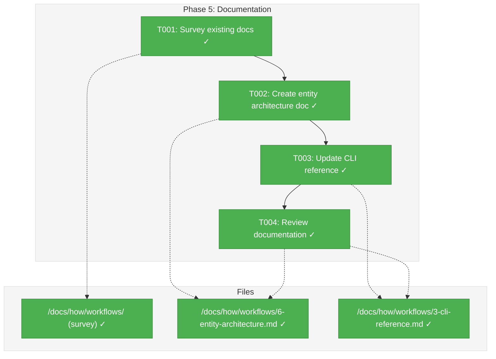
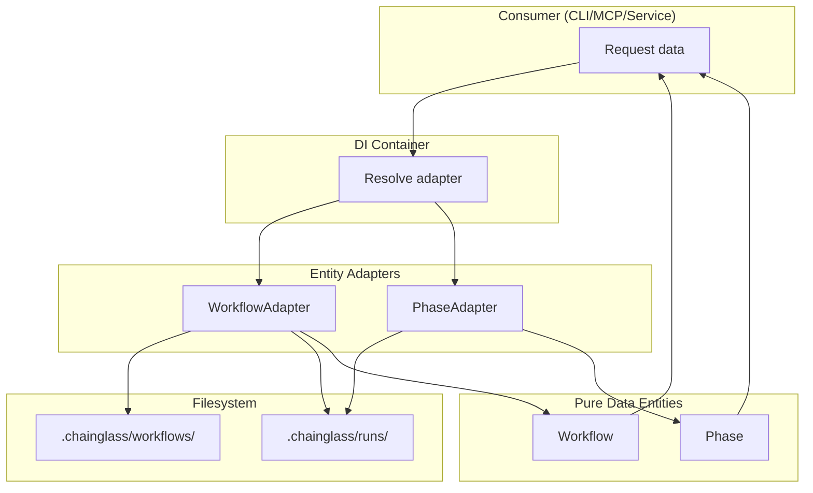
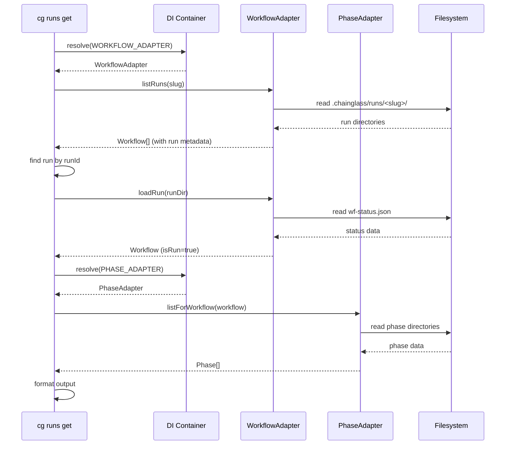

# Phase 5: Documentation – Tasks & Alignment Brief

**Spec**: [../entity-upgrade-spec.md](../entity-upgrade-spec.md)
**Plan**: [../../entity-upgrade-plan.md](../../entity-upgrade-plan.md)
**Date**: 2026-01-26

---

## Executive Briefing

### Purpose
This phase delivers comprehensive documentation for the entity graph architecture implemented in Phases 1-4. Without this documentation, developers extending the system will have to reverse-engineer patterns from code, leading to inconsistent implementations and repeated mistakes.

### What We're Building
Two documentation deliverables:
1. **Entity Architecture Guide** (`docs/how/workflows/6-entity-architecture.md`) - A comprehensive guide explaining the unified entity model, navigation patterns, and adapter usage
2. **CLI Reference Update** (`docs/how/workflows/3-cli-reference.md`) - Addition of `cg runs list` and `cg runs get` command documentation

### User Value
Developers can onboard to the entity system quickly with clear examples, avoiding common pitfalls. Users have accurate CLI reference for the new runs commands.

### Example
A developer wanting to load a workflow run with its phases can read the guide and immediately know to:
```typescript
// Load run via workflow adapter
const workflow = await workflowAdapter.loadRun(runDir);

// Get phases via phase adapter (NOT from workflow.phases[])
const phases = await phaseAdapter.listForWorkflow(workflow);

// Use toJSON() for serialization
console.log(JSON.stringify({ ...workflow.toJSON(), phases: phases.map(p => p.toJSON()) }));
```

---

## Objectives & Scope

### Objective
Document the entity architecture and new CLI commands so that developers can extend the system following established patterns, and users can use the new `cg runs` commands effectively.

### Goals

- ✅ Create comprehensive entity architecture documentation (`6-entity-architecture.md`)
- ✅ Document unified Workflow model (current/checkpoint/run distinction)
- ✅ Document adapter usage patterns with decision tree
- ✅ Document testing patterns with fake adapters
- ✅ Update CLI reference with `cg runs list` and `cg runs get` commands
- ✅ Include code examples that compile and work

### Non-Goals

- ❌ Web component documentation (future - when web app consumes entities)
- ❌ MCP tool documentation updates (Phase 6 - Service Unification)
- ❌ Tutorial/getting-started content (out of scope - architecture reference only)
- ❌ Auto-generated API docs (defer to standard tooling)
- ❌ Internationalization of documentation

---

## Architecture Map

### Component Diagram
<!-- Status: grey=pending, orange=in-progress, green=completed, red=blocked -->
<!-- Updated by plan-6 during implementation -->



### Task-to-Component Mapping

<!-- Status: ⬜ Pending | 🟧 In Progress | ✅ Complete | 🔴 Blocked -->

| Task | Component(s) | Files | Status | Comment |
|------|-------------|-------|--------|---------|
| T001 | Documentation Survey | /docs/how/workflows/*.md | ✅ Complete | Patterns documented in execution.log.md |
| T002 | Entity Architecture Doc | /docs/how/workflows/6-entity-architecture.md | ✅ Complete | ~500 lines with all sections |
| T003 | CLI Reference Update | /docs/how/workflows/3-cli-reference.md | ✅ Complete | cg runs list + cg runs get sections added |
| T004 | Documentation Review | All Phase 5 docs | ✅ Complete | Links valid, CLI verified, tests pass |

---

## Tasks

| Status | ID | Task | CS | Type | Dependencies | Absolute Path(s) | Validation | Subtasks | Notes |
|--------|------|------|-----|------|--------------|------------------|------------|----------|-------|
| [x] | T001 | Survey existing docs/how/workflows/ files to understand structure, style, and patterns | 1 | Setup | – | /home/jak/substrate/007-manage-workflows/docs/how/workflows/ | Document findings in execution log | – | 5 existing files (1-5) |
| [x] | T002 | Create docs/how/workflows/6-entity-architecture.md with full entity architecture documentation | 2 | Doc | T001 | /home/jak/substrate/007-manage-workflows/docs/how/workflows/6-entity-architecture.md | File created with all sections from outline | – | Core deliverable |
| [x] | T003 | Update docs/how/workflows/3-cli-reference.md with `cg runs list` and `cg runs get` command sections | 2 | Doc | T002 | /home/jak/substrate/007-manage-workflows/docs/how/workflows/3-cli-reference.md | Commands added to overview table, full sections added | – | Follow existing format |
| [x] | T004 | Review all documentation for clarity, accuracy, and consistency | 1 | Review | T003 | /home/jak/substrate/007-manage-workflows/docs/how/workflows/3-cli-reference.md, /home/jak/substrate/007-manage-workflows/docs/how/workflows/6-entity-architecture.md | No broken links, code examples valid | – | Verify compile check |

---

## Alignment Brief

### Prior Phases Review

#### Phase-by-Phase Summary

**Phase 1: Entity Interfaces & Pure Data Classes** (14 tasks, COMPLETE)
- Created foundational entity classes (`Workflow`, `Phase`) with pure readonly data
- Established factory pattern for XOR invariant enforcement (private constructor + static factories)
- Defined adapter interfaces (`IWorkflowAdapter`, `IPhaseAdapter`) with `load*()` naming convention
- Created error classes (`EntityNotFoundError`, run errors E050-E059)
- Added DI tokens (`WORKFLOW_ADAPTER`, `PHASE_ADAPTER`)
- Key insight: `toJSON()` serialization uses camelCase, undefined→null, Date→ISO-8601

**Phase 2: Fake Adapters for Testing** (8 tasks, COMPLETE)
- Created `FakeWorkflowAdapter` and `FakePhaseAdapter` for TDD
- Established call capture pattern (private arrays + spread operator getters)
- Default behavior: entity lookups throw `EntityNotFoundError`, collections return `[]`
- Registered fakes in test containers via `useValue` pattern
- 40 tests added for fake behavior verification

**Phase 3: Production Adapters** (17 tasks, COMPLETE)
- Implemented `WorkflowAdapter` (366 lines, 6 methods) with filesystem hydration
- Implemented `PhaseAdapter` (~250 lines, 2 methods) with order+name tiebreaker sorting
- Created contract test factories verifying fake/real parity
- Path security: 19 `pathResolver.join()` calls, zero `path.join()` violations
- Filter-before-hydration optimization in `listRuns()`
- 87 tests added

**Phase 4: CLI `cg runs` Commands** (18 tasks, COMPLETE)
- Created `runs.command.ts` (365 lines) with `handleRunsList()` and `handleRunsGet()`
- Two-adapter pattern: `loadRun()` + `listForWorkflow()` for complete data
- `FakeWorkflowAdapter` enhanced with `listRunsResultBySlug: Map<string, Workflow[]>`
- CLI commands: `cg runs list [--workflow] [--status]` and `cg runs get --workflow <slug> <run-id>`
- 21 tests (15 unit + 6 integration) all passing

#### Cumulative Deliverables Available

| Phase | Files Created | Export Path |
|-------|---------------|-------------|
| Phase 1 | `Workflow`, `Phase` entities | `@chainglass/workflow` |
| Phase 1 | `IWorkflowAdapter`, `IPhaseAdapter` interfaces | `@chainglass/workflow` |
| Phase 1 | `EntityNotFoundError`, run errors | `@chainglass/workflow` |
| Phase 2 | `FakeWorkflowAdapter`, `FakePhaseAdapter` | `@chainglass/workflow` |
| Phase 3 | `WorkflowAdapter`, `PhaseAdapter` | `@chainglass/workflow` |
| Phase 4 | `registerRunsCommands()`, `handleRunsList()`, `handleRunsGet()` | CLI internal |

#### Pattern Evolution Across Phases

1. **TDD RED→GREEN**: Consistently applied across all phases; write failing tests first
2. **Factory Pattern**: Established in Phase 1 (private constructor + static factories), used throughout
3. **Call Capture Pattern**: Established in Phase 2 (private arrays + spread getters)
4. **Two-Adapter Pattern**: Established in Phase 4 (workflow + phase adapters for complete data)
5. **DI Container Resolution**: Established in Phase 2, refined in Phase 4 (`getWorkflowAdapter()` helpers)

#### Recurring Issues

- **Error code conflicts**: E040-E049 were taken → shifted to E050-E059 (Phase 1)
- **Method naming idioms**: Proposed `from*()` but codebase uses `load*()` (Phase 1)
- **Phases always empty on workflow**: Must call PhaseAdapter separately (Phase 4)

#### Reusable Test Infrastructure

| Infrastructure | Source | Usage |
|----------------|--------|-------|
| `FakeWorkflowAdapter` | Phase 2 | All adapter/CLI tests |
| `FakePhaseAdapter` | Phase 2 | All adapter/CLI tests |
| `createCliTestContainer()` | Phase 2 | CLI command tests |
| `Workflow.createCurrent/Checkpoint/Run()` | Phase 1 | Entity factory for tests |
| Contract test factories | Phase 3 | Fake/real parity verification |

---

### Critical Findings Affecting This Phase

| Finding | Impact on Phase 5 | Addressed By |
|---------|-------------------|--------------|
| **Discovery 01: Pure Data Entities** | Document that entities have NO adapter references, NO async methods | T002 |
| **Discovery 05: DI Token Pattern** | Document `WORKFLOW_ADAPTER`, `PHASE_ADAPTER` token usage | T002 |
| **DYK-01 (P4): --workflow required** | Document `cg runs get` requires `--workflow` flag | T003 |
| **DYK-04 (P4): Two-adapter pattern** | Document that `loadRun()` returns empty phases[] | T002, T003 |
| **Phase 1 DYK-03: toJSON rules** | Document camelCase, undefined→null, Date→ISO | T002 |

---

### ADR Decision Constraints

**ADR-0004: Dependency Injection Container Architecture**
- **Decision**: Use `useFactory` for production adapters, `useValue` for fakes in tests
- **Constrains**: Documentation must show container resolution, NOT direct instantiation
- **Addressed by**: T002 (code examples use container pattern)

---

### Invariants & Guardrails

1. **Documentation must be accurate**: Code examples must compile and match actual implementation
2. **Follow existing style**: Match heading structure, code block format of files 1-5
3. **No breaking changes**: CLI reference additions must not alter existing sections

---

### Inputs to Read

| File | Purpose |
|------|---------|
| `/home/jak/substrate/007-manage-workflows/docs/how/workflows/1-overview.md` | Style reference |
| `/home/jak/substrate/007-manage-workflows/docs/how/workflows/3-cli-reference.md` | Update target |
| `/home/jak/substrate/007-manage-workflows/packages/workflow/src/entities/workflow.ts` | Entity source for accuracy |
| `/home/jak/substrate/007-manage-workflows/packages/workflow/src/entities/phase.ts` | Entity source for accuracy |
| `/home/jak/substrate/007-manage-workflows/packages/workflow/src/interfaces/workflow-adapter.interface.ts` | Interface source |
| `/home/jak/substrate/007-manage-workflows/apps/cli/src/commands/runs.command.ts` | CLI implementation for docs |

---

### Visual Alignment Aids

#### Mermaid Flow Diagram: Entity Loading Flow



#### Mermaid Sequence Diagram: cg runs get Flow



---

### Test Plan (Lightweight for Documentation)

| Test | Rationale | Method |
|------|-----------|--------|
| Links not broken | Prevent 404s in docs | Manual check + grep for `](` patterns |
| Code examples compile | Accuracy | Copy-paste to test file, run `pnpm typecheck` |
| CLI output matches | Accuracy | Run actual `cg runs list --help` and verify docs |
| Markdown valid | Quality | Optional: `markdownlint` if available |

---

### Step-by-Step Implementation Outline

**T001: Survey existing docs**
1. Read all 5 existing files in `docs/how/workflows/`
2. Note: heading levels, code block language tags, example formats
3. Document pattern observations in execution log

**T002: Create entity architecture doc**
1. Create new file `6-entity-architecture.md`
2. Add sections:
   - Introduction: Why entities exist
   - Key Invariants (unified model)
   - Unified Workflow Model (current/checkpoint/run)
   - Phase Entity structure
   - Adapter Method Decision Tree (from plan)
   - Code Examples for common operations
   - Testing with Fake Adapters
   - JSON Output Format
   - Common Pitfalls (no async on entities, use adapters)
3. Include Mermaid diagrams for visual clarity
4. Include complete code examples that compile

**T003: Update CLI reference**
1. Add `cg runs list` and `cg runs get` to Command Overview table
2. Create `## cg runs list` section with:
   - Syntax
   - Options (--workflow, --status, --json)
   - What It Does
   - Examples
   - Output (console and JSON)
3. Create `## cg runs get` section with same structure
4. Place after existing workflow commands

**T004: Documentation review**
1. Run link checker: `grep -oE '\[.*\]\([^)]+\)' docs/how/workflows/*.md`
2. Verify code examples: create temp test file, `pnpm typecheck`
3. Run `cg runs list --help` and `cg runs get --help`, compare with docs
4. Review for clarity and consistency

---

### Commands to Run

```bash
# Survey existing docs
ls -la docs/how/workflows/
wc -l docs/how/workflows/*.md

# Verify code examples compile (create temp file)
echo 'import { Workflow, IWorkflowAdapter } from "@chainglass/workflow";' > /tmp/doc-test.ts
pnpm exec tsc --noEmit /tmp/doc-test.ts

# Check for broken links
grep -oE '\[.*\]\([^)]+\)' docs/how/workflows/*.md | head -20

# Verify CLI help matches docs
pnpm --filter @chainglass/cli exec cg runs list --help
pnpm --filter @chainglass/cli exec cg runs get --help

# Optional: Markdown lint
npx markdownlint docs/how/workflows/*.md || echo "markdownlint not available"
```

---

### Risks/Unknowns

| Risk | Severity | Mitigation |
|------|----------|------------|
| Code examples may not compile | Medium | Verify with typecheck before commit |
| CLI output format may have changed | Low | Run actual CLI and update docs |
| Mermaid diagrams may not render | Low | Use GitHub-compatible syntax |

---

### Ready Check

- [x] ADR constraints mapped to tasks (IDs noted in Notes column) - ADR-0004 affects T002
- [x] Prior phase deliverables understood (entities, adapters, CLI commands)
- [x] Existing doc style surveyed (T001 must complete first)
- [x] Code examples verified against actual implementation

**Status**: ✅ PHASE COMPLETE

---

## Phase Footnote Stubs

_To be populated during implementation by plan-6._

| Footnote | Description | Log Reference |
|----------|-------------|---------------|
| | | |

---

## Evidence Artifacts

### Execution Log Location
`/home/jak/substrate/007-manage-workflows/docs/plans/010-entity-upgrade/tasks/phase-5-documentation/execution.log.md`

### Supporting Files
- NEW: `/home/jak/substrate/007-manage-workflows/docs/how/workflows/6-entity-architecture.md` (~500 lines)
- UPDATED: `/home/jak/substrate/007-manage-workflows/docs/how/workflows/3-cli-reference.md` (+180 lines)

### Verification Commands Run
```bash
# Link verification
grep -oE '\[.*\]\([^)]+\)' docs/how/workflows/6-entity-architecture.md
grep -oE '\[.*\]\([^)]+\)' docs/how/workflows/3-cli-reference.md

# CLI help verification
cg runs list --help
cg runs get --help

# Compilation verification
pnpm typecheck  # ✓ passes
pnpm test       # ✓ 1766 tests pass
```

---

## Discoveries & Learnings

_Populated during implementation by plan-6. Log anything of interest to your future self._

| Date | Task | Type | Discovery | Resolution | References |
|------|------|------|-----------|------------|------------|
| | | | | | |

**Types**: `gotcha` | `research-needed` | `unexpected-behavior` | `workaround` | `decision` | `debt` | `insight`

**What to log**:
- Things that didn't work as expected
- External research that was required
- Implementation troubles and how they were resolved
- Gotchas and edge cases discovered
- Decisions made during implementation
- Technical debt introduced (and why)
- Insights that future phases should know about

_See also: `execution.log.md` for detailed narrative._

---

## Directory Layout

```
docs/plans/010-entity-upgrade/
├── entity-upgrade-plan.md
├── entity-upgrade-spec.md
└── tasks/
    ├── phase-1-entity-interfaces-pure-data-classes/
    │   ├── tasks.md
    │   └── execution.log.md
    ├── phase-2-fake-adapters-for-testing/
    │   ├── tasks.md
    │   └── execution.log.md
    ├── phase-3-production-adapters/
    │   ├── tasks.md
    │   └── execution.log.md
    ├── phase-4-cli-cg-runs-commands/
    │   ├── tasks.md
    │   └── execution.log.md
    └── phase-5-documentation/
        ├── tasks.md              ← This file
        └── execution.log.md      ← Created by plan-6
```

---

## Content Outline for T002 (6-entity-architecture.md)

### 1. Introduction
- Why entities exist (vs DTOs)
- Problem solved: diffuse concepts → first-class objects

### 2. Key Invariants
- Source Exclusivity: isCurrent XOR isCheckpoint XOR isRun
- Phase Structure Identity: same fields, different populated state
- Adapter Responsibility: adapters do I/O, entities are pure data
- Data Locality: entities load from their own path

### 3. Unified Workflow Model
- Three sources (current/, checkpoints/, runs/)
- Same Workflow class, different metadata populated
- Factory methods: `Workflow.createCurrent()`, `.createCheckpoint()`, `.createRun()`
- Code example showing each source

### 4. Phase Entity
- Same structure for template and run phases
- Values populated (exists, valid, answered) differ based on source
- Status helpers (isPending, isActive, isComplete, etc.)

### 5. Adapter Method Decision Tree
- When to use which adapter method
- Table from plan (loadCurrent, loadCheckpoint, loadRun, etc.)
- Code examples for each scenario

### 6. Testing with Fake Adapters
- FakeWorkflowAdapter usage
- FakePhaseAdapter usage
- Container registration pattern
- Call tracking verification

### 7. JSON Output Format
- camelCase convention
- undefined → null
- Date → ISO-8601
- TypeScript types for web consumption

### 8. Common Pitfalls
- ❌ Don't put async methods on entities
- ❌ Don't cache in adapters
- ❌ Don't use path.join() directly
- ❌ Don't access workflow.phases[] on runs (use PhaseAdapter)
- ✅ Use container resolution for adapters
- ✅ Use pathResolver.join() for all paths

---

*Generated by plan-5-phase-tasks-and-brief on 2026-01-26*
