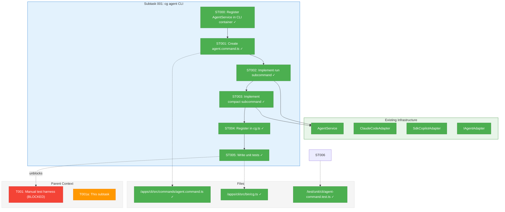
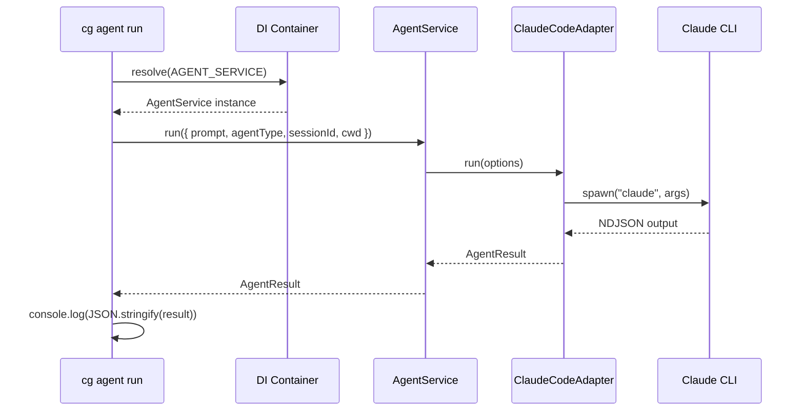
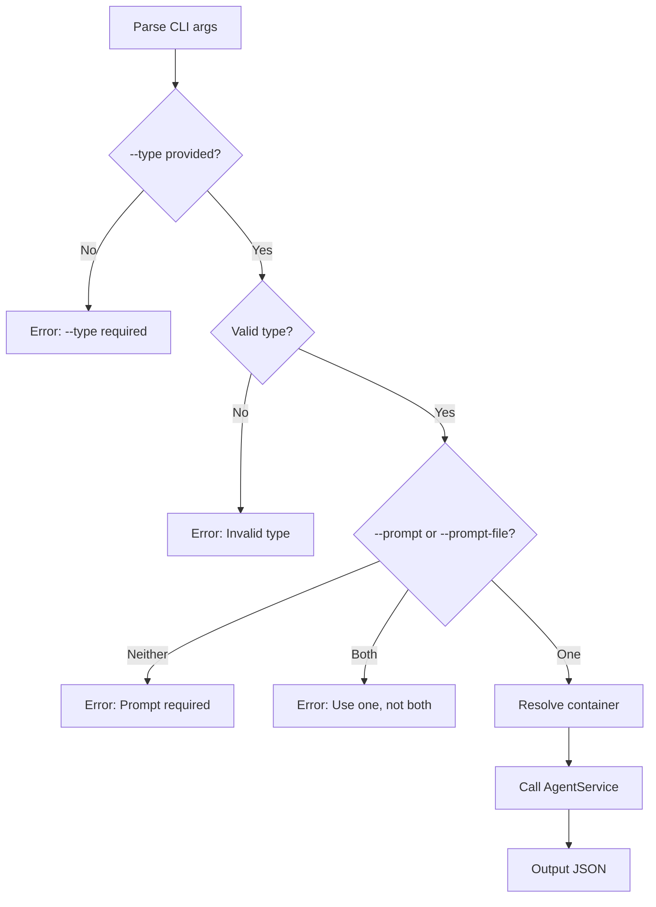

# Subtask 001: Create `cg agent` CLI Command Group

**Parent Plan:** [entity-upgrade-plan.md](../../entity-upgrade-plan.md)
**Parent Phase:** Phase 6: Service Unification & Validation
**Parent Task(s):** [T001a: Create cg agent CLI command group](./tasks.md)
**Plan Task Reference:** [Phase 6 Part A](../../entity-upgrade-plan.md#phase-6-service-unification--validation)

**Why This Subtask:**
The manual test harness (T001-T004) requires CLI commands to invoke agents programmatically. Research revealed that AgentService infrastructure exists but no CLI command exposes it. This subtask creates `cg agent run/compact` commands to unblock the harness.

**Created:** 2026-01-26
**Requested By:** Development Team (discovered during /plan-1a-explore research)

---

## Executive Briefing

### Purpose
This subtask creates the `cg agent` CLI command group that exposes the existing AgentService infrastructure to the command line. This enables the manual test harness to invoke real agents (Claude Code, Copilot) during workflow phase execution and compact context between phases.

### What We're Building
A CLI command group with two subcommands:
- `cg agent run` — Invoke an agent with a prompt, optionally resuming a session
- `cg agent compact` — Reduce session context via `/compact` command

### Unblocks
- **T001**: Manual test harness structure (requires agent invocation capability)
- **T001-T004**: Entire Part A of Phase 6 depends on this CLI

### Example

**New session:**
```bash
$ cg agent run --type claude-code --prompt "Analyze the code in this directory" --cwd /path/to/run
{
  "output": "I'll analyze the code...",
  "sessionId": "abc-123-def-456",
  "status": "completed",
  "exitCode": 0,
  "tokens": { "used": 1500, "total": 1500, "limit": 200000 }
}
```

**Resume session:**
```bash
$ cg agent run --type claude-code --session abc-123-def-456 --prompt "Now implement phase 2"
{
  "output": "Based on my previous analysis...",
  "sessionId": "abc-123-def-456",
  "status": "completed",
  "exitCode": 0,
  "tokens": { "used": 2000, "total": 3500, "limit": 200000 }
}
```

**Compact between phases:**
```bash
$ cg agent compact --type claude-code --session abc-123-def-456
{
  "output": "Context compacted.",
  "sessionId": "abc-123-def-456",
  "status": "completed",
  "exitCode": 0,
  "tokens": { "used": 500, "total": 2000, "limit": 200000 }
}
```

---

## Objectives & Scope

### Objective
Create CLI commands that expose AgentService to enable programmatic agent invocation from shell scripts, unblocking the manual test harness for workflow validation.

### Goals

- ✅ Create `cg agent run` command with options: `--type`, `--prompt`, `--prompt-file`, `--session`, `--cwd` (no --timeout per DYK #5)
- ✅ Create `cg agent compact` command with options: `--type`, `--session`
- ✅ Output JSON matching `AgentResult` interface
- ✅ Register commands in CLI main entry point
- ✅ Write unit tests using FakeAgentAdapter

### Non-Goals

- ❌ Streaming output to console (return final JSON only; streaming is future work)
- ❌ Interactive mode (this is for scripted automation)
- ❌ New agent types (only `claude-code` and `copilot` supported)
- ❌ Modifying AgentService or adapters (use existing infrastructure)

---

## Architecture Map

### Component Diagram
<!-- Status: grey=pending, orange=in-progress, green=completed, red=blocked -->
<!-- Updated by plan-6 during implementation -->



### Task-to-Component Mapping

<!-- Status: ⬜ Pending | 🟧 In Progress | ✅ Complete | 🔴 Blocked -->

| Task | Component(s) | Files | Status | Comment |
|------|-------------|-------|--------|---------|
| ST000 | DI Container | /apps/cli/src/lib/container.ts | ✅ Complete | Register IConfigService, AdapterFactory, AgentService (port web pattern) |
| ST001 | CLI Command Shell | /apps/cli/src/commands/agent.command.ts | ✅ Complete | Create file with Commander.js structure |
| ST002 | Run Subcommand | /apps/cli/src/commands/agent.command.ts | ✅ Complete | --type, --prompt, --prompt-file, --session, --cwd (no --timeout) |
| ST003 | Compact Subcommand | /apps/cli/src/commands/agent.command.ts | ✅ Complete | --type, --session |
| ST004 | CLI Registration | /apps/cli/src/bin/cg.ts | ✅ Complete | Add registerAgentCommands() call |
| ST005 | Unit Tests | /test/unit/cli/agent-command.test.ts | ✅ Complete | Test all subcommands with FakeAgentAdapter |

---

## Tasks

| Status | ID | Task | CS | Type | Dependencies | Absolute Path(s) | Validation | Subtasks | Notes |
|--------|-----|------|----|------|--------------|------------------|------------|----------|-------|
| [x] | ST000 | **Register AgentService infrastructure in CLI container**: Add IConfigService, AdapterFactory (ClaudeCodeAdapter + SdkCopilotAdapter), AgentService to `createCliProductionContainer()`. Port pattern from web container (lines 155-176). Note: Test container NOT updated per DYK #4 - tests use direct instantiation. | 2 | Infra | – | /home/jak/substrate/007-manage-workflows/apps/cli/src/lib/container.ts | `container.resolve(AgentService)` succeeds | – | Per DYK #1: Container gap discovered |
| [x] | ST001 | **Create agent.command.ts shell** with Commander.js command group structure and option interfaces | 2 | Setup | ST000 | /home/jak/substrate/007-manage-workflows/apps/cli/src/commands/agent.command.ts | File exists with registerAgentCommands export | – | Follow runs.command.ts pattern |
| [x] | ST002 | **Implement `cg agent run` subcommand** with options: `--type {claude-code,copilot}` (required), `--prompt <text>` (required unless --prompt-file), `--prompt-file <path>`, `--session <id>`, `--cwd <path>`. Calls AgentService.run() and outputs JSON. No --timeout (uses config default per DYK #5). | 3 | Core | ST001 | /home/jak/substrate/007-manage-workflows/apps/cli/src/commands/agent.command.ts | `cg agent run --type claude-code --prompt "hello"` returns valid JSON | – | Validate --type against ALLOWED_AGENT_TYPES |
| [x] | ST003 | **Implement `cg agent compact` subcommand** with options: `--type` (required), `--session` (required). Calls AgentService.compact() and outputs JSON. | 2 | Core | ST002 | /home/jak/substrate/007-manage-workflows/apps/cli/src/commands/agent.command.ts | `cg agent compact --type claude-code --session <id>` returns valid JSON | – | Session must exist |
| [x] | ST004 | **Register agent commands in cg.ts** by adding `registerAgentCommands(program)` to createProgram() | 1 | Integration | ST003 | /home/jak/substrate/007-manage-workflows/apps/cli/src/bin/cg.ts | `cg agent --help` shows subcommands | – | Add after registerRunsCommands |
| [x] | ST005 | **Write unit tests** for both subcommands using FakeAgentAdapter, verifying JSON output format and option validation. **Then run manual tests** with real agents (see Manual Testing section). | 2 | Test | ST004 | /home/jak/substrate/007-manage-workflows/test/unit/cli/agent-command.test.ts | All unit tests pass; manual tests pass (Claude + Copilot session/compact/context) | – | Per DYK #4: Direct instantiation in tests. After unit tests, run manual tests with real agents. |

---

## Alignment Brief

### Objective Recap
Create CLI commands that enable the manual test harness to invoke agents programmatically. This directly supports T001a in Phase 6 Part A.

### Critical Findings Affecting This Subtask

| Finding | Constraint/Requirement | Tasks Addressing |
|---------|----------------------|------------------|
| **PL-05: Handler Registration Race Condition** | Register event handlers BEFORE sendAndWait() | ST002: Not applicable (no streaming in v1) |
| **PL-06: CLI Version Stability** | Log CLI version for debugging | ST002: Consider adding --verbose flag (future) |
| **PL-09: Contract Test Parity** | Fake and real adapters must pass same tests | ST006: Use FakeAgentAdapter for unit tests |

### ADR Decision Constraints

**ADR-0004: Dependency Injection Container Architecture**
- **Decision**: Parent-child container hierarchy with useFactory registration
- **Constraint**: AgentService must be resolved from CLI container, not instantiated directly
- **Addressed by**: ST002 (resolve AgentService from container)

### Invariants & Guardrails

- **JSON Output Only**: All commands output JSON to stdout (no streaming in v1, no table format)
- **AgentResult Structure**: All output follows AgentResult interface: `{ output, sessionId, status, exitCode, tokens, error? }`
- **Error as AgentResult**: Errors use `status: 'failed'` with optional `error` field for message (NOT IOutputAdapter pattern)
- **Agent Type Validation**: Only `claude-code` and `copilot` accepted
- **Session ID Required**: compact requires valid session ID
- **Path Security (cwd)**: cwd validated within workspace (reuse existing validation)
- **Path Security (prompt-file)**: Validate via `pathResolver.resolvePath(cwd, promptFile)` - rejects absolute paths and traversal attacks

> **DYK #2 Decision**: Agent commands always output JSON using AgentResult structure (not IOutputAdapter).
> This differs from other CLI commands but optimizes for scripted automation in the manual test harness.
> Monitor during implementation to validate approach.

### Inputs to Read

- `/home/jak/substrate/007-manage-workflows/apps/cli/src/commands/runs.command.ts` — Pattern to follow
- `/home/jak/substrate/007-manage-workflows/packages/shared/src/services/agent.service.ts` — AgentService API
- `/home/jak/substrate/007-manage-workflows/packages/shared/src/interfaces/agent-types.ts` — AgentResult, AgentRunOptions
- `/home/jak/substrate/007-manage-workflows/packages/shared/src/fakes/fake-agent-adapter.ts` — For testing

### Visual Alignment Aids

#### Command Flow Sequence



#### Option Validation Flow



### Test Plan

**Test Strategy**: Unit tests using FakeAgentAdapter (no real agent invocation in tests)

| Test Case | Input | Expected Output |
|-----------|-------|-----------------|
| Run new session | `--type claude-code --prompt "hello"` | JSON with sessionId, status: completed |
| Run resume session | `--type claude-code --session abc --prompt "continue"` | JSON with same sessionId |
| Run with cwd | `--type claude-code --prompt "test" --cwd /tmp` | JSON (cwd passed to adapter) |
| Run with prompt-file | `--type claude-code --prompt-file prompt.txt` | JSON (file content as prompt) |
| Run missing type | `--prompt "hello"` | Error: --type required |
| Run invalid type | `--type invalid --prompt "hello"` | Error: Invalid agent type |
| Compact session | `--type claude-code --session abc` | JSON with compacted tokens |
| Compact missing session | `--type claude-code` | Error: --session required |

### Implementation Outline

0. **ST000**: Register AgentService infrastructure in CLI container:
   - Add CLI_DI_TOKENS.AGENT_SERVICE token
   - Register IConfigService (load from .chainglass/config.yaml)
   - Create AdapterFactory returning ClaudeCodeAdapter or SdkCopilotAdapter
   - Register AgentService with factory pattern
   - **Skip test container** - per DYK #4, tests use direct instantiation
   - **Reference**: Copy pattern from `apps/web/src/lib/di-container.ts:155-176`

1. **ST001**: Create `agent.command.ts` with:
   - `AgentRunOptions` interface for CLI options
   - `registerAgentCommands(program: Command)` export
   - Commander.js `agent` command with subcommands

2. **ST002**: Implement `run` subcommand:
   - Parse and validate options
   - Read prompt from file if `--prompt-file`
   - Resolve AgentService from container
   - Call `service.run(options)`
   - Output JSON to stdout

3. **ST003**: Implement `compact` subcommand:
   - Require `--type` and `--session`
   - Call `service.compact(sessionId, agentType)`
   - Output JSON

4. **ST004**: Register in `cg.ts`:
   - Import `registerAgentCommands`
   - Add call after `registerRunsCommands`

5. **ST005**: Write tests:
   - **Direct instantiation** (not container) per DYK #4
   - Create FakeAgentAdapter in beforeEach()
   - Test each subcommand with valid/invalid inputs
   - Verify AgentResult JSON structure
   - **Reference**: Follow `workflow-command.test.ts` pattern

### Commands to Run

```bash
# Development
cd /home/jak/substrate/007-manage-workflows

# Run CLI tests
pnpm test --filter @chainglass/cli -- --grep "agent"

# Type check
pnpm typecheck

# Verify help output
pnpm --filter @chainglass/cli exec cg agent --help
pnpm --filter @chainglass/cli exec cg agent run --help
```

### Manual Testing with Real Agents

After implementation, test with both real agents (Claude Code and Copilot are available).

**Test Pattern**: Run → Compact → Verify Context Retention

This pattern validates:
1. Basic run functionality and JSON output
2. Session ID extraction
3. Compact functionality
4. Session resumption after compact
5. Context retention (agent remembers previous conversation)

**Reference**: See `scripts/agents/claude-code-session-demo.ts` and `scripts/agents/copilot-session-demo.ts` for similar patterns.

#### Test 1: Claude Code - Session + Compact + Context

```bash
# Step 1: Initial prompt (poem about random topic) - capture sessionId
RESULT1=$(cg agent run --type claude-code --prompt "Write a short 4-line poem about a random topic of your choosing. Just output the poem, nothing else.")
echo "$RESULT1"
SESSION_ID=$(echo "$RESULT1" | jq -r '.sessionId')
echo "Session ID: $SESSION_ID"

# Step 2: Compact the session - pass sessionId
RESULT2=$(cg agent compact --type claude-code --session "$SESSION_ID")
echo "$RESULT2"

# Step 3: Ask about the topic (tests context retention) - pass same sessionId
RESULT3=$(cg agent run --type claude-code --session "$SESSION_ID" --prompt "What was the topic of the poem you just wrote? Answer in one word.")
echo "$RESULT3"
# → Should correctly identify the topic from step 1
```

**Expected Results**:
- Step 1: JSON with `sessionId`, `status: "completed"`, poem in `output`
- Step 2: JSON with `status: "completed"`, reduced token count in `tokens`
- Step 3: JSON with correct topic in `output` (proves context was retained after compact)

**Key Point**: The `sessionId` from step 1 must be extracted and passed to steps 2 and 3. Use `jq -r '.sessionId'` to extract from JSON output.

#### Test 2: Copilot - Session + Compact + Context

```bash
# Step 1: Initial prompt - capture sessionId
RESULT1=$(cg agent run --type copilot --prompt "Write a short 4-line poem about a random topic of your choosing. Just output the poem, nothing else.")
echo "$RESULT1"
SESSION_ID=$(echo "$RESULT1" | jq -r '.sessionId')
echo "Session ID: $SESSION_ID"

# Step 2: Compact the session - pass sessionId
RESULT2=$(cg agent compact --type copilot --session "$SESSION_ID")
echo "$RESULT2"

# Step 3: Ask about the topic - pass same sessionId
RESULT3=$(cg agent run --type copilot --session "$SESSION_ID" --prompt "What was the topic of the poem you just wrote? Answer in one word.")
echo "$RESULT3"
```

#### Test 3: Prompt File

```bash
# Create a prompt file
echo "Write a haiku about coding" > /tmp/test-prompt.txt

# Run with prompt file (sessionId returned for potential continuation)
RESULT=$(cg agent run --type claude-code --prompt-file /tmp/test-prompt.txt --cwd /tmp)
echo "$RESULT"
echo "Session ID: $(echo "$RESULT" | jq -r '.sessionId')"
# → Verify haiku in output field
```

#### Test 4: Error Cases

```bash
# Invalid agent type
cg agent run --type invalid-agent --prompt "test"
# → Should return JSON with status: "failed", error message

# Missing required options
cg agent run --prompt "test"
# → Should show error about --type required

cg agent compact --type claude-code
# → Should show error about --session required

# Path security violation
cg agent run --type claude-code --prompt-file /etc/passwd --cwd /tmp
# → Should return JSON with status: "failed", security error
```

**Success Criteria**: All 4 test scenarios pass with expected outputs.

### Risks/Unknowns

| Risk | Severity | Likelihood | Mitigation |
|------|----------|------------|------------|
| AgentService not registered in CLI container | Medium | Medium | Verify DI registration before implementation |
| Timeout handling in CLI | Low | Low | Use existing AgentService timeout mechanism |
| Prompt file encoding issues | Low | Low | Read as UTF-8, validate content |

### Ready Check

- [x] Pattern files reviewed (runs.command.ts, agent.service.ts)
- [x] AgentResult interface understood
- [x] FakeAgentAdapter available for testing
- [x] DI container registration verified
- [x] CLI registration pattern understood
- [x] Real agents available for manual testing (Claude Code, Copilot)

**Subtask implementation COMPLETE.**

---

## Phase Footnote Stubs

_Populated during implementation by plan-6a-update-progress._

| Footnote | Task | Description | Added |
|----------|------|-------------|-------|
| | | | |

---

## Evidence Artifacts

**Execution Log**: `001-subtask-cg-agent-cli-command.execution.log.md` (created by plan-6)

**Supporting Files**:
- Test output: `pnpm test` results
- CLI help output: `cg agent --help` screenshot/capture

---

## Discoveries & Learnings

_Populated during implementation by plan-6. Log anything of interest to your future self._

| Date | Task | Type | Discovery | Resolution | References |
|------|------|------|-----------|------------|------------|
| 2026-01-26 | ST000 | gotcha | CLI container missing AgentService registration - IConfigService, AdapterFactory, AgentService all absent. Web container has working pattern. | Added ST000 as prerequisite task to port web container pattern to CLI | DYK #1, web container lines 155-176 |
| 2026-01-26 | ST002 | decision | Error output format: subtask said `{error, status}` but codebase uses IOutputAdapter pattern. Agent commands need machine-readable output for scripted automation. | Use AgentResult structure always (JSON only, no table). Add optional `error` field. Monitor during implementation. | DYK #2, differs from other CLI commands |
| 2026-01-26 | ST002 | gotcha | --prompt-file had no specified security validation. Could allow reading /etc/passwd or traversal attacks. | Use PathResolverAdapter.resolvePath(cwd, promptFile) to validate within workspace. Throws PathSecurityError on violation. | DYK #3, path-resolver.adapter.ts:16-44 |
| 2026-01-26 | ST005 | insight | CLI unit tests use direct instantiation, not DI container. Test container only used for integration tests. | Use direct FakeAgentAdapter instantiation in beforeEach(). Skip test container registration. Follow workflow-command.test.ts pattern. | DYK #4, workflow-command.test.ts:30-35 |
| 2026-01-26 | ST002 | decision | --timeout option would require AgentService modification or interface changes. AgentService already enforces 10min default from config. | Remove --timeout from CLI spec. Use config-based timeout only. Add feature later if real need arises. | DYK #5, agent.service.ts:79 |

**Types**: `gotcha` | `research-needed` | `unexpected-behavior` | `workaround` | `decision` | `debt` | `insight`

**What to log**:
- Things that didn't work as expected
- External research that was required
- Implementation troubles and how they were resolved
- Gotchas and edge cases discovered
- Decisions made during implementation
- Technical debt introduced (and why)
- Insights that future phases should know about

_See also: `execution.log.md` for detailed narrative._

---

## After Subtask Completion

**This subtask resolves a blocker for:**
- Parent Task: [T001a: Create cg agent CLI command group](./tasks.md)
- Unblocks: T001, T002, T003, T004 (entire Part A of Phase 6)

**When all ST### tasks complete:**

1. **Record completion** in parent execution log:
   ```
   ### Subtask 001-subtask-cg-agent-cli-command Complete

   Resolved: Created cg agent CLI command group (run/compact)
   See detailed log: [subtask execution log](./001-subtask-cg-agent-cli-command.execution.log.md)
   ```

2. **Update parent task** (T001a):
   - Open: [`tasks.md`](./tasks.md)
   - Find: T001a row
   - Update Status: `[ ]` → `[x]`
   - Update Notes: Add "Subtask 001 complete"

3. **Resume parent phase work:**
   ```bash
   /plan-6-implement-phase --phase "Phase 6: Service Unification & Validation" \
     --plan "/home/jak/substrate/007-manage-workflows/docs/plans/010-entity-upgrade/entity-upgrade-plan.md"
   ```
   (Note: NO `--subtask` flag to resume main phase)

**Quick Links:**
- [Parent Dossier](./tasks.md)
- [Parent Plan](../../entity-upgrade-plan.md)
- Parent Execution Log: Created by plan-6 when phase starts

---

## Directory Layout

```
docs/plans/010-entity-upgrade/
├── entity-upgrade-spec.md
├── entity-upgrade-plan.md
└── tasks/
    └── phase-6-service-unification-validation/
        ├── tasks.md                                    # Parent dossier
        ├── 001-subtask-cg-agent-cli-command.md         # This file
        └── 001-subtask-cg-agent-cli-command.execution.log.md  # Created by plan-6
```

---

## Critical Insights Discussion

**Session**: 2026-01-26
**Context**: Subtask 001 - cg agent CLI Command Group (pre-implementation review)
**Analyst**: AI Clarity Agent
**Reviewer**: Development Team
**Format**: Water Cooler Conversation (5 Critical Insights)

### Insight 1: CLI Container Missing AgentService Registration

**Did you know**: The CLI container doesn't have AgentService registered - IConfigService, AdapterFactory, and AgentService are all absent, though web container has the working pattern.

**Implications**:
- Any attempt to resolve AgentService from container would fail
- ST002 as written would fail at DI resolution time
- Web container (lines 155-176) shows proven pattern to follow

**Options Considered**:
- Option A: Port web container pattern to CLI container
- Option B: Direct instantiation in command (violates ADR-0004)
- Option C: Add ST000 as explicit prerequisite task

**AI Recommendation**: Option C - Add ST000 prerequisite
- Reasoning: Makes infrastructure dependency explicit, keeps tasks focused

**Discussion Summary**: User agreed that making the container setup an explicit prerequisite is cleaner than burying it in ST001.

**Decision**: Add ST000 "Register AgentService infrastructure in CLI container" as first task

**Action Items**: None - ST000 added to task list

**Affects**: Task table, mermaid diagram, dependencies

---

### Insight 2: Error Output Format Mismatch

**Did you know**: The subtask specified `{ "error": "message", "status": "failed" }` but existing CLI commands use IOutputAdapter pattern with rich CommandResponseError envelopes.

**Implications**:
- Agent commands are for scripted automation (manual test harness)
- Callers need machine-readable output with sessionId for session resumption
- Different use case than other CLI commands

**Options Considered**:
- Option A: Use simple JSON format from subtask
- Option B: Use IOutputAdapter pattern (consistent but complex)
- Option C: Always output AgentResult JSON structure

**AI Recommendation**: Option C - AgentResult structure always
- Reasoning: Optimized for scripted automation, consistent with AgentResult interface

**Discussion Summary**: User agreed that agent commands should always output JSON using AgentResult structure, with monitoring during implementation.

**Decision**: Use AgentResult structure with optional `error` field for all output

**Action Items**: Monitor during implementation to validate approach

**Affects**: ST002, ST003 error handling, Invariants section

---

### Insight 3: --prompt-file Path Security Gap

**Did you know**: --prompt-file had no specified security validation - could allow reading `/etc/passwd` or traversal attacks like `../../../secrets/`.

**Implications**:
- Security risk for arbitrary file reads
- PathResolverAdapter already provides defense-in-depth
- cwd validation was specified but not prompt-file

**Options Considered**:
- Option A: Validate within workspace using PathResolver
- Option B: Allow any readable path (security risk)
- Option C: Relative paths only (incomplete protection)

**AI Recommendation**: Option A - PathResolver validation
- Reasoning: Uses proven security infrastructure, prevents traversal attacks

**Discussion Summary**: User confirmed prompt files will be inside run directory, making workspace validation appropriate.

**Decision**: Use `pathResolver.resolvePath(cwd, promptFile)` to validate

**Action Items**: None - documented in Invariants

**Affects**: ST002 implementation, Invariants section

---

### Insight 4: Test Pattern - Direct Instantiation, Not Container

**Did you know**: CLI unit tests don't use DI container - they instantiate fakes directly in `beforeEach()`. Container is only used in integration tests.

**Implications**:
- ST005 doesn't need FakeAgentAdapter in test container
- ST000 only needs to update production container
- Follow existing workflow-command.test.ts pattern

**Options Considered**:
- Option A: Register FakeAgentAdapter in test container (against pattern)
- Option B: Direct instantiation in tests (matches existing)
- Option C: Hybrid approach

**AI Recommendation**: Option B - Direct instantiation
- Reasoning: Matches established CLI unit test patterns, simpler

**Discussion Summary**: User agreed to follow existing pattern.

**Decision**: Direct FakeAgentAdapter instantiation in tests, skip test container registration

**Action Items**: None - documented in task notes

**Affects**: ST000 (production only), ST005 (test approach)

---

### Insight 5: --timeout Option May Be Redundant

**Did you know**: AgentService already enforces configurable timeout from config (10min default). Adding --timeout to CLI would require AgentService modifications.

**Implications**:
- AgentService constructor loads timeout at construction time
- No way to override timeout after construction without code changes
- 10 minute default is reasonable for manual test harness

**Options Considered**:
- Option A: Remove --timeout from CLI (simplest)
- Option B: Add runtime timeout override to AgentService (scope creep)
- Option C: Pass timeout to adapter directly (interface change)

**AI Recommendation**: Option A - Remove --timeout
- Reasoning: Avoids scope creep, 10min default is reasonable, can add later if needed

**Discussion Summary**: User agreed to simplify by removing --timeout.

**Decision**: Remove --timeout from CLI options, use config-based timeout only

**Action Items**: None - removed from spec

**Affects**: ST002 options, Goals section

---

## Session Summary

**Insights Surfaced**: 5 critical insights identified and discussed
**Decisions Made**: 5 decisions reached through collaborative discussion
**Action Items Created**: 1 (monitor error output format during implementation)
**Areas Updated**:
- Added ST000 task (container infrastructure)
- Updated ST002 options (removed --timeout, clarified prompt-file security)
- Updated ST005 notes (direct instantiation pattern)
- Updated Invariants & Guardrails section
- Updated Implementation Outline
- Added 5 entries to Discoveries & Learnings table

**Shared Understanding Achieved**: ✓

**Confidence Level**: High - Key infrastructure gaps identified and addressed before implementation

**Next Steps**: Await GO for subtask implementation

**Notes**: All 5 insights resulted in concrete changes to the subtask specification, improving clarity and reducing implementation risk.
