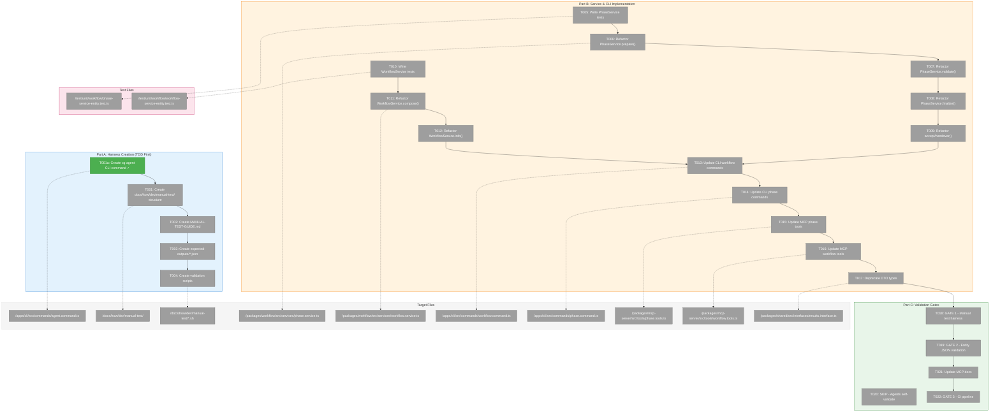
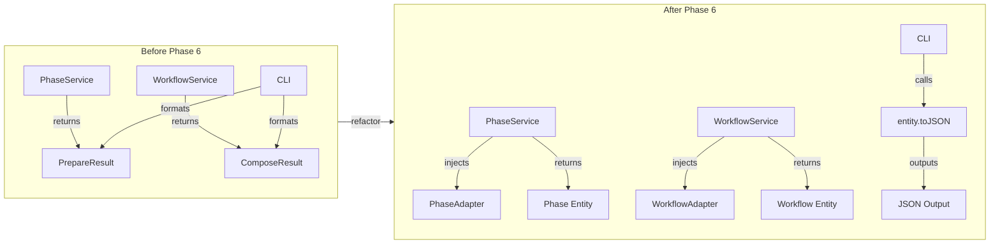
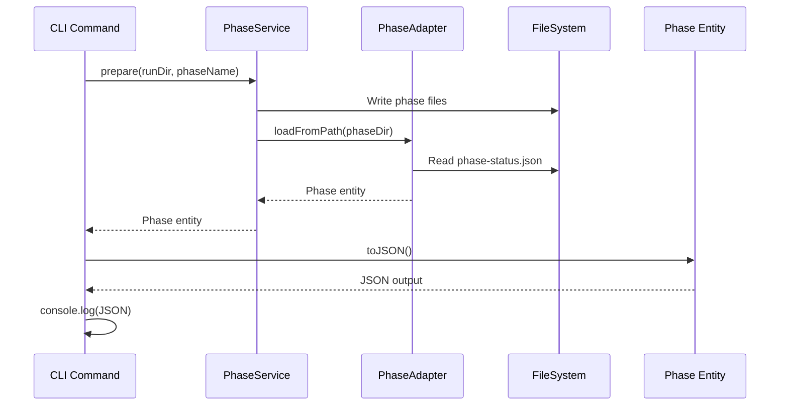

# Phase 6: Service Unification & Validation – Tasks & Alignment Brief

**Spec**: [entity-upgrade-spec.md](../../entity-upgrade-spec.md)
**Plan**: [entity-upgrade-plan.md](../../entity-upgrade-plan.md)
**Date**: 2026-01-26

---

## Executive Briefing

### Purpose
This phase completes the entity-upgrade initiative by unifying all services (PhaseService, WorkflowService) to use entity adapters internally and return entities instead of DTOs. Additionally, two manual test harnesses validate backward compatibility and entity correctness before merge.

### What We're Building
A service layer refactor that:
- Injects `IPhaseAdapter` and `IWorkflowAdapter` into services
- Returns `Phase` and `Workflow` entities instead of DTOs (`PrepareResult`, `ValidateResult`, etc.)
- Updates CLI/MCP commands to format output via `entity.toJSON()`
- Creates manual test harness at `docs/how/dev/manual-test/` for human orchestrator validation
- Agents self-validate when consuming entity JSON output (no explicit MODE-2 gate)

### Role Separation
- **Human Orchestrator**: Executes manual validation scripts in `docs/how/dev/manual-test/`
- **LLM Agents**: Self-validate when consuming entity JSON output from CLI/MCP tools

### User Value
After this phase:
- Consistent data model throughout the stack (entities everywhere, DTOs deprecated)
- CLI output remains 100% backward compatible (no breaking changes for users)
- MCP tools return rich entity JSON instead of flat DTOs
- Automated validation gates prevent regressions

### Example
**Before (DTO)**:
```typescript
const result: PrepareResult = await phaseService.prepare(runDir, 'gather');
console.log(result.phase);  // string name only
```

**After (Entity)**:
```typescript
const phase: Phase = await phaseService.prepare(runDir, 'gather');
console.log(phase.toJSON());  // Full entity with status, inputs, outputs, etc.
```

---

## Objectives & Scope

### Objective
Update services to use entity adapters internally, ensure CLI/MCP output uses entities via `toJSON()`, deprecate DTOs, and **validate the entire refactor via manual test harness** at `docs/how/dev/manual-test/` (per plan § Phase 6 Acceptance Criteria). Agents self-validate when consuming entity JSON output (no explicit MODE-2 gate).

### Goals

- ✅ PhaseService methods (prepare, validate, finalize, accept, handover) return Phase entities
- ✅ WorkflowService methods (compose, info) return Workflow entities
- ✅ CLI workflow/phase commands format output via entity.toJSON()
- ✅ MCP phase/workflow tools return entity JSON
- ✅ DTOs marked @deprecated with JSDoc
- ✅ `docs/how/dev/manual-test/` harness created with validation scripts
- ✅ Manual test harness passes (backward compatibility + entity correctness)
- ✅ CI pipeline green (automated test gate)

### Non-Goals (Scope Boundaries)

- ❌ New CLI commands (Phase 4 complete; just refactor existing)
- ❌ New entities or adapters (Phase 1-3 complete)
- ❌ Performance optimization of service calls
- ❌ Web component integration (future phase)
- ❌ Caching in adapters (spec explicitly prohibits)
- ❌ MODE-2-AGENT-VALIDATION (SKIP: agents self-validate when consuming entity JSON)
- ❌ Removing DTO types (mark @deprecated only; removal in future cleanup)
- ❌ New error codes (E040-E053 already defined)

---

## Architecture Map

### Component Diagram
<!-- Status: grey=pending, orange=in-progress, green=completed, red=blocked -->
<!-- Updated by plan-6 during implementation -->



### Task-to-Component Mapping

<!-- Status: ⬜ Pending | 🟧 In Progress | ✅ Complete | 🔴 Blocked -->

| Task | Component(s) | Files | Status | Comment |
|------|-------------|-------|--------|---------|
| T001a | CLI Agent Command | /apps/cli/src/commands/agent.command.ts | ✅ Complete | **COMPLETE**: CLI for agent invocation (run/compact) |
| T001 | Test Harness | /docs/how/dev/manual-test/*.sh | ⬜ Pending | TDD: Create harness structure; depends on T001a |
| T002 | Test Guide | /docs/how/dev/manual-test/MANUAL-TEST-GUIDE.md | ⬜ Pending | Step-by-step validation guide for human orchestrator |
| T003 | Expected Outputs | /docs/how/dev/manual-test/expected-outputs/*.json | ⬜ Pending | JSON schemas define pass criteria |
| T004 | Validation Scripts | /docs/how/dev/manual-test/*.sh | ⬜ Pending | Create validation scripts for entity JSON format |
| T005 | PhaseService Tests | /test/unit/workflow/phase-service-entity.test.ts | ⬜ Pending | TDD: Write failing tests first |
| T006 | PhaseService | /packages/workflow/src/services/phase.service.ts | ⬜ Pending | prepare() returns Phase entity |
| T007 | PhaseService | /packages/workflow/src/services/phase.service.ts | ⬜ Pending | validate() returns Phase entity |
| T008 | PhaseService | /packages/workflow/src/services/phase.service.ts | ⬜ Pending | finalize() returns Phase entity |
| T009 | PhaseService | /packages/workflow/src/services/phase.service.ts | ⬜ Pending | accept/handover() return Phase |
| T010 | WorkflowService Tests | /test/unit/workflow/workflow-service-entity.test.ts | ⬜ Pending | TDD: Write failing tests first |
| T011 | WorkflowService | /packages/workflow/src/services/workflow.service.ts | ⬜ Pending | compose() returns Workflow entity |
| T012 | WorkflowService | /packages/workflow/src/services/workflow.service.ts | ⬜ Pending | info() returns Workflow entity |
| T013 | CLI Workflow | /apps/cli/src/commands/workflow.command.ts | ⬜ Pending | Output via entity.toJSON() |
| T014 | CLI Phase | /apps/cli/src/commands/phase.command.ts | ⬜ Pending | Output via entity.toJSON() |
| T015 | MCP Phase | /packages/mcp-server/src/tools/phase.tools.ts | ⬜ Pending | Return entity JSON |
| T016 | MCP Workflow | /packages/mcp-server/src/tools/workflow.tools.ts | ⬜ Pending | Return entity JSON |
| T017 | DTOs | /packages/shared/src/interfaces/results.interface.ts | ⬜ Pending | @deprecated JSDoc |
| T018 | Validation | /docs/how/dev/manual-test/ | ⬜ Pending | GATE 1: Backward compat + entity correctness |
| T019 | Validation | /docs/how/dev/manual-test/ | ⬜ Pending | GATE 2: Entity JSON validation scripts |
| T020 | Validation | N/A | ⬜ SKIP | Agents self-validate when consuming entity JSON |
| T021 | Documentation | /docs/how/workflows/4-mcp-reference.md | ⬜ Pending | Entity output examples |
| T022 | Validation | CI pipeline | ⬜ Pending | GATE 3: All green |

---

## Tasks

| Status | ID | Task | CS | Type | Dependencies | Absolute Path(s) | Validation | Subtasks | Notes |
|--------|-----|------|----|------|--------------|------------------|------------|----------|-------|
| [ ] | T001 | **Create docs/how/dev/manual-test/ harness structure** with shell scripts for orchestrator-driven agent testing: 01-clean-slate.sh, 02-init-workflow.sh, 03-compose-run.sh, 04-run-phase-with-agent.sh, 05-compact-between-phases.sh, 06-entity-json-format.sh, 07-runs-commands.sh | 2 | Setup | T001a | /home/jak/substrate/007-manage-workflows/docs/how/dev/manual-test/*.sh | Directory exists with shell scripts, each executable | T001a (CLI prereq) | TDD: Define expected behavior first; requires T001a for agent invocation |
| [x] | T001a | **Create `cg agent` CLI command group** for invoking agents from command line. Commands: `cg agent run --type {claude-code,copilot} --prompt <text> [--prompt-file <path>] [--session <id>] [--cwd <path>]`, `cg agent compact --type <type> --session <id>`. Uses existing AgentService infrastructure. | 3 | CLI | – | /home/jak/substrate/007-manage-workflows/apps/cli/src/commands/agent.command.ts | `cg agent run --help` shows all options; `cg agent run --type claude-code --prompt "hello"` returns JSON with sessionId | [001-subtask](./001-subtask-cg-agent-cli-command.md) | **COMPLETE**: Subtask 001 done. |
| [ ] | T002 | **Create MANUAL-TEST-GUIDE.md** step-by-step validation guide for human orchestrator covering: workflow lifecycle, agent invocation per phase, compact between phases, session resumption, entity.toJSON() verification | 2 | Doc | T001 | /home/jak/substrate/007-manage-workflows/docs/how/dev/manual-test/MANUAL-TEST-GUIDE.md | Guide has numbered steps matching script names | – | TDD: Test guide before implementation |
| [ ] | T003 | **Create expected-outputs/*.json** with JSON schemas for workflow-current.json, workflow-checkpoint.json, workflow-run.json, phase-complete.json, agent-result.json | 2 | Setup | T002 | /home/jak/substrate/007-manage-workflows/docs/how/dev/manual-test/expected-outputs/*.json | 5 JSON files with TypeScript-aligned property names | – | TDD: Expected outputs define pass criteria |
| [ ] | T004 | **Create validation scripts** for entity JSON output format verification and agent result validation | 2 | Setup | T003 | /home/jak/substrate/007-manage-workflows/docs/how/dev/manual-test/*.sh | Scripts validate entity JSON structure against expected-outputs | – | Human orchestrator validation |
| [ ] | T005 | **Write tests for PhaseService using PhaseAdapter** - prepare() returns Phase entity with full data model | 2 | Test | T004 | /home/jak/substrate/007-manage-workflows/test/unit/workflow/phase-service-entity.test.ts | Tests fail with "returns PrepareResult not Phase" | – | TDD: RED phase |
| [ ] | T006 | **Refactor PhaseService.prepare() to use PhaseAdapter** - inject IPhaseAdapter, return Phase entity, preserve CLI behavior | 3 | Core | T005 | /home/jak/substrate/007-manage-workflows/packages/workflow/src/services/phase.service.ts | Tests pass, CLI output unchanged | – | Per Critical Discovery 01 |
| [ ] | T007 | **Refactor PhaseService.validate() to use PhaseAdapter** - return Phase entity with outputs[].exists/valid properties | 2 | Core | T006 | /home/jak/substrate/007-manage-workflows/packages/workflow/src/services/phase.service.ts | validate() returns Phase with validation state | – | – |
| [ ] | T008 | **Refactor PhaseService.finalize() to use PhaseAdapter** - return Phase entity with outputParameters[].value | 2 | Core | T007 | /home/jak/substrate/007-manage-workflows/packages/workflow/src/services/phase.service.ts | finalize() returns Phase with outputs | – | – |
| [ ] | T009 | **Refactor PhaseService.accept() and handover() to use PhaseAdapter** - return Phase entity | 2 | Core | T008 | /home/jak/substrate/007-manage-workflows/packages/workflow/src/services/phase.service.ts | Both methods return Phase entity | – | – |
| [ ] | T010 | **Write tests for WorkflowService using adapters** - compose() returns Workflow entity with run metadata | 2 | Test | T009 | /home/jak/substrate/007-manage-workflows/test/unit/workflow/workflow-service-entity.test.ts | Tests fail with "returns ComposeResult not Workflow" | – | TDD: RED phase |
| [ ] | T011 | **Refactor WorkflowService.compose() to use WorkflowAdapter** - inject IWorkflowAdapter, return Workflow entity (isRun=true) with phases | 3 | Core | T010 | /home/jak/substrate/007-manage-workflows/packages/workflow/src/services/workflow.service.ts | compose() returns Workflow.createRun() entity | – | Per Discovery 09 |
| [ ] | T012 | **Refactor WorkflowService.info() to use WorkflowAdapter** - return Workflow entity | 2 | Core | T011 | /home/jak/substrate/007-manage-workflows/packages/workflow/src/services/workflow.service.ts | info() returns Workflow entity | – | – |
| [ ] | T013 | **Update CLI workflow commands to use entity.toJSON()** - compose, info, status commands | 2 | Integration | T012 | /home/jak/substrate/007-manage-workflows/apps/cli/src/commands/workflow.command.ts | Output format 100% backward compatible | – | CLI backward compat required |
| [ ] | T014 | **Update CLI phase commands to use entity.toJSON()** - prepare, validate, finalize commands | 2 | Integration | T013 | /home/jak/substrate/007-manage-workflows/apps/cli/src/commands/phase.command.ts | Output format 100% backward compatible | – | CLI backward compat required |
| [ ] | T015 | **Update MCP phase tools to return entity.toJSON()** - phase_prepare, phase_validate, phase_finalize | 2 | Integration | T014 | /home/jak/substrate/007-manage-workflows/packages/mcp-server/src/tools/phase.tools.ts | MCP tools return entity JSON | – | – |
| [ ] | T016 | **Update MCP workflow tools to return entity.toJSON()** - wf_compose returns Workflow entity JSON | 2 | Integration | T015 | /home/jak/substrate/007-manage-workflows/packages/mcp-server/src/tools/workflow.tools.ts | wf_compose returns entity JSON | – | – |
| [ ] | T017 | **Deprecate DTO types with @deprecated JSDoc** - PrepareResult, ValidateResult, FinalizeResult, ComposeResult, etc. | 1 | Doc | T016 | /home/jak/substrate/007-manage-workflows/packages/shared/src/interfaces/results.interface.ts, /home/jak/substrate/007-manage-workflows/packages/shared/src/interfaces/index.ts | All DTO types have @deprecated tag | – | – |
| [ ] | T018 | **VALIDATION GATE 1: Execute manual test harness** - all scripts pass proving backward compatibility and entity correctness | 2 | Gate | T017 | /home/jak/substrate/007-manage-workflows/docs/how/dev/manual-test/ | All scripts exit 0 | – | **BLOCKING: Must pass before merge** |
| [ ] | T019 | **VALIDATION GATE 2: Verify entity JSON format** - validate entity.toJSON() output matches expected-outputs/*.json schemas | 2 | Gate | T018 | /home/jak/substrate/007-manage-workflows/docs/how/dev/manual-test/expected-outputs/ | JSON diff shows no unexpected changes | – | **BLOCKING: Must pass before merge** |
| [x] | T020 | **SKIP: MODE-2-AGENT-VALIDATION** - agents self-validate when consuming entity JSON from CLI/MCP | 0 | Gate | – | N/A | N/A | – | SKIP: Agents are consumers, not explicit validation gate |
| [ ] | T021 | **Update 4-mcp-reference.md with entity output examples** | 2 | Doc | T019 | /home/jak/substrate/007-manage-workflows/docs/how/workflows/4-mcp-reference.md | MCP docs show entity JSON format | – | – |
| [ ] | T022 | **Final verification: All automated tests pass** - pnpm test exits 0 with all tests green | 1 | Gate | T021 | N/A (CI validation) | `pnpm test && pnpm typecheck && pnpm lint` all pass | – | **BLOCKING: CI gate** |

---

## Alignment Brief

### Prior Phases Review

#### Phase-by-Phase Summary

**Phase 1: Entity Interfaces & Pure Data Classes** (14 tasks ✅)
- Created foundational entity infrastructure: `Workflow` and `Phase` entities with pure readonly data
- Established factory pattern (private constructor + `createCurrent()`, `createCheckpoint()`, `createRun()`) for XOR invariant enforcement
- Defined `IWorkflowAdapter` (6 methods) and `IPhaseAdapter` (2 methods) interfaces
- Created `EntityNotFoundError` with context fields and run errors (E050-E053)
- Established toJSON() serialization rules: camelCase, undefined→null, Date→ISO-8601, recursive
- **62 tests** created

**Phase 2: Fake Adapters for Testing** (8 tasks ✅)
- Implemented `FakeWorkflowAdapter` and `FakePhaseAdapter` with call-tracking pattern
- Established call capture interfaces (LoadCurrentCall, LoadCheckpointCall, etc.)
- Registered fakes in test containers via `useValue` pattern (per ADR-0004)
- Added `listRunsResultBySlug: Map<string, Workflow[]>` for multi-workflow testing
- Clarified error behavior: throw for entity lookups, return `[]` for collections
- **40 tests** created

**Phase 3: Production Adapters** (17 tasks ✅)
- Implemented `WorkflowAdapter` (363 lines) with all 6 interface methods
- Implemented `PhaseAdapter` (250+ lines) with runtime state merging
- Created contract test factories validating fake/real parity (14+10 tests)
- Applied Critical Insight 1 (JSON parse error handling) and 5 (defensive sorting)
- Registered adapters in production containers via `useFactory` pattern
- **87 tests** created (39 unit + 17 unit + 24 contract + 7 integration)

**Phase 4: CLI `cg runs` Commands** (18 tasks ✅)
- Created `runs.command.ts` (320 lines) with `cg runs list` and `cg runs get`
- Applied DYK-01 (--workflow required), DYK-02 (workflow enumeration), DYK-04 (two-adapter pattern)
- Enhanced `FakeWorkflowAdapter.listRunsResultBySlug` for per-workflow test results
- Established output formatter pattern (table/json parity)
- **21 tests** created

**Phase 5: Documentation** (4 tasks ✅)
- Created `/docs/how/workflows/6-entity-architecture.md` (~500 lines)
- Updated `/docs/how/workflows/3-cli-reference.md` (+180 lines for cg runs)
- Documented two-adapter pattern, toJSON() rules, DI container usage
- Verified all links and CLI help accuracy

#### Cumulative Deliverables

**Entity Layer** (Phase 1):
- `/packages/workflow/src/entities/workflow.ts` — Workflow entity class
- `/packages/workflow/src/entities/phase.ts` — Phase entity class
- `/packages/workflow/src/interfaces/workflow-adapter.interface.ts` — IWorkflowAdapter
- `/packages/workflow/src/interfaces/phase-adapter.interface.ts` — IPhaseAdapter
- `/packages/workflow/src/errors/entity-not-found.error.ts` — EntityNotFoundError
- `/packages/workflow/src/errors/run-errors.ts` — RunNotFoundError, RunCorruptError, etc.

**Fake Layer** (Phase 2):
- `/packages/workflow/src/fakes/fake-workflow-adapter.ts` — FakeWorkflowAdapter
- `/packages/workflow/src/fakes/fake-phase-adapter.ts` — FakePhaseAdapter

**Production Layer** (Phase 3):
- `/packages/workflow/src/adapters/workflow.adapter.ts` — WorkflowAdapter
- `/packages/workflow/src/adapters/phase.adapter.ts` — PhaseAdapter

**CLI Layer** (Phase 4):
- `/apps/cli/src/commands/runs.command.ts` — cg runs list/get commands

**CLI Layer** (Phase 6 T001a) ✅:
- `/apps/cli/src/commands/agent.command.ts` — cg agent run/compact commands
- `/apps/cli/src/lib/container.ts` — AgentService infrastructure
- `/test/unit/cli/agent-command.test.ts` — Agent command unit tests

**Documentation** (Phase 5):
- `/docs/how/workflows/6-entity-architecture.md` — Architecture guide
- `/docs/how/workflows/3-cli-reference.md` — CLI reference (updated)

#### Cross-Phase Learnings

| Pattern | Origin | Impact on Phase 6 |
|---------|--------|-------------------|
| Factory pattern for XOR invariant | Phase 1 | Use `Workflow.createRun()` in service refactors |
| toJSON() serialization rules | Phase 1 DYK-03 | CLI/MCP output must match entity.toJSON() |
| Two-adapter pattern | Phase 4 DYK-04 | Services may need both adapters for full entity graph |
| `loadRun()` returns empty phases[] | Phase 4 DYK-04 | PhaseAdapter.listForWorkflow() must be called separately |
| Call-tracking in fakes | Phase 2 | Service tests can verify adapter call sequences |
| Contract test parity | Phase 3 | Any fake behavior change must pass contract tests |
| `useFactory` for production | ADR-0004 | Services must be DI-resolved, not instantiated directly |

#### Reusable Test Infrastructure

- `FakeWorkflowAdapter` with configurable results and call tracking
- `FakePhaseAdapter` with configurable results and call tracking
- Contract test factories: `workflowAdapterContractTests()`, `phaseAdapterContractTests()`
- CLI test container: `createCliTestContainer()`
- Workflow test container: `createWorkflowTestContainer()`

### Critical Findings Affecting This Phase

| Finding | Constraint/Requirement | Tasks Addressing |
|---------|----------------------|------------------|
| **Discovery 01: Pure Data Entities** | Entities have readonly constructor properties only; no adapter references | T006-T012: Services orchestrate adapters, return pure entities |
| **Discovery 09: Unified Entity Model** | Services use adapters internally, return entities; CLI/MCP consume via toJSON() | T006-T016: Full stack refactor |
| **ADR-0004: DI Container** | Services MUST be resolved from containers, never instantiated directly | T006, T011: Inject adapters via DI |
| **Phase 4 DYK-04: Two-Adapter Pattern** | loadRun() returns phases:[]; must call PhaseAdapter separately | T011: compose() may need both adapters |
| **~~No Agent CLI Command Exists~~** ✅ | ~~AgentService infrastructure exists but no CLI to invoke agents~~ | T001a: ✅ COMPLETE — `cg agent run/compact` commands created |

### Agent CLI Implementation ✅ (T001a Complete)

**Status**: ✅ **COMPLETE** — Subtask 001 delivered all `cg agent` commands.

**What Was Built:**
- `cg agent run` command with options: `--type`, `--prompt`, `--prompt-file`, `--session`, `--cwd`
- `cg agent compact` command with options: `--type`, `--session`
- AgentService registered in CLI DI container (ChainglassConfigService, ProcessManager, adapters)
- 12 unit tests + manual tests with Claude Code (all pass)

**Files Created/Modified:**
| File | Change |
|------|--------|
| `apps/cli/src/lib/container.ts` | +55 lines (agent infrastructure) |
| `apps/cli/src/commands/agent.command.ts` | New file (199 lines) |
| `apps/cli/src/bin/cg.ts` | +2 lines (registration) |
| `test/unit/cli/agent-command.test.ts` | New file (212 lines) |

**See:** [001-subtask-cg-agent-cli-command.md](./001-subtask-cg-agent-cli-command.md) for detailed implementation log.

---

### `cg agent` CLI Reference (for Manual Test Harness)

The following commands are now available for the manual test harness scripts:

#### `cg agent run` — Invoke an Agent

```bash
cg agent run --type <type> --prompt <text> [options]
```

**Required Options:**
| Option | Description |
|--------|-------------|
| `-t, --type <type>` | Agent type: `claude-code` or `copilot` |
| `-p, --prompt <text>` | Prompt text (required unless `--prompt-file`) |

**Optional:**
| Option | Description |
|--------|-------------|
| `-f, --prompt-file <path>` | Read prompt from file (alternative to `--prompt`) |
| `-s, --session <id>` | Session ID for resumption (creates new if omitted) |
| `-c, --cwd <path>` | Working directory for the agent |

**Output (JSON):**
```json
{
  "output": "Agent response text...",
  "sessionId": "15523ff5-a900-4dd9-ab49-73cb1e04342c",
  "status": "completed",
  "exitCode": 0,
  "tokens": { "used": 30455, "total": 30455, "limit": 200000 }
}
```

**Usage Examples:**

```bash
# New session (capture sessionId from output)
RESULT=$(cg agent run --type claude-code --prompt "Analyze the workflow template" --cwd /path/to/run)
SESSION_ID=$(echo "$RESULT" | jq -r '.sessionId')

# Resume session with same sessionId
cg agent run --type claude-code --session "$SESSION_ID" --prompt "Now implement phase 1"

# Use prompt file (useful for complex prompts)
echo "Implement the gather phase per phase.yaml specification" > /tmp/prompt.txt
cg agent run --type claude-code --prompt-file /tmp/prompt.txt --cwd /path/to/run
```

#### `cg agent compact` — Reduce Session Context

```bash
cg agent compact --type <type> --session <id>
```

**Required Options:**
| Option | Description |
|--------|-------------|
| `-t, --type <type>` | Agent type: `claude-code` or `copilot` |
| `-s, --session <id>` | Session ID to compact |

**Output (JSON):**
```json
{
  "output": "",
  "sessionId": "15523ff5-a900-4dd9-ab49-73cb1e04342c",
  "status": "completed",
  "exitCode": 0,
  "tokens": { "used": 0, "total": 0, "limit": 200000 }
}
```

**Usage Example:**

```bash
# Compact between phases to reduce context
cg agent compact --type claude-code --session "$SESSION_ID"
```

#### Error Handling

Errors return JSON with `status: "failed"`:

```json
{
  "output": "",
  "sessionId": "",
  "status": "failed",
  "exitCode": 1,
  "tokens": null,
  "stderr": "Invalid agent type 'invalid'. Valid types: claude-code, copilot"
}
```

#### Session Pattern for Multi-Phase Workflows

```bash
#!/bin/bash
# Pattern: Run → Compact → Run → Compact → Run

# Phase 1: Initial prompt
RESULT1=$(cg agent run --type claude-code --prompt "Execute gather phase" --cwd "$RUN_DIR")
SESSION_ID=$(echo "$RESULT1" | jq -r '.sessionId')
echo "Session: $SESSION_ID"

# Compact before phase 2
cg agent compact --type claude-code --session "$SESSION_ID"

# Phase 2: Continue with compacted context
RESULT2=$(cg agent run --type claude-code --session "$SESSION_ID" --prompt "Execute process phase" --cwd "$RUN_DIR")

# Compact before phase 3
cg agent compact --type claude-code --session "$SESSION_ID"

# Phase 3: Final phase
RESULT3=$(cg agent run --type claude-code --session "$SESSION_ID" --prompt "Execute output phase" --cwd "$RUN_DIR")
```

**Key Points:**
- Always capture `sessionId` from first run for subsequent operations
- Use `jq -r '.sessionId'` to extract from JSON output
- Compact between phases to manage context window
- Agent retains context after compact (tested with poem topic recall)
- No `--timeout` option — uses config-based 10min default

---

### Manual Test Harness Flow (Updated)

1. `01-clean-slate.sh`: Reset test environment
2. `02-init-workflow.sh`: Initialize workflow template
3. `03-compose-run.sh`: Create run from checkpoint
4. `04-run-phase-with-agent.sh`: Invoke `cg agent run --type claude-code --prompt <phase1-prompt> --cwd $RUN_DIR`
5. `05-compact-between-phases.sh`: Invoke `cg agent compact --session <id>` then `cg agent run --session <id> --prompt <phase2-prompt>`
6. `06-entity-json-format.sh`: Validate entity.toJSON() output
7. `07-runs-commands.sh`: Test `cg runs list` and `cg runs get`

**T001a unblocks T001-T004** — the manual test harness can now invoke real agents via CLI.

### ADR Decision Constraints

**ADR-0004: Dependency Injection Container Architecture**
- **Decision**: Parent-child container hierarchy with useFactory registration
- **Constraint**: Services must inject IPhaseAdapter/IWorkflowAdapter via DI, never instantiate directly
- **Addressed by**: T006, T011 (inject adapters in constructor)

### Invariants & Guardrails

- **CLI Backward Compatibility**: Output format MUST NOT change (Phase 6 risk mitigation)
- **Path Security**: All path operations via `IPathResolver.join()` (Discovery 04)
- **No Caching**: Adapters always return fresh reads (Discovery 03)
- **Error Handling**: Throw `EntityNotFoundError` for missing entities (Discovery 07)

### Inputs to Read

- `/home/jak/substrate/007-manage-workflows/packages/workflow/src/services/phase.service.ts` — Current PhaseService
- `/home/jak/substrate/007-manage-workflows/packages/workflow/src/services/workflow.service.ts` — Current WorkflowService
- `/home/jak/substrate/007-manage-workflows/apps/cli/src/commands/workflow.command.ts` — CLI workflow commands
- `/home/jak/substrate/007-manage-workflows/apps/cli/src/commands/phase.command.ts` — CLI phase commands
- `/home/jak/substrate/007-manage-workflows/packages/mcp-server/src/tools/phase.tools.ts` — MCP phase tools
- `/home/jak/substrate/007-manage-workflows/packages/mcp-server/src/tools/workflow.tools.ts` — MCP workflow tools
- `/home/jak/substrate/007-manage-workflows/packages/shared/src/interfaces/results.interface.ts` — DTO types

### Visual Alignment Aids

#### System State Flow



#### Interaction Sequence



### Test Plan (TDD - Tests First)

**Test Strategy**: Full TDD per spec. Write failing tests before implementation.

| Test Suite | Location | Purpose | Expected Tests |
|------------|----------|---------|----------------|
| PhaseService Entity Tests | `/test/unit/workflow/phase-service-entity.test.ts` | Verify prepare/validate/finalize return Phase entities | ~15 tests |
| WorkflowService Entity Tests | `/test/unit/workflow/workflow-service-entity.test.ts` | Verify compose/info return Workflow entities | ~10 tests |
| Manual Test Harness | `/docs/how/dev/manual-test/*.sh` | E2E entity correctness + backward compat validation | 5 scripts |
| Expected Outputs | `/docs/how/dev/manual-test/expected-outputs/*.json` | JSON schema validation for entity output | 4 schemas |

**Fixtures & Mocks**:
- Reuse `FakeWorkflowAdapter`, `FakePhaseAdapter` from Phase 2
- Reuse `FakeFileSystem`, `FakePathResolver`, `FakeYamlParser`
- Contract test factories validate fake/real parity

**Expected Outputs**:
- `Phase` entity with all 20+ properties populated
- `Workflow` entity with correct XOR state (isRun=true for compose)
- toJSON() output matching TypeScript type definitions

### Step-by-Step Implementation Outline

**Part A: Harness Creation (T001a-T004)**
1. **T001a**: Create `cg agent` CLI command group (run/compact) using existing AgentService
2. Create `docs/how/dev/manual-test/` directory with shell scripts for orchestrator-driven agent testing
3. Write MANUAL-TEST-GUIDE.md validation guide for human orchestrator
4. Create expected JSON schemas in `expected-outputs/`
5. Create validation scripts for entity JSON format verification

**Part B: Implementation (T005-T017)**
1. TDD: Write failing PhaseService tests (T005)
2. Refactor PhaseService methods to inject PhaseAdapter and return Phase (T006-T009)
3. TDD: Write failing WorkflowService tests (T010)
4. Refactor WorkflowService methods to inject WorkflowAdapter and return Workflow (T011-T012)
5. Update CLI commands to use entity.toJSON() (T013-T014)
6. Update MCP tools to return entity JSON (T015-T016)
7. Deprecate DTO types with @deprecated (T017)

**Part C: Validation Gates (T018-T022)**
1. Execute manual test harness (T018) — BLOCKING
2. Verify entity JSON format against schemas (T019) — BLOCKING
3. T020 SKIP: Agents self-validate when consuming entity JSON
4. Update MCP documentation (T021)
5. Final CI verification (T022) — BLOCKING

### Commands to Run

```bash
# Phase 6 development
cd /home/jak/substrate/007-manage-workflows

# Run service tests
pnpm test --filter @chainglass/workflow -- --grep "Service"

# Run MCP tests
pnpm test --filter @chainglass/mcp-server

# Full integration test
pnpm test

# Type checking
pnpm typecheck

# Linting
pnpm lint

# Test new cg agent CLI command (after T001a)
pnpm --filter @chainglass/cli exec cg agent run --type claude-code --prompt "hello" --cwd .
pnpm --filter @chainglass/cli exec cg agent compact --type claude-code --session <id>

# Manual test execution (human orchestrator validation)
cd docs/how/dev/manual-test && ./01-clean-slate.sh && ./02-init-workflow.sh && ...

# Run phase with real agent (uses cg agent run)
cd docs/how/dev/manual-test && ./04-run-phase-with-agent.sh

# Verify entity JSON format against expected outputs
cd docs/how/dev/manual-test && ./06-entity-json-format.sh

# Verify CLI output unchanged
pnpm --filter @chainglass/cli exec cg workflow compose hello-wf | jq .

# Verify entity JSON format
pnpm --filter @chainglass/cli exec cg runs list -o json | jq '.runs[0].isRun'
```

### Risks/Unknowns

| Risk | Severity | Likelihood | Mitigation |
|------|----------|------------|------------|
| Breaking CLI output format | HIGH | Medium | Extensive backward compat testing in T018 |
| Service constructor signature changes | Medium | High | Update all DI registrations systematically |
| MCP tool output incompatibility | Medium | Medium | Verify MCP clients handle entity JSON |
| Manual test harness needs creation | Low | Medium | T001-T004 creates harness in docs/how/dev/manual-test/ |
| Test isolation issues | Low | Low | Use child containers per ADR-0004 |

### Ready Check

- [ ] Plan § Phase 6 tasks understood (22 active tasks + 1 SKIP, Part A/B/C structure; includes T001a CLI extension)
- [ ] Critical Discoveries reviewed (01, 09 affect service design)
- [ ] ADR-0004 constraints mapped to tasks (T006, T011)
- [ ] Prior phase deliverables catalogued (entities, adapters, fakes, CLI)
- [ ] Test infrastructure available (FakeAdapters, contract tests)
- [ ] Harness structure defined (docs/how/dev/manual-test/ for human orchestrator)
- [x] **CLI extension complete**: T001a created `cg agent` command group (prerequisite for harness)
- [ ] **BLOCKING gates identified**: T018 (manual test harness), T019 (entity JSON validation), T022 (CI)
- [ ] **T020 SKIP**: Agents self-validate when consuming entity JSON (no explicit gate)

**Await explicit GO/NO-GO before implementation.**

---

## Phase Footnote Stubs

_Populated during implementation by plan-6a-update-progress._

| Footnote | Task | Description | Added |
|----------|------|-------------|-------|
| | | | |

---

## Evidence Artifacts

**Execution Log**: `execution.log.md` (created by plan-6 in this directory)

**Supporting Files**:
- Test results: `pnpm test` output
- Manual test logs: `docs/how/dev/manual-test/results/`
- Expected outputs: `docs/how/dev/manual-test/expected-outputs/`

---

## Discoveries & Learnings

_Populated during implementation by plan-6. Log anything of interest to your future self._

| Date | Task | Type | Discovery | Resolution | References |
|------|------|------|-----------|------------|------------|
| | | | | | |

**Types**: `gotcha` | `research-needed` | `unexpected-behavior` | `workaround` | `decision` | `debt` | `insight`

**What to log**:
- Things that didn't work as expected
- External research that was required
- Implementation troubles and how they were resolved
- Gotchas and edge cases discovered
- Decisions made during implementation
- Technical debt introduced (and why)
- Insights that future phases should know about

_See also: `execution.log.md` for detailed narrative._

---

## Directory Layout

```
docs/plans/010-entity-upgrade/
├── entity-upgrade-spec.md
├── entity-upgrade-plan.md
└── tasks/
    ├── phase-1-entity-interfaces-pure-data-classes/
    │   ├── tasks.md
    │   └── execution.log.md
    ├── phase-2-fake-adapters-for-testing/
    │   ├── tasks.md
    │   └── execution.log.md
    ├── phase-3-production-adapters/
    │   ├── tasks.md
    │   └── execution.log.md
    ├── phase-4-cli-cg-runs-commands/
    │   ├── tasks.md
    │   └── execution.log.md
    ├── phase-5-documentation/
    │   ├── tasks.md
    │   └── execution.log.md
    └── phase-6-service-unification-validation/  # THIS PHASE
        ├── tasks.md                              # This file
        └── execution.log.md                      # Created by plan-6
```
