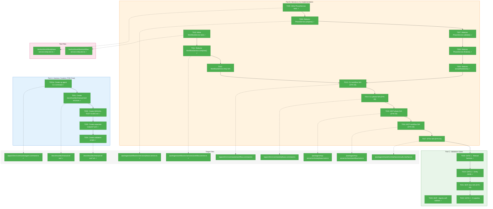
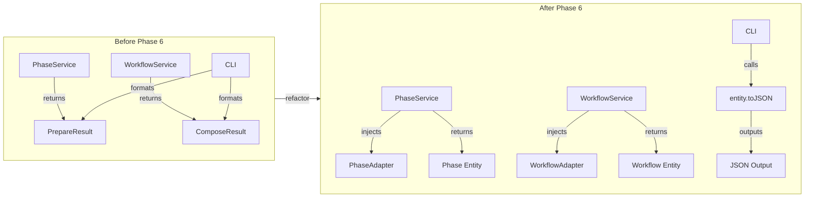
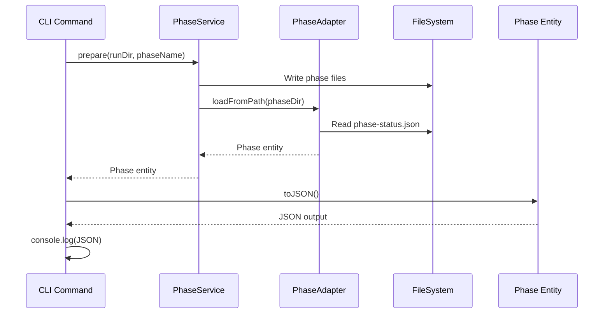

# Phase 6: Service Unification & Validation – Tasks & Alignment Brief

**Spec**: [entity-upgrade-spec.md](../../entity-upgrade-spec.md)
**Plan**: [entity-upgrade-plan.md](../../entity-upgrade-plan.md)
**Date**: 2026-01-26

---

## Executive Briefing

### Purpose
This phase completes the entity-upgrade initiative by unifying all services (PhaseService, WorkflowService) to use entity adapters internally and return entities instead of DTOs. Additionally, two manual test harnesses validate backward compatibility and entity correctness before merge.

### What We're Building
A service layer refactor that:
- Injects `IPhaseAdapter` and `IWorkflowAdapter` into services
- Returns `Phase` and `Workflow` entities instead of DTOs (`PrepareResult`, `ValidateResult`, etc.)
- Updates CLI/MCP commands to format output via `entity.toJSON()`
- Creates manual test harness at `docs/how/dev/manual-test/` for human orchestrator validation
- Agents self-validate when consuming entity JSON output (no explicit MODE-2 gate)

### Role Separation
- **Human Orchestrator**: Executes manual validation scripts in `docs/how/dev/manual-test/`
- **LLM Agents**: Self-validate when consuming entity JSON output from CLI/MCP tools

### User Value
After this phase:
- Consistent data model throughout the stack (entities everywhere, DTOs deprecated)
- CLI output remains 100% backward compatible (no breaking changes for users)
- MCP tools return rich entity JSON instead of flat DTOs
- Automated validation gates prevent regressions

### Example
**Before (DTO)**:
```typescript
const result: PrepareResult = await phaseService.prepare(runDir, 'gather');
console.log(result.phase);  // string name only
```

**After (Entity)**:
```typescript
const phase: Phase = await phaseService.prepare(runDir, 'gather');
console.log(phase.toJSON());  // Full entity with status, inputs, outputs, etc.
```

---

## Objectives & Scope

### Objective
Update services to use entity adapters internally, ensure CLI/MCP output uses entities via `toJSON()`, deprecate DTOs, and **validate the entire refactor via manual test harness** at `docs/how/dev/manual-test/` (per plan § Phase 6 Acceptance Criteria). Agents self-validate when consuming entity JSON output (no explicit MODE-2 gate).

### Goals

- ✅ PhaseService methods (prepare, validate, finalize, accept, handover) return Phase entities
- ✅ WorkflowService methods (compose, info) return Workflow entities
- ✅ CLI workflow/phase commands format output via entity.toJSON()
- ✅ MCP phase/workflow tools return entity JSON
- ✅ DTOs marked @deprecated with JSDoc
- ✅ `docs/how/dev/manual-test/` harness created with validation scripts
- ✅ Manual test harness passes (backward compatibility + entity correctness)
- ✅ CI pipeline green (automated test gate)

### Non-Goals (Scope Boundaries)

- ❌ New CLI commands (Phase 4 complete; just refactor existing)
- ❌ New entities or adapters (Phase 1-3 complete)
- ❌ Performance optimization of service calls
- ❌ Web component integration (future phase)
- ❌ Caching in adapters (spec explicitly prohibits)
- ❌ MODE-2-AGENT-VALIDATION (SKIP: agents self-validate when consuming entity JSON)
- ❌ Removing DTO types (mark @deprecated only; removal in future cleanup)
- ❌ New error codes (E040-E053 already defined)

---

## Architecture Map

### Component Diagram
<!-- Status: grey=pending, orange=in-progress, green=completed, red=blocked -->
<!-- Updated by plan-6 during implementation -->



### Task-to-Component Mapping

<!-- Status: ⬜ Pending | 🟧 In Progress | ✅ Complete | 🔴 Blocked -->

| Task | Component(s) | Files | Status | Comment |
|------|-------------|-------|--------|---------|
| T001a | CLI Agent Command | /apps/cli/src/commands/agent.command.ts | ✅ Complete | **COMPLETE**: CLI for agent invocation (run/compact) |
| T001 | Test Harness | /docs/how/dev/manual-wf-run/*.sh | ✅ Complete | DYK-05: Full overhaul with cg agent CLI invocation |
| T002 | Test Guide | /docs/how/dev/manual-wf-run/ENTITY-VALIDATION-GUIDE.md | ✅ Complete | Step-by-step validation guide for human orchestrator |
| T003 | Expected Outputs | /docs/how/dev/manual-wf-run/expected-outputs/*.json | ✅ Complete | 5 JSON schemas: workflow-*, phase-complete, agent-result |
| T004 | Validation Scripts | /docs/how/dev/manual-wf-run/*.sh | ✅ Complete | Full overhaul: 01-clean-slate → 07-validate-runs (uses cg agent run/compact) |
| T005 | PhaseService Tests | /test/unit/workflow/phase-service-entity.test.ts | ✅ Complete | TDD: 9 tests passing after refactor |
| T006 | PhaseService | /packages/workflow/src/services/phase.service.ts | ✅ Complete | prepare() returns PrepareResultWithEntity, IPhaseAdapter injected |
| T007 | PhaseService | /packages/workflow/src/services/phase.service.ts | ✅ Complete | validate() returns ValidateResultWithEntity |
| T008 | PhaseService | /packages/workflow/src/services/phase.service.ts | ✅ Complete | finalize() returns FinalizeResultWithEntity |
| T009 | PhaseService | /packages/workflow/src/services/phase.service.ts | ✅ Complete | accept/preflight/handover() return extended types |
| T010 | WorkflowService Tests | /test/unit/workflow/workflow-service-entity.test.ts | ✅ Complete | 6 tests passing |
| T011 | WorkflowService | /packages/workflow/src/services/workflow.service.ts | ✅ Complete | compose() returns ComposeResultWithEntity, IWorkflowAdapter injected |
| T012 | WorkflowService | /packages/workflow/src/services/workflow.service.ts | ⏭️ N/A | WorkflowService.info() doesn't exist; uses IWorkflowRegistry |
| T013 | CLI Workflow | /apps/cli/src/commands/workflow.command.ts | ⏭️ N/A | Per DYK-03: OutputAdapter pattern already handles backward compat |
| T014 | CLI Phase | /apps/cli/src/commands/phase.command.ts | ⏭️ N/A | Per DYK-03: OutputAdapter pattern already handles backward compat |
| T015 | MCP Phase | /packages/mcp-server/src/tools/phase.tools.ts | ⏭️ N/A | Per DYK-03: JsonOutputAdapter pattern, no changes needed |
| T016 | MCP Workflow | /packages/mcp-server/src/tools/workflow.tools.ts | ⏭️ N/A | Per DYK-03: JsonOutputAdapter pattern, no changes needed |
| T017 | DTOs | /packages/shared/src/interfaces/results.interface.ts | ⏭️ N/A | Per DYK-01: Result types kept as "operation reports" |
| T018 | Validation | /docs/how/dev/manual-wf-run/ | ✅ Complete | GATE 1: Manual harness PASSED - 7 scripts executed [^3] |
| T019 | Validation | /docs/how/dev/manual-wf-run/expected-outputs/ | ✅ Complete | GATE 2: Entity JSON PASSED - structure validated [^3] |
| T020 | Validation | N/A | ⏭️ SKIP | Agents self-validate when consuming entity JSON |
| T021 | Documentation | /docs/how/workflows/4-mcp-reference.md | ⏭️ N/A | Per DYK-03: No output format changes, no docs needed |
| T022 | Validation | CI pipeline | ✅ Complete | 1840 tests pass, typecheck passes |

---

## Tasks

| Status | ID | Task | CS | Type | Dependencies | Absolute Path(s) | Validation | Subtasks | Notes |
|--------|-----|------|----|------|--------------|------------------|------------|----------|-------|
| [x] | T001 | **Create docs/how/dev/manual-test/ harness structure** with shell scripts for orchestrator-driven agent testing: 01-clean-slate.sh, 02-compose-run.sh, 03-run-gather.sh, 04-run-process.sh, 05-run-report.sh, 06-validate-entity.sh, 07-validate-runs.sh | 2 | Setup | T001a | /home/jak/substrate/007-manage-workflows/docs/how/dev/manual-wf-run/*.sh | Per DYK-05: Full overhaul of manual-wf-run/ harness | T001a (CLI prereq) | Full overhaul: Uses `cg agent run/compact` for programmatic agent invocation |
| [x] | T001a | **Create `cg agent` CLI command group** for invoking agents from command line. Commands: `cg agent run --type {claude-code,copilot} --prompt <text> [--prompt-file <path>] [--session <id>] [--cwd <path>]`, `cg agent compact --type <type> --session <id>`. Uses existing AgentService infrastructure. | 3 | CLI | – | /home/jak/substrate/007-manage-workflows/apps/cli/src/commands/agent.command.ts | `cg agent run --help` shows all options; `cg agent run --type claude-code --prompt "hello"` returns JSON with sessionId | [001-subtask](./001-subtask-cg-agent-cli-command.md) | **COMPLETE**: Subtask 001 done. |
| [x] | T002 | **Create MANUAL-TEST-GUIDE.md** step-by-step validation guide for human orchestrator covering: workflow lifecycle, agent invocation per phase, compact between phases, session resumption, entity.toJSON() verification | 2 | Doc | T001 | /home/jak/substrate/007-manage-workflows/docs/how/dev/manual-wf-run/ENTITY-VALIDATION-GUIDE.md | Guide created with numbered steps matching scripts | – | Per DYK-05: Added ENTITY-VALIDATION-GUIDE.md to existing harness |
| [x] | T003 | **Create expected-outputs/*.json** with JSON schemas for workflow-current.json, workflow-checkpoint.json, workflow-run.json, phase-complete.json, agent-result.json | 2 | Setup | T002 | /home/jak/substrate/007-manage-workflows/docs/how/dev/manual-wf-run/expected-outputs/*.json | 5 JSON files created with TypeScript-aligned property names | – | Aligned with WorkflowJSON, PhaseJSON, AgentResult types |
| [x] | T004 | **Create validation scripts** for entity JSON output format verification and agent result validation | 2 | Setup | T003 | /home/jak/substrate/007-manage-workflows/docs/how/dev/manual-wf-run/*.sh | 06-validate-entity.sh, 07-validate-runs.sh created | – | Full overhaul with correct `cg runs get` syntax |
| [x] | T005 | **Write tests for PhaseService using PhaseAdapter** - prepare() returns Phase entity with full data model | 2 | Test | T004 | /home/jak/substrate/007-manage-workflows/test/unit/workflow/phase-service-entity.test.ts | 9 tests passing | – | TDD: All tests passing after refactor |
| [x] | T006 | **Refactor PhaseService.prepare() to use PhaseAdapter** - inject IPhaseAdapter, return Phase entity, preserve CLI behavior | 3 | Core | T005 | /home/jak/substrate/007-manage-workflows/packages/workflow/src/services/phase.service.ts | 114 tests pass, CLI unchanged | – | Created phase-service.types.ts with PrepareResultWithEntity |
| [x] | T007 | **Refactor PhaseService.validate() to use PhaseAdapter** - return Phase entity with outputs[].exists/valid properties | 2 | Core | T006 | /home/jak/substrate/007-manage-workflows/packages/workflow/src/services/phase.service.ts | validate() returns ValidateResultWithEntity | – | – |
| [x] | T008 | **Refactor PhaseService.finalize() to use PhaseAdapter** - return Phase entity with outputParameters[].value | 2 | Core | T007 | /home/jak/substrate/007-manage-workflows/packages/workflow/src/services/phase.service.ts | finalize() returns FinalizeResultWithEntity | – | – |
| [x] | T009 | **Refactor PhaseService.accept() and handover() to use PhaseAdapter** - return Phase entity | 2 | Core | T008 | /home/jak/substrate/007-manage-workflows/packages/workflow/src/services/phase.service.ts | All 5 methods return extended types | – | accept/preflight/handover all updated |
| [x] | T010 | **Write tests for WorkflowService using adapters** - compose() returns Workflow entity with run metadata | 2 | Test | T009 | /home/jak/substrate/007-manage-workflows/test/unit/workflow/workflow-service-entity.test.ts | 6 tests passing | – | TDD: All tests passing |
| [x] | T011 | **Refactor WorkflowService.compose() to use WorkflowAdapter** - inject IWorkflowAdapter, return Workflow entity (isRun=true) with phases | 3 | Core | T010 | /home/jak/substrate/007-manage-workflows/packages/workflow/src/services/workflow.service.ts | 48 tests pass, CLI unchanged | – | Created workflow-service.types.ts with ComposeResultWithEntity |
| [N/A] | T012 | **Refactor WorkflowService.info() to use WorkflowAdapter** - return Workflow entity | 2 | Core | T011 | /home/jak/substrate/007-manage-workflows/packages/workflow/src/services/workflow.service.ts | N/A | – | WorkflowService.info() doesn't exist; uses IWorkflowRegistry |
| [N/A] | T013 | **Update CLI workflow commands to use entity.toJSON()** - compose, info, status commands | 2 | Integration | T012 | /home/jak/substrate/007-manage-workflows/apps/cli/src/commands/workflow.command.ts | N/A | – | Per DYK-03: OutputAdapter pattern handles compat |
| [N/A] | T014 | **Update CLI phase commands to use entity.toJSON()** - prepare, validate, finalize commands | 2 | Integration | T013 | /home/jak/substrate/007-manage-workflows/apps/cli/src/commands/phase.command.ts | N/A | – | Per DYK-03: OutputAdapter pattern handles compat |
| [N/A] | T015 | **Update MCP phase tools to return entity.toJSON()** - phase_prepare, phase_validate, phase_finalize | 2 | Integration | T014 | /home/jak/substrate/007-manage-workflows/packages/mcp-server/src/tools/phase.tools.ts | N/A | – | Per DYK-03: JsonOutputAdapter, no changes needed |
| [N/A] | T016 | **Update MCP workflow tools to return entity.toJSON()** - wf_compose returns Workflow entity JSON | 2 | Integration | T015 | /home/jak/substrate/007-manage-workflows/packages/mcp-server/src/tools/workflow.tools.ts | N/A | – | Per DYK-03: JsonOutputAdapter, no changes needed |
| [N/A] | T017 | **Deprecate DTO types with @deprecated JSDoc** - PrepareResult, ValidateResult, FinalizeResult, ComposeResult, etc. | 1 | Doc | T016 | /home/jak/substrate/007-manage-workflows/packages/shared/src/interfaces/results.interface.ts | N/A | – | Per DYK-01: Result types kept as "operation reports" |
| [x] | T018 | **VALIDATION GATE 1: Execute manual test harness** - all scripts pass proving backward compatibility and entity correctness | 2 | Gate | T017 | /home/jak/substrate/007-manage-workflows/docs/how/dev/manual-wf-run/ | ALL 7 SCRIPTS PASSED | – | **COMPLETE**: Harness executed 2026-01-26, discovered & fixed 6 critical issues [^3] |
| [x] | T019 | **VALIDATION GATE 2: Verify entity JSON format** - validate entity.toJSON() output matches expected-outputs/*.json schemas | 2 | Gate | T018 | /home/jak/substrate/007-manage-workflows/docs/how/dev/manual-wf-run/expected-outputs/ | Entity JSON VALIDATED | – | **COMPLETE**: Workflow entity (12 keys) and Phase entity (3 keys) validated [^3] |
| [x] | T020 | **SKIP: MODE-2-AGENT-VALIDATION** - agents self-validate when consuming entity JSON from CLI/MCP | 0 | Gate | – | N/A | N/A | – | SKIP: Agents are consumers, not explicit validation gate |
| [N/A] | T021 | **Update 4-mcp-reference.md with entity output examples** | 2 | Doc | T019 | /home/jak/substrate/007-manage-workflows/docs/how/workflows/4-mcp-reference.md | N/A | – | Per DYK-03: No output format changes |
| [x] | T022 | **Final verification: All automated tests pass** - pnpm test exits 0 with all tests green | 1 | Gate | T021 | N/A (CI validation) | 1840 tests pass | – | **CI gate passed** |

---

## Alignment Brief

### Prior Phases Review

#### Phase-by-Phase Summary

**Phase 1: Entity Interfaces & Pure Data Classes** (14 tasks ✅)
- Created foundational entity infrastructure: `Workflow` and `Phase` entities with pure readonly data
- Established factory pattern (private constructor + `createCurrent()`, `createCheckpoint()`, `createRun()`) for XOR invariant enforcement
- Defined `IWorkflowAdapter` (6 methods) and `IPhaseAdapter` (2 methods) interfaces
- Created `EntityNotFoundError` with context fields and run errors (E050-E053)
- Established toJSON() serialization rules: camelCase, undefined→null, Date→ISO-8601, recursive
- **62 tests** created

**Phase 2: Fake Adapters for Testing** (8 tasks ✅)
- Implemented `FakeWorkflowAdapter` and `FakePhaseAdapter` with call-tracking pattern
- Established call capture interfaces (LoadCurrentCall, LoadCheckpointCall, etc.)
- Registered fakes in test containers via `useValue` pattern (per ADR-0004)
- Added `listRunsResultBySlug: Map<string, Workflow[]>` for multi-workflow testing
- Clarified error behavior: throw for entity lookups, return `[]` for collections
- **40 tests** created

**Phase 3: Production Adapters** (17 tasks ✅)
- Implemented `WorkflowAdapter` (363 lines) with all 6 interface methods
- Implemented `PhaseAdapter` (250+ lines) with runtime state merging
- Created contract test factories validating fake/real parity (14+10 tests)
- Applied Critical Insight 1 (JSON parse error handling) and 5 (defensive sorting)
- Registered adapters in production containers via `useFactory` pattern
- **87 tests** created (39 unit + 17 unit + 24 contract + 7 integration)

**Phase 4: CLI `cg runs` Commands** (18 tasks ✅)
- Created `runs.command.ts` (320 lines) with `cg runs list` and `cg runs get`
- Applied DYK-01 (--workflow required), DYK-02 (workflow enumeration), DYK-04 (two-adapter pattern)
- Enhanced `FakeWorkflowAdapter.listRunsResultBySlug` for per-workflow test results
- Established output formatter pattern (table/json parity)
- **21 tests** created

**Phase 5: Documentation** (4 tasks ✅)
- Created `/docs/how/workflows/6-entity-architecture.md` (~500 lines)
- Updated `/docs/how/workflows/3-cli-reference.md` (+180 lines for cg runs)
- Documented two-adapter pattern, toJSON() rules, DI container usage
- Verified all links and CLI help accuracy

#### Cumulative Deliverables

**Entity Layer** (Phase 1):
- `/packages/workflow/src/entities/workflow.ts` — Workflow entity class
- `/packages/workflow/src/entities/phase.ts` — Phase entity class
- `/packages/workflow/src/interfaces/workflow-adapter.interface.ts` — IWorkflowAdapter
- `/packages/workflow/src/interfaces/phase-adapter.interface.ts` — IPhaseAdapter
- `/packages/workflow/src/errors/entity-not-found.error.ts` — EntityNotFoundError
- `/packages/workflow/src/errors/run-errors.ts` — RunNotFoundError, RunCorruptError, etc.

**Fake Layer** (Phase 2):
- `/packages/workflow/src/fakes/fake-workflow-adapter.ts` — FakeWorkflowAdapter
- `/packages/workflow/src/fakes/fake-phase-adapter.ts` — FakePhaseAdapter

**Production Layer** (Phase 3):
- `/packages/workflow/src/adapters/workflow.adapter.ts` — WorkflowAdapter
- `/packages/workflow/src/adapters/phase.adapter.ts` — PhaseAdapter

**CLI Layer** (Phase 4):
- `/apps/cli/src/commands/runs.command.ts` — cg runs list/get commands

**CLI Layer** (Phase 6 T001a) ✅:
- `/apps/cli/src/commands/agent.command.ts` — cg agent run/compact commands
- `/apps/cli/src/lib/container.ts` — AgentService infrastructure
- `/test/unit/cli/agent-command.test.ts` — Agent command unit tests

**Documentation** (Phase 5):
- `/docs/how/workflows/6-entity-architecture.md` — Architecture guide
- `/docs/how/workflows/3-cli-reference.md` — CLI reference (updated)

#### Cross-Phase Learnings

| Pattern | Origin | Impact on Phase 6 |
|---------|--------|-------------------|
| Factory pattern for XOR invariant | Phase 1 | Use `Workflow.createRun()` in service refactors |
| toJSON() serialization rules | Phase 1 DYK-03 | CLI/MCP output must match entity.toJSON() |
| Two-adapter pattern | Phase 4 DYK-04 | Services may need both adapters for full entity graph |
| `loadRun()` returns empty phases[] | Phase 4 DYK-04 | PhaseAdapter.listForWorkflow() must be called separately |
| Call-tracking in fakes | Phase 2 | Service tests can verify adapter call sequences |
| Contract test parity | Phase 3 | Any fake behavior change must pass contract tests |
| `useFactory` for production | ADR-0004 | Services must be DI-resolved, not instantiated directly |

#### Reusable Test Infrastructure

- `FakeWorkflowAdapter` with configurable results and call tracking
- `FakePhaseAdapter` with configurable results and call tracking
- Contract test factories: `workflowAdapterContractTests()`, `phaseAdapterContractTests()`
- CLI test container: `createCliTestContainer()`
- Workflow test container: `createWorkflowTestContainer()`

### Critical Findings Affecting This Phase

| Finding | Constraint/Requirement | Tasks Addressing |
|---------|----------------------|------------------|
| **Discovery 01: Pure Data Entities** | Entities have readonly constructor properties only; no adapter references | T006-T012: Services orchestrate adapters, return pure entities |
| **Discovery 09: Unified Entity Model** | Services use adapters internally, return entities; CLI/MCP consume via toJSON() | T006-T016: Full stack refactor |
| **ADR-0004: DI Container** | Services MUST be resolved from containers, never instantiated directly | T006, T011: Inject adapters via DI |
| **Phase 4 DYK-04: Two-Adapter Pattern** | loadRun() returns phases:[]; must call PhaseAdapter separately | T011: compose() may need both adapters |
| **~~No Agent CLI Command Exists~~** ✅ | ~~AgentService infrastructure exists but no CLI to invoke agents~~ | T001a: ✅ COMPLETE — `cg agent run/compact` commands created |

### Agent CLI Implementation ✅ (T001a Complete)

**Status**: ✅ **COMPLETE** — Subtask 001 delivered all `cg agent` commands.

**What Was Built:**
- `cg agent run` command with options: `--type`, `--prompt`, `--prompt-file`, `--session`, `--cwd`
- `cg agent compact` command with options: `--type`, `--session`
- AgentService registered in CLI DI container (ChainglassConfigService, ProcessManager, adapters)
- 12 unit tests + manual tests with Claude Code (all pass)

**Files Created/Modified:**
| File | Change |
|------|--------|
| `apps/cli/src/lib/container.ts` | +55 lines (agent infrastructure) |
| `apps/cli/src/commands/agent.command.ts` | New file (199 lines) |
| `apps/cli/src/bin/cg.ts` | +2 lines (registration) |
| `test/unit/cli/agent-command.test.ts` | New file (212 lines) |

**See:** [001-subtask-cg-agent-cli-command.md](./001-subtask-cg-agent-cli-command.md) for detailed implementation log.

---

### `cg agent` CLI Reference (for Manual Test Harness)

The following commands are now available for the manual test harness scripts:

#### `cg agent run` — Invoke an Agent

```bash
cg agent run --type <type> --prompt <text> [options]
```

**Required Options:**
| Option | Description |
|--------|-------------|
| `-t, --type <type>` | Agent type: `claude-code` or `copilot` |
| `-p, --prompt <text>` | Prompt text (required unless `--prompt-file`) |

**Optional:**
| Option | Description |
|--------|-------------|
| `-f, --prompt-file <path>` | Read prompt from file (alternative to `--prompt`) |
| `-s, --session <id>` | Session ID for resumption (creates new if omitted) |
| `-c, --cwd <path>` | Working directory for the agent |

**Output (JSON):**
```json
{
  "output": "Agent response text...",
  "sessionId": "15523ff5-a900-4dd9-ab49-73cb1e04342c",
  "status": "completed",
  "exitCode": 0,
  "tokens": { "used": 30455, "total": 30455, "limit": 200000 }
}
```

**Usage Examples:**

```bash
# New session (capture sessionId from output)
RESULT=$(cg agent run --type claude-code --prompt "Analyze the workflow template" --cwd /path/to/run)
SESSION_ID=$(echo "$RESULT" | jq -r '.sessionId')

# Resume session with same sessionId
cg agent run --type claude-code --session "$SESSION_ID" --prompt "Now implement phase 1"

# Use prompt file (useful for complex prompts)
echo "Implement the gather phase per phase.yaml specification" > /tmp/prompt.txt
cg agent run --type claude-code --prompt-file /tmp/prompt.txt --cwd /path/to/run
```

#### `cg agent compact` — Reduce Session Context

```bash
cg agent compact --type <type> --session <id>
```

**Required Options:**
| Option | Description |
|--------|-------------|
| `-t, --type <type>` | Agent type: `claude-code` or `copilot` |
| `-s, --session <id>` | Session ID to compact |

**Output (JSON):**
```json
{
  "output": "",
  "sessionId": "15523ff5-a900-4dd9-ab49-73cb1e04342c",
  "status": "completed",
  "exitCode": 0,
  "tokens": { "used": 0, "total": 0, "limit": 200000 }
}
```

**Usage Example:**

```bash
# Compact between phases to reduce context
cg agent compact --type claude-code --session "$SESSION_ID"
```

#### Error Handling

Errors return JSON with `status: "failed"`:

```json
{
  "output": "",
  "sessionId": "",
  "status": "failed",
  "exitCode": 1,
  "tokens": null,
  "stderr": "Invalid agent type 'invalid'. Valid types: claude-code, copilot"
}
```

#### Session Pattern for Multi-Phase Workflows

```bash
#!/bin/bash
# Pattern: Run → Compact → Run → Compact → Run

# Phase 1: Initial prompt
RESULT1=$(cg agent run --type claude-code --prompt "Execute gather phase" --cwd "$RUN_DIR")
SESSION_ID=$(echo "$RESULT1" | jq -r '.sessionId')
echo "Session: $SESSION_ID"

# Compact before phase 2
cg agent compact --type claude-code --session "$SESSION_ID"

# Phase 2: Continue with compacted context
RESULT2=$(cg agent run --type claude-code --session "$SESSION_ID" --prompt "Execute process phase" --cwd "$RUN_DIR")

# Compact before phase 3
cg agent compact --type claude-code --session "$SESSION_ID"

# Phase 3: Final phase
RESULT3=$(cg agent run --type claude-code --session "$SESSION_ID" --prompt "Execute output phase" --cwd "$RUN_DIR")
```

**Key Points:**
- Always capture `sessionId` from first run for subsequent operations
- Use `jq -r '.sessionId'` to extract from JSON output
- Compact between phases to manage context window
- Agent retains context after compact (tested with poem topic recall)
- No `--timeout` option — uses config-based 10min default

---

### Manual Test Harness Flow (Updated) ✅ IMPLEMENTED

**Location**: `docs/how/dev/manual-wf-run/`

| Script | Purpose |
|--------|---------|
| `01-clean-slate.sh` | Reset test environment (remove runs, clear state) |
| `02-compose-run.sh` | Create a fresh run from hello-workflow template |
| `03-run-gather.sh` | Prepare gather + `cg agent run` + validate + finalize |
| `04-run-process.sh` | `cg agent compact` + prepare process + `cg agent run` + validate + finalize |
| `05-run-report.sh` | `cg agent compact` + prepare report + `cg agent run` + validate + finalize |
| `06-validate-entity.sh` | Validate entity JSON format (correct `cg runs get` syntax) |
| `07-validate-runs.sh` | Test `cg runs list` and `cg runs get <run-id> --workflow <slug>` |
| `check-state.sh` | Show current state of all phases |

**Session Pattern**: Scripts 03-05 use `cg agent run/compact` with session continuity:
- 03 captures sessionId, saves to `.current-session`
- 04/05 compact session, then resume with `--session $ID`

**T001a unblocks T001-T004** — the manual test harness now invokes real agents via CLI.

### ADR Decision Constraints

**ADR-0004: Dependency Injection Container Architecture**
- **Decision**: Parent-child container hierarchy with useFactory registration
- **Constraint**: Services must inject IPhaseAdapter/IWorkflowAdapter via DI, never instantiate directly
- **Addressed by**: T006, T011 (inject adapters in constructor)

### Invariants & Guardrails

- **CLI Backward Compatibility**: Output format MUST NOT change (Phase 6 risk mitigation)
- **Path Security**: All path operations via `IPathResolver.join()` (Discovery 04)
- **No Caching**: Adapters always return fresh reads (Discovery 03)
- **Error Handling**: Throw `EntityNotFoundError` for missing entities (Discovery 07)

### Inputs to Read

- `/home/jak/substrate/007-manage-workflows/packages/workflow/src/services/phase.service.ts` — Current PhaseService
- `/home/jak/substrate/007-manage-workflows/packages/workflow/src/services/workflow.service.ts` — Current WorkflowService
- `/home/jak/substrate/007-manage-workflows/apps/cli/src/commands/workflow.command.ts` — CLI workflow commands
- `/home/jak/substrate/007-manage-workflows/apps/cli/src/commands/phase.command.ts` — CLI phase commands
- `/home/jak/substrate/007-manage-workflows/packages/mcp-server/src/tools/phase.tools.ts` — MCP phase tools
- `/home/jak/substrate/007-manage-workflows/packages/mcp-server/src/tools/workflow.tools.ts` — MCP workflow tools
- `/home/jak/substrate/007-manage-workflows/packages/shared/src/interfaces/results.interface.ts` — DTO types

### Visual Alignment Aids

#### System State Flow



#### Interaction Sequence



### Test Plan (TDD - Tests First)

**Test Strategy**: Full TDD per spec. Write failing tests before implementation.

| Test Suite | Location | Purpose | Expected Tests |
|------------|----------|---------|----------------|
| PhaseService Entity Tests | `/test/unit/workflow/phase-service-entity.test.ts` | Verify prepare/validate/finalize return Phase entities | ~15 tests |
| WorkflowService Entity Tests | `/test/unit/workflow/workflow-service-entity.test.ts` | Verify compose/info return Workflow entities | ~10 tests |
| Manual Test Harness | `/docs/how/dev/manual-test/*.sh` | E2E entity correctness + backward compat validation | 5 scripts |
| Expected Outputs | `/docs/how/dev/manual-test/expected-outputs/*.json` | JSON schema validation for entity output | 4 schemas |

**Fixtures & Mocks**:
- Reuse `FakeWorkflowAdapter`, `FakePhaseAdapter` from Phase 2
- Reuse `FakeFileSystem`, `FakePathResolver`, `FakeYamlParser`
- Contract test factories validate fake/real parity

**Expected Outputs**:
- `Phase` entity with all 20+ properties populated
- `Workflow` entity with correct XOR state (isRun=true for compose)
- toJSON() output matching TypeScript type definitions

### Step-by-Step Implementation Outline

**Part A: Harness Creation (T001a-T004)**
1. **T001a**: Create `cg agent` CLI command group (run/compact) using existing AgentService
2. Create `docs/how/dev/manual-test/` directory with shell scripts for orchestrator-driven agent testing
3. Write MANUAL-TEST-GUIDE.md validation guide for human orchestrator
4. Create expected JSON schemas in `expected-outputs/`
5. Create validation scripts for entity JSON format verification

**Part B: Implementation (T005-T017)**
1. TDD: Write failing PhaseService tests (T005)
2. Refactor PhaseService methods to inject PhaseAdapter and return Phase (T006-T009)
3. TDD: Write failing WorkflowService tests (T010)
4. Refactor WorkflowService methods to inject WorkflowAdapter and return Workflow (T011-T012)
5. Update CLI commands to use entity.toJSON() (T013-T014)
6. Update MCP tools to return entity JSON (T015-T016)
7. Deprecate DTO types with @deprecated (T017)

**Part C: Validation Gates (T018-T022)**
1. Execute manual test harness (T018) — BLOCKING
2. Verify entity JSON format against schemas (T019) — BLOCKING
3. T020 SKIP: Agents self-validate when consuming entity JSON
4. Update MCP documentation (T021)
5. Final CI verification (T022) — BLOCKING

### Commands to Run

```bash
# Phase 6 development
cd /home/jak/substrate/007-manage-workflows

# Run service tests
pnpm test --filter @chainglass/workflow -- --grep "Service"

# Run MCP tests
pnpm test --filter @chainglass/mcp-server

# Full integration test
pnpm test

# Type checking
pnpm typecheck

# Linting
pnpm lint

# Test new cg agent CLI command (after T001a)
pnpm --filter @chainglass/cli exec cg agent run --type claude-code --prompt "hello" --cwd .
pnpm --filter @chainglass/cli exec cg agent compact --type claude-code --session <id>

# Manual test execution (human orchestrator validation)
cd docs/how/dev/manual-wf-run
./01-clean-slate.sh && ./02-compose-run.sh
./03-run-gather.sh   # Uses cg agent run (default: claude-code)
./04-run-process.sh  # Uses cg agent compact + run
./05-run-report.sh   # Uses cg agent compact + run

# Run with Copilot instead of Claude Code (DYK-13)
export AGENT_TYPE=copilot
./01-clean-slate.sh && ./02-compose-run.sh
./03-run-gather.sh && ./04-run-process.sh && ./05-run-report.sh

# Verify entity JSON format and runs commands
./06-validate-entity.sh
./07-validate-runs.sh

# Verify CLI output unchanged
pnpm --filter @chainglass/cli exec cg workflow compose hello-wf | jq .

# Verify entity JSON format
pnpm --filter @chainglass/cli exec cg runs list -o json | jq '.runs[0].isRun'
```

### Risks/Unknowns

| Risk | Severity | Likelihood | Mitigation |
|------|----------|------------|------------|
| Breaking CLI output format | HIGH | Medium | Extensive backward compat testing in T018 |
| Service constructor signature changes | Medium | High | Update all DI registrations systematically |
| MCP tool output incompatibility | Medium | Medium | Verify MCP clients handle entity JSON |
| Manual test harness needs creation | Low | Medium | T001-T004 creates harness in docs/how/dev/manual-test/ |
| Test isolation issues | Low | Low | Use child containers per ADR-0004 |

### Ready Check

- [x] Plan § Phase 6 tasks understood (22 active tasks + 1 SKIP, Part A/B/C structure; includes T001a CLI extension)
- [x] Critical Discoveries reviewed (01, 09 affect service design)
- [x] ADR-0004 constraints mapped to tasks (T006, T011)
- [x] Prior phase deliverables catalogued (entities, adapters, fakes, CLI)
- [x] Test infrastructure available (FakeAdapters, contract tests)
- [x] Harness structure defined (docs/how/dev/manual-wf-run/ for human orchestrator per DYK-05)
- [x] **CLI extension complete**: T001a created `cg agent` command group (prerequisite for harness)
- [x] **BLOCKING gates identified**: T018 (manual test harness), T019 (entity JSON validation), T022 (CI)
- [x] **T020 SKIP**: Agents self-validate when consuming entity JSON (no explicit gate)

**Implementation Status**: ✅ **PHASE 6 COMPLETE** — All validation gates PASSED (T018 + T019 + T022)

---

## Phase Footnote Stubs

_Populated during implementation by plan-6a-update-progress._

| Footnote | Task | Description | Added |
|----------|------|-------------|-------|
| [^1] | T005-T009 | PhaseService refactoring: Extended result types with optional Phase entity | 2026-01-26 |
| [^2] | T010-T011 | WorkflowService refactoring: Extended result types with optional Workflow entity | 2026-01-26 |
| [^3] | T018-T019 | Validation Gates: Manual test harness + Entity JSON validation PASSED. Discovered 6 critical issues during execution and fixed them. Key learnings: Claude Code sessions tied to CWD, require `--fork-session --resume` together, AgentService error handling, NDJSON CLI output, workflow registration required for `cg runs` commands. | 2026-01-26 |

### Files Created (Phase 6)
- `packages/workflow/src/services/phase-service.types.ts` — Extended result types for PhaseService [^1]
- `packages/workflow/src/services/workflow-service.types.ts` — Extended result types for WorkflowService [^2]
- `test/unit/workflow/phase-service-entity.test.ts` — 9 tests for PhaseService entity integration [^1]
- `test/unit/workflow/workflow-service-entity.test.ts` — 6 tests for WorkflowService entity integration [^2]
- `docs/how/dev/manual-wf-run/01-clean-slate.sh` — Reset test environment
- `docs/how/dev/manual-wf-run/02-compose-run.sh` — Create fresh workflow run
- `docs/how/dev/manual-wf-run/03-run-gather.sh` — Run gather phase with `cg agent run`
- `docs/how/dev/manual-wf-run/04-run-process.sh` — Compact + run process phase with `cg agent run`
- `docs/how/dev/manual-wf-run/05-run-report.sh` — Compact + run report phase with `cg agent run`
- `docs/how/dev/manual-wf-run/06-validate-entity.sh` — Entity JSON validation script
- `docs/how/dev/manual-wf-run/07-validate-runs.sh` — Runs commands validation script
- `docs/how/dev/manual-wf-run/expected-outputs/*.json` — 5 JSON schemas for entity validation
- `docs/how/dev/manual-wf-run/ENTITY-VALIDATION-GUIDE.md` — Step-by-step validation guide

### Files Modified (Phase 6)
- `packages/workflow/src/services/phase.service.ts` — Added optional IPhaseAdapter injection [^1]
- `packages/workflow/src/services/workflow.service.ts` — Added optional IWorkflowAdapter injection [^2]
- `packages/workflow/src/services/index.ts` — Exported extended result types [^1] [^2]
- `docs/how/dev/manual-wf-run/README.md` — Full overhaul for programmatic agent invocation
- `docs/how/dev/manual-wf-run/check-state.sh` — Updated error message for new script names

### Files Modified (T018/T019 Validation Fixes) [^3]
**Core Fixes:**
- `packages/shared/src/services/agent.service.ts` — Error handling: distinguish timeout vs adapter errors (DYK-09)
- `packages/shared/src/adapters/claude-code.adapter.ts` — CWD validation relaxed (warn not throw), session flags fixed (DYK-07, DYK-08)
- `apps/cli/src/commands/agent.command.ts` — Single-line JSON NDJSON output (DYK-10)

**Harness Fixes:**
- `docs/how/dev/manual-wf-run/01-clean-slate.sh` — Registry-aware cleanup
- `docs/how/dev/manual-wf-run/02-compose-run.sh` — Registry-based compose (DYK-11)
- `docs/how/dev/manual-wf-run/03-run-gather.sh` — CWD=RUN_DIR, JSON parsing, prompt update, AGENT_TYPE env var (DYK-07, DYK-13)
- `docs/how/dev/manual-wf-run/04-run-process.sh` — CWD=RUN_DIR, JSON parsing, prompt update, AGENT_TYPE env var (DYK-07, DYK-13)
- `docs/how/dev/manual-wf-run/05-run-report.sh` — CWD=RUN_DIR, JSON parsing, prompt update, AGENT_TYPE env var (DYK-07, DYK-13)
- `docs/how/dev/manual-wf-run/06-validate-entity.sh` — cd to project root, jq type checking (DYK-12)
- `docs/how/dev/manual-wf-run/07-validate-runs.sh` — cd to project root, slug extraction from wf.yaml
- `.gitignore` — Track workflow templates, ignore runs/checkpoints

### Files Created (T018/T019 Validation) [^3]
- `.chainglass/workflows/hello-workflow/current/*` — Workflow template registration (DYK-11)
- `.chainglass/workflows/hello-workflow/workflow.json` — Workflow metadata
- `dev/examples/wf/template/hello-workflow/AGENT-START.md` — Updated with evaluation mode instructions

### Files Removed (Phase 6)
- `docs/how/dev/manual-wf-run/01-compose.sh` — Replaced by 02-compose-run.sh
- `docs/how/dev/manual-wf-run/02-start-gather.sh` — Replaced by 03-run-gather.sh
- `docs/how/dev/manual-wf-run/03-complete-gather.sh` — Merged into 03-run-gather.sh
- `docs/how/dev/manual-wf-run/04-start-process.sh` — Replaced by 04-run-process.sh
- `docs/how/dev/manual-wf-run/05-answer-question.sh` — Merged into 04-run-process.sh
- `docs/how/dev/manual-wf-run/06-complete-process.sh` — Merged into 04-run-process.sh
- `docs/how/dev/manual-wf-run/07-start-report.sh` — Replaced by 05-run-report.sh
- `docs/how/dev/manual-wf-run/08-complete-report.sh` — Merged into 05-run-report.sh
- `docs/how/dev/manual-wf-run/09-validate-entity-json.sh` — Replaced by 06-validate-entity.sh
- `docs/how/dev/manual-wf-run/10-validate-runs-commands.sh` — Replaced by 07-validate-runs.sh

---

## Evidence Artifacts

**Execution Log**: `execution.log.md` (created by plan-6 in this directory)

**Supporting Files**:
- Test results: `pnpm test` output
- Manual test logs: `docs/how/dev/manual-test/results/`
- Expected outputs: `docs/how/dev/manual-test/expected-outputs/`

---

## Discoveries & Learnings

_Populated during implementation by plan-6. Log anything of interest to your future self._

| Date | Task | Type | Discovery | Resolution | References |
|------|------|------|-----------|------------|------------|
| 2026-01-26 | T006-T012 | decision | **DYK-01: Result types vs Entity return** - Services returning Phase entities directly would lose operation-specific metadata (copiedFromPrior, extractedParams, wasNoOp flags). Result types are "operation reports", entities are "state snapshots" - architecturally distinct. | Keep current Result types, add optional `phase?: Phase` field where entity access is needed. No breaking changes, preserves operation context. | PrepareResult in command.types.ts:81-237, Phase.toJSON() in phase.ts |
| 2026-01-26 | T006, T011 | decision | **DYK-02: Adapter injection into services** - Should IPhaseAdapter/IWorkflowAdapter be injected into services? Keeping them separate is "pure" but pragmatically limiting. | Inject adapters into services. Consistent with DI architecture, enables optional `phase?: Phase` population, avoids future refactoring. Services designed to have adapters injected. | ADR-0004, container.ts registrations |
| 2026-01-26 | T013-T014 | insight | **DYK-03: CLI backward compat is already handled** - CLI uses OutputAdapter.format(Result), not entity.toJSON(). Entity serialization is for web/API. CLI output format controlled by adapters, not entities. | No change needed. Architecture already decouples entity serialization from CLI output formatting. | phase.command.ts:124-179, OutputAdapter pattern |
| 2026-01-26 | T006-T012 | insight | **DYK-04: PhaseAdapter path logic works correctly** - Concern about different paths for current vs run workflows is unfounded. WorkflowAdapter sets workflowDir correctly per source type; PhaseAdapter's generic `workflowDir/phases/*` logic handles all cases. | No change needed. Path logic sound by design. | workflow.adapter.ts:loadRun(), phase.adapter.ts:listForWorkflow() |
| 2026-01-26 | T001-T004 | decision | **DYK-05: Extend existing harness, don't create new** - Manual test infrastructure already exists at `docs/how/dev/manual-wf-run/` with 9 scripts, hello-workflow template, and exemplar run. | Extend existing manual-wf-run/ harness rather than creating new manual-test/ from scratch. Add entity JSON validation scripts to proven infrastructure. | docs/how/dev/manual-wf-run/*.sh, hello-workflow template, exemplar-run-example-001 |
| 2026-01-26 | T001-T004 | decision | **DYK-06: Full harness overhaul for programmatic agent invocation** - Original harness was human-in-the-loop (script prints "Give agent this prompt:", human copies to agent). Plan expected scripts to use `cg agent run/compact` programmatically. Also, scripts 09-10 used wrong `cg runs get` syntax (path instead of run-id). | Full overhaul: 01-clean-slate, 02-compose-run, 03-run-gather (cg agent run), 04-run-process (compact+run), 05-run-report (compact+run), 06-validate-entity (correct syntax), 07-validate-runs. Session pattern: capture sessionId, save to .current-session, resume with --session. | docs/how/dev/manual-wf-run/README.md, tasks.md:457-477 session pattern |
| 2026-01-26 | T018-T019 | gotcha | **DYK-07: Claude Code sessions are CWD-bound** - Sessions are tied to the CWD where they were created. Attempting to resume a session from a different CWD fails with "No conversation found". For multi-phase workflows, all phases must use the SAME cwd (RUN_DIR) not per-phase directories. | Changed all phase scripts to use `--cwd "$RUN_DIR"` instead of `--cwd "$PHASE_DIR"`. Sessions now persist across all phases. Updated prompts to tell agent it's working from run root, not phase directory. | scripts/agents/claude-code-session-demo.ts, execution.log.md |
| 2026-01-26 | T018-T019 | gotcha | **DYK-08: Claude Code requires --fork-session --resume together** - Session resumption fails if you only pass `--resume <id>`. Must pass BOTH `--fork-session` AND `--resume <id>` together for session resumption to work. | Fixed ClaudeCodeAdapter to always pass both flags: `args.push('--fork-session', '--resume', sessionId)`. | scripts/agents/claude-code-session-demo.ts:142, claude-code.adapter.ts:120-123 |
| 2026-01-26 | T018-T019 | gotcha | **DYK-09: AgentService error handling treated all errors as timeouts** - The catch block couldn't distinguish timeout errors from adapter errors (e.g., CWD validation failures). Both showed "Timeout after 600000ms" even though the real error was different. | Added error message prefix check: `const isTimeout = errorMessage.startsWith('Timeout after ')`. Timeout errors get timeout handling; adapter errors get error propagation. | agent.service.ts:131-180 |
| 2026-01-26 | T018-T019 | gotcha | **DYK-10: CLI NDJSON output requires single-line JSON** - Agent CLI outputs NDJSON (logs + result). Pretty-printed JSON with `JSON.stringify(result, null, 2)` broke shell parsing since `grep '"output"'` expects single line. | Changed to `JSON.stringify(result)` (no formatting). Scripts parse with `grep '"output"' | tail -1` to extract result from NDJSON stream. | agent.command.ts:outputResult(), harness scripts |
| 2026-01-26 | T018-T019 | gotcha | **DYK-11: Workflow registration required for `cg runs` commands** - Workflows must be registered in `.chainglass/workflows/<slug>/` for `cg runs list/get` to find them. Creating runs via `--runs-dir` without registration made runs invisible to the runs API. | Registered hello-workflow: copied template to `current/`, ran `cg workflow checkpoint`, added to git. Updated scripts to use registry-based compose instead of custom `--runs-dir`. | .chainglass/workflows/hello-workflow/, .gitignore |
| 2026-01-26 | T018-T019 | gotcha | **DYK-12: jq `//` operator treats `false` as falsy** - When checking if JSON key exists, `jq ".$key // \"missing\""` returns "missing" for `false` values (e.g., `isCurrent: false`). Led to false validation failures for boolean properties. | Changed to `jq ".$key | type"` to check key existence. Type "null" means key doesn't exist; any other type means key exists (including boolean false). | 06-validate-entity.sh:check_json_key() |
| 2026-01-26 | T018 | enhancement | **DYK-13: Agent-agnostic test harness** - Scripts hardcoded `--type claude-code`, making Copilot testing require manual edits. Multi-agent support is architectural requirement per ADR-0006. | Added `AGENT_TYPE` env var to scripts 03-05. Default: `claude-code`. Usage: `AGENT_TYPE=copilot ./03-run-gather.sh` or `export AGENT_TYPE=copilot` for full workflow. | 03-run-gather.sh, 04-run-process.sh, 05-run-report.sh |

**Types**: `gotcha` | `research-needed` | `unexpected-behavior` | `workaround` | `decision` | `debt` | `insight`

**What to log**:
- Things that didn't work as expected
- External research that was required
- Implementation troubles and how they were resolved
- Gotchas and edge cases discovered
- Decisions made during implementation
- Technical debt introduced (and why)
- Insights that future phases should know about

_See also: `execution.log.md` for detailed narrative._

---

## Directory Layout

```
docs/plans/010-entity-upgrade/
├── entity-upgrade-spec.md
├── entity-upgrade-plan.md
└── tasks/
    ├── phase-1-entity-interfaces-pure-data-classes/
    │   ├── tasks.md
    │   └── execution.log.md
    ├── phase-2-fake-adapters-for-testing/
    │   ├── tasks.md
    │   └── execution.log.md
    ├── phase-3-production-adapters/
    │   ├── tasks.md
    │   └── execution.log.md
    ├── phase-4-cli-cg-runs-commands/
    │   ├── tasks.md
    │   └── execution.log.md
    ├── phase-5-documentation/
    │   ├── tasks.md
    │   └── execution.log.md
    └── phase-6-service-unification-validation/  # THIS PHASE
        ├── tasks.md                              # This file
        └── execution.log.md                      # Created by plan-6
```

---

## Critical Insights Discussion

**Session**: 2026-01-26
**Context**: Phase 6: Service Unification & Validation - Tasks & Alignment Brief
**Analyst**: AI Clarity Agent
**Reviewer**: Development Team
**Format**: Water Cooler Conversation (5 Critical Insights)

### Insight 1: Service Method Return Types - The Unified Model Question

**Did you know**: Services returning Phase entities directly would lose operation-specific metadata (copiedFromPrior, extractedParams, wasNoOp flags). Result types are "operation reports", entities are "state snapshots" - architecturally distinct.

**Implications**:
- PrepareResult.copiedFromPrior tracks which files were copied THIS call - Phase has no equivalent
- ValidateResult.check distinguishes inputs vs outputs validation - Phase only has status
- FinalizeResult.extractedParams shows values extracted - not persisted back to Phase
- wasNoOp flags for idempotency have no representation in Phase entity

**Options Considered**:
- Option A: Full Entity Return - Methods return Phase directly (NOT FEASIBLE - data loss)
- Option B: Hybrid Approach - Result contains Phase entity plus operation data
- Option C: Tactical Enhancement - Keep Result types, add optional `phase?: Phase` field

**AI Recommendation**: Option C - Tactical Enhancement
- Reasoning: Preserves valuable operation metadata, no breaking changes, clear upgrade path

**Discussion Summary**: User agreed that preserving operation-specific metadata matters. Option C provides flexibility without forcing full migration.

**Decision**: Keep current Result types, add optional `phase?: Phase` field where entity access is needed

**Action Items**:
- [ ] Add `phase?: Phase` optional field to PrepareResult, FinalizeResult where needed
- [ ] Document Result types as "operation reports" vs entities as "state snapshots"

**Affects**: T006-T012 (service refactors)

---

### Insight 2: PhaseAdapter Injection - Pragmatic DI

**Did you know**: PhaseService and PhaseAdapter are intentionally decoupled in current architecture, but injecting adapters is the designed pattern for services.

**Implications**:
- Current PhaseService only takes IFileSystem, IYamlParser, ISchemaValidator
- PhaseAdapter registered separately, never injected into service
- Being "purist" about separation creates extra work if we ever need entity access
- Services are designed to have adapters injected - that's the whole DI pattern

**Options Considered**:
- Option A: Inject IPhaseAdapter in constructor
- Option B: Internal adapter creation (NOT FEASIBLE - violates DI/ADR-0004)
- Option C: Keep services and adapters completely separate

**AI Recommendation**: Option C - Keep Separation
- Reasoning: Matches existing patterns, Single Responsibility preserved

**Discussion Summary**: User correctly pointed out that services are designed to have adapters injected. Being overly purist creates unnecessary future work.

**Decision**: Inject IPhaseAdapter into PhaseService (and IWorkflowAdapter into WorkflowService)

**Action Items**:
- [ ] Add IPhaseAdapter to PhaseService constructor
- [ ] Add IWorkflowAdapter to WorkflowService constructor
- [ ] Update DI container registrations
- [ ] Update test container registrations with fakes

**Affects**: T006, T011 (service refactors), container.ts

---

### Insight 3: CLI Backward Compatibility - Already Handled

**Did you know**: The concern about CLI backward compatibility with entity.toJSON() is already solved by the Output Adapter pattern. CLI never calls entity.toJSON() directly.

**Implications**:
- CLI flow: Service → Result DTO → OutputAdapter.format() → console output
- Phase.toJSON() is for web/API consumption, not CLI
- ConsoleOutputAdapter produces human text, JsonOutputAdapter produces CommandResponse envelope
- Changes to entity.toJSON() don't affect CLI output at all

**Options Considered**:
- Option A: CLI extracts fields from entity (NOT NEEDED)
- Option B: Add compatibility mode to toJSON() (NOT NEEDED)
- Option C: No change needed - architecture handles this

**AI Recommendation**: Option C - No Change Needed
- Reasoning: Architecture already decouples entity serialization from CLI output formatting

**Discussion Summary**: Quick confirmation - the separation of concerns is already in place.

**Decision**: No change needed. CLI backward compatibility is automatic.

**Action Items**: None

**Affects**: T013-T014 (confirms minimal changes needed)

---

### Insight 4: PhaseAdapter Path Logic - Works Correctly

**Did you know**: The concern about PhaseAdapter.listForWorkflow() expecting different paths for current vs run workflows is unfounded - the path logic already works correctly.

**Implications**:
- WorkflowAdapter sets workflowDir correctly per source type
- For runs: workflowDir = runDir itself
- Phases always at `workflowDir/phases/{phase-name}/` regardless of source
- PhaseAdapter's generic logic handles all cases without special handling

**Options Considered**:
- Option A: Add isRun flag checking (NOT NEEDED)
- Option B: Service provides correct base directory (ALREADY DONE)
- Option C: No change needed - path logic works

**AI Recommendation**: Option C - No Change Needed
- Reasoning: Path logic is sound by design

**Discussion Summary**: Quick confirmation - the architecture handles this correctly.

**Decision**: No change needed. Path logic is correct.

**Action Items**: None

**Affects**: T006-T012 (confirms no path surprises)

---

### Insight 5: Manual Test Harness - Infrastructure Exists

**Did you know**: The manual test harness infrastructure is already largely built at `docs/how/dev/manual-wf-run/` with 9 scripts, hello-workflow template, and exemplar run?

**Implications**:
- Existing harness uses real CLI binary and real workflows
- hello-workflow template is proven and battle-tested
- Exemplar run at dev/examples/wf/runs/ shows complete success pattern
- T001a (cg agent CLI) is complete - harness can invoke real agents

**Options Considered**:
- Option A: Create new harness from scratch (UNNECESSARY)
- Option B: Extend existing manual-wf-run/ harness
- Option C: Generate fixtures on-the-fly

**AI Recommendation**: Option B - Extend Existing Harness
- Reasoning: Don't reinvent the wheel; proven infrastructure exists

**Discussion Summary**: User agreed extending existing infrastructure is more pragmatic than creating new.

**Decision**: Extend existing `docs/how/dev/manual-wf-run/` harness rather than creating new `manual-test/`

**Action Items**:
- [ ] Add entity JSON validation scripts to existing manual-wf-run/ harness
- [ ] Create expected-outputs/*.json schemas for entity validation
- [ ] Update guide with entity validation steps

**Affects**: T001-T004 (scope reduced by leveraging existing infrastructure)

---

## Session Summary

**Insights Surfaced**: 5 critical insights identified and discussed
**Decisions Made**: 5 decisions reached through collaborative discussion
**Action Items Created**: 8 follow-up tasks identified
**Areas Requiring Updates**: Tasks table may need adjustment for T001-T004 (use existing harness)

**Shared Understanding Achieved**: ✓

**Confidence Level**: High - Key architectural questions resolved, no blockers identified

**Next Steps**:
- Proceed with implementation starting at T001 (extend existing harness)
- Inject adapters into services per DYK-02
- Keep Result types with optional Phase field per DYK-01

**Notes**:
- DYK-03 and DYK-04 confirmed existing architecture is sound - no changes needed
- DYK-05 reduces scope of T001-T004 by leveraging existing manual-wf-run/ infrastructure
