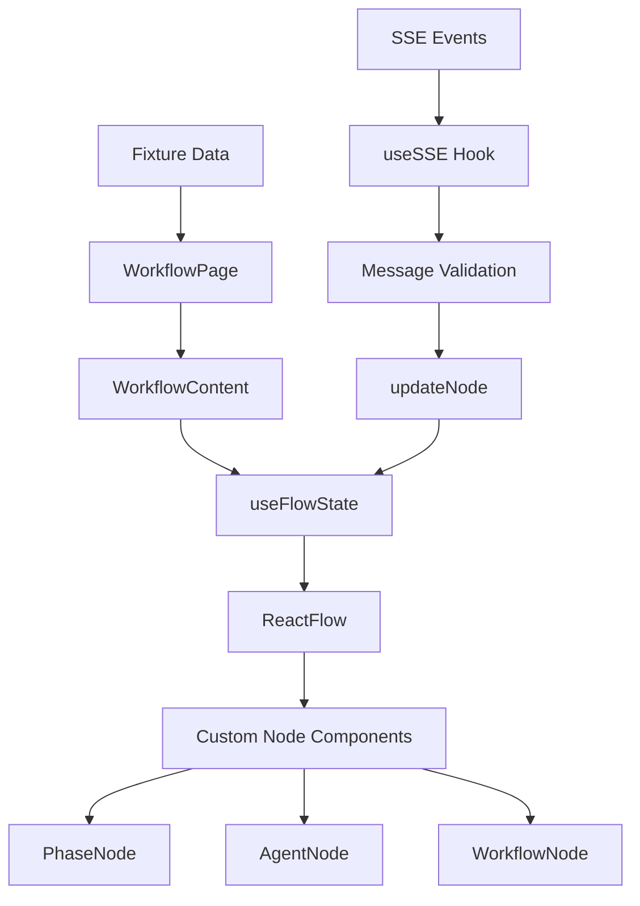

# Research Report: Workflow Execution UI Mockups

**Generated**: 2026-01-26T04:54:36.508Z
**Research Query**: "Workflow execution UI mockup - phases, runs, human input, questions, React Flow visualization"
**Mode**: Pre-Plan (011-ui-mocks)
**Location**: docs/plans/011-ui-mocks/research-dossier.md
**FlowSpace**: Available ✅
**Findings**: 55+ findings across 7 research domains

---

## Executive Summary

### What It Does

The workflow execution UI will provide a visual interface for managing and monitoring workflow executions using React Flow. Users can view all workflows, drill into runs, see phase progress in real-time, and interact with phases that require human input (questions, multiple choice).

### Business Purpose

Enable users to:
1. Monitor workflow executions visually with phase-by-phase progress
2. Answer questions and provide input when agents need human interaction
3. Browse workflow history (runs) and understand execution state
4. View workflow templates and checkpoints before execution

### Key Insights

1. **Strong Foundation Exists**: ReactFlow infrastructure (`WorkflowContent`, `PhaseNode`, `AgentNode`, SSE) already handles real-time status updates
2. **Entity Model Ready**: Plan 010 defines Workflow, Checkpoint, Run, Phase entities with `toJSON()` serialization
3. **Three View Modes Needed**: The same `WorkflowContent` component can serve template inspection, run execution, and editor modes
4. **Human Input Is Critical**: Question/Input component blocks execution - must handle `single_choice`, `multi_choice`, `free_text`, `confirm` types

### Quick Stats

- **Existing Components**: 3 node types, 3 hooks, 8 shadcn/ui components
- **New Components Needed**: ~8-10 (RunList, WorkflowList, QuestionInput, etc.)
- **Dependencies**: React Flow v12.10.0, SSE infrastructure, TSyringe DI
- **Prior Learnings**: 15 actionable discoveries from 005-web-slick
- **Complexity**: Medium (CS-3) - mostly UI composition, minimal new backend

---

## How It Currently Works

### Entry Points

| Entry Point | Type | Location | Purpose |
|------------|------|----------|---------|
| `/workflow` | Page | apps/web/app/(dashboard)/workflow/page.tsx | Demo workflow visualization |
| `/api/events/[channel]` | API Route | apps/web/app/api/events/[channel]/route.ts | SSE streaming endpoint |
| `WorkflowContent` | Component | apps/web/src/components/workflow/workflow-content.tsx | Main React Flow wrapper |

### Core Execution Flow

1. **Page loads with fixture data**:
   - `WorkflowPage` imports `DEMO_FLOW` fixture
   - Passes to `WorkflowContent` as `initialFlow`

2. **State initialized**:
   - `useFlowState(initialFlow)` creates managed state
   - Returns `nodes`, `edges`, `updateNode`, `onNodesChange`

3. **SSE connection established**:
   - `useSSE('/api/events/{channel}')` connects
   - Validates messages against `sseEventSchema` (Zod)

4. **Real-time updates processed**:
   - `workflow_status` events trigger `updateNode()`
   - Status colors change (pending→running→completed→failed)

5. **Node selection**:
   - Click triggers `onNodeClick` callback
   - `NodeDetailPanel` sheet opens with node details

### Data Flow



### State Management

- **Combined State Pattern**: Single `setFlow` for nodes + edges (prevents race conditions)
- **Atomic Updates**: `updateNode` does deep merge of `data` properties
- **No Caching**: Each navigation reads fresh from source
- **SSE Messages**: Buffered to 1000 max, auto-pruned

---

## Architecture & Design

### Component Map

```
apps/web/src/
├── components/
│   ├── workflow/
│   │   ├── workflow-content.tsx   # Main orchestrator (174 lines)
│   │   ├── workflow-node.tsx      # Standard node (59 lines)
│   │   ├── phase-node.tsx         # Phase node (61 lines)
│   │   ├── agent-node.tsx         # AI agent node (62 lines)
│   │   ├── node-detail-panel.tsx  # Selection details (112 lines)
│   │   └── index.ts               # Exports + nodeTypes
│   ├── kanban/                    # Drag-drop board (parallel pattern)
│   └── ui/                        # shadcn/ui components
├── hooks/
│   ├── useFlowState.ts            # Flow state management (168 lines)
│   ├── useSSE.ts                  # SSE connection hook (198 lines)
│   └── useBoardState.ts           # Kanban state (158 lines)
├── lib/
│   ├── sse-manager.ts             # Server-side broadcasting (140 lines)
│   └── schemas/sse-events.schema.ts # Zod event schemas (53 lines)
└── data/fixtures/
    └── flow.fixture.ts            # Demo data (121 lines)
```

### Design Patterns Identified

1. **Custom ReactFlow Node Pattern**:
   ```tsx
   function PhaseNodeComponent({ data, selected }: NodeProps<PhaseNodeType>) {
     return (
       <>
         <Handle type="target" position={Position.Top} />
         <Card className={cn(statusColors[data.status])}>
           {/* Content */}
         </Card>
         <Handle type="source" position={Position.Bottom} />
       </>
     );
   }
   export default memo(PhaseNodeComponent);
   ```

2. **NodeTypes Registration** (outside component):
   ```tsx
   const NODE_TYPES: NodeTypes = {
     workflow: WorkflowNode,
     phase: PhaseNode,
     agent: AgentNode,
   };
   ```

3. **Parameter Injection for Hooks**:
   ```tsx
   // ✅ Testable without context
   export function useSSE(url, eventSourceFactory = window.EventSource) {}
   ```

4. **SSE Singleton with HMR Survival**:
   ```tsx
   const globalForSSE = globalThis as { sseManager?: SSEManager };
   globalForSSE.sseManager ??= new SSEManager();
   ```

### System Boundaries

- **Internal**: React components, hooks, SSE manager
- **External**: Workflow entity adapters (plan 010), CLI commands
- **Integration**: DI container via `ContainerContext`

---

## Dependencies & Integration

### What This Depends On

#### External Dependencies

| Service/Library | Version | Purpose | Criticality |
|-----------------|---------|---------|-------------|
| @xyflow/react | ^12.10.0 | React Flow visualization | Critical |
| @dnd-kit/core | ^6.3.1 | Drag-drop for Kanban | Medium |
| @dnd-kit/sortable | ^10.0.0 | Sortable lists | Medium |
| zod | ^3.25.23 | Schema validation | High |
| tsyringe | ^4.8.0 | Dependency injection | High |
| lucide-react | ^0.562.0 | Icons | Low |
| next-themes | ^0.4.6 | Dark mode | Low |

#### Internal Dependencies

| Dependency | Type | Purpose | Risk if Changed |
|------------|------|---------|-----------------|
| packages/workflow | Required | Entity definitions | High - API contract |
| useFlowState | Required | State management | Medium |
| useSSE | Required | Real-time updates | Medium |
| shadcn/ui components | Required | UI primitives | Low |

### What Depends on This

For the mockup, nothing yet. After implementation:
- CLI workflow commands may link to web UI
- Agent output may display in web views

---

## Entity Model (from Plan 010)

### Workflow Entity (Unified Model)

```typescript
class Workflow {
  slug: string;                           // "hello-wf"
  workflowDir: string;                    // Absolute path
  version: string;                        // "1.0.0"
  description?: string;
  phases: ReadonlyArray<Phase>;
  
  // Source discriminators (XOR)
  isCurrent: boolean;                     // Template from current/
  checkpoint: CheckpointMetadata | null;  // Version snapshot
  run: RunMetadata | null;                // Execution instance
  
  get source(): 'current' | 'checkpoint' | 'run';
  get isTemplate(): boolean;              // isCurrent || isCheckpoint
  
  toJSON(): WorkflowJSON;
}
```

### CheckpointMetadata

```typescript
interface CheckpointMetadata {
  ordinal: number;        // 1 → v001
  hash: string;           // 8-char content hash
  createdAt: Date;
  comment?: string;
}
// Display: "v001-abc12345"
```

### RunMetadata

```typescript
interface RunMetadata {
  runId: string;          // "run-2026-01-25-001"
  runDir: string;         // Absolute path
  status: RunStatus;      // 'pending' | 'active' | 'complete' | 'failed'
  createdAt: Date;
}
```

### Phase Entity

```typescript
class Phase {
  name: string;
  phaseDir: string;
  description: string;
  order: number;
  status: PhaseRunStatus;  // 7 states (see below)
  facilitator: 'agent' | 'orchestrator';
  
  // Collections
  inputFiles: PhaseInputFile[];
  inputParameters: PhaseInputParameter[];
  inputMessages: PhaseInputMessage[];
  outputs: PhaseOutput[];
  messages: unknown[];
  
  // Computed
  get duration(): number | undefined;
  get isPending/isReady/isActive/isBlocked/isComplete/isFailed/isDone(): boolean;
  
  toJSON(): PhaseJSON;
}
```

### Status Enums

**RunStatus** (4 states):
```typescript
type RunStatus = 'pending' | 'active' | 'complete' | 'failed';
```

**PhaseRunStatus** (7 states):
```typescript
type PhaseRunStatus = 
  | 'pending'   // Not started
  | 'ready'     // Inputs satisfied
  | 'active'    // Currently executing
  | 'blocked'   // Waiting for input/dependency
  | 'accepted'  // Completed, awaiting approval
  | 'complete'  // Successfully finished
  | 'failed';   // Execution failed
```

### Status Color Mapping

| Status | Color | Hex | Icon |
|--------|-------|-----|------|
| pending | Gray | #6B7280 | ⏸️ |
| ready | Yellow | #F59E0B | ⏳ |
| active | Blue | #3B82F6 | ▶️ |
| blocked | Orange | #F97316 | 🚫 |
| accepted | Lime | #84CC16 | ✓ |
| complete | Green | #10B981 | ✅ |
| failed | Red | #EF4444 | ❌ |

---

## View Requirements Analysis

### VR-01: All Workflows View

**Purpose**: Registry browser showing all workflows with checkpoint timeline

**Data Requirements**:
- List of workflows (slug, name, version, description)
- Checkpoint count per workflow
- Latest checkpoint date
- Run count (active/total)

**UI Elements**:
- Workflow cards in grid layout
- Checkpoint badge count
- "View" and "Start Run" actions
- Filter by status/date

**New Components**: `WorkflowList`, `WorkflowCard`

---

### VR-02: Single Workflow View (Template Inspector)

**Purpose**: View workflow template with phases, no execution controls

**Modes**:
- **Current Template**: Editable (future), shows latest
- **Checkpoint**: Read-only snapshot with version badge

**Data Requirements**:
- Workflow entity (from adapter)
- Phase definitions
- Input/output schemas

**UI Elements**:
- React Flow canvas (top-to-bottom layout)
- Phase nodes with order numbers
- Detail panel on node click
- Checkpoint version selector

**Existing Components**: `WorkflowContent`, `PhaseNode`, `NodeDetailPanel`
**Modifications**: Add vertical layout, checkpoint mode

---

### VR-03: All Runs View

**Purpose**: Run history table with at-a-glance status for a specific workflow

**Data Requirements**:
- List of runs (runId, status, createdAt, currentPhase)
- Workflow context (slug, name)
- Checkpoint version per run

**UI Elements**:
- Table with columns: Run ID, Status Badge, Current Phase, Started, Duration
- Status filter chips
- Sort by date (newest first)
- Click row → drill to Single Run View
- SSE for real-time status updates

**New Components**: `RunList`, `RunRow`, `StatusBadge`, `PhaseProgress`

---

### VR-04: Single Run View (Execution Timeline)

**Purpose**: Detailed phase layout with real-time updates during execution

**Data Requirements**:
- Run entity with phases
- Phase statuses, durations
- Messages/questions pending

**UI Elements**:
- React Flow canvas (vertical top-to-bottom)
- Phase nodes with status indicators
- Current phase highlight (pulsing border)
- Phase detail panel on click
- Question/Input component when blocked
- SSE connection indicator

**Layout**: 
```
[Run Header: ID, Status, Started, Duration]
         |
    ┌────┴────┐
    │ Phase 1 │  ← complete (green)
    └────┬────┘
         |
    ┌────┴────┐
    │ Phase 2 │  ← active (blue, pulsing)
    └────┬────┘
         |
    ┌────┴────┐
    │ Phase 3 │  ← pending (gray)
    └─────────┘
```

**Existing Components**: Extend `WorkflowContent` for run mode
**New Components**: `RunHeader`, `CurrentPhaseIndicator`

---

### VR-05: Phase Detail View

**Purpose**: Reusable component showing phase details in both template and run contexts

**Data Requirements**:
- Phase entity
- Input files/parameters
- Output files/parameters
- Status history (for runs)
- Messages (for runs)

**UI Elements**:
- Status badge with timestamp
- Input/Output lists (collapsible)
- Duration display (runs only)
- Message thread (runs only)
- "Answer Question" button (if blocked)

**Existing Components**: Extend `NodeDetailPanel`

---

### VR-06: Question/Input Component (CRITICAL)

**Purpose**: Human interaction point when agent needs input

**Question Types**:
```typescript
type QuestionType = 'single_choice' | 'multi_choice' | 'free_text' | 'confirm';

interface Question {
  id: string;
  type: QuestionType;
  prompt: string;
  choices?: string[];      // For single/multi choice
  default?: string;        // Pre-filled value
  required: boolean;
}
```

**UI Elements**:
- Question prompt text
- Radio buttons (single_choice)
- Checkboxes (multi_choice)
- Text input/textarea (free_text)
- Yes/No buttons (confirm)
- Submit button
- Skip option (if not required)

**Behavior**:
- Appears when phase status is `blocked`
- Submitting sends response via API
- Phase transitions to `active` after response
- SSE broadcasts status change

**New Components**: `QuestionInput`, `ChoiceList`, `ConfirmDialog`

---

### VR-07: Workflow Editor View (View-Only Mode)

**Purpose**: Visual template editor, initially read-only

**Data Requirements**:
- Workflow entity (current template)
- Phase definitions with schemas

**UI Elements**:
- React Flow canvas (matches run view layout)
- Phase nodes (non-executable styling)
- Add/Edit/Delete controls (disabled for v1)
- Save/Publish controls (disabled for v1)

**Existing Components**: Share with VR-02 and VR-04

---

### VR-08: Checkpoint Concept Mockup

**Purpose**: Version history timeline with restore capabilities

**Data Requirements**:
- Checkpoint list (ordinal, hash, createdAt, comment)
- Current version indicator

**UI Elements**:
- Vertical timeline of checkpoints
- Version badges (v001-abc12345)
- Creation date + comment
- "View" button → opens checkpoint in VR-02
- "Start Run" button → creates run from checkpoint
- "Restore" button (future, disabled)

**New Components**: `CheckpointTimeline`, `CheckpointCard`

---

### VR-09: Shared Component Library

**Reusability Matrix**:

| Component | VR-01 | VR-02 | VR-03 | VR-04 | VR-05 | VR-06 | VR-07 | VR-08 |
|-----------|-------|-------|-------|-------|-------|-------|-------|-------|
| WorkflowContent | | ✅ | | ✅ | | | ✅ | |
| PhaseNode | | ✅ | | ✅ | | | ✅ | |
| NodeDetailPanel | | ✅ | | ✅ | ✅ | | ✅ | |
| StatusBadge | ✅ | ✅ | ✅ | ✅ | ✅ | | ✅ | ✅ |
| RunHeader | | | | ✅ | | | | |
| QuestionInput | | | | ✅ | | ✅ | | |

---

### VR-10: Real-Time Update Strategy

**SSE Channel Naming**:
- `workflow-{slug}` - Workflow-level events
- `run-{runId}` - Run-specific events
- `phase-{runId}-{phaseName}` - Phase-specific events

**Event Types Needed**:
```typescript
// Existing
type: 'workflow_status' // workflowId, phase, progress

// New for mockup
type: 'run_status'      // runId, status, currentPhase
type: 'phase_status'    // runId, phaseName, status
type: 'question'        // runId, phaseName, question object
type: 'answer'          // runId, phaseName, response
```

**Views Requiring SSE**:
- VR-03: All Runs View (run status updates)
- VR-04: Single Run View (phase progress)
- VR-06: Question Input (blocked notification)

---

## Prior Learnings (From 005-web-slick)

### 📚 PL-01: React Flow CSS Import Order Is Critical

**Source**: docs/plans/005-web-slick/reviews/fix-tasks.phase-1

**What They Found**:
> ReactFlow CSS **must** be imported before `globals.css` or Tailwind styles will override ReactFlow's internal positioning.

**Resolution**:
```tsx
// apps/web/app/layout.tsx - CORRECT ORDER
import '@xyflow/react/dist/style.css';  // ReactFlow FIRST
import './globals.css';                  // Tailwind SECOND
```

**Action for Current Work**: Verify import order in any new layout files.

---

### 📚 PL-02: Zustand Comes Free with React Flow - Don't Duplicate

**Source**: docs/plans/005-web-slick/tasks/phase-4 (DYK-02)

**What They Found**:
> React Flow v12 includes Zustand. Creating a separate store creates two sources of truth.

**Resolution**: Wrap ReactFlow's internal state via `useReactFlow()`, don't create standalone Zustand store.

**Action for Current Work**: Continue using `useFlowState` pattern, don't add Zustand.

---

### 📚 PL-03: SSE Singleton Needs globalThis for HMR Survival

**Source**: docs/plans/005-web-slick/tasks/phase-5 (DYK-01)

**What They Found**:
> Module-level singleton loses state on every Next.js hot reload.

**Resolution**:
```typescript
const globalForSSE = globalThis as { sseManager?: SSEManager };
globalForSSE.sseManager ??= new SSEManager();
export const sseManager = globalForSSE.sseManager;
```

**Action for Current Work**: Already implemented - continue pattern for any new singletons.

---

### 📚 PL-05: Next.js SSE Requires force-dynamic Export

**Source**: docs/plans/005-web-slick/tasks/phase-5 (DYK-04)

**What They Found**:
> Without `export const dynamic = 'force-dynamic'`, SSE routes break in production.

**Resolution**: Always add to SSE route files:
```typescript
export const dynamic = 'force-dynamic';
```

**Action for Current Work**: Ensure any new API routes for SSE include this export.

---

### 📚 PL-06: Update Fixture Types for Custom Nodes

**Source**: docs/plans/005-web-slick/tasks/phase-6 (DYK-06)

**What They Found**:
> Fixtures with `type: 'default'` silently use default nodes even when custom nodes exist.

**Resolution**: Update fixture data to use custom node types:
```typescript
{ id: 'phase-1', type: 'phaseNode', ... }  // Not 'default'
```

**Action for Current Work**: Create new fixtures with proper types for run/execution views.

---

### 📚 PL-08: jsdom Can't Simulate Pointer Drag - Use Keyboard

**Source**: docs/plans/005-web-slick/tasks/phase-6 (DYK-08)

**What They Found**:
> jsdom doesn't support pointer drag sequences for dnd-kit.

**Resolution**: Test keyboard navigation instead:
```typescript
fireEvent.keyDown(card, { key: ' ' });        // Space to grab
fireEvent.keyDown(card, { key: 'ArrowDown' }); // Arrow to move
fireEvent.keyDown(card, { key: ' ' });        // Space to drop
```

**Action for Current Work**: Use keyboard-based testing for any drag interactions.

---

### 📚 PL-12: Parameter Injection Over Context for Headless Hooks

**Source**: docs/plans/005-web-slick/tasks/phase-4 (DYK-01)

**What They Found**:
> Hooks using `useContainer()` internally aren't truly headless.

**Resolution**: Pass dependencies as parameters:
```typescript
// ✅ Testable without context wrapper
export function useSSE(url, eventSourceFactory = window.EventSource) {}
```

**Action for Current Work**: Follow this pattern for any new hooks.

---

### Prior Learnings Summary

| ID | Type | Key Insight | Action |
|----|------|-------------|--------|
| PL-01 | gotcha | CSS import order matters | Verify in new layouts |
| PL-02 | decision | Don't duplicate Zustand | Use useFlowState |
| PL-03 | workaround | globalThis for HMR | Pattern established |
| PL-05 | gotcha | force-dynamic for SSE | Add to new routes |
| PL-06 | gotcha | Fixture types must match | Create proper fixtures |
| PL-08 | workaround | Keyboard tests for drag | Use in test strategy |
| PL-12 | decision | Parameter injection | Follow in new hooks |

---

## Critical Discoveries

### 🚨 Critical Finding 01: Human Input Component Is MVP Critical

**Impact**: Critical
**Source**: VR-06, Entity Design
**What**: The Question/Input component blocks workflow execution when phase is `blocked`
**Why It Matters**: Without this, users cannot interact with workflows that need human input
**Required Action**: Prioritize QuestionInput component in Phase 1

---

### 🚨 Critical Finding 02: Vertical Layout Required for Run View

**Impact**: High
**Source**: IA-01, VR-04
**What**: Current WorkflowContent uses horizontal layout (left-to-right); user wants vertical (top-to-bottom)
**Why It Matters**: Matches mental model of workflow progression
**Required Action**: Add layout prop to WorkflowContent or create RunFlowContent variant

---

### 🚨 Critical Finding 03: Entity Adapters Not Yet Implemented

**Impact**: High
**Source**: ED-07, Plan 010
**What**: Entity classes exist but `workflowAdapter.listRuns()` etc. are specified but not implemented
**Why It Matters**: UI mockup needs data; may need to use fixtures or mock adapters
**Required Action**: Plan for fixture-based mockup or coordinate with Plan 010 completion

---

### 🚨 Critical Finding 04: SSE Events Need Extension

**Impact**: Medium
**Source**: DC-04, VR-10
**What**: Current SSE schema has 3 event types; mockup needs 5+
**Why It Matters**: Real-time updates for runs, phases, questions
**Required Action**: Extend sse-events.schema.ts with new event types

---

## Recommendations

### If Modifying This System

1. **Keep WorkflowContent flexible**: Add props for layout direction, mode (template/run)
2. **Extend, don't replace**: Add new node types alongside existing ones
3. **Maintain SSE patterns**: Follow globalThis singleton, force-dynamic, Zod validation

### If Extending This System

1. **Recommended approach**: Create parallel component variants (RunContent, RunList)
2. **Pattern to follow**: Parameter injection hooks, shadcn/ui composition
3. **What to avoid**: Direct Zustand stores, context-dependent hooks

### If Refactoring This System

1. **Opportunity**: Extract shared PhaseVisualization component
2. **Suggested improvement**: Create layout variants (horizontal, vertical, compact)
3. **Risk assessment**: Low - mostly additive UI work

---

## External Research Opportunities

### Research Opportunity 1: React Flow Vertical Layouts Best Practices

**Why Needed**: Current implementation is horizontal; user wants top-to-bottom
**Impact on Plan**: Affects WorkflowContent layout approach
**Source Findings**: IA-01, VR-04

**Ready-to-use prompt:**
```
/deepresearch "React Flow vertical layout patterns - best practices for rendering 
workflow/pipeline diagrams top-to-bottom instead of left-to-right. Looking for:
1. Configuration options in @xyflow/react v12 for vertical orientation
2. Edge routing considerations for vertical layouts
3. Auto-layout algorithms compatible with vertical orientation (dagre, elkjs)
4. Performance implications for large vertical graphs
5. Examples of workflow/pipeline tools using vertical React Flow layouts"
```

---

### Research Opportunity 2: Real-Time Form Input Patterns for Blocking Operations

**Why Needed**: Question/Input component blocks execution; need UX patterns
**Impact on Plan**: Affects QuestionInput component design
**Source Findings**: VR-06

**Ready-to-use prompt:**
```
/deepresearch "UX patterns for real-time blocking input forms in workflow systems -
specifically how CI/CD and workflow tools (GitHub Actions, CircleCI, Argo) handle:
1. Manual approval gates with timeouts
2. User input prompts during pipeline execution
3. Multiple choice vs free text input patterns
4. Visual indicators that execution is paused/waiting
5. Mobile-friendly input patterns for on-call scenarios"
```

---

## Appendix: File Inventory

### Core Files (Existing)

| File | Purpose | Lines |
|------|---------|-------|
| apps/web/src/components/workflow/workflow-content.tsx | Main React Flow wrapper | 174 |
| apps/web/src/components/workflow/phase-node.tsx | Phase node component | 61 |
| apps/web/src/components/workflow/agent-node.tsx | Agent node component | 62 |
| apps/web/src/components/workflow/workflow-node.tsx | Standard node component | 59 |
| apps/web/src/components/workflow/node-detail-panel.tsx | Selection detail sheet | 112 |
| apps/web/src/hooks/useFlowState.ts | Flow state management | 168 |
| apps/web/src/hooks/useSSE.ts | SSE connection hook | 198 |
| apps/web/src/lib/sse-manager.ts | Server-side SSE broadcasting | 140 |
| apps/web/src/data/fixtures/flow.fixture.ts | Demo flow data | 121 |

### New Files Needed (Proposed)

| File | Purpose |
|------|---------|
| apps/web/src/components/workflows/workflow-list.tsx | All workflows grid |
| apps/web/src/components/workflows/workflow-card.tsx | Workflow summary card |
| apps/web/src/components/runs/run-list.tsx | Run history table |
| apps/web/src/components/runs/run-row.tsx | Single run table row |
| apps/web/src/components/runs/run-header.tsx | Run detail header |
| apps/web/src/components/runs/status-badge.tsx | Status indicator |
| apps/web/src/components/phases/question-input.tsx | Human input form |
| apps/web/src/components/checkpoints/checkpoint-timeline.tsx | Version history |
| apps/web/src/data/fixtures/runs.fixture.ts | Demo run data |
| apps/web/src/data/fixtures/workflows.fixture.ts | Demo workflow list |

---

## Next Steps

1. **Optional External Research**: Run `/deepresearch` prompts above for layout and UX patterns
2. **Create Specification**: Run `/plan-1b-specify "Workflow Execution UI Mockups"` to formalize requirements
3. **Coordinate with Plan 010**: Ensure entity adapters are available or plan for fixture-based mockup

---

**Research Complete**: 2026-01-26T05:30:00Z
**Report Location**: docs/plans/011-ui-mocks/research-dossier.md
