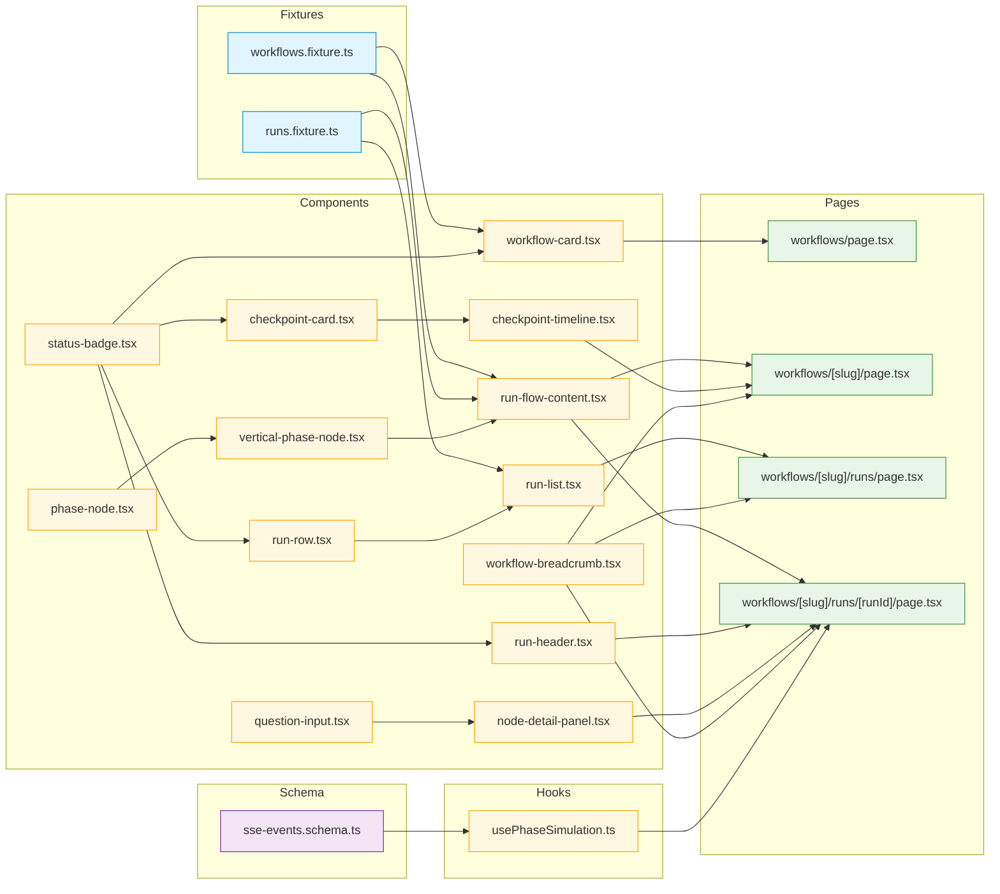
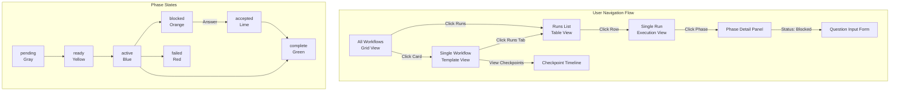
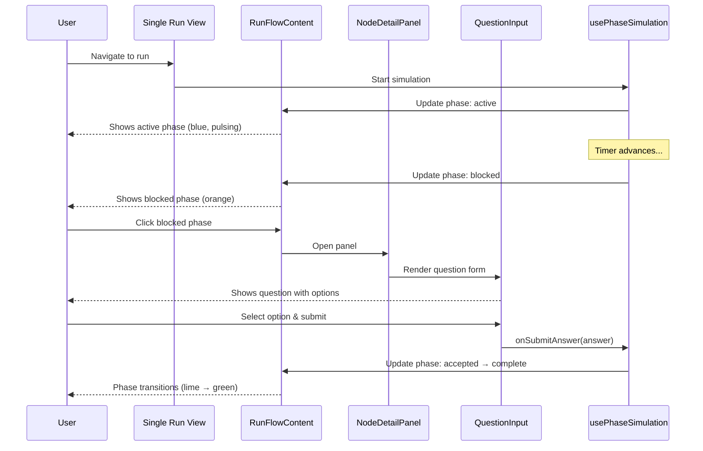

# Phase 1: Implementation – Tasks & Alignment Brief

**Spec**: [../../ui-mocks-spec.md](../../ui-mocks-spec.md)
**Plan**: [../../ui-mocks-plan.md](../../ui-mocks-plan.md)
**Date**: 2026-01-26

---

## Executive Briefing

### Purpose
This phase delivers interactive UI mockups for workflow execution visualization. Users need to visually monitor workflow runs, see phase-by-phase progress in a vertical layout, and provide input when workflows are blocked waiting for human decisions. These mockups enable rapid design iteration before production implementation.

### What We're Building
A complete workflow execution UI with:
- **All Workflows grid** showing workflow cards with status indicators and run counts
- **Vertical React Flow layout** for run execution views (phases top-to-bottom)
- **QuestionInput component** handling 4 question types (single_choice, multi_choice, free_text, confirm)
- **Run history views** with drill-down from workflow → runs → single run detail
- **Checkpoint timeline** for version history visualization

### User Value
Users can:
- Browse all workflows and see at-a-glance which have active or blocked runs
- Monitor execution progress phase-by-phase with visual status indicators
- Answer questions when workflows require human input (approvals, choices, confirmations)
- Inspect workflow templates and checkpoint history before starting new runs

### Example
**Scenario**: A workflow run hits the "Approval" phase and blocks.
- **All Workflows page**: Shows "deploy-to-prod" card with orange "Waiting" indicator
- **Single Run View**: Vertical flow shows phases 1-3 complete (green), phase 4 "Approval" blocked (orange, pulsing)
- **Clicking blocked phase**: Opens Question form "Deploy to production?" with Yes/No buttons
- **Submitting "Yes"**: Phase transitions to active (blue), run continues

---

## Objectives & Scope

### Objective
Create interactive workflow execution UI mockups per spec AC-01 through AC-25, enabling design validation before production implementation.

**Behavior Checklist**:
- [ ] Workflows display with counts and status indicators (AC-01)
- [ ] Runs sorted by creation date, newest first (AC-04)
- [ ] Vertical phase layout with correct flow direction (AC-08)
- [ ] Active phase has pulse animation (AC-10)
- [ ] Blocked phase shows "Needs Input" with question form (AC-13, AC-14)
- [ ] All 4 question types render correctly (AC-15–AC-18)
- [ ] Breadcrumb navigation works (AC-24, AC-25)

### Goals

- ✅ Create fixture data with factory functions for workflows, runs, checkpoints
- ✅ Extend status color system to 7 states (pending, ready, active, blocked, accepted, complete, failed)
- ✅ Build VerticalPhaseNode with top/bottom handles for vertical layout
- ✅ Build RunFlowContent for vertical run visualization with Dagre auto-layout
- ✅ Create WorkflowCard, RunRow, RunList components for list views
- ✅ Create QuestionInput supporting single_choice, multi_choice, free_text, confirm
- ✅ Create pages: All Workflows, Single Workflow, All Runs, Single Run
- ✅ Add checkpoint timeline visualization
- ✅ Add breadcrumb navigation
- ✅ Extend SSE schema with run/phase/question event types
- ✅ Create phase progression simulation for demo

### Non-Goals (Scope Boundaries)

- ❌ **Backend integration** – All data from fixtures, no adapters (deferred to post-Plan-010)
- ❌ **Workflow editing** – View-only mockup; create/edit/delete deferred
- ❌ **Run execution controls** – No start/stop/pause/resume (deferred)
- ❌ **Authentication** – No user-specific access controls
- ❌ **Mobile optimization** – Desktop-first; responsive deferred
- ❌ **Performance optimization** – Focus on UX validation, not large datasets
- ❌ **State persistence** – Session-only; resets on refresh
- ❌ **Checkpoint restore** – View-only; restore action deferred
- ❌ **Additional question types** – Only 4 core types; expand in future plan

---

## Architecture Map

### Component Diagram

```mermaid
flowchart TD
    classDef pending fill:#9E9E9E,stroke:#757575,color:#fff
    classDef inprogress fill:#FF9800,stroke:#F57C00,color:#fff
    classDef completed fill:#4CAF50,stroke:#388E3C,color:#fff
    classDef blocked fill:#F44336,stroke:#D32F2F,color:#fff

    style Setup fill:#E3F2FD,stroke:#1976D2
    style Core fill:#FFF3E0,stroke:#F57C00
    style Pages fill:#E8F5E9,stroke:#388E3C
    style Test fill:#FCE4EC,stroke:#C2185B

    subgraph Setup["Setup & Fixtures"]
        T001["T001: Workflow/Run fixtures"]:::inprogress
        T021["T021: SSE schema extensions"]:::pending
    end

    subgraph Core["Core Components"]
        T002["T002: Extend status colors"]:::pending
        T003["T003: VerticalPhaseNode"]:::pending
        T004["T004: RunFlowContent"]:::pending
        T005["T005: StatusBadge"]:::pending
        T006["T006: WorkflowCard"]:::pending
        T008["T008: RunRow"]:::pending
        T009["T009: RunList"]:::pending
        T012["T012: QuestionInput"]:::pending
        T013["T013: QuestionInput integration"]:::pending
        T015["T015: RunHeader"]:::pending
        T016["T016: CheckpointCard"]:::pending
        T017["T017: CheckpointTimeline"]:::pending
        T019["T019: Breadcrumb"]:::pending
        T022["T022: Phase simulation"]:::pending
        T023["T023: Pulse animation"]:::pending
    end

    subgraph Pages["Pages"]
        T007["T007: All Workflows page"]:::pending
        T010["T010: Single Workflow page"]:::pending
        T011["T011: Runs page"]:::pending
        T014["T014: Single Run page"]:::pending
        T018["T018: Checkpoint timeline integration"]:::pending
        T020["T020: Breadcrumbs integration"]:::pending
    end

    subgraph Test["Testing"]
        T024["T024: Component render tests"]:::pending
    end

    %% Dependencies
    T001 --> T004
    T001 --> T006
    T001 --> T022
    T002 --> T003
    T002 --> T005
    T003 --> T004
    T003 --> T023
    T005 --> T006
    T005 --> T008
    T005 --> T015
    T005 --> T016
    T006 --> T007
    T008 --> T009
    T009 --> T011
    T004 --> T010
    T004 --> T014
    T012 --> T013
    T013 --> T014
    T015 --> T014
    T016 --> T017
    T017 --> T018
    T010 --> T018
    T019 --> T020
    T007 --> T024
    T009 --> T024
    T012 --> T024
    T014 --> T024
    T021 --> T022
```

<!-- Status: grey=pending, orange=in-progress, green=completed, red=blocked -->
<!-- Updated by plan-6 during implementation -->



### File Dependency Map



### Task-to-Component Mapping

<!-- Status: ⬜ Pending | 🟧 In Progress | ✅ Complete | 🔴 Blocked -->

| Task | Component(s) | Files | Status | Comment |
|------|-------------|-------|--------|---------|
| T001 | Fixtures | workflows.fixture.ts, runs.fixture.ts | 🟧 In Progress | Factory functions for workflow/run/checkpoint data |
| T002 | PhaseNode | phase-node.tsx | ⬜ Pending | Extend statusColors to 7 states |
| T003 | VerticalPhaseNode | vertical-phase-node.tsx | ⬜ Pending | New node with Top/Bottom handles |
| T004 | RunFlowContent | run-flow-content.tsx | ⬜ Pending | Vertical React Flow wrapper with Dagre |
| T005 | StatusBadge | status-badge.tsx | ⬜ Pending | Shared status indicator component |
| T006 | WorkflowCard | workflow-card.tsx | ⬜ Pending | Grid card for All Workflows |
| T007 | WorkflowList | workflows/page.tsx | ⬜ Pending | All Workflows grid page |
| T008 | RunRow | run-row.tsx | ⬜ Pending | Table row for runs list |
| T009 | RunList | run-list.tsx | ⬜ Pending | Table component for runs |
| T010 | SingleWorkflowView | workflows/[slug]/page.tsx | ⬜ Pending | Workflow template inspector |
| T011 | RunsPage | workflows/[slug]/runs/page.tsx | ⬜ Pending | All Runs for workflow |
| T012 | QuestionInput | question-input.tsx | ⬜ Pending | 4 question types (single, multi, text, confirm) |
| T013 | NodeDetailPanel | node-detail-panel.tsx | ⬜ Pending | Integrate QuestionInput |
| T014 | SingleRunView | workflows/[slug]/runs/[runId]/page.tsx | ⬜ Pending | Run execution timeline |
| T015 | RunHeader | run-header.tsx | ⬜ Pending | Run status summary |
| T016 | CheckpointCard | checkpoint-card.tsx | ⬜ Pending | Version badge display |
| T017 | CheckpointTimeline | checkpoint-timeline.tsx | ⬜ Pending | Vertical checkpoint list |
| T018 | Checkpoint Integration | workflows/[slug]/page.tsx | ⬜ Pending | Add timeline to workflow view |
| T019 | WorkflowBreadcrumb | workflow-breadcrumb.tsx | ⬜ Pending | Navigation breadcrumbs |
| T020 | Breadcrumb Integration | Multiple pages | ⬜ Pending | Add to all detail pages |
| T021 | SSE Schema | sse-events.schema.ts | ⬜ Pending | Add run_status, phase_status, question events |
| T022 | PhaseSimulation | usePhaseSimulation.ts | ⬜ Pending | Timer-based phase progression |
| T023 | PulseAnimation | vertical-phase-node.tsx | ⬜ Pending | Active phase visual highlight |
| T024 | RenderTests | workflow-views.test.tsx | ⬜ Pending | Lightweight component smoke tests |

---

## Tasks

| Status | ID | Task | CS | Type | Dependencies | Absolute Path(s) | Validation | Subtasks | Notes |
|--------|-----|------|----|------|--------------|------------------|------------|----------|-------|
| [~] | T001 | Create workflow/run/checkpoint fixture data with factory functions | 2 | Setup | – | /home/jak/substrate/007-manage-workflows/apps/web/src/data/fixtures/workflows.fixture.ts, /home/jak/substrate/007-manage-workflows/apps/web/src/data/fixtures/runs.fixture.ts | Fixtures compile; match WorkflowJSON/PhaseJSON types from Plan 010 | – | Factory pattern: createMockWorkflow(), createMockRun(), createMockCheckpoint() |
| [ ] | T002 | Extend status color map to 7 states (add ready, blocked, accepted) | 1 | Core | – | /home/jak/substrate/007-manage-workflows/apps/web/src/components/workflow/phase-node.tsx | All 7 colors render; no TypeScript errors | – | Add #F59E0B (ready/amber), #F97316 (blocked/orange), #84CC16 (accepted/lime) |
| [ ] | T003 | Create VerticalPhaseNode with Top/Bottom handles | 2 | Core | T002 | /home/jak/substrate/007-manage-workflows/apps/web/src/components/workflow/vertical-phase-node.tsx | Node renders with Position.Top target, Position.Bottom source | – | Per Critical Finding 06; use React.memo |
| [ ] | T004 | Create RunFlowContent component for vertical run visualization | 3 | Core | T001, T003 | /home/jak/substrate/007-manage-workflows/apps/web/src/components/runs/run-flow-content.tsx | Vertical layout renders phases top-to-bottom; smoothstep edges | – | Per Critical Finding 02; Dagre TB layout; include fitView |
| [ ] | T005 | Create StatusBadge component (7 status states) | 1 | Core | T002 | /home/jak/substrate/007-manage-workflows/apps/web/src/components/ui/status-badge.tsx | All status variants render with correct color/icon | – | Shared across WorkflowCard, RunRow, PhaseNode, CheckpointCard |
| [ ] | T006 | Create WorkflowCard component for All Workflows grid | 2 | Core | T001, T005 | /home/jak/substrate/007-manage-workflows/apps/web/src/components/workflows/workflow-card.tsx | Card displays slug, description, counts, status indicator per AC-01 | – | Show checkpoint count, run count, active run count, waiting indicator |
| [ ] | T007 | Create WorkflowList page (All Workflows grid) | 2 | Core | T006 | /home/jak/substrate/007-manage-workflows/apps/web/app/(dashboard)/workflows/page.tsx | Grid of workflow cards renders from fixtures | – | CSS grid layout; newest workflows first; per AC-01 |
| [ ] | T008 | Create RunRow component for runs table | 2 | Core | T005 | /home/jak/substrate/007-manage-workflows/apps/web/src/components/runs/run-row.tsx | Row shows run ID, status badge, current phase, timing per AC-05 | – | Clickable; navigates to single run view |
| [ ] | T009 | Create RunList component (All Runs for a workflow) | 2 | Core | T008 | /home/jak/substrate/007-manage-workflows/apps/web/src/components/runs/run-list.tsx | Table sorted by createdAt desc per AC-04 | – | Include workflow context header |
| [ ] | T010 | Create Single Workflow View page (template inspector) | 2 | Core | T001, T004 | /home/jak/substrate/007-manage-workflows/apps/web/app/(dashboard)/workflows/[slug]/page.tsx | Displays workflow phases in vertical layout, no run status per AC-20 | – | Reuse RunFlowContent in template mode (status neutral) |
| [ ] | T011 | Create Runs page for a workflow | 2 | Core | T009 | /home/jak/substrate/007-manage-workflows/apps/web/app/(dashboard)/workflows/[slug]/runs/page.tsx | Shows RunList filtered by workflow slug | – | Link from WorkflowCard "Runs" action |
| [ ] | T012 | Create QuestionInput component (4 question types) | 3 | Core | – | /home/jak/substrate/007-manage-workflows/apps/web/src/components/phases/question-input.tsx | Renders: radio (single_choice), checkboxes (multi_choice), textarea (free_text), Yes/No (confirm) | – | Per Critical Finding 01; modal dialog; never disable submit (accessibility) |
| [ ] | T013 | Integrate QuestionInput into NodeDetailPanel | 2 | Core | T012 | /home/jak/substrate/007-manage-workflows/apps/web/src/components/workflow/node-detail-panel.tsx | Question form appears when phase.status === 'blocked' per AC-14 | – | Conditional render; add onSubmitAnswer callback |
| [ ] | T014 | Create Single Run View page (execution timeline) | 3 | Core | T004, T013 | /home/jak/substrate/007-manage-workflows/apps/web/app/(dashboard)/workflows/[slug]/runs/[runId]/page.tsx | Vertical phase flow with active highlight, question input on blocked per AC-08 | – | RunFlowContent + RunHeader + NodeDetailPanel + usePhaseSimulation |
| [ ] | T015 | Create RunHeader component (run status summary) | 1 | Core | T005 | /home/jak/substrate/007-manage-workflows/apps/web/src/components/runs/run-header.tsx | Shows Run ID, status badge, started time, duration | – | At top of Single Run View |
| [ ] | T016 | Create CheckpointCard component | 1 | Core | T005 | /home/jak/substrate/007-manage-workflows/apps/web/src/components/checkpoints/checkpoint-card.tsx | Displays version badge (v001-abc12345), date, comment per AC-03 | – | For checkpoint timeline |
| [ ] | T017 | Create CheckpointTimeline component | 2 | Core | T016 | /home/jak/substrate/007-manage-workflows/apps/web/src/components/checkpoints/checkpoint-timeline.tsx | Vertical timeline with View/Start Run actions | – | View-only for mockup (no restore action) |
| [ ] | T018 | Add checkpoint timeline to Single Workflow View | 1 | Core | T010, T017 | /home/jak/substrate/007-manage-workflows/apps/web/app/(dashboard)/workflows/[slug]/page.tsx | Timeline renders alongside/below phase view | – | Consider tab or sidebar layout |
| [ ] | T019 | Create breadcrumb navigation component | 1 | Core | – | /home/jak/substrate/007-manage-workflows/apps/web/src/components/ui/workflow-breadcrumb.tsx | Shows: Workflows > [Workflow Name] > Runs > [Run ID] | – | Use shadcn Breadcrumb if available; context-aware |
| [ ] | T020 | Add breadcrumbs to all workflow/run pages | 1 | Core | T019 | /home/jak/substrate/007-manage-workflows/apps/web/app/(dashboard)/workflows/[slug]/page.tsx, /home/jak/substrate/007-manage-workflows/apps/web/app/(dashboard)/workflows/[slug]/runs/page.tsx, /home/jak/substrate/007-manage-workflows/apps/web/app/(dashboard)/workflows/[slug]/runs/[runId]/page.tsx | Breadcrumbs visible and clickable per AC-24, AC-25 | – | All detail views |
| [ ] | T021 | Extend SSE schema with run/phase/question event types | 2 | Core | – | /home/jak/substrate/007-manage-workflows/apps/web/src/lib/schemas/sse-events.schema.ts | Schema validates new event types without breaking existing | – | Per Critical Finding 04; add run_status, phase_status, question, answer members |
| [ ] | T022 | Create timer-based phase progression simulation | 2 | Core | T001, T021 | /home/jak/substrate/007-manage-workflows/apps/web/src/hooks/usePhaseSimulation.ts | Phases transition: pending→ready→active→complete with configurable timing | – | Per Critical Finding 12; setInterval-based; triggers on Single Run mount |
| [ ] | T023 | Add pulse animation for active phase nodes | 1 | Core | T003 | /home/jak/substrate/007-manage-workflows/apps/web/src/components/workflow/vertical-phase-node.tsx | Active phase has visible pulsing border/glow per AC-10 | – | CSS animation or Tailwind animate-pulse variant |
| [ ] | T024 | Test: Core component rendering validation | 1 | Test | T006, T009, T012, T014 | /home/jak/substrate/007-manage-workflows/test/ui/workflow-views.test.tsx | WorkflowCard, RunList, QuestionInput, RunFlowContent render without errors | – | Lightweight: render smoke tests only per spec Testing Strategy |

**Task Count**: 24 tasks
**Total Complexity**: CS-42 (sum) → average CS-1.75 per task

---

## Alignment Brief

### Prior Phases Review

**N/A** – This is Phase 1 (single-phase Simple Mode plan). No prior phases exist.

### Critical Findings Affecting This Phase

From plan § 3 Critical Research Findings:

| # | Finding | Impact | Tasks Affected |
|---|---------|--------|----------------|
| 01 | Human Input component blocks workflow execution; no unblock path exists | Must implement QuestionInput as priority | T012, T013, T014 |
| 02 | Vertical layout requires new component; WorkflowContent not configurable | Create RunFlowContent with Dagre TB | T004 |
| 03 | Entity adapters not implemented; fixtures must match Plan 010 shape | Use factory functions for flexibility | T001 |
| 04 | SSE schema needs 4+ new event types | Extend sse-events.schema.ts | T021 |
| 05 | CSS import order: ReactFlow before Tailwind | Verify in all new page layouts | T007, T010, T011, T014 |
| 06 | PhaseNode uses Left/Right handles; vertical needs Top/Bottom | Create VerticalPhaseNode | T003 |
| 07 | NodeDetailPanel can extend for Question form | Add QuestionForm child component | T013 |
| 08 | Status colors exist (4 states); need 3 more | Extend statusColors map | T002, T005 |
| 09 | nodeTypes must be memoized outside component | Keep NODE_TYPES pattern | T004 |
| 10 | useFlowState works; no new state library needed | Reuse for vertical layouts | T004 |
| 11 | Shared Card pattern in KanbanCard | Use shadcn Card + border indicator | T006, T008, T016 |
| 12 | Timer-based simulation sufficient for mockup | Use setInterval for demo | T022 |

### ADR Decision Constraints

**ADR Seeds Identified** (from spec, not yet formalized):

| ADR Seed | Decision Drivers | Tasks Affected |
|----------|------------------|----------------|
| ADR-011-01 | Vertical layout: New RunFlowContent vs Props on WorkflowContent | T003, T004 |
| ADR-011-02 | Fixture strategy: Match entity types vs mockup-specific | T001 |
| ADR-011-03 | QuestionInput: Single component vs separate per type | T012 |

**Decision**: Use **new components** (RunFlowContent, VerticalPhaseNode) rather than modifying existing. This preserves horizontal layout for future use and enables mockup-specific optimizations.

### Invariants & Guardrails

| Type | Constraint | Enforcement |
|------|-----------|-------------|
| CSS Import Order | ReactFlow CSS before Tailwind | Comment guard in each new page layout |
| Node Type Memoization | NODE_TYPES outside component | Code review checklist |
| Fixture Shape | Match Plan 010 WorkflowJSON types | Factory functions with TypeScript |
| Accessibility | Never disable submit buttons | QuestionInput implementation |
| Status Colors | 7 states consistent across components | Shared STATUS_COLORS constant |

### Inputs to Read

**Files to review before implementation:**

| Purpose | Path |
|---------|------|
| Existing PhaseNode pattern | /home/jak/substrate/007-manage-workflows/apps/web/src/components/workflow/phase-node.tsx |
| Existing WorkflowContent pattern | /home/jak/substrate/007-manage-workflows/apps/web/src/components/workflow/workflow-content.tsx |
| Existing fixture pattern | /home/jak/substrate/007-manage-workflows/apps/web/src/data/fixtures/flow.fixture.ts |
| NodeDetailPanel extension point | /home/jak/substrate/007-manage-workflows/apps/web/src/components/workflow/node-detail-panel.tsx |
| useFlowState hook | /home/jak/substrate/007-manage-workflows/apps/web/src/hooks/useFlowState.ts |
| SSE schema structure | /home/jak/substrate/007-manage-workflows/apps/web/src/lib/schemas/sse-events.schema.ts |
| shadcn Card component | /home/jak/substrate/007-manage-workflows/apps/web/src/components/ui/card.tsx |
| External research: Vertical layout | /home/jak/substrate/007-manage-workflows/docs/plans/011-ui-mocks/external-research/react-flow-vertical-layouts.md |
| External research: Blocking UX | /home/jak/substrate/007-manage-workflows/docs/plans/011-ui-mocks/external-research/blocking-input-ux-patterns.md |

### Visual Alignment Aids

#### System Flow Diagram



#### Sequence Diagram: Question Answering Flow



### Test Plan

**Approach**: Lightweight (per spec Testing Strategy)
**Rationale**: Mockup for rapid design iteration; visual validation is primary

| Test ID | Component(s) | Test Description | Expected Result | Priority |
|---------|-------------|------------------|-----------------|----------|
| TEST-01 | WorkflowCard | Renders with all props | Card displays slug, counts, status | High |
| TEST-02 | RunList | Renders with runs array | Table rows appear in descending order | High |
| TEST-03 | QuestionInput (single_choice) | Renders radio buttons | Radio buttons visible with labels | High |
| TEST-04 | QuestionInput (multi_choice) | Renders checkboxes | Checkboxes visible with labels | High |
| TEST-05 | QuestionInput (free_text) | Renders textarea | Textarea visible with prompt | High |
| TEST-06 | QuestionInput (confirm) | Renders Yes/No buttons | Two buttons visible | High |
| TEST-07 | RunFlowContent | Renders vertical layout | Nodes arranged top-to-bottom | Medium |
| TEST-08 | StatusBadge | Renders all 7 states | Correct colors for each status | Medium |
| TEST-09 | VerticalPhaseNode | Has correct handles | Top target, bottom source handles | Medium |
| TEST-10 | CheckpointTimeline | Renders checkpoint list | Cards in chronological order | Low |

**Fixture Requirements**:
- Use factory functions from T001
- No vi.mock() usage (per spec: fixture-based)

### Step-by-Step Implementation Outline

**Recommended order** (respecting dependencies):

1. **Foundation (T001, T002, T021)** – Fixtures, extended status colors, SSE schema
2. **Shared Components (T005, T019)** – StatusBadge, Breadcrumb
3. **Vertical Node (T003, T023)** – VerticalPhaseNode with animation
4. **Vertical Layout (T004)** – RunFlowContent with Dagre
5. **Card/Row Components (T006, T008, T016)** – WorkflowCard, RunRow, CheckpointCard
6. **List Components (T009, T017)** – RunList, CheckpointTimeline
7. **Question Input (T012, T013)** – QuestionInput + integration
8. **Pages in order**:
   - T007: All Workflows page
   - T010: Single Workflow page
   - T018: Add checkpoints to T010
   - T011: Runs page
   - T014: Single Run page
   - T020: Add breadcrumbs to all pages
9. **Simulation (T022)** – Phase progression hook
10. **Tests (T024)** – Render validation

### Commands to Run

```bash
# Navigate to web app
cd /home/jak/substrate/007-manage-workflows/apps/web

# Install dependencies (if needed)
pnpm install

# Type check
pnpm tsc --noEmit

# Run linter
pnpm lint

# Run tests (after T024)
pnpm test test/ui/workflow-views.test.tsx

# Start dev server (for visual validation)
pnpm dev

# Full build check
pnpm build
```

### Risks & Unknowns

| Risk | Severity | Likelihood | Mitigation |
|------|----------|------------|------------|
| Plan 010 entity types shift | Medium | Medium | Factory functions abstract shape; single update point |
| Dagre layout positioning issues | Medium | Medium | External research provides TB config; fallback to manual positions |
| Question component scope creep | Low | Low | Strict 4-type limit; reject additional types |
| CSS import order regression | Medium | Low | Add comment guards; verify in each new page |
| ReactFlow v12 API changes | Low | Low | Pin version; follow measured dimensions pattern |
| Fixture data volume affects perf | Low | Low | Mockup; small datasets sufficient for validation |

### Ready Check

- [x] Spec reviewed (ui-mocks-spec.md)
- [x] Plan reviewed (ui-mocks-plan.md)
- [x] Critical Findings mapped to tasks (see table above)
- [x] ADR constraints mapped to tasks – N/A (ADR seeds only, not formalized)
- [x] External research reviewed (vertical layouts, blocking UX)
- [x] Existing component patterns reviewed (PhaseNode, WorkflowContent, NodeDetailPanel)
- [x] File paths verified (all absolute paths)
- [x] Dependencies analyzed (24 tasks, clear dependency graph)
- [ ] **Awaiting GO/NO-GO from human sponsor**

---

## Phase Footnote Stubs

_To be populated during implementation by plan-6._

| # | Task | Description | Link |
|---|------|-------------|------|
| | | | |

---

## Evidence Artifacts

**Execution Log**: `./execution.log.md` (created by plan-6)

**Supporting Files** (as needed):
- Screenshots of implemented views
- Performance measurements (if concerns arise)
- Code snippets for complex patterns

---

## Discoveries & Learnings

_Populated during implementation by plan-6. Log anything of interest to your future self._

| Date | Task | Type | Discovery | Resolution | References |
|------|------|------|-----------|------------|------------|
| | | | | | |

**Types**: `gotcha` | `research-needed` | `unexpected-behavior` | `workaround` | `decision` | `debt` | `insight`

**What to log**:
- Things that didn't work as expected
- External research that was required
- Implementation troubles and how they were resolved
- Gotchas and edge cases discovered
- Decisions made during implementation
- Technical debt introduced (and why)
- Insights that future phases should know about

_See also: `execution.log.md` for detailed narrative._

---

## Directory Structure

```
docs/plans/011-ui-mocks/
├── research-dossier.md
├── ui-mocks-spec.md
├── ui-mocks-plan.md
├── external-research/
│   ├── react-flow-vertical-layouts.md
│   └── blocking-input-ux-patterns.md
└── tasks/phase-1-implementation/
    ├── tasks.md                    # This file
    └── execution.log.md            # Created by /plan-6
```

---

**STOP**: Do not edit code. Awaiting human **GO** to proceed with implementation via `/plan-6-implement-phase`.
