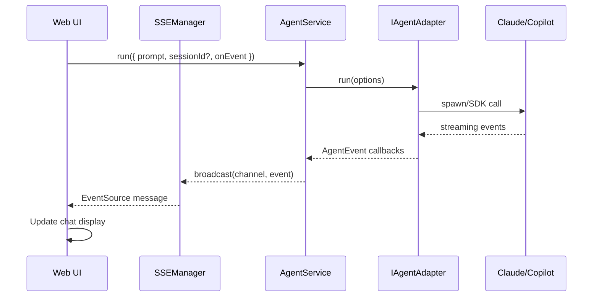

# Research Report: Multi-Agent Web UI

**Generated**: 2026-01-26T14:32:00Z
**Research Query**: "Multi-agent web UI: SSE updates, markdown rendering, agent input/output, stop agent, slash commands, session resume, multiple concurrent sessions with easy switching, visual indicators for agents waiting input, create new agent (+button with claude/copilot dropdown and naming), persist sessions across reloads, archive closed sessions"
**Mode**: Plan-Associated
**Location**: `docs/plans/012-web-agents/research-dossier.md`
**FlowSpace**: Available
**Findings**: 65+ findings from 7 subagents

---

## Executive Summary

### What It Does
The codebase has a **mature agent adapter infrastructure** (`IAgentAdapter` with Claude Code and Copilot SDK implementations), **SSE streaming infrastructure** (singleton manager, React hook, channel-based broadcasting), and **workflow phase visualization** (React Flow with vertical layout). However, there is **no multi-agent chat UI** currently implemented - the web app uses fixtures for demo purposes.

### Business Purpose
Enable users to run multiple AI coding agents (Claude, Copilot) concurrently in a web interface, with real-time streaming, session persistence, and easy switching between active sessions - similar to having multiple terminal tabs but with rich UI.

### Key Insights
1. **Agent adapters exist and are production-ready** - `ClaudeCodeAdapter` (CLI/NDJSON) and `SdkCopilotAdapter` (SDK events) with unified `AgentEvent` streaming
2. **SSE infrastructure is complete** - `SSEManager` singleton, `useSSE` hook with reconnection, Zod-validated event schemas
3. **No chat UI exists** - Must build from scratch: session list, chat view, input handling, markdown rendering
4. **Session persistence is agent-side** - Adapters pass `sessionId` for resume; no database persistence layer yet

### Quick Stats
| Metric | Value |
|--------|-------|
| **Agent Adapters** | 2 (Claude Code, Copilot SDK) |
| **SSE Event Types** | 7 (workflow_status, phase_status, question, answer, etc.) |
| **Agent Event Types** | 5 (text_delta, message, usage, session_*, raw) |
| **Test Coverage** | 80%+ (116 test files, contract tests) |
| **Prior Learnings** | 15 relevant discoveries |
| **Chat UI Components** | 0 (must build) |

---

## How It Currently Works

### Entry Points

| Entry Point | Type | Location | Purpose |
|-------------|------|----------|---------|
| `AgentService.run()` | Service | `packages/shared/src/services/agent.service.ts:42` | Execute agent prompts |
| `AgentService.compact()` | Service | `packages/shared/src/services/agent.service.ts:67` | Send /compact command |
| `AgentService.terminate()` | Service | `packages/shared/src/services/agent.service.ts:78` | Stop agent session |
| `GET /api/events/[channel]` | API Route | `apps/web/app/api/events/[channel]/route.ts` | SSE streaming endpoint |
| `useSSE` hook | Client Hook | `apps/web/src/hooks/useSSE.ts` | React SSE subscription |

### Core Execution Flow



### Agent Adapter Pattern

**Interface**: `IAgentAdapter` (`packages/shared/src/interfaces/agent-adapter.interface.ts`)
```typescript
interface IAgentAdapter {
  run(options: AgentRunOptions): Promise<AgentResult>;
  compact(sessionId: string): Promise<AgentResult>;
  terminate(sessionId: string): Promise<AgentResult>;
}
```

**Implementations**:
1. **ClaudeCodeAdapter**: Spawns `claude` CLI with `--output-format stream-json`, parses NDJSON stdout
2. **SdkCopilotAdapter**: Uses `@github/copilot-sdk`, subscribes to `session.on()` events

**Event Translation**: Both adapters normalize to unified `AgentEvent` types:
- `text_delta` - Streaming content chunks
- `message` - Complete messages
- `usage` - Token metrics (Claude only, Copilot returns `null`)
- `session_start/idle/error` - Lifecycle events

### SSE Infrastructure

**Server** (`apps/web/src/lib/sse-manager.ts`):
```typescript
// Singleton with HMR survival
const globalForSSE = globalThis as typeof globalThis & { sseManager?: SSEManager };
export const sseManager = globalForSSE.sseManager ??= new SSEManager();

// Channel-based broadcasting
sseManager.broadcast(channelId, 'agent_event', { type: 'text_delta', content: '...' });
```

**Client** (`apps/web/src/hooks/useSSE.ts`):
```typescript
const { messages, isConnected, error } = useSSE<AgentEvent>(
  `/api/events/agent-${sessionId}`,
  undefined,
  { messageSchema: agentEventSchema }  // Zod validation
);
```

---

## Architecture & Design

### Component Map (Existing)

```
packages/shared/
├── adapters/
│   ├── claude-code.adapter.ts    # CLI-based, NDJSON streaming
│   └── sdk-copilot-adapter.ts    # SDK-based, event-driven
├── interfaces/
│   ├── agent-adapter.interface.ts # IAgentAdapter contract
│   └── agent-types.ts             # AgentEvent, AgentResult types
└── services/
    └── agent.service.ts           # Orchestration, timeout, session tracking

apps/web/
├── app/api/events/[channel]/route.ts  # SSE endpoint
├── src/lib/
│   ├── sse-manager.ts                  # Singleton manager
│   ├── di-container.ts                 # DI with adapter factory
│   └── schemas/sse-events.schema.ts    # Zod event schemas
└── src/hooks/
    └── useSSE.ts                       # React SSE hook
```

### Component Map (To Build)

```
apps/web/src/
├── app/(dashboard)/agents/
│   ├── page.tsx                    # Agent sessions list
│   └── [sessionId]/page.tsx        # Individual chat view
├── components/agents/
│   ├── AgentSessionList.tsx        # Sidebar with all sessions
│   ├── AgentSessionCard.tsx        # Session preview card
│   ├── AgentChatView.tsx           # Main chat interface
│   ├── AgentMessageList.tsx        # Message history
│   ├── AgentMessage.tsx            # Single message (markdown)
│   ├── AgentInput.tsx              # Text input with commands
│   ├── AgentStatusIndicator.tsx    # Waiting/running/idle status
│   └── NewAgentDialog.tsx          # Create agent modal
├── hooks/
│   ├── useAgentSession.ts          # Session state management
│   ├── useAgentSessions.ts         # Multi-session orchestration
│   └── useAgentMessages.ts         # Message history
└── lib/
    ├── agent-session-store.ts      # localStorage persistence
    └── schemas/agent-session.schema.ts  # Session data schemas
```

### Design Patterns Identified

| Pattern | Where Used | Purpose |
|---------|------------|---------|
| **Adapter** | ClaudeCodeAdapter, SdkCopilotAdapter | Normalize different agent protocols |
| **Factory** | AdapterFactory in DI | Runtime agent type selection |
| **Singleton (HMR-safe)** | SSEManager | Connection pool survival |
| **Discriminated Union** | AgentEvent, SSE schemas | Type-safe event handling |
| **Headless Hook** | useSSE, useBoardState | Logic/UI separation |
| **Fakes over Mocks** | FakeAgentAdapter, FakeEventSource | Testability |

---

## Dependencies & Integration

### What This Depends On

#### Internal Dependencies
| Dependency | Type | Purpose |
|------------|------|---------|
| `@chainglass/shared` | Required | Agent adapters, DI, config |
| SSEManager | Required | Event broadcasting |
| DI Container | Required | Adapter factory resolution |

#### External Dependencies
| Package | Version | Purpose |
|---------|---------|---------|
| `@github/copilot-sdk` | 0.1.16 | Copilot agent integration |
| `react-markdown` | 10.1.0 | Markdown rendering |
| `remark-gfm` | 4.0.1 | GitHub-flavored markdown |
| `mermaid` | 11.12.2 | Diagram rendering |
| `@xyflow/react` | 12.10.0 | Flow visualization (if needed) |

### What Will Depend on This
- Workflow phase execution (agent as executor)
- MCP server (agent tools)
- Future: Team collaboration features

---

## Quality & Testing

### Current Test Coverage
| Area | Coverage | Status |
|------|----------|--------|
| Agent Adapters | 80%+ | Contract tests |
| SSE Infrastructure | 11 tests | Known bugs |
| Session Management | 10+ tests | Good |
| Chat UI Components | 0 | Must build |

### Known Issues

| Issue | Severity | Location |
|-------|----------|----------|
| SSE memory leak (heartbeat cleanup) | Critical | `sse-manager.ts` |
| Event type injection (unsanitized) | High | `sse-manager.ts` |
| Copilot SDK: no token metrics | Medium | SDK limitation |
| Integration tests skipped (auth) | Low | CI limitation |

---

## Prior Learnings (From Previous Implementations)

### PL-01: SSE Singleton Must Survive HMR
**Source**: Plan 005 Phase 5
**Type**: gotcha

Module-level `export const sseManager = new SSEManager()` loses connections on hot reload. **Use globalThis pattern**:
```typescript
const globalForSSE = globalThis as typeof globalThis & { sseManager?: SSEManager };
export const sseManager = globalForSSE.sseManager ??= new SSEManager();
```

### PL-02: ReadableStream Controller Uses enqueue(), Not write()
**Source**: Plan 005 Phase 5
**Type**: gotcha

Next.js SSE provides `ReadableStreamDefaultController` with `enqueue()`, not `write()`. Test fakes must match this signature.

### PL-03: Agent Streaming Requires stdio Configuration
**Source**: Plan 006 Phase 2
**Type**: insight

Spawn agents with `stdio: ['inherit', 'pipe', 'pipe']` - stdin=inherit prevents CLI hang. Use `onStdoutLine` callback at spawn time.

### PL-04: Keep Agent Events Abstracted
**Source**: Plan 006 Phase 2
**Type**: decision

UI components receive `AgentEvent` types only. Never expose stdout/NDJSON parsing to UI layer. Adapters handle all translation.

### PL-05: SSE Integration Tests Need Manual Chunk Reading
**Source**: Plan 005 Phase 5
**Type**: gotcha

`await response.text()` hangs forever on SSE streams. Use `reader.read()` to get chunks manually, test first few chunks then abort.

### PL-06: force-dynamic Required for SSE Routes
**Source**: Plan 005 Phase 5
**Type**: gotcha

Without `export const dynamic = 'force-dynamic'`, Next.js may statically optimize SSE routes at build. Dev works, **production breaks**.

### PL-07: Never Disable Submit Buttons
**Source**: Plan 011 External Research
**Type**: insight

W3C recommends validating on submission, not disabling buttons. Disabled buttons break keyboard navigation and accessibility.

### PL-08: Question Input Must Handle 4 Types
**Source**: Plan 011 Phase 1
**Type**: research-needed

`QuestionInput` component supports: `single_choice` (radio), `multi_choice` (checkbox), `free_text` (textarea), `confirm` (Yes/No).

### PL-09: Vertical React Flow Layout Requires Custom Node
**Source**: Plan 011 Research
**Type**: insight

Existing PhaseNode uses Left/Right handles. Vertical layout needs Top/Bottom handles with separate `VerticalPhaseNode` component.

### PL-10: MCP SDK Natively Supports Zod
**Source**: Plan 003 Implementation
**Type**: insight

MCP TypeScript SDK accepts Zod schemas directly for `inputSchema`. No need for raw JSON Schema.

### PL-11: Session ID in Every Claude Message
**Source**: Plan 002 Phase 2
**Type**: decision

Session ID appears in ALL stream-json messages from Claude CLI, not just first. Parse all messages, return first session_id found.

### PL-12: Compact Command Differs Between Agents
**Source**: Plan 002 Phase 2
**Type**: decision

Claude uses `-p "/compact"` (prompt flag). Copilot requires stdin piping. Abstract at `IAgentAdapter.compact()` level.

### PL-13: useResponsive Hook Available
**Source**: Plan 011 Phase 1
**Type**: insight

Plan 006 delivered 3-tier responsive hook with phone/tablet/desktop breakpoints. Use instead of custom media queries.

### PL-14: FakeMatchMedia for Responsive Testing
**Source**: Plan 011 Phase 1
**Type**: insight

Use `FakeMatchMedia.install()` in beforeAll, `setViewportWidth()` per test case for responsive component testing.

### PL-15: Status Colors Support 7 PhaseRunStatus States
**Source**: Plan 011 Phase 1
**Type**: insight

pending=gray, ready=amber, active=blue, blocked=orange, accepted=lime, complete=emerald, failed=red.

---

## Modification Considerations

### Safe to Modify
1. **Create new components** in `apps/web/src/components/agents/` - no existing code
2. **Add new routes** at `apps/web/app/(dashboard)/agents/` - no conflicts
3. **Extend SSE schemas** with new agent event types - additive change
4. **Add localStorage persistence** - client-side, isolated

### Modify with Caution
1. **SSEManager** - Has known bugs; fix memory leak before adding agent channels
2. **DI Container** - Add agent session factory carefully; test both production and test containers
3. **Agent adapters** - Well-tested; changes need contract test updates

### Danger Zones
1. **AgentService internals** - Timeout/session tracking is subtle; easy to break
2. **Process management** - Signal escalation (SIGINT->SIGTERM->SIGKILL) is carefully tuned

---

## Critical Discoveries

### Critical Finding 01: No Chat UI Exists
**Impact**: Critical
**What**: The codebase has backend agent infrastructure but zero frontend chat components
**Required Action**: Build entire chat UI from scratch - session list, message view, input handling

### Critical Finding 02: Session Persistence Gap
**Impact**: Critical
**What**: Agent sessions are tracked in memory only (`Map<sessionId, {adapter, agentType}>`). No database/localStorage persistence for web.
**Required Action**: Implement `agent-session-store.ts` with localStorage + optional server sync

### Critical Finding 03: SSE Memory Leak
**Impact**: High
**What**: Heartbeat error handler doesn't remove dead connections from SSEManager
**Required Action**: Fix `sse-manager.ts` before using for agent streaming (prevents connection accumulation)

### Critical Finding 04: No Multi-Session Orchestration
**Impact**: High
**What**: Current architecture assumes one agent at a time. Need session switching, parallel execution tracking.
**Required Action**: Build `useAgentSessions` hook for multi-session state management

---

## Recommendations

### For Building Multi-Agent Chat UI

1. **Fix SSE bugs first** - Memory leak and event type sanitization before adding agent channels
2. **Build session store** - localStorage with Zod schema validation for type safety
3. **Use existing patterns**:
   - Headless hooks (`useAgentSession`, `useAgentSessions`)
   - SSE for streaming (`useSSE` with agent event schema)
   - Discriminated unions for message types
4. **Session state machine**:
   ```
   idle -> running -> (waiting_input | completed | failed)
                   -> archived
   ```
5. **Component hierarchy**:
   ```
   AgentSessionList (sidebar)
   ├── AgentSessionCard x N (clickable, shows status)
   └── NewAgentButton (+)

   AgentChatView (main area)
   ├── AgentMessageList
   │   └── AgentMessage x N (markdown rendered)
   ├── AgentStatusIndicator (waiting/running)
   └── AgentInput (textarea + send + commands)
   ```

### Slash Commands Implementation
- Route `/compact`, `/help` to `IAgentAdapter.run({ prompt: '/command' })`
- Intercept and handle locally: `/clear` (clear UI), `/archive` (archive session)
- Command palette pattern for discoverability

### Session Persistence Strategy
```typescript
interface StoredAgentSession {
  id: string;
  name: string;
  agentType: 'claude-code' | 'copilot';
  status: 'idle' | 'running' | 'waiting_input' | 'completed' | 'failed' | 'archived';
  createdAt: string;
  lastActiveAt: string;
  messages: StoredMessage[];  // UI display only; actual context in agent CLI
}
```
- Store in localStorage under `chainglass:agent-sessions`
- Sync `sessionId` with agent adapter for resume
- Archive = soft delete (keep in storage, hide from active list)

---

## External Research Opportunities

### Research Opportunity 1: Real-time Chat UI Patterns

**Why Needed**: No existing chat components; need to research modern patterns for streaming text, typing indicators, message grouping.

**Ready-to-use prompt**:
```
/deepresearch "Modern React chat UI patterns for AI agent interfaces in 2025-2026. Focus on:
1. Streaming text display (incremental token rendering)
2. Message list virtualization for long conversations
3. Typing indicators and loading states
4. Markdown rendering with syntax highlighting
5. Mobile-responsive chat layouts
Technology context: React 19, Next.js 16, Tailwind CSS v4, react-markdown.
Looking for production-ready component patterns, not libraries."
```

**Results location**: Save results to `docs/plans/012-web-agents/external-research/chat-ui-patterns.md`

### Research Opportunity 2: Multi-Agent Session Management

**Why Needed**: Need patterns for managing multiple concurrent agent sessions with different states.

**Ready-to-use prompt**:
```
/deepresearch "State management patterns for multi-agent chat applications in 2025-2026. Focus on:
1. Concurrent session orchestration (multiple agents running)
2. Session persistence and recovery (browser reload survival)
3. Context window management (when to compact, user controls)
4. Cross-session switching UX patterns
5. Session archival and history search
Technology context: React 19, localStorage/IndexedDB, no external state libraries.
Looking for architectural patterns, not specific library recommendations."
```

**Results location**: Save results to `docs/plans/012-web-agents/external-research/session-management.md`

### Research Opportunity 3: SSE vs WebSocket for Agent Streaming

**Why Needed**: SSE infrastructure exists but has bugs; should we fix or switch to WebSocket?

**Ready-to-use prompt**:
```
/deepresearch "SSE vs WebSocket for real-time AI agent streaming in Next.js 16 (2025-2026). Compare:
1. Performance characteristics for text streaming (tokens/sec)
2. Reconnection handling and error recovery
3. Next.js App Router compatibility and edge runtime support
4. Browser connection limits (6 per domain for SSE)
5. Bidirectional communication needs (sending stop signals)
Current state: SSE implemented with singleton manager, but has memory leak issues."
```

**Results location**: Save results to `docs/plans/012-web-agents/external-research/sse-vs-websocket.md`

---

## Next Steps

**If External Research Opportunities needed:**
1. Run `/deepresearch` prompts above for UI patterns and architecture decisions
2. Save results to `external-research/` folder

**If proceeding without external research:**
1. Run `/plan-1b-specify "Multi-agent web UI with SSE streaming, session management, and chat interface"` to create specification

---

**Research Complete**: 2026-01-26T14:32:00Z
**Report Location**: `docs/plans/012-web-agents/research-dossier.md`
