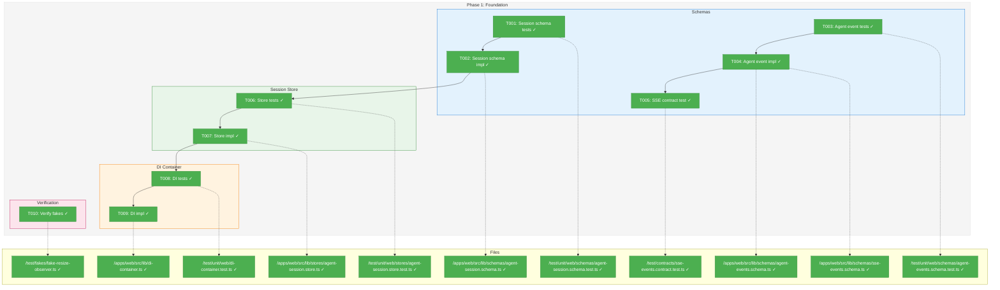
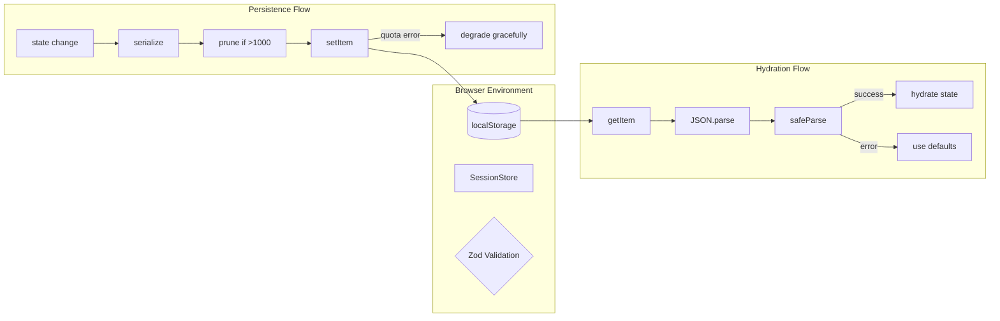
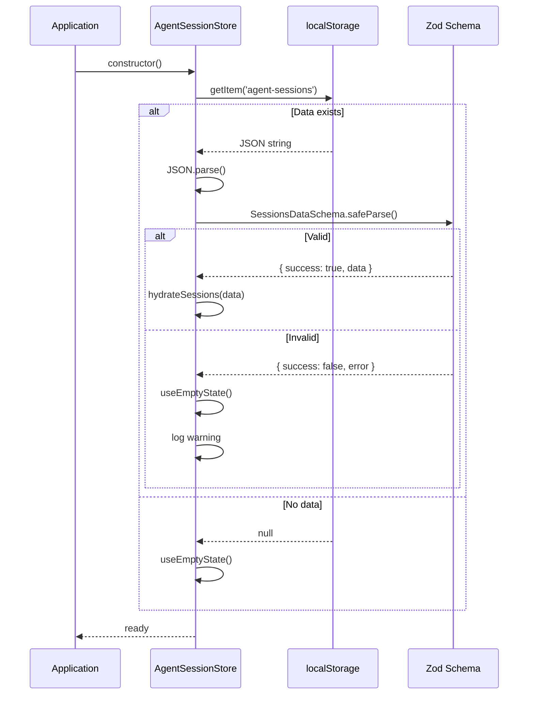

# Phase 1: Foundation – Tasks & Alignment Brief

**Spec**: [../../web-agents-spec.md](../../web-agents-spec.md)
**Plan**: [../../web-agents-plan.md](../../web-agents-plan.md)
**Date**: 2026-01-26

---

## Executive Briefing

### Purpose

This phase establishes the foundational infrastructure for the Multi-Agent Web UI: session persistence schemas, SSE event schema extensions for agent streaming, and DI container setup. Without this foundation, subsequent phases cannot implement chat components or multi-session management.

### What We're Building

A type-safe, validated data layer consisting of:
- **AgentSessionSchema**: Zod schema for validating session state (id, name, agentType, status, messages)
- **AgentEventSchema**: SSE event types for agent streaming (text_delta, session_status, usage_update, error)
- **AgentSessionStore**: localStorage persistence with two-pass hydration and message pruning
- **DI container extensions**: Tokens and factories for agent session management

### User Value

Users will benefit from:
- Sessions that persist across browser refresh (AC-04)
- Real-time streaming responses validated at the schema level (AC-07 foundation)
- Reliable state management that handles edge cases (corrupted data, quota limits)

### Example

**Before**: No agent UI infrastructure exists. Chat components would have no validated data layer.

**After**:
```typescript
// Session schema ensures type-safe data
const session = AgentSessionSchema.parse({
  id: 'abc-123',
  name: 'My Claude Session',
  agentType: 'claude-code',
  status: 'idle',
  messages: [],
  createdAt: Date.now(),
  lastActiveAt: Date.now(),
});

// Agent events are validated before UI consumption
const event = AgentEventSchema.parse({
  type: 'agent_text_delta',
  timestamp: new Date().toISOString(),
  data: { sessionId: 'abc-123', delta: 'Hello, ' },
});
```

---

## Objectives & Scope

### Objective

Implement the foundational data layer for the Multi-Agent Web UI as specified in Plan Phase 1. This phase must pass all quality gates before Phase 2 (Core Chat) can begin.

**Behavior Checklist** (from Plan acceptance criteria):
- [ ] All schema tests pass (`pnpm test test/unit/web/schemas/agent-*.test.ts`)
- [ ] Session store tests pass (`pnpm test test/unit/web/stores/agent-session.store.test.ts`)
- [ ] Contract test verifies SSE backward compatibility (`pnpm test test/contracts/sse-events.contract.test.ts`)
- [ ] Existing 26 SSE tests still pass
- [ ] No mocks used (fakes only)
- [ ] TypeScript strict mode passes
- [ ] Lint passes

### Goals

- ✅ Create `AgentSessionSchema` with Zod for session state validation
- ✅ Create `AgentEventSchema` with 4 new event types (additive to existing SSE schema)
- ✅ Write contract test ensuring existing 7 SSE event types still parse correctly
- ✅ Implement `AgentSessionStore` with localStorage persistence and two-pass hydration
- ✅ Add message pruning (max 1000 per session) for quota handling
- ✅ Extend DI container with session-related tokens
- ✅ Verify `FakeResizeObserver` exists (already present in `test/fakes/`)

### Non-Goals

- ❌ Chat UI components (Phase 2)
- ❌ useAgentSession hook implementation (Phase 2)
- ❌ Multi-session orchestration (Phase 3)
- ❌ Agent routes (`/agents`, `/agents/[sessionId]`) (Phase 3)
- ❌ IndexedDB or server-side persistence (explicitly out of MVP scope per spec)
- ❌ Modifying existing SSE event types (additive-only per Critical Finding 03)
- ❌ AgentService modifications (out of scope per High Finding 04)

---

## Architecture Map

### Component Diagram
<!-- Status: grey=pending, orange=in-progress, green=completed, red=blocked -->
<!-- Updated by plan-6 during implementation -->



### Task-to-Component Mapping

<!-- Status: ⬜ Pending | 🟧 In Progress | ✅ Complete | 🔴 Blocked -->

| Task | Component(s) | Files | Status | Comment |
|------|-------------|-------|--------|---------|
| T001 | Session Schema Tests | `/test/unit/web/schemas/agent-session.schema.test.ts` | ✅ Complete | TDD RED phase complete |
| T002 | AgentSessionSchema | `/apps/web/src/lib/schemas/agent-session.schema.ts` | ✅ Complete | TDD GREEN phase complete |
| T003 | Agent Event Tests | `/test/unit/web/schemas/agent-events.schema.test.ts` | ✅ Complete | TDD RED phase complete |
| T004 | AgentEventSchema | `/apps/web/src/lib/schemas/agent-events.schema.ts`, extend `/apps/web/src/lib/schemas/sse-events.schema.ts` | ✅ Complete | Additive extension per CF-03 |
| T005 | SSE Contract Test | `/test/contracts/sse-events.contract.test.ts` | ✅ Complete | Backward compatibility verified |
| T006 | Store Tests | `/test/unit/web/stores/agent-session.store.test.ts` | ✅ Complete | TDD RED phase complete |
| T007 | AgentSessionStore | `/apps/web/src/lib/stores/agent-session.store.ts` | ✅ Complete | Two-pass hydration, pruning |
| T008 | DI Tests | `/test/unit/web/di-container.test.ts` | ✅ Complete | TDD RED phase complete |
| T009 | DI Container | `/apps/web/src/lib/di-container.ts` | ✅ Complete | SESSION_STORE token added |
| T010 | Fakes Verification | `/test/fakes/fake-resize-observer.ts` | ✅ Complete | Verified exists and works |

---

## Tasks

| Status | ID | Task | CS | Type | Dependencies | Absolute Path(s) | Validation | Subtasks | Notes |
|--------|------|------|----|------|--------------|------------------|------------|----------|-------|
| [x] | T001 | Write tests for `AgentSessionSchema` Zod validation | 2 | Test | – | `/home/jak/substrate/007-manage-workflows/test/unit/web/schemas/agent-session.schema.test.ts` | Tests cover: valid session, missing fields, invalid status enum, invalid agentType, message array validation, timestamp fields | – | Plan task 1.1; TDD RED phase |
| [x] | T002 | Implement `AgentSessionSchema` and related schemas | 2 | Core | T001 | `/home/jak/substrate/007-manage-workflows/apps/web/src/lib/schemas/agent-session.schema.ts` | All T001 tests pass; exports AgentSessionSchema, AgentMessageSchema, SessionStatusSchema, AgentTypeSchema | – | Plan task 1.2; TDD GREEN phase |
| [x] | T003 | Write tests for `AgentEventSchema` SSE extension | 2 | Test | – | `/home/jak/substrate/007-manage-workflows/test/unit/web/schemas/agent-events.schema.test.ts` | Tests cover: agent_text_delta, agent_session_status, agent_usage_update, agent_error events; validates all required fields | – | Plan task 1.3; TDD RED phase |
| [x] | T004 | Implement `AgentEventSchema` (additive to existing SSE schema) | 2 | Core | T003 | `/home/jak/substrate/007-manage-workflows/apps/web/src/lib/schemas/agent-events.schema.ts`, `/home/jak/substrate/007-manage-workflows/apps/web/src/lib/schemas/sse-events.schema.ts` | All T003 tests pass; new types appended to sseEventSchema discriminated union; existing event exports unchanged | – | Plan task 1.4; Per CF-03: additive only; Pattern: define schemas in agent-events.schema.ts, import into sse-events.schema.ts and add to union |
| [x] | T005 | Write contract test: existing SSE events still parse | 1 | Test | T004 | `/home/jak/substrate/007-manage-workflows/test/contracts/sse-events.contract.test.ts` | Contract test verifies all 7 existing event types (workflow_status, task_update, heartbeat, run_status, phase_status, question, answer) parse correctly with extended schema | – | Plan task 1.5; Backward compatibility gate |
| [x] | T006 | Write tests for session store (localStorage) | 3 | Test | T002 | `/home/jak/substrate/007-manage-workflows/test/unit/web/stores/agent-session.store.test.ts` | Tests cover: save/load roundtrip, two-pass hydration, message pruning at 1000, corrupted JSON recovery, getSession/getAllSessions/deleteSession | – | Plan task 1.6; Uses FakeLocalStorage via direct instantiation (per DYK #4); Quota errors: simple try/catch in impl, no simulation testing (YAGNI) |
| [x] | T007 | Implement `AgentSessionStore` class | 3 | Core | T006 | `/home/jak/substrate/007-manage-workflows/apps/web/src/lib/stores/agent-session.store.ts` | All T006 tests pass; implements two-pass hydration per CF-02; prunes messages >1000 per CF-06 | – | Plan task 1.7; Per CF-02, CF-06; Per DYK #5: use constant for 1000 limit, not config |
| [x] | T008 | Write tests for DI container extensions | 2 | Test | T007 | `/home/jak/substrate/007-manage-workflows/test/unit/web/di-container.test.ts` | Tests cover: SESSION_STORE token registration, factory resolution in prod and test containers, test container returns FakeLocalStorage-backed store | – | Plan task 1.8; Per DYK #1: verify resolve() succeeds, don't assume |
| [x] | T009 | Extend DI container with agent session tokens | 2 | Core | T008 | `/home/jak/substrate/007-manage-workflows/apps/web/src/lib/di-container.ts` | All T008 tests pass; DI_TOKENS includes SESSION_STORE; createProductionContainer and createTestContainer register appropriate implementations | – | Plan task 1.9 |
| [x] | T010 | Verify `FakeResizeObserver` exists and works | 1 | Setup | – | `/home/jak/substrate/007-manage-workflows/test/fakes/fake-resize-observer.ts` | File exists; exports FakeResizeObserver class; implements ResizeObserver interface with observe/unobserve/disconnect methods | – | Plan task 1.10; Already exists per Glob |

---

## Alignment Brief

### Critical Findings Affecting This Phase

| Finding | Title | Constraint/Requirement | Addressed By |
|---------|-------|------------------------|--------------|
| CF-02 | Session Persistence Gap | Two-pass hydration: parse raw JSON, validate with Zod, then hydrate state | T006, T007 |
| CF-03 | SSE Schema Extension Risk | Additive-only changes to sseEventSchema; append new types, never remove/rename | T004, T005 |
| HF-05 | SSE Singleton Must Survive HMR | Use `globalThis` pattern for singletons (already implemented in SSEManager) | Verify pattern if creating new singletons |
| HF-06 | localStorage Quota Can Exhaust | Implement message pruning (max 1000 per session), quota detection | T006, T007 |

### ADR Decision Constraints

No ADRs directly reference web-agents or agent-session. The following general ADRs inform implementation:

- **ADR-0004: DI Container Architecture** – Use `useFactory` pattern, no decorators
  - Constrains: T009 DI container registration
  - Addressed by: T008, T009 (tests verify factory pattern)

### Invariants & Guardrails

- **localStorage quota**: 5MB typical browser limit; sessions with 1000+ messages at ~5KB/message could exceed
- **Validation cost**: Zod parsing adds ~1ms overhead per session; acceptable for <100 sessions
- **Memory**: Session store should not hold all messages in memory; load on demand in Phase 2

### Inputs to Read

| File | Purpose |
|------|---------|
| `/apps/web/src/lib/schemas/sse-events.schema.ts` | Existing SSE schema to extend |
| `/apps/web/src/lib/di-container.ts` | DI container to extend |
| `/test/fakes/fake-local-storage.ts` | FakeLocalStorage for store tests |
| `/test/fakes/fake-event-source.ts` | Reference for fake implementation pattern |
| `/packages/shared/src/fakes/fake-agent-adapter.ts` | Reference for FakeAgentAdapter pattern |
| `/docs/plans/010-entity-upgrade/tasks/phase-6-service-unification-validation/001-subtask-cg-agent-cli-command.md` | **Pattern reference**: DI extension, test patterns, discoveries format |

### Prior Learnings from Related Work

**Source**: Plan 010 Phase 6 Subtask 001 (`cg agent` CLI command) - in progress concurrently

These discoveries from the CLI agent work inform our Phase 1 implementation:

| DYK # | Learning | Application to Phase 1 |
|-------|----------|------------------------|
| DYK #1 | **Container Registration Gap** - CLI container was missing AgentService registration despite web container having the pattern. Always verify DI registration works before assuming. | T008/T009: Explicitly test that `container.resolve(SESSION_STORE)` succeeds. Don't assume registration works - verify with failing test first. |
| DYK #4 | **Direct Instantiation in Tests** - CLI unit tests use direct fake instantiation in `beforeEach()`, not DI container. Container only used in integration tests. | T001, T003, T006: Use `new FakeLocalStorage()` directly in tests, not via test container. Simpler and matches established patterns. |
| DYK #5 | **Config-Based Defaults** - AgentService uses config-loaded timeout, not runtime override. Infrastructure often has sensible defaults. | T007: Session store pruning limit (1000) should be a constant, not configurable. Add configurability only if real need arises. |

**Pattern to Follow**: The subtask's DI container extension (ST000) mirrors our T008/T009:
```typescript
// Pattern from web container (lines 155-176) that CLI subtask is porting:
// 1. Add token to DI_TOKENS
// 2. Register in createProductionContainer with useFactory
// 3. Register in createTestContainer with fake implementation
// 4. Write test that resolves token and verifies instance
```

**Discoveries Table Pattern**: The subtask pre-populated its Discoveries & Learnings table during planning (not just implementation). We should capture any Phase 1 gaps discovered during implementation in the same format.

### Visual Alignment Aids

#### State Flow Diagram



#### Sequence Diagram: Session Load



### Test Plan (Full TDD - Fakes Only)

**Test Pattern** (per DYK #4 from Plan 010): Use **direct instantiation** of fakes in `beforeEach()`, not DI container resolution. This matches established CLI and web test patterns.

```typescript
// ✅ CORRECT - Direct instantiation (per DYK #4)
describe('AgentSessionStore', () => {
  let storage: FakeLocalStorage;
  let store: AgentSessionStore;

  beforeEach(() => {
    storage = new FakeLocalStorage();
    store = new AgentSessionStore(storage);
  });
});

// ❌ AVOID - Container resolution in unit tests
describe('AgentSessionStore', () => {
  let container: DependencyContainer;
  beforeEach(() => {
    container = createTestContainer();
    // Don't do this for unit tests
  });
});
```

#### T001: AgentSessionSchema Tests

| Test Name | Rationale | Expected Output |
|-----------|-----------|-----------------|
| `should validate a complete session` | Ensures valid data roundtrips | `{ success: true }` |
| `should reject missing required fields` | Catches incomplete data | `{ success: false }` with ZodError |
| `should reject invalid status enum` | Prevents invalid states | `{ success: false }` for status='unknown' |
| `should reject invalid agent type` | Catches integration errors | `{ success: false }` for agentType='gpt-4' |
| `should validate messages array` | Ensures message structure | `{ success: true }` for valid messages |
| `should require timestamp fields` | Enables sorting/display | `{ success: false }` without createdAt |

**Fixture**: Use inline test data, no external fixtures needed.

#### T003: AgentEventSchema Tests

| Test Name | Rationale | Expected Output |
|-----------|-----------|-----------------|
| `should validate agent_text_delta event` | Core streaming event | `{ success: true }` |
| `should validate agent_session_status event` | Status change tracking | `{ success: true }` |
| `should validate agent_usage_update event` | Token display | `{ success: true }` |
| `should validate agent_error event` | Error handling | `{ success: true }` |
| `should reject unknown agent event type` | Schema strictness | `{ success: false }` |

#### T005: SSE Contract Tests

| Test Name | Rationale | Expected Output |
|-----------|-----------|-----------------|
| `should parse workflow_status event` | Backward compatibility | Parse succeeds |
| `should parse task_update event` | Backward compatibility | Parse succeeds |
| `should parse heartbeat event` | Backward compatibility | Parse succeeds |
| `should parse run_status event` | Backward compatibility | Parse succeeds |
| `should parse phase_status event` | Backward compatibility | Parse succeeds |
| `should parse question event` | Backward compatibility | Parse succeeds |
| `should parse answer event` | Backward compatibility | Parse succeeds |

#### T006: SessionStore Tests

| Test Name | Rationale | Fake Used |
|-----------|-----------|-----------|
| `should save and load session roundtrip` | Core persistence | FakeLocalStorage |
| `should handle corrupted JSON gracefully` | Error recovery | FakeLocalStorage with invalid data |
| `should prune messages when exceeding 1000` | Quota prevention | FakeLocalStorage |
| `should use two-pass hydration` | Per CF-02 | FakeLocalStorage |
| `should return empty state for new browser` | First-run case | FakeLocalStorage (empty) |

**Note**: Quota exceeded handling is simple try/catch in implementation (no simulation testing). Server-side storage is future work if quota becomes a real issue.

### Step-by-Step Implementation Outline

1. **T001**: Create test file at `test/unit/web/schemas/agent-session.schema.test.ts`
   - Import from non-existent schema (will fail)
   - Write 6 test cases with Test Doc format
   - Run: `pnpm test test/unit/web/schemas/agent-session.schema.test.ts` → RED

2. **T002**: Create `apps/web/src/lib/schemas/agent-session.schema.ts`
   - Define AgentTypeSchema: `z.enum(['claude-code', 'copilot'])`
   - Define SessionStatusSchema: `z.enum(['idle', 'running', 'waiting_input', 'completed', 'archived'])`
   - Define AgentMessageSchema with role, content, timestamp
   - Define AgentSessionSchema with all fields
   - Export all schemas and inferred types
   - Run: `pnpm test test/unit/web/schemas/agent-session.schema.test.ts` → GREEN

3. **T003**: Create test file at `test/unit/web/schemas/agent-events.schema.test.ts`
   - Import from non-existent schema (will fail)
   - Write 5 test cases with Test Doc format
   - Run: `pnpm test test/unit/web/schemas/agent-events.schema.test.ts` → RED

4. **T004**: Create `apps/web/src/lib/schemas/agent-events.schema.ts`
   - Define agentTextDeltaEventSchema (type, timestamp, data: { sessionId, delta })
   - Define agentSessionStatusEventSchema (status change)
   - Define agentUsageUpdateEventSchema (token counts)
   - Define agentErrorEventSchema (error message, code)
   - Export individual schemas AND types
   - Then in `sse-events.schema.ts`: import agent schemas, **APPEND** to discriminated union
   - Run: `pnpm test test/unit/web/schemas/agent-events.schema.test.ts` → GREEN

5. **T005**: Create test file at `test/contracts/sse-events.contract.test.ts`
   - Test each of 7 existing event types still parse
   - Run: `pnpm test test/contracts/sse-events.contract.test.ts` → GREEN

6. **T006**: Create test file at `test/unit/web/stores/agent-session.store.test.ts`
   - Import FakeLocalStorage from `test/fakes/`
   - Write 5 test cases with Test Doc format (quota test removed - YAGNI)
   - Run: `pnpm test test/unit/web/stores/agent-session.store.test.ts` → RED

7. **T007**: Create `apps/web/src/lib/stores/agent-session.store.ts`
   - Constructor: accept Storage interface (for DI)
   - Load: two-pass hydration (JSON.parse → Zod validate → hydrate)
   - Save: serialize → prune if >1000 → setItem (simple try/catch for quota)
   - Methods: saveSession, loadSession, getAllSessions, deleteSession
   - Run: `pnpm test test/unit/web/stores/agent-session.store.test.ts` → GREEN

8. **T008**: Extend `test/unit/web/di-container.test.ts`
   - Add tests for SESSION_STORE token
   - Verify factory pattern used
   - Run: `pnpm test test/unit/web/di-container.test.ts` → RED

9. **T009**: Extend `apps/web/src/lib/di-container.ts`
   - Add `SESSION_STORE: 'SessionStore'` to DI_TOKENS
   - Register in createProductionContainer (real localStorage)
   - Register in createTestContainer (FakeLocalStorage)
   - Run: `pnpm test test/unit/web/di-container.test.ts` → GREEN

10. **T010**: Verify `test/fakes/fake-resize-observer.ts`
    - Read file, confirm it exports FakeResizeObserver
    - Run a quick import test if needed
    - Mark complete if exists and exports correctly

### Commands to Run

```bash
# Environment setup (from repo root)
cd /home/jak/substrate/007-manage-workflows
pnpm install  # if needed

# Run specific test files during TDD
pnpm test test/unit/web/schemas/agent-session.schema.test.ts
pnpm test test/unit/web/schemas/agent-events.schema.test.ts
pnpm test test/contracts/sse-events.contract.test.ts
pnpm test test/unit/web/stores/agent-session.store.test.ts
pnpm test test/unit/web/di-container.test.ts

# Run all Phase 1 tests
pnpm test test/unit/web/schemas/agent-*.test.ts test/unit/web/stores/agent-*.test.ts test/contracts/sse-events.contract.test.ts

# Verify existing SSE tests still pass
pnpm test test/unit/web/services/sse-manager.test.ts test/unit/web/hooks/useSSE.test.ts

# Coverage check
pnpm test --coverage apps/web/src/lib/schemas/agent-*.ts apps/web/src/lib/stores/agent-*.ts

# Verify no mocks used
grep -r "vi.mock\|jest.mock" test/unit/web/schemas test/unit/web/stores test/contracts

# Lint and typecheck
pnpm lint apps/web/src/lib/schemas apps/web/src/lib/stores
pnpm typecheck
```

### Risks/Unknowns

| Risk | Severity | Likelihood | Mitigation |
|------|----------|------------|------------|
| Zod discriminated union order matters | Medium | Low | Contract tests verify existing types still parse |
| localStorage unavailable (private browsing) | Low | Medium | Check `typeof localStorage !== 'undefined'` before use |
| DI container test isolation | Low | Low | Use child containers per test (existing pattern) |

**Deferred Risk**: localStorage quota exhaustion - handled by pruning (1000 msg limit) + simple try/catch. Server-side storage is future work if this becomes a real issue.

### Ready Check

- [x] Spec reviewed: Goals, Non-Goals, Testing Strategy understood
- [x] Plan Phase 1 tasks mapped to T001-T010
- [x] Critical Findings CF-02, CF-03, HF-05, HF-06 incorporated
- [x] ADR-0004 DI patterns will be followed (useFactory)
- [x] FakeLocalStorage and FakeEventSource available in `test/fakes/`
- [x] Existing SSE schema structure understood (7 event types)
- [x] Commands documented for all quality gates
- [x] Test Doc format will be used in all tests
- [x] Prior Learnings from Plan 010 subtask reviewed (DYK #1, #4, #5)

**Phase 1 Implementation: ✅ COMPLETE**

---

## Phase Footnote Stubs

<!-- Footnote entries will be added by plan-6 during implementation -->

| Footnote | Task | Description | Date |
|----------|------|-------------|------|
| | | | |

---

## Evidence Artifacts

Implementation will produce:
- `phase-1-foundation/execution.log.md` - Detailed implementation narrative
- Test output showing all tests pass
- Coverage report showing >80% for new code
- Grep output confirming no mocks used

---

## Discoveries & Learnings

_Populated during implementation by plan-6. Log anything of interest to your future self._

| Date | Task | Type | Discovery | Resolution | References |
|------|------|------|-----------|------------|------------|
| 2026-01-26 | T009 | gotcha | Node.js defines `globalThis.localStorage` as empty object without methods | Check for `typeof localStorage.getItem === 'function'` not just truthy | log#task-t009 |

**Types**: `gotcha` | `research-needed` | `unexpected-behavior` | `workaround` | `decision` | `debt` | `insight`

**What to log**:
- Things that didn't work as expected
- External research that was required
- Implementation troubles and how they were resolved
- Gotchas and edge cases discovered
- Decisions made during implementation
- Technical debt introduced (and why)
- Insights that future phases should know about

_See also: `execution.log.md` for detailed narrative._

---

## Directory Layout

```
docs/plans/012-web-agents/
├── web-agents-spec.md
├── web-agents-plan.md
├── research-dossier.md
├── external-research/
│   ├── chat-ui-patterns.md
│   ├── session-management.md
│   └── sse-vs-websocket.md
└── tasks/
    └── phase-1-foundation/
        ├── tasks.md          # This file
        └── execution.log.md  # Created by plan-6
```

---

**Dossier Created**: 2026-01-26
**Phase**: 1 of 5 (Foundation)
**Phase Status**: ✅ COMPLETE
**Implementation Date**: 2026-01-26
**Next Step**: Run `/plan-7-code-review --phase "Phase 1: Foundation" --plan "/home/jak/substrate/007-manage-workflows/docs/plans/012-web-agents/web-agents-plan.md"`

---

## Critical Insights Discussion

**Session**: 2026-01-26
**Context**: Phase 1 Foundation task dossier pre-implementation review
**Analyst**: AI Clarity Agent
**Reviewer**: Development Team
**Format**: Water Cooler Conversation (5 Critical Insights)

### Insight 1: SSE Schema Extension Architecture

**Did you know**: Creating a separate agent-events.schema.ts while adding to the sse-events.schema.ts union is the cleanest approach - the useSSE hook validates against a single discriminated union, so parallel schemas would break validation.

**Implications**:
- useSSE hook at line 117 validates ALL messages against provided messageSchema
- Parallel schemas (completely separate) would require forking useSSE hook
- Zod discriminated union uses 'type' field - order doesn't matter

**Options Considered**:
- Option A: Separate agent-events.schema.ts, import into sse-events.schema.ts union
- Option B: Add agent events inline to sse-events.schema.ts
- Option C: Parallel agentEventSchema (NOT FEASIBLE - breaks useSSE)

**AI Recommendation**: Option B for simplicity
- Reasoning: Single file, no import chain, follows existing pattern

**Discussion Summary**: User chose to combine approaches - create separate file for organization (Option A pattern) while ensuring schemas are added to the main union (Option B outcome).

**Decision**: Create agent-events.schema.ts for definitions, import into sse-events.schema.ts union

**Action Items**: None - T004 already specifies both files

**Affects**: T004 implementation pattern

---

### Insight 2: SSE Event Type Count Verification

**Did you know**: The dossier correctly lists 7 SSE event types. "Checkpoint" appears elsewhere in codebase but refers to workflow versioning, NOT an SSE event type.

**Implications**:
- Contract test (T005) must verify exactly 7 types
- No checkpoint SSE event exists or is needed
- workflow_status, task_update, heartbeat, run_status, phase_status, question, answer

**Options Considered**:
- Option A: Proceed with 7 types as documented (CORRECT)
- Option B: Add checkpoint event type (NOT REQUIRED)

**AI Recommendation**: Option A
- Reasoning: Dossier is accurate; checkpoint is a versioning concept

**Discussion Summary**: User confirmed Option A - proceed with documented 7 types.

**Decision**: Contract test covers exactly 7 existing event types

**Action Items**: None - dossier correct

**Affects**: T005 implementation

---

### Insight 3: localStorage Quota Simulation

**Did you know**: FakeLocalStorage can't simulate quota errors, but T006 originally required testing quota exceeded handling. This is over-engineering for MVP.

**Implications**:
- Browser localStorage has ~5MB limit
- Pruning at 1000 messages handles 99% of cases
- Server-side storage is explicitly a non-goal for MVP

**Options Considered**:
- Option A: Extend FakeLocalStorage with simulateQuotaExceeded()
- Option D: Skip quota testing, simple try/catch in implementation (YAGNI)

**AI Recommendation**: Initially Option A
- Reasoning: Proper error path testing

**Discussion Summary**: User pushed back - "keep it SUPER simple". Server-side storage is future work. Pruning handles most quota concerns. Simple try/catch is sufficient.

**Decision**: Skip quota simulation testing; simple try/catch in implementation

**Action Items**:
- [x] Update T006 to remove quota exceeded test
- [x] Update Risks section to note deferred risk

**Affects**: T006, T007, FakeLocalStorage (no changes needed)

---

### Insight 4: Test Directory Structure

**Did you know**: The dossier originally specified `test/unit/schemas/` and `test/unit/stores/` but this breaks the established domain-based pattern (`test/unit/web/`, `test/unit/cli/`, etc.).

**Implications**:
- Existing pattern: `test/unit/{domain}/{type}.test.ts`
- Dossier paths would introduce inconsistent type-based organization
- Acceptance criteria grep commands would need to match actual paths

**Options Considered**:
- Option A: Follow dossier paths (introduces new pattern)
- Option B: Use domain-based paths: `test/unit/web/schemas/`, `test/unit/web/stores/`

**AI Recommendation**: Initially Option A (follow dossier)
- Reasoning: Dossier paths are explicit

**Discussion Summary**: User correctly challenged - "our AC could be wrong. We should assess carefully why we are going away from established patterns." No good reason to break pattern.

**Decision**: Use domain-based paths (`test/unit/web/schemas/`, `test/unit/web/stores/`)

**Action Items**:
- [x] Update T001, T003, T006 paths
- [x] Update Commands section
- [x] Update Architecture map
- [x] Update Implementation outline

**Affects**: T001, T003, T006, all command examples

---

### Insight 5: Separate agent-events.schema.ts File

**Did you know**: Since we're adding to sse-events.schema.ts union (Insight #1), we have a choice: define schemas inline OR in a separate file that gets imported.

**Implications**:
- Inline is simpler but mixes concerns
- Separate file is cleaner organization
- Both work with the union approach

**Options Considered**:
- Option A: Keep separate agent-events.schema.ts, import into union
- Option B: Define inline in sse-events.schema.ts

**AI Recommendation**: Option B for simplicity
- Reasoning: Less files, less imports

**Discussion Summary**: User chose Option A - "lets do it properly". Clean separation is worth the extra file.

**Decision**: Create agent-events.schema.ts for definitions, import into sse-events.schema.ts

**Action Items**:
- [x] Update T004 notes to clarify pattern

**Affects**: T004 implementation pattern

---

## Session Summary

**Insights Surfaced**: 5 critical insights identified and discussed
**Decisions Made**: 5 decisions reached through collaborative discussion
**Action Items Created**: 8 updates applied during session
**Areas Updated**:
- T001, T003, T006: Test paths corrected to domain-based pattern
- T004: Implementation pattern clarified (separate file, import into union)
- T006, T007: Quota testing removed (YAGNI)
- Risks section: Quota risk deferred
- Commands section: All paths updated
- Architecture map: File references corrected

**Shared Understanding Achieved**: ✓

**Confidence Level**: High - Key architectural decisions made, paths corrected, scope simplified

**Next Steps**: Await GO for Phase 1 implementation

**Notes**: User pushed back appropriately on over-engineering (quota simulation) and pattern violations (test paths). Final dossier is simpler and more consistent with codebase conventions.
