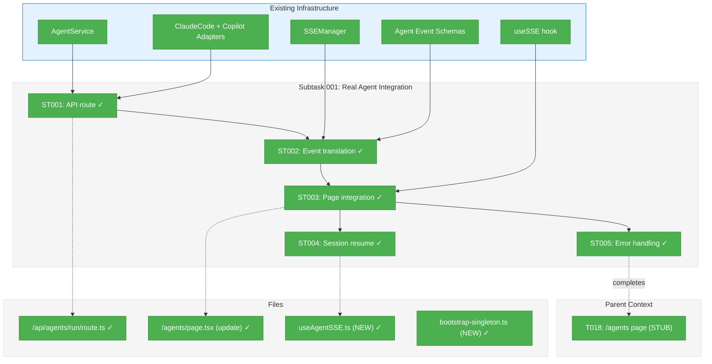
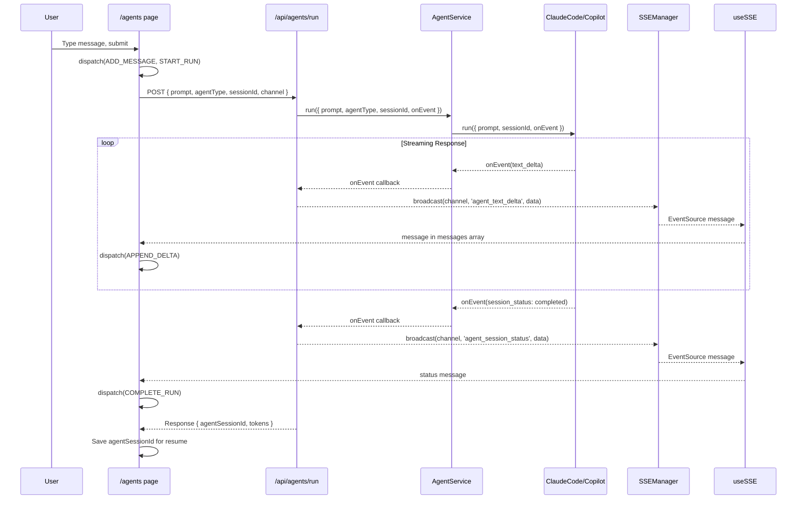

# Subtask 001: Real Agent Integration

**Parent Plan:** [../../web-agents-plan.md](../../web-agents-plan.md)
**Parent Phase:** Phase 2: Core Chat
**Parent Task(s):** [T018: /agents page](./tasks.md#task-t018)
**Plan Task Reference:** [Task 2.12 in Plan](../../web-agents-plan.md#tasks-full-tdd-approach-1)

**Why This Subtask:**
Phase 2 was completed with a simulated/stub agent response (setTimeout with fake messages). The page needs to be wired to the real agent adapters (ClaudeCodeAdapter, SdkCopilotAdapter) via AgentService, with SSE streaming for real-time responses.

**Created:** 2026-01-26
**Requested By:** User

---

## Executive Briefing

### Purpose
This subtask connects the standalone `/agents` page to real agent adapters, enabling actual AI agent interactions. Users will send messages to Claude Code or Copilot and receive real streaming responses instead of simulated stub responses.

### What We're Building
A complete agent integration layer consisting of:
- **API route** (`/api/agents/run`) that invokes AgentService with SSE event streaming
- **Session resume support** storing and passing `agentSessionId` for conversation continuity
- **Real-time streaming** via existing SSE infrastructure and `useSSE` hook
- **Error handling** mapping adapter errors to UI error states
- **Token usage display** from real agent responses (Claude Code only)

### Unblocks
- **Full agent functionality** - Users can actually interact with AI agents
- **Phase 3: Multi-Session** - Real agent sessions enable meaningful multi-session orchestration
- **Phase 5: Integration Testing** - E2E tests require working agent integration

### Example

**Before (current stub):**
```typescript
// In page.tsx - lines 86-94
setTimeout(() => {
  dispatch({ type: 'APPEND_DELTA', delta: 'Hello! I am your AI assistant. ' });
  setTimeout(() => {
    dispatch({ type: 'APPEND_DELTA', delta: 'How can I help you today?' });
    dispatch({ type: 'COMPLETE_RUN' });
  }, 500);
}, 500);
```

**After (real integration):**
```typescript
// User sends message → POST /api/agents/run → AgentService.run() → SSE events → UI updates
const response = await fetch('/api/agents/run', {
  method: 'POST',
  body: JSON.stringify({ sessionId, agentType, prompt, channel: `agent-${sessionId}` }),
});

// SSE channel receives real streaming events
// agent_text_delta → APPEND_DELTA action → streaming message updates
// agent_session_status → UPDATE_STATUS action → status indicator updates
// agent_usage_update → UPDATE_CONTEXT_USAGE action → token display updates
```

---

## Objectives & Scope

### Objective
Wire the `/agents` page to real agent adapters via API route and SSE streaming, replacing the simulated stub response with actual AI agent interactions.

### Goals

- ✅ Create `/api/agents/run` POST route handler that invokes AgentService
- ✅ Implement SSE event streaming from AgentService.run() onEvent callback to sseManager
- ✅ Store and pass `agentSessionId` for session resumption (adapter-provided ID)
- ✅ Update `/agents` page to use API route instead of setTimeout stub
- ✅ Connect useSSE hook to receive real-time agent events
- ✅ Map agent events to sessionReducer actions (APPEND_DELTA, UPDATE_STATUS, etc.)
- ✅ Display real token usage from agent responses (contextUsage percentage)
- ✅ Handle errors gracefully with agent_error events

### Non-Goals

- ❌ Multi-session orchestration (Phase 3 scope)
- ❌ Slash command handling (/compact, /help) (Phase 4 scope)
- ❌ Mobile layout optimization (Phase 4 scope)
- ❌ Server-side session persistence (localStorage is MVP-adequate)
- ❌ API authentication/authorization (internal tool, trusted environment)
- ❌ Rate limiting (deferred unless issues observed)

---

## Architecture Map

### Component Diagram
<!-- Updated by plan-6 during implementation -->



### Task-to-Component Mapping

<!-- Status: ⬜ Pending | 🟧 In Progress | ✅ Complete | 🔴 Blocked -->

| Task | Component(s) | Files | Status | Comment |
|------|-------------|-------|--------|---------|
| ST001 | API Route | `/apps/web/app/api/agents/run/route.ts` | ✅ Complete | POST handler invoking AgentService |
| ST002 | Event Translation | (inline in route) | ✅ Complete | Map AgentEvent → SSE broadcast |
| ST003 | Page Integration | `/apps/web/app/(dashboard)/agents/page.tsx` | ✅ Complete | Replace stub with API call + useSSE |
| ST004 | Session Resume | `/apps/web/app/(dashboard)/agents/page.tsx` | ✅ Complete | Store/pass agentSessionId via ref |
| ST005 | Error Handling | `/apps/web/app/(dashboard)/agents/page.tsx` | ✅ Complete | Inline error + Retry button |

### Data Flow Sequence



---

## Tasks

| Status | ID | Task | CS | Type | Dependencies | Absolute Path(s) | Validation | Subtasks | Notes |
|--------|------|------|----|----- |--------------|------------------|------------|----------|-------|
| [x] | ST001 | Create `/api/agents/run` POST route | 3 | Core | – | `/home/jak/substrate/007-manage-workflows/apps/web/app/api/agents/run/route.ts` | Route returns 200, invokes AgentService | – | Use `getContainer()` singleton (DYK-05); extend AgentServiceRunOptions (DYK-02) |
| [x] | ST002 | Implement event translation (AgentEvent → SSE) | 2 | Core | ST001 | (inline in route.ts) | Events broadcast correctly to channel | – | Map text_delta, session_status, usage, error |
| [x] | ST003 | Update /agents page to use API + useSSE | 3 | Core | ST001, ST002 | `/home/jak/substrate/007-manage-workflows/apps/web/app/(dashboard)/agents/page.tsx` | Stub removed, real events flow | – | **Connect-First**: SSE before POST (DYK-01) |
| [x] | ST004 | Implement session resume (agentSessionId) | 2 | Core | ST003 | `/home/jak/substrate/007-manage-workflows/apps/web/app/(dashboard)/agents/page.tsx` (ref) | Can resume existing agent session | – | **Stored in ref** instead of reducer (simpler) |
| [x] | ST005 | Implement error handling + UI feedback | 2 | Core | ST003 | `/home/jak/substrate/007-manage-workflows/apps/web/app/(dashboard)/agents/page.tsx` | Errors display in UI, recoverable | – | **Inline error** as system message + Retry (DYK-04) |

---

## Alignment Brief

### Objective Recap

Phase 2 delivered a complete `/agents` page UI with all components working, but agent responses are simulated via `setTimeout`. This subtask wires the UI to real agent adapters, completing the vertical slice for actual AI agent interaction.

**Parent Phase Goal:** Build the primary chat interface with message streaming
**This Subtask:** Replace simulated streaming with real agent adapter streaming

### Acceptance Criteria Deltas

From parent Phase 2 acceptance criteria, this subtask specifically addresses:
- [ ] Real streaming responses (not simulated)
- [ ] Session resumption works (pass agentSessionId to adapter)
- [ ] Token usage displays real values (from agent response)
- [ ] Error states handle real adapter failures

### Critical Findings Affecting This Subtask

| ID | Finding | Impact | Mitigation |
|----|---------|--------|------------|
| CF-03 | SSE Schema Extension Risk | Must use additive-only changes | Agent events already added in Phase 1 ✓ |
| HF-05 | SSE Singleton Must Survive HMR | Use globalThis pattern | SSEManager already uses this ✓ |
| HF-08 | Race Condition SSE vs State | Merge-not-replace pattern | sessionReducer already implements this ✓ |
| MF-10 | Keep Agent Events Abstracted | UI receives only AgentEvent types | Route handler translates, UI consumes |
| DYK-01 | SSE Connection Timing Race | Events emitted before SSE connects are lost (no buffering) | **Connect-First Pattern**: establish SSE connection before POST, wait for `isConnected === true` |
| DYK-02 | AgentService Missing onEvent | `AgentServiceRunOptions` lacks `onEvent` callback; adapters support it but service drops it | **Extend AgentServiceRunOptions**: add `onEvent?: AgentEventHandler`, pass through to adapter. Iterate at dev time. |
| DYK-03 | Dual Session IDs | `id` (client UUID) vs `agentSessionId` (adapter-provided for resume); agentSessionId never stored | **Extend COMPLETE_RUN**: `{ type: 'COMPLETE_RUN'; agentSessionId?: string }`, store in state, pass to subsequent calls |
| DYK-04 | Error Recovery Dead End | Error state traps session; CLEAR_ERROR exists but never called; no retry UI | **Inline Error in Chat**: show error as system message with Retry link; input stays enabled; extend later if needed |
| DYK-05 | Bootstrap Pattern Unclear | No existing route uses DI; bootstrap() is sync; per-request reloads config | **Lazy Singleton with globalThis**: create `getContainer()` helper matching SSEManager pattern; config loaded once, HMR-safe |

### Invariants/Guardrails

1. **No direct adapter access from UI** - All agent operations go through AgentService
2. **SSE additive-only** - Agent events already defined, don't modify existing types
3. **Fakes over mocks** - Test with FakeEventSource, FakeAgentAdapter if needed
4. **Error resilience** - Adapter failures must not crash the UI

### Inputs to Read

| File | Purpose |
|------|---------|
| `/apps/web/app/api/events/[channel]/route.ts` | Pattern for SSE route handlers |
| `/apps/web/src/lib/sse-manager.ts` | Broadcast API |
| `/apps/web/src/lib/di-container.ts` | DI tokens for AgentService |
| `/packages/shared/src/services/agent.service.ts` | AgentService API |
| `/packages/shared/src/interfaces/agent-types.ts` | AgentEvent types |
| `/apps/web/src/lib/schemas/agent-events.schema.ts` | SSE event schemas |
| `/docs/adr/adr-0006-cli-based-workflow-agent-orchestration.md` | **CLI orchestration patterns** - DYK-07/08 (CWD binding, resume flags), IMP-007 (WebSocket for long ops) |

### Test Plan (Full TDD - Fakes Only)

**ST001: API Route Tests**
```typescript
// test/unit/web/api/agents/run.test.ts
describe('/api/agents/run', () => {
  it('should invoke AgentService with correct parameters', async () => {
    // Setup fake adapter via DI
    // POST to route with test body
    // Verify AgentService.run() called with correct args
  });

  it('should broadcast events via SSEManager', async () => {
    // Emit fake events from adapter
    // Verify sseManager.broadcast() called for each event
  });

  it('should return agentSessionId in response', async () => {
    // Verify response includes sessionId for resume
  });
});
```

**ST003: Page Integration Tests**
```typescript
// test/unit/web/app/agents/page-integration.test.tsx
describe('AgentsPage real integration', () => {
  it('should POST to /api/agents/run on message submit', async () => {
    // Setup FakeEventSource
    // Submit message
    // Verify API called
  });

  it('should update state from SSE events', async () => {
    // Emit fake SSE events
    // Verify reducer actions dispatched
    // Verify UI updates
  });
});
```

**Fakes Available:**
- `FakeEventSource` - `test/fakes/fake-event-source.ts`
- `FakeAgentAdapter` - `packages/shared/src/fakes/fake-agent-adapter.ts`
- `FakeLocalStorage` - `test/fakes/fake-local-storage.ts`

### Implementation Outline

1. **ST001: API Route**
   - Create `apps/web/app/api/agents/run/route.ts`
   - Use `bootstrap()` to get DI container
   - Resolve AgentService from container
   - Parse request body: `{ prompt, agentType, sessionId?, channel }`
   - Call `agentService.run()` with onEvent callback
   - Return `{ agentSessionId, tokens }` on completion

2. **ST002: Event Translation**
   - In onEvent callback, map AgentEvent types:
     - `text_delta` → `sseManager.broadcast(channel, 'agent_text_delta', { sessionId, delta })`
     - `session_*` → `sseManager.broadcast(channel, 'agent_session_status', { sessionId, status })`
     - `usage` → `sseManager.broadcast(channel, 'agent_usage_update', { sessionId, ...tokens })`
   - Handle errors → `agent_error` event

3. **ST003: Page Integration**
   - Remove setTimeout stub (lines 86-94)
   - Add useSSE hook: `useSSE(`/api/events/agent-${sessionId}`, agentEventSchema)`
   - Create API call function replacing stub
   - Connect SSE messages to reducer dispatch
   - Handle loading/error states

4. **ST004: Session Resume**
   - Add `agentSessionId?: string` field to reducer state (already in schema)
   - On API response, store `agentSessionId`
   - On next message, pass `sessionId` to API

5. **ST005: Error Handling**
   - Listen for `agent_error` SSE events
   - Dispatch SET_ERROR action
   - Show error in UI (existing error state)
   - Allow retry (CLEAR_ERROR + new message)

### Commands to Run

```bash
# Environment setup
cd /home/jak/substrate/007-manage-workflows
pnpm install  # if needed

# Create API route directory
mkdir -p apps/web/app/api/agents/run

# Run tests during TDD
pnpm test test/unit/web/api/agents/run.test.ts
pnpm test test/unit/web/app/agents/page-integration.test.tsx

# Run all Phase 2 tests (should still pass)
pnpm test test/unit/web/hooks/useAgentSession.test.ts test/unit/web/components/agents/*.test.tsx

# Verify existing tests don't break
pnpm test test/unit/web/services/sse-manager.test.ts test/unit/web/hooks/useSSE.test.ts

# Lint and typecheck
pnpm lint apps/web/app/api/agents apps/web/app/\(dashboard\)/agents
pnpm typecheck

# Manual verification (after implementation)
pnpm dev
# Navigate to http://localhost:3001/agents
# Create session, send message, verify real response
```

### Risks & Unknowns

| Risk | Severity | Likelihood | Mitigation |
|------|----------|------------|------------|
| AgentService timeout (10 min) may be too long for web | Medium | Low | Use shorter timeout for web, or accept default |
| Adapter not available (missing API key) | Medium | Medium | Graceful error message in UI |
| SSE connection drops mid-stream | Low | Medium | useSSE has auto-reconnect |
| Claude Code CLI not installed | Medium | Low | Error message: "Claude Code CLI required" |

### Ready Check

- [x] Phase 2 complete: All 19 tasks done, 92 tests passing
- [x] Existing infrastructure verified: SSEManager, useSSE, AgentService, adapters
- [x] Agent event schemas in place (Phase 1)
- [x] DI container has AgentService token registered
- [x] FakeAgentAdapter available for testing
- [x] Session resume field in schema (`agentSessionId`)
- [ ] **Awaiting GO** to proceed with implementation

---

## Phase Footnote Stubs

| Footnote | Task | Description | Date |
|----------|------|-------------|------|
| | | | |

---

## Evidence Artifacts

Implementation will produce:
- `001-subtask-real-agent-integration.execution.log.md` - Detailed implementation narrative
- Test output showing new tests pass
- Screenshot/recording of real agent interaction (optional)

---

## Discoveries & Learnings

_Populated during implementation by plan-6. Log anything of interest to your future self._

| Date | Task | Type | Discovery | Resolution | References |
|------|------|------|-----------|------------|------------|
| 2026-01-26 | ST001 | decision | ZodError instanceof check fails cross-module | Use error.name === 'ZodError' && 'errors' in error | route.ts:143 |
| 2026-01-26 | ST003 | insight | useSSE only handles onmessage, not named events | Created specialized useAgentSSE hook with addEventListener | useAgentSSE.ts |
| 2026-01-26 | ST003 | gotcha | EventSource not available in test env | Added defaultEventSourceFactory guard for SSR/test | useAgentSSE.ts:23-37 |
| 2026-01-26 | ST004 | decision | Storing agentSessionId in ref simpler than reducer | useRef instead of extending COMPLETE_RUN | page.tsx:60 |

**Types**: `gotcha` | `research-needed` | `unexpected-behavior` | `workaround` | `decision` | `debt` | `insight`

**What to log**:
- Things that didn't work as expected
- External research that was required
- Implementation troubles and how they were resolved
- Gotchas and edge cases discovered
- Decisions made during implementation
- Technical debt introduced (and why)
- Insights that future phases should know about

_See also: `execution.log.md` for detailed narrative._

---

## After Subtask Completion

**This subtask resolves a blocker for:**
- Parent Task: [T018: /agents page](./tasks.md#task-t018)
- Plan Task: [Task 2.12 in Plan](../../web-agents-plan.md#tasks-full-tdd-approach-1)

**When all ST### tasks complete:**

1. **Record completion** in parent execution log:
   ```
   ### Subtask 001-subtask-real-agent-integration Complete

   Resolved: Connected /agents page to real agent adapters via API route + SSE streaming
   See detailed log: [subtask execution log](./001-subtask-real-agent-integration.execution.log.md)
   ```

2. **Update parent task** (T018 enhancement, not blocker):
   - Open: [`tasks.md`](./tasks.md)
   - Find: T018
   - Update Notes: Add "Subtask 001 complete - real agent integration"

3. **Resume parent phase work:**
   ```bash
   /plan-6-implement-phase --phase "Phase 3: Multi-Session" \
     --plan "/home/jak/substrate/007-manage-workflows/docs/plans/012-web-agents/web-agents-plan.md"
   ```
   (Note: NO `--subtask` flag to resume main phase)

**Quick Links:**
- [Parent Dossier](./tasks.md)
- [Parent Plan](../../web-agents-plan.md)
- [Parent Execution Log](./execution.log.md)

---

## Directory Layout

```
docs/plans/012-web-agents/
├── web-agents-spec.md
├── web-agents-plan.md
└── tasks/
    └── phase-2-core-chat/
        ├── tasks.md                                    # Phase dossier
        ├── execution.log.md                            # Phase log (complete)
        ├── 001-subtask-real-agent-integration.md       # This file
        └── 001-subtask-real-agent-integration.execution.log.md  # Created by plan-6
```

---

## Critical Insights Discussion

**Session**: 2026-01-26
**Context**: Subtask 001 - Real Agent Integration pre-implementation review
**Analyst**: AI Clarity Agent
**Reviewer**: Development Team
**Format**: Water Cooler Conversation (5 Critical Insights)

### Insight 1: SSE Connection Timing Race Condition

**Did you know**: Events emitted before SSE connection establishes are permanently lost - SSEManager doesn't buffer.

**Implications**:
- 50-200ms window between API broadcast and SSE connection ready
- Events during this window silently dropped
- Existing patterns (workflow, kanban) have same vulnerability

**Options Considered**:
- Option A: Connect-First Pattern - SSE before POST
- Option B: Event Buffering in SSEManager - NOT FEASIBLE (breaks shared infra)
- Option C: Initial State Fetch on Connect

**AI Recommendation**: Option A (Connect-First Pattern)

**Decision**: **Option A** - Establish SSE connection before sending API request; wait for `isConnected === true`

**Action Items**:
- [ ] ST003: Connect to SSE first, then POST
- [ ] Add "Connecting..." UI state

**Affects**: ST003 (Page Integration)

---

### Insight 2: AgentService Missing onEvent Callback

**Did you know**: `AgentServiceRunOptions` lacks `onEvent` callback - adapters support streaming but service layer drops it.

**Implications**:
- Streaming events can't flow from adapters through service layer
- Current subtask implementation outline won't work as written
- Need to extend shared package

**Options Considered**:
- Option A: Extend AgentServiceRunOptions - add onEvent field
- Option B: Bypass AgentService - NOT RECOMMENDED (loses timeout handling)
- Option C: SSE Polling - NOT FEASIBLE (wrong direction)

**AI Recommendation**: Option A (Extend AgentServiceRunOptions)

**Decision**: **Option A** - Add `onEvent?: AgentEventHandler` to AgentServiceRunOptions; iterate at dev time if needed

**Action Items**:
- [ ] Extend AgentServiceRunOptions in packages/shared
- [ ] Pass onEvent through to adapter.run()

**Affects**: ST001, ST002, shared package

---

### Insight 3: Dual Session IDs Create Confusion

**Did you know**: There are two session IDs (`id` for client state, `agentSessionId` for adapter resume) and the adapter-provided one is never stored.

**Implications**:
- Every message starts fresh agent context instead of resuming
- Resume functionality completely broken
- Schema has field but reducer never populates it

**Options Considered**:
- Option A: Add SET_AGENT_SESSION_ID action
- Option B: Extend COMPLETE_RUN with agentSessionId
- Option C: Store via SSE event - PARTIAL (Copilot doesn't emit session_start)

**AI Recommendation**: Option B (Extend COMPLETE_RUN)

**Decision**: **Option B** - Extend COMPLETE_RUN to `{ type: 'COMPLETE_RUN'; agentSessionId?: string }`

**Action Items**:
- [ ] Extend COMPLETE_RUN action type
- [ ] Store agentSessionId in reducer
- [ ] Pass to subsequent API calls

**Affects**: ST004 (Session Resume)

---

### Insight 4: Error Recovery UX is a Dead End

**Did you know**: When an error occurs, the session is permanently stuck - no error message shown, no retry button, CLEAR_ERROR never called.

**Implications**:
- User trapped in error state forever
- No visibility into what went wrong
- Input disabled with no recovery path

**Options Considered**:
- Option A: Minimal Error Display + Retry Button
- Option B: Error Banner with Dismiss
- Option C: Toast Notification - PARTIAL (no toast infra)
- Option D: Inline Error in Chat

**AI Recommendation**: Option D (Inline Error in Chat)

**Decision**: **Option D** - Show error as system message in chat with Retry link; input stays enabled; extend later if needed

**Action Items**:
- [ ] Add error as system message: "⚠️ Agent error: {message}. [Retry]"
- [ ] Retry dispatches CLEAR_ERROR + re-sends last message

**Affects**: ST005 (Error Handling)

---

### Insight 5: Bootstrap Pattern for Route Handlers Unclear

**Did you know**: No existing route uses DI, bootstrap() is synchronous, and there's no established pattern for API route handlers.

**Implications**:
- Need to establish pattern for future routes
- Per-request bootstrap reloads config (slow)
- Module-level might not survive HMR

**Options Considered**:
- Option A: Module-Level Bootstrap (Singleton)
- Option B: Per-Request Bootstrap
- Option C: Lazy Singleton with globalThis

**AI Recommendation**: Option C (Lazy Singleton with globalThis)

**Decision**: **Option C** - Create `getContainer()` helper using globalThis pattern (matches SSEManager)

**Action Items**:
- [ ] Create bootstrap-singleton.ts with getContainer()
- [ ] Route handler uses getContainer() to resolve services

**Affects**: ST001 (API Route)

---

## Session Summary

**Insights Surfaced**: 5 critical insights identified and discussed
**Decisions Made**: 5 decisions reached through collaborative discussion
**Action Items Created**: 10 follow-up tasks identified
**Areas Updated**: Critical Findings table (DYK-01 through DYK-05), Task notes (ST001-ST005)

**Shared Understanding Achieved**: ✓

**Confidence Level**: High - All architectural decisions made, clear implementation path

**Next Steps**:
1. Await human **GO** to proceed with implementation
2. Run `/plan-6-implement-phase --phase "Phase 2: Core Chat" --subtask "001-subtask-real-agent-integration"`

---

**Subtask Created:** 2026-01-26
**Subtask Status:** ✅ COMPLETE
**Completed:** 2026-01-26
**Next Step:** Resume parent phase work or proceed to Phase 3
