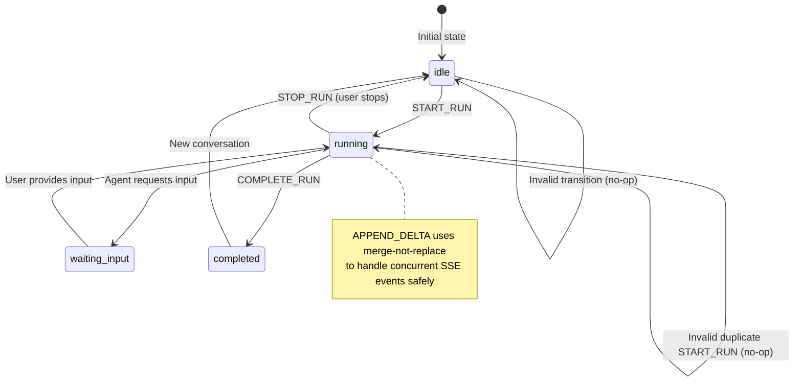
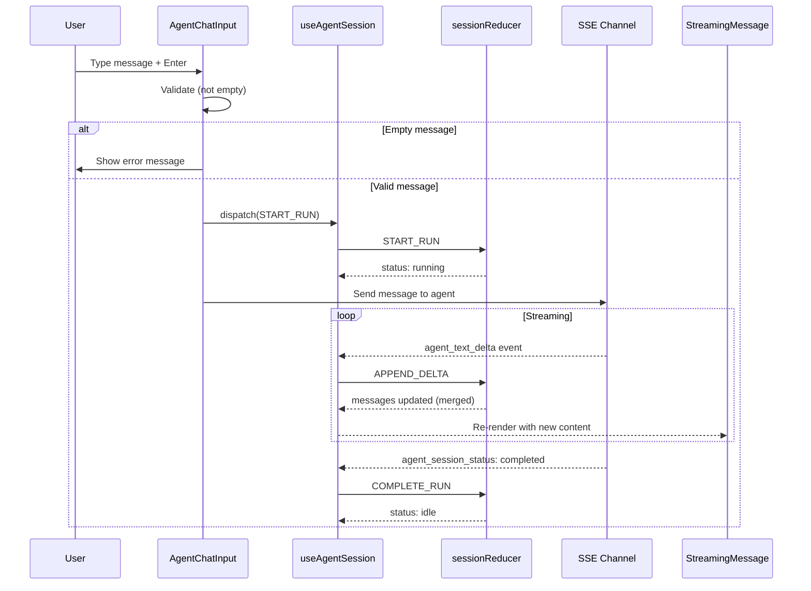

# Phase 2: Core Chat – Tasks & Alignment Brief

**Spec**: [../../web-agents-spec.md](../../web-agents-spec.md)
**Plan**: [../../web-agents-plan.md](../../web-agents-plan.md)
**Date**: 2026-01-26

---

## Executive Briefing

### Purpose

This phase implements the core chat interface for the Multi-Agent Web UI: session state management, message streaming components, markdown rendering, and input handling. Without these components, users cannot interact with agents through the web interface.

### What We're Building

A complete chat interaction layer consisting of:
- **sessionReducer**: Pure reducer for session state machine (idle → running → waiting_input → completed)
- **useAgentSession hook**: React hook wrapping reducer with dispatch, integrating with SSE via `useSSE`
- **AgentChatInput**: Text input component with Enter-to-submit, accessibility-first design (submit never disabled)
- **StreamingMessage**: Renders agent responses with live markdown during streaming (reuses `MarkdownServer`)
- **AgentStatusIndicator**: Visual status display (running=blue pulse, waiting=amber, idle=gray, error=red)
- **AgentChatView**: Container component assembling all chat UI elements
- **Context window display**: Token usage percentage with warning thresholds

### User Value

Users will be able to:
- Send messages to agents and see real-time streaming responses (AC-06, AC-07)
- See properly formatted markdown with syntax highlighting (AC-09)
- Understand agent status at a glance via color indicators (AC-11)
- Monitor context window usage to avoid hitting limits (AC-12)
- Navigate entirely by keyboard with accessible submit buttons (AC-15)

### Example

**Before**: Phase 1 provides schemas and storage, but no UI to interact with agents.

**After**:
```typescript
// Session reducer handles state transitions
const { state, dispatch } = useAgentSession(sessionId);

// User types message and presses Enter
dispatch({ type: 'START_RUN' }); // idle → running
await sendToAgent(message);

// SSE events update state as agent responds
// agent_text_delta → APPEND_DELTA action → streaming message updates
// agent_session_status → UPDATE_STATUS action → status indicator updates

dispatch({ type: 'COMPLETE_RUN' }); // running → idle
```

---

## Objectives & Scope

### Objective

Build the primary chat interface with message streaming, markdown rendering, and input handling as specified in Plan Phase 2. This phase must pass all quality gates before Phase 3 (Multi-Session) can begin.

**Behavior Checklist** (from Plan acceptance criteria):
- [ ] All tests passing: `pnpm test test/unit/web/hooks/useAgentSession.test.ts test/unit/web/components/agents/*.test.tsx`
- [ ] Test coverage >80%
- [ ] Keyboard navigation works (Tab, Enter, Escape)
- [ ] Submit button never disabled
- [ ] Markdown renders correctly (code blocks, links, lists)
- [ ] Status indicator shows correct colors
- [ ] Lint passes
- [ ] TypeScript strict mode passes

### Goals

- ✅ Implement `sessionReducer` with all state transitions (idle, running, waiting_input, completed)
- ✅ Implement `useAgentSession` hook with action dispatch and SSE integration
- ✅ Create `AgentChatInput` with Enter-to-submit, Shift+Enter for newline, never-disabled submit
- ✅ Create `StreamingMessage` that renders markdown continuously during streaming
- ✅ Create `AgentStatusIndicator` with color mapping for all states
- ✅ Create `AgentChatView` container assembling message list, input, and status bar
- ✅ Implement context window usage display with warning thresholds

### Non-Goals

- ❌ Multi-session orchestration (Phase 3)
- ❌ Session list and switching UI (Phase 3)
- ❌ Agent routes (`/agents`, `/agents/[sessionId]`) (Phase 3)
- ❌ Slash command processing (`/compact`, `/help`) (Phase 4)
- ❌ Archive/restore functionality (Phase 4)
- ❌ Mobile-specific layouts or h-dvh optimization (Phase 4)
- ❌ Message virtualization (react-window) – defer unless performance issues observed
- ❌ Two-phase markdown rendering – live markdown confirmed acceptable (MF-11)

---

## Architecture Map

### Component Diagram

```mermaid
flowchart TD
    classDef pending fill:#9E9E9E,stroke:#757575,color:#fff
    classDef inprogress fill:#FF9800,stroke:#F57C00,color:#fff
    classDef completed fill:#4CAF50,stroke:#388E3C,color:#fff
    classDef blocked fill:#F44336,stroke:#D32F2F,color:#fff

    style Phase fill:#F5F5F5,stroke:#E0E0E0
    style Hooks fill:#E3F2FD,stroke:#1976D2
    style Components fill:#E8F5E9,stroke:#388E3C
    style Tests fill:#FCE4EC,stroke:#C2185B

    subgraph Phase["Phase 2: Core Chat"]
        direction TB

        subgraph Hooks["State Management"]
            T001["T001: sessionReducer tests"]:::pending
            T002["T002: sessionReducer impl"]:::pending
            T003["T003: useAgentSession tests"]:::pending
            T004["T004: useAgentSession impl"]:::pending

            T001 --> T002
            T002 --> T003
            T003 --> T004
        end

        subgraph Components["UI Components"]
            T005["T005: AgentChatInput tests"]:::pending
            T006["T006: AgentChatInput impl"]:::pending
            T007["T007: StreamingMessage tests"]:::pending
            T008["T008: StreamingMessage impl"]:::pending
            T009["T009: AgentStatusIndicator tests"]:::pending
            T010["T010: AgentStatusIndicator impl"]:::pending
            T011["T011: AgentChatView tests"]:::pending
            T012["T012: AgentChatView impl"]:::pending
            T013["T013: ContextWindow tests"]:::pending
            T014["T014: ContextWindow impl"]:::pending

            T004 --> T005
            T005 --> T006
            T004 --> T007
            T007 --> T008
            T009 --> T010
            T006 --> T011
            T008 --> T011
            T010 --> T011
            T011 --> T012
            T013 --> T014
            T014 --> T012
        end
    end

    subgraph Files["Files"]
        F1["/apps/web/src/hooks/useAgentSession.ts"]:::pending
        F2["/apps/web/src/components/agents/agent-chat-input.tsx"]:::pending
        F3["/apps/web/src/components/agents/streaming-message.tsx"]:::pending
        F4["/apps/web/src/components/agents/agent-status-indicator.tsx"]:::pending
        F5["/apps/web/src/components/agents/agent-chat-view.tsx"]:::pending
        F6["/apps/web/src/components/agents/context-window-display.tsx"]:::pending
        F7["/test/unit/web/hooks/useAgentSession.test.ts"]:::pending
        F8["/test/unit/web/components/agents/agent-chat-input.test.tsx"]:::pending
        F9["/test/unit/web/components/agents/streaming-message.test.tsx"]:::pending
        F10["/test/unit/web/components/agents/agent-status-indicator.test.tsx"]:::pending
        F11["/test/unit/web/components/agents/agent-chat-view.test.tsx"]:::pending
        F12["/test/unit/web/components/agents/context-window-display.test.tsx"]:::pending
    end

    T002 -.-> F1
    T004 -.-> F1
    T006 -.-> F2
    T008 -.-> F3
    T010 -.-> F4
    T012 -.-> F5
    T014 -.-> F6
    T001 -.-> F7
    T003 -.-> F7
    T005 -.-> F8
    T007 -.-> F9
    T009 -.-> F10
    T011 -.-> F11
    T013 -.-> F12
```

<!-- Status: grey=pending, orange=in-progress, green=completed, red=blocked -->
<!-- Updated by plan-6 during implementation -->



### Task-to-Component Mapping

<!-- Status: ⬜ Pending | 🟧 In Progress | ✅ Complete | 🔴 Blocked -->

| Task | Component(s) | Files | Status | Comment |
|------|-------------|-------|--------|---------|
| T001 | sessionReducer Tests | `/test/unit/web/hooks/useAgentSession.test.ts` | ⬜ Pending | TDD RED: all state transitions |
| T002 | sessionReducer | `/apps/web/src/hooks/useAgentSession.ts` | ⬜ Pending | TDD GREEN: pure reducer impl |
| T003 | useAgentSession Tests | `/test/unit/web/hooks/useAgentSession.test.ts` | ⬜ Pending | TDD RED: hook integration |
| T004 | useAgentSession | `/apps/web/src/hooks/useAgentSession.ts` | ⬜ Pending | TDD GREEN: hook wrapping reducer |
| T005 | AgentChatInput Tests | `/test/unit/web/components/agents/agent-chat-input.test.tsx` | ⬜ Pending | TDD RED: input behavior, a11y |
| T006 | AgentChatInput | `/apps/web/src/components/agents/agent-chat-input.tsx` | ⬜ Pending | TDD GREEN: Enter submit, never disabled |
| T007 | StreamingMessage Tests | `/test/unit/web/components/agents/streaming-message.test.tsx` | ⬜ Pending | TDD RED: streaming, markdown |
| T008 | StreamingMessage | `/apps/web/src/components/agents/streaming-message.tsx` | ⬜ Pending | TDD GREEN: uses MarkdownServer |
| T009 | AgentStatusIndicator Tests | `/test/unit/web/components/agents/agent-status-indicator.test.tsx` | ⬜ Pending | TDD RED: color mapping |
| T010 | AgentStatusIndicator | `/apps/web/src/components/agents/agent-status-indicator.tsx` | ⬜ Pending | TDD GREEN: status colors |
| T011 | AgentChatView Tests | `/test/unit/web/components/agents/agent-chat-view.test.tsx` | ⬜ Pending | TDD RED: integration |
| T012 | AgentChatView | `/apps/web/src/components/agents/agent-chat-view.tsx` | ⬜ Pending | TDD GREEN: container assembly |
| T013 | ContextWindow Tests | `/test/unit/web/components/agents/context-window-display.test.tsx` | ⬜ Pending | TDD RED: percentage, thresholds |
| T014 | ContextWindow | `/apps/web/src/components/agents/context-window-display.tsx` | ⬜ Pending | TDD GREEN: usage display |

---

## Tasks

| Status | ID | Task | CS | Type | Dependencies | Absolute Path(s) | Validation | Subtasks | Notes |
|--------|------|------|----|------|--------------|------------------|------------|----------|-------|
| [ ] | T001 | Write tests for `sessionReducer` state transitions | 3 | Test | – | `/home/jak/substrate/007-manage-workflows/test/unit/web/hooks/useAgentSession.test.ts` | Tests cover: all action types (START_RUN, APPEND_DELTA, UPDATE_STATUS, COMPLETE_RUN, SET_ERROR, CLEAR_ERROR), invalid transitions rejected (same ref returned), merge-not-replace for deltas | – | Plan task 2.1; Per HF-08: merge-not-replace pattern |
| [ ] | T002 | Implement `sessionReducer` | 2 | Core | T001 | `/home/jak/substrate/007-manage-workflows/apps/web/src/hooks/useAgentSession.ts` | All T001 tests pass; pure function with state machine transitions; handles concurrent SSE events safely | – | Plan task 2.2 |
| [ ] | T003 | Write tests for `useAgentSession` hook | 2 | Test | T002 | `/home/jak/substrate/007-manage-workflows/test/unit/web/hooks/useAgentSession.test.ts` | Tests cover: action dispatch, state updates via reducer, memoization (dispatch stable across renders), integration with session store | – | Plan task 2.3; Uses renderHook |
| [ ] | T004 | Implement `useAgentSession` hook | 2 | Core | T003 | `/home/jak/substrate/007-manage-workflows/apps/web/src/hooks/useAgentSession.ts` | All T003 tests pass; wraps sessionReducer; dispatch is memoized; loads from AgentSessionStore (Phase 1) | – | Plan task 2.4 |
| [ ] | T005 | Write tests for `AgentChatInput` component | 2 | Test | T004 | `/home/jak/substrate/007-manage-workflows/test/unit/web/components/agents/agent-chat-input.test.tsx` | Tests cover: Enter key submits, button click submits, Shift+Enter inserts newline, submit never disabled (per MF-09), empty submit shows error, Tab navigation, ARIA labels | – | Plan task 2.5; Slash commands in Phase 4 |
| [ ] | T006 | Implement `AgentChatInput` component | 2 | Core | T005 | `/home/jak/substrate/007-manage-workflows/apps/web/src/components/agents/agent-chat-input.tsx` | All T005 tests pass; textarea with auto-expand; submit button always enabled; validates on submit | – | Plan task 2.6; Per MF-09: never disable submit |
| [ ] | T007 | Write tests for `StreamingMessage` component | 2 | Test | T004 | `/home/jak/substrate/007-manage-workflows/test/unit/web/components/agents/streaming-message.test.tsx` | Tests cover: partial content renders, completed content renders, markdown renders (code blocks, links, lists), user vs assistant styling | – | Plan task 2.7; Uses MarkdownServer |
| [ ] | T008 | Implement `StreamingMessage` component | 2 | Core | T007 | `/home/jak/substrate/007-manage-workflows/apps/web/src/components/agents/streaming-message.tsx` | All T007 tests pass; renders markdown continuously during streaming (per MF-11); reuses MarkdownServer, CodeBlock (per MF-12) | – | Plan task 2.8; Per MF-11, MF-12: live markdown with existing components |
| [ ] | T009 | Write tests for `AgentStatusIndicator` component | 1 | Test | – | `/home/jak/substrate/007-manage-workflows/test/unit/web/components/agents/agent-status-indicator.test.tsx` | Tests cover: all status states (idle, running, waiting_input, completed, error), correct color mapping (running=blue, waiting=amber, idle=gray, error=red), ARIA live region | – | Plan task 2.9 |
| [ ] | T010 | Implement `AgentStatusIndicator` component | 1 | Core | T009 | `/home/jak/substrate/007-manage-workflows/apps/web/src/components/agents/agent-status-indicator.tsx` | All T009 tests pass; color-coded status display with pulsing animation for running | – | Plan task 2.10 |
| [ ] | T011 | Write tests for `AgentChatView` assembly | 3 | Test | T006, T008, T010, T014 | `/home/jak/substrate/007-manage-workflows/test/unit/web/components/agents/agent-chat-view.test.tsx` | Tests cover: message list displays, input integration works, status bar shows indicator and context usage, scroll behavior on new messages | – | Plan task 2.11; Integration test |
| [ ] | T012 | Implement `AgentChatView` component | 3 | Core | T011 | `/home/jak/substrate/007-manage-workflows/apps/web/src/components/agents/agent-chat-view.tsx` | All T011 tests pass; assembles StreamingMessage list, AgentChatInput, status bar with AgentStatusIndicator and ContextWindowDisplay | – | Plan task 2.12 |
| [ ] | T013 | Write tests for context window usage display | 1 | Test | – | `/home/jak/substrate/007-manage-workflows/test/unit/web/components/agents/context-window-display.test.tsx` | Tests cover: percentage calculation, warning at >75%, critical at >90%, unavailable display for Copilot (token count may not be available) | – | Plan task 2.13 |
| [ ] | T014 | Implement context window UI in status bar | 1 | Core | T013 | `/home/jak/substrate/007-manage-workflows/apps/web/src/components/agents/context-window-display.tsx` | All T013 tests pass; displays percentage, color-coded warnings, graceful handling when usage unavailable | – | Plan task 2.14 |

---

## Alignment Brief

### Prior Phases Review

#### Phase 1: Foundation (Complete ✅)

**A. Deliverables Created**

| File | Purpose | Key Exports |
|------|---------|-------------|
| `/home/jak/substrate/007-manage-workflows/apps/web/src/lib/schemas/agent-session.schema.ts` | Session validation | `AgentSessionSchema`, `AgentMessageSchema`, `SessionStatusSchema`, `AgentTypeSchema` |
| `/home/jak/substrate/007-manage-workflows/apps/web/src/lib/schemas/agent-events.schema.ts` | SSE agent events | `AgentTextDeltaEventSchema`, `AgentSessionStatusEventSchema`, `AgentUsageUpdateEventSchema`, `AgentErrorEventSchema`, `AgentEventSchema` |
| `/home/jak/substrate/007-manage-workflows/apps/web/src/lib/stores/agent-session.store.ts` | localStorage persistence | `AgentSessionStore` class |
| `/home/jak/substrate/007-manage-workflows/apps/web/src/lib/schemas/sse-events.schema.ts` | Extended SSE schema | `sseEventSchema` (now includes 11 event types) |

**B. Lessons Learned**

- TDD RED/GREEN workflow effective: write failing test first, implement minimal code
- Domain-based test paths (`test/unit/web/schemas/`, `test/unit/web/stores/`) maintain organization
- Test Doc format provides valuable contract documentation

**C. Technical Discoveries**

| Type | Discovery | Resolution |
|------|-----------|------------|
| gotcha | Node.js `globalThis.localStorage` is empty object without methods | Check `typeof localStorage.getItem === 'function'` not just truthy |

**D. Dependencies Exported (Available for Phase 2)**

- `AgentSessionSchema` – for typing session state in reducer
- `SessionStatusSchema` – for status enum in reducer and components
- `AgentEventSchema` – for SSE event handling in hook
- `AgentSessionStore` – for persistence integration in `useAgentSession`
- `DI_TOKENS.SESSION_STORE` – for DI container resolution

**E. Critical Findings Applied**

- CF-02 (Two-pass hydration): Implemented in `AgentSessionStore.loadSession()`
- CF-03 (SSE additive-only): Agent events appended to `sseEventSchema` union

**F. Incomplete/Blocked Items**

None – all 10 tasks completed.

**G. Test Infrastructure**

- 11 tests in `agent-session.schema.test.ts`
- 10 tests in `agent-events.schema.test.ts`
- 12 tests in `agent-session.store.test.ts`
- 11 tests in `sse-events.contract.test.ts`
- 3 new tests in `di-container.test.ts`
- FakeLocalStorage available at `test/fakes/fake-local-storage.ts`
- FakeResizeObserver verified at `test/fakes/fake-resize-observer.ts`

**H. Technical Debt**

None introduced.

**I. Architectural Decisions**

- Direct instantiation of fakes in `beforeEach()` (per DYK #4 from Plan 010)
- Constants over configuration for limits (1000 message pruning limit)
- Two-pass hydration pattern for localStorage

**J. Scope Changes**

None.

**K. Key Log References**

- `tasks/phase-1-foundation/execution.log.md` – Full implementation narrative
- Task T009 discovery: localStorage gotcha in DI container setup

### Critical Findings Affecting This Phase

| Finding | Title | Constraint/Requirement | Addressed By |
|---------|-------|------------------------|--------------|
| CF-01 | No Chat UI Exists | Build entire chat UI from scratch in `apps/web/src/components/agents/` | T005-T014 |
| CF-02 | Session Persistence Gap | Use AgentSessionStore (Phase 1) for persistence; hook should integrate with store | T003, T004 |
| HF-08 | Race Condition SSE vs State | Design reducers with merge-not-replace pattern for concurrent SSE events | T001, T002 |
| MF-09 | Never Disable Submit Buttons | Submit button always enabled; validate on submit, show error messages | T005, T006 |
| MF-10 | Keep Agent Events Abstracted | UI receives only `AgentEvent` types from `@chainglass/shared`, no raw parsing | T004 |
| MF-11 | Live Markdown During Streaming | Render markdown continuously (partial appearance acceptable) | T007, T008 |
| MF-12 | Existing Markdown Components | Reuse `MarkdownServer`, `CodeBlock`, `shiki-processor` | T008 |

### ADR Decision Constraints

- **ADR-0004: DI Container Architecture** – Use `useFactory` pattern, no decorators
  - Constrains: T004 (hook may resolve SESSION_STORE from container)
  - Addressed by: Follow Phase 1 DI patterns

- **ADR-0005: Next.js MCP Developer Experience Loop** – Headless TDD + Playwright visual verification
  - Constrains: All UI components (T005-T014)
  - Workflow: **Headless TDD first** → tests pass → **Playwright MCP visual verification**
  - Reference: `/docs/adr/adr-0005-nextjs-mcp-developer-experience-loop.md`

### Invariants & Guardrails

- **Accessibility**: Submit button must never have `disabled` attribute
- **State machine**: Only valid transitions allowed (idle → running → idle/waiting_input/completed)
- **Shiki server-only**: `StreamingMessage` must use `MarkdownServer` (server component), not client-side highlighting
- **No mocks**: Use fakes only (FakeEventSource, FakeLocalStorage, callback trackers)

### Inputs to Read

| File | Purpose |
|------|---------|
| `/apps/web/src/lib/schemas/agent-session.schema.ts` | Session types for reducer state |
| `/apps/web/src/lib/schemas/agent-events.schema.ts` | Event types for SSE handling |
| `/apps/web/src/lib/stores/agent-session.store.ts` | Store for persistence integration |
| `/apps/web/src/hooks/useSSE.ts` | Existing SSE hook pattern to integrate |
| `/apps/web/src/components/viewers/markdown-server.tsx` | Server-side markdown to reuse |
| `/apps/web/src/components/viewers/code-block.tsx` | Code block rendering to reuse |
| `/test/fakes/fake-event-source.ts` | Fake for SSE testing |
| `/test/fakes/fake-resize-observer.ts` | Fake for textarea tests |

**External Reference** (via FlowSpace):
| Graph | File | Purpose |
|-------|------|---------|
| `vibe-kanban` | `apps/web/src/components/agents/agent-session-dialog.tsx` | UI patterns: context bar, message bubbles, streaming indicator |

### Visual Alignment Aids

#### State Flow Diagram



#### Sequence Diagram: Message Send Flow



### UI Reference Patterns (from vibe-kanban)

**Source**: Explored via FlowSpace from `~/github/vibe-kanban` - their `AgentSessionDialog` component.

#### Context Window Progress Bar
```tsx
// Color thresholds: >90% red, >75% amber, else gradient
<div className="h-1.5 bg-muted rounded-full overflow-hidden">
  <div
    className={cn(
      'h-full rounded-full transition-all duration-500',
      usage > 90 ? 'bg-red-500' :
      usage > 75 ? 'bg-amber-500' : 'bg-gradient-to-r from-violet-500 to-purple-500'
    )}
    style={{ width: `${usage}%` }}
  />
</div>
```

#### Message Bubble Styling
```tsx
// User: right-aligned, primary color, rounded-br-sm
// Assistant: left-aligned, muted bg, rounded-bl-sm
<div className={cn(
  'max-w-[85%] rounded-2xl px-4 py-2.5',
  isUser && 'bg-primary text-primary-foreground rounded-br-sm',
  isAssistant && 'bg-muted rounded-bl-sm'
)}>
```

#### Streaming Indicator (bouncing dots)
```tsx
{message.isStreaming && (
  <span className="flex items-center gap-1 text-[10px] text-blue-500">
    <div className="flex gap-0.5">
      <div className="w-1 h-1 rounded-full bg-blue-500 animate-bounce" style={{ animationDelay: '0ms' }} />
      <div className="w-1 h-1 rounded-full bg-blue-500 animate-bounce" style={{ animationDelay: '150ms' }} />
      <div className="w-1 h-1 rounded-full bg-blue-500 animate-bounce" style={{ animationDelay: '300ms' }} />
    </div>
    streaming
  </span>
)}
```

#### Key Differences from vibe-kanban (per MF-09)
| Aspect | vibe-kanban | Our Implementation |
|--------|-------------|-------------------|
| Submit trigger | `Cmd/Ctrl + Enter` | `Enter` (Shift+Enter for newline) |
| Submit button | Disabled when empty | **Never disabled** (validate on submit) |
| Empty validation | Prevents send | Shows error message after submit |

**Rationale**: MF-09 mandates accessible submit buttons that are never disabled. We validate on submit and display inline errors instead.

---

### Test Plan (Full TDD - Fakes Only)

#### Development Workflow: Headless TDD → Playwright Verification

**Per ADR-0005**, this phase uses a two-stage development workflow:

**Stage 1: Headless TDD (Primary)**
- Build components test-first using `@testing-library/react`
- All tests run headless via Vitest (`pnpm test`)
- Focus on behavior, accessibility, state management
- No visual browser required during TDD loop

**Stage 2: Playwright MCP Visual Verification (After TDD Green)**
Once tests pass, use Next.js MCP + Playwright to visually verify:

```bash
# 1. Ensure dev server running
pnpm dev

# 2. Agent uses browser_eval MCP tool:
browser_eval(action: "start", headless: true)
browser_eval(action: "navigate", url: "http://localhost:3001/demo/agents")  # or test page
browser_eval(action: "screenshot")  # Agent views screenshot
browser_eval(action: "console_messages")  # Check for JS errors
```

**When to use Playwright verification:**
- After T012 (AgentChatView) is complete - verify full chat assembly renders
- After T014 (ContextWindowDisplay) - verify progress bar visual appearance
- If any visual regression suspected
- Before marking phase complete

**MCP Tools Available** (from `next-devtools`):
| Tool | Purpose |
|------|---------|
| `nextjs_index` | Discover running dev servers and MCP tools |
| `nextjs_call` | Call Next.js MCP tools (get_errors, get_routes) |
| `browser_eval` | Playwright browser automation (screenshot, navigate, console) |

---

**Test Pattern** (per Phase 1): Use **direct instantiation** of fakes in `beforeEach()`, not DI container.

```typescript
// ✅ CORRECT - Direct instantiation
describe('AgentChatInput', () => {
  let handler: FakeMessageHandler;

  beforeEach(() => {
    handler = new FakeMessageHandler();
  });

  it('should submit on Enter', async () => {
    render(<AgentChatInput onMessage={handler.onMessage} />);
    // ...
  });
});
```

#### T001/T002: sessionReducer Tests

| Test Name | Rationale | Expected Output |
|-----------|-----------|-----------------|
| `should transition from idle to running on START_RUN` | Core state machine | `{ status: 'running' }` |
| `should reject START_RUN when already running` | Prevents double submission | Same ref returned |
| `should append delta with merge-not-replace` | Per HF-08: SSE race handling | Messages array updated, other state preserved |
| `should transition to completed on COMPLETE_RUN` | Normal completion flow | `{ status: 'completed' }` |
| `should set error on SET_ERROR` | Error handling | `{ error: { message, code } }` |
| `should clear error on CLEAR_ERROR` | Error recovery | `{ error: null }` |
| `should handle waiting_input status` | Agent needs user input | `{ status: 'waiting_input' }` |

#### T005/T006: AgentChatInput Tests

| Test Name | Rationale | Expected Output |
|-----------|-----------|-----------------|
| `should submit message on Enter key` | Standard chat UX | onMessage callback called |
| `should submit message on button click` | Mouse users | onMessage callback called |
| `should insert newline on Shift+Enter` | Multi-line messages | Newline in textarea |
| `should never disable submit button` | Per MF-09: accessibility | No `disabled` attr |
| `should show error for empty submit` | Validation feedback | Error message visible |
| `should clear input after submit` | UX expectation | Input empty |
| `should have ARIA labels` | Accessibility | aria-label present |

**Callback Tracking Pattern** (no vi.fn()):
```typescript
class FakeMessageHandler {
  calls: string[] = [];
  onMessage = (msg: string) => { this.calls.push(msg); };
  assertCalledWith(expected: string) {
    expect(this.calls).toContain(expected);
  }
  assertNotCalled() {
    expect(this.calls).toHaveLength(0);
  }
}
```

#### T007/T008: StreamingMessage Tests

| Test Name | Rationale | Expected Output |
|-----------|-----------|-----------------|
| `should render partial content during streaming` | Live streaming feedback | Partial text visible |
| `should show streaming indicator when isStreaming` | Visual feedback | Bouncing dots visible |
| `should hide streaming indicator when complete` | Clean final state | No indicator |
| `should render completed content` | Final message display | Full text visible |
| `should render markdown code blocks` | Code formatting | Code block rendered |
| `should render markdown links` | Link formatting | Clickable links |
| `should render markdown lists` | List formatting | List items visible |
| `should style user messages right-aligned` | Visual differentiation | `bg-primary`, right side |
| `should style assistant messages left-aligned` | Visual differentiation | `bg-muted`, left side |

#### T009/T010: AgentStatusIndicator Tests

| Test Name | Rationale | Expected Output |
|-----------|-----------|-----------------|
| `should show gray for idle` | Visual status | Gray indicator |
| `should show blue pulse for running` | Active feedback | Blue with animation |
| `should show amber for waiting_input` | Attention needed | Amber indicator |
| `should show gray for completed` | Session done | Gray indicator |
| `should show red for error` | Error visibility | Red indicator |
| `should have ARIA live region` | Accessibility | Status announced |

#### T013/T014: ContextWindowDisplay Tests

| Test Name | Rationale | Expected Output |
|-----------|-----------|-----------------|
| `should display percentage text` | Token awareness | "45%" visible |
| `should render progress bar with correct width` | Visual feedback | Bar at 45% width |
| `should show gradient color under 75%` | Normal state | Purple gradient |
| `should show amber at 75%+` | Approaching limit | Amber bar and text |
| `should show red at 90%+` | Near limit | Red bar and text |
| `should handle unavailable gracefully` | Copilot limitation | Hidden or "N/A" |

### Step-by-Step Implementation Outline

1. **T001**: Create `test/unit/web/hooks/useAgentSession.test.ts`
   - Import from non-existent hook (will fail)
   - Write reducer tests with Test Doc format
   - Run: `pnpm test test/unit/web/hooks/useAgentSession.test.ts` → RED

2. **T002**: Create `apps/web/src/hooks/useAgentSession.ts`
   - Define `SessionAction` union type
   - Implement `sessionReducer` with state machine logic
   - Handle merge-not-replace for APPEND_DELTA
   - Run: `pnpm test test/unit/web/hooks/useAgentSession.test.ts` → GREEN (reducer tests)

3. **T003**: Extend test file with hook tests
   - Use `renderHook` from `@testing-library/react`
   - Test dispatch behavior and state updates
   - Run: tests still fail → RED

4. **T004**: Implement `useAgentSession` hook
   - Wrap reducer with `useReducer`
   - Memoize dispatch with `useCallback`
   - Integrate with `AgentSessionStore` for persistence
   - Run: `pnpm test test/unit/web/hooks/useAgentSession.test.ts` → GREEN

5. **T005**: Create `test/unit/web/components/agents/agent-chat-input.test.tsx`
   - Define FakeMessageHandler class
   - Write tests for submit, keyboard, accessibility
   - Run: `pnpm test test/unit/web/components/agents/agent-chat-input.test.tsx` → RED

6. **T006**: Create `apps/web/src/components/agents/agent-chat-input.tsx`
   - Textarea with auto-expand (FakeResizeObserver in tests)
   - Button always enabled (no `disabled` prop)
   - Validate on submit, show error for empty
   - Run: tests → GREEN

7. **T007**: Create `test/unit/web/components/agents/streaming-message.test.tsx`
   - Tests for streaming, completion, markdown rendering
   - Run: → RED

8. **T008**: Create `apps/web/src/components/agents/streaming-message.tsx`
   - Use `MarkdownServer` for rendering
   - Handle isStreaming prop for partial display
   - Add bouncing dots streaming indicator (per vibe-kanban pattern)
   - User vs assistant bubble styling (right/left aligned, different colors)
   - Run: tests → GREEN

9. **T009**: Create `test/unit/web/components/agents/agent-status-indicator.test.tsx`
   - Tests for all status states and colors
   - Run: → RED

10. **T010**: Create `apps/web/src/components/agents/agent-status-indicator.tsx`
    - Color mapping: idle=gray, running=blue, waiting=amber, error=red
    - CSS animation for running pulse
    - ARIA live region
    - Run: tests → GREEN

11. **T011**: Create `test/unit/web/components/agents/agent-chat-view.test.tsx`
    - Integration tests for full chat assembly
    - Run: → RED

12. **T012**: Create `apps/web/src/components/agents/agent-chat-view.tsx`
    - Compose: message list, input, status bar
    - Wire up useAgentSession hook
    - Run: tests → GREEN
    - **🎯 CHECKPOINT**: Run Playwright MCP visual verification (per ADR-0005)

13. **T013**: Create `test/unit/web/components/agents/context-window-display.test.tsx`
    - Tests for percentage, thresholds
    - Run: → RED

14. **T014**: Create `apps/web/src/components/agents/context-window-display.tsx`
    - Progress bar with color thresholds (per vibe-kanban pattern)
    - >90% red, >75% amber, else gradient purple
    - Percentage text with matching colors
    - Handle unavailable gracefully (hidden or "N/A")
    - Run: tests → GREEN
    - **🎯 FINAL CHECKPOINT**: Run full Playwright MCP visual verification before phase completion

### Commands to Run

```bash
# Environment setup (from repo root)
cd /home/jak/substrate/007-manage-workflows
pnpm install  # if needed

# Ensure agents component directory exists
mkdir -p apps/web/src/components/agents

# Run specific test files during TDD
pnpm test test/unit/web/hooks/useAgentSession.test.ts
pnpm test test/unit/web/components/agents/agent-chat-input.test.tsx
pnpm test test/unit/web/components/agents/streaming-message.test.tsx
pnpm test test/unit/web/components/agents/agent-status-indicator.test.tsx
pnpm test test/unit/web/components/agents/agent-chat-view.test.tsx
pnpm test test/unit/web/components/agents/context-window-display.test.tsx

# Run all Phase 2 tests
pnpm test test/unit/web/hooks/useAgentSession.test.ts test/unit/web/components/agents/*.test.tsx

# Coverage check
pnpm test --coverage apps/web/src/hooks/useAgentSession.ts apps/web/src/components/agents/

# Verify no mocks used
grep -r "vi.mock\|jest.mock" test/unit/web/hooks test/unit/web/components/agents

# Lint and typecheck
pnpm lint apps/web/src/hooks/useAgentSession.ts apps/web/src/components/agents
pnpm typecheck

# ─────────────────────────────────────────────────────────────
# STAGE 2: Playwright MCP Visual Verification (per ADR-0005)
# Run AFTER all TDD tests pass
# ─────────────────────────────────────────────────────────────

# Ensure dev server is running (in separate terminal)
pnpm dev

# Use MCP tools via Claude Code or similar agent:
# 1. nextjs_index()                           # Discover dev server
# 2. nextjs_call(port, "get_errors")          # Check for build errors
# 3. browser_eval(action: "start", headless: true)
# 4. browser_eval(action: "navigate", url: "http://localhost:3001/demo/agents")
# 5. browser_eval(action: "screenshot")        # View rendered components
# 6. browser_eval(action: "console_messages")  # Check for JS errors

# Visual verification checklist:
# [ ] AgentChatView renders without errors
# [ ] Message bubbles display correctly (user right, assistant left)
# [ ] Streaming indicator animates
# [ ] Context window progress bar shows correct colors
# [ ] Status indicator colors match spec

# Verify Phase 1 tests still pass (no regressions)
pnpm test test/unit/web/schemas/agent-*.test.ts test/unit/web/stores/agent-*.test.ts
```

### Risks/Unknowns

| Risk | Severity | Likelihood | Mitigation |
|------|----------|------------|------------|
| MarkdownServer integration in tests | Medium | Medium | May need server component testing setup or simplified test rendering |
| Shiki server-only constraint | Medium | Low | StreamingMessage must be server component or use client-safe wrapper |
| Scroll behavior complexity | Low | Medium | Start simple; virtualization deferred unless needed |
| SSE event timing in tests | Low | Medium | FakeEventSource provides controllable timing |

### Ready Check

- [ ] Phase 1 complete: All 10 tasks ✅, tests passing
- [ ] Spec reviewed: AC-06, AC-07, AC-09, AC-11, AC-12, AC-15 understood
- [ ] Plan Phase 2 tasks mapped to T001-T014
- [ ] Critical Findings HF-08, MF-09, MF-10, MF-11, MF-12 incorporated
- [ ] Phase 1 outputs available: schemas, store, DI tokens
- [ ] Existing markdown components located: `apps/web/src/components/viewers/`
- [ ] Fakes available: FakeEventSource, FakeLocalStorage, FakeResizeObserver
- [ ] Commands documented for all quality gates
- [ ] Test Doc format will be used in all tests
- [ ] **ADR-0004 reviewed**: DI patterns from Phase 1 followed (useFactory, no decorators)
- [ ] **ADR-0005 reviewed**: Headless TDD → Playwright MCP visual verification workflow understood
- [ ] vibe-kanban UI patterns incorporated: context bar, message bubbles, streaming indicator

**Awaiting**: Human **GO** to proceed with implementation.

---

## Phase Footnote Stubs

<!-- Footnote entries will be added by plan-6 during implementation -->

| Footnote | Task | Description | Date |
|----------|------|-------------|------|
| | | | |

---

## Evidence Artifacts

Implementation will produce:
- `phase-2-core-chat/execution.log.md` - Detailed implementation narrative
- Test output showing all tests pass
- Coverage report showing >80% for new code
- Grep output confirming no mocks used

---

## Discoveries & Learnings

_Populated during implementation by plan-6. Log anything of interest to your future self._

| Date | Task | Type | Discovery | Resolution | References |
|------|------|------|-----------|------------|------------|
| | | | | | |

**Types**: `gotcha` | `research-needed` | `unexpected-behavior` | `workaround` | `decision` | `debt` | `insight`

**What to log**:
- Things that didn't work as expected
- External research that was required
- Implementation troubles and how they were resolved
- Gotchas and edge cases discovered
- Decisions made during implementation
- Technical debt introduced (and why)
- Insights that future phases should know about

_See also: `execution.log.md` for detailed narrative._

---

## Directory Layout

```
docs/plans/012-web-agents/
├── web-agents-spec.md
├── web-agents-plan.md
├── research-dossier.md
├── external-research/
│   ├── chat-ui-patterns.md
│   ├── session-management.md
│   └── sse-vs-websocket.md
└── tasks/
    ├── phase-1-foundation/
    │   ├── tasks.md          # Phase 1 dossier (complete)
    │   └── execution.log.md  # Phase 1 log (complete)
    └── phase-2-core-chat/
        ├── tasks.md          # This file
        └── execution.log.md  # Created by plan-6
```

---

**Dossier Created**: 2026-01-26
**Phase**: 2 of 5 (Core Chat)
**Phase Status**: ⏳ PENDING
**Next Step**: Await human **GO**, then run `/plan-6-implement-phase --phase "Phase 2: Core Chat" --plan "/home/jak/substrate/007-manage-workflows/docs/plans/012-web-agents/web-agents-plan.md"`
