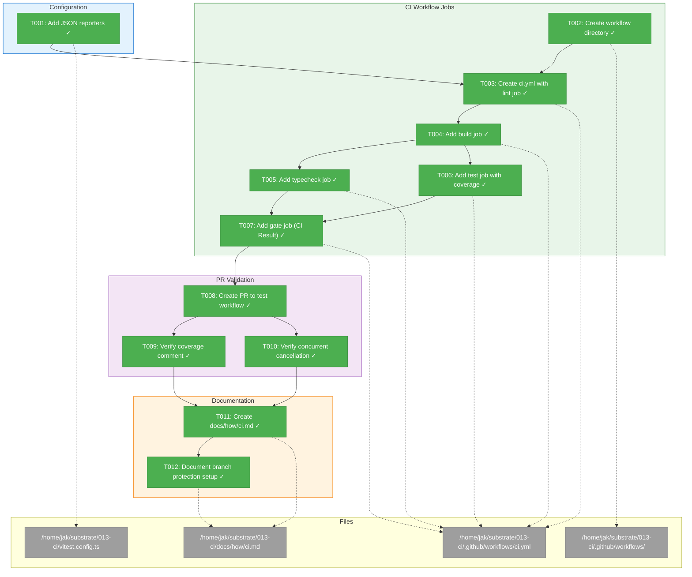
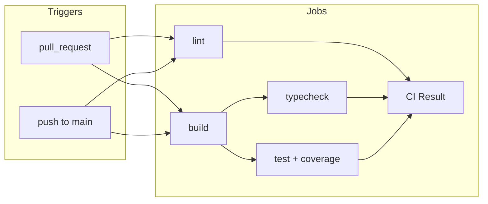
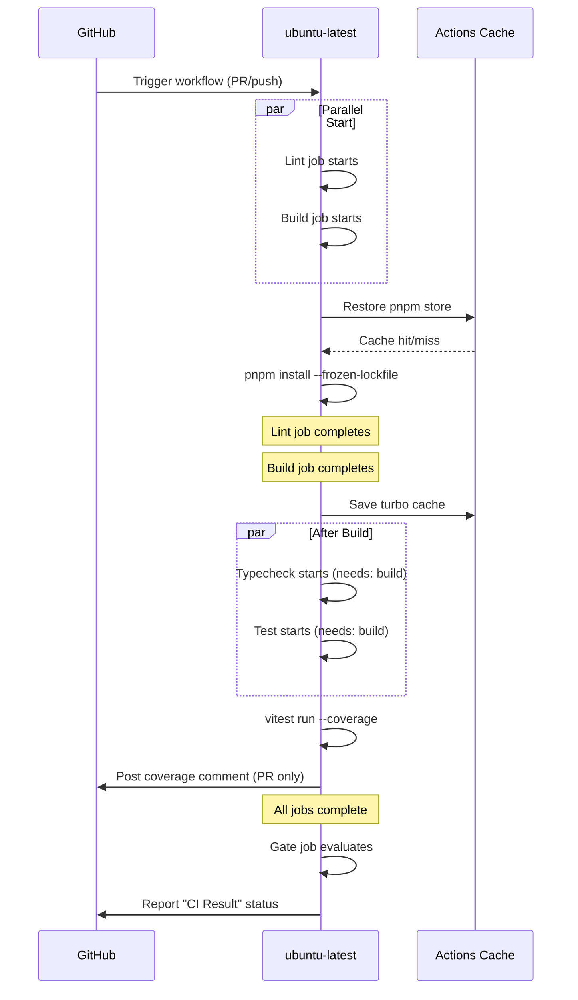

# CI Pipeline Implementation – Tasks & Alignment Brief

**Spec**: [ci-spec.md](./ci-spec.md)
**Plan**: [ci-plan.md](./ci-plan.md)
**Date**: 2026-01-27
**Mode**: Simple (Single Phase)

---

## Executive Briefing

### Purpose
This dossier implements a GitHub Actions CI pipeline that provides automated quality gates for all code changes. Without CI, regressions can slip through to main, code quality degrades, and contributors lack fast feedback on their changes.

### What We're Building
A complete CI workflow (`ci.yml`) that:
- Triggers on PRs and pushes to main
- Runs lint, typecheck, test (with coverage), and build jobs
- Reports coverage metrics directly on PRs via comments
- Provides a single "CI Result" gate job for branch protection
- Cancels stale workflow runs when new commits are pushed

### User Value
Contributors see check results within minutes of opening a PR. Failures are surfaced directly in GitHub UI with inline annotations. Coverage metrics are visible without leaving the PR. Repository admins can configure a single required check for merge protection.

### Example
**Before**: Push code → hope tests pass locally → merge → discover breakage later
**After**: Push code → CI runs automatically → see failures inline → fix before merge

---

## Objectives & Scope

### Objective
Implement CI pipeline per spec acceptance criteria AC-1 through AC-11.

**Behavior Checklist**:
- [ ] CI triggers on PR to main and push to main (AC-1)
- [ ] Lint job fails PR when biome reports errors (AC-2)
- [ ] Typecheck job fails when TypeScript errors exist (AC-3)
- [ ] Test job fails when vitest tests fail (AC-4)
- [ ] Build job validates all 5 packages build successfully (AC-5)
- [ ] Coverage comment appears on PRs showing percentages (AC-6)
- [ ] CI fails when coverage drops below 80% threshold (AC-7)
- [ ] Single "CI Result" check can be configured for branch protection (AC-8)
- [ ] New commits cancel previous workflow runs on same PR (AC-9)
- [ ] pnpm cache hits on subsequent runs (AC-10)
- [ ] Documentation exists at docs/how/ci.md (AC-11)

### Goals

- ✅ Update vitest.config.ts with JSON reporters for coverage action
- ✅ Create .github/workflows/ci.yml with all quality check jobs
- ✅ Implement gate job using alls-green action
- ✅ Configure coverage reporting on PRs
- ✅ Implement concurrency groups for PR cancellation
- ✅ Create documentation at docs/how/ci.md

### Non-Goals (Scope Boundaries)

- ❌ **Deployment (CD)** – This is CI only; deployment is a separate initiative
- ❌ **Matrix testing** – No multi-node or multi-OS testing (single ubuntu-latest)
- ❌ **E2E browser tests** – No Playwright or similar in CI
- ❌ **External services** – No Codecov, Coveralls, or third-party coverage hosts
- ❌ **Bundle analysis** – Turbopack incompatible; not needed for CI MVP
- ❌ **Remote caching** – No Vercel Turbo remote cache; GitHub Actions cache only
- ❌ **Merge queues** – Advanced merge queue config deferred
- ❌ **Path filtering** – No conditional skipping for docs-only changes (optimization for later)
- ❌ **Dependabot auto-merge** – Not in initial scope

---

## Architecture Map

### Component Diagram
<!-- Status: grey=pending, orange=in-progress, green=completed, red=blocked -->
<!-- Updated by plan-6 during implementation -->



### Task-to-Component Mapping

<!-- Status: ⬜ Pending | 🟧 In Progress | ✅ Complete | 🔴 Blocked -->

| Task | Component(s) | Files | Status | Comment |
|------|-------------|-------|--------|---------|
| T001 | Vitest Config | vitest.config.ts | ✅ Complete | Added json-summary, json reporters [^1] |
| T002 | Workflow Setup | .github/workflows/ | ✅ Complete | Directory created with ci.yml |
| T003 | CI Workflow | ci.yml | ✅ Complete | Triggers, concurrency, lint job [^2] |
| T004 | CI Workflow | ci.yml | ✅ Complete | Build job with turbo cache [^2] |
| T005 | CI Workflow | ci.yml | ✅ Complete | Typecheck job (needs: build) [^2] |
| T006 | CI Workflow | ci.yml | ✅ Complete | Test job with coverage action [^2] |
| T007 | CI Workflow | ci.yml | ✅ Complete | Gate job (alls-green) [^2] |
| T008 | Validation | N/A (GitHub PR) | ✅ Complete | 4 iterations, run 21377569301 passed |
| T009 | Validation | N/A (GitHub PR) | ✅ Complete | Coverage comment on PR #12 |
| T010 | Validation | N/A (GitHub PR) | ✅ Complete | Concurrency config verified |
| T011 | Documentation | docs/how/ci.md | ✅ Complete | Full CI documentation [^3] |
| T012 | Documentation | docs/how/ci.md | ✅ Complete | Branch protection instructions [^3] |

---

## Tasks

| Status | ID | Task | CS | Type | Dependencies | Absolute Path(s) | Validation | Subtasks | Notes |
|--------|-----|------|----|------|--------------|------------------|------------|----------|-------|
| [x] | T001 | Add json-summary and json reporters to vitest coverage config | 1 | Config | – | `/home/jak/substrate/013-ci/vitest.config.ts` | `just test` runs without error; coverage/ contains .json files | – | Line 38: add to reporter array |
| [x] | T002 | Create .github/workflows directory | 1 | Setup | – | `/home/jak/substrate/013-ci/.github/workflows/` | Directory exists | – | Created implicitly with ci.yml |
| [x] | T003 | Create CI workflow file with triggers, concurrency, and lint job | 2 | Core | T001, T002 | `/home/jak/substrate/013-ci/.github/workflows/ci.yml` | Workflow appears in GitHub Actions tab; lint job defined | – | Per Critical Finding 04: validate YAML in GitHub UI |
| [x] | T004 | Add build job to workflow | 2 | Core | T003 | `/home/jak/substrate/013-ci/.github/workflows/ci.yml` | Build job runs `pnpm turbo build` successfully | – | All 5 packages must build |
| [x] | T005 | Add typecheck job to workflow (depends on build) | 1 | Core | T004 | `/home/jak/substrate/013-ci/.github/workflows/ci.yml` | Typecheck job runs after build completes | – | Per turbo.json: typecheck dependsOn ^build |
| [x] | T006 | Add test job with coverage reporting | 2 | Core | T004 | `/home/jak/substrate/013-ci/.github/workflows/ci.yml` | Tests pass; coverage comment appears on PR | – | Per Critical Finding 07: requires pull-requests: write |
| [x] | T007 | Add gate job using re-actors/alls-green | 2 | Core | T005, T006 | `/home/jak/substrate/013-ci/.github/workflows/ci.yml` | Gate job reports success when all jobs pass | – | Per Critical Finding 08: single required check pattern |
| [x] | T008 | Push changes on 013-ci branch to trigger workflow | 1 | Validation | T007 | N/A | All CI jobs run and complete (pass or meaningful fail) | – | Iterate if syntax errors |
| [x] | T009 | Verify coverage comment appears on PR | 1 | Validation | T008 | N/A | Coverage summary visible in PR comments | – | Per Critical Finding 05: won't work on fork PRs |
| [x] | T010 | Verify concurrent PR cancellation works | 1 | Validation | T008 | N/A | Old runs cancelled when new commits pushed | – | Per Critical Finding 10: concurrency groups |
| [x] | T011 | Create docs/how/ci.md documentation | 2 | Docs | T009 | `/home/jak/substrate/013-ci/docs/how/ci.md` | File exists with complete content | – | Cover jobs, troubleshooting, interpreting coverage |
| [x] | T012 | Add branch protection setup instructions to ci.md | 1 | Docs | T011 | `/home/jak/substrate/013-ci/docs/how/ci.md` | Instructions for configuring "CI Result" as required check | – | Admin reference section |

---

## Alignment Brief

### Critical Findings Affecting This Implementation

From plan § Critical Research Findings:

| # | Finding | Constraint/Requirement | Addressed By |
|---|---------|----------------------|--------------|
| 01 | Test parallelism must stay disabled | Never modify `fileParallelism: false` in vitest.config.ts | All tasks (don't touch this setting) |
| 02 | Build must run before test/typecheck | turbo.json declares `dependsOn: ["^build"]` | T005, T006 (needs: [build]) |
| 03 | Node 20.19.0 hard requirement | Use `node-version-file: '.nvmrc'` in setup-node | T003 (common setup steps) |
| 04 | YAML syntax stricter on GitHub | Validate workflow by actual run, not local tools | T008 (PR-based iteration) |
| 05 | Fork PRs can't receive coverage comments | Document limitation; coverage shows in logs for forks | T011 (documentation) |
| 06 | pnpm cache must use store, not node_modules | Use `cache: 'pnpm'` in setup-node action | T003 (common setup steps) |
| 07 | Coverage action needs pull-requests: write | Add explicit permissions block to test job | T006 |
| 08 | Gate job pattern for branch protection | Use `re-actors/alls-green@release/v1` as single required check | T007 |
| 09 | Vitest needs json-summary and json reporters | Add reporters to vitest.config.ts coverage settings | T001 |
| 10 | Concurrency groups for PR cancellation | Add `concurrency` block with `cancel-in-progress: true` | T003 |
| 11 | Turbo cache can speed up subsequent runs | Optional: use cache action with SHA-based key | T004 (optional enhancement) |
| 12 | Path filters can skip CI for docs-only | Deferred optimization, not in initial scope | Non-goal |

### Invariants & Guardrails

- **Performance**: Target <5 min CI runtime with caching
- **Coverage threshold**: 80% on statements/branches/functions/lines (enforced by vitest)
- **Sequential tests**: `fileParallelism: false` is mandatory (MCP tests spawn 20+ processes)
- **No remote cache**: GitHub Actions cache only (no Vercel)

### Inputs to Read

| File | Purpose |
|------|---------|
| `/home/jak/substrate/013-ci/vitest.config.ts` | Current coverage config (line 38 needs modification) |
| `/home/jak/substrate/013-ci/turbo.json` | Build dependencies (test/typecheck depend on ^build) |
| `/home/jak/substrate/013-ci/package.json` | Scripts, engines, packageManager |
| `/home/jak/substrate/013-ci/.nvmrc` | Node version (20.19.0) |
| `/home/jak/substrate/013-ci/justfile` | Commands to replicate in CI |

### Visual Alignment: Workflow Flow



### Visual Alignment: Job Sequence



### Test Plan

**Approach**: Manual Only (per spec)

No new automated tests needed. YAML workflow files are validated by actual GitHub Actions runs. Verification occurs via PR-based iteration:

1. **T008 Validation**: Push to 013-ci branch, open PR targeting main
   - Expected: Workflow triggers, all jobs run
   - If fails: Check Actions tab for syntax errors, fix, push again

2. **T009 Validation**: After successful run, check PR for coverage comment
   - Expected: Comment with statement/branch/function/line percentages
   - If missing: Check test job permissions, coverage file paths

3. **T010 Validation**: Push another commit to same PR
   - Expected: Previous run cancelled, new run starts
   - If not cancelled: Check concurrency group configuration

### Step-by-Step Implementation Outline

| Step | Task | Action |
|------|------|--------|
| 1 | T001 | Edit vitest.config.ts line 38: add 'json-summary', 'json' to reporter array |
| 2 | T002 | Create .github/workflows/ directory (implicit with T003) |
| 3 | T003 | Write ci.yml with name, triggers, concurrency, lint job |
| 4 | T004 | Add build job with turbo build |
| 5 | T005 | Add typecheck job with needs: [build] |
| 6 | T006 | Add test job with coverage action, permissions block |
| 7 | T007 | Add gate job with alls-green action |
| 8 | T008 | Git commit, push, verify in GitHub Actions |
| 9 | T009 | Check PR for coverage comment |
| 10 | T010 | Push another commit, verify cancellation |
| 11 | T011 | Create docs/how/ci.md with job descriptions, troubleshooting |
| 12 | T012 | Add branch protection setup section to ci.md |

### Commands to Run

```bash
# After T001: Verify vitest still works with new reporters
just test

# After T007: Commit and push to trigger workflow
git add -A && git commit -m "feat(ci): Add GitHub Actions CI pipeline"
git push origin 013-ci

# Open PR (if not exists)
gh pr create --base main --head 013-ci --title "feat(ci): GitHub Actions CI Pipeline" --body "Implements CI with lint, typecheck, test, build, and coverage reporting"

# Check workflow status
gh run list --branch 013-ci

# View specific run
gh run view <run-id>

# After T011: Verify documentation
cat docs/how/ci.md
```

### Risks & Unknowns

| Risk | Severity | Mitigation |
|------|----------|------------|
| YAML syntax errors on first run | Low | Iterate via PR; errors visible in Actions tab |
| Coverage action permission denied | Medium | Explicit `permissions: pull-requests: write` in T006 |
| Fork PRs don't get coverage comments | Low | Document limitation in T011 |
| CI exceeds 5 min runtime | Low | pnpm cache + turbo cache should keep under budget |
| alls-green action fails unexpectedly | Low | Well-maintained action; fallback to manual job status check |

### Ready Check

- [x] All critical findings mapped to tasks (see table above)
- [x] ADR constraints mapped (N/A - no ADRs for this feature)
- [x] Inputs identified (vitest.config.ts, turbo.json, package.json, .nvmrc, justfile)
- [x] Commands documented
- [x] Risks assessed with mitigations
- [ ] **Awaiting GO from human sponsor**

---

## Phase Footnote Stubs

_To be populated by plan-6 during implementation._

| Footnote | Task | Description |
|----------|------|-------------|
| | | |

---

## Evidence Artifacts

**Execution Log**: `execution.log.md` (sibling to this file in plan directory)

**Supporting Files** (created during implementation):
- `/home/jak/substrate/013-ci/.github/workflows/ci.yml` – Main workflow file
- `/home/jak/substrate/013-ci/docs/how/ci.md` – CI documentation

**Validation Evidence** (captured during T008-T010):
- GitHub Actions run URL
- Coverage comment screenshot/URL
- Cancellation evidence (run history)

---

## Discoveries & Learnings

_Populated during implementation by plan-6. Log anything of interest to your future self._

| Date | Task | Type | Discovery | Resolution | References |
|------|------|------|-----------|------------|------------|
| 2026-01-27 | T008 | gotcha | mcp-server imports @chainglass/workflow but doesn't declare it as dependency | Added workspace dependency to package.json | Run 21377001899 |
| 2026-01-27 | T008 | gotcha | Test file had hardcoded absolute path from local dev machine | Changed to relative import path | Run 21377074816 |
| 2026-01-27 | T008 | gotcha | Coverage JSON files in test/coverage/.tmp/ triggered biome lint errors | Added coverage dirs to biome.json ignore list | Run 21377326954 |
| 2026-01-27 | T006 | gotcha | Vitest coverage outputs to test/coverage/ not coverage/ due to test.root config | Added explicit paths to coverage action | Run 21377326954 |
| 2026-01-27 | T009 | insight | Coverage shows 0/0 when no files in coverage scope are modified | Expected behavior - coverage is scoped to apps/web/src/hooks/** | PR #12 comment |

**Types**: `gotcha` | `research-needed` | `unexpected-behavior` | `workaround` | `decision` | `debt` | `insight`

**What to log**:
- Things that didn't work as expected
- External research that was required
- Implementation troubles and how they were resolved
- Gotchas and edge cases discovered
- Decisions made during implementation
- Technical debt introduced (and why)
- Insights that future phases should know about

_See also: `execution.log.md` for detailed narrative._

---

## Directory Layout

```
docs/plans/013-ci/
├── ci-spec.md              # Feature specification
├── ci-plan.md              # Implementation plan (Simple Mode)
├── tasks.md                # This dossier
├── execution.log.md        # Created by plan-6 during implementation
├── research-dossier.md     # Codebase research
└── external-research/
    ├── pnpm-turbo-caching.md
    ├── vitest-coverage-github.md
    └── github-branch-protection.md
```

---

**STOP**: Dossier complete. Awaiting human **GO** to proceed with `/plan-6-implement-phase`.
