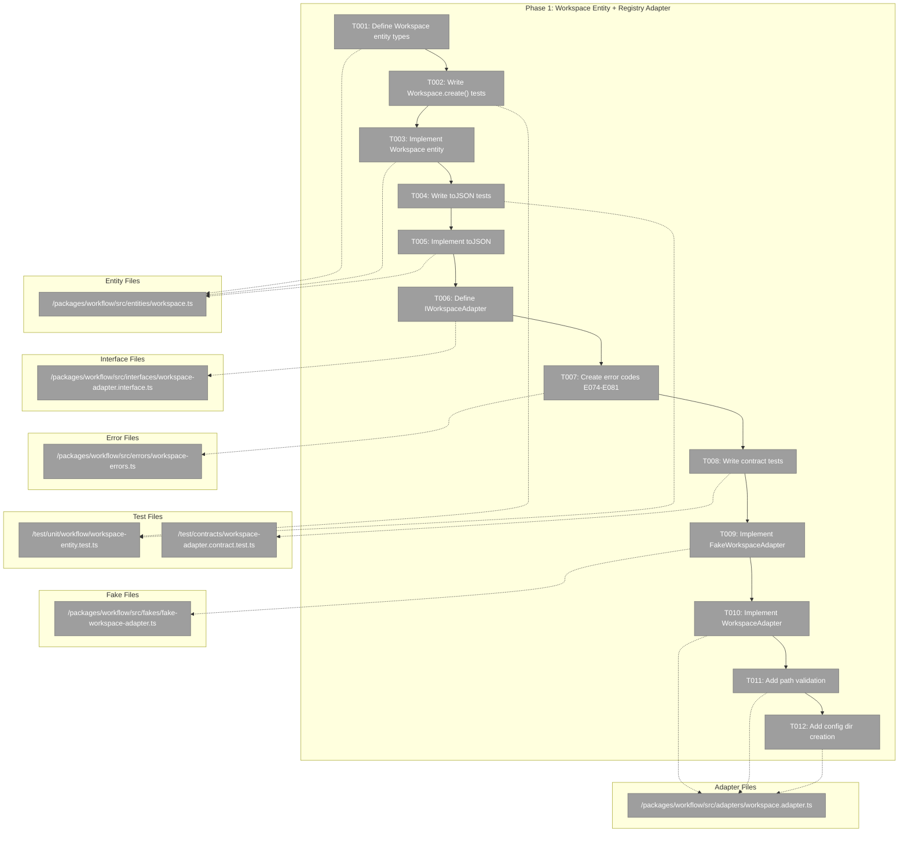
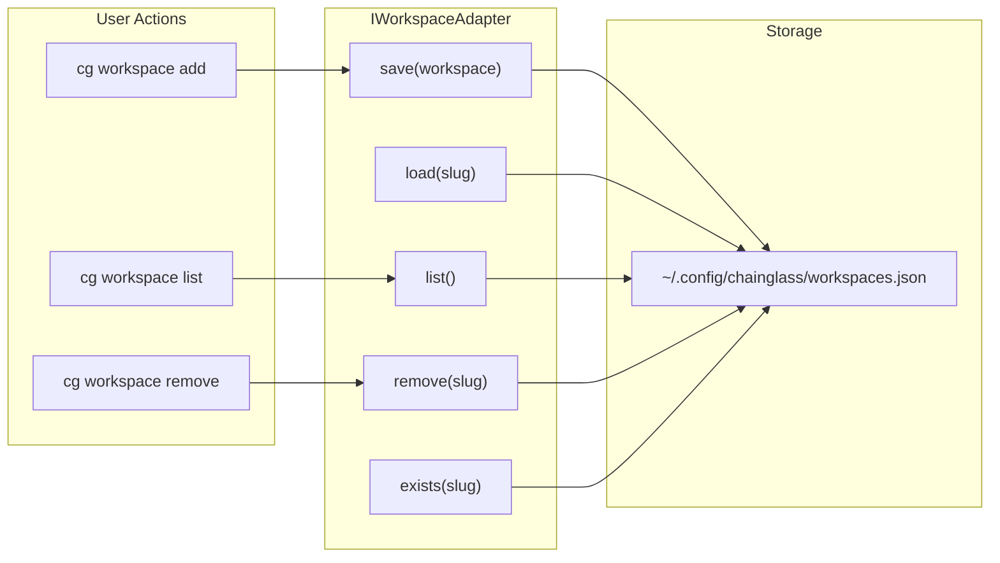
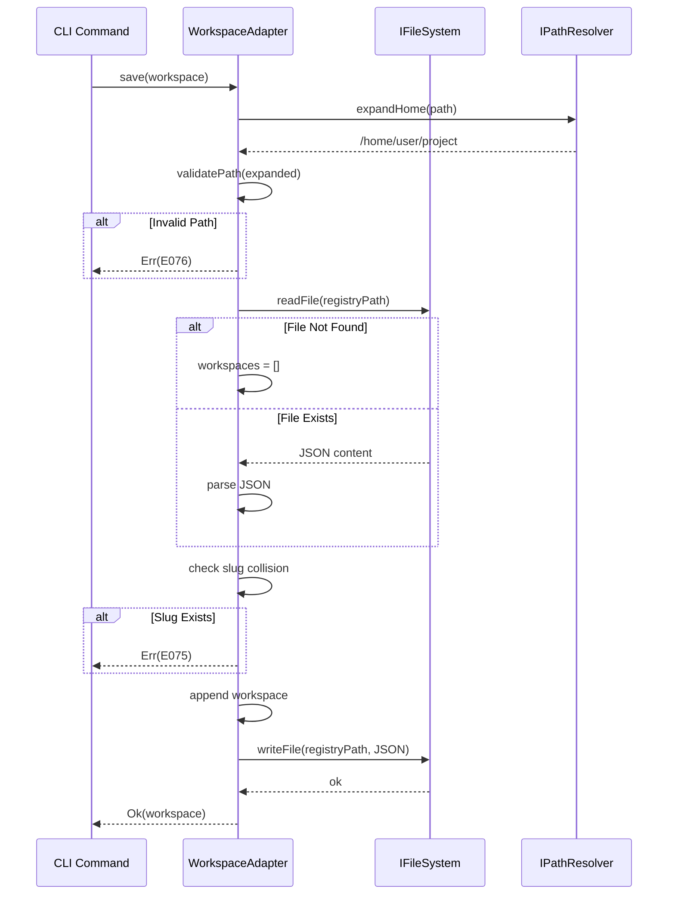

# Phase 1: Workspace Entity + Registry Adapter + Contract Tests – Tasks & Alignment Brief

**Spec**: [workspaces-spec.md](../../workspaces-spec.md)
**Plan**: [workspaces-plan.md](../../workspaces-plan.md)
**Date**: 2026-01-27

---

## Executive Briefing

### Purpose
This phase establishes the foundational Workspace entity and registry adapter that enable users to register folders as workspaces. Without this foundation, no workspace operations are possible—it's the prerequisite for all subsequent phases.

### What We're Building
A **Workspace entity** with factory methods for creating/serializing workspace data, plus **IWorkspaceAdapter interface** with both fake and real implementations for registry operations on `~/.config/chainglass/workspaces.json`. This includes:
- Workspace entity with `slug`, `name`, `path`, `createdAt` fields
- Private constructor + static factory method (`create()`)
- `toJSON()` serialization following project conventions
- Error codes E074-E081 with factory functions for actionable user guidance
- Contract tests verifying fake-real adapter parity

### User Value
Users can register any folder as a workspace using `cg workspace add "My Project" /path/to/folder`. The workspace list persists in `~/.config/chainglass/workspaces.json` and survives project deletion. Path validation prevents security issues (no directory traversal). Clear error messages guide users when things go wrong.

### Example
**Input**: `Workspace.create({ name: 'My Project', path: '/home/jak/projects/my-project' })`
**Output**:
```json
{
  "slug": "my-project",
  "name": "My Project",
  "path": "/home/jak/projects/my-project",
  "createdAt": "2026-01-27T12:00:00.000Z"
}
```

---

## Objectives & Scope

### Objective
Implement the Workspace entity, registry adapter interface, fake implementation, real implementation, and contract tests as specified in the plan. This phase establishes patterns that Sample domain (Phase 3) will extend.

**Behavior Checklist** (from Plan acceptance criteria):
- [ ] All entity tests passing
- [ ] Contract tests pass for both Fake and Real adapters
- [ ] Error codes E074-E081 implemented with factories
- [ ] Path validation rejects invalid paths

### Goals

- ✅ Define Workspace entity with factory method (`create()`) and `toJSON()`
- ✅ Define IWorkspaceAdapter interface for registry operations (`load`, `save`, `list`, `remove`, `exists`)
- ✅ Implement FakeWorkspaceAdapter with three-part API (state setup, inspection, error injection)
- ✅ Implement WorkspaceAdapter (real) for `~/.config/chainglass/workspaces.json`
- ✅ Create error codes E074-E081 with factory functions
- ✅ Write contract tests verifying fake-real parity
- ✅ Add path validation (absolute, no traversal, tilde expansion)
- ✅ Add config directory creation with permission check

### Non-Goals (Scope Boundaries)

- ❌ WorkspaceContext resolution (Phase 2)
- ❌ Git worktree detection (Phase 2)
- ❌ Per-worktree data storage (Phase 3 - Sample domain)
- ❌ WorkspaceDataAdapterBase (Phase 3)
- ❌ Service layer business logic (Phase 4)
- ❌ CLI commands (Phase 5)
- ❌ Web UI (Phase 6)
- ❌ Slug collision handling with numeric suffix (keep simple: error on collision)
- ❌ Caching of workspace list (direct filesystem reads per spec Q5)

---

## Architecture Map

### Component Diagram
<!-- Status: grey=pending, orange=in-progress, green=completed, red=blocked -->
<!-- Updated by plan-6 during implementation -->



### Task-to-Component Mapping

<!-- Status: ⬜ Pending | 🟧 In Progress | ✅ Complete | 🔴 Blocked -->

| Task | Component(s) | Files | Status | Comment |
|------|-------------|-------|--------|---------|
| T001 | Workspace Entity Types | workspace.ts | ⬜ Pending | Define WorkspaceJSON, WorkspaceInput interfaces |
| T002 | Workspace Unit Tests | workspace-entity.test.ts | ⬜ Pending | TDD: write failing tests first |
| T003 | Workspace Entity | workspace.ts | ⬜ Pending | Private constructor + create() factory |
| T004 | Serialization Tests | workspace-entity.test.ts | ⬜ Pending | TDD: toJSON tests |
| T005 | Serialization Methods | workspace.ts | ⬜ Pending | Implement toJSON (no fromJSON - adapter handles) |
| T006 | IWorkspaceAdapter | workspace-adapter.interface.ts | ⬜ Pending | Registry CRUD operations |
| T007 | Error Factories | workspace-errors.ts | ⬜ Pending | E074-E081 with actionable messages |
| T008 | Contract Tests | workspace-adapter.contract.test.ts | ⬜ Pending | Parameterized test factory |
| T009 | FakeWorkspaceAdapter | fake-workspace-adapter.ts | ⬜ Pending | Three-part API pattern |
| T010 | WorkspaceAdapter | workspace.adapter.ts | ⬜ Pending | JSON file I/O implementation |
| T011 | Path Validation | workspace.adapter.ts | ⬜ Pending | Security checks |
| T012 | Config Directory | workspace.adapter.ts | ⬜ Pending | Creation with permission check |

---

## Tasks

| Status | ID | Task | CS | Type | Dependencies | Absolute Path(s) | Validation | Subtasks | Notes |
|--------|------|------|-----|------|--------------|------------------|------------|----------|-------|
| [ ] | T001 | Define Workspace entity interface, WorkspaceJSON type, and WorkspaceInput type | 1 | Setup | – | /home/jak/substrate/014-workspaces/packages/workflow/src/entities/workspace.ts | Types compile, match spec § Data Model | – | Follow Workflow entity pattern (private constructor) |
| [ ] | T002 | Write unit tests for Workspace.create() factory | 2 | Test | T001 | /home/jak/substrate/014-workspaces/test/unit/workflow/workspace-entity.test.ts | Tests cover: slug generation from name, required fields, default createdAt, edge cases (Unicode, special chars, numbers-first) | – | TDD: tests must fail initially |
| [ ] | T003 | Implement Workspace entity with create() factory | 2 | Core | T002 | /home/jak/substrate/014-workspaces/packages/workflow/src/entities/workspace.ts | All T002 tests pass | – | Use `slugify` npm package; configure: lowercase, strict mode, must match /^[a-z][a-z0-9-]*$/ |
| [ ] | T004 | Write unit tests for Workspace.toJSON() | 2 | Test | T003 | /home/jak/substrate/014-workspaces/test/unit/workflow/workspace-entity.test.ts | Tests cover: camelCase keys, Date→ISO string, undefined→null | – | Per DYK-03 serialization rules |
| [ ] | T005 | Implement toJSON() method | 1 | Core | T004 | /home/jak/substrate/014-workspaces/packages/workflow/src/entities/workspace.ts | All T004 tests pass | – | No fromJSON() - follows Workflow pattern; adapter handles deserialization via create() |
| [ ] | T006 | Define IWorkspaceAdapter interface for registry operations | 1 | Setup | T005 | /home/jak/substrate/014-workspaces/packages/workflow/src/interfaces/workspace-adapter.interface.ts | Interface compiles, documents all methods with JSDoc | – | Methods: load, save, list, remove, exists |
| [ ] | T007 | Create workspace error codes (E074-E081) with factory functions | 2 | Core | T006 | /home/jak/substrate/014-workspaces/packages/workflow/src/errors/workspace-errors.ts | Each error has code, message, action, path fields | – | Per Critical Discovery 06 |
| [ ] | T008 | Write contract tests for IWorkspaceAdapter (parameterized factory) | 3 | Test | T007 | /home/jak/substrate/014-workspaces/test/contracts/workspace-adapter.contract.test.ts | Tests cover: load, save, list, remove, exists behaviors | – | Per Critical Discovery 03 |
| [ ] | T009 | Implement FakeWorkspaceAdapter with three-part API | 2 | Core | T008 | /home/jak/substrate/014-workspaces/packages/workflow/src/fakes/fake-workspace-adapter.ts | Contract tests pass, state setup/inspection/error injection works, reset() helper | – | Follow FakeWorkflowAdapter pattern |
| [ ] | T010 | Implement WorkspaceAdapter (real) with JSON file I/O | 3 | Core | T009 | /home/jak/substrate/014-workspaces/packages/workflow/src/adapters/workspace.adapter.ts | Contract tests pass against real adapter | – | Per Critical Discovery 01: ~/.config/chainglass/workspaces.json |
| [ ] | T011 | Add path validation (absolute, no traversal, tilde expansion) | 2 | Core | T010 | /home/jak/substrate/014-workspaces/packages/workflow/src/adapters/workspace.adapter.ts | Security tests pass, E076/E077 returned for invalid paths | – | Per Critical Discovery 05; Extract expandTilde from WorkflowService:677 to IPathResolver |
| [ ] | T012 | Add config directory creation with permission check | 2 | Core | T011 | /home/jak/substrate/014-workspaces/packages/workflow/src/adapters/workspace.adapter.ts | E080 returned if can't write, creates dir if missing | – | Per Medium Discovery 09 |

---

## Alignment Brief

### Critical Findings Affecting This Phase

**Critical Discovery 01: Split Storage Architecture** (Impact: Critical)
- Workspace registry stored in `~/.config/chainglass/workspaces.json`
- WorkspaceAdapter reads/writes registry; does NOT handle per-worktree data
- **Addressed by**: T010 (WorkspaceAdapter implementation)

**Critical Discovery 03: Contract Tests for Adapter Parity** (Impact: Critical)
- FakeWorkspaceAdapter and WorkspaceAdapter must pass identical contract tests
- Prevents fake drift; ensures tests validate real behavior
- **Addressed by**: T008 (contract test factory), T009 (FakeWorkspaceAdapter), T010 (WorkspaceAdapter)

**High Discovery 05: Path Security and Validation** (Impact: High)
- All paths must be validated: absolute, no traversal (..), tilde expanded
- Use IPathResolver for path operations
- E076/E077 error codes for invalid paths
- **Addressed by**: T011 (path validation)

**High Discovery 06: Error Code Standardization (E074-E081)** (Impact: High)
- Each error needs factory function with code, message, action, path
- **Addressed by**: T007 (error factories)

**High Discovery 07: Entity Factory Pattern** (Impact: High)
- Private constructor + static factory methods
- Enforce invariants in factory
- **Addressed by**: T001, T003, T005

**Medium Discovery 09: User Config Directory Permissions** (Impact: Medium)
- `~/.config/chainglass/` may not exist or be writable
- Pre-flight checks needed
- E080 error code for permission failures
- **Addressed by**: T012 (config directory creation)

### ADR Decision Constraints

No ADRs directly constrain this phase. ADR-0002 (Exemplar-Driven Development) encourages following existing patterns (Workflow entity, FakeWorkflowAdapter).

### Invariants & Guardrails

- **No `vi.mock()`/`vi.fn()`**: Use full fake implementations per R-TEST-007
- **Fakes only policy**: Follow three-part API (state setup, inspection, error injection)
- **Child container per test**: Fresh container prevents state leakage
- **Result types**: Adapters return Results, never throw except EntityNotFoundError for missing entities
- **Path validation**: All stored paths must be canonical (absolute, expanded, no traversal)

### Inputs to Read

1. **Exemplar Entity**: `/home/jak/substrate/014-workspaces/packages/workflow/src/entities/workflow.ts`
2. **Exemplar Interface**: `/home/jak/substrate/014-workspaces/packages/workflow/src/interfaces/workflow-adapter.interface.ts`
3. **Exemplar Fake**: `/home/jak/substrate/014-workspaces/packages/workflow/src/fakes/fake-workflow-adapter.ts`
4. **Exemplar Contract Test**: `/home/jak/substrate/014-workspaces/test/contracts/workflow-adapter.contract.test.ts`
5. **Exemplar Error**: `/home/jak/substrate/014-workspaces/packages/workflow/src/errors/entity-not-found.error.ts`
6. **DI Tokens**: `/home/jak/substrate/014-workspaces/packages/shared/src/di-tokens.ts`
7. **Container Pattern**: `/home/jak/substrate/014-workspaces/packages/workflow/src/container.ts`

### Visual Alignment Aids

#### System State Flow Diagram



#### Sequence Diagram: Add Workspace



### Test Plan (TDD with Fakes)

#### Workspace Entity Tests (`workspace-entity.test.ts`)

| Test Name | Rationale | Fixtures | Expected Output |
|-----------|-----------|----------|-----------------|
| `should generate slug from name` | Slugs are URL-safe identifiers | `{ name: 'My Project', path: '/tmp/test' }` | `slug: 'my-project'` |
| `should handle special characters in name` | Slug must be URL-safe | `{ name: 'My Project (2023)!', path: '/tmp' }` | `slug: 'my-project-2023'` |
| `should set createdAt to current time` | Track when workspace was registered | `{ name: 'Test', path: '/tmp' }` | `createdAt` within last second |
| `should serialize to JSON with ISO date` | API compatibility | Workspace entity | `{ createdAt: "2026-01-27T..." }` |
| `should deserialize from JSON` | Persistence roundtrip | JSON string | Workspace with Date createdAt |
| `should preserve all fields in roundtrip` | Data integrity | Workspace → JSON → Workspace | All fields equal |

#### Contract Tests (`workspace-adapter.contract.test.ts`)

| Test Name | Rationale | Fixtures | Expected Output |
|-----------|-----------|----------|-----------------|
| `should save and load workspace` | Basic CRUD | Workspace entity | Same workspace returned |
| `should list all workspaces` | Enumeration | 3 saved workspaces | Array of 3 workspaces |
| `should return empty array when no workspaces` | Empty state | None | `[]` |
| `should remove workspace by slug` | Deletion | Saved workspace | `exists()` returns false |
| `should return true for exists() when workspace exists` | Existence check | Saved workspace | `true` |
| `should return false for exists() when workspace missing` | Existence check | Empty registry | `false` |
| `should throw EntityNotFoundError for load() on missing slug` | Error handling | Missing slug | EntityNotFoundError |

#### Path Validation Tests

| Test Name | Rationale | Fixtures | Expected Output |
|-----------|-----------|----------|-----------------|
| `should reject relative paths` | Security | `./project` | `Err(E076)` |
| `should reject paths with traversal` | Security | `/home/../etc/passwd` | `Err(E076)` |
| `should expand tilde` | UX convenience | `~/projects/test` | `/home/user/projects/test` |
| `should accept absolute paths` | Happy path | `/home/user/project` | `Ok(workspace)` |

### Step-by-Step Implementation Outline

1. **T001**: Create `workspace.ts` with type definitions
   - Define `WorkspaceJSON` interface (serialized form)
   - Define `WorkspaceInput` interface (creation input)
   - Add empty Workspace class shell with private constructor

2. **T002**: Create `workspace-entity.test.ts` with `create()` tests
   - Test slug generation from name (lowercase, hyphenated)
   - Test handling of special characters
   - Test default createdAt timestamp
   - All tests should FAIL (TDD red phase)

3. **T003**: Implement `Workspace.create()` factory
   - Add slugify logic (or use library)
   - Set readonly fields
   - All T002 tests should PASS (TDD green phase)

4. **T004**: Add serialization tests to `workspace-entity.test.ts`
   - Test `toJSON()` output format
   - Test roundtrip (via adapter: toJSON → JSON.parse → create)

5. **T005**: Implement `toJSON()`
   - Follow DYK-03 conventions (camelCase, Date→ISO, undefined→null)
   - No fromJSON() - adapter handles deserialization via create()
   - All T004 tests should PASS

6. **T006**: Create `workspace-adapter.interface.ts`
   - Define `IWorkspaceAdapter` with CRUD methods
   - Add JSDoc contracts for each method
   - Export from interfaces/index.ts

7. **T007**: Create `workspace-errors.ts`
   - Define `WorkspaceError` interface
   - Create factory functions: `workspaceNotFound()`, `workspaceExists()`, `invalidPath()`, etc.
   - Each factory returns `{ code, message, action, path }`

8. **T008**: Create `workspace-adapter.contract.test.ts`
   - Define `WorkspaceAdapterTestContext` interface
   - Create `workspaceAdapterContractTests()` factory function
   - Write behavioral tests (not implementation-specific)

9. **T009**: Create `fake-workspace-adapter.ts`
   - Implement `IWorkspaceAdapter`
   - Add configurable result properties
   - Add call tracking with getters
   - Add `reset()` helper
   - Wire into contract tests

10. **T010**: Create `workspace.adapter.ts`
    - Inject IFileSystem, IPathResolver
    - Implement registry JSON read/write
    - Wire into contract tests
    - Verify both implementations pass

11. **T011**: Add path validation to `WorkspaceAdapter.save()`
    - Check absolute path
    - Check no traversal (`..`)
    - Expand tilde using IPathResolver
    - Return E076/E077 errors

12. **T012**: Add config directory creation
    - Check/create `~/.config/chainglass/`
    - Test write capability
    - Return E080 on permission failure

### Commands to Run

```bash
# Quick check (recommended before each commit)
just fft                    # Fix, Format, Test

# Full quality suite (required before phase completion)
just check                  # Runs: lint, typecheck, test

# Individual checks
just test                   # Run all tests
just typecheck              # TypeScript strict mode
just lint                   # Biome linter

# Package-specific tests during development
pnpm test --filter @chainglass/workflow    # Workflow package only

# Run specific test file
pnpm test test/unit/workflow/workspace-entity.test.ts

# Run contract tests only
pnpm test test/contracts/workspace-adapter.contract.test.ts

# Watch mode during TDD
pnpm test --watch test/unit/workflow/workspace-entity.test.ts
```

### Risks & Unknowns

| Risk | Severity | Likelihood | Mitigation |
|------|----------|------------|------------|
| Slugify edge cases with Unicode | Medium | Low | Use established library (slugify) or test extensively |
| Config dir permissions on different OSes | Medium | Low | Test on Linux; document Windows/macOS differences |
| JSON file corruption | Low | Low | Validate JSON on read; atomic writes if needed |

### Ready Check

- [ ] Workspace entity pattern understood (reviewed Workflow entity)
- [ ] Fake adapter pattern understood (reviewed FakeWorkflowAdapter)
- [ ] Contract test pattern understood (reviewed workflow-adapter.contract.test.ts)
- [ ] Error code pattern understood (reviewed entity-not-found.error.ts)
- [ ] DI token location identified (packages/shared/src/di-tokens.ts)
- [ ] Container registration pattern understood (reviewed container.ts)
- [ ] ADR constraints mapped to tasks (N/A - no ADRs constrain this phase)

**Awaiting explicit GO/NO-GO**

---

## Phase Footnote Stubs

| Footnote | Task | Description | Added By | Date |
|----------|------|-------------|----------|------|
| | | | | |

*Footnotes will be populated during implementation by plan-6a-update-progress.*

---

## Evidence Artifacts

Implementation will write the following artifacts to this directory:

- `execution.log.md` - Detailed implementation narrative with decisions, issues, and resolutions
- Test coverage reports (linked in execution log)
- Any additional supporting files as needed

---

## Discoveries & Learnings

_Populated during implementation by plan-6. Log anything of interest to your future self._

| Date | Task | Type | Discovery | Resolution | References |
|------|------|------|-----------|------------|------------|
| 2026-01-27 | T011 | insight | expandTilde() already exists as private method in WorkflowService:677-682 | Extract to IPathResolver interface; update WorkflowService to use shared method | DYK session; workflow.service.ts:677 |
| 2026-01-27 | T003 | decision | Slug generation needs edge case handling (Unicode, special chars, numbers-first names) | Use `slugify` npm package instead of custom implementation; configure for strict mode | DYK session; must match /^[a-z][a-z0-9-]*$/ |
| 2026-01-27 | T005 | decision | Workflow entity has no fromJSON() - adapter handles deserialization | Follow Workflow pattern: no fromJSON(); adapter parses JSON and calls create() with optional slug/createdAt overrides | DYK session; workflow.ts, workflow.adapter.ts |

**Types**: `gotcha` | `research-needed` | `unexpected-behavior` | `workaround` | `decision` | `debt` | `insight`

**What to log**:
- Things that didn't work as expected
- External research that was required
- Implementation troubles and how they were resolved
- Gotchas and edge cases discovered
- Decisions made during implementation
- Technical debt introduced (and why)
- Insights that future phases should know about

_See also: `execution.log.md` for detailed narrative._

---

## Directory Layout

```
docs/plans/014-workspaces/
├── workspaces-spec.md
├── workspaces-plan.md
├── data-model-dossier.md
├── research-dossier.md
└── tasks/
    └── phase-1-workspace-entity-registry-adapter-contract-tests/
        ├── tasks.md                    # This file
        └── execution.log.md            # Created by plan-6 during implementation
```

---

**Next step**: Run `/plan-6-implement-phase --phase "Phase 1: Workspace Entity + Registry Adapter + Contract Tests" --plan "/home/jak/substrate/014-workspaces/docs/plans/014-workspaces/workspaces-plan.md"` after GO approval.

---

## Critical Insights Discussion

**Session**: 2026-01-27
**Context**: Phase 1 Tasks Review - Pre-implementation clarity session
**Analyst**: AI Clarity Agent
**Reviewer**: Development Team
**Format**: Water Cooler Conversation (5 Critical Insights)

### Insight 1: Error Code Collision - E070-E073 Already Allocated

**Did you know**: The planned error codes E070-E077 collide with existing PhaseService codes (E070-E073 used for handover operations).

**Implications**:
- 50% collision (4 of 8 codes) with production code
- Same error code would mean different things in different contexts
- Debugging confusion and potential runtime issues

**Options Considered**:
- Option A: Shift to E074-E081 - Zero conflicts, exact fit
- Option B: Refactor PhaseService - Breaking change, not feasible
- Option C: Create centralized registry - Good follow-up

**AI Recommendation**: Option A - Shift to E074-E081
- Reasoning: No conflicts, minimal documentation changes, no breaking changes

**Discussion Summary**: User confirmed Option A immediately.

**Decision**: Shift all workspace error codes from E070-E077 to E074-E081

**Action Items**:
- [x] Update spec, plan, tasks, dossiers with new error codes

**Affects**: T007 (error factories), all error handling in Phases 1-6

---

### Insight 2: IPathResolver Missing expandHome() Method

**Did you know**: The plan calls `pathResolver.expandHome(path)` but this method doesn't exist in IPathResolver - however, `expandTilde()` already exists as a private method in WorkflowService.

**Implications**:
- Plan code examples won't compile as written
- Existing implementation is duplicated/private in WorkflowService
- Opportunity to centralize and share

**Options Considered**:
- Option A: Extract to IPathResolver - Centralizes logic, enables testing
- Option D: Duplicate in WorkspaceAdapter - Faster but violates DRY

**AI Recommendation**: Option A - Extract to shared location
- Reasoning: Reuse existing implementation, avoid duplication

**Discussion Summary**: User confirmed extraction to shared location.

**Decision**: Extract expandTilde() from WorkflowService:677-682 to IPathResolver interface

**Action Items**:
- [ ] Add expandTilde() to IPathResolver interface
- [ ] Implement in PathResolverAdapter and FakePathResolver
- [ ] Refactor WorkflowService to use shared method

**Affects**: T011 (path validation), packages/shared, packages/workflow

---

### Insight 3: Slug Generation Has No Defined Edge Case Handling

**Did you know**: Slug generation is required but no implementation exists, and edge cases (Unicode, special chars, numbers-first) are undefined.

**Implications**:
- Undefined behavior for international characters
- Pattern validation exists (`/^[a-z][a-z0-9-]*$/`) but no generation
- No edge case tests in codebase

**Options Considered**:
- Option A: Use slugify npm package - Battle-tested, handles Unicode
- Option B: Custom implementation - More control but may miss edge cases

**AI Recommendation**: Option A - Use pre-made slugify library
- Reasoning: Battle-tested, handles international chars

**Discussion Summary**: User preferred pre-made solution.

**Decision**: Use `slugify` npm package configured for strict mode

**Action Items**:
- [ ] Add slugify to packages/workflow dependencies
- [ ] Configure: lowercase, strict mode, must match validation pattern
- [ ] Add comprehensive edge case tests

**Affects**: T002 (tests), T003 (implementation)

---

### Insight 4: Contract Tests Use FakeFileSystem for Real Adapters

**Did you know**: Existing contract tests inject FakeFileSystem into real adapters - no temp directories or actual filesystem I/O needed.

**Implications**:
- Pattern already proven in workflow-adapter and phase-adapter tests
- Fast, deterministic, no cleanup issues
- Tasks.md already follows correct approach

**Options Considered**:
- Option A: Follow established pattern (FakeFileSystem) - Recommended
- Option B: Add separate integration tests - Optional follow-up

**AI Recommendation**: Option A - Follow established pattern
- Reasoning: Already proven, no changes needed

**Discussion Summary**: User confirmed - affirmation that tasks have correct approach.

**Decision**: Use FakeFileSystem for contract tests (established pattern)

**Action Items**: None - tasks.md already correct

**Affects**: T008-T010 (contract tests and adapters)

---

### Insight 5: Workflow Entity Has No fromJSON() - Adapter Handles Deserialization

**Did you know**: The Workflow entity only has `toJSON()` - no `fromJSON()`. The adapter parses JSON and calls factory methods with the parsed data.

**Implications**:
- Originally planned fromJSON() doesn't match codebase pattern
- Keeps entity clean - just data + serialization
- Adapter owns parsing responsibility

**Options Considered**:
- Option A: Add fromJSON() as static factory - New pattern
- Option C: Adapter handles deserialization - Matches Workflow

**AI Recommendation**: Initially Option A, revised to match Workflow pattern
- Reasoning: Consistency with existing codebase patterns

**Discussion Summary**: User pointed out Workflow pattern; confirmed adapter should handle deserialization.

**Decision**: No fromJSON() - adapter handles deserialization via create() with optional overrides

**Action Items**:
- [x] Remove fromJSON() references from tasks and plan
- [ ] Workspace.create() accepts optional slug/createdAt for loading

**Affects**: T004, T005, T010

---

## Session Summary

**Insights Surfaced**: 5 critical insights identified and discussed
**Decisions Made**: 5 decisions reached through collaborative discussion
**Action Items Created**: 8 follow-up items (3 completed during session)
**Areas Updated**:
- tasks.md - Error codes, expandTilde note, slugify, fromJSON removal
- workspaces-plan.md - Error codes, fromJSON removal
- workspaces-spec.md - Error codes
- data-model-dossier.md - Error codes
- research-dossier.md - Error codes

**Shared Understanding Achieved**: ✓

**Confidence Level**: High - All major implementation questions resolved

**Next Steps**:
Proceed to implementation with `/plan-6-implement-phase` after GO approval.
