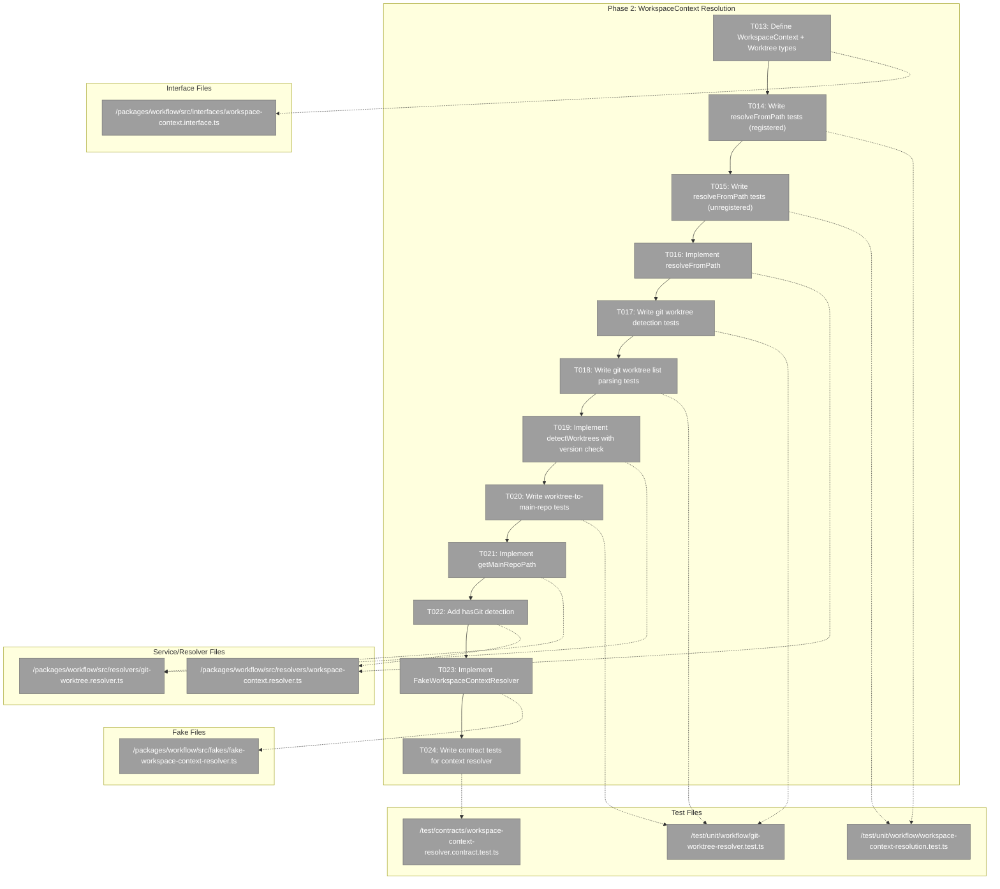
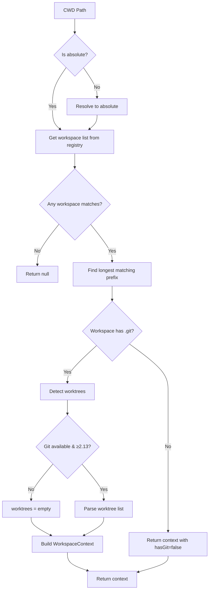
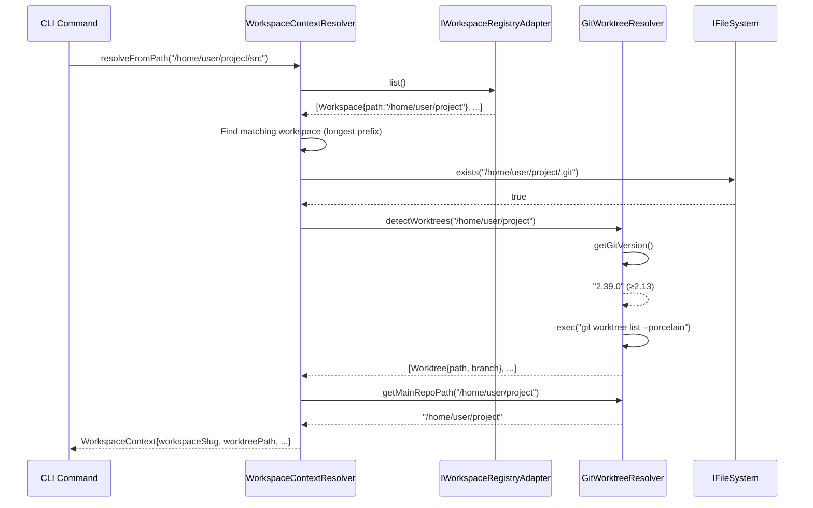

# Phase 2: WorkspaceContext Resolution + Worktree Discovery – Tasks & Alignment Brief

**Spec**: [workspaces-spec.md](../../workspaces-spec.md)
**Plan**: [workspaces-plan.md](../../workspaces-plan.md)
**Date**: 2026-01-27

---

## Executive Briefing

### Purpose
This phase implements the context resolution system that detects which workspace a user is currently in based on their current working directory. This is the bridge between the Phase 1 registry and actual CLI/service usage—without context resolution, users would need to specify `--workspace` on every command.

### What We're Building
A **WorkspaceContext** interface and resolution system that:
- Walks up the directory tree from CWD to find a registered workspace
- Detects git worktrees via `git worktree list --porcelain`
- Provides context to services so they know which workspace/worktree to operate on
- Gracefully degrades when git is unavailable or too old (< 2.13)

### User Value
Users can simply `cd ~/projects/my-workspace && cg sample add "test"` and the system automatically resolves which workspace they're in. No need for `--workspace my-workspace` on every command. Git worktree users get seamless support—data in feature branch worktrees stays isolated until merged.

### Example
**CWD**: `/home/jak/substrate/014-workspaces/packages/workflow`  
**Resolution**:
```json
{
  "workspaceSlug": "chainglass",
  "workspacePath": "/home/jak/substrate/014-workspaces",
  "worktreePath": "/home/jak/substrate/014-workspaces",
  "worktreeBranch": "014-workspaces",
  "isMainWorktree": false
}
```

---

## Objectives & Scope

### Objective
Implement WorkspaceContext resolution from filesystem paths and git worktree discovery as specified in the plan. This enables CWD-based workspace detection for CLI commands and services.

**Behavior Checklist** (from Plan acceptance criteria):
- [ ] WorkspaceContext resolved from any path in workspace
- [ ] Worktrees discovered for git repos
- [ ] Graceful fallback when git unavailable
- [ ] E079 error for explicit git failures

### Goals

- ✅ Define WorkspaceContext interface with workspace + worktree info
- ✅ Define Worktree type for git worktree metadata
- ✅ Implement `resolveFromPath()` to find workspace from any CWD
- ✅ Implement git worktree detection with version check (≥ 2.13)
- ✅ Implement `git worktree list --porcelain` output parsing
- ✅ Implement `getMainRepoPath()` using `git rev-parse --show-toplevel`
- ✅ Add `hasGit` detection for workspace info
- ✅ Create FakeWorkspaceContextResolver for testing
- ✅ Write contract tests for context resolution

### Non-Goals (Scope Boundaries)

- ❌ Per-worktree data storage (Phase 3 - Sample domain will use WorkspaceContext)
- ❌ Service layer business logic (Phase 4)
- ❌ CLI command implementation (Phase 5)
- ❌ Caching of resolved contexts (always fresh per spec Q5)
- ❌ Windows git path handling (Linux/macOS only for now)
- ❌ Submodule detection (worktrees only, not submodules)
- ❌ Worktree creation/deletion (detection only)

---

## Architecture Map

### Component Diagram
<!-- Status: grey=pending, orange=in-progress, green=completed, red=blocked -->
<!-- Updated by plan-6 during implementation -->



### Task-to-Component Mapping

<!-- Status: ⬜ Pending | 🟧 In Progress | ✅ Complete | 🔴 Blocked -->

| Task | Component(s) | Files | Status | Comment |
|------|-------------|-------|--------|---------|
| T013 | Context Types | workspace-context.interface.ts | ⬜ Pending | Define WorkspaceContext, Worktree, WorkspaceInfo types |
| T014 | Resolution Tests | workspace-context-resolution.test.ts | ⬜ Pending | TDD: tests for CWD in registered workspace |
| T015 | Resolution Tests | workspace-context-resolution.test.ts | ⬜ Pending | TDD: tests for unregistered path returns null |
| T016 | Context Resolver | workspace-context.resolver.ts | ⬜ Pending | Walk up directory tree, match against registry |
| T017 | Git Detection Tests | git-worktree-resolver.test.ts | ⬜ Pending | TDD: git available/missing/old version scenarios |
| T018 | Parsing Tests | git-worktree-resolver.test.ts | ⬜ Pending | TDD: parse --porcelain output format |
| T019 | Git Worktree Resolver | git-worktree.resolver.ts | ⬜ Pending | Version check ≥ 2.13, exec worktree list |
| T020 | Main Repo Tests | git-worktree-resolver.test.ts | ⬜ Pending | TDD: in worktree vs in main repo scenarios |
| T021 | Main Repo Resolution | git-worktree.resolver.ts | ⬜ Pending | git rev-parse --show-toplevel |
| T022 | Git Detection | workspace-context.resolver.ts | ⬜ Pending | Check .git presence for hasGit flag |
| T023 | Fake Resolver | fake-workspace-context-resolver.ts | ⬜ Pending | Three-part API for testing |
| T024 | Contract Tests | workspace-context-resolver.contract.test.ts | ⬜ Pending | Verify fake-real parity |

---

## Tasks

| Status | ID | Task | CS | Type | Dependencies | Absolute Path(s) | Validation | Subtasks | Notes |
|--------|------|------|-----|------|--------------|------------------|------------|----------|-------|
| [ ] | T013 | Define WorkspaceContext interface, Worktree type, WorkspaceInfo type, AND IWorkspaceContextResolver interface | 2 | Setup | – | /home/jak/substrate/014-workspaces/packages/workflow/src/interfaces/workspace-context.interface.ts | Types compile, match plan § Phase 2 deliverables; export from index.ts | – | Include workspaceSlug, workspacePath, worktreePath, worktreeBranch, isMainWorktree; **DYK-02: Add IWorkspaceContextResolver interface for DI per ADR-0004** |
| [ ] | T014 | Write unit tests for resolveFromPath() with CWD in registered workspace | 2 | Test | T013 | /home/jak/substrate/014-workspaces/test/unit/workflow/workspace-context-resolution.test.ts | Tests cover: exact workspace path, nested subdirectory, deeply nested path | – | TDD: tests must fail initially; use FakeWorkspaceRegistryAdapter |
| [ ] | T015 | Write unit tests for resolveFromPath() with unregistered path | 1 | Test | T014 | /home/jak/substrate/014-workspaces/test/unit/workflow/workspace-context-resolution.test.ts | Tests cover: path not in any workspace returns null, root path returns null | – | |
| [ ] | T016 | Implement resolveFromPath() in WorkspaceContextResolver | 2 | Core | T015 | /home/jak/substrate/014-workspaces/packages/workflow/src/resolvers/workspace-context.resolver.ts | All T014+T015 tests pass; walks up directory tree, matches against registry | – | Uses IWorkspaceRegistryAdapter.list() from Phase 1; **DYK-03: Sort by path.length descending before matching to handle overlapping workspaces** |
| [ ] | T017 | Write unit tests for git worktree detection (available/missing/old) | 2 | Test | T016 | /home/jak/substrate/014-workspaces/test/unit/workflow/git-worktree-resolver.test.ts | Tests cover: git available returns version, git missing returns null, version < 2.13 detected | – | Per High Discovery 04; **DYK-01: Use FakeProcessManager for test mocking** |
| [ ] | T018 | Write unit tests for git worktree list --porcelain parsing | 2 | Test | T017 | /home/jak/substrate/014-workspaces/test/unit/workflow/git-worktree-resolver.test.ts | Tests cover: single worktree, multiple worktrees, bare worktree, detached HEAD | – | Sample output in test fixtures; **DYK-05: Test ALL porcelain variants - normal (has `branch`), detached HEAD (has `detached`), bare (has `bare`), prunable (has `prunable`); each block separated by blank line** |
| [ ] | T019 | Implement detectWorktrees() with git version check and graceful fallback | 3 | Core | T018 | /home/jak/substrate/014-workspaces/packages/workflow/src/resolvers/git-worktree.resolver.ts | All T017+T018 tests pass; returns [] if git unavailable or < 2.13; E079 for explicit failures | – | Per High Discovery 04: version ≥ 2.13 required; **DYK-01: Inject IProcessManager for git execution** |
| [ ] | T020 | Write unit tests for worktree path to main repo resolution | 2 | Test | T019 | /home/jak/substrate/014-workspaces/test/unit/workflow/git-worktree-resolver.test.ts | Tests cover: CWD in worktree returns main repo, CWD in main repo returns same | – | |
| [ ] | T021 | Implement getMainRepoPath() using git rev-parse --show-toplevel | 2 | Core | T020 | /home/jak/substrate/014-workspaces/packages/workflow/src/resolvers/git-worktree.resolver.ts | All T020 tests pass; handles non-git directories gracefully | – | |
| [ ] | T022 | Add hasGit detection to WorkspaceContextResolver | 1 | Core | T021 | /home/jak/substrate/014-workspaces/packages/workflow/src/resolvers/workspace-context.resolver.ts | WorkspaceInfo.hasGit reflects .git presence (file or directory) | – | Check .git exists at workspace root |
| [ ] | T023 | Implement FakeWorkspaceContextResolver implementing IWorkspaceContextResolver with three-part API | 2 | Core | T022 | /home/jak/substrate/014-workspaces/packages/workflow/src/fakes/fake-workspace-context-resolver.ts | State setup, inspection, error injection; reset() helper; call tracking | – | Follow FakeWorkspaceRegistryAdapter pattern from Phase 1; **DYK-02: Implements IWorkspaceContextResolver** |
| [ ] | T024 | Write contract tests for IWorkspaceContextResolver | 3 | Test | T023 | /home/jak/substrate/014-workspaces/test/contracts/workspace-context-resolver.contract.test.ts | Tests run against both Fake and Real implementations; verify behavior parity | – | Per Critical Discovery 03; follow Phase 1 contract test pattern |

---

## Alignment Brief

### Prior Phases Review

#### Phase 1: Workspace Entity + Registry Adapter + Contract Tests (COMPLETE)

**A. Deliverables Created**

| Component | Absolute Path | Description |
|-----------|---------------|-------------|
| Workspace Entity | /home/jak/substrate/014-workspaces/packages/workflow/src/entities/workspace.ts | `Workspace` class with `create()` factory, `toJSON()` |
| WorkspaceInput, WorkspaceJSON | /home/jak/substrate/014-workspaces/packages/workflow/src/entities/workspace.ts | Type interfaces |
| IWorkspaceRegistryAdapter | /home/jak/substrate/014-workspaces/packages/workflow/src/interfaces/workspace-registry-adapter.interface.ts | 5 methods: `load`, `save`, `list`, `remove`, `exists` |
| WorkspaceRegistryAdapter | /home/jak/substrate/014-workspaces/packages/workflow/src/adapters/workspace-registry.adapter.ts | Real implementation with JSON file I/O |
| FakeWorkspaceRegistryAdapter | /home/jak/substrate/014-workspaces/packages/workflow/src/fakes/fake-workspace-registry-adapter.ts | Three-part API for testing |
| Error codes E074-E081 | /home/jak/substrate/014-workspaces/packages/workflow/src/errors/workspace-errors.ts | `WorkspaceErrors` factory + error classes |
| Entity unit tests | /home/jak/substrate/014-workspaces/test/unit/workflow/workspace-entity.test.ts | 21 tests |
| Contract tests | /home/jak/substrate/014-workspaces/test/contracts/workspace-registry-adapter.contract.test.ts | 20 tests (10×2) |

**B. Lessons Learned**

- **TDD with Fakes worked well**: Writing tests first forced clear API design
- **Contract test factory pattern**: `workspaceRegistryAdapterContractTests()` ensures fake-real parity
- **Three-part fake API**: State setup (`addWorkspace`), inspection (`*Calls` getters), error injection (`inject*Error`)
- **slugify package**: External library handled Unicode edge cases better than hand-rolled
- **Interface naming**: Plan said `IWorkspaceAdapter`, implementation used `IWorkspaceRegistryAdapter` for clarity
- **Error code shift**: E070→E074 to avoid PhaseService collision

**C. Technical Discoveries (Gotchas for Phase 2)**

1. **No `fromJSON()` method**: Use `Workspace.create()` with all fields for deserialization
2. **Registry file has `version: 1`**: For future migrations (workspace-registry.adapter.ts:25-30)
3. **Empty registry fallback**: Returns `{ version: 1, workspaces: [] }` if file corrupt—no crash
4. **Path validation in adapter**: Entity is pure data, adapter enforces I/O constraints
5. **Error injection typing**: Cast `inject*Error.code` to appropriate type

**D. Dependencies Exported for Phase 2**

| Export | Usage in Phase 2 |
|--------|------------------|
| `Workspace` entity | WorkspaceContext references Workspace |
| `IWorkspaceRegistryAdapter.list()` | `resolveFromPath()` uses this to find matching workspace |
| `FakeWorkspaceRegistryAdapter` | Test WorkspaceContextResolver |
| `WorkspaceErrors.gitError()` | E079 for git worktree detection failures |
| Contract test pattern | Template for context resolver contract tests |
| Three-part fake API | Pattern for FakeWorkspaceContextResolver |

**E. Critical Findings Applied in Phase 1**

| Finding | How Applied | Reference |
|---------|-------------|-----------|
| Critical 01: Split Storage | Registry at `~/.config/chainglass/workspaces.json` | workspace-registry.adapter.ts:42-55 |
| Critical 03: Contract Tests | `workspaceRegistryAdapterContractTests()` factory | contract test file |
| High 05: Path Security | `validatePath()` rejects relative and `..` | workspace-registry.adapter.ts:187-210 |
| High 06: Error Standardization | `WorkspaceErrors` factory + codes | workspace-errors.ts |
| High 07: Entity Factory | Private constructor + `create()` | workspace.ts:96 |
| Medium 09: Config Directory | Creates `~/.config/chainglass/` on first write | workspace-registry.adapter.ts:254-269 |

**F. Incomplete/Blocked Items**: None—all 12 tasks completed.

**G. Test Infrastructure Created**

- `SAMPLE_WORKSPACE_1`, `SAMPLE_WORKSPACE_2` fixtures in contract tests
- `WorkspaceRegistryAdapterTestContext` interface
- Call recording types: `WorkspaceLoadCall`, `WorkspaceSaveCall`, etc.
- `FakeWorkspaceRegistryAdapter.reset()` helper

**H. Technical Debt**

| Debt | Location | Severity |
|------|----------|----------|
| JSON parse failure returns empty registry | workspace-registry.adapter.ts:239-243 | Low |
| Path existence (E077) not validated | workspace-registry.adapter.ts:187-210 | Medium |
| Tilde not expanded before storage | workspace-registry.adapter.ts | Low |

**I. Architectural Decisions**

- Entity pattern: Private constructor + `create()` factory
- Adapter pattern: Interface + Fake + Real with contract tests
- Error pattern: Error classes + factory object
- Result pattern for non-throwing operations
- Call tracking via spread operator getters

**Anti-patterns to avoid**:
- Don't use vi.mock()—use fakes
- Don't cache registry reads
- Don't validate in entity—adapter handles I/O
- Don't mix EntityNotFoundError with Result types

**J. Scope Changes**: None significant.

**K. Key Log References**

- Phase completion: execution.log.md:1-96
- Error code shift: workspace-errors.ts:5-6

### Critical Findings Affecting This Phase

**High Discovery 04: Git Worktree Detection Fallback** (Impact: High)
- **Constraint**: Must gracefully degrade when git unavailable or version < 2.13
- **Requirement**: `detectWorktrees()` returns `[]` (not error) when git unavailable
- **Implementation**: Check `git --version` before `git worktree list`
- **Addressed by**: T017, T019

**High Discovery 05: Path Security and Validation** (Impact: High)
- **Constraint**: All paths via IPathResolver; no tilde in stored paths
- **Note**: Phase 1 deferred `expandTilde()` extraction to IPathResolver
- **For Phase 2**: WorkspaceContextResolver should use IPathResolver for path operations
- **Addressed by**: T016

**High Discovery 06: Error Code Standardization (E074-E081)** (Impact: High)
- **Constraint**: E079 is specifically for git operation failures
- **Requirement**: Use `WorkspaceErrors.gitError()` for explicit git failures
- **Addressed by**: T019

### ADR Decision Constraints

**ADR-0004: Dependency Injection Container Architecture** – Use `useFactory` pattern, child containers for test isolation
- **Constraint**: WorkspaceContextResolver must be DI-injectable (no direct instantiation in services)
- **Constraint**: Tests must use child containers with FakeWorkspaceContextResolver
- **Addressed by**: T023 (fake), T024 (contract tests establish DI compatibility)

### Invariants & Guardrails

- **No caching**: Always fresh resolution per spec Q5
- **No throwing from resolution**: Return `null` for unregistered paths
- **Graceful degradation**: Git failures → empty worktree list, not error
- **Path normalization**: All paths should be absolute, expanded

### Inputs to Read

| File | Purpose |
|------|---------|
| /home/jak/substrate/014-workspaces/packages/workflow/src/interfaces/workspace-registry-adapter.interface.ts | Interface to depend on |
| /home/jak/substrate/014-workspaces/packages/workflow/src/fakes/fake-workspace-registry-adapter.ts | Three-part API pattern to follow |
| /home/jak/substrate/014-workspaces/test/contracts/workspace-registry-adapter.contract.test.ts | Contract test pattern to follow |
| /home/jak/substrate/014-workspaces/packages/workflow/src/errors/workspace-errors.ts | E079 error for git failures |

### Visual Alignment Aids

#### Flow Diagram: Context Resolution



#### Sequence Diagram: resolveFromPath Flow



### Test Plan (TDD - Tests First)

| Test File | Tests | Fixtures | Expected Behavior |
|-----------|-------|----------|-------------------|
| workspace-context-resolution.test.ts | resolveFromPath with exact match | SAMPLE_WORKSPACE from Phase 1 | Returns WorkspaceContext with matching workspace |
| workspace-context-resolution.test.ts | resolveFromPath with nested path | Path like `/workspace/src/lib` | Walks up, finds workspace at `/workspace` |
| workspace-context-resolution.test.ts | resolveFromPath with unregistered | Random path `/tmp/unknown` | Returns `null` |
| workspace-context-resolution.test.ts | resolveFromPath with overlapping | `/home/a` and `/home/a/b` both registered | Returns longest match |
| git-worktree-resolver.test.ts | detectWorktrees git available | Mock exec returning version | Returns parsed worktrees |
| git-worktree-resolver.test.ts | detectWorktrees git missing | Mock exec throws ENOENT | Returns `[]` |
| git-worktree-resolver.test.ts | detectWorktrees git old | Mock exec returns "2.12.0" | Returns `[]` |
| git-worktree-resolver.test.ts | parseWorktreeOutput | Sample --porcelain output | Correct Worktree[] |
| git-worktree-resolver.test.ts | getMainRepoPath | Various scenarios | Correct main repo path |
| workspace-context-resolver.contract.test.ts | All behaviors | Both Fake and Real | Parity verified |

### Step-by-Step Implementation Outline

1. **T013**: Create `/packages/workflow/src/interfaces/workspace-context.interface.ts` with:
   - `WorkspaceContext` interface
   - `Worktree` type
   - `WorkspaceInfo` type (extended workspace info with worktrees)
   - Export from `interfaces/index.ts`

2. **T014-T015**: Create `/test/unit/workflow/workspace-context-resolution.test.ts`:
   - Use `FakeWorkspaceRegistryAdapter` to set up workspace state
   - Test `resolveFromPath()` with various path scenarios
   - Tests must initially fail (TDD red phase)

3. **T016**: Create `/packages/workflow/src/resolvers/workspace-context.resolver.ts`:
   - Inject `IWorkspaceRegistryAdapter` via constructor
   - `resolveFromPath(path: string)` implementation
   - Walk up directory tree, find longest matching workspace
   - Export from package index

4. **T017-T018**: Create `/test/unit/workflow/git-worktree-resolver.test.ts`:
   - Test git version detection scenarios
   - Test worktree list parsing with fixture data
   - Include edge cases: detached HEAD, bare worktree

5. **T019**: Create `/packages/workflow/src/resolvers/git-worktree.resolver.ts`:
   - `getGitVersion()` → parse version string
   - `detectWorktrees(workspacePath)` → exec + parse
   - Version check ≥ 2.13
   - Graceful fallback to `[]`

6. **T020-T021**: Add `getMainRepoPath()` to git-worktree.resolver.ts:
   - Use `git rev-parse --show-toplevel`
   - Handle non-git directories

7. **T022**: Add `hasGit` detection to context resolver:
   - Check `.git` exists (can be file or directory)
   - Populate `WorkspaceInfo.hasGit`

8. **T023**: Create `/packages/workflow/src/fakes/fake-workspace-context-resolver.ts`:
   - State setup: `setContext(path, context)`
   - Inspection: `resolveFromPathCalls` getter
   - Error injection: `injectResolveError()`
   - `reset()` helper

9. **T024**: Create `/test/contracts/workspace-context-resolver.contract.test.ts`:
   - Factory function `workspaceContextResolverContractTests()`
   - Run against both Fake and Real
   - Verify identical behavior

### Commands to Run

```bash
# Environment setup (if needed)
cd /home/jak/substrate/014-workspaces
pnpm install

# Run tests during development
pnpm test --filter @chainglass/workflow -- --watch

# Run specific test file
pnpm test --filter @chainglass/workflow -- test/unit/workflow/workspace-context-resolution.test.ts

# Type checking
just typecheck

# Full quality check (before marking phase complete)
just check
```

### Risks/Unknowns

| Risk | Severity | Likelihood | Mitigation |
|------|----------|------------|------------|
| Git command exec on Windows | Medium | Low | Scope to Linux/macOS; document Windows limitation |
| Worktree parsing edge cases | Low | Medium | Comprehensive test fixtures; real repo validation |
| Path resolution edge cases | Low | Medium | Use IPathResolver consistently |
| Overlapping workspace paths | Low | Low | Longest prefix matching; test coverage |

### Ready Check

- [ ] Phase 1 deliverables reviewed and understood
- [ ] IWorkspaceRegistryAdapter interface available for injection
- [ ] FakeWorkspaceRegistryAdapter pattern documented for reuse
- [ ] E079 error code available for git failures
- [ ] Contract test pattern from Phase 1 understood
- [ ] ADR constraints mapped to tasks (T023, T024 address ADR-0004)

---

## Phase Footnote Stubs

_To be populated by plan-6 during implementation._

| Footnote | Date | Description |
|----------|------|-------------|
| | | |

---

## Evidence Artifacts

**Execution Log**: This phase's execution log will be written to:
`/home/jak/substrate/014-workspaces/docs/plans/014-workspaces/tasks/phase-2-workspacecontext-resolution/execution.log.md`

**Supporting Files**: Any additional evidence (test output, screenshots, etc.) will be placed in this directory.

---

## Discoveries & Learnings

_Populated during implementation by plan-6. Log anything of interest to your future self._

| Date | Task | Type | Discovery | Resolution | References |
|------|------|------|-----------|------------|------------|
| | | | | | |

**Types**: `gotcha` | `research-needed` | `unexpected-behavior` | `workaround` | `decision` | `debt` | `insight`

**What to log**:
- Things that didn't work as expected
- External research that was required
- Implementation troubles and how they were resolved
- Gotchas and edge cases discovered
- Decisions made during implementation
- Technical debt introduced (and why)
- Insights that future phases should know about

_See also: `execution.log.md` for detailed narrative._

---

## Directory Layout

```
docs/plans/014-workspaces/
  ├── workspaces-spec.md
  ├── workspaces-plan.md
  └── tasks/
      ├── phase-1-workspace-entity-registry-adapter-contract-tests/
      │   ├── tasks.md
      │   └── execution.log.md
      └── phase-2-workspacecontext-resolution/
          ├── tasks.md                 # This file
          └── execution.log.md         # Created by plan-6
```

---

## Critical Insights Discussion

**Session**: 2026-01-27 ~02:45 UTC
**Context**: Phase 2 Tasks Dossier - WorkspaceContext Resolution + Worktree Discovery
**Analyst**: AI Clarity Agent
**Reviewer**: Development Team
**Format**: Water Cooler Conversation (5 Critical Insights)

### Insight 1: Shell Command Execution Gap

**Did you know**: Git commands (`git --version`, `git worktree list --porcelain`, `git rev-parse --show-toplevel`) need a testable abstraction - tests cannot shell out to real git.

**Implications**:
- Unit tests cannot depend on system git installation
- FakeProcessManager provides configurable responses
- Tests can simulate git missing, old versions, parse failures

**Options Considered**:
- Option A: IProcessManager (existing) - Use existing shared interface
- Option B: New IGitExecutor interface - Duplicate effort
- Option C: vi.mock git directly - Prohibited by project conventions

**AI Recommendation**: Option A - IProcessManager
- Reasoning: Existing interface at packages/shared/src/interfaces/process-manager.interface.ts already provides spawn/exec with FakeProcessManager for testing

**Discussion Summary**:
Perplexity research showed simple-git is best for complex git operations, but IProcessManager is sufficient for our 3 commands. User chose Option B (IProcessManager) - stay consistent with existing patterns.

**Decision**: Use IProcessManager from @chainglass/shared for all git command execution

**Action Items**:
- [x] T017: Added DYK-01 note about FakeProcessManager
- [x] T019: Added DYK-01 note about IProcessManager injection

**Affects**: T017, T019

---

### Insight 2: DI Container Registration Gap

**Did you know**: Phase 2 components (WorkspaceContextResolver, GitWorktreeResolver) have no DI container registration planned, and Phase 1's WorkspaceRegistryAdapter also has no registration.

**Implications**:
- Cannot inject resolvers into services without DI tokens
- ADR-0004 requires useFactory pattern and child containers
- Phase 4 "Service Layer + DI Integration" will handle registration

**Options Considered**:
- Option A: Add DI registration to Phase 2 - Scope creep
- Option B: Defer to Phase 4 - Per plan structure
- Option C: Resolvers as utility classes (no DI) - Violates ADR-0004

**AI Recommendation**: Initially B+C hybrid, reconsidered after user challenge

**Discussion Summary**:
User challenged: "Why would we not use the DI container?" Good point - ADR-0004 requires DI for all components. Reconsidered recommendation. Phase 2 should create interfaces; Phase 4 handles registration.

**Decision**: Use DI container for resolvers - requires IWorkspaceContextResolver interface

**Action Items**:
- [x] T013: Changed CS 1→2, added "AND IWorkspaceContextResolver interface"
- [x] T023: Added "implementing IWorkspaceContextResolver" and DYK-02 note

**Affects**: T013, T023

---

### Insight 3: Workspace Path Ordering Bug Risk

**Did you know**: `IWorkspaceRegistryAdapter.list()` returns workspaces in JSON insertion order. If `/home/a` and `/home/a/b` are both registered, arbitrary ordering could match the wrong workspace.

**Implications**:
- Overlapping workspace paths must return longest (most specific) match
- `resolveFromPath()` must sort by path length descending before matching
- Test case: CWD `/home/a/b/file.txt` with both workspaces → must return `/home/a/b`

**Options Considered**:
- Option A: Sort in resolveFromPath() - Resolver's responsibility
- Option B: Sort in list() - Breaks IWorkspaceRegistryAdapter contract (no ordering guarantee)

**AI Recommendation**: Option A - Sort in resolver

**Discussion Summary**:
User chose Option A. Keep adapter responsibilities clean (CRUD only), resolver handles ordering logic.

**Decision**: Sort by path.length descending in resolveFromPath(), not in adapter

**Action Items**:
- [x] T016: Added DYK-03 note about sorting by path.length descending

**Affects**: T016

---

### Insight 4: Tilde Expansion Gap (Deferred)

**Did you know**: `IPathResolver.join()` doesn't expand `~`, but WorkspaceRegistryAdapter uses `~/.config/chainglass`. This is Phase 1 tech debt, not Phase 2 scope.

**Implications**:
- WorkflowService has private `expandTilde()` at line 677 (not in interface)
- Real PathResolver works; FakePathResolver returns literals
- Not blocking Phase 2 - adapter comment documents expectation

**Options Considered**:
- Option A: Fix in Phase 2 (add expandHome to IPathResolver) - Scope creep
- Option B: Defer (document in tech debt) - Stay focused
- Option C: Use os.homedir() directly - Inconsistent with adapter pattern

**AI Recommendation**: Option B - Defer

**Discussion Summary**:
User requested codebase search for existing resolver patterns. FlowSpace showed IPathResolver is the only "resolver" - actually follows adapter pattern (Interface + Real + Fake). Confirmed Phase 2 should follow same pattern. Tilde expansion remains Phase 1 tech debt.

**Decision**: Deferred - Phase 1 tech debt, documented in tasks.md § Technical Debt

**Action Items**: None - already documented in Phase 1 tech debt

**Affects**: None (pre-existing)

---

### Insight 5: Git Worktree Output Parsing Variants

**Did you know**: `git worktree list --porcelain` output has multiple formats: normal (has `branch`), detached HEAD (has `detached`), bare (has `bare`), prunable (has `prunable`).

**Implications**:
- `branch` line is optional (missing for detached HEAD)
- Each worktree block separated by blank line
- Parsing must handle all variants gracefully
- T018 needs comprehensive test fixtures

**Options Considered**:
- Option A: Comprehensive fixture-based parsing tests - TDD with all variants
- Option B: Minimal parsing, defer edge cases - Incomplete, will break

**AI Recommendation**: Option A - Comprehensive fixtures

**Discussion Summary**:
Validated real output on current worktree setup. User chose Option A - test all variants.

**Decision**: Comprehensive test fixtures covering all porcelain output variants

**Action Items**:
- [x] T018: Added DYK-05 note about testing ALL porcelain variants

**Affects**: T018

---

## Session Summary

**Insights Surfaced**: 5 critical insights identified and discussed
**Decisions Made**: 5 decisions reached through collaborative discussion
**Action Items Created**: 6 task updates applied
**Areas Requiring Updates**: All updates applied immediately during session

**Shared Understanding Achieved**: ✓

**Confidence Level**: High - All insights verified against codebase, patterns established

**Next Steps**:
Run `/plan-6-implement-phase --phase "Phase 2: WorkspaceContext Resolution"` to begin implementation

**DYK Reference Summary**:

| ID | Insight | Decision | Tasks Affected |
|----|---------|----------|----------------|
| DYK-01 | Git command execution | Use IProcessManager | T017, T019 |
| DYK-02 | DI container registration | Use DI with interfaces | T013, T023 |
| DYK-03 | Path ordering for overlaps | Sort by length descending in resolver | T016 |
| DYK-04 | Tilde expansion gap | Deferred (Phase 1 tech debt) | None |
| DYK-05 | Porcelain output variants | Test all variants | T018 |
