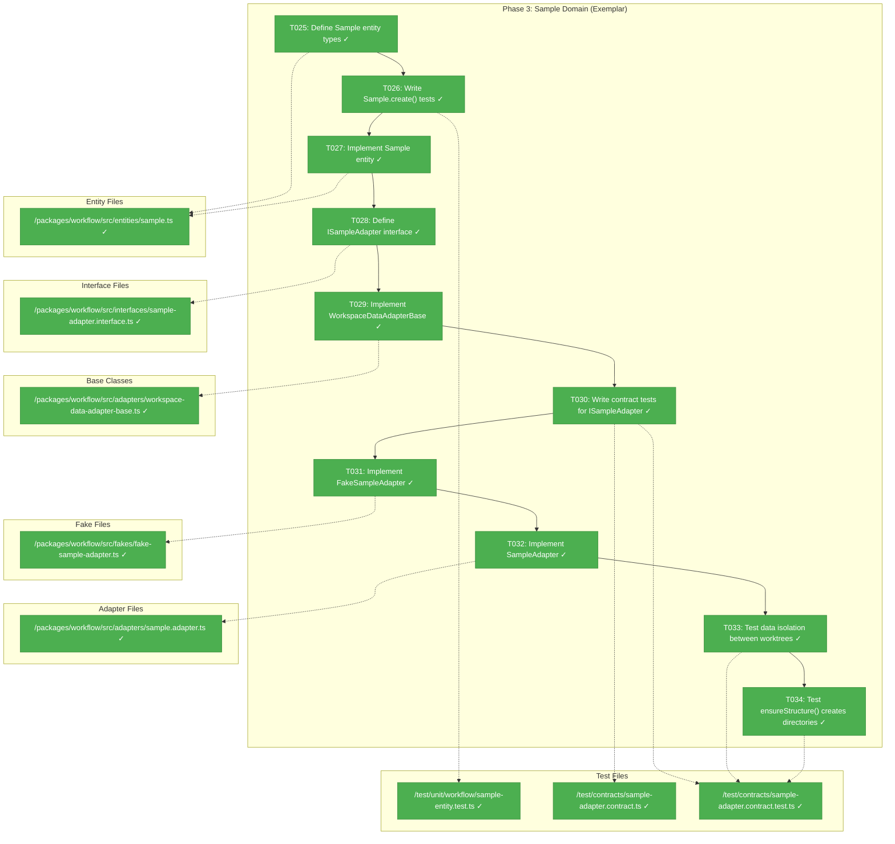
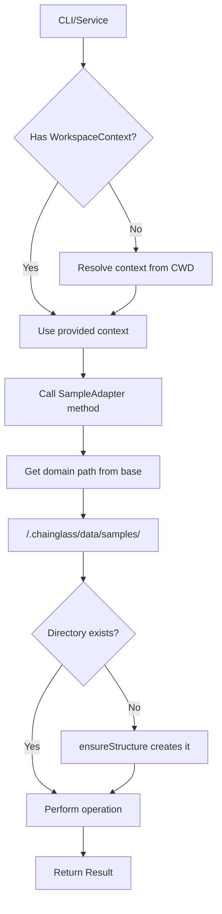
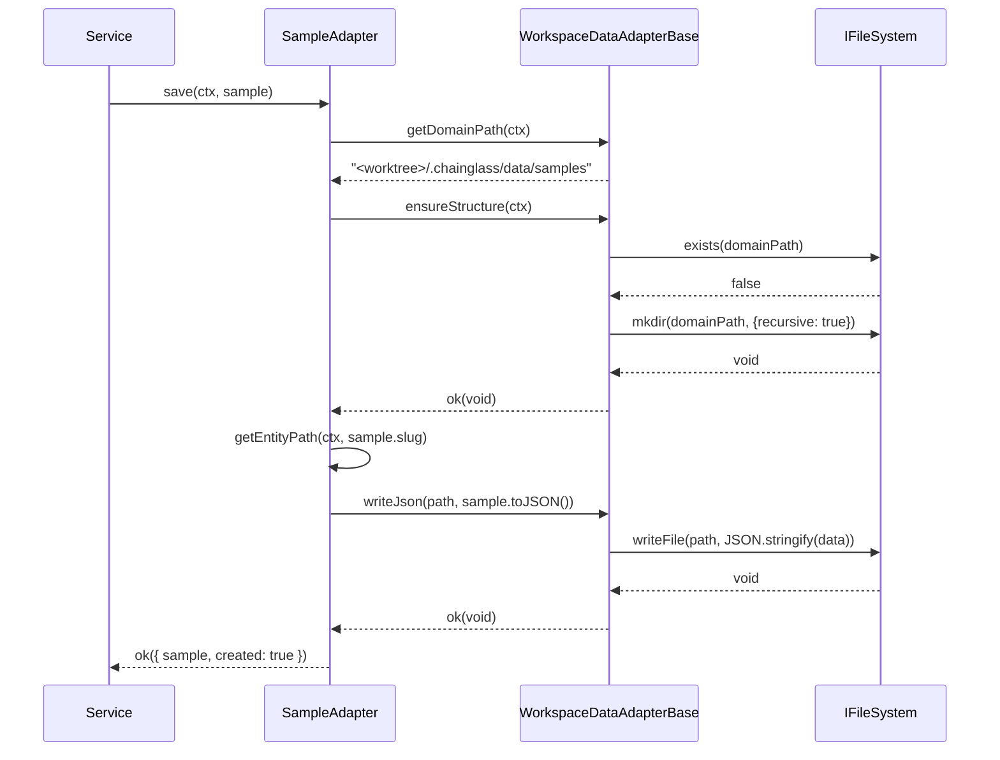

# Phase 3: Sample Domain (Exemplar) – Tasks & Alignment Brief

**Spec**: [workspaces-spec.md](../../workspaces-spec.md)
**Plan**: [workspaces-plan.md](../../workspaces-plan.md)
**Date**: 2026-01-27

---

## Executive Briefing

### Purpose
This phase implements the **Sample domain** as a complete exemplar for workspace-scoped data storage. The Sample domain validates all patterns (entity, adapter, base class) before applying them to real domains like agents, workflows, and prompts. Without this exemplar, we'd risk implementing incorrect patterns in production code.

### What We're Building
A **Sample entity** with full CRUD operations and a **WorkspaceDataAdapterBase** class that:
- Provides common functionality for all per-worktree domain adapters
- Stores data in `<worktree>/.chainglass/data/samples/`
- Ensures data isolation between worktrees (feature branch data stays separate until merged)
- Creates directory structures on demand via `ensureStructure()`

The Sample domain includes:
- `Sample` entity with `slug`, `name`, `description`, `createdAt`, `updatedAt`
- `ISampleAdapter` interface with standard 5-method contract
- `SampleAdapter` extending `WorkspaceDataAdapterBase` for real filesystem operations
- `FakeSampleAdapter` with three-part API for testing
- Contract tests verifying fake-real parity

### User Value
Users can store workspace-scoped data that travels with git branches. Data created in a feature branch worktree stays isolated until merged to main. This enables collaborative workflows where team members' in-progress work doesn't conflict.

### Example
**WorkspaceContext**: `{ workspacePath: "/home/jak/chainglass", worktreePath: "/home/jak/chainglass-014" }`

**Storage Path**: `/home/jak/chainglass-014/.chainglass/data/samples/test-sample.json`

**Sample Entity**:
```json
{
  "slug": "test-sample",
  "name": "Test Sample",
  "description": "A sample for testing",
  "createdAt": "2026-01-27T12:00:00.000Z",
  "updatedAt": "2026-01-27T12:00:00.000Z"
}
```

---

## Objectives & Scope

### Objective
Implement the Sample domain to validate workspace data model patterns as specified in the plan. This establishes reusable `WorkspaceDataAdapterBase` for all future per-worktree domain adapters.

**Behavior Checklist** (from Plan acceptance criteria):
- [ ] Sample CRUD works with WorkspaceContext
- [ ] Data stored in `<worktree>/.chainglass/data/samples/`
- [ ] Contract tests pass for both adapters
- [ ] WorkspaceDataAdapterBase reusable for future domains

### Goals

- ✅ Define Sample entity with factory method (`create()`) and `toJSON()`
- ✅ Define ISampleAdapter interface with 5-method contract (`load`, `save`, `list`, `remove`, `exists`)
- ✅ Implement WorkspaceDataAdapterBase abstract class with common methods
- ✅ Implement FakeSampleAdapter with three-part API (state setup, inspection, error injection)
- ✅ Implement SampleAdapter extending WorkspaceDataAdapterBase
- ✅ Write contract tests verifying fake-real parity
- ✅ Test data isolation between WorkspaceContexts
- ✅ Test ensureStructure() creates directories on first write

### Non-Goals (Scope Boundaries)

- ❌ Service layer business logic (Phase 4)
- ❌ CLI commands for samples (Phase 5)
- ❌ Web UI for samples (Phase 6)
- ❌ Real domain adapters (agents, workflows, prompts) - Sample is the exemplar only
- ❌ Migration logic for existing data (fresh start for samples)
- ❌ Caching of sample data (always fresh per spec Q5)
- ❌ Conflict resolution for concurrent writes (documented limitation from Phase 1 review)
- ❌ Sample relationships (standalone entity, no foreign keys)

---

## Architecture Map

### Component Diagram
<!-- Status: grey=pending, orange=in-progress, green=completed, red=blocked -->
<!-- Updated by plan-6 during implementation -->



### Task-to-Component Mapping

<!-- Status: ⬜ Pending | 🟧 In Progress | ✅ Complete | 🔴 Blocked -->

| Task | Component(s) | Files | Status | Comment |
|------|-------------|-------|--------|---------|
| T025 | Sample Entity Types | sample.ts | ✅ Complete | Define SampleInput, SampleJSON, Sample class structure |
| T026 | Sample Tests | sample-entity.test.ts | ✅ Complete | TDD: write failing tests for create(), toJSON() |
| T027 | Sample Entity | sample.ts | ✅ Complete | Implement to make tests pass |
| T028 | ISampleAdapter | sample-adapter.interface.ts | ✅ Complete | 5-method contract: load, save, list, remove, exists |
| T029 | WorkspaceDataAdapterBase | workspace-data-adapter-base.ts | ✅ Complete | Abstract base for all per-worktree adapters |
| T030 | Contract Tests | sample-adapter.contract.ts + .test.ts | ✅ Complete | Factory pattern + test execution |
| T031 | FakeSampleAdapter | fake-sample-adapter.ts | ✅ Complete | Three-part API for testing |
| T032 | SampleAdapter | sample.adapter.ts | ✅ Complete | Real implementation extending base |
| T033 | Isolation Tests | sample-adapter.contract.test.ts | ✅ Complete | Different contexts → isolated data |
| T034 | ensureStructure Tests | sample-adapter.contract.test.ts | ✅ Complete | Directory creation on first write |

---

## Tasks

| Status | ID | Task | CS | Type | Dependencies | Absolute Path(s) | Validation | Subtasks | Notes |
|--------|------|------|----|------|--------------|------------------|------------|----------|-------|
| [x] | T025 | Define Sample entity types (SampleInput, SampleJSON interfaces) | 1 | Setup | – | /home/jak/substrate/014-workspaces/packages/workflow/src/entities/sample.ts | Types compile, exported from index.ts | – | Follow Workspace pattern. `create()` sets both timestamps; adapter overwrites `updatedAt` on save |
| [x] | T026 | Write failing tests for Sample.create() and toJSON() | 1 | Test | T025 | /home/jak/substrate/014-workspaces/test/unit/workflow/sample-entity.test.ts | Tests fail with expected assertions | – | TDD: ~10 test cases |
| [x] | T027 | Implement Sample entity with create() factory and toJSON() | 1 | Core | T026 | /home/jak/substrate/014-workspaces/packages/workflow/src/entities/sample.ts | All entity tests pass | – | Private constructor + static factory |
| [x] | T028 | Define ISampleAdapter interface with 5-method contract | 1 | Setup | T027 | /home/jak/substrate/014-workspaces/packages/workflow/src/interfaces/sample-adapter.interface.ts | Interface compiles, exported | – | load, save, list, remove, exists. Also create sample-errors.ts with E082-E089 |
| [x] | T029 | Implement WorkspaceDataAdapterBase abstract class | 3 | Core | T028 | /home/jak/substrate/014-workspaces/packages/workflow/src/adapters/workspace-data-adapter-base.ts | Base class compiles, getDomainPath/readJson/writeJson work | – | Constructor: `(protected fs: IFileSystem, protected pathResolver: IPathResolver)`. Per Critical Discovery 02 |
| [x] | T030 | Write contract tests for ISampleAdapter | 3 | Test | T029 | /home/jak/substrate/014-workspaces/test/contracts/sample-adapter.contract.ts, /home/jak/substrate/014-workspaces/test/contracts/sample-adapter.contract.test.ts | Tests compile, define factory pattern | – | TestContext includes: `adapter`, `ctx` (default), `createContext()` for isolation tests |
| [x] | T031 | Implement FakeSampleAdapter with three-part API | 2 | Core | T030 | /home/jak/substrate/014-workspaces/packages/workflow/src/fakes/fake-sample-adapter.ts | Contract tests pass for fake | – | Composite key `${worktreePath}\|${slug}` for isolation. Three-part API: addSample(), *Calls getters, inject*Error() |
| [x] | T032 | Implement SampleAdapter extending WorkspaceDataAdapterBase | 2 | Core | T031 | /home/jak/substrate/014-workspaces/packages/workflow/src/adapters/sample.adapter.ts | Contract tests pass for real adapter | – | Calls `super(fs, pathResolver)` in constructor; uses `this.fs` for I/O |
| [x] | T033 | Add tests for data isolation between worktrees | 2 | Test | T032 | /home/jak/substrate/014-workspaces/test/contracts/sample-adapter.contract.test.ts | Different WorkspaceContexts have isolated data | – | Key validation for worktree support |
| [x] | T034 | Add tests for ensureStructure() directory creation | 1 | Test | T032 | /home/jak/substrate/014-workspaces/test/contracts/sample-adapter.contract.test.ts | .chainglass/data/samples/ created on first write | – | Verify lazy creation |

---

## Alignment Brief

### Prior Phases Review

#### Phase 1: Workspace Entity + Registry Adapter + Contract Tests (COMPLETE)

**A. Deliverables Created**

| Component | Path | Description |
|-----------|------|-------------|
| Workspace entity | /home/jak/substrate/014-workspaces/packages/workflow/src/entities/workspace.ts | WorkspaceInput, WorkspaceJSON, Workspace class with create()/toJSON() |
| IWorkspaceRegistryAdapter | /home/jak/substrate/014-workspaces/packages/workflow/src/interfaces/workspace-registry-adapter.interface.ts | 5-method contract: load, save, list, remove, exists |
| WorkspaceRegistryAdapter | /home/jak/substrate/014-workspaces/packages/workflow/src/adapters/workspace-registry.adapter.ts | Real implementation with JSON file I/O for ~/.config/chainglass/workspaces.json |
| FakeWorkspaceRegistryAdapter | /home/jak/substrate/014-workspaces/packages/workflow/src/fakes/fake-workspace-registry-adapter.ts | Three-part API (state setup, inspection, error injection) |
| Error codes E074-E081 | /home/jak/substrate/014-workspaces/packages/workflow/src/errors/workspace-errors.ts | WorkspaceErrors factory + error classes |
| Entity unit tests | /home/jak/substrate/014-workspaces/test/unit/workflow/workspace-entity.test.ts | 23 tests |
| Contract tests | /home/jak/substrate/014-workspaces/test/contracts/workspace-registry-adapter.contract.test.ts | 24 tests (Fake + Real) |

**B. Lessons Learned**

- **TDD with Fakes worked well**: Writing tests first forced clear API design
- **Contract test factory pattern**: `workspaceRegistryAdapterContractTests()` ensures fake-real parity
- **Three-part fake API**: State setup (`addWorkspace`), inspection (`*Calls` getters), error injection (`inject*Error`)
- **slugify package**: External library handled Unicode edge cases better than hand-rolled
- **Error code shift**: E070→E074 to avoid PhaseService collision
- **No fromJSON()**: Use entity.create() with all fields for deserialization

**C. Technical Discoveries (Gotchas for Phase 3)**

1. **Registry file has `version: 1`**: For future migrations
2. **Path validation in adapter**: Entity is pure data, adapter enforces I/O constraints
3. **Error injection typing**: Cast `inject*Error.code` to appropriate type

**D. Dependencies Exported for Phase 3**

| Export | Usage in Phase 3 |
|--------|------------------|
| Entity pattern | Sample follows Workspace's private constructor + create() |
| Contract test factory | Template for sample-adapter.contract.ts |
| Three-part fake API | FakeSampleAdapter follows same pattern |
| Result types | SampleLoadResult, SampleSaveResult, etc. |
| Error factory pattern | May need E082+ for Sample errors |

**E. Critical Findings Applied**

| Finding | How Applied | Reference |
|---------|-------------|-----------|
| Critical 03: Contract Tests | Factory pattern | workspace-registry-adapter.contract.test.ts |
| High 07: Entity Factory | Private constructor + create() | workspace.ts:96 |

**F. Test Infrastructure Created**

- `SAMPLE_WORKSPACE_1`, `SAMPLE_WORKSPACE_2` fixtures
- `WorkspaceRegistryAdapterTestContext` interface pattern
- Call recording types: `*LoadCall`, `*SaveCall`, etc.

**G. Technical Debt**

| Debt | Location | Severity |
|------|----------|----------|
| Race condition in registry | workspace-registry.adapter.ts | Low (documented limitation) |

---

#### Phase 2: WorkspaceContext Resolution + Worktree Discovery (COMPLETE)

**A. Deliverables Created**

| Component | Path | Description |
|-----------|------|-------------|
| WorkspaceContext interface | /home/jak/substrate/014-workspaces/packages/workflow/src/interfaces/workspace-context.interface.ts | Resolution result with workspace + worktree info |
| Worktree type | /home/jak/substrate/014-workspaces/packages/workflow/src/interfaces/workspace-context.interface.ts | Git worktree metadata |
| IWorkspaceContextResolver | /home/jak/substrate/014-workspaces/packages/workflow/src/interfaces/workspace-context.interface.ts | resolveFromPath(), getWorkspaceInfo() |
| WorkspaceContextResolver | /home/jak/substrate/014-workspaces/packages/workflow/src/resolvers/workspace-context.resolver.ts | Real implementation |
| GitWorktreeResolver | /home/jak/substrate/014-workspaces/packages/workflow/src/resolvers/git-worktree.resolver.ts | Git worktree detection via IProcessManager |
| FakeWorkspaceContextResolver | /home/jak/substrate/014-workspaces/packages/workflow/src/fakes/fake-workspace-context-resolver.ts | Three-part API for testing |
| FakeGitWorktreeResolver | /home/jak/substrate/014-workspaces/packages/workflow/src/fakes/fake-git-worktree-resolver.ts | Configurable git responses |
| Context resolution tests | /home/jak/substrate/014-workspaces/test/unit/workflow/workspace-context-resolution.test.ts | 13 tests |
| Git worktree tests | /home/jak/substrate/014-workspaces/test/unit/workflow/git-worktree-resolver.test.ts | 24 tests |
| Contract tests | /home/jak/substrate/014-workspaces/test/contracts/workspace-context-resolver.contract.test.ts | 10 tests |

**B. Lessons Learned**

- **IProcessManager for git**: Per DYK-01, use existing interface not simple-git library
- **DI container per ADR-0004**: All resolvers must be DI-injectable
- **Sort by path.length descending**: Per DYK-03, for overlapping workspace matching
- **Test all porcelain variants**: Per DYK-05 (normal, detached HEAD, bare, prunable)
- **Graceful degradation**: Git failures → empty worktree list, not error

**C. Technical Discoveries (Gotchas for Phase 3)**

1. **WorkspaceContext.worktreePath**: This is the path where data should be stored
2. **hasGit detection**: Check for .git file/directory
3. **Version comparison**: semver-style for git version check

**D. Dependencies Exported for Phase 3**

| Export | Usage in Phase 3 |
|--------|------------------|
| WorkspaceContext | SampleAdapter methods receive this as parameter |
| IWorkspaceContextResolver | Service layer will use to resolve context |
| FakeWorkspaceContextResolver | Tests use to set up context |
| Three-part resolver fake API | Pattern for any additional resolver fakes |

**E. Critical Findings Applied**

| Finding | How Applied | Reference |
|---------|-------------|-----------|
| High Discovery 04 | Graceful degradation for git unavailable | git-worktree.resolver.ts |
| High Discovery 06 | E079 for git operation failures | workspace-errors.ts |

**F. Test Infrastructure Created**

- Fake git output strings for porcelain parsing
- `setContext()` API for FakeWorkspaceContextResolver
- `FakeProcessManager` integration for git commands

---

### Critical Findings Affecting This Phase

**Critical Discovery 02: WorkspaceDataAdapterBase Pattern** (Impact: Critical)
- **Constraint**: Base class provides getDomainPath(), readJson(), writeJson(), ensureStructure()
- **Requirement**: Sample adapter MUST extend this base class
- **Implementation**: Abstract class with `domain: string` abstract property
- **Addressed by**: T029

**Critical Discovery 03: Contract Tests for Adapter Parity** (Impact: Critical)
- **Constraint**: FakeSampleAdapter and SampleAdapter must pass identical contract tests
- **Requirement**: Write contract tests BEFORE implementation; run against both adapters
- **Addressed by**: T030, T031, T032

**High Discovery 07: Entity Factory Pattern** (Impact: High)
- **Constraint**: Private constructor + static factory methods; enforce invariants in factory
- **Requirement**: Sample entity follows exact pattern from Workspace entity
- **Addressed by**: T025, T027

### ADR Decision Constraints

**ADR-0004: Dependency Injection Container Architecture** – Use `useFactory` pattern, child containers for test isolation
- **Constraint**: SampleAdapter and base class must be DI-injectable
- **Constraint**: Tests must use child containers
- **Addressed by**: T029, T032

### Invariants & Guardrails

- **No caching**: Always fresh reads per spec Q5
- **Path isolation**: Each WorkspaceContext gets isolated data directory
- **Directory creation**: ensureStructure() before any write
- **Error codes**: E082-E089 allocated for Sample domain. Create `SampleErrors` factory following `WorkspaceErrors` pattern. E082=not found, E083=already exists, E084=invalid data, E085-E089=reserved

### Inputs to Read

| File | Purpose |
|------|---------|
| /home/jak/substrate/014-workspaces/packages/workflow/src/entities/workspace.ts | Entity pattern to follow |
| /home/jak/substrate/014-workspaces/packages/workflow/src/interfaces/workspace-registry-adapter.interface.ts | Interface pattern for ISampleAdapter |
| /home/jak/substrate/014-workspaces/packages/workflow/src/fakes/fake-workspace-registry-adapter.ts | Three-part API pattern |
| /home/jak/substrate/014-workspaces/test/contracts/workspace-registry-adapter.contract.ts | Contract test factory pattern |
| /home/jak/substrate/014-workspaces/packages/workflow/src/interfaces/workspace-context.interface.ts | WorkspaceContext to use |

### Visual Alignment Aids

#### Flow Diagram: Sample CRUD with WorkspaceContext



#### Sequence Diagram: Sample.save() Flow



### Test Plan (TDD - Tests First)

| Test File | Tests | Fixtures | Expected Behavior |
|-----------|-------|----------|-------------------|
| sample-entity.test.ts | Sample.create() generates slug from name | – | slug = slugify(name) |
| sample-entity.test.ts | Sample.create() sets createdAt and updatedAt | – | Both timestamps set to now |
| sample-entity.test.ts | Sample.create() accepts optional slug | – | Uses provided slug |
| sample-entity.test.ts | Sample.create() handles empty name | – | Fallback slug "sample" |
| sample-entity.test.ts | Sample.toJSON() outputs camelCase keys | – | Per DYK-03 |
| sample-adapter.contract.test.ts | load() returns null for non-existent | FakeSampleAdapter | null result |
| sample-adapter.contract.test.ts | save() creates new sample | FakeSampleAdapter | created: true |
| sample-adapter.contract.test.ts | save() updates existing sample | FakeSampleAdapter | created: false |
| sample-adapter.contract.test.ts | list() returns all samples | FakeSampleAdapter | Array of samples |
| sample-adapter.contract.test.ts | remove() deletes sample | FakeSampleAdapter | removed: true |
| sample-adapter.contract.test.ts | exists() checks presence | FakeSampleAdapter | boolean |
| sample-adapter.contract.test.ts | Different contexts isolated | Both adapters | No cross-contamination |
| sample-adapter.contract.test.ts | ensureStructure creates dirs | SampleAdapter | Directory created |

### Step-by-Step Implementation Outline

1. **T025**: Create `/packages/workflow/src/entities/sample.ts` with:
   - `SampleInput` interface (name, description, optional slug/timestamps)
   - `SampleJSON` interface
   - `Sample` class stub
   - Export from `entities/index.ts`

2. **T026**: Create `/test/unit/workflow/sample-entity.test.ts`:
   - Tests for slug generation
   - Tests for timestamp handling
   - Tests for toJSON() output
   - All tests should FAIL initially

3. **T027**: Implement Sample entity:
   - Private constructor
   - Static `create()` factory method
   - `toJSON()` serialization
   - Make all tests pass

4. **T028**: Create `/packages/workflow/src/interfaces/sample-adapter.interface.ts`:
   - `ISampleAdapter` interface with 5 methods
   - Result types: `SampleLoadResult`, `SampleSaveResult`, etc.
   - Export from `interfaces/index.ts`

5. **T029**: Create `/packages/workflow/src/adapters/workspace-data-adapter-base.ts`:
   - Abstract class with `domain: string` abstract property
   - `getDomainPath(ctx: WorkspaceContext): string`
   - `getEntityPath(ctx: WorkspaceContext, slug: string): string`
   - `ensureStructure(ctx: WorkspaceContext): Promise<Result<void>>`
   - `readJson<T>(path: string): Promise<Result<T>>`
   - `writeJson<T>(path: string, data: T): Promise<Result<void>>`
   - Export from `adapters/index.ts`

6. **T030**: Create contract tests:
   - `/test/contracts/sample-adapter.contract.ts` - Factory function
   - `/test/contracts/sample-adapter.contract.test.ts` - Test execution
   - Follow workspace-registry-adapter pattern

7. **T031**: Create `/packages/workflow/src/fakes/fake-sample-adapter.ts`:
   - In-memory Map<string, Map<string, Sample>> keyed by worktreePath
   - Three-part API: `addSample()`, `*Calls` getters, `inject*Error()`
   - Make contract tests pass

8. **T032**: Create `/packages/workflow/src/adapters/sample.adapter.ts`:
   - Extends `WorkspaceDataAdapterBase`
   - `domain = 'samples'`
   - Implements `ISampleAdapter` using base class methods
   - Make contract tests pass for real adapter

9. **T033**: Add isolation tests:
   - Two different WorkspaceContexts
   - Save sample to context A
   - List from context B should be empty
   - List from context A should have sample

10. **T034**: Add ensureStructure tests:
    - Start with non-existent directory
    - Save sample
    - Verify directory was created

### Commands to Run

```bash
# Type checking
pnpm exec tsc --project packages/workflow/tsconfig.json --noEmit

# Run specific tests
pnpm test -- test/unit/workflow/sample-entity.test.ts
pnpm test -- test/contracts/sample-adapter.contract.test.ts

# Full test suite
pnpm test

# Quality check
just check
```

### Risks/Unknowns

| Risk | Severity | Mitigation |
|------|----------|------------|
| WorkspaceDataAdapterBase design complexity | Medium | Follow plan's Critical Discovery 02 spec closely |
| Error code allocation | Low | May reuse existing codes or allocate E082+ |
| IFileSystem availability in tests | Low | Phase 2 established pattern with fakes |

### Ready Check

- [ ] Phase 1+2 lessons incorporated into task design
- [ ] WorkspaceDataAdapterBase signature clear (per Critical Discovery 02)
- [ ] Contract test factory pattern understood from Phase 1
- [ ] Three-part fake API pattern clear
- [ ] Test fixtures planned
- [ ] ADR constraints mapped to tasks (ADR-0004 → T029, T032)

---

## Phase Footnote Stubs

_To be populated by plan-6 during implementation._

| Footnote | Task | Description | File:Line |
|----------|------|-------------|-----------|
| | | | |

---

## Evidence Artifacts

- **Execution Log**: `./execution.log.md` (created by /plan-6)
- **Supporting Files**: Test output, screenshots if needed

---

## Discoveries & Learnings

_Populated during implementation by plan-6. Log anything of interest to your future self._

| Date | Task | Type | Discovery | Resolution | References |
|------|------|------|-----------|------------|------------|
| | | | | | |

**Types**: `gotcha` | `research-needed` | `unexpected-behavior` | `workaround` | `decision` | `debt` | `insight`

**What to log**:
- Things that didn't work as expected
- External research that was required
- Implementation troubles and how they were resolved
- Gotchas and edge cases discovered
- Decisions made during implementation
- Technical debt introduced (and why)
- Insights that future phases should know about

_See also: `execution.log.md` for detailed narrative._

---

## Directory Layout

```
docs/plans/014-workspaces/
├── workspaces-spec.md
├── workspaces-plan.md
└── tasks/
    ├── phase-1-workspace-entity-registry-adapter-contract-tests/
    │   ├── tasks.md
    │   └── execution.log.md
    ├── phase-2-workspacecontext-resolution/
    │   ├── tasks.md
    │   └── execution.log.md
    └── phase-3-sample-domain-exemplar/
        ├── tasks.md           # This file
        └── execution.log.md   # Created by /plan-6
```

---

## Critical Insights Discussion

**Session**: 2026-01-27 04:36 UTC
**Context**: Phase 3: Sample Domain (Exemplar) – Tasks & Alignment Brief
**Analyst**: AI Clarity Agent
**Reviewer**: Development Team
**Format**: Water Cooler Conversation (5 Critical Insights)

### Insight 1: WorkspaceDataAdapterBase Constructor Injection

**Did you know**: Task T029 describes the base class but doesn't specify that both base and subclasses need IFileSystem + IPathResolver constructor injection, matching all existing adapters.

**Implications**:
- All adapters use identical pattern: `constructor(protected fs: IFileSystem, protected pathResolver: IPathResolver)`
- WorkspaceContext is path data only - no service dependencies
- T032 note "Uses IFileSystem from context" was ambiguous

**Options Considered**:
- Option A: Document constructor injection explicitly
- Option B: Leave implicit, assume implementer reads existing adapters

**AI Recommendation**: Option A - Document explicitly

**Decision**: Document constructor injection explicitly in T029 and T032

**Affects**: T029, T032

---

### Insight 2: Sample Entity updatedAt Handling

**Did you know**: Sample entity specifies updatedAt but Workspace only has createdAt. The tasks don't clarify who updates updatedAt - entity or adapter.

**Options Considered**:
- Option A: Entity.update() factory method
- Option B: Adapter overwrites updatedAt on every save
- Option C: Remove updatedAt from Sample entirely

**AI Recommendation**: Option B - Adapter owns updatedAt

**Decision**: Adapter owns updatedAt - overwrites on every save

**Affects**: T025 (entity types)

---

### Insight 3: Error Codes Not Allocated

**Did you know**: Tasks say "may need E082+" for Sample errors but don't define which codes or scenarios need them.

**Options Considered**:
- Option A: Allocate E082-E089 for Sample errors with SampleErrors factory
- Option B: Use generic EntityNotFoundError (no error code)
- Option C: Don't allocate - handle during implementation

**AI Recommendation**: Option A - Allocate E082-E089

**Decision**: Allocate E082-E089 for Sample errors; create SampleErrors factory

**Affects**: T028 (add sample-errors.ts), Invariants section

---

### Insight 4: Contract Test Factory Needs WorkspaceContext

**Did you know**: Phase 1 contract tests don't use WorkspaceContext (registry is global), but SampleAdapter requires it for every method.

**Options Considered**:
- Option A: Test factory provides default WorkspaceContext fixture + createContext helper
- Option B: Each test creates its own WorkspaceContext
- Option C: Factory function accepts context as parameter

**AI Recommendation**: Option A - Factory provides default context fixture

**Decision**: TestContext includes `adapter`, `ctx` (default), `createContext()` for isolation tests

**Affects**: T030 (contract tests)

---

### Insight 5: FakeSampleAdapter Data Isolation Structure

**Did you know**: FakeSampleAdapter needs to isolate data by WorkspaceContext.worktreePath, but tasks don't specify the internal data structure.

**Options Considered**:
- Option A: Nested Map (Map<worktreePath, Map<slug, Sample>>)
- Option B: Single Map with composite key
- Option C: Array of {context, samples} objects

**AI Recommendation**: Option B - Composite key

**Decision**: Composite key `${worktreePath}|${slug}` for data isolation

**Affects**: T031 (FakeSampleAdapter)

---

## Session Summary

**Insights Surfaced**: 5 critical insights identified and discussed
**Decisions Made**: 5 decisions reached through collaborative discussion
**Confidence Level**: High - All ambiguities resolved, patterns verified against codebase

**Next Steps**: Proceed with `/plan-6-implement-phase --phase "Phase 3: Sample Domain (Exemplar)"`
