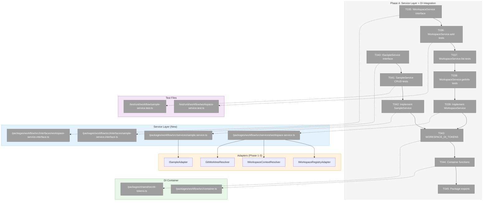
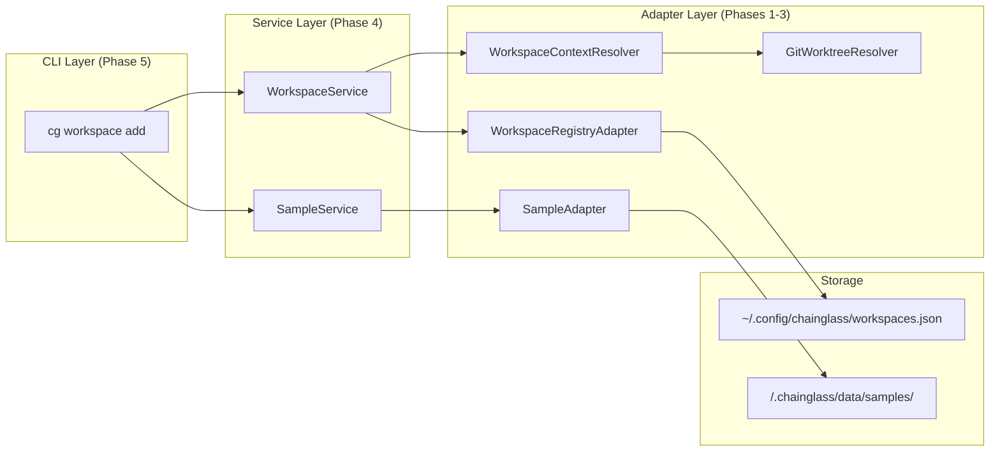
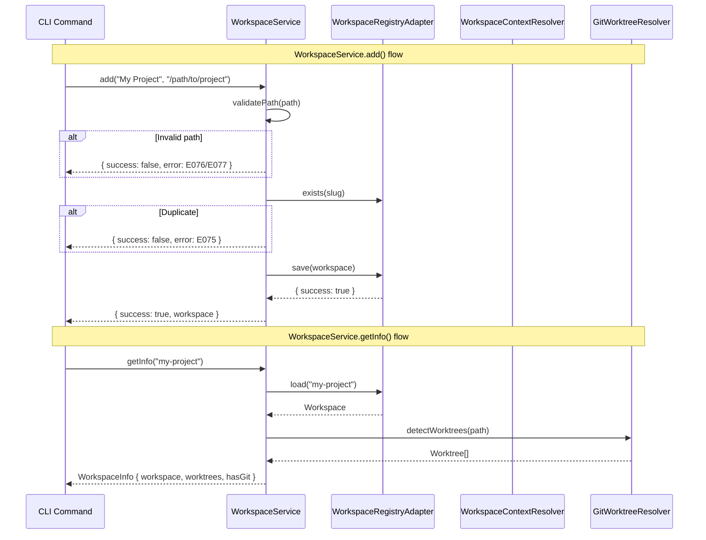

# Phase 4: Service Layer + DI Integration – Tasks & Alignment Brief

**Spec**: [../workspaces-spec.md](../workspaces-spec.md)
**Plan**: [../workspaces-plan.md](../workspaces-plan.md)
**Date**: 2026-01-27

---

## Executive Briefing

### Purpose

This phase implements `WorkspaceService` and `SampleService`, the business logic layer that orchestrates workspace registration and sample domain operations. These services wrap the adapters from Phases 1-3 with a clean API, coordinate context resolution, and integrate with the DI container for testability.

### What We're Building

Two services with full DI integration:

1. **WorkspaceService** – Manages workspace lifecycle (add, list, remove, getInfo)
   - Validates paths before registration
   - Coordinates with WorkspaceContextResolver for path-to-workspace mapping
   - Aggregates workspace info with worktree data from GitWorktreeResolver

2. **SampleService** – CRUD operations for sample domain within a workspace context
   - Requires WorkspaceContext for all operations (scoped to worktree)
   - Delegates to SampleAdapter for persistence
   - Returns Result types (never throws)

### User Value

- CLI and Web can depend on a single service interface rather than multiple adapters
- Services handle cross-cutting concerns (validation, error mapping) in one place
- DI container enables clean testing with fakes at the service level

### Example

**WorkspaceService.add()**:
```typescript
const result = await workspaceService.add('My Project', '/home/user/my-project');
// Returns: { success: true, workspace: Workspace } or { success: false, error: { code: 'E075', ... } }
```

**SampleService.add()**:
```typescript
const ctx = await contextResolver.resolveFromPath(process.cwd());
const result = await sampleService.add(ctx, 'Test Sample', 'A sample description');
// Returns: { success: true, sample: Sample } or { success: false, error: { code: 'E083', ... } }
```

---

## Objectives & Scope

### Objective

Implement WorkspaceService and SampleService with DI container integration, satisfying plan acceptance criteria:
- [ ] WorkspaceService fully tested with fakes
- [ ] SampleService fully tested with fakes
- [ ] DI containers properly wire dependencies
- [ ] Services never throw, return Result types

### Goals

- ✅ Define `IWorkspaceService` interface with add, list, remove, getInfo, resolveContext
- ✅ Implement WorkspaceService with FakeWorkspaceRegistryAdapter tests
- ✅ Define `ISampleService` interface with add, list, get, delete
- ✅ Implement SampleService with FakeSampleAdapter tests
- ✅ Add WORKSPACE_DI_TOKENS to `packages/workflow/src/di-tokens.ts` (per ADR-0004 IMP-006)
- ✅ Create production and test container functions (per ADR-0004)
- ✅ Export all new types from package index

### Non-Goals (Scope Boundaries)

- ❌ CLI command implementation (Phase 5)
- ❌ Web API routes (Phase 6)
- ❌ Service-level caching (per spec Q5: always fresh)
- ❌ Batch operations for samples (single-item CRUD only)
- ❌ Workspace data migration or upgrade logic
- ❌ Real adapter integration tests (use contract tests from Phase 1-3)

---

## Architecture Map

### Component Diagram

<!-- Status: grey=pending, orange=in-progress, green=completed, red=blocked -->
<!-- Updated by plan-6 during implementation -->



### Task-to-Component Mapping

<!-- Status: ⬜ Pending | 🟧 In Progress | ✅ Complete | 🔴 Blocked -->

| Task | Component(s) | Files | Status | Comment |
|------|-------------|-------|--------|---------|
| T035 | IWorkspaceService | workspace-service.interface.ts | ⬜ Pending | Service interface with 5 methods |
| T036 | WorkspaceService tests | workspace-service.test.ts | ⬜ Pending | add() TDD: success, duplicate, invalid path |
| T037 | WorkspaceService tests | workspace-service.test.ts | ⬜ Pending | list() TDD: empty, multiple |
| T038 | WorkspaceService tests | workspace-service.test.ts | ⬜ Pending | getInfo() TDD: with/without worktrees |
| T039 | WorkspaceService | workspace.service.ts | ⬜ Pending | Implementation to pass tests |
| T040 | ISampleService | sample-service.interface.ts | ⬜ Pending | Service interface with 4 methods |
| T041 | SampleService tests | sample-service.test.ts | ⬜ Pending | CRUD TDD: add, list, get, delete |
| T042 | SampleService | sample.service.ts | ⬜ Pending | Implementation to pass tests |
| T043 | DI Tokens | di-tokens.ts | ⬜ Pending | WORKSPACE_DI_TOKENS constant |
| T044 | Container | container.ts | ⬜ Pending | Production + test container functions |
| T045 | Package exports | index.ts, interfaces/index.ts | ⬜ Pending | Export all new types |

---

## Tasks

| Status | ID | Task | CS | Type | Dependencies | Absolute Path(s) | Validation | Subtasks | Notes |
|--------|------|------|-----|------|--------------|------------------|------------|----------|-------|
| [x] | T035 | Define IWorkspaceService interface with add, list, remove, getInfo, resolveContext methods | 1 | Setup | – | /home/jak/substrate/014-workspaces/packages/workflow/src/interfaces/workspace-service.interface.ts | Interface compiles, documented | – | Methods return Result types |
| [x] | T035a | Extract IGitWorktreeResolver interface from GitWorktreeResolver + create FakeGitWorktreeResolver | 2 | Setup | – | /home/jak/substrate/014-workspaces/packages/workflow/src/interfaces/git-worktree-resolver.interface.ts, /home/jak/substrate/014-workspaces/packages/workflow/src/fakes/fake-git-worktree-resolver.ts | Interface compiles, fake follows three-part API | – | DYK-P4-03: Git ops need proper DI |
| [x] | T036 | Write tests for WorkspaceService.add() covering success, duplicate slug (E075), invalid path (E076/E077) | 2 | Test | T035 | /home/jak/substrate/014-workspaces/test/unit/workflow/workspace-service.test.ts | Tests pass (GREEN) | – | Use FakeWorkspaceRegistryAdapter |
| [x] | T037 | Write tests for WorkspaceService.list() covering empty registry, multiple workspaces | 1 | Test | T035 | /home/jak/substrate/014-workspaces/test/unit/workflow/workspace-service.test.ts | Tests pass (GREEN) | – | |
| [x] | T038 | Write tests for WorkspaceService.getInfo() covering no git, with worktrees, not found | 2 | Test | T035, T035a | /home/jak/substrate/014-workspaces/test/unit/workflow/workspace-service.test.ts | Tests pass (GREEN) | – | Use FakeGitWorktreeResolver |
| [x] | T039 | Implement WorkspaceService with constructor injection of adapters and resolvers | 3 | Core | T036, T037, T038 | /home/jak/substrate/014-workspaces/packages/workflow/src/services/workspace.service.ts | All T036-T038 tests pass (GREEN) | – | Per ADR-0004 useFactory pattern |
| [x] | T040 | Define ISampleService interface with add, list, get, delete methods | 1 | Setup | – | /home/jak/substrate/014-workspaces/packages/workflow/src/interfaces/sample-service.interface.ts | Interface compiles, documented | – | All methods take WorkspaceContext |
| [x] | T041 | Write tests for SampleService CRUD covering add, list, get, delete, not found (E082) | 2 | Test | T040 | /home/jak/substrate/014-workspaces/test/unit/workflow/sample-service.test.ts | Tests pass (GREEN) | – | Use FakeSampleAdapter (DYK-P3-04) |
| [x] | T042 | Implement SampleService with constructor injection of ISampleAdapter | 2 | Core | T041 | /home/jak/substrate/014-workspaces/packages/workflow/src/services/sample.service.ts | All T041 tests pass (GREEN) | – | |
| [x] | T043 | Add WORKSPACE_DI_TOKENS to @chainglass/shared/di-tokens.ts | 1 | Setup | T039, T042 | /home/jak/substrate/014-workspaces/packages/shared/src/di-tokens.ts | Tokens defined, compile | – | Per ADR-0004 IMP-006; DYK-P4-02: separate object |
| [x] | T044 | Update container.ts with workspace/sample service registrations for prod and test | 2 | Integration | T043 | /home/jak/substrate/014-workspaces/packages/workflow/src/container.ts | Container resolves services | – | Per ADR-0004 |
| [x] | T045 | Export new interfaces, services, tokens from package index | 1 | Doc | T044 | /home/jak/substrate/014-workspaces/packages/workflow/src/index.ts, /home/jak/substrate/014-workspaces/packages/workflow/src/interfaces/index.ts | Types importable from @chainglass/workflow | – | |

---

## Alignment Brief

### Prior Phases Review

#### Phase 1: Workspace Entity + Registry Adapter + Contract Tests (Complete)

**Deliverables for Phase 4**:
| Export | Path | Usage |
|--------|------|-------|
| `Workspace` entity | `/home/jak/substrate/014-workspaces/packages/workflow/src/entities/workspace.ts` | Service returns these entities |
| `IWorkspaceRegistryAdapter` | `/home/jak/substrate/014-workspaces/packages/workflow/src/interfaces/workspace-registry-adapter.interface.ts` | WorkspaceService dependency |
| `FakeWorkspaceRegistryAdapter` | `/home/jak/substrate/014-workspaces/packages/workflow/src/fakes/fake-workspace-registry-adapter.ts` | WorkspaceService tests |
| `WorkspaceErrors` | `/home/jak/substrate/014-workspaces/packages/workflow/src/errors/workspace-errors.ts` | Error codes E074-E081 |
| `WorkspaceRegistryAdapter` | `/home/jak/substrate/014-workspaces/packages/workflow/src/adapters/workspace-registry.adapter.ts` | Production container |

**Key Patterns**:
- Private constructor + `Workspace.create()` factory
- Three-part fake API: state setup (`setState()`), inspection (`*Calls`), error injection (`inject*Error`)
- Contract tests ensure fake-real parity
- Path validation with URL decode loop (security fix)

**Technical Debt**:
- No file locking for concurrent writes
- Tilde expansion in FakePathResolver incomplete

#### Phase 2: WorkspaceContext Resolution + Worktree Discovery (Complete)

**Deliverables for Phase 4**:
| Export | Path | Usage |
|--------|------|-------|
| `WorkspaceContext` | `/home/jak/substrate/014-workspaces/packages/workflow/src/interfaces/workspace-context.interface.ts` | SampleService requires for all ops |
| `WorkspaceInfo` | `/home/jak/substrate/014-workspaces/packages/workflow/src/interfaces/workspace-context.interface.ts` | WorkspaceService.getInfo() return type |
| `IWorkspaceContextResolver` | `/home/jak/substrate/014-workspaces/packages/workflow/src/interfaces/workspace-context.interface.ts` | WorkspaceService dependency |
| `FakeWorkspaceContextResolver` | `/home/jak/substrate/014-workspaces/packages/workflow/src/fakes/fake-workspace-context-resolver.ts` | WorkspaceService tests |
| `WorkspaceContextResolver` | `/home/jak/substrate/014-workspaces/packages/workflow/src/resolvers/workspace-context.resolver.ts` | Production container |
| `GitWorktreeResolver` | `/home/jak/substrate/014-workspaces/packages/workflow/src/resolvers/git-worktree.resolver.ts` | Production container |

**Key Patterns**:
- DYK-01: Use IProcessManager for git commands (testable)
- DYK-03: Longest-path-wins sorting for overlapping workspaces
- Graceful degradation: git ops return `[]` on failure, never throw

**Technical Debt**:
- GitWorktreeResolver not yet wired into WorkspaceContextResolver.resolveFromPath()

#### Phase 3: Sample Domain (Exemplar) (Complete)

**Deliverables for Phase 4**:
| Export | Path | Usage |
|--------|------|-------|
| `Sample` entity | `/home/jak/substrate/014-workspaces/packages/workflow/src/entities/sample.ts` | SampleService returns these entities |
| `ISampleAdapter` | `/home/jak/substrate/014-workspaces/packages/workflow/src/interfaces/sample-adapter.interface.ts` | SampleService dependency |
| `FakeSampleAdapter` | `/home/jak/substrate/014-workspaces/packages/workflow/src/fakes/fake-sample-adapter.ts` | SampleService tests |
| `SampleAdapter` | `/home/jak/substrate/014-workspaces/packages/workflow/src/adapters/sample.adapter.ts` | Production container |
| `SampleErrors` | `/home/jak/substrate/014-workspaces/packages/workflow/src/errors/sample-errors.ts` | Error codes E082-E089 |
| `WorkspaceDataAdapterBase` | `/home/jak/substrate/014-workspaces/packages/workflow/src/adapters/workspace-data-adapter-base.ts` | Template for future adapters |

**Key Patterns (DYK)**:
- DYK-P3-01: Constructor injection `(protected fs: IFileSystem, protected pathResolver: IPathResolver)`
- DYK-P3-02: Adapter owns `updatedAt` – overwrites on every save
- DYK-P3-03: E082-E089 allocated for Sample errors
- DYK-P3-04: TestContext needs `ctx` (default) + `createContext()` for isolation tests
- DYK-P3-05: Composite key `${worktreePath}|${slug}` for data isolation in FakeSampleAdapter

**Technical Debt**:
- No concurrent write handling (documented limitation)

#### Cross-Phase Synthesis

**Cumulative Test Infrastructure**:
| From Phase | Component | Reuse in Phase 4 |
|------------|-----------|------------------|
| Phase 1 | Contract test factory pattern | Template for service contract tests (if needed) |
| Phase 1 | FakeWorkspaceRegistryAdapter | WorkspaceService tests |
| Phase 2 | FakeWorkspaceContextResolver | WorkspaceService tests |
| Phase 3 | FakeSampleAdapter | SampleService tests |
| Phase 3 | `createDefaultContext()` helper | SampleService tests |

**Pattern Evolution**:
1. **Phase 1**: Established entity factory pattern, three-part fake API, contract tests
2. **Phase 2**: Added resolver pattern, graceful degradation for external deps
3. **Phase 3**: Validated WorkspaceDataAdapterBase pattern, composite key isolation
4. **Phase 4**: Service layer aggregates all patterns into cohesive API

**Architectural Continuity**:
- All adapters use constructor injection (DI-ready)
- All operations return Result types (never throw for expected errors)
- All fakes follow three-part API pattern
- All tests use beforeEach isolation

---

### Critical Findings Affecting This Phase

| Finding | What It Constrains | Tasks Affected |
|---------|-------------------|----------------|
| **CD-01: Split Storage Architecture** | Services must coordinate registry adapter (global) with context resolver (per-worktree) | T039 |
| **HD-05: Path Security** | WorkspaceService.add() must validate paths before passing to adapter | T036, T039 |
| **HD-06: Error Standardization** | Services return `WorkspaceError` / `SampleError` types from factories | T039, T042 |
| **HD-08: DI Container Pattern** | Use `useFactory` for all registrations; child containers for test isolation | T043, T044 |

---

### ADR Decision Constraints

**ADR-0004: Dependency Injection Container Architecture**

| Constraint | Impact on Phase 4 | Addressed By |
|------------|-------------------|--------------|
| **IMP-001**: Remediation Protocol | If direct instantiation found, migrate to container resolution | T044 |
| **IMP-002**: Container Bootstrap Sequence | Config → root container → child containers → resolve | T044 |
| **IMP-004**: Test Container Pattern | `createWorkflowTestContainer()` registers fakes; each test creates fresh child | T044 |
| **IMP-006**: Token Naming Convention | Tokens use interface name: `{ WORKSPACE_SERVICE: 'IWorkspaceService' }` | T043 |
| **POS-001**: Testability without mocks | Fakes injected via container; no vi.mock() | T036-T041 |
| **POS-006**: Test isolation guaranteed | Child containers per test prevent singleton pollution | T036-T041 |

**Tags**: T043, T044 → "Per ADR-0004"

---

### Invariants & Guardrails

- **No caching**: Per spec Q5, services always read fresh from adapters
- **No throwing**: Services return Result types for all error conditions
- **Context required**: SampleService methods require WorkspaceContext (not inferred from CWD)
- **Path validation**: WorkspaceService.add() validates before calling adapter

---

### Inputs to Read

| File | Purpose |
|------|---------|
| `/home/jak/substrate/014-workspaces/packages/workflow/src/interfaces/workspace-registry-adapter.interface.ts` | IWorkspaceRegistryAdapter contract |
| `/home/jak/substrate/014-workspaces/packages/workflow/src/interfaces/workspace-context.interface.ts` | WorkspaceContext, IWorkspaceContextResolver |
| `/home/jak/substrate/014-workspaces/packages/workflow/src/interfaces/sample-adapter.interface.ts` | ISampleAdapter contract |
| `/home/jak/substrate/014-workspaces/packages/workflow/src/services/workflow.service.ts` | Existing service pattern reference |
| `/home/jak/substrate/014-workspaces/packages/workflow/src/container.ts` | Existing DI pattern reference |
| `/home/jak/substrate/014-workspaces/packages/shared/src/di-tokens.ts` | Token naming pattern |

---

### Visual Alignment Aids

#### Service Layer Flow Diagram



#### Service Interaction Sequence



---

### Test Plan (TDD, Fakes Only per R-TEST-007)

#### WorkspaceService Tests (`/home/jak/substrate/014-workspaces/test/unit/workflow/workspace-service.test.ts`)

| Test Name | Fixture | Expected Output | Rationale |
|-----------|---------|-----------------|-----------|
| `add() should register new workspace` | FakeWorkspaceRegistryAdapter (empty) | `{ success: true, workspace }` | Happy path |
| `add() should return E075 for duplicate slug` | FakeWorkspaceRegistryAdapter (pre-populated) | `{ success: false, error.code: 'E075' }` | Collision handling |
| `add() should return E076 for relative path` | FakeWorkspaceRegistryAdapter | `{ success: false, error.code: 'E076' }` | Security (HD-05) |
| `add() should return E076 for traversal path` | FakeWorkspaceRegistryAdapter | `{ success: false, error.code: 'E076' }` | Security (HD-05) |
| `list() should return empty array` | FakeWorkspaceRegistryAdapter (empty) | `[]` | Empty state |
| `list() should return all workspaces` | FakeWorkspaceRegistryAdapter (3 items) | `[ws1, ws2, ws3]` | Multiple items |
| `remove() should delete workspace` | FakeWorkspaceRegistryAdapter (pre-populated) | `{ success: true }` | Happy path |
| `remove() should return E074 for not found` | FakeWorkspaceRegistryAdapter (empty) | `{ success: false, error.code: 'E074' }` | Not found |
| `getInfo() should return workspace with worktrees` | FakeWorkspaceRegistryAdapter, FakeWorkspaceContextResolver | `WorkspaceInfo { hasGit: true, worktrees: [...] }` | With git |
| `getInfo() should return workspace without git` | FakeWorkspaceContextResolver (no git) | `WorkspaceInfo { hasGit: false, worktrees: [] }` | No git |
| `getInfo() should return null for not found` | FakeWorkspaceRegistryAdapter (empty) | `null` | Not found |
| `resolveContext() should find workspace from path` | FakeWorkspaceContextResolver (pre-populated) | `WorkspaceContext` | Happy path |
| `resolveContext() should return null for unregistered` | FakeWorkspaceContextResolver (empty) | `null` | Not found |

#### SampleService Tests (`/home/jak/substrate/014-workspaces/test/unit/workflow/sample-service.test.ts`)

| Test Name | Fixture | Expected Output | Rationale |
|-----------|---------|-----------------|-----------|
| `add() should create new sample` | FakeSampleAdapter, ctx | `{ success: true, sample }` | Happy path |
| `add() should return E083 for duplicate` | FakeSampleAdapter (pre-populated) | `{ success: false, error.code: 'E083' }` | Collision |
| `list() should return empty array` | FakeSampleAdapter (empty), ctx | `[]` | Empty state |
| `list() should return samples in context` | FakeSampleAdapter (3 items), ctx | `[s1, s2, s3]` | Multiple items |
| `list() should isolate by context` | FakeSampleAdapter (diff contexts) | Only samples for ctx | DYK-P3-05 |
| `get() should return sample` | FakeSampleAdapter (pre-populated), ctx | `Sample` | Happy path |
| `get() should return null for not found` | FakeSampleAdapter (empty), ctx | `null` | Not found |
| `delete() should remove sample` | FakeSampleAdapter (pre-populated), ctx | `{ success: true }` | Happy path |
| `delete() should return E082 for not found` | FakeSampleAdapter (empty), ctx | `{ success: false, error.code: 'E082' }` | Not found |

---

### Step-by-Step Implementation Outline

1. **T035**: Create `IWorkspaceService` interface
   - Define method signatures with JSDoc
   - Define result types (`AddWorkspaceResult`, `RemoveWorkspaceResult`, etc.)

2. **T036-T038**: Write failing WorkspaceService tests (RED)
   - Create test file with describe blocks
   - Instantiate FakeWorkspaceRegistryAdapter, FakeWorkspaceContextResolver
   - Write all test cases per test plan above

3. **T039**: Implement WorkspaceService (GREEN)
   - Constructor injection: `IWorkspaceRegistryAdapter`, `IWorkspaceContextResolver`, `GitWorktreeResolver`
   - Implement each method to pass tests
   - Map adapter results to service result types

4. **T040**: Create `ISampleService` interface
   - Define method signatures
   - All methods take `WorkspaceContext` as first param

5. **T041**: Write failing SampleService tests (RED)
   - Use FakeSampleAdapter
   - Create `createDefaultContext()` fixture
   - Write all test cases per test plan above

6. **T042**: Implement SampleService (GREEN)
   - Constructor injection: `ISampleAdapter`
   - Implement each method to pass tests

7. **T043**: Add WORKSPACE_DI_TOKENS
   - Add to `@chainglass/shared/di-tokens.ts`
   - Follow existing naming convention

8. **T044**: Update container.ts
   - Add workspace service registrations to `createWorkflowProductionContainer()`
   - Add workspace service registrations to `createWorkflowTestContainer()`
   - Use `useFactory` pattern per ADR-0004

9. **T045**: Export from package index
   - Add interface exports
   - Add service exports
   - Add token exports

---

### Commands to Run

```bash
# Run all tests (before and after each task)
just test

# Run workspace-specific tests
pnpm test --filter @chainglass/workflow -- --grep "WorkspaceService"
pnpm test --filter @chainglass/workflow -- --grep "SampleService"

# Type check
just typecheck

# Lint
just lint

# Full quality check (required before phase completion)
just check
```

---

### Risks/Unknowns

| Risk | Severity | Likelihood | Mitigation |
|------|----------|------------|------------|
| Service method signatures don't align with CLI needs | Medium | Low | Review CLI command requirements in Phase 5 plan before finalizing |
| GitWorktreeResolver integration complexity | Low | Medium | Keep integration in WorkspaceService.getInfo() simple; delegate to resolver |
| Token naming conflicts with existing | Low | Low | Check existing WORKFLOW_DI_TOKENS before adding |

---

### Ready Check

- [ ] Plan § 3 Critical Findings reviewed (CD-01, HD-05, HD-06, HD-08)
- [ ] ADR-0004 constraints mapped to tasks (T043, T044 noted)
- [ ] Phase 1-3 deliverables available (exports verified in index.ts)
- [ ] Test fixtures identified (FakeWorkspaceRegistryAdapter, FakeWorkspaceContextResolver, FakeSampleAdapter)
- [ ] DI token naming convention confirmed (interface name as value)

---

## Phase Footnote Stubs

<!-- Footnotes will be added during implementation by plan-6 -->

| ID | Task | Change | Rationale |
|----|------|--------|-----------|
| | | | |

---

## Evidence Artifacts

**Execution Log**: `/home/jak/substrate/014-workspaces/docs/plans/014-workspaces/tasks/phase-4-service-layer-di-integration/execution.log.md`

**Supporting Files**: Any additional evidence will be placed in this directory during implementation.

---

## Discoveries & Learnings

_Populated during implementation by plan-6. Log anything of interest to your future self._

| Date | Task | Type | Discovery | Resolution | References |
|------|------|------|-----------|------------|------------|
| 2026-01-27 | T035,T040 | decision | DYK-P4-01: Service result types should extend BaseResult with errors[] array, NOT reuse adapter result types (ok boolean) | Create AddWorkspaceResult, RemoveWorkspaceResult, AddSampleResult, RemoveSampleResult extending BaseResult per workflow-service.types.ts pattern | workflow-service.types.ts:24-27 |
| 2026-01-27 | T043 | decision | DYK-P4-02: Create separate WORKSPACE_DI_TOKENS object (not extend WORKFLOW_DI_TOKENS) because workflow will be deprecated in upcoming release | Add new WORKSPACE_DI_TOKENS constant to di-tokens.ts with: WORKSPACE_REGISTRY_ADAPTER, WORKSPACE_CONTEXT_RESOLVER, SAMPLE_ADAPTER, WORKSPACE_SERVICE, SAMPLE_SERVICE | di-tokens.ts pattern (SHARED vs WORKFLOW) |
| 2026-01-27 | T039 | decision | DYK-P4-03: GitWorktreeResolver needs IGitWorktreeResolver interface + FakeGitWorktreeResolver for proper DI and testing | Extract interface from concrete class, create fake with three-part API, add to DI container | Pattern: IWorkspaceContextResolver + FakeWorkspaceContextResolver |
| 2026-01-27 | T036,T039 | decision | DYK-P4-04: Defense in depth for path validation - Service validates for early-fail UX, Adapter validates as safety net for corrupted registry data | Both layers validate; this is intentional, not duplicate code | HD-05 mandate + workspace-registry.adapter.ts:197-233 |
| 2026-01-27 | T036,T038,T041 | decision | DYK-P4-05: Extract createDefaultContext() from sample-adapter.contract.ts to shared test fixture (test/fixtures/workspace-context.fixture.ts) | Move helper during T041 implementation; import in all service tests | sample-adapter.contract.ts:22-33 |

**Types**: `gotcha` | `research-needed` | `unexpected-behavior` | `workaround` | `decision` | `debt` | `insight`

**What to log**:
- Things that didn't work as expected
- External research that was required
- Implementation troubles and how they were resolved
- Gotchas and edge cases discovered
- Decisions made during implementation
- Technical debt introduced (and why)
- Insights that future phases should know about

_See also: `execution.log.md` for detailed narrative._

---

## Directory Layout

```
docs/plans/014-workspaces/
├── workspaces-spec.md
├── workspaces-plan.md
└── tasks/
    ├── phase-1-workspace-entity-registry-adapter-contract-tests/
    │   ├── tasks.md
    │   └── execution.log.md
    ├── phase-2-workspacecontext-resolution/
    │   ├── tasks.md
    │   └── execution.log.md
    ├── phase-3-sample-domain-exemplar/
    │   ├── tasks.md
    │   └── execution.log.md
    └── phase-4-service-layer-di-integration/
        ├── tasks.md          # ← This file
        └── execution.log.md  # ← Created by plan-6
```


---

## Critical Insights Discussion

**Session**: 2026-01-27 06:22 UTC
**Context**: Phase 4: Service Layer + DI Integration – Tasks & Alignment Brief
**Analyst**: AI Clarity Agent
**Reviewer**: Development Team
**Format**: Water Cooler Conversation (5 Critical Insights)

### Insight 1: Service Result Types vs Adapter Result Types

**Did you know**: The codebase has two distinct result patterns — adapter results use `ok: boolean` while service results extend `BaseResult` with `errors: ResultError[]`. Mixing them creates inconsistent API surfaces.

**Decision**: Create service-level result types extending BaseResult (Option B)
**Affects**: T035 (IWorkspaceService), T040 (ISampleService)

### Insight 2: DI Token Placement — One File vs Domain-Specific

**Did you know**: WORKFLOW_DI_TOKENS will be deprecated. Workspace tokens need separation.

**Decision**: Create separate WORKSPACE_DI_TOKENS object (Option B)
**Affects**: T043 (DI tokens)

### Insight 3: GitWorktreeResolver Has No Interface — DI Asymmetry

**Did you know**: GitWorktreeResolver is concrete, breaking DI pattern. Can't test worktree scenarios.

**Decision**: Create IGitWorktreeResolver + FakeGitWorktreeResolver (Option B)
**Action**: Added T035a task
**Affects**: T035a (new), T038, T039

### Insight 4: Duplicate Path Validation — Defense in Depth

**Did you know**: Both service and adapter validate paths. This is intentional — service for UX, adapter for registry integrity.

**Decision**: Defense in depth — validate in both layers (Option B)
**Affects**: T036, T039

### Insight 5: Test Context Factory Needs Extraction

**Did you know**: createDefaultContext() is trapped in contract test file, not reusable.

**Decision**: Extract to test/fixtures/workspace-context.fixture.ts (Option B)
**Affects**: T036, T038, T041

---

**Session Summary**: 5 decisions made, T035a added, high confidence to proceed.
**Next**: `/plan-6-implement-phase --phase "Phase 4: Service Layer + DI Integration"`
