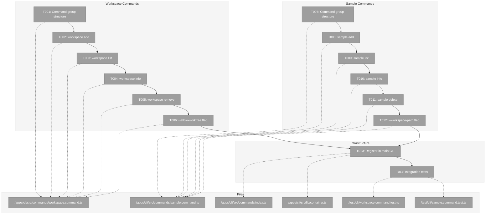
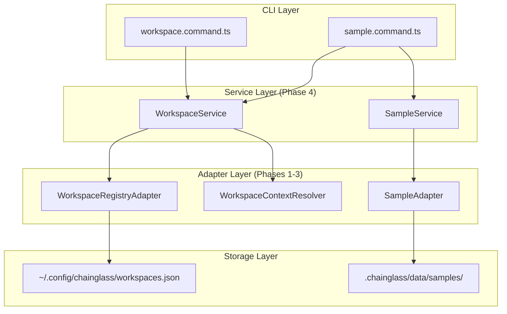
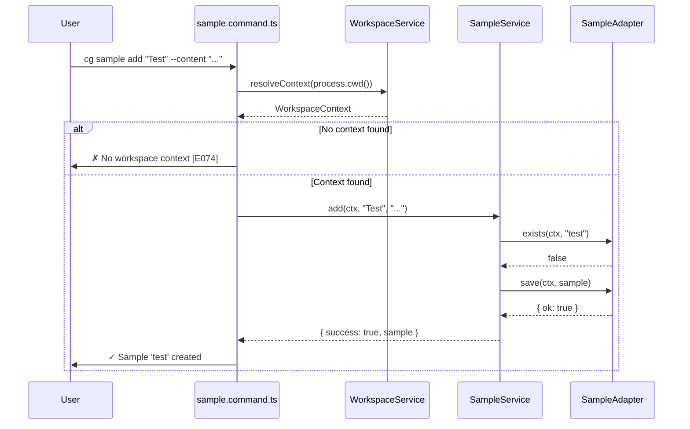

# Phase 5: CLI Commands – Tasks & Alignment Brief

**Spec**: [../workspaces-spec.md](../workspaces-spec.md)
**Plan**: [../workspaces-plan.md](../workspaces-plan.md)
**Date**: 2026-01-27

---

## Executive Briefing

### Purpose

This phase implements the command-line interface for workspace and sample management. It provides users with direct terminal access to all workspace functionality, enabling scriptable workflows and integration with shell pipelines. The CLI is the primary interface for power users and CI/CD automation.

### What We're Building

Eight CLI commands organized into two command groups:
- **`cg workspace`**: Register, list, inspect, and remove workspaces from the global registry
- **`cg sample`**: Create, list, inspect, and delete samples within workspace contexts

Key features:
- `--json` flag for machine-readable output on all commands
- `--workspace-path` flag for context override on sample commands
- `--allow-worktree` flag for explicit worktree registration
- `--force` flag to skip confirmation prompts on destructive operations
- Contextual error messages with error codes (E074-E089) and remediation guidance

### User Value

Users can manage workspaces and samples entirely from the terminal:
- Register existing projects as workspaces in seconds
- Navigate workspace structures across multiple git worktrees
- Create and manage samples for testing domain patterns
- Script workspace operations for automation and CI/CD

### Example

**Register a workspace:**
```bash
$ cg workspace add "Chainglass" /home/jak/substrate/chainglass

✓ Workspace 'chainglass' added
  Name: Chainglass
  Path: /home/jak/substrate/chainglass
```

**Create a sample in current worktree:**
```bash
$ cd /home/jak/substrate/014-workspaces
$ cg sample add "Test Sample" --content "Hello, world!"

✓ Sample 'test-sample' created
  File: .chainglass/data/samples/test-sample.json
  Workspace: chainglass (014-workspaces)
```

---

## Objectives & Scope

### Objective

Implement CLI commands for workspace and sample management as specified in the plan, integrating with Phase 4 services via DI container.

**Acceptance Criteria from Spec:**
- [ ] AC-01: `cg workspace add` registers folder as workspace
- [ ] AC-02: `cg workspace list` displays all registered workspaces
- [ ] AC-03: `cg workspace info` shows workspace details + worktrees
- [ ] AC-04: `cg workspace remove` unregisters workspace
- [ ] AC-05: `--allow-worktree` flag overrides worktree warning
- [ ] AC-06: Error messages include E074-E081 codes
- [ ] AC-10: `cg sample add` creates sample in worktree
- [ ] AC-11: `cg sample list` displays samples in current worktree
- [ ] AC-12: `cg sample info` shows sample details
- [ ] AC-13: `cg sample delete` removes sample file
- [ ] AC-22: CLI respects `--json` flag
- [ ] AC-23: CLI respects `--workspace-path` context override

### Goals

- ✅ Create workspace command group structure (`cg workspace`)
- ✅ Implement `cg workspace add <name> <path>` with path validation
- ✅ Implement `cg workspace list [--json]` with console/JSON formatting
- ✅ Implement `cg workspace info <slug>` with worktree display
- ✅ Implement `cg workspace remove <slug>` with confirmation prompt
- ✅ Add `--allow-worktree` flag per AC-05
- ✅ Create sample command group structure (`cg sample`)
- ✅ Implement `cg sample add <name>` with context resolution
- ✅ Implement `cg sample list [--json]`
- ✅ Implement `cg sample info <slug>`
- ✅ Implement `cg sample delete <slug>` with confirmation
- ✅ Add `--workspace-path` flag for context override
- ✅ Register commands in main CLI entry point
- ✅ Write CLI integration tests for key flows

### Non-Goals

- ❌ Web UI implementation (Phase 6)
- ❌ Batch workspace operations (single-item CRUD only)
- ❌ Workspace import/export features
- ❌ Sample content editing in-place (create new, delete old)
- ❌ Interactive prompts for name/path (arguments required)
- ❌ Shell completions (future enhancement)
- ❌ Output colorization customization (use defaults)
- ❌ Configuration file for CLI defaults (use explicit flags)

---

## Architecture Map

### Component Diagram

<!-- Status: grey=pending, orange=in-progress, green=completed, red=blocked -->
<!-- Updated by plan-6 during implementation -->



### Task-to-Component Mapping

<!-- Status: ⬜ Pending | 🟧 In Progress | ✅ Complete | 🔴 Blocked -->

| Task | Component(s) | Files | Status | Comment |
|------|-------------|-------|--------|---------|
| T001 | Workspace CLI Group | /apps/cli/src/commands/workspace.command.ts | ⬜ Pending | Commander.js structure, DI helpers |
| T002 | workspace add | /apps/cli/src/commands/workspace.command.ts | ⬜ Pending | IWorkspaceService.add() integration |
| T003 | workspace list | /apps/cli/src/commands/workspace.command.ts | ⬜ Pending | Console table + JSON output |
| T004 | workspace info | /apps/cli/src/commands/workspace.command.ts | ⬜ Pending | Worktree display formatting |
| T005 | workspace remove | /apps/cli/src/commands/workspace.command.ts | ⬜ Pending | Confirmation prompt |
| T006 | --allow-worktree | /apps/cli/src/commands/workspace.command.ts | ⬜ Pending | Flag plumbing to service |
| T007 | Sample CLI Group | /apps/cli/src/commands/sample.command.ts | ⬜ Pending | Commander.js structure, context resolution |
| T008 | sample add | /apps/cli/src/commands/sample.command.ts | ⬜ Pending | ISampleService.add() integration |
| T009 | sample list | /apps/cli/src/commands/sample.command.ts | ⬜ Pending | Console table + JSON output |
| T010 | sample info | /apps/cli/src/commands/sample.command.ts | ⬜ Pending | Content display with truncation |
| T011 | sample delete | /apps/cli/src/commands/sample.command.ts | ⬜ Pending | Confirmation prompt |
| T012 | --workspace-path | /apps/cli/src/commands/sample.command.ts | ⬜ Pending | Context override logic |
| T013 | Main CLI Registration | /apps/cli/src/commands/index.ts, /apps/cli/src/lib/container.ts | ⬜ Pending | Export + DI wiring |
| T014 | Integration Tests | /test/cli/workspace.command.test.ts, /test/cli/sample.command.test.ts | ⬜ Pending | E2E command tests |

---

## Tasks

| Status | ID | Task | CS | Type | Dependencies | Absolute Path(s) | Validation | Subtasks | Notes |
|--------|------|------|----|----|--------------|------------------|------------|----------|-------|
| [x] | T000 | Add workspace.* and sample.* format templates to output adapters | 3 | Prereq | – | /home/jak/substrate/014-workspaces/packages/shared/src/adapters/console-output.adapter.ts, /home/jak/substrate/014-workspaces/packages/shared/src/adapters/json-output.adapter.ts | Output adapters format workspace/sample results correctly | – | Per DYK-P5-01: Consistency with workflow pattern |
| [x] | T001 | Create workspace command group structure with DI helpers | 2 | Setup | T000 | /home/jak/substrate/014-workspaces/apps/cli/src/commands/workspace.command.ts | `cg workspace` shows subcommand help | – | Follow workflow.command.ts pattern |
| [x] | T002 | Implement `cg workspace add <name> <path>` command | 3 | Core | T001 | /home/jak/substrate/014-workspaces/apps/cli/src/commands/workspace.command.ts | Adds workspace, console + JSON output | – | Calls IWorkspaceService.add() |
| [x] | T003 | Implement `cg workspace list [--json]` command | 2 | Core | T001 | /home/jak/substrate/014-workspaces/apps/cli/src/commands/workspace.command.ts | Lists all workspaces, empty state message | – | |
| [x] | T004 | Implement `cg workspace info <slug>` command | 2 | Core | T001 | /home/jak/substrate/014-workspaces/apps/cli/src/commands/workspace.command.ts | Shows workspace details + worktrees list | – | Uses getInfo() |
| [x] | T005 | Implement `cg workspace remove <slug> --force` command | 2 | Core | T001 | /home/jak/substrate/014-workspaces/apps/cli/src/commands/workspace.command.ts | Removes workspace, requires --force (no prompt) | – | Per DYK-P5-02: No prompts, --force required |
| [x] | T006 | Add `--allow-worktree` flag to workspace add | 1 | Core | T002 | /home/jak/substrate/014-workspaces/apps/cli/src/commands/workspace.command.ts | Flag passed to service options | – | AC-05 |
| [x] | T007 | Create sample command group structure with context helpers | 2 | Setup | T001 | /home/jak/substrate/014-workspaces/apps/cli/src/commands/sample.command.ts | `cg sample` shows subcommand help | – | Context resolution from CWD |
| [x] | T008 | Implement `cg sample add <name> [--content]` command | 3 | Core | T007 | /home/jak/substrate/014-workspaces/apps/cli/src/commands/sample.command.ts | Creates sample, shows path + workspace info | – | Calls ISampleService.add() |
| [x] | T009 | Implement `cg sample list [--json]` command | 2 | Core | T007 | /home/jak/substrate/014-workspaces/apps/cli/src/commands/sample.command.ts | Lists samples in context, empty state message | – | |
| [x] | T010 | Implement `cg sample info <slug>` command | 2 | Core | T007 | /home/jak/substrate/014-workspaces/apps/cli/src/commands/sample.command.ts | Shows sample details, truncates long content | – | |
| [x] | T011 | Implement `cg sample delete <slug> --force` command | 2 | Core | T007 | /home/jak/substrate/014-workspaces/apps/cli/src/commands/sample.command.ts | Deletes sample, requires --force (no prompt) | – | Per DYK-P5-02: No prompts, --force required |
| [x] | T012 | Add `--workspace-path <path>` flag to all sample commands | 2 | Core | T008, T009, T010, T011 | /home/jak/substrate/014-workspaces/apps/cli/src/commands/sample.command.ts | Override CWD-based context | – | AC-23 |
| [x] | T013 | Register workspace and sample commands in main CLI + wire DI | 2 | Integration | T006, T012 | /home/jak/substrate/014-workspaces/apps/cli/src/commands/index.ts, /home/jak/substrate/014-workspaces/apps/cli/src/lib/container.ts | Commands accessible via `cg workspace`, `cg sample` | – | Add exports, DI registrations |
| [ ] | T014 | Write CLI integration tests for key flows | 3 | Test | T013 | /home/jak/substrate/014-workspaces/test/cli/workspace.command.test.ts, /home/jak/substrate/014-workspaces/test/cli/sample.command.test.ts | E2E tests pass: add, list, info, remove, delete | – | Per DYK-P5-03: Use real services with fake adapters (no service-level fakes) |

---

## Alignment Brief

### Prior Phases Review

#### Phase-by-Phase Summary

**Phase 1 (Workspace Entity + Registry Adapter)** established the foundational data layer:
- `Workspace` entity with private constructor + `create()` factory + `toJSON()` serialization
- `IWorkspaceRegistryAdapter` interface with 5-method contract (load, save, list, remove, exists)
- `FakeWorkspaceRegistryAdapter` and `WorkspaceRegistryAdapter` implementations
- Error codes E074-E081 with factory functions (`WorkspaceErrors`)
- Contract tests ensuring fake-real parity (24 tests)
- Security: URL-encoded traversal protection, path validation on load()

**Phase 2 (WorkspaceContext Resolution)** added workspace resolution:
- `WorkspaceContext` and `Worktree` interfaces for context resolution
- `IWorkspaceContextResolver` interface for DI
- `GitWorktreeResolver` with version checking (≥2.13) and graceful fallback
- Longest-prefix matching for overlapping workspace paths
- 37 tests for resolution and git operations

**Phase 3 (Sample Domain Exemplar)** implemented the sample domain:
- `Sample` entity following Phase 1 patterns
- `WorkspaceDataAdapterBase` abstract class for per-worktree storage
- `ISampleAdapter` interface with 5-method contract
- `FakeSampleAdapter` and `SampleAdapter` implementations
- Error codes E082-E089 with factory functions (`SampleErrors`)
- 48 tests including contract tests for both adapters

**Phase 4 (Service Layer + DI Integration)** created the service orchestration layer:
- `IWorkspaceService` with add/list/remove/getInfo/resolveContext methods
- `ISampleService` with add/list/get/delete methods
- `WORKSPACE_DI_TOKENS` constant (separate from workflow tokens per DYK-P4-02)
- Container registrations for production and test
- Result type pattern with `success` and `errors[]` fields
- 35 tests for service operations

#### Cumulative Deliverables Available to Phase 5

**From packages/workflow/src/:**

| Component | Path | Phase |
|-----------|------|-------|
| Workspace entity | entities/workspace.ts | 1 |
| Sample entity | entities/sample.ts | 3 |
| IWorkspaceRegistryAdapter | interfaces/workspace-registry-adapter.interface.ts | 1 |
| IWorkspaceContextResolver | interfaces/workspace-context.interface.ts | 2 |
| ISampleAdapter | interfaces/sample-adapter.interface.ts | 3 |
| IWorkspaceService | interfaces/workspace-service.interface.ts | 4 |
| ISampleService | interfaces/sample-service.interface.ts | 4 |
| WorkspaceService | services/workspace.service.ts | 4 |
| SampleService | services/sample.service.ts | 4 |
| WorkspaceErrors (E074-E081) | errors/workspace-errors.ts | 1 |
| SampleErrors (E082-E089) | errors/sample-errors.ts | 3 |
| FakeWorkspaceRegistryAdapter | fakes/fake-workspace-registry-adapter.ts | 1 |
| FakeWorkspaceContextResolver | fakes/fake-workspace-context-resolver.ts | 2 |
| FakeSampleAdapter | fakes/fake-sample-adapter.ts | 3 |

**From packages/shared/src/:**

| Component | Path | Phase |
|-----------|------|-------|
| WORKSPACE_DI_TOKENS | di-tokens.ts | 4 |

**Service Method Signatures:**

```typescript
// IWorkspaceService
add(name: string, path: string, options?: AddWorkspaceOptions): Promise<AddWorkspaceResult>
list(): Promise<Workspace[]>
remove(slug: string): Promise<RemoveWorkspaceResult>
getInfo(slug: string): Promise<WorkspaceInfo | null>
resolveContext(path: string): Promise<WorkspaceContext | null>

// ISampleService
add(ctx: WorkspaceContext, name: string, description: string): Promise<AddSampleResult>
list(ctx: WorkspaceContext): Promise<Sample[]>
get(ctx: WorkspaceContext, slug: string): Promise<Sample | null>
delete(ctx: WorkspaceContext, slug: string): Promise<DeleteSampleResult>
```

**Result Type Pattern:**

```typescript
interface AddWorkspaceResult {
  success: boolean;
  errors: WorkspaceError[];
  workspace?: Workspace;
}

interface AddSampleResult {
  success: boolean;
  errors: SampleError[];
  sample?: Sample;
}
```

#### Pattern Evolution

1. **Entity Factory** → **Service Orchestration** → **CLI Integration**
   - Phase 1 established entity patterns
   - Phase 4 wrapped in services with validation
   - Phase 5 exposes services through CLI

2. **Error Handling**
   - Phase 1: Error codes with factory functions
   - Phase 4: Result types with `errors[]` arrays
   - Phase 5: Format errors for console with codes + remediation

3. **DI Pattern**
   - Phase 4: Created WORKSPACE_DI_TOKENS
   - Phase 5: Wire into CLI container, resolve services in handlers

#### Reusable Infrastructure

- **Confirmation prompt**: Copy from workflow.command.ts `promptConfirmation()` function
- **Output adapter**: Use `ConsoleOutputAdapter` and `JsonOutputAdapter` from @chainglass/shared
- **Container pattern**: Use `createCliProductionContainer()` pattern
- **Test pattern**: Use child containers with fakes per test

### Critical Findings Affecting This Phase

| Finding | What It Constrains | Addressed By |
|---------|-------------------|--------------|
| **CD-01: Split Storage** | CLI must not directly manipulate JSON files – use services | T002, T008 call services |
| **HD-06: Error Standardization** | All error output must include E0XX codes and actionable remediation | T002-T005, T008-T011 format errors |
| **HD-08: DI Container Pattern** | Commands must resolve services from container, not instantiate | T001, T007 use `getWorkspaceService()`, `getSampleService()` |
| **DYK-P4-02: Separate Tokens** | Use WORKSPACE_DI_TOKENS, not WORKFLOW_DI_TOKENS | T013 DI wiring |
| **DYK-P4-04: Defense-in-Depth** | Service validates paths; CLI shouldn't duplicate validation | T002 trusts service validation |

### Invariants & Guardrails

- **No direct JSON manipulation**: All data access through services
- **Always resolve fresh**: No caching (per spec Q5)
- **Context required for samples**: Sample commands must resolve or receive WorkspaceContext
- **Error codes visible**: All errors display E0XX code to user
- **Exit codes**: `process.exit(1)` on error, `0` on success
- **JSON output clean**: No console logging in JSON mode (pure JSON to stdout)

### Inputs to Read

| File | Purpose |
|------|---------|
| /home/jak/substrate/014-workspaces/apps/cli/src/commands/workflow.command.ts | Command group pattern, DI helper pattern |
| /home/jak/substrate/014-workspaces/apps/cli/src/lib/container.ts | Container creation pattern |
| /home/jak/substrate/014-workspaces/docs/plans/014-workspaces/workshops/cli-command-flows.md | Command specifications, output formats |
| /home/jak/substrate/014-workspaces/docs/plans/014-workspaces/workshops/data-files-storage-structure.md | Data structures reference |

### Visual Alignment: Flow Diagram



### Visual Alignment: Sequence Diagram - `cg sample add`



### Test Plan (Full TDD)

Per spec: Full TDD with fakes. Per R-TEST-007: No vi.mock/vi.fn.

| Test | Type | Fixtures | Expected Output |
|------|------|----------|-----------------|
| workspace add creates workspace | Integration | FakeWorkspaceService | success: true, workspace returned |
| workspace add duplicate returns E075 | Integration | FakeWorkspaceService with existing | success: false, E075 error |
| workspace add invalid path returns E076 | Integration | FakeWorkspaceService | success: false, E076 error |
| workspace list empty shows message | Integration | FakeWorkspaceService (empty) | "No workspaces registered" |
| workspace list shows table | Integration | FakeWorkspaceService with data | Table with slugs, names, paths |
| workspace info shows worktrees | Integration | FakeWorkspaceService with worktrees | Worktree list formatted |
| workspace remove prompts confirmation | Integration | FakeWorkspaceService | Prompt shown, cancelled on "n" |
| workspace remove --force skips prompt | Integration | FakeWorkspaceService | No prompt, success message |
| sample add creates sample | Integration | FakeWorkspaceService, FakeSampleService | success: true, sample returned |
| sample add no context returns E074 | Integration | FakeWorkspaceService (no match) | E074 error with guidance |
| sample list shows samples | Integration | FakeSampleService with data | Table with slugs, names |
| sample info shows content | Integration | FakeSampleService | Content displayed |
| sample delete prompts | Integration | FakeSampleService | Prompt shown |
| --workspace-path overrides context | Integration | FakeSampleService | Uses override path |
| --json outputs JSON | Integration | All | Valid JSON to stdout |

### Implementation Outline

1. **T001**: Create workspace.command.ts
   - Import Commander, WORKSPACE_DI_TOKENS, services
   - Add `getWorkspaceService()` helper using DI
   - Add `createOutputAdapter()` helper
   - Register `workspace` command group
   - Export `registerWorkspaceCommands(program)`

2. **T002**: Implement `workspace add`
   - Parse `<name>` and `<path>` arguments
   - Call `workspaceService.add(name, path, { allowWorktree })`
   - Format success/error output
   - Exit 1 on error

3. **T003**: Implement `workspace list`
   - Call `workspaceService.list()`
   - Format table or "No workspaces" message
   - Support `--json` flag

4. **T004**: Implement `workspace info`
   - Parse `<slug>` argument
   - Call `workspaceService.getInfo(slug)`
   - Display workspace + worktrees or "not found"

5. **T005**: Implement `workspace remove`
   - Parse `<slug>` argument
   - Prompt unless `--force`
   - Call `workspaceService.remove(slug)`

6. **T006**: Add `--allow-worktree` flag
   - Add option to `workspace add` command
   - Pass to service options

7. **T007**: Create sample.command.ts
   - Add `resolveOrOverrideContext()` helper
   - Register `sample` command group

8. **T008-T011**: Implement sample commands
   - Each calls corresponding ISampleService method
   - Resolve context first, error if not found

9. **T012**: Add `--workspace-path` flag
   - Add to all sample commands
   - Override context resolution

10. **T013**: Register in main CLI
    - Add exports to index.ts
    - Add WORKSPACE_DI_TOKENS registrations to container.ts

11. **T014**: Integration tests
    - Create test files with FakeWorkspaceService, FakeSampleService
    - Test each command with success and error cases

### Commands to Run

```bash
# Development
pnpm dev                    # Start dev server (verify builds)

# Quality Checks
just fft                    # Fix, Format, Test (before each commit)
just check                  # Full quality suite (lint, typecheck, test)

# Package-specific tests
pnpm test --filter @chainglass/cli    # CLI package only
pnpm test -- test/cli/                # CLI tests only

# Build verification
pnpm build --filter @chainglass/cli   # Build CLI package
cg workspace --help                   # Verify command registration
cg sample --help                      # Verify command registration

# TypeScript check
pnpm exec tsc --project apps/cli/tsconfig.json --noEmit
```

### Risks / Unknowns

| Risk | Severity | Mitigation |
|------|----------|------------|
| DI container wiring breaks existing commands | Medium | Test all existing commands after T013 |
| Context resolution edge cases | Low | Services handle; CLI trusts service |
| Confirmation prompt behavior in CI/non-TTY | Low | Provide `--force` flag; detect TTY |
| Output formatting inconsistencies | Low | Follow workshop specs exactly |

### Ready Check

- [ ] Phase 4 services fully tested and working
- [ ] WORKSPACE_DI_TOKENS exported and documented
- [ ] CLI container pattern understood (workflow.command.ts reviewed)
- [ ] Workshop CLI command flows document available
- [ ] Error codes E074-E089 implemented with factory functions
- [ ] N/A: No ADRs specifically constrain Phase 5 beyond ADR-0004 (DI)

---

## Phase Footnote Stubs

**NOTE**: This section will be populated during implementation by plan-6.

| Footnote | Description | Reference |
|----------|-------------|-----------|
| | | |

---

## Evidence Artifacts

Implementation will generate:
- **Execution log**: `/home/jak/substrate/014-workspaces/docs/plans/014-workspaces/tasks/phase-5-cli-commands/execution.log.md`
- **Test results**: Output from `just check`
- **Coverage**: Integration test coverage for CLI commands

---

## Discoveries & Learnings

_Populated during implementation by plan-6. Log anything of interest to your future self._

| Date | Task | Type | Discovery | Resolution | References |
|------|------|------|-----------|------------|------------|
| | | | | | |

**Types**: `gotcha` | `research-needed` | `unexpected-behavior` | `workaround` | `decision` | `debt` | `insight`

**What to log**:
- Things that didn't work as expected
- External research that was required
- Implementation troubles and how they were resolved
- Gotchas and edge cases discovered
- Decisions made during implementation
- Technical debt introduced (and why)
- Insights that future phases should know about

_See also: `execution.log.md` for detailed narrative._

---

## Directory Layout

```
docs/plans/014-workspaces/
├── workspaces-spec.md
├── workspaces-plan.md
├── workshops/
│   ├── cli-command-flows.md        # ◀ Command specifications
│   └── data-files-storage-structure.md
└── tasks/
    ├── phase-1-workspace-entity-registry-adapter-contract-tests/
    │   ├── tasks.md
    │   └── execution.log.md
    ├── phase-2-workspacecontext-resolution/
    │   ├── tasks.md
    │   └── execution.log.md
    ├── phase-3-sample-domain-exemplar/
    │   ├── tasks.md
    │   └── execution.log.md
    ├── phase-4-service-layer-di-integration/
    │   ├── tasks.md
    │   └── execution.log.md
    └── phase-5-cli-commands/
        ├── tasks.md                # ◀ THIS FILE
        └── execution.log.md        # ◀ Created by plan-6
```

---

## Critical Insights Discussion (DYK Session)

**Session**: 2026-01-27 07:44 UTC
**Context**: Phase 5 CLI Commands Tasks Dossier - Pre-implementation Review
**Analyst**: AI Clarity Agent
**Reviewer**: Development Team
**Format**: Water Cooler Conversation (5 Critical Insights)

### DYK-P5-01: Output Adapter Template Gap

**Did you know**: ConsoleOutputAdapter and JsonOutputAdapter have no format templates for workspace.* or sample.* operations - all output would fall through to generic "Operation completed successfully".

**Implications**:
- Designed output formats from cli-command-flows.md wouldn't render
- JSON envelope pattern wouldn't be followed
- UX would be broken despite tests passing

**Options Considered**:
- Option A: Add format templates to existing output adapters - Consistency with workflow pattern
- Option B: Format inline in command handlers - Faster but inconsistent
- Option C: Create workspace-specific adapters - More to maintain

**AI Recommendation**: Option A - Add format templates to existing adapters
- Reasoning: Maintains consistency with workflow commands, leverages existing infrastructure

**Decision**: Option A - Add workspace.* and sample.* format templates to output adapters

**Action Items**:
- [x] Added T000 as prerequisite task for output adapter templates
- [x] Updated T001 to depend on T000

**Affects**: T000 (new), T001, T007, packages/shared

---

### DYK-P5-02: No Confirmation Prompts for Programmatic Access

**Did you know**: Original design had interactive confirmation prompts, but primary usage is web-based agents and programmatic access where prompts cause hangs.

**Implications**:
- CI/CD and scripts would hang waiting for input that never comes
- Web-based agent mode can't handle interactive prompts
- TTY detection adds unnecessary complexity

**Options Considered**:
- Option A: Auto-force when not TTY - Scripts "just work"
- Option B: Fail when prompt needed but no TTY - Safe, explicit
- Option C: Remove prompts, require --force - Simplest

**AI Recommendation**: Option B - Fail explicitly
- Reasoning: Safety first for destructive operations

**Decision**: Require --force for destructive operations, no prompts at all

**Action Items**:
- [x] Updated T005 to require --force (no prompt)
- [x] Updated T011 to require --force (no prompt)

**Affects**: T005, T011

---

### DYK-P5-03: CLI Test Strategy - Real Services with Fake Adapters

**Did you know**: T014 referenced FakeWorkspaceService/FakeSampleService which don't exist - Phase 4 created real services and adapter fakes but no service-level fakes.

**Implications**:
- Could create service fakes (more maintenance)
- Could use real services with fake adapters (full stack test)

**Options Considered**:
- Option A: Create FakeWorkspaceService/FakeSampleService - Clean isolation
- Option B: Use real services with fake adapters - More realistic tests

**AI Recommendation**: Option B - Real services with fake adapters
- Reasoning: Tests full stack, fake adapters already exist, no new fakes to maintain

**Decision**: Option B - Use real services with fake adapters in test container

**Action Items**:
- [x] Updated T014 notes to clarify testing approach

**Affects**: T014

---

### DYK-P5-04: --workspace-path Requires Context Building (Informational)

**Did you know**: --workspace-path feeds into WorkspaceService.resolveContext(), not used as a raw path. CLI needs resolveOrOverrideContext() helper.

**Implications**: Already covered by T007 "Context resolution from CWD" - just confirming approach

**Decision**: Acknowledged - T007 already covers this correctly

---

### DYK-P5-05: DI Container Wiring Required (Informational)

**Did you know**: CLI container has no WORKSPACE_DI_TOKENS registrations - must be added as part of T013.

**Implications**: Already covered by T013 "wire DI" - just confirming scope

**Decision**: Acknowledged - T013 already covers this correctly

---

## Session Summary

**Insights Surfaced**: 5 critical insights identified and discussed
**Decisions Made**: 3 decisions reached (2 were confirmations of existing task scope)
**Action Items Created**: 4 task updates applied
**Areas Updated**:
- T000 added (output adapter templates)
- T001 updated (depends on T000)
- T005 updated (--force required, no prompt)
- T011 updated (--force required, no prompt)
- T014 updated (testing approach clarified)

**Shared Understanding Achieved**: ✓

**Confidence Level**: High
We have high confidence in proceeding. Key patterns clarified, edge cases addressed.

**Next Steps**:
Proceed with `/plan-6-implement-phase --phase "Phase 5: CLI Commands"` using this updated dossier.
