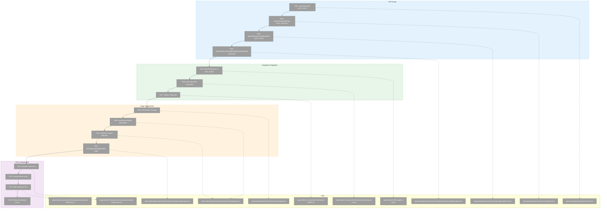
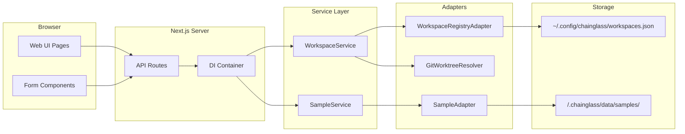
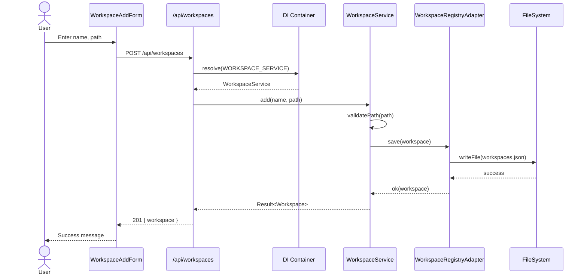
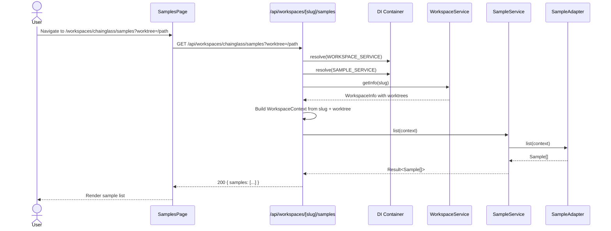

# Phase 6: Web UI – Tasks & Alignment Brief

**Spec**: [../../workspaces-spec.md](../../workspaces-spec.md)
**Plan**: [../../workspaces-plan.md](../../workspaces-plan.md)
**Date**: 2026-01-27

---

## Executive Briefing

### Purpose

This phase implements the web interface for workspace and sample management. It integrates workspace navigation into the left sidebar, provides workspace list and detail pages, and enables sample CRUD operations through a visual interface. This completes the user-facing experience by complementing the CLI commands from Phase 5 with a full web UI.

### What We're Building

A complete web interface for workspace management:

1. **API Routes** (Next.js Route Handlers)
   - `GET/POST /api/workspaces` - List and create workspaces
   - `GET/DELETE /api/workspaces/[slug]` - Get info and remove workspace
   - `GET/POST /api/workspaces/[slug]/samples` - List and create samples for worktree
   - `DELETE /api/workspaces/[slug]/samples/[sampleSlug]` - Delete sample

2. **Navigation Integration**
   - "Workspaces" section in left sidebar with expandable workspace list
   - Worktree expansion showing branches/worktrees per workspace
   - Context selection persisted in URL query parameter

3. **Pages**
   - `/workspaces` - List view with add workspace form
   - `/workspaces/[slug]` - Workspace detail with worktree list
   - `/workspaces/[slug]/samples` - Sample list for selected worktree with create/delete

### User Value

Users get a visual interface to:
- See all registered workspaces at a glance in the sidebar
- Navigate between workspaces and their git worktrees
- Create and manage samples without touching the CLI
- Switch worktree context to view different branches' data
- Benefit from server-side data (browser refresh maintains state)

### Example

**Sidebar Navigation:**
```
├── Home
├── Workflows
├── Workspaces ▼
│   ├── chainglass ▼
│   │   ├── main
│   │   ├── 014-workspaces ✓ (selected)
│   │   └── feature/new-ui
│   └── other-project
├── Agents
└── ...
```

**Add Workspace Form:**
```
┌────────────────────────────────────────┐
│ Add Workspace                          │
├────────────────────────────────────────┤
│ Name:  [My Project              ]      │
│ Path:  [/home/user/my-project   ]      │
│                        [Add Workspace] │
└────────────────────────────────────────┘
```

---

## Objectives & Scope

### Objective

Implement web UI for workspace and sample management as specified in the plan, integrating with Phase 4 services via DI container.

**Acceptance Criteria from Spec:**
- [ ] AC-14: Workspaces appear in left menu
- [ ] AC-15: Worktrees expandable under each workspace
- [ ] AC-16: Context selection works (worktree picker persists in URL)
- [ ] AC-17: Add workspace from web UI
- [ ] AC-18: Remove workspace from web UI
- [ ] AC-19: Sample list page shows samples for selected worktree
- [ ] AC-20: Sample create form works
- [ ] AC-21: Sample delete action works
- [ ] AC-24: Server-side data (browser refresh works)

### Goals

- ✅ Create `/api/workspaces` route (GET, POST) with Zod validation
- ✅ Create `/api/workspaces/[slug]` route (GET, DELETE)
- ✅ Create `/api/workspaces/[slug]/samples` route (GET, POST) with worktree context
- ✅ Create `/api/workspaces/[slug]/samples/[sampleSlug]` route (DELETE)
- ✅ Add "Workspaces" to NAV_ITEMS in navigation-utils.ts
- ✅ Create WorkspaceNav component with workspace list and worktree expansion
- ✅ Integrate WorkspaceNav in dashboard sidebar
- ✅ Create /workspaces page with list view and add form
- ✅ Create /workspaces/[slug] page with detail view and worktree list
- ✅ Implement worktree context selection (URL query parameter)
- ✅ Create /workspaces/[slug]/samples page with sample list
- ✅ Add sample create form component
- ✅ Add sample delete action with confirmation
- ✅ Implement add workspace form
- ✅ Implement remove workspace action with confirmation

### Non-Goals (Scope Boundaries)

- ❌ CLI command modifications (Phase 5 complete)
- ❌ Workspace data editing (create and delete only for MVP)
- ❌ Real-time updates via WebSocket/SSE (polling or refresh sufficient)
- ❌ Drag-and-drop workspace reordering
- ❌ Batch operations (single-item CRUD only)
- ❌ Client-side state management (server-side per spec)
- ❌ Mobile-specific layouts (desktop-first, responsive follows existing patterns)
- ❌ Sample content preview (just metadata display)
- ❌ Authentication/authorization (not in scope per spec)

---

## Architecture Map

### Component Diagram

<!-- Status: grey=pending, orange=in-progress, green=completed, red=blocked -->
<!-- Updated by plan-6 during implementation -->



### Task-to-Component Mapping

<!-- Status: ⬜ Pending | 🟧 In Progress | ✅ Complete | 🔴 Blocked -->

| Task | Component(s) | Files | Status | Comment |
|------|-------------|-------|--------|---------|
| T001 | Workspaces API | /apps/web/app/api/workspaces/route.ts | ⬜ Pending | GET list, POST add with Zod validation |
| T002 | Workspace Detail API | /apps/web/app/api/workspaces/[slug]/route.ts | ⬜ Pending | GET info with worktrees, DELETE remove |
| T003 | Samples API | /apps/web/app/api/workspaces/[slug]/samples/route.ts | ⬜ Pending | GET/POST with worktree context from query |
| T004 | Sample Delete API | /apps/web/app/api/workspaces/[slug]/samples/[sampleSlug]/route.ts | ⬜ Pending | DELETE single sample |
| T005 | Navigation Utils | /apps/web/src/lib/navigation-utils.ts | ⬜ Pending | Add "Workspaces" NavItem |
| T006 | WorkspaceNav | /apps/web/src/components/workspaces/workspace-nav.tsx | ⬜ Pending | Collapsible workspace + worktree list |
| T007 | Sidebar Integration | /apps/web/src/components/dashboard-sidebar.tsx | ⬜ Pending | Mount WorkspaceNav in sidebar |
| T008 | Workspaces List Page | /apps/web/app/(dashboard)/workspaces/page.tsx | ⬜ Pending | Server component with list + form |
| T009 | Workspace Detail Page | /apps/web/app/(dashboard)/workspaces/[slug]/page.tsx | ⬜ Pending | Workspace info + worktree picker |
| T010 | Worktree Context | Multiple | ⬜ Pending | URL ?worktree= param, shared state |
| T011 | Samples Page | /apps/web/app/(dashboard)/workspaces/[slug]/samples/page.tsx | ⬜ Pending | Sample list + create form |
| T012 | Sample Create Form | /apps/web/src/components/workspaces/sample-create-form.tsx | ⬜ Pending | Client component with form |
| T013 | Sample Delete | Multiple | ⬜ Pending | Delete button with confirmation |
| T014 | Workspace Add Form | /apps/web/src/components/workspaces/workspace-add-form.tsx | ⬜ Pending | Client component with form |
| T015 | Workspace Remove | Multiple | ⬜ Pending | Delete button with confirmation |

---

## Tasks

| Status | ID | Task | CS | Type | Dependencies | Absolute Path(s) | Validation | Subtasks | Notes |
|--------|------|------|-----|------|--------------|------------------|------------|----------|-------|
| [x] | T000 | Register workspace services in web DI container (WorkspaceRegistryAdapter, WorkspaceContextResolver, GitWorktreeResolver, SampleAdapter, WorkspaceService, SampleService). Also add `resolveContextFromParams(slug, worktreePath?)` helper method to WorkspaceService for web context construction. | 2 | Setup | – | /home/jak/substrate/014-workspaces/apps/web/src/lib/di-container.ts, /home/jak/substrate/014-workspaces/packages/workflow/src/services/workspace.service.ts | Container resolves WORKSPACE_DI_TOKENS without error; resolveContextFromParams returns valid context | – | DYK-P6-01: Web container missing workspace services; DYK-P6-02: Add helper for context construction |
| [x] | T001 | Create `/api/workspaces` route with GET only (list, supports `?include=worktrees` for enriched response); mutations via Server Actions | 2 | Core | T000 | /home/jak/substrate/014-workspaces/apps/web/app/api/workspaces/route.ts | GET returns workspace list; GET with ?include=worktrees returns list with worktrees populated | – | DYK-P6-04: Single enriched endpoint for sidebar; DYK-P6-05: Mutations moved to Server Actions |
| [x] | T002 | Create `/api/workspaces/[slug]` route with GET only (info + worktrees); DELETE via Server Action | 2 | Core | T001 | /home/jak/substrate/014-workspaces/apps/web/app/api/workspaces/[slug]/route.ts | GET returns workspace info with worktrees | – | DYK-P6-05: DELETE mutation moved to Server Action |
| [x] | T003 | Create `/api/workspaces/[slug]/samples` route with GET only (list), worktree from `?worktree=` query param; POST via Server Action | 2 | Core | T002 | /home/jak/substrate/014-workspaces/apps/web/app/api/workspaces/[slug]/samples/route.ts | GET returns samples for worktree | – | DYK-P6-02: Use WorkspaceService.resolveContextFromParams(); DYK-P6-05: POST moved to Server Action |
| [x] | T004 | Create workspace Server Actions: addWorkspace, removeWorkspace, addSample, deleteSample with revalidatePath integration | 2 | Core | T000 | /home/jak/substrate/014-workspaces/apps/web/app/actions/workspace-actions.ts | Server Actions work with useActionState; revalidatePath triggers on success | – | DYK-P6-05: Server Actions for all mutations; simpler than API routes |
| [x] | T005 | Add "Workspaces" NavItem to NAV_ITEMS in navigation-utils.ts | 1 | Setup | – | /home/jak/substrate/014-workspaces/apps/web/src/lib/navigation-utils.ts | Workspaces appears in sidebar nav | – | Use FolderOpen or similar icon from lucide-react |
| [x] | T006 | Create WorkspaceNav component with workspace list and worktree expansion | 2 | Core | T001 | /home/jak/substrate/014-workspaces/apps/web/src/components/workspaces/workspace-nav.tsx | Shows workspaces, expands to show worktrees, highlights selected | – | DYK-P6-04: Use ?include=worktrees for single fetch; server component; use Collapsible from shadcn |
| [x] | T007 | Integrate WorkspaceNav in dashboard-sidebar.tsx below main nav items | 2 | Integration | T006 | /home/jak/substrate/014-workspaces/apps/web/src/components/dashboard-sidebar.tsx | WorkspaceNav visible in sidebar on all dashboard pages | – | AC-14, AC-15 |
| [x] | T008 | Create /workspaces list page with workspace table and add form integration | 2 | Core | T001, T014 | /home/jak/substrate/014-workspaces/apps/web/app/(dashboard)/workspaces/page.tsx | Lists all workspaces; add form creates new workspace | – | Server component; revalidates on mutation |
| [x] | T009 | Create /workspaces/[slug] detail page with workspace info and worktree list | 2 | Core | T002 | /home/jak/substrate/014-workspaces/apps/web/app/(dashboard)/workspaces/[slug]/page.tsx | Shows workspace name, path, worktrees with branches | – | AC-15; links to /samples for each worktree |
| [x] | T010 | Implement worktree context selection via URL `?worktree=` query parameter | 2 | Core | T009 | /home/jak/substrate/014-workspaces/apps/web/app/(dashboard)/workspaces/[slug]/page.tsx, /home/jak/substrate/014-workspaces/apps/web/app/(dashboard)/workspaces/[slug]/samples/page.tsx | Selected worktree persists across navigation; default to main worktree | – | AC-16; use searchParams in server components |
| [x] | T011 | Create /workspaces/[slug]/samples page with sample list for selected worktree | 2 | Core | T003, T010 | /home/jak/substrate/014-workspaces/apps/web/app/(dashboard)/workspaces/[slug]/samples/page.tsx | Lists samples for worktree; shows empty state if none | – | AC-19; uses ?worktree= param |
| [x] | T012 | Create sample create form component using Server Action with useActionState | 2 | Core | T004 | /home/jak/substrate/014-workspaces/apps/web/src/components/workspaces/sample-create-form.tsx | Form uses addSample Server Action; shows success/error via useActionState | – | AC-20; DYK-P6-05: Server Action pattern with useFormStatus for pending state |
| [x] | T013 | Add sample delete action using Server Action with confirmation dialog | 1 | Core | T004 | /home/jak/substrate/014-workspaces/apps/web/src/components/workspaces/sample-delete-button.tsx | Delete button calls deleteSample Server Action; confirms before delete | – | AC-21; use AlertDialog from shadcn |
| [x] | T014 | Create workspace add form component using Server Action with useActionState | 2 | Core | T004 | /home/jak/substrate/014-workspaces/apps/web/src/components/workspaces/workspace-add-form.tsx | Form uses addWorkspace Server Action; shows success/error; clears on success | – | AC-17; DYK-P6-05: Server Action pattern |
| [x] | T015 | Add workspace remove action using Server Action with confirmation dialog | 1 | Core | T004 | /home/jak/substrate/014-workspaces/apps/web/src/components/workspaces/workspace-remove-button.tsx | Delete button calls removeWorkspace Server Action; confirms before delete; redirects to /workspaces | – | AC-18; use AlertDialog from shadcn |

---

## Alignment Brief

### Prior Phases Review

#### Phase 1: Workspace Entity + Registry Adapter + Contract Tests (COMPLETE)

**Deliverables Available to Phase 6:**
- `Workspace` entity at `/home/jak/substrate/014-workspaces/packages/workflow/src/entities/workspace.ts`
- `IWorkspaceRegistryAdapter` interface with `load`, `save`, `list`, `remove`, `exists` methods
- `WorkspaceRegistryAdapter` for real filesystem I/O to `~/.config/chainglass/workspaces.json`
- `FakeWorkspaceRegistryAdapter` for testing
- Error codes E074-E081 with factory functions

**Key Patterns Established:**
- Private constructor + static `create()` factory method
- `toJSON()` for serialization (no `fromJSON()` - adapter handles deserialization)
- Slug generation using `slugify` npm package

**Lessons Learned:**
- Path validation with absolute path requirement, no traversal, tilde expansion
- `expandTilde()` extracted to IPathResolver for reuse

---

#### Phase 2: WorkspaceContext Resolution + Worktree Discovery (COMPLETE)

**Deliverables Available to Phase 6:**
- `WorkspaceContext` interface with `workspaceSlug`, `workspacePath`, `worktreePath`, `worktreeBranch`, `isMainWorktree`
- `IWorkspaceContextResolver` interface with `resolveFromPath()` method
- `WorkspaceContextResolver` for real resolution from filesystem paths
- `GitWorktreeResolver` for `git worktree list --porcelain` parsing
- `Worktree` type with path, branch, isMain, isBare, isDetached

**Key Patterns Established:**
- Context resolution walks up directory tree to find registered workspace
- Sort workspaces by path length descending before matching (handles overlapping workspaces)
- Graceful degradation when git unavailable or version < 2.13

**Dependencies Exported:**
- `WorkspaceContext` is required parameter for all sample operations in Phase 6

---

#### Phase 3: Sample Domain (Exemplar) (COMPLETE)

**Deliverables Available to Phase 6:**
- `Sample` entity at `/home/jak/substrate/014-workspaces/packages/workflow/src/entities/sample.ts`
- `ISampleAdapter` interface with `load`, `save`, `list`, `remove`, `exists` methods
- `SampleAdapter` for real filesystem I/O to `<worktree>/.chainglass/data/samples/`
- `FakeSampleAdapter` for testing
- `WorkspaceDataAdapterBase` abstract class for domain adapters
- Error codes E082-E089 for sample errors

**Key Patterns Established:**
- Per-worktree data storage in `<worktree>/.chainglass/data/samples/<slug>.json`
- `ensureStructure()` creates directories on first write
- Composite key pattern in fake: `${worktreePath}|${slug}` for isolation

---

#### Phase 4: Service Layer + DI Integration (COMPLETE)

**Deliverables Available to Phase 6:**
- `IWorkspaceService` interface with `add`, `list`, `remove`, `getInfo`, `resolveContext` methods
- `WorkspaceService` implementation at `/home/jak/substrate/014-workspaces/packages/workflow/src/services/workspace.service.ts`
- `ISampleService` interface with `add`, `list`, `get`, `delete` methods
- `SampleService` implementation at `/home/jak/substrate/014-workspaces/packages/workflow/src/services/sample.service.ts`
- `WORKSPACE_DI_TOKENS` in `packages/shared/src/di-tokens.ts`
- Container registration in `packages/workflow/src/container.ts`

**Key Patterns Established:**
- Services return Result types (never throw)
- Defense in depth: service validates for UX, adapter validates as safety net
- `IGitWorktreeResolver` interface + `FakeGitWorktreeResolver` for proper DI

**Discoveries:**
- DYK-P4-01: Service result types should extend BaseResult with errors[] array
- DYK-P4-02: Create separate WORKSPACE_DI_TOKENS (not extend WORKFLOW_DI_TOKENS)
- DYK-P4-03: GitWorktreeResolver needs interface for DI
- DYK-P4-04: Defense in depth for path validation (both layers validate)
- DYK-P4-05: Extract createDefaultContext() to shared fixture

---

#### Phase 5: CLI Commands (COMPLETE)

**Deliverables Available to Phase 6:**
- `cg workspace add/list/remove/info` commands in `/home/jak/substrate/014-workspaces/apps/cli/src/commands/workspace.command.ts`
- `cg sample add/list/info/delete` commands in `/home/jak/substrate/014-workspaces/apps/cli/src/commands/sample.command.ts`
- `--workspace-path` flag for context override
- `--json` flag for machine-readable output
- `--allow-worktree` flag for explicit worktree registration

**Key Patterns Established:**
- Commander.js command group pattern with subcommands
- DI container resolution from CLI entry point
- Confirmation prompts for destructive operations (with `--force` skip)

---

### Critical Findings Affecting This Phase

**Critical Discovery 01: Split Storage Architecture**
- Global registry: `~/.config/chainglass/workspaces.json`
- Per-worktree data: `<worktree>/.chainglass/data/samples/`
- **Impact on Phase 6**: API routes must coordinate both - workspace registry for list/add/remove, worktree context for sample operations

**Critical Discovery 02: WorkspaceDataAdapterBase Pattern**
- Domain adapters require WorkspaceContext for all operations
- **Impact on Phase 6**: Sample API routes must construct WorkspaceContext from URL params (slug + worktree path)

**High Discovery 08: DI Container Registration Pattern**
- Use useFactory pattern; child containers for isolation
- **Impact on Phase 6**: Web container must register workspace/sample services (update `di-container.ts`)

**Medium Discovery 10: Web API Route Pattern**
- Use `dynamic = 'force-dynamic'` for all routes
- Zod validation for request bodies
- Lazy container resolution
- **Impact on Phase 6**: All API routes follow this pattern

---

### ADR Decision Constraints

**ADR-0004: Dependency Injection Container Architecture**
- Constrains: useFactory pattern, child container isolation
- Addressed by: T001-T004 (API routes resolve services via DI container)

---

### Invariants & Guardrails

- **Server-side data only**: No client-side state for workspace/sample data (AC-24)
- **Zod validation**: All API request bodies validated before processing
- **Error codes in responses**: Return structured errors with E074-E089 codes
- **Result types**: Services never throw; check `.success` before using data

---

### Inputs to Read

| File | Purpose |
|------|---------|
| /home/jak/substrate/014-workspaces/apps/web/src/lib/di-container.ts | DI container pattern for web app |
| /home/jak/substrate/014-workspaces/apps/web/src/lib/navigation-utils.ts | NAV_ITEMS pattern for sidebar |
| /home/jak/substrate/014-workspaces/apps/web/src/components/dashboard-sidebar.tsx | Sidebar structure |
| /home/jak/substrate/014-workspaces/apps/web/app/api/health/route.ts | API route pattern example |
| /home/jak/substrate/014-workspaces/packages/workflow/src/services/workspace.service.ts | WorkspaceService API |
| /home/jak/substrate/014-workspaces/packages/workflow/src/services/sample.service.ts | SampleService API |
| /home/jak/substrate/014-workspaces/packages/shared/src/di-tokens.ts | WORKSPACE_DI_TOKENS |

---

### Visual Alignment Aids

#### System Flow Diagram



#### Sequence Diagram: Add Workspace



#### Sequence Diagram: List Samples for Worktree



---

### Test Plan

**Approach**: Lightweight testing (integration tests only, no unit tests for thin API routes)

| Test | Type | Description | Fixtures |
|------|------|-------------|----------|
| Workspace API list | Integration | GET /api/workspaces returns list | FakeWorkspaceRegistryAdapter |
| Workspace API add | Integration | POST /api/workspaces creates workspace | Clean registry |
| Workspace API remove | Integration | DELETE /api/workspaces/[slug] removes | Pre-seeded workspace |
| Sample API list | Integration | GET returns samples for worktree | FakeSampleAdapter |
| Sample API create | Integration | POST creates sample | Clean worktree data |
| WorkspaceNav render | Component | Renders workspace list with worktrees | Mock fetch |
| Worktree context | E2E | URL param persists across navigation | Browser automation |

---

### Step-by-Step Implementation Outline

1. **T001**: Create `/api/workspaces/route.ts` with Zod schemas and DI resolution
2. **T002**: Create `/api/workspaces/[slug]/route.ts` for detail and remove
3. **T003**: Create `/api/workspaces/[slug]/samples/route.ts` with worktree context
4. **T004**: Create sample delete route
5. **T005**: Add Workspaces to NAV_ITEMS
6. **T006**: Build WorkspaceNav with Collapsible and Link components
7. **T007**: Mount WorkspaceNav in DashboardSidebar
8. **T008**: Create workspaces list page
9. **T009**: Create workspace detail page with worktree list
10. **T010**: Implement worktree URL param handling
11. **T011**: Create samples page for worktree
12. **T012**: Create sample form component
13. **T013**: Add sample delete with AlertDialog
14. **T014**: Create workspace add form
15. **T015**: Add workspace remove with AlertDialog

---

### Commands to Run

```bash
# Development
cd /home/jak/substrate/014-workspaces
pnpm dev                    # Start web dev server

# Type checking
just typecheck              # Verify no type errors

# Testing
just test                   # Run all tests
pnpm test --filter @chainglass/web  # Web package only

# Linting
just lint                   # Run biome linter

# Full quality check (before marking phase complete)
just check                  # lint + typecheck + test

# Build verification
just build                  # Build all packages
```

---

### Risks & Unknowns

| Risk | Severity | Mitigation |
|------|----------|------------|
| DI container not configured for web workspace services | Medium | Update `di-container.ts` early in T001; verify resolution before implementing routes |
| Worktree context construction from URL params may be complex | Low | Follow Phase 5 CLI pattern for context resolution |
| Sidebar integration may affect existing layout | Low | Mount WorkspaceNav as separate section below main nav |
| Zod validation schemas may not match service expectations | Low | Derive schemas from entity types; test with invalid inputs |

---

### Ready Check

- [x] Prior phases reviewed (Phases 1-5 complete)
- [x] Critical discoveries mapped to tasks
- [x] ADR constraints mapped to tasks (ADR-0004: DI container pattern)
- [x] DI container tokens available for workspace services (T000 added to address this)
- [ ] Worktree context construction approach validated
- [ ] API route pattern understood (dynamic, Zod, DI)

**Blocker Check**: Need to verify WORKSPACE_DI_TOKENS are properly exported and web container can register workspace services.

---

## Phase Footnote Stubs

_Populated during implementation by plan-6a-update-progress._

| ID | Footnote | Referenced By |
|----|----------|---------------|
| | | |

---

## Evidence Artifacts

Implementation will write:
- `execution.log.md` in this directory
- API route files in `/apps/web/app/api/workspaces/`
- Component files in `/apps/web/src/components/workspaces/`
- Page files in `/apps/web/app/(dashboard)/workspaces/`

---

## Critical Insights Discussion

**Session**: 2026-01-27T09:33
**Context**: Phase 6: Web UI Tasks & Alignment Brief
**Analyst**: AI Clarity Agent
**Reviewer**: Development Team
**Format**: Water Cooler Conversation (5 Critical Insights)

### Insight 1: Web DI Container Has No Workspace Services

**Did you know**: The web app's DI container has zero workspace service registrations - it only has AgentService and session stores from Plan 012.

**Implications**:
- T001 cannot work without first updating the web container
- Container throws "No registration found for IWorkspaceService"
- 6 new registrations needed: WorkspaceRegistryAdapter, WorkspaceContextResolver, GitWorktreeResolver, SampleAdapter, WorkspaceService, SampleService

**Options Considered**:
- Option A: Add T000 - Web Container Setup (Prerequisite Task) - Explicit, tested, follows task pattern
- Option B: Fold Container Setup into T001 - Fewer tasks but larger scope
- Option C: Update Container Now, Outside Tasks - Fast but untracked

**AI Recommendation**: Option A - Add T000
- Reasoning: Makes foundational work explicit, testable, and documented for future maintainers.

**Discussion Summary**: User agreed with Option A to keep work visible and testable.

**Decision**: Add T000 as prerequisite task for web container setup

**Action Items**:
- [x] Insert T000 before T001 in tasks.md
- [x] Update Ready Check to show blocker addressed

**Affects**: Phase 6 tasks.md - task list and dependencies

---

### Insight 2: WorkspaceContext Construction is Non-Trivial

**Did you know**: API routes T003 and T004 need to construct a WorkspaceContext from URL parameters, requiring workspace lookup, worktree matching, and populating isMainWorktree/worktreeBranch correctly.

**Implications**:
- Two service calls per sample operation (getInfo + actual operation)
- Path normalization issues (trailing slashes, symlinks)
- Error handling needed for workspace not found, worktree not found

**Options Considered**:
- Option A: Helper Function in Route - Simple but duplicated
- Option B: Add resolveContextFromParams() to WorkspaceService - Reusable, testable
- Option C: Use Existing resolveContext() - Doesn't fit web use case

**AI Recommendation**: Option B - Add Service Method
- Reasoning: Centralizes path normalization, testable, handles edge cases in one place.

**Discussion Summary**: User chose Option B for better reusability and testing.

**Decision**: Add `resolveContextFromParams(slug, worktreePath?)` method to WorkspaceService

**Action Items**:
- [x] Update T000 to include helper method
- [x] Update T003 notes to reference the helper

**Affects**: WorkspaceService, T000, T003

---

### Insight 3: Same-User Deployment Constraint

**Did you know**: The web server reads ~/.config/chainglass/workspaces.json where ~ expands to the server process owner's home directory, not the browsing user.

**Implications**:
- Dev works, production could break if users differ
- CLI and Web could have different workspace lists
- Current assumption: "Web server runs as same user as CLI"

**Options Considered**:
- Option A: Document as Deployment Constraint - No code changes
- Option B: Configurable Registry Path via env var - More flexible
- Option C: Shared Registry Location - Multi-user support

**AI Recommendation**: Option A - Document Constraint
- Reasoning: Local dev tool runs as same user; production multi-user isn't current use case.

**Discussion Summary**: User confirmed the user runs the webserver locally, so this is a documentation-only concern for Phase 7.

**Decision**: Document same-user requirement as deployment constraint in Phase 7

**Action Items**:
- [ ] Add note to Phase 7 documentation tasks

**Affects**: Phase 7 (Documentation)

---

### Insight 4: WorkspaceNav Has Hidden API Call Complexity

**Did you know**: T006 (WorkspaceNav component) marked CS-3 needs multiple API calls: one for workspace list, N for worktrees (N = workspaces), causing 11 round trips for 10 workspaces.

**Implications**:
- Multiple API calls for sidebar render
- Performance concern with network latency
- Mixed state: server data + client UI state + URL state

**Options Considered**:
- Option A: Single Enriched Endpoint - Add ?include=worktrees param
- Option B: Lazy-Load Worktrees on Expand - Fast initial but loading spinners
- Option C: Server Component with Parallel Fetch - Can't preserve expansion state

**AI Recommendation**: Option A - Single Enriched Endpoint
- Reasoning: Simplest component, single fetch, reasonable payload size.

**Discussion Summary**: User chose Option A for simplicity.

**Decision**: Add `?include=worktrees` query param to `/api/workspaces` endpoint

**Action Items**:
- [x] Update T001 to support include=worktrees param
- [x] Simplify T006 to CS-2, remove T002 dependency

**Affects**: T001, T006

---

### Insight 5: Server Actions vs API Routes for Mutations

**Did you know**: Next.js 16 with React 19 Server Actions could replace POST/DELETE API routes with ~40% less code, built-in revalidation, and simpler testing.

**Implications**:
- Server Actions: less code, automatic revalidation, `useActionState` for form state
- API Routes: explicit HTTP, curl-able, external access
- For internal tool with no external consumers, Server Actions win

**Options Considered**:
- Option A: Keep API Routes Only - Explicit, REST pattern
- Option B: Server Actions Only - Less code but no external API
- Option C: Both - Duplication overhead
- Option D (Hybrid): GET routes via API, mutations via Server Actions

**AI Recommendation**: Option D - Hybrid Approach
- Reasoning: Best of both worlds - clean data fetching + simpler form handling.

**Discussion Summary**: Deep research via Perplexity confirmed Server Actions are better for mutations in internal tools. User chose Option D (hybrid).

**Decision**: GET routes remain API routes; all mutations use Server Actions

**Action Items**:
- [x] Update T001-T003 to GET-only API routes
- [x] Create T004 for Server Actions file
- [x] Update T012-T015 to use Server Actions with useActionState
- [x] Create workshop document for Server Actions reference

**Affects**: T001-T004, T012-T015, new workshop created

---

## Session Summary

**Insights Surfaced**: 5 critical insights identified and discussed
**Decisions Made**: 5 decisions reached through collaborative discussion
**Action Items Created**: 8 follow-up tasks completed during session
**Areas Requiring Updates**:
- tasks.md updated throughout session
- New workshop created: nextjs-server-actions-for-form-mutations.md

**Shared Understanding Achieved**: ✓

**Confidence Level**: High - Key architectural decisions made, Server Actions research validates approach

**Next Steps**:
- Review Server Actions workshop document
- Proceed with Phase 6 implementation

**Notes**:
- Server Actions research via Perplexity showed ~40% code reduction for mutations
- Hybrid approach (GET via API, mutations via Server Actions) provides best of both worlds
- T006 simplified from CS-3 to CS-2 with single enriched endpoint

---

## Discoveries & Learnings

_Populated during implementation by plan-6. Log anything of interest to your future self._

| Date | Task | Type | Discovery | Resolution | References |
|------|------|------|-----------|------------|------------|
| | | | | | |

**Types**: `gotcha` | `research-needed` | `unexpected-behavior` | `workaround` | `decision` | `debt` | `insight`

**What to log**:
- Things that didn't work as expected
- External research that was required
- Implementation troubles and how they were resolved
- Gotchas and edge cases discovered
- Decisions made during implementation
- Technical debt introduced (and why)
- Insights that future phases should know about

_See also: `execution.log.md` for detailed narrative._

---

## Directory Layout

```
docs/plans/014-workspaces/
├── workspaces-spec.md
├── workspaces-plan.md
└── tasks/
    ├── phase-1-workspace-entity-registry-adapter-contract-tests/
    │   ├── tasks.md
    │   └── execution.log.md
    ├── phase-2-workspacecontext-resolution/
    │   ├── tasks.md
    │   └── execution.log.md
    ├── phase-3-sample-domain-exemplar/
    │   ├── tasks.md
    │   └── execution.log.md
    ├── phase-4-service-layer-di-integration/
    │   ├── tasks.md
    │   └── execution.log.md
    ├── phase-5-cli-commands/
    │   ├── tasks.md
    │   └── execution.log.md
    └── phase-6-web-ui/
        ├── tasks.md           ← THIS FILE
        └── execution.log.md   ← Created by plan-6
```

---

**STOP**: Do **not** edit code. Await explicit **GO** to proceed with implementation.

**Next step**: Run `/plan-6-implement-phase --phase "Phase 6: Web UI" --plan "/home/jak/substrate/014-workspaces/docs/plans/014-workspaces/workspaces-plan.md"` after GO approval.
