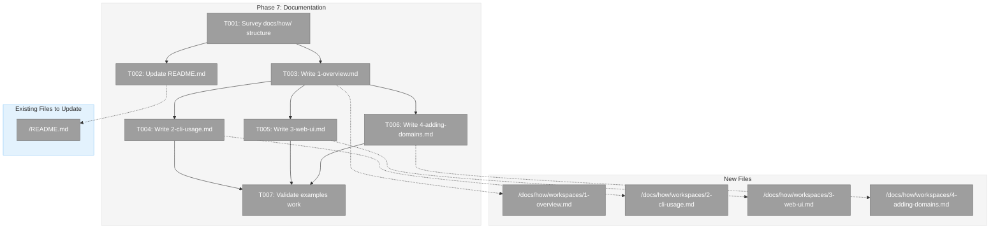
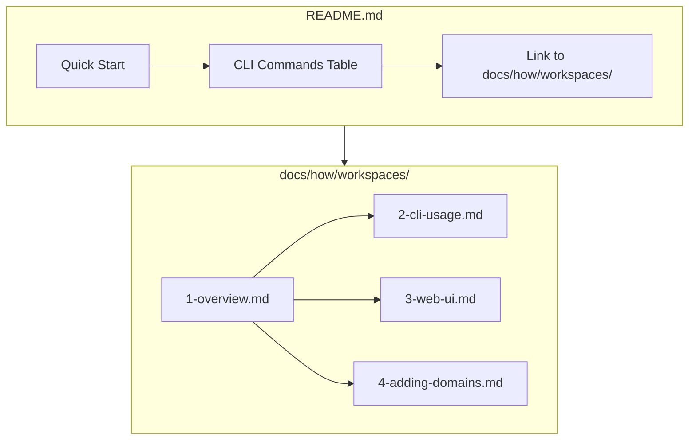
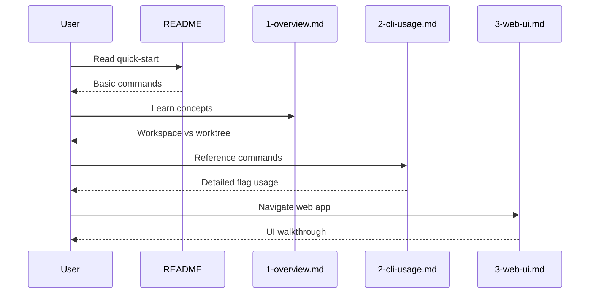

# Phase 7: Documentation – Tasks & Alignment Brief

**Spec**: [../../workspaces-spec.md](../../workspaces-spec.md)
**Plan**: [../../workspaces-plan.md](../../workspaces-plan.md)
**Date**: 2026-01-27

---

## Executive Briefing

### Purpose
This phase delivers comprehensive documentation for the workspace feature, enabling users to understand and effectively use workspace management across CLI and Web UI, while providing developers with patterns for extending the system with new domains.

### What We're Building
Documentation infrastructure that:
- Updates README.md with workspace quick-start commands
- Creates `docs/how/workspaces/` guide series (4 documents)
- Documents the data model, CLI usage, Web UI navigation, and extension patterns
- Follows established docs/how/ patterns (numbered files, cross-references)

### User Value
Users get clear guidance on registering workspaces, managing samples, and understanding how data flows with git. Developers get a template for adding new domains (agents, workflows, prompts) using the Sample exemplar pattern.

### Example
**Before**: No workspace documentation; users must read source code
**After**: `docs/how/workspaces/1-overview.md` explains concepts; `2-cli-usage.md` shows all commands

---

## Objectives & Scope

### Objective
Document workspace feature for users and developers per plan Phase 7 acceptance criteria.

### Behavior Checklist
- [ ] README has quick-start section with workspace commands
- [ ] Detailed guides exist in docs/how/workspaces/
- [ ] Examples are tested and working

### Goals

- ✅ Survey existing docs/how/ structure to determine placement/style
- ✅ Update README.md with workspace/sample quick-start commands
- ✅ Create 1-overview.md explaining workspace concepts and data model
- ✅ Create 2-cli-usage.md documenting all CLI commands and flags
- ✅ Create 3-web-ui.md explaining web UI navigation and features
- ✅ Create 4-adding-domains.md as developer guide for new domains

### Non-Goals (Scope Boundaries)

- ❌ Documenting internal adapter/service implementation details (code is self-documenting)
- ❌ Creating video tutorials or interactive demos
- ❌ Translating documentation to other languages
- ❌ Generating API reference from JSDoc (defer to future tooling)
- ❌ Updating existing workflow documentation (separate feature)
- ❌ Creating troubleshooting FAQ (wait for user feedback)

---

## Architecture Map

### Component Diagram
<!-- Status: grey=pending, orange=in-progress, green=completed, red=blocked -->
<!-- Updated by plan-6 during implementation -->



### Task-to-Component Mapping

<!-- Status: ⬜ Pending | 🟧 In Progress | ✅ Complete | 🔴 Blocked -->

| Task | Component(s) | Files | Status | Comment |
|------|-------------|-------|--------|---------|
| T001 | Survey | /docs/how/ | ⬜ Pending | Understand existing patterns before writing |
| T002 | README | /README.md | ⬜ Pending | Add workspace commands to CLI table and quick-start |
| T003 | Overview Doc | /docs/how/workspaces/1-overview.md | ⬜ Pending | Core concepts, data model, storage architecture |
| T004 | CLI Doc | /docs/how/workspaces/2-cli-usage.md | ⬜ Pending | All workspace and sample commands with examples |
| T005 | Web UI Doc | /docs/how/workspaces/3-web-ui.md | ⬜ Pending | Navigation, pages, forms, worktree selection |
| T006 | Dev Guide | /docs/how/workspaces/4-adding-domains.md | ⬜ Pending | How to add new domains using Sample as template |
| T007 | Validation | (CLI + Web UI) | ⬜ Pending | Run documented commands to verify they work |

---

## Tasks

| Status | ID | Task | CS | Type | Dependencies | Absolute Path(s) | Validation | Subtasks | Notes |
|--------|------|----------------------------------|-----|------|--------------|-------------------------------|-------------------------------|----------|--------|
| [x] | T001 | Survey existing docs/how/ structure and document patterns | 1 | Setup | – | /home/jak/substrate/014-workspaces/docs/how/ | Document placement decision recorded in execution.log | – | Note: workflows/ has 6 files, configuration/ has 3 |
| [x] | T002 | Update README.md with workspace/sample quick-start commands | 2 | Doc | T001 | /home/jak/substrate/014-workspaces/README.md | Workspace commands in CLI table; link to docs/how/workspaces/; note local-dev tool | – | Add after workflow commands section; include brief "local dev tool" note |
| [x] | T003 | Create docs/how/workspaces/1-overview.md with concepts and data model | 2 | Doc | T001 | /home/jak/substrate/014-workspaces/docs/how/workspaces/1-overview.md | Explains: workspace vs worktree, registry, per-worktree data, git integration; links to data-model-dossier.md for detailed diagrams | – | Don't duplicate diagrams - link to dossier |
| [x] | T004 | Create docs/how/workspaces/2-cli-usage.md with all commands | 2 | Doc | T003 | /home/jak/substrate/014-workspaces/docs/how/workspaces/2-cli-usage.md | All 8 commands documented: workspace add/list/info/remove, sample add/list/info/delete | – | Include --json, --force, --workspace-path flags |
| [x] | T005 | Create docs/how/workspaces/3-web-ui.md with navigation guide | 1 | Doc | T003 | /home/jak/substrate/014-workspaces/docs/how/workspaces/3-web-ui.md | Brief reference (~20 lines): routes, page purposes, ?worktree= param; no screenshots | – | KISS - UI is self-explanatory |
| [x] | T006 | Create docs/how/workspaces/4-adding-domains.md as developer guide | 3 | Doc | T003 | /home/jak/substrate/014-workspaces/docs/how/workspaces/4-adding-domains.md | Step-by-step checklist with code snippets; covers: entity, adapter, fake, service, error codes, contract tests, DI registration | – | Use Sample as concrete template; include copy-pasteable code |
| [x] | T007 | Validate all documented examples work correctly | 1 | Test | T004, T005, T006 | /home/jak/substrate/014-workspaces/apps/cli/ | E2E smoke test: workspace add → sample add → sample list → sample delete → workspace remove (CLI only) | – | Single complete flow validates docs accuracy |

---

## Alignment Brief

### Prior Phases Review

#### Phase-by-Phase Summary

**Phase 1: Workspace Entity + Registry Adapter + Contract Tests** (Complete)
- Created `Workspace` entity with private constructor + `create()` factory, `toJSON()` serialization
- Implemented `IWorkspaceRegistryAdapter` interface with CRUD operations
- Built `FakeWorkspaceRegistryAdapter` with three-part API (state setup, inspection, error injection)
- Created `WorkspaceRegistryAdapter` for real JSON file I/O at `~/.config/chainglass/workspaces.json`
- Established error codes E074-E081 with factory pattern
- 24 contract tests ensure Fake-Real parity
- **Security audit fixes**: URL-encoded path traversal prevention, registry corruption detection

**Phase 2: WorkspaceContext Resolution + Worktree Discovery** (Complete)
- Created `WorkspaceContext`, `WorkspaceInfo`, `Worktree` interfaces
- Implemented `WorkspaceContextResolver` with longest-match path resolution (DYK-03)
- Built `GitWorktreeResolver` for `git worktree list --porcelain` parsing
- Version detection ensures git ≥2.13 for worktree support
- 37 new tests including contract tests for resolver

**Phase 3: Sample Domain (Exemplar)** (Complete)
- Created `Sample` entity with slug, name, description, timestamps
- Built `WorkspaceDataAdapterBase` abstract class for all domain adapters
- Implemented `ISampleAdapter` interface + `SampleAdapter` (real) + `FakeSampleAdapter`
- Error codes E082-E089 for sample domain
- 30 contract tests for adapter parity
- **Key pattern**: Base class eliminates boilerplate for future domains

**Phase 4: Service Layer + DI Integration** (Complete)
- Created `IWorkspaceService` and `ISampleService` interfaces
- Implemented `WorkspaceService` and `SampleService` with constructor injection
- Extracted `IGitWorktreeResolver` interface for DI
- Added `WORKSPACE_DI_TOKENS` to shared package (separate from deprecated WORKFLOW_DI_TOKENS)
- Created `ProcessManagerAdapter` for git command execution
- 24 new service tests (15 workspace + 9 sample)

**Phase 5: CLI Commands** (Complete)
- Implemented 8 commands: `workspace add/list/info/remove`, `sample add/list/info/delete`
- Flags: `--json`, `--force`, `--workspace-path`, `--allow-worktree`
- Result types in `@chainglass/shared` for consistent output
- Output adapters for Console and JSON formats
- Context resolution from cwd or explicit `--workspace-path`

**Phase 6: Web UI** (Complete)
- 4 API routes: `/api/workspaces`, `/api/workspaces/[slug]`, `/api/workspaces/[slug]/samples`
- Server Actions: `addWorkspace`, `removeWorkspace`, `addSample`, `deleteSample`
- 3 pages: workspace list, workspace detail, samples (with worktree context via `?worktree=`)
- 5 UI components: WorkspaceNav, WorkspaceAddForm, WorkspaceRemoveButton, SampleCreateForm, SampleDeleteButton
- DI container registrations in web app
- **Key constraint**: Same-user deployment (web server reads user's home directory)

#### Cumulative Deliverables

**Packages/Workflow** (`/packages/workflow/src/`):
- `entities/workspace.ts`, `entities/sample.ts`
- `interfaces/workspace-*.ts`, `interfaces/sample-*.ts`, `interfaces/git-worktree-resolver.interface.ts`
- `adapters/workspace-registry.adapter.ts`, `adapters/sample.adapter.ts`, `adapters/workspace-data-adapter-base.ts`
- `fakes/fake-workspace-registry-adapter.ts`, `fakes/fake-sample-adapter.ts`, `fakes/fake-workspace-context-resolver.ts`, `fakes/fake-git-worktree-resolver.ts`
- `services/workspace.service.ts`, `services/sample.service.ts`
- `resolvers/workspace-context.resolver.ts`, `resolvers/git-worktree.resolver.ts`
- `errors/workspace-errors.ts`, `errors/sample-errors.ts`

**Apps/CLI** (`/apps/cli/src/`):
- `commands/workspace.command.ts`, `commands/sample.command.ts`
- DI registrations in `lib/container.ts`

**Apps/Web** (`/apps/web/`):
- `app/api/workspaces/route.ts`, `app/api/workspaces/[slug]/route.ts`, `app/api/workspaces/[slug]/samples/route.ts`
- `app/actions/workspace-actions.ts`
- `app/(dashboard)/workspaces/page.tsx`, `app/(dashboard)/workspaces/[slug]/page.tsx`, `app/(dashboard)/workspaces/[slug]/samples/page.tsx`
- `src/components/workspaces/*.tsx` (5 components)
- DI registrations in `src/lib/di-container.ts`

**Test Infrastructure**:
- `/test/unit/workflow/workspace-entity.test.ts` (23 tests)
- `/test/unit/workflow/sample-entity.test.ts` (18 tests)
- `/test/unit/workflow/workspace-service.test.ts` (15 tests)
- `/test/unit/workflow/sample-service.test.ts` (9 tests)
- `/test/contracts/workspace-registry-adapter.contract.test.ts` (24 tests)
- `/test/contracts/sample-adapter.contract.test.ts` (30 tests)
- `/test/fixtures/workspace-context.fixture.ts`

#### Key Patterns Established

1. **Entity Pattern**: Private constructor + static `create()` factory + `toJSON()` serialization
2. **Three-Part Fake API**: State setup methods, call inspection getters, error injection
3. **Contract Test Factory**: Parameterized tests run against both Fake and Real adapters
4. **WorkspaceDataAdapterBase**: Abstract base for domain adapters (getDomainPath, readJson, writeJson)
5. **Service Layer**: Constructor injection, Result types, defense-in-depth validation
6. **CLI Context Resolution**: `resolveOrOverrideContext()` helper for cwd vs explicit path
7. **Web Hybrid API**: GET via routes, mutations via Server Actions

#### Critical Findings Applied

| Finding | Applied In | How |
|---------|-----------|-----|
| CD-01: Split Storage Architecture | Phase 1, 3 | Registry in ~/.config/; data in .chainglass/data/ |
| CD-02: WorkspaceDataAdapterBase | Phase 3 | Abstract base class for Sample adapter |
| CD-03: Contract Tests | Phase 1, 3 | Factory pattern ensures Fake-Real parity |
| HD-04: Git Worktree Fallback | Phase 2 | Version check, graceful degradation |
| HD-05: Path Security | Phase 1, 4 | URL-decode, validate, reject traversal |
| HD-06: Error Codes | All phases | E074-E081 (workspace), E082-E089 (sample) |

### Critical Findings Affecting This Phase

None directly from Plan § 3 affect Phase 7 documentation. However, document these constraints:

- **Same-user deployment**: Web server must run as same user who owns ~/.config/chainglass/
- **Git ≥2.13 required**: For worktree detection; graceful fallback if older/missing
- **Fakes-only testing**: Per R-TEST-007, no vi.mock allowed

### ADR Decision Constraints

No ADRs directly constrain Phase 7 documentation tasks.

### Invariants & Guardrails

- Documentation must be accurate to current implementation
- All example commands must be tested and working
- Cross-references between docs must use relative paths
- Follow existing docs/how/ style (numbered files, markdown headers)

### Inputs to Read

| File | Purpose |
|------|---------|
| `/home/jak/substrate/014-workspaces/docs/how/workflows/` | Reference existing documentation style |
| `/home/jak/substrate/014-workspaces/README.md` | Understand current structure for updates |
| `/home/jak/substrate/014-workspaces/docs/plans/014-workspaces/data-model-dossier.md` | Storage architecture diagrams |
| `/home/jak/substrate/014-workspaces/apps/cli/src/commands/workspace.command.ts` | CLI command details |
| `/home/jak/substrate/014-workspaces/apps/cli/src/commands/sample.command.ts` | CLI command details |

### Visual Alignment Aids

#### System Flow: Documentation Structure



#### Sequence: User Learning Path



### Test Plan (Documentation Validation)

| Test | Method | Expected Output | Rationale |
|------|--------|-----------------|-----------|
| README links work | Manual | All links resolve | User experience |
| CLI commands documented accurately | Run each command | Output matches docs | Accuracy |
| Web UI pages exist | Navigate browser | Pages load | Accuracy |
| Cross-references valid | Check links | No 404s | Navigation |

### Step-by-Step Implementation Outline

1. **T001 (Survey)**: Read docs/how/ structure, note patterns (numbered files, cross-refs)
2. **T002 (README)**: Add workspace/sample commands to CLI table, add quick-start section
3. **T003 (Overview)**: Write 1-overview.md with concepts, data model diagram, storage paths
4. **T004 (CLI)**: Write 2-cli-usage.md with all 8 commands, flags, examples
5. **T005 (Web UI)**: Write 3-web-ui.md with navigation, pages, worktree selection
6. **T006 (Developer)**: Write 4-adding-domains.md using Sample as template
7. **T007 (Validate)**: Run documented commands, verify pages load, check links

### Commands to Run

```bash
# Build CLI for testing
pnpm build

# Test workspace commands
cg workspace list --json
cg workspace add "Test Workspace" /tmp/test-ws
cg workspace info test-workspace --json
cg workspace remove test-workspace --force

# Test sample commands (from a registered workspace)
cd /path/to/registered/workspace
cg sample add "Test Sample" "Sample description"
cg sample list --json
cg sample info test-sample --json
cg sample delete test-sample --force

# Start web server for UI validation
just dev
# Then visit: http://localhost:3000/workspaces

# Link validation (optional)
find docs/how/workspaces -name "*.md" -exec grep -l "](../" {} \;
```

### Risks/Unknowns

| Risk | Severity | Mitigation |
|------|----------|------------|
| Commands may change before merge | Low | Validate in T007 |
| Web UI routes may differ from docs | Low | Validate in T007 |
| Missing edge case documentation | Medium | Review error codes, add troubleshooting if needed |

### Ready Check

- [ ] Prior phases reviewed (Phases 1-6 complete)
- [ ] Critical findings noted (same-user constraint, git version req)
- [ ] ADR constraints mapped to tasks (N/A - no ADRs)
- [ ] Test plan defined (documentation validation)
- [ ] Implementation steps ordered
- [ ] Stakeholder GO received

---

## Phase Footnote Stubs

_To be populated by plan-6 during implementation._

| Footnote | Date | Description | File:Line |
|----------|------|-------------|-----------|
| | | | |

---

## Evidence Artifacts

Implementation evidence will be written to:

- `execution.log.md` in this directory - detailed task-by-task narrative
- Documentation files validated via CLI commands and browser testing

---

## Discoveries & Learnings

_Populated during implementation by plan-6. Log anything of interest to your future self._

| Date | Task | Type | Discovery | Resolution | References |
|------|------|------|-----------|------------|------------|
| | | | | | |

**Types**: `gotcha` | `research-needed` | `unexpected-behavior` | `workaround` | `decision` | `debt` | `insight`

**What to log**:
- Things that didn't work as expected
- External research that was required
- Implementation troubles and how they were resolved
- Gotchas and edge cases discovered
- Decisions made during implementation
- Technical debt introduced (and why)
- Insights that future phases should know about

_See also: `execution.log.md` for detailed narrative._

---

## Directory Layout

```
docs/plans/014-workspaces/
  ├── workspaces-spec.md
  ├── workspaces-plan.md
  ├── data-model-dossier.md
  ├── research-dossier.md
  └── tasks/
      ├── phase-1-workspace-entity-registry-adapter-contract-tests/
      │   ├── tasks.md
      │   └── execution.log.md
      ├── phase-2-workspacecontext-resolution/
      │   ├── tasks.md
      │   └── execution.log.md
      ├── phase-3-sample-domain-exemplar/
      │   ├── tasks.md
      │   └── execution.log.md
      ├── phase-4-service-layer-di-integration/
      │   ├── tasks.md
      │   └── execution.log.md
      ├── phase-5-cli-commands/
      │   ├── tasks.md
      │   └── execution.log.md
      ├── phase-6-web-ui/
      │   ├── tasks.md
      │   └── execution.log.md
      └── phase-7-documentation/  <-- Current
          ├── tasks.md
          └── execution.log.md  # Created by plan-6
```

---

*Tasks dossier generated 2026-01-27*
*Next Step: Run `/plan-6-implement-phase --phase "Phase 7: Documentation"` after stakeholder GO*

---

## Critical Insights Discussion

**Session**: 2026-01-27 10:26Z
**Context**: Phase 7: Documentation – Tasks Review
**Analyst**: AI Clarity Agent
**Reviewer**: Development Team
**Format**: Water Cooler Conversation (5 Critical Insights)

### Insight 1: Same-User Deployment Constraint Documentation

**Did you know**: Web UI reads ~/.config/chainglass/ from server process owner - different user = empty workspaces

**Implications**:
- Silent failure mode for production deployments
- Users would think it's a bug
- Docker/container deployments need special handling

**Options Considered**:
- Option A: Prominent warning in README + Overview + Web UI doc
- Option B: Dedicated deployment section in web-ui doc only
- Option C: Both A + B (multiple touchpoints)

**AI Recommendation**: Option C - Multiple touchpoints
- Reasoning: Critical constraint deserves visibility in multiple places

**Discussion Summary**:
User clarified this is a dev tool - over-documenting deployment is overkill.

**Decision**: Brief note in README only - it's a local dev tool

**Action Items**:
- [x] Update T002 to include "local dev tool" note

**Affects**: T002

---

### Insight 2: Adding Domains Guide Value

**Did you know**: T006 (4-adding-domains.md) is the most valuable doc for future features like agents/workflows/prompts

**Implications**:
- Template for all future domain implementations
- Reduces reverse-engineering from Sample code
- Worth more effort than a conceptual overview

**Options Considered**:
- Option A: Prose-heavy conceptual guide (CS-2)
- Option B: Step-by-step checklist with code snippets (CS-3)
- Option C: Interactive template generator (CS-5, out of scope)

**AI Recommendation**: Option B - Step-by-step checklist
- Reasoning: Maximizes Sample exemplar investment; developers can follow mechanically

**Discussion Summary**:
User agreed the extra effort is worth it for a proper follow-along guide.

**Decision**: Step-by-step checklist with copy-pasteable code snippets

**Action Items**:
- [x] Bump T006 to CS-3
- [x] Update validation to require code snippets

**Affects**: T006

---

### Insight 3: T007 Validation Scope

**Did you know**: T007 "validate examples" had no defined scope - could be time sink or unreliable spot check

**Implications**:
- No clear definition of "done"
- Could spend hours testing every example
- Or miss broken examples with quick spot check

**Options Considered**:
- Option A: Spot check 3-4 commands (fast, gaps)
- Option B: Full E2E smoke test (complete flow)
- Option C: Explicit example checklist (thorough, more upfront work)

**AI Recommendation**: Option B - Full E2E smoke test
- Reasoning: One complete flow validates user journey without exhaustive testing

**Discussion Summary**:
User chose E2E smoke test but CLI-only (no web validation needed).

**Decision**: CLI-only E2E: workspace add → sample add → list → delete → workspace remove

**Action Items**:
- [x] Update T007 validation to CLI-only E2E flow

**Affects**: T007

---

### Insight 4: Diagram Duplication Risk

**Did you know**: data-model-dossier.md has great diagrams that T003 was going to recreate

**Implications**:
- Duplicate maintenance burden
- Risk of diagrams drifting out of sync
- Extra writing effort for same information

**Options Considered**:
- Option A: Copy diagrams to overview (duplicate)
- Option B: Link to dossier (single source of truth)
- Option C: Extract to shared location (overkill)

**AI Recommendation**: Option B - Link to dossier
- Reasoning: Single source of truth, less maintenance

**Discussion Summary**:
User agreed - link instead of duplicate.

**Decision**: Overview links to data-model-dossier for detailed diagrams

**Action Items**:
- [x] Update T003 notes to link not duplicate

**Affects**: T003

---

### Insight 5: Web UI Doc Necessity

**Did you know**: T005 (3-web-ui.md) may be largely unnecessary - UI is self-explanatory CRUD

**Implications**:
- Screenshots go stale quickly
- Extensive walkthrough for obvious navigation is overkill
- Only non-obvious thing is ?worktree= parameter

**Options Considered**:
- Option A: Full guide with screenshots (CS-2)
- Option B: Fold into overview, skip dedicated doc (CS-1)
- Option C: Brief reference doc, no screenshots (CS-1)

**AI Recommendation**: Option C - Brief doc without screenshots
- Reasoning: Quick reference exists for routes and params, no maintenance burden

**Discussion Summary**:
User chose Option C - KISS principle.

**Decision**: ~20 line reference doc listing routes and ?worktree= param

**Action Items**:
- [x] Reduce T005 to CS-1
- [x] Update validation to "brief reference, no screenshots"

**Affects**: T005

---

## Session Summary

**Insights Surfaced**: 5 critical insights identified and discussed
**Decisions Made**: 5 decisions reached through collaborative discussion
**Action Items Created**: 6 task updates applied
**Areas Updated**:
- T002: Added "local dev tool" note
- T003: Link to dossier, don't duplicate diagrams
- T005: Reduced to CS-1, brief doc without screenshots
- T006: Bumped to CS-3, step-by-step with code snippets
- T007: CLI-only E2E smoke test validation

**Shared Understanding Achieved**: ✓

**Confidence Level**: High - Documentation scope is now well-defined and appropriately sized

**Next Steps**:
Mark Ready Check as complete, then run `/plan-6-implement-phase --phase "Phase 7: Documentation"`

**Notes**:
- Phase 7 is lightweight documentation - total ~11 CS points
- Focus effort on T006 (adding domains guide) as highest-value doc
- Keep everything else minimal and practical
