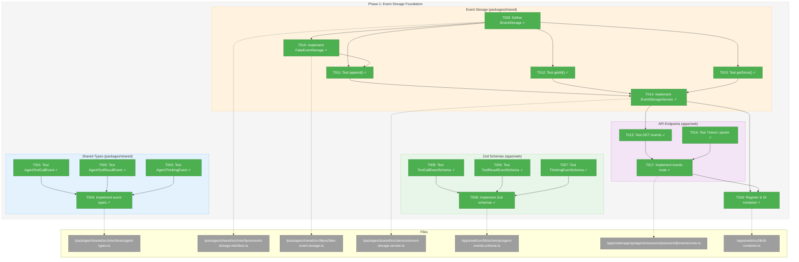
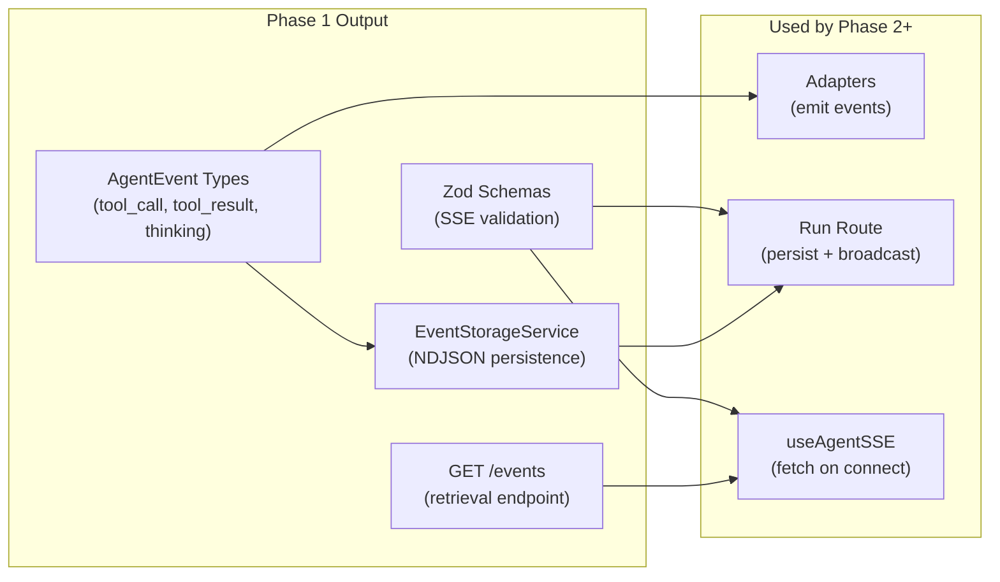
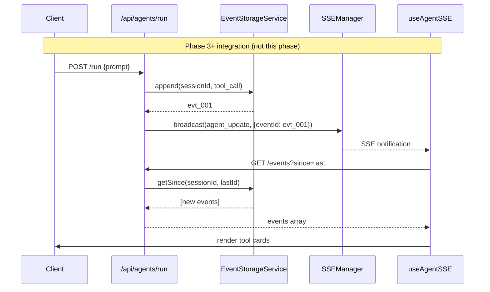

# Phase 1: Event Storage Foundation – Tasks & Alignment Brief

**Spec**: [../../better-agents-spec.md](../../better-agents-spec.md)
**Plan**: [../../better-agents-plan.md](../../better-agents-plan.md)
**Date**: 2026-01-27
**Phase Slug**: `phase-1-event-storage-foundation`

---

## Executive Briefing

### Purpose
This phase builds the persistence layer for agent events, enabling session resumability and tool/thinking visibility. Without this foundation, tool calls and thinking blocks would be lost on page refresh—users would lose session history and the ability to review past agent activity.

### What We're Building
An **EventStorageService** that:
- Persists agent events to NDJSON files at `.chainglass/workspaces/<slug>/data/<agent>/<session>/events.ndjson`
- Generates sequential event IDs (`evt_001`, `evt_002`, ...) for incremental sync
- Supports querying all events or events since a given ID
- Enables session archival by moving to `archived/` subdirectory

Plus:
- New TypeScript event types (`tool_call`, `tool_result`, `thinking`) in the shared package
- New Zod schemas for SSE broadcast of these event types
- REST API endpoints for event retrieval
- FakeEventStorage for test isolation

### User Value
Users can refresh the page or return later to see complete session history including tool calls and thinking blocks. No more "blank slate" after refresh—full context is preserved and reviewable.

### Example
**Before**: User refreshes page → Session history gone, no tool visibility
**After**: User refreshes page → `GET /events` fetches all persisted events → UI rebuilds complete conversation with tool cards

---

## Objectives & Scope

### Objective
Implement the event persistence infrastructure as specified in the plan, satisfying:
- **AC17**: Events are persisted to `.chainglass/workspaces/<slug>/data/` as NDJSON files
- **AC18**: Page refresh reloads session events from server (no data loss)
- **AC19**: `GET /events?since=<id>` returns only events after the specified ID
- **AC20**: Old/deleted sessions can be archived (moved to `archived/` subfolder)
- **AC21**: Existing sessions without tool data continue to work (no migration required)

### Goals

- ✅ Define `IEventStorage` interface with `append()`, `getAll()`, `getSince()`, `archive()` methods
- ✅ Implement `EventStorageService` with NDJSON file operations
- ✅ Create `FakeEventStorage` with test helper methods
- ✅ Create Zod schemas in shared: `AgentToolCallEventSchema`, `AgentToolResultEventSchema`, `AgentThinkingEventSchema`
- ✅ Derive TypeScript types via `z.infer<>` — single source of truth, no drift
- ✅ Extend `AgentEvent` discriminated union with derived types
- ✅ Implement API route: `GET /api/agents/sessions/:sessionId/events`
- ✅ Register `EventStorageService` in DI container per ADR-0004 patterns

### Non-Goals (Scope Boundaries)

- ❌ Adapter modifications (Phase 2) — this phase only defines types and storage
- ❌ SSE integration (Phase 3) — storage is complete before wiring to broadcast
- ❌ UI components (Phase 4) — no React components in this phase
- ❌ Database storage — file-based NDJSON is sufficient for MVP per spec NG4
- ❌ Virtualization/performance optimization — defer per spec NG5
- ❌ Event compression or rotation — simplicity over optimization
- ❌ Workspace-slug implementation — hardcoded as "default" for now per spec

---

## Architecture Map

### Component Diagram
<!-- Status: grey=pending, orange=in-progress, green=completed, red=blocked -->
<!-- Updated by plan-6 during implementation -->



### Task-to-Component Mapping

<!-- Status: ⬜ Pending | 🟧 In Progress | ✅ Complete | 🔴 Blocked -->

| Task | Component(s) | Files | Status | Comment |
|------|-------------|-------|--------|---------|
| T001 | Zod Schemas | /test/unit/shared/schemas/agent-event-schemas.test.ts | ✅ Complete | TDD: Write failing test for tool_call Zod schema |
| T002 | Zod Schemas | /test/unit/shared/schemas/agent-event-schemas.test.ts | ✅ Complete | TDD: Write failing test for tool_result Zod schema |
| T003 | Zod Schemas | /test/unit/shared/schemas/agent-event-schemas.test.ts | ✅ Complete | TDD: Write failing test for thinking Zod schema |
| T004 | Zod Schemas | /packages/shared/src/schemas/agent-event.schema.ts | ✅ Complete | Implement Zod schemas, derive TS types via z.infer<> |
| T005 | Agent Types | /packages/shared/src/interfaces/agent-types.ts | ✅ Complete | Re-export derived types, extend AgentEvent union |
| T006 | SSE Integration | /test/unit/web/schemas/agent-events.schema.test.ts | ✅ Complete | Test web imports shared schemas correctly |
| T007 | SSE Integration | /apps/web/src/lib/schemas/agent-events.schema.ts | ✅ Complete | Update web to import from shared (consumer, not owner) |
| T008 | Cleanup | /packages/shared, /apps/web | ✅ Complete | Remove duplicate definitions, verify single source of truth |
| T009 | Interface | /packages/shared/src/interfaces/event-storage.interface.ts | ✅ Complete | Define IEventStorage with append, getAll, getSince, archive |
| T010 | Fake | /packages/shared/src/fakes/fake-event-storage.ts | ✅ Complete | Implement FakeEventStorage with test helpers |
| T011 | Storage Tests | /test/unit/shared/event-storage-service.test.ts | ✅ Complete | TDD: Write failing tests for append() with ID generation |
| T012 | Storage Tests | /test/unit/shared/event-storage-service.test.ts | ✅ Complete | TDD: Write failing tests for getAll() |
| T013 | Storage Tests | /test/unit/shared/event-storage-service.test.ts | ✅ Complete | TDD: Write failing tests for getSince() |
| T014 | Storage Service | /packages/shared/src/services/event-storage.service.ts | ✅ Complete | Implement EventStorageService with NDJSON ops |
| T015 | API Tests | /test/unit/web/api/agent-events-route.test.ts | ✅ Complete | TDD: Write failing tests for GET /events |
| T016 | API Tests | /test/unit/web/api/agent-events-route.test.ts | ✅ Complete | TDD: Write failing tests for ?since= parameter |
| T017 | API Route | /apps/web/app/api/agents/sessions/[sessionId]/events/route.ts | ✅ Complete | Implement events API route |
| T018 | DI Container | /apps/web/src/lib/di-container.ts | ✅ Complete | Register EventStorageService per ADR-0004 |
| T019 | Validator Utility | /packages/shared/src/lib/validators/session-id-validator.ts | ✅ Complete | Security: Validate sessionId to prevent path traversal |
| T020 | Contract Tests | /test/contracts/event-storage.contract.test.ts | ✅ Complete | Verify FakeEventStorage matches real EventStorageService |

---

## Tasks

| Status | ID | Task | CS | Type | Dependencies | Absolute Path(s) | Validation | Subtasks | Notes |
|--------|-----|------|-----|------|--------------|------------------|------------|----------|-------|
| [x] | T001 | Write test for AgentToolCallEventSchema Zod validation | 2 | Test | – | /home/jak/substrate/015-better-agents/test/unit/shared/schemas/agent-event-schemas.test.ts | Test fails (schema doesn't exist), validates tool_call shape | – | TDD RED phase; Zod-first approach |
| [x] | T002 | Write test for AgentToolResultEventSchema Zod validation | 2 | Test | – | /home/jak/substrate/015-better-agents/test/unit/shared/schemas/agent-event-schemas.test.ts | Test fails (schema doesn't exist), validates tool_result shape | – | TDD RED phase |
| [x] | T003 | Write test for AgentThinkingEventSchema Zod validation | 2 | Test | – | /home/jak/substrate/015-better-agents/test/unit/shared/schemas/agent-event-schemas.test.ts | Test fails (schema doesn't exist), validates thinking shape | – | TDD RED phase |
| [x] | T004 | Implement Zod schemas in shared, derive TS types via z.infer<> | 2 | Core | T001, T002, T003 | /home/jak/substrate/015-better-agents/packages/shared/src/schemas/agent-event.schema.ts, /home/jak/substrate/015-better-agents/packages/shared/src/schemas/index.ts, /home/jak/substrate/015-better-agents/packages/shared/src/index.ts | All schema tests pass, types exported, z.infer<> derives AgentToolCallEvent etc. | – | DYK-03: Single source of truth |
| [x] | T005 | Update agent-types.ts to re-export derived types | 1 | Core | T004 | /home/jak/substrate/015-better-agents/packages/shared/src/interfaces/agent-types.ts | AgentEvent union includes new types, backward compatible | – | Re-export from schemas |
| [x] | T006 | Write test for SSE schema integration in web | 2 | Test | T004 | /home/jak/substrate/015-better-agents/test/unit/web/schemas/agent-events.schema.test.ts | Web schemas import from shared, union works | – | Verify web can consume shared schemas |
| [x] | T007 | Update web agent-events.schema.ts to import from shared | 1 | Core | T006 | /home/jak/substrate/015-better-agents/apps/web/src/lib/schemas/agent-events.schema.ts | Imports shared schemas, extends agentEventSchemas array | – | Web becomes consumer, not owner |
| [x] | T008 | Remove duplicate type definitions, verify no drift | 1 | Core | T005, T007 | /home/jak/substrate/015-better-agents/packages/shared/src/interfaces/agent-types.ts, /home/jak/substrate/015-better-agents/apps/web/src/lib/schemas/agent-events.schema.ts | Single source of truth in shared/schemas, web imports only | – | Cleanup task - verified no duplicates exist |
| [x] | T009 | Define IEventStorage interface with JSDoc | 1 | Core | – | /home/jak/substrate/015-better-agents/packages/shared/src/interfaces/event-storage.interface.ts, /home/jak/substrate/015-better-agents/packages/shared/src/interfaces/index.ts | Interface compiles, exported from index.ts | – | Methods: append, getAll, getSince, archive |
| [x] | T010 | Implement FakeEventStorage with test helpers | 2 | Core | T009 | /home/jak/substrate/015-better-agents/packages/shared/src/fakes/fake-event-storage.ts, /home/jak/substrate/015-better-agents/packages/shared/src/fakes/index.ts, /home/jak/substrate/015-better-agents/packages/shared/src/index.ts | Fake implements interface, has getStoredEvents(), assertEventStored() | – | Follow FakeAgentAdapter pattern |
| [x] | T019 | Create validateSessionId() utility with tests | 2 | Core | – | /home/jak/substrate/015-better-agents/packages/shared/src/lib/validators/session-id-validator.ts, /home/jak/substrate/015-better-agents/test/unit/shared/session-id-validator.test.ts | Rejects `/`, `..`, `\`, whitespace; accepts `[a-zA-Z0-9-_]+`; throws on invalid | – | DYK-02: Security - path traversal prevention |
| [x] | T011 | Write tests for EventStorageService.append() with timestamp-based ID generation | 2 | Test | T009, T010, T019 | /home/jak/substrate/015-better-agents/test/unit/shared/event-storage-service.test.ts | Tests cover: ID format (ISO timestamp + random suffix), file creation, natural ordering | – | DYK-01: Timestamp IDs avoid race conditions |
| [x] | T012 | Write tests for EventStorageService.getAll() | 2 | Test | T009 | /home/jak/substrate/015-better-agents/test/unit/shared/event-storage-service.test.ts | Tests cover: empty session, multiple events, malformed lines silently skipped | – | DYK-04: Silent skip pattern |
| [x] | T013 | Write tests for EventStorageService.getSince() | 2 | Test | T009 | /home/jak/substrate/015-better-agents/test/unit/shared/event-storage-service.test.ts | Tests cover: since ID, missing ID, edge cases, returns events AFTER the ID | – | Per AC19 |
| [x] | T014 | Implement EventStorageService with NDJSON file operations | 3 | Core | T011, T012, T013, T019 | /home/jak/substrate/015-better-agents/packages/shared/src/services/event-storage.service.ts, /home/jak/substrate/015-better-agents/packages/shared/src/services/index.ts, /home/jak/substrate/015-better-agents/packages/shared/src/index.ts | All storage tests pass, uses IFileSystem for operations, validates sessionId via utility | – | Path: .chainglass/workspaces/default/data/ |
| [x] | T015 | Write tests for GET /api/agents/sessions/:id/events (all events) | 2 | Test | T014 | /home/jak/substrate/015-better-agents/test/unit/web/api/agent-events-route.test.ts | Tests cover: returns all events, empty session 200, invalid session 404 | – | – |
| [x] | T016 | Write tests for GET /events?since= parameter filtering | 2 | Test | T014 | /home/jak/substrate/015-better-agents/test/unit/web/api/agent-events-route.test.ts | Tests cover: returns events after ID, invalid ID handling | – | Per AC19 |
| [x] | T017 | Implement events API route | 2 | Core | T015, T016 | /home/jak/substrate/015-better-agents/apps/web/app/api/agents/sessions/[sessionId]/events/route.ts | All route tests pass, returns JSON array of events | – | Use EventStorageService |
| [x] | T018 | Register EventStorageService in DI container | 1 | Core | T014, T017 | /home/jak/substrate/015-better-agents/apps/web/src/lib/di-container.ts, /home/jak/substrate/015-better-agents/packages/shared/src/di-tokens.ts | Service resolvable, prod uses real path, test uses temp dir | – | Per ADR-0004 useFactory pattern |
| [x] | T020 | Write contract tests for FakeEventStorage ↔ EventStorageService parity | 2 | Test | T010, T014 | /home/jak/substrate/015-better-agents/test/contracts/event-storage.contract.test.ts | Same test suite passes for both implementations | – | DYK-05: Fake-real parity verification |

---

## Alignment Brief

### Critical Findings Affecting This Phase

**Critical Discovery 01: Event-Sourced Storage Required Before Adapters**
- **Impact**: This entire phase exists because of this discovery
- **Constraint**: All events must flow through storage before SSE broadcast
- **Addressed by**: T009-T014 (entire storage subsystem)

**Critical Discovery 02: Three-Layer Sync Must Be Atomic**
- **Impact**: Event types defined in Phase 1 must be complete before Phase 2 adapter work
- **Constraint**: Discriminated union requires all layers to know about new event types
- **Addressed by**: T001-T008 (define all types FIRST)

**High Discovery 05: SSE Schema Extension Pattern Established**
- **Impact**: New Zod schemas must follow exact existing pattern
- **Constraint**: Add to `agentEventSchemas` array for union extension
- **Addressed by**: T001-T008; **DYK-03 UPDATE**: Schemas now live in shared package, web imports them

**DYK-03: Zod-First Single Source of Truth**
- **Impact**: Prevents type/schema drift that causes runtime validation failures
- **Decision**: Define Zod schemas in `packages/shared/src/schemas/`, derive TS types via `z.infer<>`
- **Rationale**: Existing pattern in shared (agent.schema.ts, workflow-metadata.schema.ts); enables future data model refactoring
- **Addressed by**: T001-T008 restructured for Zod-first approach

**DYK-04: Silent Skip for Malformed NDJSON Lines**
- **Impact**: Corrupted event files don't break session recovery
- **Decision**: `getAll()` and `getSince()` silently skip unparseable lines, return valid events only
- **Rationale**: Matches existing StreamJsonParser `catch {}` pattern; resilient to partial corruption
- **Addressed by**: T012 tests verify skip behavior

**DYK-05: Dual-Layer Test Strategy with Contract Parity**
- **Impact**: Ensures FakeEventStorage behaves identically to real implementation
- **Decision**: Storage service tests use real temp dir; API route tests use fake via DI; contract tests verify parity
- **Rationale**: Follows established codebase pattern (filesystem-copy-directory.test.ts, filesystem.contract.test.ts)
- **Addressed by**: T011-T014 (real fs), T015-T016 (fake), T020 (contract parity)

### ADR Decision Constraints

**ADR-0004: Dependency Injection Container Architecture**
- **Decision**: Use `useFactory` pattern, never `useClass` with decorators
- **Constraint**: EventStorageService registration must use factory function
- **Addressed by**: T018 uses `useFactory: (c) => new EventStorageService(c.resolve<IFileSystem>(...), ...)`

**ADR-0007: SSE Single-Channel Event Routing Pattern**
- **Decision**: Single global SSE channel with client-side routing by sessionId
- **Constraint**: New event types must include sessionId in payload
- **Addressed by**: T005-T008 schemas include `sessionId` in data object

### Invariants & Guardrails

- **Event ID Format**: Timestamp-based `YYYY-MM-DDTHH:mm:ss.sssZ_<random>` (e.g., `2026-01-27T12:00:00.000Z_a7b3c`) — naturally ordered, no concurrency issues
- **Path Security**: Session IDs must be sanitized to prevent directory traversal
- **File Atomicity**: Use append-only writes; don't overwrite events
- **Backward Compatibility**: Empty events.ndjson or missing file returns empty array, not error

### Inputs to Read

| File | Purpose |
|------|---------|
| `/home/jak/substrate/015-better-agents/packages/shared/src/interfaces/agent-types.ts` | Existing event type patterns |
| `/home/jak/substrate/015-better-agents/apps/web/src/lib/schemas/agent-events.schema.ts` | Zod schema patterns |
| `/home/jak/substrate/015-better-agents/packages/shared/src/fakes/fake-agent-adapter.ts` | Fake implementation pattern |
| `/home/jak/substrate/015-better-agents/packages/shared/src/interfaces/filesystem.interface.ts` | IFileSystem contract |
| `/home/jak/substrate/015-better-agents/apps/web/src/lib/di-container.ts` | DI registration pattern |
| `/home/jak/substrate/015-better-agents/docs/adr/adr-0004-dependency-injection-container-architecture.md` | DI constraints |

### Visual Alignment Aids

#### System State Flow


#### Sequence: Event Storage on Agent Run (Phase 3+)


### Test Plan (Full TDD)

Per spec Testing Strategy: "Full TDD with targeted mocks"

#### Test Categories

| Category | Tests | Rationale |
|----------|-------|-----------|
| Type Tests | T001-T003 | Verify TypeScript interfaces match spec shapes |
| Schema Tests | T005-T007 | Verify Zod validates/rejects correctly |
| Storage Unit | T011-T013 | Core persistence behavior |
| API Integration | T015-T016 | Route returns correct data |

#### Fixtures Required

```typescript
// test/fixtures/agent-events.fixture.ts
export const TOOL_CALL_EVENT = {
  type: 'tool_call' as const,
  timestamp: '2026-01-27T12:00:00.000Z',
  data: {
    toolName: 'Bash',
    input: { command: 'ls -la' },
    toolCallId: 'toolu_abc123',
  },
};

export const TOOL_RESULT_EVENT = {
  type: 'tool_result' as const,
  timestamp: '2026-01-27T12:00:01.000Z',
  data: {
    toolCallId: 'toolu_abc123',
    output: 'total 48\ndrwxr-xr-x...',
    isError: false,
  },
};

export const THINKING_EVENT = {
  type: 'thinking' as const,
  timestamp: '2026-01-27T12:00:02.000Z',
  data: {
    content: 'Let me analyze this step by step...',
    signature: 'sig_xyz789', // Optional, Claude only
  },
};
```

#### Mock Usage Policy

**Dual-Layer Test Strategy (DYK-05)**:

| Test Target | Approach | Rationale |
|-------------|----------|-----------|
| EventStorageService (T011-T014) | Real temp dir via `mkdtemp` | Test actual file operations |
| API Routes (T015-T016) | FakeEventStorage via DI | Test route logic, not storage |
| Contract Tests (T020) | Both implementations | Verify fake-real parity |

**Allowed (External Boundaries)**:
- `vi.fn()` for callbacks in tests (e.g., verifying onEvent called)
- Real temp directory for EventStorageService unit tests
- FakeEventStorage injected via DI for API route tests

**Not Allowed (Internal Code)**:
- NO `vi.mock()` to replace internal modules
- NO mocking IFileSystem when testing EventStorageService itself

### Step-by-Step Implementation Outline

1. **Zod Schemas First — Single Source of Truth (T001-T004)**
   - Create test file in shared: `test/unit/shared/schemas/agent-event-schemas.test.ts`
   - Write failing tests for tool_call, tool_result, thinking schemas
   - Implement schemas in `packages/shared/src/schemas/agent-event.schema.ts`
   - Derive TypeScript types via `z.infer<typeof Schema>`
   - Export from shared index

2. **Type Integration & Web Consumer (T005-T008)**
   - Re-export derived types from agent-types.ts for backward compatibility
   - Extend AgentEvent union with new types
   - Update web to IMPORT schemas from shared (not define its own)
   - Remove any duplicate definitions, verify single source of truth

3. **Interface & Fake (T009-T010)**
   - Define IEventStorage interface
   - Implement FakeEventStorage
   - Export from package index

4. **Storage Service (T011-T014)**
   - Write failing tests (temp dir setup)
   - Implement append() with ID generation
   - Implement getAll() with NDJSON parsing
   - Implement getSince() with filtering

5. **API Route (T015-T017)**
   - Write failing route tests
   - Implement GET handler
   - Wire to EventStorageService

6. **DI Registration (T018)**
   - Add DI token
   - Register with useFactory
   - Update test container

### Commands to Run

```bash
# Test execution (run after each task)
just test                           # All tests
pnpm -F @chainglass/shared test     # Shared package only
pnpm -F @chainglass/web test        # Web package only

# Type checking
just typecheck                      # Full project
pnpm -F @chainglass/shared typecheck

# Linting
just lint                           # Biome linter
just format                         # Auto-fix formatting

# Build verification
just build                          # Full build

# Quick quality check
just fft                            # Fix, format, test
just check                          # Full suite (lint + typecheck + test)
```

### Risks & Unknowns

| Risk | Severity | Mitigation |
|------|----------|------------|
| NDJSON parse errors on corrupted files | Medium | **Silent skip**: Skip malformed lines, return valid events (matches StreamJsonParser pattern) |
| Event ID collision across sessions | Low | IDs are session-scoped, prefix with session slug |
| Disk space exhaustion | Low | Out of scope for MVP; monitor in production |
| Path traversal via sessionId | High | **Mitigated by T019**: validateSessionId() utility rejects `/`, `..`, `\`, whitespace |

### Ready Check

- [ ] Spec reviewed and acceptance criteria clear
- [ ] Plan section for Phase 1 reviewed
- [ ] Critical Findings understood and task mapping identified
- [ ] ADR-0004 DI patterns reviewed
- [ ] ADR-0007 SSE patterns reviewed
- [ ] Existing schema patterns in agent-events.schema.ts reviewed
- [ ] Existing fake patterns in fake-agent-adapter.ts reviewed
- [ ] Test fixtures planned
- [ ] No time estimates in this document (CS scores only)
- [ ] ADR constraints mapped to tasks (IDs noted in Notes column) - N/A for T001-T017; T018 references ADR-0004

---

## Phase Footnote Stubs

**NOTE**: This section will be populated during implementation by plan-6a-update-progress.

| Footnote | Task | Description |
|----------|------|-------------|
| | | |

---

## Evidence Artifacts

- **Execution Log**: `./execution.log.md` (created by plan-6 during implementation)
- **Test Results**: CI output from `just test`
- **Type Check Results**: CI output from `just typecheck`

---

## Discoveries & Learnings

_Populated during implementation by plan-6. Log anything of interest to your future self._

| Date | Task | Type | Discovery | Resolution | References |
|------|------|------|-----------|------------|------------|
| | | | | | |

**Types**: `gotcha` | `research-needed` | `unexpected-behavior` | `workaround` | `decision` | `debt` | `insight`

**What to log**:
- Things that didn't work as expected
- External research that was required
- Implementation troubles and how they were resolved
- Gotchas and edge cases discovered
- Decisions made during implementation
- Technical debt introduced (and why)
- Insights that future phases should know about

_See also: `execution.log.md` for detailed narrative._

---

## Directory Layout

```
docs/plans/015-better-agents/
├── better-agents-spec.md
├── better-agents-plan.md
├── research-dossier.md
├── research-claude-stream-json.md
├── research-copilot-sdk.md
├── research-ui-patterns.md
└── tasks/
    └── phase-1-event-storage-foundation/
        ├── tasks.md              # This file
        └── execution.log.md      # Created by plan-6 during implementation
```

---

**Plan Status**: READY FOR IMPLEMENTATION
**Next Step**: Run `/plan-6-implement-phase --phase "Phase 1: Event Storage Foundation"`

---

## Critical Insights Discussion

**Session**: 2026-01-27
**Context**: Phase 1 Tasks Dossier Review
**Analyst**: AI Clarity Agent
**Reviewer**: Development Team
**Format**: Water Cooler Conversation (5 Critical Insights)

### Insight 1: Event ID Concurrency Race Condition

**Did you know**: Sequential `evt_NNN` IDs have a TOCTOU race condition when concurrent requests read-then-append, and FakeFileSystem won't catch it because it's single-threaded.

**Implications**:
- IFileSystem has no file locking primitives
- Tests would pass but production could generate duplicate IDs
- Breaks `?since=` incremental sync if IDs collide

**Options Considered**:
- Option A: File-based counter (read last line before append) - Partial feasibility, race condition
- Option B: In-memory counter with file lock - Not feasible, IFileSystem lacks locks
- Option C: Timestamp-based IDs (ISO + random suffix) - Fully feasible, zero state needed

**AI Recommendation**: Option C - Timestamp-based IDs
- Reasoning: No concurrency issues, works with current architecture, naturally ordered

**Discussion Summary**: User noted race conditions are rare for single-user local tool. Agreed to use timestamp IDs for simplicity.

**Decision**: Use timestamp-based IDs (e.g., `2026-01-27T12:00:00.000Z_a7b3c`)

**Action Items**:
- [x] Update T011 validation criteria for timestamp format
- [x] Update invariants section with new ID format

**Affects**: T011, T014, Invariants

---

### Insight 2: Missing Security Task for Path Traversal

**Did you know**: HIGH severity risk "path traversal via sessionId" is documented but no task implements the fix. Attacker could read/write arbitrary files.

**Implications**:
- SessionId like `../../etc/passwd` could escape storage directory
- Plan mentions sanitization but tasks 1.1-1.18 don't include it
- Security requirement without implementation

**Options Considered**:
- Option A: Add dedicated Task T019 before T014 - Feasible, explicit
- Option B: Embed in EventStorageService constructor - Partial, happens too late
- Option C: Create SessionIdValidator utility in shared/lib - Feasible, reusable

**AI Recommendation**: Option A + C Hybrid
- Reasoning: Makes security explicit and trackable, reusable by routes and storage

**Discussion Summary**: User agreed with hybrid approach for defense in depth.

**Decision**: Add T019 for SessionIdValidator utility before T014

**Action Items**:
- [x] Add T019 to task list with validation criteria
- [x] Update T011, T014 dependencies to include T019
- [x] Update Risks table to reference T019 mitigation

**Affects**: T011, T014, T019 (new), Risks table

---

### Insight 3: Type Duplication Creates Silent Drift Risk

**Did you know**: Plan creates TWO parallel type systems (TS interfaces in shared, Zod schemas in web) that can drift apart without compile-time warning.

**Implications**:
- Manual `broadcastAgentEvent()` translation already has field name mismatches
- Adding new types doubles the drift surface
- Runtime validation failures possible

**Options Considered**:
- Option A: Accept duplication, add contract tests - Partial, ~15-20 new tests needed
- Option B: Zod-first in shared package, derive types via z.infer<> - Feasible, established pattern
- Option C: Generate Zod from TypeScript - Not recommended, adds tooling

**AI Recommendation**: Option B - Zod-first in shared
- Reasoning: Single source of truth, Zod already in shared, enables future refactoring

**Discussion Summary**: User strongly agreed - "keep it right" for future data model changes.

**Decision**: Zod schemas in shared, derive TS types via `z.infer<>`

**Action Items**:
- [x] Restructure T001-T008 for Zod-first flow
- [x] Update Goals section
- [x] Add DYK-03 documentation

**Affects**: T001-T008 (complete restructure), file locations, architecture

---

### Insight 4: NDJSON Parse Error Strategy Undefined

**Did you know**: Risk table says "return partial results + log warning" but doesn't specify what happens when NDJSON has corrupted lines in the middle.

**Implications**:
- Skip corrupted lines? Fail entirely? Truncate at first error?
- Behavior undefined in tasks
- Could break session recovery

**Options Considered**:
- Option A: Skip corrupted lines, return valid events - Feasible, matches StreamJsonParser pattern
- Option B: Skip + log warning + return count - Feasible, adds transparency
- Option C: Fail on first parse error - Not recommended, bad UX

**AI Recommendation**: Option A - Silent skip
- Reasoning: Matches existing `catch {}` pattern in codebase, proven approach

**Discussion Summary**: User chose simplicity, matching existing patterns.

**Decision**: Silent skip — malformed lines skipped, valid events returned

**Action Items**:
- [x] Update Risk table to clarify "silent skip"
- [x] Update T012 validation criteria
- [x] Add DYK-04 documentation

**Affects**: T012, T014, Risk table

---

### Insight 5: Test Strategy Tension — Fakes vs Real Filesystem

**Did you know**: Mock policy says "use real temp dir" for storage tests, but API route tests need FakeEventStorage via DI — apparent contradiction.

**Implications**:
- Two different test layers with different needs
- Storage service needs real filesystem testing
- API routes need isolated unit tests

**Options Considered**:
- Option A: Dual test suites — unit with real fs, API with fakes - Established pattern
- Option B: All fakes, defer real-fs testing - Partial, real behavior untested
- Option C: Add contract tests for fake-real parity - Feasible, follows existing pattern

**AI Recommendation**: Option A + C
- Reasoning: Already established pattern in codebase, guarantees fake matches real

**Discussion Summary**: User agreed with dual-layer approach plus contract tests.

**Decision**: Dual-layer testing + contract tests for parity verification

**Action Items**:
- [x] Add T020 for contract tests
- [x] Clarify Mock Usage Policy with explicit table
- [x] Add DYK-05 documentation

**Affects**: T010, T014, T020 (new), test documentation

---

## Session Summary

**Insights Surfaced**: 5 critical insights identified and discussed
**Decisions Made**: 5 decisions reached through collaborative discussion
**Action Items Created**: All completed inline during session
**Tasks Added**: T019 (SessionIdValidator), T020 (Contract tests)

**Areas Updated**:
- Task table: T001-T008 restructured, T019 and T020 added
- Invariants: Event ID format changed to timestamp-based
- Risks: Path traversal mitigation documented, parse error behavior clarified
- Mock Usage Policy: Dual-layer strategy documented
- Critical Findings: DYK-01 through DYK-05 added

**Shared Understanding Achieved**: ✓

**Confidence Level**: High - All architectural decisions grounded in codebase patterns

**Next Steps**: Proceed to implementation with `/plan-6-implement-phase`
