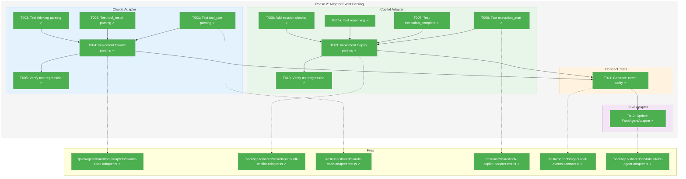
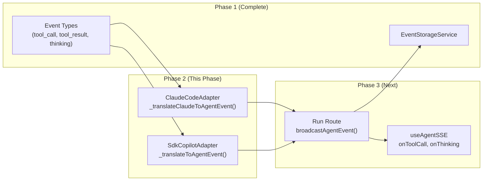
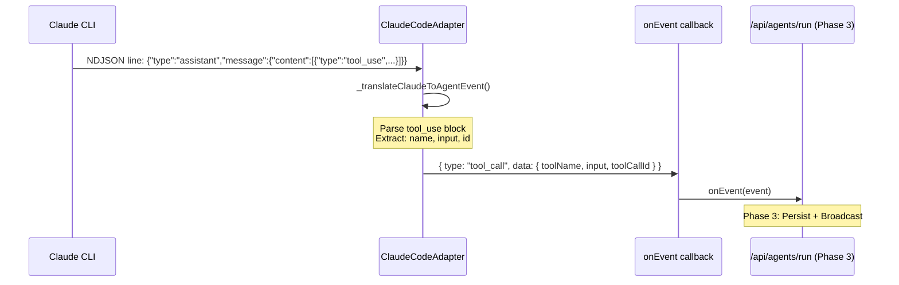
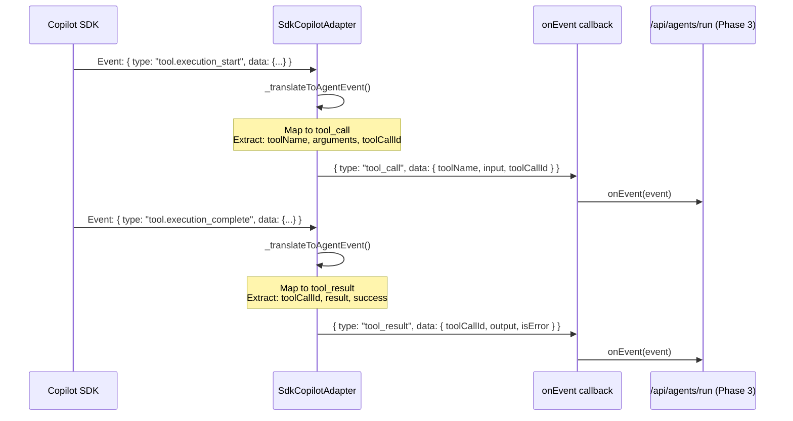

# Phase 2: Adapter Event Parsing – Tasks & Alignment Brief

**Spec**: [../../better-agents-spec.md](../../better-agents-spec.md)
**Plan**: [../../better-agents-plan.md](../../better-agents-plan.md)
**Date**: 2026-01-27
**Phase Slug**: `phase-2-adapter-event-parsing`

---

## Executive Briefing

### Purpose
This phase extends both adapters (ClaudeCodeAdapter and SdkCopilotAdapter) to parse and emit the new event types (`tool_call`, `tool_result`, `thinking`) that Phase 1 defined. Without this, tool invocations and thinking blocks remain invisible—the adapters currently filter them out, only extracting text content.

### What We're Building
Modifications to two adapter classes to emit complete event streams:

**ClaudeCodeAdapter** (`_translateClaudeToAgentEvent`):
- Parse `tool_use` content blocks → emit `tool_call` events
- Parse `tool_result` content blocks → emit `tool_result` events
- Parse `thinking` content blocks → emit `thinking` events

**SdkCopilotAdapter** (`_translateToAgentEvent`):
- Handle `tool.execution_start` → emit `tool_call` events
- Handle `tool.execution_complete` → emit `tool_result` events
- Handle `assistant.reasoning` / `assistant.reasoning_delta` → emit `thinking` events

### User Value
Users will see real-time visibility into agent tool usage and reasoning. When Claude runs `ls -la`, the UI shows "Running Bash command: ls -la" immediately, then shows the output when complete. When Claude thinks through a problem, users see the reasoning process.

### Example
**Before**: Claude runs bash command → User sees only final text response
**After**:
```
[tool_call] Bash: { command: "ls -la" }        ← Visible immediately
[tool_result] Success: "total 48\ndrwxr..."   ← Visible on completion
[text_delta] "Here are the files in..."        ← Normal text continues
```

---

## Objectives & Scope

### Objective
Implement adapter content block parsing as specified in the plan, satisfying:
- **AC1**: When Claude executes a bash command, UI displays tool card within 500ms of execution start
- **AC2**: When a tool completes, UI updates to show success/error status and output
- **AC4**: When Copilot executes a tool, the same visibility is provided
- **AC5**: When Claude emits thinking blocks, they appear as collapsible sections
- **AC7**: When Copilot emits reasoning, it appears in UI
- **AC22**: If adapters fail to parse new event types, they fall back to current behavior (no crashes)

### Goals

- ✅ ClaudeCodeAdapter parses `tool_use` content blocks → `AgentToolCallEvent`
- ✅ ClaudeCodeAdapter parses `tool_result` content blocks → `AgentToolResultEvent`
- ✅ ClaudeCodeAdapter parses `thinking` content blocks → `AgentThinkingEvent`
- ✅ SdkCopilotAdapter handles `tool.execution_start` → `AgentToolCallEvent`
- ✅ SdkCopilotAdapter handles `tool.execution_complete` → `AgentToolResultEvent`
- ✅ SdkCopilotAdapter handles `assistant.reasoning` → `AgentThinkingEvent`
- ✅ Add defensive session state checks to Copilot adapter (per Discovery 07)
- ✅ Existing text streaming continues to work (regression tests pass)
- ✅ Contract tests verify both adapters emit same event shapes

### Non-Goals (Scope Boundaries)

- ❌ SSE broadcast integration (Phase 3) — this phase only modifies adapters
- ❌ Event persistence (Phase 1 complete) — adapters emit events, storage happens in API layer
- ❌ UI components (Phase 4) — no React components in this phase
- ❌ Hook integration (Phase 3) — adapters just emit, hooks consume in next phase
- ❌ Performance optimization — focus on correctness first
- ❌ Handling unknown/future content block types — return as `raw` events
- ❌ Copilot SDK version pinning — per Discovery 04, wrap in adapter abstraction instead

---

## Architecture Map

### Component Diagram
<!-- Status: grey=pending, orange=in-progress, green=completed, red=blocked -->
<!-- Updated by plan-6 during implementation -->



### Task-to-Component Mapping

<!-- Status: ⬜ Pending | 🟧 In Progress | ✅ Complete | 🔴 Blocked -->

| Task | Component(s) | Files | Status | Comment |
|------|-------------|-------|--------|---------|
| T001 | Claude Adapter Tests | /test/unit/shared/claude-code-adapter.test.ts | ✅ Complete | TDD: Write failing test for tool_use content block parsing |
| T002 | Claude Adapter Tests | /test/unit/shared/claude-code-adapter.test.ts | ✅ Complete | TDD: Write failing test for tool_result content block parsing |
| T003 | Claude Adapter Tests | /test/unit/shared/claude-code-adapter.test.ts | ✅ Complete | TDD: Write failing test for thinking content block parsing |
| T004 | Claude Adapter | /packages/shared/src/adapters/claude-code.adapter.ts | ✅ Complete | Implement content block parsing in _translateClaudeToAgentEvent |
| T005 | Claude Adapter Tests | /test/unit/shared/claude-code-adapter.test.ts | ✅ Complete | Regression: Verify existing text streaming still works |
| T006 | Copilot Adapter Tests | /test/unit/shared/sdk-copilot-adapter.test.ts | ✅ Complete | TDD: Write failing test for tool.execution_start event |
| T007 | Copilot Adapter Tests | /test/unit/shared/sdk-copilot-adapter.test.ts | ✅ Complete | TDD: Write failing test for tool.execution_complete event |
| T007a | Copilot Adapter Tests | /test/unit/shared/sdk-copilot-adapter.test.ts | ✅ Complete | TDD: Write failing test for assistant.reasoning event |
| T008 | Copilot Adapter | /packages/shared/src/adapters/sdk-copilot-adapter.ts | ✅ Complete | Add defensive session state assertions per Discovery 07 |
| T009 | Copilot Adapter | /packages/shared/src/adapters/sdk-copilot-adapter.ts | ✅ Complete | Implement tool + reasoning event handling in _translateToAgentEvent |
| T010 | Copilot Adapter Tests | /test/unit/shared/sdk-copilot-adapter.test.ts | ✅ Complete | Regression: Verify existing text streaming still works |
| T011 | Contract Tests | /test/contracts/agent-tool-events.contract.ts | ✅ Complete | Contract: Both adapters emit same AgentToolCallEvent shape |
| T012 | Fake Adapter | /packages/shared/src/fakes/fake-agent-adapter.ts | ✅ Complete | Update FakeAgentAdapter to emit tool events for testing |

---

## Tasks

| Status | ID | Task | CS | Type | Dependencies | Absolute Path(s) | Validation | Subtasks | Notes |
|--------|-----|------|-----|------|--------------|------------------|------------|----------|-------|
| [x] | T001 | Write tests for Claude tool_use content block parsing | 2 | Test | – | /home/jak/substrate/015-better-agents/test/unit/shared/claude-code-adapter.test.ts | Tests cover: single tool, multiple tools, input shapes, toolCallId extraction | – | TDD RED phase; per Critical Discovery 03 |
| [x] | T002 | Write tests for Claude tool_result content block parsing | 2 | Test | – | /home/jak/substrate/015-better-agents/test/unit/shared/claude-code-adapter.test.ts | Tests cover: success result, error result (is_error: true), empty output | – | TDD RED phase |
| [x] | T003 | Write tests for Claude thinking content block parsing | 2 | Test | – | /home/jak/substrate/015-better-agents/test/unit/shared/claude-code-adapter.test.ts | Tests cover: thinking present, thinking with signature, absent signature | – | TDD RED phase; signature field optional |
| [x] | T004 | Implement Claude content block parsing in _translateClaudeToAgentEvent | 3 | Core | T001, T002, T003 | /home/jak/substrate/015-better-agents/packages/shared/src/adapters/claude-code.adapter.ts | All tests from T001-T003 pass; content blocks yield correct AgentEvent types | – | Per Critical Discovery 03 |
| [x] | T005 | Verify existing Claude text streaming still works | 1 | Test | T004 | /home/jak/substrate/015-better-agents/test/unit/shared/claude-code-adapter.test.ts | Existing adapter tests pass unchanged | – | Regression check |
| [x] | T006 | Write tests for Copilot tool.execution_start event | 2 | Test | – | /home/jak/substrate/015-better-agents/test/unit/shared/sdk-copilot-adapter.test.ts | Tests cover: bash tool, read tool, write tool; extracts toolName, arguments, toolCallId | – | TDD RED phase; per Critical Discovery 04 |
| [x] | T007 | Write tests for Copilot tool.execution_complete event | 2 | Test | – | /home/jak/substrate/015-better-agents/test/unit/shared/sdk-copilot-adapter.test.ts | Tests cover: success result, error (!success), result content extraction | – | TDD RED phase |
| [x] | T007a | Write tests for Copilot assistant.reasoning event | 2 | Test | – | /home/jak/substrate/015-better-agents/test/unit/shared/sdk-copilot-adapter.test.ts | Tests cover: reasoning content, reasoningId, streaming delta variant | – | TDD RED phase; per Critical Discovery 04 |
| [x] | T008 | Add defensive session state checks to Copilot adapter | 1 | Core | – | /home/jak/substrate/015-better-agents/packages/shared/src/adapters/sdk-copilot-adapter.ts | compact() asserts session not destroyed; throws if session invalid | – | Per Critical Discovery 07 |
| [x] | T009 | Implement Copilot tool + reasoning event handling in _translateToAgentEvent | 3 | Core | T006, T007, T007a, T008 | /home/jak/substrate/015-better-agents/packages/shared/src/adapters/sdk-copilot-adapter.ts | All tests from T006-T007a pass; new event types emitted correctly | – | Per Critical Discovery 04 |
| [x] | T010 | Verify existing Copilot text streaming still works | 1 | Test | T009 | /home/jak/substrate/015-better-agents/test/unit/shared/sdk-copilot-adapter.test.ts | Existing adapter tests pass unchanged | – | Regression check |
| [x] | T011 | Write contract tests for tool event parity between adapters | 2 | Test | T004, T009 | /home/jak/substrate/015-better-agents/test/contracts/agent-tool-events.contract.ts | Both adapters emit same AgentToolCallEvent/AgentToolResultEvent shape | – | DYK-05: Contract parity testing |
| [x] | T012 | Update FakeAgentAdapter to emit tool events | 2 | Core | T011 | /home/jak/substrate/015-better-agents/packages/shared/src/fakes/fake-agent-adapter.ts | Fake can simulate tool call sequences for testing | – | Test helper for Phase 3+ |

---

## Alignment Brief

### Prior Phase Review: Phase 1 Summary

**Phase 1: Event Storage Foundation** (Complete - 20/20 tasks)

#### A. Deliverables Created
| Component | Absolute Path | Description |
|-----------|--------------|-------------|
| Zod Schemas | /home/jak/substrate/015-better-agents/packages/shared/src/schemas/agent-event.schema.ts | `AgentToolCallEventSchema`, `AgentToolResultEventSchema`, `AgentThinkingEventSchema` |
| Schema Barrel | /home/jak/substrate/015-better-agents/packages/shared/src/schemas/index.ts | Exports all schemas |
| Type Extensions | /home/jak/substrate/015-better-agents/packages/shared/src/interfaces/agent-types.ts | `AgentEvent` union extended with new types |
| IEventStorage | /home/jak/substrate/015-better-agents/packages/shared/src/interfaces/event-storage.interface.ts | Interface with append, getAll, getSince, archive, exists |
| FakeEventStorage | /home/jak/substrate/015-better-agents/packages/shared/src/fakes/fake-event-storage.ts | Test fake with helpers |
| EventStorageService | /home/jak/substrate/015-better-agents/packages/shared/src/services/event-storage.service.ts | NDJSON file persistence |
| SessionId Validator | /home/jak/substrate/015-better-agents/packages/shared/src/lib/validators/session-id-validator.ts | Security: path traversal prevention |
| Events API Route | /home/jak/substrate/015-better-agents/apps/web/app/api/agents/sessions/[sessionId]/events/route.ts | GET /events, GET /events?since= |
| SSE Broadcast Schemas | /home/jak/substrate/015-better-agents/apps/web/src/lib/schemas/agent-events.schema.ts | `AgentToolCallBroadcastEventSchema` etc. with sessionId |
| Contract Tests | /home/jak/substrate/015-better-agents/test/contracts/event-storage.contract.test.ts | FakeEventStorage ↔ EventStorageService parity |

#### B. Lessons Learned
- **DYK-01**: Timestamp-based event IDs (`YYYY-MM-DDTHH:mm:ss.sssZ_<random>`) avoid race conditions and provide natural ordering
- **DYK-02**: SessionId validation is critical security measure - rejects `/`, `..`, `\`, whitespace
- **DYK-03**: Zod-first approach (define schemas, derive types via `z.infer<>`) eliminates type drift
- **DYK-04**: Silent skip for malformed NDJSON lines enables resilient recovery from corruption
- **DYK-05**: Dual-layer testing (real temp dir for storage, fake via DI for API) + contract tests ensure parity

#### C. Technical Discoveries
- SSE broadcast schemas require `sessionId` in payload per ADR-0007 single-channel routing
- Storage vs SSE schemas serve different purposes: storage (tool_call) vs broadcast (agent_tool_call)
- Event ID format matters for getSince() - must be sortable

#### D. Dependencies Exported for Phase 2
| Export | Usage in Phase 2 |
|--------|------------------|
| `AgentToolCallEvent` | Type returned from adapter `_translateClaudeToAgentEvent` |
| `AgentToolResultEvent` | Type returned from adapter `_translateClaudeToAgentEvent` |
| `AgentThinkingEvent` | Type returned from adapter `_translateClaudeToAgentEvent` |
| `AgentEvent` union | Return type of translation methods (now includes new types) |

#### E. Test Infrastructure Created
- `test/unit/shared/schemas/agent-event-schemas.test.ts` - 12 schema tests
- `test/unit/shared/event-storage-service.test.ts` - 19 storage tests
- `test/unit/shared/session-id-validator.test.ts` - 15 validator tests
- `test/unit/web/api/agent-events-route.test.ts` - 9 API route tests
- `test/contracts/event-storage.contract.test.ts` - 16 contract tests

#### F. Key Log References
- Phase 1 execution log: [../phase-1-event-storage-foundation/execution.log.md](../phase-1-event-storage-foundation/execution.log.md)
- Final test count: 2020 passed, 19 skipped, 138 files

---

### Critical Findings Affecting This Phase

**Critical Discovery 03: Claude Content Blocks Already Available**
- **Impact**: HIGH - This is the core work of Phase 2 for Claude adapter
- **Constraint**: Must parse `tool_use`, `tool_result`, `thinking` content blocks from assistant/user messages
- **What it requires**: Extend `_translateClaudeToAgentEvent()` switch/if logic
- **Addressed by**: T001-T005

**Critical Discovery 04: Copilot Uses Different Event Model**
- **Impact**: HIGH - Copilot has dedicated events, not content blocks
- **Constraint**: Must handle `tool.execution_start`, `tool.execution_complete`, `assistant.reasoning` events
- **What it requires**: Extend `_translateToAgentEvent()` switch statement with new cases
- **Addressed by**: T006-T010

**High Discovery 07: Session Destruction Race in Copilot compact()**
- **Impact**: MEDIUM - Defensive coding for robustness
- **Constraint**: compact() must NOT call run() (destroys session); must add assertion
- **What it requires**: Add `if (!this._session || this._session.destroyed)` check
- **Addressed by**: T008

**Medium Discovery 10: NDJSON Line Length Validation**
- **Impact**: LOW for Phase 2 - Parser already handles this
- **Note**: Oversized tool outputs are truncated by StreamJsonParser (1MB limit)
- **No action required** - existing behavior is acceptable

---

### ADR Decision Constraints

**ADR-0004: Dependency Injection Container Architecture**
- **Decision**: Use `useFactory` pattern, never `useClass` with decorators
- **Constraint**: Any new adapter dependencies must use factory injection
- **Phase 2 Impact**: None - adapters already use constructor DI

**ADR-0007: SSE Single-Channel Event Routing Pattern**
- **Decision**: Single global SSE channel with client-side routing by sessionId
- **Constraint**: Events broadcast must include sessionId for routing
- **Phase 2 Impact**: None - adapters only emit events; SSE broadcast is Phase 3

---

### Invariants & Guardrails

- **Event Shape Consistency**: Both adapters MUST emit identical `AgentToolCallEvent` shapes (verified by T011 contract test)
- **Backward Compatibility (AC22)**: Malformed content blocks return `null` or `raw` event, never throw
- **Text Streaming Preservation**: Existing text_delta behavior MUST NOT regress (T005, T010)
- **Signature Optional**: `thinking` event signature field is Claude-only, must be optional in schema

---

### Inputs to Read

| File | Purpose |
|------|---------|
| `/home/jak/substrate/015-better-agents/packages/shared/src/adapters/claude-code.adapter.ts:432-479` | Existing `_translateClaudeToAgentEvent()` - extend this |
| `/home/jak/substrate/015-better-agents/packages/shared/src/adapters/sdk-copilot-adapter.ts:178-241` | Existing `_translateToAgentEvent()` - extend this |
| `/home/jak/substrate/015-better-agents/packages/shared/src/schemas/agent-event.schema.ts` | Event schemas to emit |
| `/home/jak/substrate/015-better-agents/packages/shared/src/interfaces/agent-types.ts` | AgentEvent union (already extended) |
| `/home/jak/substrate/015-better-agents/test/unit/shared/claude-code-adapter.test.ts` | Existing adapter tests to extend |
| `/home/jak/substrate/015-better-agents/test/unit/shared/sdk-copilot-adapter.test.ts` | Existing adapter tests to extend |
| `/home/jak/substrate/015-better-agents/packages/shared/src/fakes/fake-agent-adapter.ts` | Fake to update |

---

### Visual Alignment Aids

#### System State Flow


#### Sequence: Claude Tool Call Event Flow


#### Sequence: Copilot Tool Event Flow


---

### Test Plan (Full TDD)

Per spec Testing Strategy: "Full TDD with targeted mocks"

#### Test Categories

| Category | Tests | Rationale |
|----------|-------|-----------|
| Claude Tool Tests | T001-T003 | Core content block parsing for Claude |
| Claude Regression | T005 | Ensure existing behavior preserved |
| Copilot Tool Tests | T006-T007a | Core event handling for Copilot |
| Copilot Regression | T010 | Ensure existing behavior preserved |
| Contract Tests | T011 | Cross-adapter event shape parity |

#### Fixtures Required

```typescript
// test/fixtures/claude-content-blocks.fixture.ts
export const CLAUDE_TOOL_USE_FIXTURE = {
  type: 'assistant',
  message: {
    content: [{
      type: 'tool_use',
      id: 'toolu_abc123',
      name: 'Bash',
      input: { command: 'ls -la' }
    }]
  }
};

export const CLAUDE_TOOL_RESULT_FIXTURE = {
  type: 'user',
  message: {
    content: [{
      type: 'tool_result',
      tool_use_id: 'toolu_abc123',
      content: 'total 48\ndrwxr-xr-x...',
      is_error: false
    }]
  }
};

export const CLAUDE_THINKING_FIXTURE = {
  type: 'assistant',
  message: {
    content: [{
      type: 'thinking',
      thinking: 'Let me analyze this step by step...',
      signature: 'sig_xyz789' // Optional
    }]
  }
};

// test/fixtures/copilot-tool-events.fixture.ts
export const COPILOT_TOOL_START_FIXTURE = {
  type: 'tool.execution_start',
  data: {
    toolName: 'bash',
    arguments: { command: 'npm test' },
    toolCallId: 'tool_xyz456'
  }
};

export const COPILOT_TOOL_COMPLETE_FIXTURE = {
  type: 'tool.execution_complete',
  data: {
    toolCallId: 'tool_xyz456',
    result: { content: 'All tests passed' },
    success: true
  }
};

export const COPILOT_REASONING_FIXTURE = {
  type: 'assistant.reasoning',
  data: {
    content: 'I need to check the test results first...',
    reasoningId: 'reason_123'
  }
};
```

#### Mock Usage Policy

**Allowed (External Boundaries)**:
- `FakeProcessManager` for Claude CLI spawning (already established)
- `FakeCopilotClient` / `FakeCopilotSession` for Copilot SDK (already established)
- `vi.fn()` for onEvent callback verification

**Not Allowed (Internal Code)**:
- NO `vi.mock()` to replace adapter internal methods
- NO mocking `_translateClaudeToAgentEvent` or `_translateToAgentEvent`
- Use real adapter with fake external dependencies

---

### Step-by-Step Implementation Outline

1. **Claude Tool Tests (T001-T003)** - TDD RED
   - Create test describe block for tool event parsing
   - Write failing tests using FakeProcessManager with NDJSON fixtures
   - Verify tests fail because `_translateClaudeToAgentEvent` doesn't handle tool_use/tool_result/thinking

2. **Claude Implementation (T004)** - TDD GREEN
   - Extend `_translateClaudeToAgentEvent()` switch/if logic
   - Add cases for `tool_use`, `tool_result`, `thinking` content blocks
   - Map to `AgentToolCallEvent`, `AgentToolResultEvent`, `AgentThinkingEvent`
   - Return `null` for malformed blocks (AC22 backward compatibility)

3. **Claude Regression (T005)** - Verify
   - Run all existing claude-code-adapter.test.ts tests
   - Confirm text_delta and message events still work

4. **Copilot Tool Tests (T006-T007a)** - TDD RED
   - Create test describe block for tool event parsing
   - Write failing tests using FakeCopilotSession with event fixtures
   - Verify tests fail because `_translateToAgentEvent` doesn't handle tool/reasoning events

5. **Copilot Session Check (T008)**
   - Add defensive assertion to `compact()` method
   - Throw clear error if session destroyed

6. **Copilot Implementation (T009)** - TDD GREEN
   - Extend `_translateToAgentEvent()` switch statement
   - Add cases for `tool.execution_start`, `tool.execution_complete`, `assistant.reasoning`, `assistant.reasoning_delta`
   - Map to appropriate AgentEvent types

7. **Copilot Regression (T010)** - Verify
   - Run all existing sdk-copilot-adapter.test.ts tests
   - Confirm text_delta, message, usage events still work

8. **Contract Tests (T011)**
   - Create contract test file
   - Define test that runs same tool call scenario through both adapters
   - Assert both emit same AgentToolCallEvent shape

9. **Fake Adapter Update (T012)**
   - Add `emitToolCall()`, `emitToolResult()`, `emitThinking()` methods to FakeAgentAdapter
   - Enable Phase 3 tests to simulate tool events

---

### Commands to Run

```bash
# Test Phase 2 changes
pnpm test test/unit/shared/claude-code-adapter.test.ts
pnpm test test/unit/shared/sdk-copilot-adapter.test.ts
pnpm test test/contracts/agent-tool-events.contract.ts

# Full test suite (should still pass)
just test

# Type check (should pass)
just typecheck

# Lint (should pass)
just lint
```

---

### Risks & Unknowns

| Risk | Severity | Mitigation |
|------|----------|------------|
| Claude CLI format change | HIGH | Parse defensively, return `raw` event for unknown formats |
| Copilot SDK API change | MEDIUM | SDK in technical preview; wrap in adapter abstraction, version-pin if needed |
| Breaking existing text streaming | HIGH | T005, T010 regression tests; run full suite before merge |
| Mixed content blocks not ordered correctly | LOW | Process content array in order; each block yields separate event |
| Thinking signature validation | LOW | Signature is optional; don't validate cryptographically |

---

### Ready Check

- [x] Phase 1 deliverables reviewed and understood
- [x] Critical Discoveries 03, 04, 07 documented and mapped to tasks
- [x] ADR-0004 and ADR-0007 constraints acknowledged (minimal impact this phase)
- [x] Test fixtures designed for Claude content blocks and Copilot events
- [x] Regression test strategy defined (T005, T010)
- [x] Contract test approach agreed (T011)
- [x] Mock usage policy clear (use existing fakes, no vi.mock on internals)

**✅ Phase 2 Complete** — All 12 tasks implemented, 35 new tests passing, all quality gates green.

---

## Phase Footnote Stubs

_To be populated by plan-6 during implementation with `[^N]` tags._

| Footnote | Description | Plan Section Reference |
|----------|-------------|----------------------|
| | | |

---

## Evidence Artifacts

**Execution Log**: `./execution.log.md` (created by plan-6)

**Directory Layout**:
```
docs/plans/015-better-agents/
  ├── better-agents-plan.md
  ├── better-agents-spec.md
  └── tasks/
      ├── phase-1-event-storage-foundation/
      │   ├── tasks.md
      │   └── execution.log.md
      └── phase-2-adapter-event-parsing/
          ├── tasks.md          ← This file
          └── execution.log.md  # Created by plan-6
```

---

## Discoveries & Learnings

_Populated during implementation by plan-6. Log anything of interest to your future self._

| Date | Task | Type | Discovery | Resolution | References |
|------|------|------|-----------|------------|------------|
| | | | | | |

**Types**: `gotcha` | `research-needed` | `unexpected-behavior` | `workaround` | `decision` | `debt` | `insight`

**What to log**:
- Things that didn't work as expected
- External research that was required
- Implementation troubles and how they were resolved
- Gotchas and edge cases discovered
- Decisions made during implementation
- Technical debt introduced (and why)
- Insights that future phases should know about

_See also: `execution.log.md` for detailed narrative._

---

## Critical Insights Discussion

**Session**: 2026-01-27
**Context**: Phase 2 Tasks File Pre-Implementation Review
**Analyst**: AI Clarity Agent
**Reviewer**: Development Team
**Format**: Water Cooler Conversation (5 Critical Insights)

### Insight 1: Claude Content Block Parsing Strategy

**Did you know**: The Claude adapter uses inline if-chain filtering while Copilot uses switch-case dispatch, creating an inconsistency - but output event shapes matter more than internal patterns.

**Implications**:
- Adding tool_use/tool_result/thinking handlers could follow either pattern
- The switch pattern is more maintainable but requires larger refactoring
- Output event shapes are already unified via Phase 1 schemas

**Options Considered**:
- Option A: Inline filtering - Add new if-blocks alongside existing text filtering
- Option B: Refactor to switch pattern - Align with SdkCopilotAdapter structure
- Option C: Visitor pattern - Maximum extensibility (over-engineered for scope)

**AI Recommendation**: Option A - Inline filtering
- Reasoning: Minimal risk, output shapes matter not internal implementation

**Discussion Summary**:
User confirmed that since both adapters output identical event shapes with internal translation, the parsing pattern is less important than delivery risk.

**Decision**: Option A - Inline filtering for Claude content block parsing

**Action Items**: None - guides T001-T004 implementation approach

**Affects**: T001, T002, T003, T004

---

### Insight 2: Copilot SDK Has Four Tool/Reasoning Events

**Did you know**: The Copilot SDK emits 4 distinct events (`tool.execution_start`, `tool.execution_complete`, `assistant.reasoning`, `assistant.reasoning_delta`) but tasks only explicitly mention 3.

**Implications**:
- T007a should cover both reasoning variants (complete + streaming delta)
- `reasoning_delta` follows same pattern as existing `message_delta` → `text_delta`
- `toolCallId` correlation is critical for UI to match start/complete pairs

**Options Considered**:
- Option A: Handle all 4 events in existing switch statement
- Option B: Group by category with helper methods (_handleToolEvent, _handleReasoningEvent)

**AI Recommendation**: Option A - Add 4 cases to switch
- Reasoning: Switch remains readable at 9 cases; consistent with established pattern

**Discussion Summary**:
User confirmed Option A. Clarified that `reasoning_delta` should emit separate events (like `text_delta`), not accumulate.

**Decision**: Option A - Add all 4 event cases to existing switch statement

**Action Items**:
- [ ] T007a tests must cover both `assistant.reasoning` AND `assistant.reasoning_delta`
- [ ] Follow `message_delta` → `text_delta` pattern (emit separate events)

**Affects**: T006, T007, T007a, T009

---

### Insight 3: Contract Tests Verify Schema Compliance

**Did you know**: T011 has a timing consideration - it verifies adapter parity but depends on T004/T009 completing first. The solution is the factory pattern from event-storage.contract.test.ts.

**Implications**:
- Contract tests should use factory pattern to run identical scenarios through both adapters
- Shared fixtures enable consistent test data across adapter tests
- True parity verification catches drift between adapters

**Options Considered**:
- Option A: Shared fixture factory - Both tests import same fixtures
- Option B: Dedicated contract test file - Factory pattern like event-storage.contract.test.ts
- Option C: Property-based testing - No infrastructure exists

**AI Recommendation**: Option B - Dedicated contract test file
- Reasoning: Proven pattern exists; provides true parity verification

**Discussion Summary**:
User confirmed Option B for real parity verification.

**Decision**: Option B - Dedicated contract test file following event-storage pattern

**Action Items**:
- [ ] T011 creates `test/contracts/agent-tool-events.contract.test.ts`
- [ ] Uses `agentAdapterToolEventsContractTests(name, createAdapter)` factory

**Affects**: T011

---

### Insight 4: Session Destruction Guard Scope

**Did you know**: Discovery 07 (session destruction race) is about caller misuse, not internal bugs. The architecture already mitigates the main risk via fresh sessions per method call.

**Implications**:
- Real SDK doesn't expose `destroyed` property (FakeCopilotSession does internally)
- Each adapter method gets fresh session via `resumeSession()`
- Simple assertion matches T008's CS-1 (trivial) scope

**Options Considered**:
- Option A: Simple assertion at compact() start
- Option B: State tracking with lifecycle enum
- Option C: SessionGuard wrapper class (over-engineered)

**AI Recommendation**: Option A - Simple assertion
- Reasoning: Matches CS-1 scope; architecture already mitigates main risk

**Discussion Summary**:
User confirmed Option A. State tracking enum noted as potential future hardening (out of Phase 2 scope).

**Decision**: Option A - Simple assertion at compact() start

**Action Items**:
- [ ] T008 adds session null check assertion

**Affects**: T008

---

### Insight 5: AC22 Backward Compatibility Built-In

**Did you know**: The adapter architecture already guarantees AC22 compliance (no crashes on unknown events) through JSON try-catch, 'raw' fallback, and content block filtering.

**Implications**:
- Adding new block handlers is purely additive
- Existing text extraction is isolated by filter pattern
- Unknown blocks are already ignored (don't crash)
- Regression tests (T005, T010) verify no breakage

**Options Considered**:
- Option A: Additive code paths only - Never modify existing text extraction
- Option B: Wrap new parsing in try-catch - Redundant given existing safety
- Option C: Feature flags - No infrastructure exists

**AI Recommendation**: Option A - Additive code paths only
- Reasoning: Architecture already provides AC22; just add parallel paths

**Discussion Summary**:
User confirmed Option A. Trust existing fallback mechanisms.

**Decision**: Option A - Additive code paths only, never modify existing text extraction

**Action Items**: None - constraint on implementation approach

**Affects**: T004, T009

---

## Session Summary

**Insights Surfaced**: 5 critical insights identified and discussed
**Decisions Made**: 5 decisions reached through collaborative discussion
**Action Items Created**: 5 follow-up items identified
**Areas Requiring Updates**: None - decisions guide implementation, no plan changes needed

**Shared Understanding Achieved**: ✓

**Confidence Level**: High - Key patterns verified against codebase; architecture supports all decisions

**Next Steps**:
- Ready to proceed with `/plan-6-implement-phase --phase "Phase 2: Adapter Event Parsing"`
- T007a scope expanded to cover both reasoning event variants

**Notes**:
- Both adapters translate provider-specific formats to unified AgentEvent shapes
- Contract test pattern from Phase 1 directly applicable
- AC22 backward compatibility is architectural, not code-level
