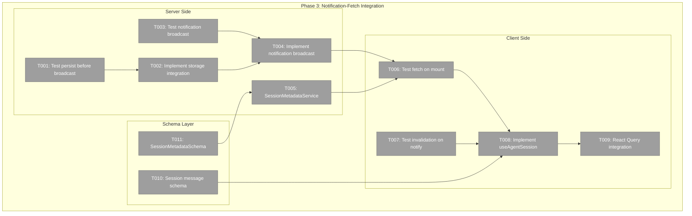
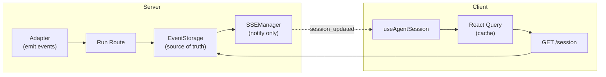
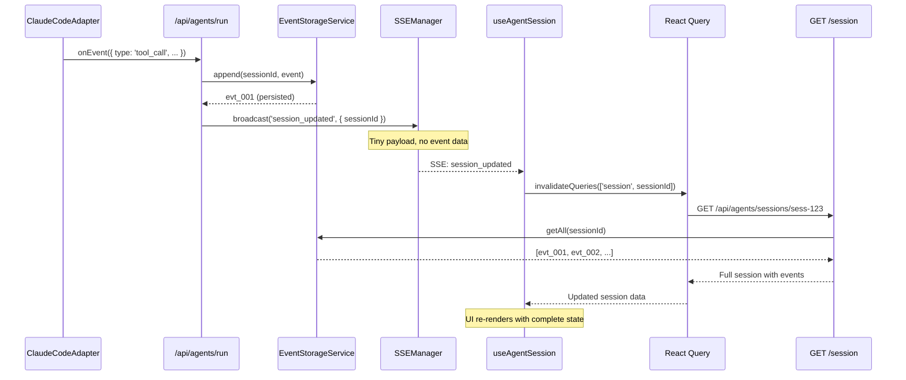
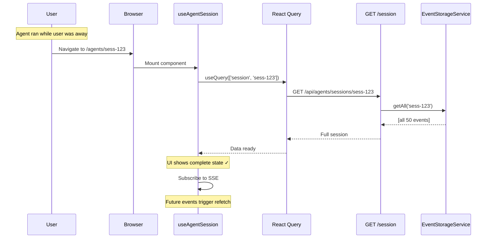

# Phase 3: SSE Notification-Fetch Integration – Tasks & Alignment Brief

**Spec**: [../../better-agents-spec.md](../../better-agents-spec.md)
**Plan**: [../../better-agents-plan.md](../../better-agents-plan.md)
**Date**: 2026-01-27 (Refactored)
**Phase Slug**: `phase-3-sse-broadcast-integration`

---

## Executive Briefing

### Purpose
This phase implements a **notification-fetch architecture** for real-time agent events. Instead of streaming full event payloads via SSE, we use SSE as a lightweight notification channel that triggers REST fetches. This design is resilient to page navigation, browser refresh, and tab backgrounding—users can leave the agent page and return to find complete state.

### Architecture Decision: Notification-Fetch vs Full-Payload SSE

**Why Notification-Fetch?**

The original plan used full-payload SSE (events contain complete data). This fails when:
1. User starts agent on `/agents/new`, navigates to `/dashboard`
2. Agent emits 50 tool_call events while user is away
3. User refreshes browser (SSE connection lost)
4. User returns to `/agents/sess-123` → **UI shows empty/stale state**

**Notification-Fetch Pattern:**
```
┌─────────────┐                              ┌─────────────┐
│   Server    │                              │   Client    │
├─────────────┤                              ├─────────────┤
│ Agent runs  │                              │ On mount:   │
│ ↓           │                              │ GET /session│
│ Persist to  │◄────────────────────────────►│ (full state)│
│ storage     │                              │             │
│ ↓           │     SSE: {sessionId}         │ While open: │
│ Broadcast   │─────────────────────────────►│ invalidate  │
│ "updated"   │                              │ → refetch   │
└─────────────┘                              └─────────────┘
```

**Key Insight (from ADR-0007 IMP-003):**
> "API response fallback checks if session is still 'running' after API returns. If SSE didn't complete it, the response body provides the final state."

The ADR already acknowledges SSE isn't reliable—we're making the fallback the **primary** pattern.

**Critical: Server-Side Storage, Not localStorage**

The existing `useAgentSession` hook uses `AgentSessionStore` which persists to **localStorage**. This won't work cross-browser or cross-machine.

Instead, we use Phase 1's `EventStorageService` which writes to **server-side NDJSON files** at `.chainglass/workspaces/<slug>/data/`. This enables:
- Same session viewable from any browser
- Same session viewable from any machine
- True persistence independent of browser state

### What We're Building

**1. Notification Broadcast (`/api/agents/run`):**
- Persist events to storage FIRST (source of truth)
- Broadcast tiny notifications: `{ type: 'session_updated', sessionId }`
- No full event payloads in SSE

**2. Session State Hook (`useAgentSession`):**
- Fetch full session state on mount via REST
- Subscribe to SSE notifications
- On `session_updated` → invalidate React Query → refetch

**3. Event Fetch Endpoint:**
- `GET /api/agents/sessions/:id` returns full session with events
- Already exists from Phase 1; may need enhancement

### User Value
- **Resilience**: Leave page, refresh, return → state is complete
- **Cross-browser**: Open same session in Chrome and Firefox → same state
- **Cross-machine**: Start on laptop, continue on desktop → same state
- **Simplicity**: React Query handles caching, refetching, stale-while-revalidate
- **Correctness**: Server-side storage is truth; SSE is optimization
- **Reference Implementation**: This is the canonical pattern for Chainglass real-time features

### Example
```
User Journey:
1. Start agent task → POST /api/agents/run
2. Navigate to /dashboard (agent runs in background)
3. Agent emits 50 events → persisted to storage
4. User refreshes browser (SSE gone, irrelevant)
5. User returns to /agents/sess-123
6. Hook mounts → GET /api/agents/sessions/sess-123
7. UI shows all 50 events from storage ✓
8. SSE connects → future updates trigger refetch
```

---

## Objectives & Scope

### Objective
Implement notification-fetch pattern for agent events, satisfying:
- **AC8**: Tool execution status visible in real-time (via refetch on notification)
- **AC17**: Events persisted to storage as NDJSON files
- **AC18**: Page refresh reloads session events from server (no data loss)
- **AC19**: `GET /events?since=<id>` returns events after specified ID

### Goals

- ✅ Persist all tool_call, tool_result, thinking events to storage
- ✅ Broadcast lightweight `session_updated` notifications via SSE
- ✅ Hook fetches full session state on mount
- ✅ Hook invalidates + refetches on SSE notification
- ✅ React Query integration for caching/stale-while-revalidate
- ✅ Extend session schema with `contentType` field
- ✅ Existing text streaming continues to work

### Non-Goals (Scope Boundaries)

- ❌ UI components (Phase 4) — no React components in this phase
- ❌ Full event payloads in SSE — notification only
- ❌ Complex state management in hooks — React Query handles it
- ❌ WebSocket alternative (per ADR-0007)
- ❌ Event compression or batching

---

## Architecture Map

### Component Diagram



### Task-to-Component Mapping

| Task | Component(s) | Files | Status |
|------|-------------|-------|--------|
| T001 | Storage Integration Tests | /test/unit/web/api/agents-run-route.test.ts | ⬜ Pending |
| T002 | Storage Integration | /apps/web/app/api/agents/run/route.ts | ⬜ Pending |
| T003 | Notification Tests | /test/unit/web/api/agents-run-route.test.ts | ⬜ Pending |
| T004 | Notification Broadcast | /apps/web/app/api/agents/run/route.ts | ⬜ Pending |
| T005 | SessionMetadataService | /packages/shared/src/services/session-metadata.service.ts | ⬜ Pending |
| T006 | Hook Fetch Tests | /test/unit/web/hooks/useAgentSession.test.ts | ⬜ Pending |
| T007 | Hook Invalidation Tests | /test/unit/web/hooks/useAgentSession.test.ts | ⬜ Pending |
| T008 | useAgentSession Hook | /apps/web/src/hooks/useAgentSession.ts | ⬜ Pending |
| T009 | React Query Setup | /apps/web/src/hooks/useAgentSession.ts | ⬜ Pending |
| T010 | Session Schema | /apps/web/src/lib/schemas/agent-session.schema.ts | ⬜ Pending |
| T011 | SessionMetadataSchema | /packages/shared/src/schemas/session-metadata.schema.ts | ⬜ Pending |

---

## Server-Side Data Model (Finalized)

**Workshop**: [server-side-data.md](./server-side-data.md) | **Date**: 2026-01-27

### Storage Structure

```
.chainglass/workspaces/default/sessions/
  sess-123/
    metadata.json     # Identity, config, current status
    events.ndjson     # Append-only event stream
```

### SessionMetadata (metadata.json)

```typescript
interface SessionMetadata {
  id: string;                    // "sess-1738123456-abc123"
  name: string;
  agentType: 'claude-code' | 'copilot';
  agentSessionId?: string;       // For agent resume capability
  status: 'idle' | 'running' | 'waiting_input' | 'completed' | 'error' | 'archived';
  createdAt: string;             // ISO timestamp
  updatedAt: string;             // ISO timestamp
  contextUsage?: number;         // 0-100%
  tokensUsed?: number;
  error?: { message: string; code?: string; };
}
```

### Events (events.ndjson)

**Decision**: Store ALL events, filter in code

- `text_delta` - incremental text chunks → store as-is
- `session_status` - status changes → update metadata.json
- `usage_update` - token/context usage → update metadata.json
- `error` - error info → update metadata.json
- `tool_call` - tool invocation → store
- `tool_result` - tool response → store
- `thinking` - reasoning display → store

**Text streaming**: Store every delta, client reconstructs text. No compaction on write.

**Lifecycle events**: Status lives in metadata only, not as events.

### API Endpoints

| Method | Endpoint | Purpose |
|--------|----------|---------|
| `GET` | `/api/agents/sessions` | List sessions (metadata only) |
| `GET` | `/api/agents/sessions/:id` | Get session metadata |
| `GET` | `/api/agents/sessions/:id/events` | Get all events (NDJSON) |
| `GET` | `/api/agents/sessions/:id/events?since=X` | Events after ID (polling) |
| `POST` | `/api/agents/sessions` | Create session |
| `PATCH` | `/api/agents/sessions/:id` | Update metadata (status, name) |

### SSE Notification Format

```typescript
// Tiny notification - just hints that something changed
{ type: 'session_updated', sessionId: 'sess-123' }
```

Client receives → invalidates React Query → refetches via REST

### Design Decisions Summary

| Q# | Question | Decision |
|----|----------|----------|
| Q1 | Session structure | Hybrid: metadata.json + events.ndjson |
| Q2 | Metadata fields | Minimal (id, name, agentType, status, timestamps, contextUsage, error) |
| Q3 | Which events | Store ALL, filter in code |
| Q4 | Text streaming | Store every delta, client reconstructs |
| Q5 | Lifecycle events | Status in metadata only |

---

## Tasks

| Status | ID | Task | CS | Type | Dependencies | Absolute Path(s) | Validation | Notes |
|--------|-----|------|-----|------|--------------|------------------|------------|-------|
| [ ] | T001 | Write tests for event persistence before broadcast | 2 | Test | – | /home/jak/substrate/015-better-agents/test/unit/web/api/agents-run-route.test.ts | Tests verify EventStorageService.append() called BEFORE sseManager.broadcast() | TDD RED |
| [ ] | T002 | Integrate EventStorageService with run route | 3 | Core | T001 | /home/jak/substrate/015-better-agents/apps/web/app/api/agents/run/route.ts | Events persisted via append(); on failure: log warning, continue (DYK-06) | Storage is source of truth |
| [ ] | T003 | Write tests for notification broadcast format | 2 | Test | – | /home/jak/substrate/015-better-agents/test/unit/web/api/agents-run-route.test.ts | Tests verify SSE payload is `{ type: 'session_updated', sessionId }` only | Tiny payload, no event data |
| [ ] | T004 | Implement lightweight notification broadcast | 2 | Core | T002, T003 | /home/jak/substrate/015-better-agents/apps/web/app/api/agents/run/route.ts | Broadcast `session_updated` after storage; no full event payload | Per ADR-0007 pattern |
| [ ] | T005 | Create SessionMetadataService for metadata.json persistence | 3 | Core | – | /home/jak/substrate/015-better-agents/packages/shared/src/services/session-metadata.service.ts | Service creates/reads/updates metadata.json per session; Zod schema validation | New service per workshop |
| [ ] | T006 | Write tests for session fetch on hook mount | 2 | Test | T005 | /home/jak/substrate/015-better-agents/test/unit/web/hooks/useAgentSession.test.ts | Tests verify GET /api/agents/sessions/:id called on mount | React Query useQuery |
| [ ] | T007 | Write tests for invalidation on SSE notification | 3 | Test | – | /home/jak/substrate/015-better-agents/test/unit/web/hooks/useAgentSession.test.ts | Tests verify queryClient.invalidateQueries called on session_updated | Triggers refetch |
| [ ] | T008 | Implement useAgentSession with notification subscription | 3 | Core | T006, T007 | /home/jak/substrate/015-better-agents/apps/web/src/hooks/useAgentSession.ts | Hook returns session data; refetches on SSE notification | Combines useQuery + useAgentSSE |
| [ ] | T009 | Configure React Query for session fetching | 2 | Core | T008 | /home/jak/substrate/015-better-agents/apps/web/src/hooks/useAgentSession.ts | staleTime, gcTime configured; optimistic updates work | May need QueryClientProvider |
| [ ] | T010 | Extend agent session message schema with contentType | 2 | Core | – | /home/jak/substrate/015-better-agents/apps/web/src/lib/schemas/agent-session.schema.ts | Schema validates contentType; use `.optional().default('text')` (DYK-08) | Backward compat |
| [ ] | T011 | Create SessionMetadataSchema (Zod) | 2 | Core | – | /home/jak/substrate/015-better-agents/packages/shared/src/schemas/session-metadata.schema.ts | Schema per workshop: id, name, agentType, status, timestamps, contextUsage, error | New schema |

---

## Alignment Brief

### Prior Phases Review

#### Phase 1: Event Storage Foundation (Complete)
| Export | Usage in Phase 3 |
|--------|------------------|
| `EventStorageService` | Inject into run route, call `append()` |
| `GET /api/agents/sessions/:id/events` | Hook fetches full session via this |
| `AgentToolCallBroadcastEventSchema` | NOT USED (no full payloads) |

**Key Change**: Broadcast schemas from Phase 1 are NOT used for SSE. We only broadcast `session_updated` notifications. The schemas may still be useful for the GET endpoint response format.

#### Phase 2: Adapter Event Parsing (Complete)
| Export | Usage in Phase 3 |
|--------|------------------|
| Adapter `onEvent` callback | Receives events to persist & notify |
| `FakeAgentAdapter.emitToolCall()` | Simulate events in tests |

### Critical Findings Affecting This Phase

**Critical Discovery 01: Event-Sourced Storage Required Before Adapters**
- **Original Impact**: Events must persist BEFORE SSE broadcast
- **New Impact**: Events must persist BEFORE notification broadcast
- **Storage is truth**: If persist fails, don't broadcast (or log + broadcast per DYK-06)
- **Addressed by**: T001, T002

**ADR-0007 IMP-003: API Response Fallback**
- **Quote**: "If SSE didn't complete it, the response body provides the final state"
- **Implication**: ADR already acknowledges SSE unreliability
- **New Approach**: Make fetch the PRIMARY, SSE the hint
- **Addressed by**: T005, T007

**DYK Session Decisions (2026-01-27)**
- **DYK-06**: On append() failure, log warning, continue with broadcast
- **DYK-07**: Event deduplication via seenIds (less critical now—React Query handles)
- **DYK-08**: Use `.optional().default('text')` for contentType backward compat

### Invariants & Guardrails

- **Server-Side Storage is Truth**: All state recoverable from EventStorageService (NDJSON files on disk)
- **NOT localStorage**: Don't use AgentSessionStore for session state—it's browser-local
- **SSE is Hint**: Notifications trigger refetch, not state updates
- **Idempotent Fetches**: Multiple fetches return same data
- **Cross-Device**: Same sessionId works from any browser/machine
- **Backward Compat**: Sessions without contentType field work

---

## Visual Alignment Aids

### System State Flow (Notification-Fetch)



### Sequence: Tool Call with Notification-Fetch



### Sequence: Page Refresh Recovery



---

## Test Plan

### Test Categories

| Category | Tests | Rationale |
|----------|-------|-----------|
| Storage Tests | T001 | Verify persist before broadcast |
| Notification Tests | T003 | Verify tiny payload format |
| Fetch Tests | T005 | Verify mount triggers fetch |
| Invalidation Tests | T006 | Verify SSE triggers refetch |

### Mock Usage Policy

| Test Target | Approach | Rationale |
|-------------|----------|-----------|
| Storage integration (T001-T002) | FakeEventStorage via DI | Verify append() called |
| Notification broadcast (T003-T004) | Mock SSEManager | Verify payload format |
| SessionMetadataService (T005) | In-memory storage | Unit test CRUD operations |
| useAgentSession (T006-T008) | Mock fetch + MockEventSource | Test hook logic |
| React Query (T009) | QueryClientProvider wrapper | Test cache behavior |

---

## Step-by-Step Implementation Outline

1. **SessionMetadataSchema (T011)** - Schema first
   - Define Zod schema per workshop: id, name, agentType, status, timestamps, etc.
   - Export SessionMetadata TypeScript type

2. **SessionMetadataService (T005)**
   - CRUD for metadata.json files
   - Uses SessionMetadataSchema for validation
   - Parallel to EventStorageService pattern

3. **Storage Integration Tests (T001)** - TDD RED
   - Test that EventStorageService.append() is called
   - Test that append() completes BEFORE broadcast()

4. **Storage Integration (T002)** - TDD GREEN
   - Resolve EventStorageService from DI
   - Call append() for tool_call, tool_result, thinking events
   - Wrap in try-catch, log on failure, continue (DYK-06)

5. **Notification Tests (T003)** - TDD RED
   - Test that broadcast payload is `{ type: 'session_updated', sessionId }`
   - Test that NO event data is in payload

6. **Notification Broadcast (T004)** - TDD GREEN
   - Replace full-payload broadcasts with notification
   - Single event type: `session_updated`

7. **Fetch Tests (T006)** - TDD RED
   - Test that GET called on hook mount
   - Test that data is returned from query

8. **Invalidation Tests (T007)** - TDD RED
   - Test that SSE `session_updated` calls invalidateQueries
   - Test that query refetches after invalidation

9. **useAgentSession Hook (T008)** - TDD GREEN
   - Combine useQuery for data fetching
   - Subscribe to useAgentSSE for notifications
   - On notification: invalidateQueries

10. **React Query Config (T009)**
    - Set appropriate staleTime (maybe 0 for real-time)
    - Configure gcTime for session lifecycle

11. **Schema Extension (T010)**
    - Add contentType field with `.optional().default('text')`

---

## Commands to Run

```bash
# Test Phase 3 changes
pnpm test test/unit/web/api/agents-run-route.test.ts
pnpm test test/unit/web/hooks/useAgentSession.test.ts

# Full test suite (should still pass)
just test

# Type check
just typecheck

# Dev server
just dev
```

---

## Risks & Unknowns

| Risk | Severity | Mitigation |
|------|----------|------------|
| React Query not set up in app | MEDIUM | Check for QueryClientProvider; add if needed |
| Notification batching (rapid events) | LOW | SSE naturally coalesces; React Query dedupes fetches |
| Storage append() failure | LOW | DYK-06: Log warning, continue with notify |
| Existing SSE hook patterns | MEDIUM | May need to modify useAgentSSE or create new hook |
| Multiple tabs race condition | LOW | React Query handles; each tab fetches independently |

---

## Migration Notes

This refactored approach differs significantly from the original tasks.md:

| Original | Refactored |
|----------|------------|
| Full event payloads via SSE | Notification-only SSE |
| Complex hook state management | React Query manages state |
| Dedup via seenIds Set | React Query handles dedup |
| 14 tasks | 11 tasks |
| Hook callbacks per event type | Single onSessionUpdated → refetch |
| localStorage persistence | Server-side NDJSON + metadata.json |
| Browser-local state | Cross-browser, cross-machine state |
| No session metadata | SessionMetadataService + schema |

**Why 11 tasks now?**
- Added T005: SessionMetadataService (new from workshop)
- Added T011: SessionMetadataSchema (new from workshop)
- Still simpler than original 14 (no complex callbacks, no dedup logic)

**Why server-side storage?**
The existing `useAgentSession` + `AgentSessionStore` pattern uses localStorage which:
- ❌ Lost when clearing browser data
- ❌ Not accessible from other browsers
- ❌ Not accessible from other machines
- ❌ Limited storage size (~5MB)

Server-side `EventStorageService` provides:
- ✅ Persists independent of browser
- ✅ Accessible from any browser
- ✅ Accessible from any machine
- ✅ No storage limits (disk space)
- ✅ Can be backed up, migrated, shared

---

## Ready Check

- [ ] Understand notification-fetch pattern (SSE = hint, REST = truth)
- [ ] React Query available in app (or add QueryClientProvider)
- [ ] Phase 1 EventStorageService ready for DI
- [ ] Phase 1 GET /sessions/:id endpoint returns full session
- [ ] DYK-06, DYK-08 decisions understood

**AWAITING HUMAN GO**

---

## Discoveries & Learnings

| Date | Task | Type | Discovery | Resolution | References |
|------|------|------|-----------|------------|------------|
| 2026-01-27 | – | decision | Notification-fetch > full-payload SSE | Storage is truth, SSE is hint | ADR-0007 IMP-003 |
| 2026-01-27 | – | decision | DYK-06: Log on append failure, continue | UX > strict consistency | DYK session |
| 2026-01-27 | – | decision | DYK-08: contentType `.optional().default('text')` | Backward compat | DYK session |
| 2026-01-27 | – | decision | Server-side storage, NOT localStorage | Cross-browser, cross-machine support | User requirement |
| 2026-01-27 | – | insight | Existing agents page doesn't use useAgentSession | useAgentSession uses localStorage; we use EventStorageService | Codebase exploration |

---

## Reference Implementation Note

**This phase establishes the canonical pattern for real-time features in Chainglass.**

Future features should follow this notification-fetch architecture:
1. **Persist to server-side storage FIRST** (source of truth)
2. **Broadcast tiny SSE notification** (just IDs, no payload)
3. **Client fetches via REST** on mount and on notification
4. **React Query manages caching** and stale-while-revalidate

Benefits:
- Works across page refresh, browser restart, machine changes
- Simple mental model: "storage is truth, SSE is hint"
- Leverages React Query's battle-tested caching
- Naturally handles concurrent viewers of same session
