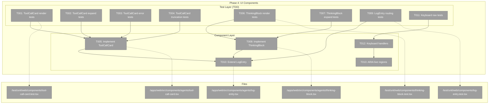
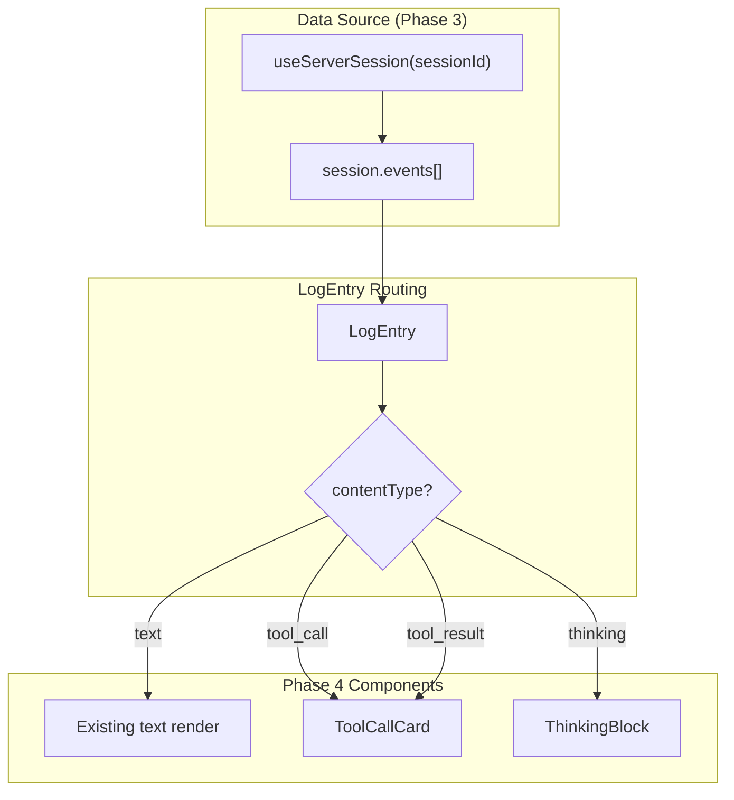
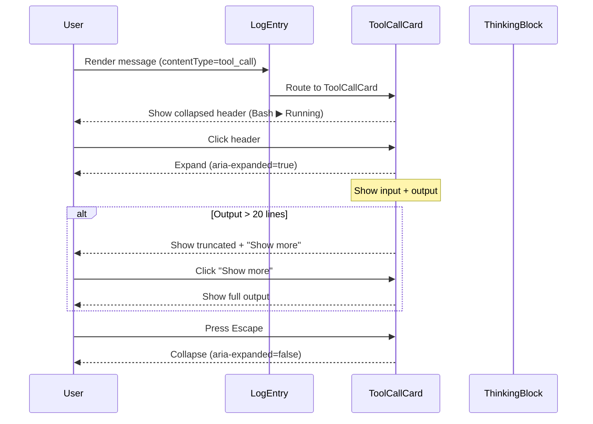

# Phase 4: UI Components – Tasks & Alignment Brief

**Spec**: [../../better-agents-spec.md](../../better-agents-spec.md)
**Plan**: [../../better-agents-plan.md](../../better-agents-plan.md)
**Date**: 2026-01-27
**Phase Slug**: `phase-4-ui-components`

---

## ⚠️ EXISTING CODE CONTEXT – READ FIRST

**This phase EXTENDS existing working functionality, not greenfield.**

### What Already Exists

| Component | Location | Status | Phase 4 Relationship |
|-----------|----------|--------|---------------------|
| **Agents Page** | `app/(dashboard)/agents/page.tsx` | ✅ Working | Renders sessions, uses LogEntry for messages |
| **LogEntry (exported)** | `src/components/agents/log-entry.tsx` | ✅ Working | Handles user/assistant/system – **WE EXTEND THIS** |
| **LogEntry (local)** | `agent-session-dialog.tsx:109-221` | ✅ Working | **HAS TOOL RENDERING** – extract patterns from here |
| **AgentSessionDialog** | `src/components/agents/agent-session-dialog.tsx` | ✅ Working | Full dialog with tool calls, expand/collapse, status |
| **useAgentSSE hook** | `src/hooks/useAgentSSE.ts` | ✅ Working | SSE streaming for real-time updates |
| **useServerSession hook** | `src/hooks/useServerSession.ts` | ✅ Working (Phase 3) | Server-backed session fetch – components should support this |

### Key Insight: Reference Implementation Exists

**The `agent-session-dialog.tsx` file (lines 109-221) already has working tool call rendering:**
- Expandable tool output with chevron toggle
- Status indicators (running/complete/failed) with colored dots
- Terminal-style output display (`<pre>` with zinc-950 bg)
- Streaming animation for running state

**Phase 4 extracts and promotes this into reusable components**, not builds from scratch.

### Integration Approach

```
EXISTING                          PHASE 4 ADDS
────────                          ────────────
agents/page.tsx                   (uses LogEntry)
    │                                  │
    ▼                                  ▼
LogEntry (exported)         →    LogEntry + contentType routing
    │                                  │
    └── user/assistant/system          ├── tool_call → ToolCallCard (NEW)
                                       ├── tool_result → ToolCallCard (NEW)
                                       ├── thinking → ThinkingBlock (NEW)
                                       └── text → existing render

agent-session-dialog.tsx         →    Imports ToolCallCard, ThinkingBlock
    │                                  (removes local LogEntry function)
    └── local LogEntry with tools
```

---

## Executive Briefing

### Purpose
This phase builds the UI components that render agent activity—tool calls, tool results, and thinking blocks—in the conversation view. Users will finally see what the agent is doing, not just its final text responses.

### What We're Building
**ToolCallCard** and **ThinkingBlock** components that:
- Display tool invocations with name, status, and collapsible input/output
- Show thinking/reasoning blocks with distinct styling
- Auto-expand on error for immediate visibility
- Truncate long output (20 lines / 2000 chars) with "Show more"
- Support full keyboard navigation and screen reader accessibility

**Extended LogEntry** component that:
- Routes messages by `contentType` to appropriate sub-component
- Maintains backward compatibility with existing text messages

### User Value
Users gain complete visibility into agent activity. They can:
- See exactly which tools the agent invokes and with what parameters
- Monitor tool execution status (running → complete/error)
- Expand error results immediately (auto-expand)
- Read agent reasoning when thinking is enabled
- Navigate all interactive elements via keyboard

### Example
```
Before (hidden): Agent runs `npm test`, output invisible
After (visible):

┌─────────────────────────────────────────────────────┐
│ 🔧 Bash                              ▶ Complete ✓  │
├─────────────────────────────────────────────────────┤
│ $ npm test                                          │
│                                                     │
│ PASS  tests/unit/api.test.ts                       │
│ PASS  tests/unit/hooks.test.ts                     │
│ ... (3 more lines)                                  │
│ [Show more]                                         │
└─────────────────────────────────────────────────────┘
```

---

## Objectives & Scope

### Objective
Build accessible, collapsible UI components for displaying tool calls and thinking blocks, satisfying:
- **AC1-AC4**: Tool call visibility (tool name, input, output, status)
- **AC5-AC7**: Thinking block visibility (collapsed by default, distinct styling)
- **AC11-AC13a**: Visual design & UX (distinct styling, error indication, truncation)
- **AC14-AC16**: Accessibility (ARIA, keyboard navigation)

### Goals

- ✅ Create ToolCallCard component with header, status icon, collapsible body
- ✅ Create ThinkingBlock component with collapsed-by-default, distinct styling
- ✅ Extend LogEntry to route by contentType (text → existing, tool_call → ToolCallCard, etc.)
- ✅ Implement expand/collapse with ARIA attributes (aria-expanded, aria-controls)
- ✅ Auto-expand tool cards on error (AC12a)
- ✅ Truncate output at 20 lines or 2000 characters with "Show more" (AC13a)
- ✅ Full keyboard navigation (Tab, Enter/Space, Escape)
- ✅ Screen reader support (aria-live for streaming status)

### Non-Goals (Scope Boundaries)

- ❌ **Virtualization** – Performance optimization deferred per spec NG5
- ❌ **"Collapse all" / "Show all" buttons** – Deferred to future iteration (Clarifications Q6)
- ❌ **Integration testing with live agents** – Phase 5 scope
- ❌ **Session state persistence hooks** – Phase 3 complete; use existing useServerSession
- ❌ **New event types** – Use existing tool_call, tool_result, thinking from Phase 1/2
- ❌ **Streaming progressive output for tools** – AC9 deferred; show final output only in MVP

---

## Architecture Map

### Component Diagram
<!-- Status: grey=pending, orange=in-progress, green=completed, red=blocked -->
<!-- Updated by plan-6 during implementation -->



### Task-to-Component Mapping

<!-- Status: ⬜ Pending | 🟧 In Progress | ✅ Complete | 🔴 Blocked -->

| Task | Component(s) | Files | Status | Comment |
|------|-------------|-------|--------|---------|
| T001 | ToolCallCard Tests | /test/unit/web/components/tool-call-card.test.tsx | ⬜ Pending | TDD RED: header, status, icons |
| T002 | ToolCallCard Tests | /test/unit/web/components/tool-call-card.test.tsx | ⬜ Pending | TDD RED: aria-expanded, content visibility |
| T003 | ToolCallCard Tests | /test/unit/web/components/tool-call-card.test.tsx | ⬜ Pending | TDD RED: error auto-expand (AC12a) |
| T004 | ToolCallCard Tests | /test/unit/web/components/tool-call-card.test.tsx | ⬜ Pending | TDD RED: 20 lines/2000 chars (AC13a) |
| T005 | ToolCallCard | /apps/web/src/components/agents/tool-call-card.tsx | ⬜ Pending | TDD GREEN: implement component |
| T006 | ThinkingBlock Tests | /test/unit/web/components/thinking-block.test.tsx | ⬜ Pending | TDD RED: collapsed default, distinct styling |
| T007 | ThinkingBlock Tests | /test/unit/web/components/thinking-block.test.tsx | ⬜ Pending | TDD RED: aria-expanded, keyboard toggle |
| T008 | ThinkingBlock | /apps/web/src/components/agents/thinking-block.tsx | ⬜ Pending | TDD GREEN: implement component |
| T009 | LogEntry Tests | /test/unit/web/components/log-entry.test.tsx | ⬜ Pending | TDD RED: contentType routing |
| T010 | LogEntry | /apps/web/src/components/agents/log-entry.tsx | ⬜ Pending | TDD GREEN: extend with routing |
| T011 | Keyboard Tests | /test/unit/web/components/tool-call-card.test.tsx | ⬜ Pending | Tab, Enter/Space, Escape (AC16) |
| T012 | Keyboard Handlers | /apps/web/src/components/agents/tool-call-card.tsx, thinking-block.tsx | ⬜ Pending | Implement keyboard event handlers |
| T013 | ARIA Live | /apps/web/src/components/agents/tool-call-card.tsx | ⬜ Pending | aria-live for status updates (AC15) |

---

## Tasks

| Status | ID | Task | CS | Type | Dependencies | Absolute Path(s) | Validation | Subtasks | Notes |
|--------|-----|------|-----|------|--------------|------------------|------------|----------|-------|
| [ ] | T001 | Write tests for ToolCallCard rendering (header, status, icons) | 2 | Test | – | /home/jak/substrate/015-better-agents/test/unit/web/components/tool-call-card.test.tsx | Tests verify toolName renders in header, status icon shows Running/Complete/Error | – | TDD RED phase |
| [ ] | T002 | Write tests for ToolCallCard expand/collapse behavior | 2 | Test | – | /home/jak/substrate/015-better-agents/test/unit/web/components/tool-call-card.test.tsx | Tests verify aria-expanded attribute toggles, content visibility changes on click | – | AC3, AC14 |
| [ ] | T003 | Write tests for ToolCallCard auto-expand on error | 2 | Test | – | /home/jak/substrate/015-better-agents/test/unit/web/components/tool-call-card.test.tsx | Tests verify isError=true triggers expansion automatically | – | AC12a |
| [ ] | T004 | Write tests for ToolCallCard output truncation | 2 | Test | – | /home/jak/substrate/015-better-agents/test/unit/web/components/tool-call-card.test.tsx | Tests verify output >20 lines or >2000 chars shows "Show more" | – | AC13a |
| [ ] | T005 | Implement ToolCallCard component | 3 | Core | T001, T002, T003, T004 | /home/jak/substrate/015-better-agents/apps/web/src/components/agents/tool-call-card.tsx | All tests from T001-T004 pass; component renders correctly | – | AC1, AC2, AC3, AC11, AC12, AC13 |
| [ ] | T006 | Write tests for ThinkingBlock rendering | 2 | Test | – | /home/jak/substrate/015-better-agents/test/unit/web/components/thinking-block.test.tsx | Tests verify collapsed by default, distinct styling (AC6, AC6a) | – | TDD RED phase |
| [ ] | T007 | Write tests for ThinkingBlock expand/collapse behavior | 2 | Test | – | /home/jak/substrate/015-better-agents/test/unit/web/components/thinking-block.test.tsx | Tests verify aria-expanded, keyboard toggle (Enter/Space) | – | AC14 |
| [ ] | T008 | Implement ThinkingBlock component | 2 | Core | T006, T007 | /home/jak/substrate/015-better-agents/apps/web/src/components/agents/thinking-block.tsx | All tests from T006-T007 pass; component renders correctly | – | AC5, AC6, AC6a, AC7 |
| [ ] | T009 | Write tests for LogEntry contentType routing | 2 | Test | – | /home/jak/substrate/015-better-agents/test/unit/web/components/log-entry.test.tsx | Tests verify text→existing, tool_call→ToolCallCard, tool_result→ToolCallCard, thinking→ThinkingBlock | – | Phase 3 contentType |
| [ ] | T010 | Extend LogEntry with contentType prop and routing | 2 | Core | T005, T008, T009 | /home/jak/substrate/015-better-agents/apps/web/src/components/agents/log-entry.tsx | All routing tests pass, backward compat preserved (text default) | – | Uses DYK-08 pattern |
| [ ] | T011 | Write keyboard navigation tests | 2 | Test | – | /home/jak/substrate/015-better-agents/test/unit/web/components/tool-call-card.test.tsx, /home/jak/substrate/015-better-agents/test/unit/web/components/thinking-block.test.tsx | Tests verify Tab focus, Enter/Space toggle, focus visible | – | AC16 |
| [ ] | T012 | Implement keyboard event handlers | 2 | Core | T011 | /home/jak/substrate/015-better-agents/apps/web/src/components/agents/tool-call-card.tsx, /home/jak/substrate/015-better-agents/apps/web/src/components/agents/thinking-block.tsx | All keyboard tests pass | – | AC16 |
| [ ] | T013 | Add ARIA live region for streaming status | 2 | Core | T005 | /home/jak/substrate/015-better-agents/apps/web/src/components/agents/tool-call-card.tsx | aria-live="polite" on status, screen reader announces changes | – | AC15 |

---

## Alignment Brief

### Prior Phases Review

#### Phase 1: Event Storage Foundation (Complete)

**Deliverables Created:**
| Component | Absolute Path | Usage in Phase 4 |
|-----------|---------------|------------------|
| Event Schemas | `/home/jak/substrate/015-better-agents/packages/shared/src/schemas/agent-event.schema.ts` | `AgentToolCallEvent`, `AgentToolResultEvent`, `AgentThinkingEvent` types for props |
| StoredEvent interface | `/home/jak/substrate/015-better-agents/packages/shared/src/interfaces/event-storage.interface.ts` | Event shape with id, timestamp, data |

**Lessons Learned:**
- Zod-first pattern: schemas define types, `z.infer<>` derives TypeScript (DYK-03)
- Timestamp-based event IDs enable natural ordering

**Dependencies Exported:**
- `AgentToolCallEvent.data.toolName` → ToolCallCard header
- `AgentToolCallEvent.data.input` → ToolCallCard input display
- `AgentToolResultEvent.data.output` → ToolCallCard output display
- `AgentToolResultEvent.data.isError` → ToolCallCard error state
- `AgentThinkingEvent.data.content` → ThinkingBlock content

#### Phase 2: Adapter Event Parsing (Complete)

**Deliverables Created:**
| Component | Absolute Path | Usage in Phase 4 |
|-----------|---------------|------------------|
| Claude adapter | `/home/jak/substrate/015-better-agents/packages/shared/src/adapters/claude-code.adapter.ts` | Emits tool_call, tool_result, thinking events |
| Copilot adapter | `/home/jak/substrate/015-better-agents/packages/shared/src/adapters/sdk-copilot-adapter.ts` | Emits tool_call, tool_result, thinking events |
| FakeAgentAdapter | `/home/jak/substrate/015-better-agents/packages/shared/src/fakes/fake-agent-adapter.ts` | `emitToolCall()`, `emitToolResult()`, `emitThinking()` for tests |

**Lessons Learned:**
- Both adapters produce identical event shapes → UI doesn't need adapter-specific logic
- Optional `thinking.signature` field (Claude only) → handle undefined gracefully

**Dependencies Exported:**
- Event parity across adapters → single component handles both Claude and Copilot events
- FakeAgentAdapter helpers → can emit test events in component tests

#### Phase 3: SSE Notification-Fetch Integration (Complete)

**Deliverables Created:**
| Component | Absolute Path | Usage in Phase 4 |
|-----------|---------------|------------------|
| SessionMetadataSchema | `/home/jak/substrate/015-better-agents/packages/shared/src/schemas/session-metadata.schema.ts` | Status values for display |
| SessionMetadataService | `/home/jak/substrate/015-better-agents/packages/shared/src/services/session-metadata.service.ts` | CRUD for session metadata |
| useServerSession hook | `/home/jak/substrate/015-better-agents/apps/web/src/hooks/useServerSession.ts` | Fetches session.events for rendering |
| Providers | `/home/jak/substrate/015-better-agents/apps/web/src/components/providers.tsx` | QueryClientProvider wrapper |
| contentType field | `/home/jak/substrate/015-better-agents/apps/web/src/lib/schemas/agent-session.schema.ts` | `.optional().default('text')` for routing |

**Lessons Learned:**
- Notification-fetch pattern: storage is truth, SSE is hint
- Server-side persistence enables cross-browser session viewing
- Created `useServerSession` as NEW hook (don't modify existing localStorage hook)

**Pattern Established:**
```typescript
// Phase 3 provides events via useServerSession
const { session } = useServerSession(sessionId);
// session.events contains StoredEvent[] with tool_call, tool_result, thinking
// Each event has: type, timestamp, data
```

**Dependencies Exported for Phase 4:**
| Export | Type | Usage |
|--------|------|-------|
| `useServerSession` | Hook | Fetches session with events array |
| `ServerSession.events` | `StoredEvent[]` | Contains tool_call, tool_result, thinking events |
| `MessageContentTypeSchema` | Zod enum | Values: text, tool_call, tool_result, thinking |
| `QueryClientProvider` | Component | Wraps app for React Query (already added in Providers) |

**Critical Integration Point:**
```typescript
// How Phase 4 components will receive data:
const { session } = useServerSession(sessionId);

// session.events shape:
[
  { type: 'tool_call', data: { toolName, input, toolCallId }, timestamp, id },
  { type: 'tool_result', data: { toolCallId, output, isError }, timestamp, id },
  { type: 'thinking', data: { content, signature? }, timestamp, id },
]

// LogEntry.contentType maps 1:1 with event.type
```

### Cross-Phase Synthesis

**Cumulative Architecture:**
```
Phase 1: Event types defined (Zod schemas)
    ↓
Phase 2: Adapters parse CLI/SDK events → emit typed events
    ↓
Phase 3: Events persisted to NDJSON, fetched via useServerSession
    ↓
Phase 4: UI components render events by type (this phase)
```

**Pattern Evolution:**
- Phase 1-2: Backend/schema focus (event types, storage, adapters)
- Phase 3: Data flow focus (SSE → notification → fetch → React Query)
- Phase 4: Presentation focus (components consuming Phase 1-3 data)

**Reusable Test Infrastructure:**
- `FakeAgentAdapter.emitToolCall()` → can trigger events in component tests
- `FakeEventStorage` → seed test events for hook testing
- Contract tests ensure adapter parity → single component logic works for both agents

### Critical Findings Affecting This Phase

**Critical Discovery 01: Event-Sourced Storage Required Before Adapters**
- **Impact on Phase 4**: Events arrive pre-persisted; UI just renders
- **Addressed by**: Use `useServerSession` to fetch persisted events

**DYK-08: contentType `.optional().default('text')` for backward compat**
- **Impact on Phase 4**: LogEntry routing must default to text when contentType undefined
- **Addressed by**: T010 uses nullish coalescing: `contentType ?? 'text'`

**Phase 3 Discovery: useServerSession vs useAgentSession**
- **Impact on Phase 4**: Must use `useServerSession` (server-backed) not `useAgentSession` (localStorage)
- **Addressed by**: All components consume from `useServerSession`

---

### ⚠️ DYK Session Clarifications (2026-01-27)

The following clarifications were identified during pre-implementation verification:

**DYK-P4-01: TWO LogEntry Implementations Exist**
- **Discovery**: There are two separate `LogEntry` components:
  1. **Exported** (`log-entry.tsx`): Handles `user`/`assistant`/`system` only - NO tool support
  2. **Local** (`agent-session-dialog.tsx` lines 109-221): Has full tool call rendering with expand/collapse, status indicators, terminal styling
- **Impact**: Phase 4 should **extract and promote** the rich local version, not build from scratch
- **Action**: T005/T008 should extract existing patterns from `agent-session-dialog.tsx` into standalone components, then update the dialog to import them

**DYK-P4-02: Schema Shape Mismatch (Fixture vs Phase 1-3)**
- **Discovery**: The existing dialog uses **old fixture shapes** that differ from Phase 1-3 schemas:
  | Field | Phase 1-3 Schema | Fixture/Dialog Uses |
  |-------|-----------------|---------------------|
  | Event indicator | `contentType: 'tool_call'` | `role: 'tool'` |
  | Tool name | `data.toolName` | `tool.name` |
  | Error state | `data.isError: boolean` | `status: 'failed'` |
  | Tool tracking | `toolCallId` | None |
- **Impact**: Components must handle BOTH shapes during migration, or dialog must be updated first
- **Action**: T010 (LogEntry routing) should detect both `role === 'tool'` AND `contentType === 'tool_call'` patterns

**DYK-P4-03: agents/page.tsx NOT Using useServerSession Yet**
- **Discovery**: The agents page (`app/(dashboard)/agents/page.tsx`) uses:
  - `useAgentSSE('agents')` for streaming
  - Local `useState<Map<string, SessionState>>` for session management
  - **NOT** `useServerSession` as Phase 4 tasks assume
- **Impact**: Phase 4 components will work standalone but won't integrate with the page until the page is refactored
- **Action**: Either:
  - A) Add page refactor task to Phase 4 (T014: Refactor agents/page to use useServerSession)
  - B) Accept that Phase 4 delivers components, Phase 5+ integrates them into the page
- **Recommendation**: Option B - keep Phase 4 focused on components; integration is a separate concern

**DYK-P4-04: Test Helpers Must Set contentType Explicitly**
- **Discovery**: Existing test helpers create messages without `contentType`, relying on Zod's `.default('text')`
- **Impact**: Phase 4 tests must explicitly set `contentType: 'tool_call'` etc. to test routing
- **Action**: T001-T009 tests should include `contentType` in all test fixtures:
  ```typescript
  // ✅ Good - explicit contentType
  const toolCallMsg = { role: 'assistant', content: '', contentType: 'tool_call', ... };
  
  // ❌ Bad - relies on Zod default, won't route correctly
  const toolCallMsg = { role: 'assistant', content: '', ... };
  ```

---

### ADR Decision Constraints

**ADR-0007: SSE Single-Channel Event Routing**
- **Decision**: Single global SSE channel with sessionId-based routing
- **Constraint**: Components receive events per-session via hook, not raw SSE
- **Addressed by**: useServerSession abstracts SSE; components just receive events array

### Invariants & Guardrails

- **Backward Compatibility**: Messages without contentType render as text (default)
- **Accessibility First**: Every interactive element must be keyboard accessible
- **Error Visibility**: Errors auto-expand (AC12a) – never hide errors from users
- **Performance Budget**: No virtualization in MVP; monitor with 100+ events
- **Existing Patterns**: Follow Card component patterns from `/apps/web/src/components/ui/card.tsx`

### Inputs to Read

| File | Purpose |
|------|---------|
| `/apps/web/src/components/agents/log-entry.tsx` | Existing component to extend |
| `/apps/web/src/components/agents/agent-session-dialog.tsx` | **CRITICAL**: Lines 109-221 contain working tool rendering - EXTRACT FROM HERE |
| `/apps/web/src/components/ui/card.tsx` | Card component patterns |
| `/packages/shared/src/schemas/agent-event.schema.ts` | Event type definitions |
| `/apps/web/src/hooks/useServerSession.ts` | Hook providing session data |
| `/apps/web/src/lib/schemas/agent-session.schema.ts` | contentType enum |
| `/apps/web/app/(dashboard)/agents/page.tsx` | Current page implementation (uses local state, not useServerSession) |

### Visual Alignment Aids

#### Component Flow Diagram



#### ToolCallCard State Diagram

```mermaid
stateDiagram-v2
    [*] --> Collapsed: default
    Collapsed --> Expanded: click/Enter/Space
    Expanded --> Collapsed: click/Enter/Space
    
    state Collapsed {
        [*] --> ShowHeader
        ShowHeader: Tool name + status icon
    }
    
    state Expanded {
        [*] --> ShowFull
        ShowFull: Header + input + output
        ShowFull --> Truncated: output > 20 lines
        Truncated --> ShowAll: click "Show more"
    }
    
    [*] --> AutoExpanded: isError=true
    AutoExpanded --> Expanded
    
    note right of AutoExpanded: AC12a: Errors auto-expand
```

#### Component Interaction Sequence



---

## Test Plan

### Testing Strategy
Per spec: **Full TDD** with targeted mocks (mock external SDKs, use real internal code).

### Test Categories

| Category | Tests | Files | Rationale |
|----------|-------|-------|-----------|
| ToolCallCard Rendering | T001 | tool-call-card.test.tsx | Verify header, status icons, tool name |
| ToolCallCard Behavior | T002, T003, T004 | tool-call-card.test.tsx | Expand/collapse, auto-expand, truncation |
| ThinkingBlock Rendering | T006 | thinking-block.test.tsx | Collapsed default, distinct styling |
| ThinkingBlock Behavior | T007 | thinking-block.test.tsx | Expand/collapse, keyboard toggle |
| LogEntry Routing | T009 | log-entry.test.tsx | contentType discrimination |
| Accessibility | T011 | Multiple | Keyboard navigation, ARIA |

### Mock Usage Policy

| Component | Approach | Rationale |
|-----------|----------|-----------|
| ToolCallCard | Real component, mock props | Test rendering/behavior with controlled data |
| ThinkingBlock | Real component, mock props | Test rendering/behavior with controlled data |
| LogEntry | Real component, mock sub-components | Test routing logic, not sub-component internals |
| React Testing Library | @testing-library/react | DOM-based testing for accessibility |
| User Events | @testing-library/user-event | Realistic user interaction simulation |

### Test Examples

```typescript
// T001: ToolCallCard rendering
describe('ToolCallCard', () => {
  it('renders tool name in header', () => {
    render(<ToolCallCard toolName="Bash" status="running" input="npm test" output="" />);
    expect(screen.getByText('Bash')).toBeInTheDocument();
  });

  it('shows running status icon when status is running', () => {
    render(<ToolCallCard toolName="Bash" status="running" input="npm test" output="" />);
    expect(screen.getByRole('status')).toHaveTextContent(/running/i);
  });
});

// T003: Auto-expand on error (AC12a)
describe('ToolCallCard error handling', () => {
  it('auto-expands when isError becomes true', () => {
    const { rerender } = render(
      <ToolCallCard toolName="Bash" status="complete" input="npm test" output="" isError={false} />
    );
    expect(screen.getByRole('button')).toHaveAttribute('aria-expanded', 'false');
    
    rerender(
      <ToolCallCard toolName="Bash" status="complete" input="npm test" output="Error: ENOENT" isError={true} />
    );
    expect(screen.getByRole('button')).toHaveAttribute('aria-expanded', 'true');
  });
});

// T004: Output truncation (AC13a)
describe('ToolCallCard truncation', () => {
  it('truncates output at 20 lines with "Show more" link', () => {
    const longOutput = 'line\n'.repeat(50);
    render(
      <ToolCallCard toolName="Bash" status="complete" input="cat file" output={longOutput} defaultExpanded />
    );
    expect(screen.getByText(/Show more/)).toBeInTheDocument();
    expect(screen.getByText(/30 more lines/)).toBeInTheDocument();
  });
});
```

### Non-Happy-Path Coverage
- [ ] Empty tool input/output
- [ ] Very long tool names (>50 chars)
- [ ] Unicode/emoji in output
- [ ] Rapid expand/collapse clicks
- [ ] Screen reader announcement timing
- [ ] Missing toolCallId (defensive)

---

## Step-by-Step Implementation Outline

### 1. ToolCallCard Tests (T001-T004) - TDD RED

1. Create `/test/unit/web/components/tool-call-card.test.tsx`
2. Write tests for header rendering (T001)
3. Write tests for expand/collapse (T002)
4. Write tests for error auto-expand (T003)
5. Write tests for truncation (T004)
6. All tests should FAIL (no component yet)

### 2. ToolCallCard Implementation (T005) - TDD GREEN

1. Create `/apps/web/src/components/agents/tool-call-card.tsx`
2. Implement ToolCallCardProps interface
3. Implement header with tool name, status icon
4. Implement collapsible body with input/output
5. Implement truncation logic (20 lines / 2000 chars)
6. Implement auto-expand on error
7. All tests pass

### 3. ThinkingBlock Tests (T006-T007) - TDD RED

1. Create `/test/unit/web/components/thinking-block.test.tsx`
2. Write tests for collapsed default (T006)
3. Write tests for expand/collapse (T007)
4. All tests should FAIL

### 4. ThinkingBlock Implementation (T008) - TDD GREEN

1. Create `/apps/web/src/components/agents/thinking-block.tsx`
2. Implement ThinkingBlockProps interface
3. Implement collapsed header ("Thinking...")
4. Implement expandable content with distinct styling
5. All tests pass

### 5. LogEntry Routing Tests (T009) - TDD RED

1. Extend `/test/unit/web/components/log-entry.test.tsx`
2. Write tests for contentType routing
3. Tests should FAIL

### 6. LogEntry Extension (T010) - TDD GREEN

1. Modify `/apps/web/src/components/agents/log-entry.tsx`
2. Add contentType prop with default 'text'
3. Add switch/conditional routing
4. Import and use ToolCallCard, ThinkingBlock
5. All tests pass

### 7. Keyboard Navigation (T011-T012)

1. Write keyboard tests in component test files
2. Implement onKeyDown handlers (Enter, Space, Escape)
3. Ensure focus management

### 8. ARIA Live Regions (T013)

1. Add aria-live="polite" to status region in ToolCallCard
2. Verify screen reader announces status changes

---

## Commands to Run

```bash
# Test Phase 4 components
pnpm test test/unit/web/components/tool-call-card.test.tsx
pnpm test test/unit/web/components/thinking-block.test.tsx
pnpm test test/unit/web/components/log-entry.test.tsx

# Run all component tests
pnpm test test/unit/web/components/

# Full test suite (should still pass)
just test

# Type check
just typecheck

# Lint
just lint

# Dev server for manual testing
just dev

# Accessibility scan (manual)
npx @axe-core/cli http://localhost:3000/agents
```

---

## Risks & Unknowns

| Risk | Severity | Mitigation |
|------|----------|------------|
| Accessibility regressions | HIGH | Axe testing, manual screen reader verification |
| Performance with many tool calls | MEDIUM | Defer virtualization; baseline measurement |
| Inconsistent styling | LOW | Follow existing Card component patterns |
| LogEntry backward compatibility | MEDIUM | Default contentType to 'text'; preserve existing tests |
| Focus management in expand/collapse | MEDIUM | Test keyboard scenarios thoroughly |

---

## Ready Check

- [x] Phase 1-3 deliverables understood (event types, storage, hooks)
- [x] useServerSession hook provides events array
- [x] contentType field available in schema
- [x] Existing LogEntry component located and understood
- [x] Card component patterns reviewed
- [x] ARIA requirements documented (AC14-AC16)
- [x] Truncation limits defined (20 lines / 2000 chars)
- [x] Auto-expand behavior defined (AC12a)
- [ ] **ADR constraints mapped to tasks**: N/A (no ADRs directly constrain Phase 4 components)

**Awaiting GO to proceed with implementation.**

---

## Phase Footnote Stubs

_To be populated by plan-6a-update-progress during implementation._

| # | Reference | Description |
|---|-----------|-------------|
| | | |

---

## Evidence Artifacts

Phase 4 implementation will create:
- **Execution Log**: `/home/jak/substrate/015-better-agents/docs/plans/015-better-agents/tasks/phase-4-ui-components/execution.log.md`
- **Components**: `tool-call-card.tsx`, `thinking-block.tsx`
- **Extended**: `log-entry.tsx`
- **Tests**: `tool-call-card.test.tsx`, `thinking-block.test.tsx`, `log-entry.test.tsx`

---

## Discoveries & Learnings

_Populated during implementation by plan-6. Log anything of interest to your future self._

| Date | Task | Type | Discovery | Resolution | References |
|------|------|------|-----------|------------|------------|
| | | | | | |

**Types**: `gotcha` | `research-needed` | `unexpected-behavior` | `workaround` | `decision` | `debt` | `insight`

**What to log**:
- Things that didn't work as expected
- External research that was required
- Implementation troubles and how they were resolved
- Gotchas and edge cases discovered
- Decisions made during implementation
- Technical debt introduced (and why)
- Insights that future phases should know about

_See also: `execution.log.md` for detailed narrative._

---

## Directory Layout

```
docs/plans/015-better-agents/
  ├── better-agents-plan.md
  ├── better-agents-spec.md
  └── tasks/
      ├── phase-1-event-storage-foundation/
      │   ├── tasks.md
      │   └── execution.log.md
      ├── phase-2-adapter-event-parsing/
      │   ├── tasks.md
      │   └── execution.log.md
      ├── phase-3-sse-broadcast-integration/
      │   ├── tasks.md
      │   └── execution.log.md
      └── phase-4-ui-components/
          ├── tasks.md              # This file
          └── execution.log.md      # Created by plan-6
```
