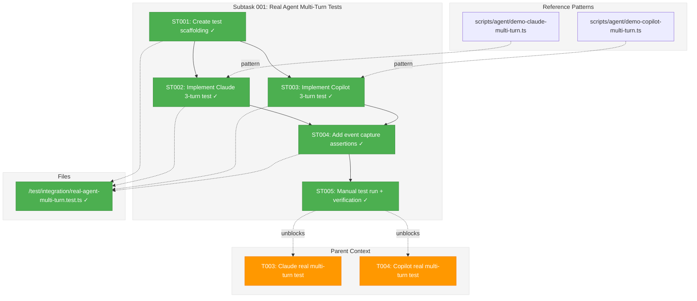
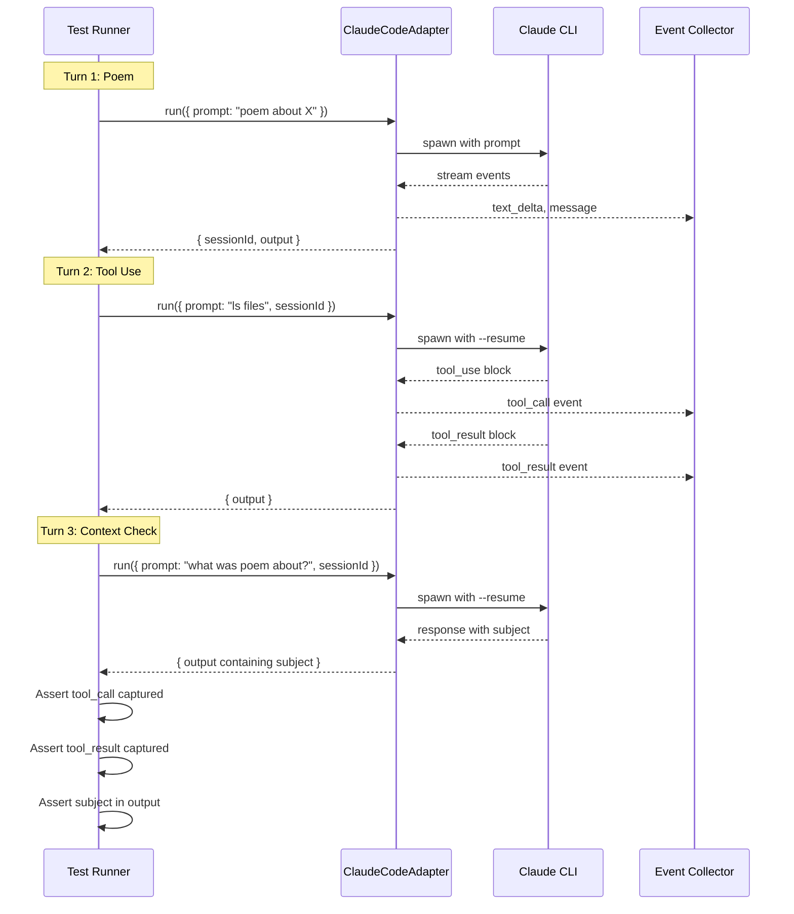

# Subtask 001: Real Agent Multi-Turn Integration Tests

**Parent Plan:** [View Plan](../../better-agents-plan.md)
**Parent Phase:** Phase 5: Integration & Verification
**Parent Task(s):** [T003: Claude real multi-turn test](../tasks.md#task-t003), [T004: Copilot real multi-turn test](../tasks.md#task-t004)
**Plan Task Reference:** [Phase 5 in Plan](../../better-agents-plan.md#phase-5-integration--accessibility)

**Why This Subtask:**
T003 and T004 require real agent integration tests that prove:
1. New event types (tool_call, tool_result, thinking) are captured by adapters
2. Multi-turn session resumption works correctly
3. The full adapter → event pipeline is functioning

This subtask provides deeper breakdown of the test design and implementation approach based on the `scripts/agent/demo-*-multi-turn.ts` patterns.

**Created:** 2026-01-27
**Requested By:** Development Team

---

## Executive Briefing

### Purpose
This subtask creates real integration tests that exercise both Claude and Copilot adapters with multi-turn conversations. Unlike the existing unit tests that use fakes, these tests talk to real agents to prove the event pipeline works end-to-end.

### What We're Building
A test file (`real-agent-multi-turn.test.ts`) containing:
- **Claude multi-turn test**: 3 turns with tool execution verification
- **Copilot multi-turn test**: 3 turns with tool execution verification
- **Event capture assertions**: Verify tool_call, tool_result events are emitted
- **Session resumption proof**: Final turn recalls context from turn 1

### Test Pattern (Both Adapters)

| Turn | Prompt | Purpose | Verification |
|------|--------|---------|--------------|
| 1 | "Write a short poem about [random subject]" | Establish context | Response captured, sessionId obtained |
| 2 | "List the files in the current directory using ls" | Trigger tool use | `tool_call` + `tool_result` events captured |
| 3 | "What subject did you write the poem about?" | Prove session continuity | Response contains original subject |

### Unblocks
- T003: Write real Claude multi-turn integration test with tool events
- T004: Write real Copilot multi-turn integration test with tool events

### Example

**Test execution output:**
```
Turn 1: Write poem about "quantum physics"
  ✓ Response received (45 words)
  ✓ sessionId: sess_abc123

Turn 2: List files
  ✓ tool_call event captured: Bash(ls -la)
  ✓ tool_result event captured: output contains files
  ✓ Session resumed with same ID

Turn 3: Recall poem subject
  ✓ Response contains "quantum physics"
  ✓ Context retention verified
```

---

## Objectives & Scope

### Objective
Create real integration tests that prove adapters emit new event types and session resumption works, providing hard data about adapter behavior that can diagnose SSE or UI issues later.

### Goals

- ✅ Create test file following `scripts/agent/demo-*-multi-turn.ts` pattern
- ✅ Implement Claude 3-turn test with tool_call verification
- ✅ Implement Copilot 3-turn test with tool_call verification
- ✅ Use `describe.skip` pattern (tests run manually, not in CI)
- ✅ Log all captured events for debugging visibility
- ✅ Assert session context retention across turns

### Non-Goals

- ❌ Testing SSE broadcast (that's UI layer, not adapter layer)
- ❌ Testing React components (separate concern)
- ❌ Running in CI (requires auth, too slow)
- ❌ Testing compact functionality (separate feature)

---

## Architecture Map

### Component Diagram
<!-- Status: grey=pending, orange=in-progress, green=completed, red=blocked -->
<!-- Updated by plan-6 during implementation -->



### Task-to-Component Mapping

<!-- Status: ⬜ Pending | 🟧 In Progress | ✅ Complete | 🔴 Blocked -->

| Task | Component(s) | Files | Status | Comment |
|------|-------------|-------|--------|---------|
| ST001 | Test Scaffolding | real-agent-multi-turn.test.ts | ✅ Complete | describe.skip, imports, helpers |
| ST002 | Claude Test | real-agent-multi-turn.test.ts | ✅ Complete | 3-turn test with session reuse |
| ST003 | Copilot Test | real-agent-multi-turn.test.ts | ✅ Complete | 3-turn test with session reuse |
| ST004 | Event Assertions | real-agent-multi-turn.test.ts | ✅ Complete | Verify tool_call, tool_result captured |
| ST005 | Manual Verification | N/A | ✅ Complete | Tests pass with real Claude CLI |

---

## Tasks

| Status | ID | Task | CS | Type | Dependencies | Absolute Path(s) | Validation | Subtasks | Notes |
|--------|-----|------|----|------|--------------|------------------|------------|----------|-------|
| [x] | ST001 | Create test file scaffolding with describe.skip and helpers | 1 | Setup | – | /home/jak/substrate/015-better-agents/test/integration/real-agent-multi-turn.test.ts | File exists, imports resolve | – | Follow agent-streaming.test.ts pattern |
| [x] | ST002 | Implement Claude 3-turn test (poem → ls → recall) | 2 | Core | ST001 | /home/jak/substrate/015-better-agents/test/integration/real-agent-multi-turn.test.ts | Test captures sessionId, reuses across turns | – | Follow demo-claude-multi-turn.ts |
| [x] | ST003 | Implement Copilot 3-turn test (poem → ls → recall) | 2 | Core | ST001 | /home/jak/substrate/015-better-agents/test/integration/real-agent-multi-turn.test.ts | Test captures sessionId, reuses across turns | – | Follow demo-copilot-multi-turn.ts |
| [x] | ST004 | Add event capture assertions for tool_call/tool_result | 2 | Core | ST002, ST003 | /home/jak/substrate/015-better-agents/test/integration/real-agent-multi-turn.test.ts | Asserts filter events by type, verify shape | – | Log all events for visibility |
| [x] | ST005 | Manual test run and verification | 1 | Verify | ST004 | N/A | Tests pass when run manually with auth | – | Document results in execution.log.md |

---

## Alignment Brief

### Objective Recap

This subtask provides the detailed implementation for T003 and T004 from Phase 5, which require real integration tests that prove:
1. Adapters emit `tool_call`, `tool_result`, and `thinking` events correctly
2. Session resumption works across multiple turns
3. The adapter layer is stable and can be trusted when debugging SSE or UI issues

### Acceptance Criteria Coverage

| Parent AC | How This Subtask Addresses |
|-----------|---------------------------|
| AC1: Tool card within 500ms | Verifies adapter emits tool_call event (timing is UI concern) |
| AC2: Tool card shows status/output | Verifies adapter emits tool_result with output |
| AC4: Copilot tool visibility | Copilot test verifies same event shapes |
| AC18: Page refresh recovery | Session reuse proves context persists |

### Critical Findings Affecting This Subtask

| Finding | Impact | How Addressed |
|---------|--------|---------------|
| DYK-P5-03: Real agent tests needed | Core requirement | This entire subtask |
| Phase 2 contract tests | Event shape reference | Use same assertions |
| demo-*-multi-turn.ts patterns | Implementation guide | Follow exact pattern |

### ADR Decision Constraints

| ADR | Decision | Constraint for Subtask |
|-----|----------|------------------------|
| ADR-0007 | Single SSE channel with sessionId routing | Tests verify sessionId in events |

### Inputs to Read

| Path | Purpose |
|------|---------|
| `/home/jak/substrate/015-better-agents/scripts/agent/demo-claude-multi-turn.ts` | Reference pattern for Claude test |
| `/home/jak/substrate/015-better-agents/scripts/agent/demo-copilot-multi-turn.ts` | Reference pattern for Copilot test |
| `/home/jak/substrate/015-better-agents/test/integration/agent-streaming.test.ts` | Skip pattern, import structure |
| `/home/jak/substrate/015-better-agents/test/contracts/agent-tool-events.contract.test.ts` | Event shape assertions |
| `/home/jak/substrate/015-better-agents/packages/shared/src/adapters/claude-code.adapter.ts` | Claude adapter API |
| `/home/jak/substrate/015-better-agents/packages/shared/src/adapters/sdk-copilot-adapter.ts` | Copilot adapter API |

### Visual Aids

#### Sequence Diagram: 3-Turn Test Flow



### Test Plan

| Test | Type | Rationale | Expected Output |
|------|------|-----------|-----------------|
| Claude scaffolding | Unit | File compiles, skip works | Test skipped in normal run |
| Claude 3-turn flow | Integration | Full adapter exercise | All 3 turns complete |
| Claude tool events | Integration | Verify event emission | tool_call + tool_result in array |
| Claude context | Integration | Session continuity | Turn 3 recalls Turn 1 subject |
| Copilot scaffolding | Unit | File compiles | Test skipped |
| Copilot 3-turn flow | Integration | Full adapter exercise | All 3 turns complete |
| Copilot tool events | Integration | Verify event emission | tool_call + tool_result in array |
| Copilot context | Integration | Session continuity | Turn 3 recalls Turn 1 subject |

### Step-by-Step Implementation Outline

| Step | Task | Action |
|------|------|--------|
| 1 | ST001 | Create `real-agent-multi-turn.test.ts` with imports, describe.skip wrapper, helper functions |
| 2 | ST002 | Add Claude describe block with 3-turn test, capture events array, reuse sessionId |
| 3 | ST003 | Add Copilot describe block with same pattern, use CopilotClient |
| 4 | ST004 | Add assertions: filter for tool_call/tool_result, verify shapes, check Turn 3 output |
| 5 | ST005 | Run tests manually, verify output, capture results in execution.log.md |

### Commands to Run

```bash
# Run the subtask tests (will be skipped by default)
pnpm test test/integration/real-agent-multi-turn.test.ts

# Run manually (remove .skip or use vitest flag)
npx vitest run test/integration/real-agent-multi-turn.test.ts --no-file-parallelism

# Run with verbose event logging
DEBUG=1 npx vitest run test/integration/real-agent-multi-turn.test.ts

# Quality check before commit
just fft
```

### Risks & Unknowns

| Risk | Severity | Likelihood | Mitigation |
|------|----------|------------|------------|
| Claude CLI not authenticated | Medium | Medium | Skip test gracefully, log message |
| Copilot SDK not installed | Medium | Medium | Skip test gracefully, log message |
| Flaky due to LLM non-determinism | Low | High | Assert structure not content (except subject recall) |
| Long test timeout | Low | Medium | Set 120s timeout per test |
| Tool use not triggered | Medium | Low | Use explicit "run ls" prompt |

### Ready Check

- [ ] Reference patterns reviewed (demo-*-multi-turn.ts)
- [ ] Skip pattern understood (agent-streaming.test.ts)
- [ ] Event shapes known (contract tests)
- [ ] Adapter APIs understood
- [ ] Test file path determined

**Await GO before implementing.**

---

## Phase Footnote Stubs

| Footnote | Date | Phase | Topic | Files Affected |
|----------|------|-------|-------|----------------|
| | | | | |

_Populated by plan-6 during implementation._

---

## Evidence Artifacts

| Artifact | Path | Purpose |
|----------|------|---------|
| Execution Log | `./001-subtask-real-agent-multi-turn-tests.execution.log.md` | Implementation narrative |
| Test File | `/test/integration/real-agent-multi-turn.test.ts` | Deliverable |

---

## Discoveries & Learnings

_Populated during implementation by plan-6. Log anything of interest to your future self._

| Date | Task | Type | Discovery | Resolution | References |
|------|------|------|-----------|------------|------------|
| 2026-01-27 | ST005 | insight | Claude adapter correctly emits tool_call with toolName, toolCallId, input and tool_result with matching toolCallId | Verified in manual test with real CLI | execution.log.md#st005 |
| 2026-01-27 | ST005 | insight | Event correlation (tool_call → tool_result via toolCallId) works as designed per ADR-0007 | Phase 2 implementation is solid | execution.log.md#st005 |
| 2026-01-27 | ST001 | decision | Used describe.skip for CI safety - tests require auth and take 60s+ | Manual run documented in execution.log | workshop |
| 2026-01-27 | ST005 | gotcha | Context assertion must check ANY word from subject, not just first word | LLM may return "castles" for "medieval castles" - still valid context | Fixed: `subjectWords.some()` |
| 2026-01-27 | ST005 | insight | Copilot emits more events per turn (29 vs 3) and multiple tool_call/result pairs (2 vs 1) | Different streaming granularity between adapters | Both valid per contract |

**Types**: `gotcha` | `research-needed` | `unexpected-behavior` | `workaround` | `decision` | `debt` | `insight`

**What to log**:
- Things that didn't work as expected
- External research that was required
- Implementation troubles and how they were resolved
- Gotchas and edge cases discovered
- Decisions made during implementation
- Technical debt introduced (and why)
- Insights that future phases should know about

_See also: `execution.log.md` for detailed narrative._

---

## After Subtask Completion

**This subtask resolves blockers for:**
- Parent Task: [T003: Claude real multi-turn test](../tasks.md#task-t003)
- Parent Task: [T004: Copilot real multi-turn test](../tasks.md#task-t004)

**When all ST### tasks complete:**

1. **Record completion** in parent execution log:
   ```
   ### Subtask 001-subtask-real-agent-multi-turn-tests Complete

   Resolved: Created real integration tests for Claude and Copilot adapters
   See detailed log: [subtask execution log](./001-subtask-real-agent-multi-turn-tests.execution.log.md)
   ```

2. **Update parent tasks** T003 and T004:
   - Open: [`tasks.md`](../tasks.md)
   - Find: T003, T004
   - Update Status: `[ ]` → `[x]` (complete)
   - Update Notes: Add "Subtask 001 complete"

3. **Resume parent phase work:**
   ```bash
   /plan-6-implement-phase --phase "Phase 5: Integration & Verification" \
     --plan "/home/jak/substrate/015-better-agents/docs/plans/015-better-agents/better-agents-plan.md"
   ```
   (Note: NO `--subtask` flag to resume main phase)

**Quick Links:**
- 📋 [Parent Dossier](../tasks.md)
- 📄 [Parent Plan](../../better-agents-plan.md)
- 📊 [Parent Execution Log](../execution.log.md)

---

## Directory Layout

```
docs/plans/015-better-agents/tasks/phase-5-integration-accessibility/
  ├── tasks.md                                              # Parent dossier
  ├── execution.log.md                                      # Parent log (created by plan-6)
  ├── 001-subtask-real-agent-multi-turn-tests.md           # ← THIS FILE
  └── 001-subtask-real-agent-multi-turn-tests.execution.log.md  # ← Created by plan-6
```
