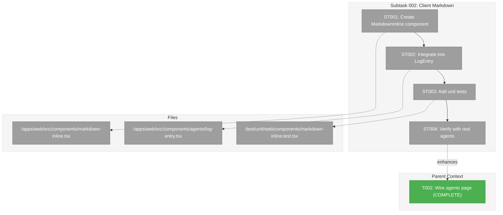
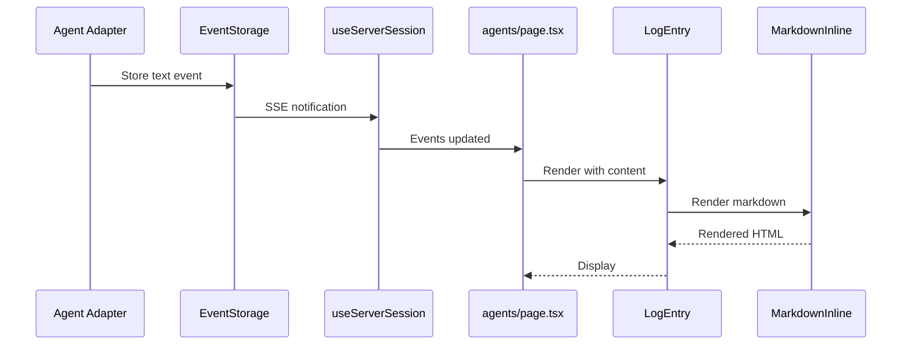

# Subtask 002: Client-Side Markdown Rendering for Agent Output

**Parent Plan:** [View Plan](../../better-agents-plan.md)
**Parent Phase:** Phase 5: Integration & Accessibility
**Parent Task(s):** [T002: Wire agents page to useServerSession](../tasks.md#task-t002)
**Plan Task Reference:** [Task 5.2 in Plan](../../better-agents-plan.md#phase-5-integration--accessibility)

**Why This Subtask:**
Agent text output currently renders as plain text (`<p>` tags with `whitespace-pre-wrap`). Agents like Claude and Copilot frequently output markdown (headers, code blocks, lists, bold/italic). Need to render markdown properly for better readability.

**Created:** 2026-01-27
**Requested By:** User

---

## Executive Briefing

### Purpose
This subtask adds client-side markdown rendering to agent text output so that formatted content (headers, code blocks, lists, links) displays properly instead of raw markdown syntax.

### What We're Building
A lightweight client-side markdown renderer for `LogEntry` component:
- Sync `ReactMarkdown` usage (not async server component)
- GFM support via `remark-gfm` (tables, task lists, strikethrough)
- Prose styling consistent with existing `MarkdownServer` component
- No Shiki syntax highlighting (keep it lightweight for chat context)

### Unblocks
- Proper display of agent markdown output (headers, code, lists render correctly)
- Consistent UX when agents use markdown formatting

### Example
**Before** (raw text):
```
Here are the files:

## Directory Structure
- `src/` - Source files
- `test/` - Test files

```bash
ls -la
```


**After** (rendered markdown):
> Here are the files:
> 
> ## Directory Structure
> - `src/` - Source files
> - `test/` - Test files
> 
> ```bash
> ls -la
> ```

---

## Objectives & Scope

### Objective
Add markdown rendering to agent text output while keeping the implementation lightweight and client-compatible.

### Goals

- ✅ Create lightweight client markdown component (sync, not async)
- ✅ Integrate into `LogEntry` for assistant text contentType
- ✅ Support GFM (tables, task lists, strikethrough) via remark-gfm
- ✅ Apply prose styling consistent with existing markdown viewer
- ✅ Verify rendering works for Claude and Copilot output
- ✅ Add unit tests for markdown rendering

### Non-Goals

- ❌ Shiki syntax highlighting (too heavy for chat, basic `<pre><code>` suffices)
- ❌ Mermaid diagram support in chat (out of scope)
- ❌ Server-side pre-rendering (adds complexity, not needed)
- ❌ Modifying MarkdownServer component (keep existing component unchanged)

---

## Architecture Map

### Component Diagram
<!-- Updated by plan-6 during implementation -->



### Task-to-Component Mapping

<!-- Status: ⬜ Pending | 🟧 In Progress | ✅ Complete | 🔴 Blocked -->

| Task | Component(s) | Files | Status | Comment |
|------|-------------|-------|--------|---------|
| ST001 | MarkdownInline | markdown-inline.tsx | ⬜ Pending | Lightweight sync ReactMarkdown wrapper |
| ST002 | LogEntry | log-entry.tsx | ⬜ Pending | Replace `<p>` with MarkdownInline for assistant text |
| ST003 | Tests | markdown-inline.test.tsx | ⬜ Pending | Unit tests for markdown rendering |
| ST004 | Verification | N/A | ⬜ Pending | Manual verification with real Claude/Copilot |

---

## Tasks

| Status | ID    | Task                              | CS | Type  | Dependencies | Absolute Path(s)                                                                     | Validation                          | Subtasks | Notes           |
|--------|-------|-----------------------------------|----|----- -|--------------|--------------------------------------------------------------------------------------|-------------------------------------|----------|-----------------|
| [ ]    | ST001 | Create MarkdownInline component   | 2  | Core  | –            | /home/jak/substrate/015-better-agents/apps/web/src/components/markdown-inline.tsx    | Component renders markdown          | –        | Sync client component |
| [ ]    | ST002 | Integrate into LogEntry           | 1  | Core  | ST001        | /home/jak/substrate/015-better-agents/apps/web/src/components/agents/log-entry.tsx   | Assistant text renders as markdown  | –        | Enhances T002   |
| [ ]    | ST003 | Write unit tests                  | 2  | Test  | ST002        | /home/jak/substrate/015-better-agents/test/unit/web/components/markdown-inline.test.tsx | Tests pass, coverage adequate    | –        | Follow existing test patterns |
| [ ]    | ST004 | Verify with real agents           | 1  | Verify| ST003        | N/A - Manual verification                                                            | Claude/Copilot output renders correctly | –   | Browser verification |

---

## Alignment Brief

### Objective Recap
Add markdown rendering to agent text output using existing `react-markdown` dependency, keeping implementation lightweight and client-compatible.

### Technical Approach

**Option B from research** (client-side sync ReactMarkdown):
```tsx
// MarkdownInline - lightweight client component
'use client';
import ReactMarkdown from 'react-markdown';
import remarkGfm from 'remark-gfm';

interface MarkdownInlineProps {
  content: string;
  className?: string;
}

export function MarkdownInline({ content, className }: MarkdownInlineProps) {
  return (
    <div className={cn('prose prose-sm dark:prose-invert max-w-none', className)}>
      <ReactMarkdown remarkPlugins={[remarkGfm]}>
        {content}
      </ReactMarkdown>
    </div>
  );
}
```

**Why this approach:**
- ✅ Sync component works in client components (LogEntry is client)
- ✅ GFM support (tables, task lists, strikethrough)
- ✅ react-markdown sanitizes content (no XSS risk)
- ✅ Prose styling matches existing markdown viewer
- ⚠️ No Shiki highlighting (acceptable for chat context)

### Existing Code References
- `MarkdownServer` (`components/viewers/markdown-server.tsx`) - Async server version (reference for styling)
- `LogEntry` (`components/agents/log-entry.tsx:199-220`) - Current plain text rendering
- `react-markdown` and `remark-gfm` already in dependencies

### Checklist (from parent acceptance criteria)
- [ ] Agent text output renders markdown correctly
- [ ] Headers, lists, code blocks display properly
- [ ] No XSS vulnerabilities (react-markdown sanitizes)
- [ ] Styling consistent with existing prose classes

### Invariants
- Do not modify MarkdownServer component
- Keep LogEntry client component (no async)
- Maintain existing role-based styling (user/system messages unchanged)

### Inputs
- Research from prior exploration (MarkdownServer patterns, LogEntry structure)
- Existing dependencies: react-markdown ^10.1.0, remark-gfm ^4.0.1

### Implementation Sequence Diagram



### Test Plan

**Unit Tests (ST003):**
1. Renders plain text correctly
2. Renders headers (h1-h6)
3. Renders code blocks with language class
4. Renders inline code
5. Renders lists (ordered and unordered)
6. Renders links
7. Renders bold/italic
8. Renders GFM tables
9. Renders GFM task lists
10. Handles empty content
11. Handles very long content (no overflow)

**Manual Verification (ST004):**
- Run Claude agent with "explain this code with examples"
- Run Copilot agent with similar prompt
- Verify markdown renders correctly in browser

### Commands to Run

```bash
# Run existing tests to verify no regressions
pnpm test

# Run specific component tests
pnpm test markdown-inline

# Start dev server for manual verification
pnpm dev

# Type check
pnpm typecheck
```

### Risks & Mitigations

| Risk | Impact | Mitigation |
|------|--------|------------|
| Performance with large markdown | Low | Prose styling constrains rendering; can add lazy loading later if needed |
| Style conflicts with parent prose | Medium | Use prose-sm and verify in browser |
| Breaking existing text display | High | Unit tests cover existing behavior first |

### Ready Check

- [x] Parent phase tasks complete (T002 done)
- [x] Dependencies available (react-markdown, remark-gfm in package.json)
- [x] MarkdownServer component reviewed for patterns
- [x] LogEntry component structure understood
- [ ] Ready for implementation

---

## Evidence Artifacts

- **Execution Log**: `002-subtask-client-markdown-rendering.execution.log.md`
- **Test File**: `/test/unit/web/components/markdown-inline.test.tsx`
- **Component**: `/apps/web/src/components/markdown-inline.tsx`

---

## Discoveries & Learnings

_Populated during implementation by plan-6. Log anything of interest to your future self._

| Date | Task | Type | Discovery | Resolution | References |
|------|------|------|-----------|------------|------------|
| | | | | | |

**Types**: `gotcha` | `research-needed` | `unexpected-behavior` | `workaround` | `decision` | `debt` | `insight`

**What to log**:
- Things that didn't work as expected
- External research that was required
- Implementation troubles and how they were resolved
- Gotchas and edge cases discovered
- Decisions made during implementation
- Technical debt introduced (and why)
- Insights that future phases should know about

_See also: `execution.log.md` for detailed narrative._

---

## After Subtask Completion

**This subtask enhances:**
- Parent Task: [T002: Wire agents page to useServerSession](../tasks.md#task-t002)
- Plan Task: [5.2 in Plan](../../better-agents-plan.md#phase-5-integration--accessibility)

**When all ST### tasks complete:**

1. **Record completion** in parent execution log:
   ```
   ### Subtask 002-subtask-client-markdown-rendering Complete

   Resolved: Agent text output now renders markdown properly
   See detailed log: [subtask execution log](./002-subtask-client-markdown-rendering.execution.log.md)
   ```

2. **Update parent tasks.md if needed:**
   - This subtask enhances T002 (already complete)
   - No status change needed, just note in execution log

3. **Resume parent phase work if applicable:**
   ```bash
   /plan-6-implement-phase --phase "Phase 5: Integration & Accessibility" \
     --plan "/home/jak/substrate/015-better-agents/docs/plans/015-better-agents/better-agents-plan.md"
   ```
   (Note: NO `--subtask` flag to resume main phase)

**Quick Links:**
- 📋 [Parent Dossier](../tasks.md)
- 📄 [Parent Plan](../../better-agents-plan.md)
- 📊 [Parent Execution Log](../execution.log.md)

---

## Directory Structure

```
docs/plans/015-better-agents/tasks/phase-5-integration-accessibility/
├── tasks.md                                          # Parent phase dossier
├── execution.log.md                                  # Parent execution log
├── 001-subtask-real-agent-multi-turn-tests.md       # First subtask
├── 001-subtask-real-agent-multi-turn-tests.execution.log.md
├── 002-subtask-client-markdown-rendering.md          # This subtask ← NEW
└── 002-subtask-client-markdown-rendering.execution.log.md  # Created by plan-6
```
