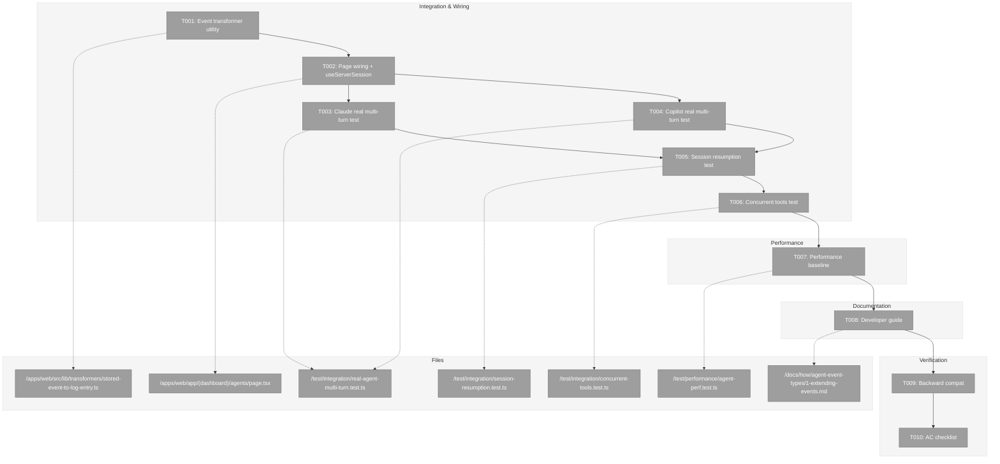
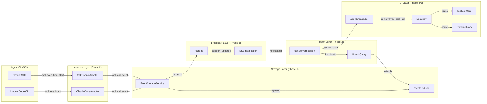
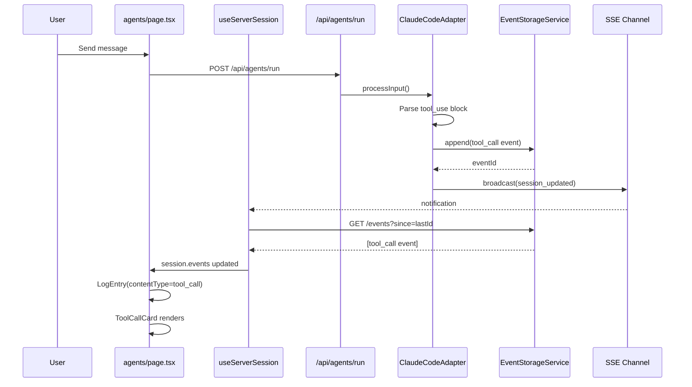

# Phase 5: Integration & Verification – Tasks & Alignment Brief

**Spec**: [../better-agents-spec.md](../better-agents-spec.md)
**Plan**: [../better-agents-plan.md](../better-agents-plan.md)
**Date**: 2026-01-27

---

## DYK Session Decisions (2026-01-27)

The following decisions were made during a Did You Know clarity session before implementation:

| ID | Decision | Rationale |
|----|----------|-----------|
| **DYK-P5-01** | Use `useServerSession` for active session only | Page manages multiple sessions via Map, but only active session needs server-backed state. Inactive sessions don't need real-time updates. |
| **DYK-P5-02** | Create dedicated `storedEventToLogEntryProps()` transformer | StoredEvent has `{type, data, timestamp}`, AgentMessage has `{role, content, contentType}`. Need explicit transformation. Testable, single responsibility. |
| **DYK-P5-03** | Real agent multi-turn integration tests | Use real Claude + Copilot adapters (not mocks) with session reuse. Trigger tool use, assert tool_call/tool_result events captured. Tests marked `describe.skip`, run manually. |
| **DYK-P5-04** | Skip accessibility testing | Not a requirement at this time. Removed axe-core and screen reader tasks. Can be added in future phase if needed. |
| **DYK-P5-05** | Performance baseline with timing, speed not critical | Use `performance.now()` for load timing. Document manual scroll testing. Catching regressions matters more than absolute speed. |

---

## Executive Briefing

### Purpose
This phase wires together all the infrastructure built in Phases 1-4 into a fully functioning end-to-end system, then validates it with real agent integration tests. It's the final phase that transforms isolated components into a production-ready feature.

### What We're Building
Complete integration of:
- **Agents page wiring**: Connect `useServerSession` hook to the agents page for active session, keeping existing multi-session Map for list
- **Event transformer**: `storedEventToLogEntryProps()` utility to convert StoredEvent → LogEntry props
- **contentType routing**: Wire `LogEntry` component to render tool calls, tool results, and thinking blocks using Phase 4 components
- **Real agent integration tests**: Multi-turn tests with real Claude + Copilot that trigger tool use and verify event capture
- **Performance baseline**: Basic timing verification (not strict speed requirements)
- **Developer documentation**: Guide for extending event types across all 3 layers

### User Value
Users gain full visibility into agent activity:
- Watch tools execute in real-time (bash commands, file reads)
- See tool outputs (command results, file contents)
- Observe AI reasoning (thinking blocks)
- Resume sessions after page refresh without data loss

### Example
**Before**: User sends "list files" → sees only final text response after ~5s
**After**: User sends "list files" →
1. Sees `Bash: ls -la` tool card appear within 500ms (running state)
2. Watches output stream into the card
3. Card transitions to "complete" state with green checkmark
4. Final assistant message appears below
5. Page refresh → all tool activity still visible (restored from storage)

---

## Objectives & Scope

### Objective
Complete end-to-end integration of agent activity visibility with real agent validation.

### Goals

- ✅ Wire agents page to use `useServerSession` for active session (DYK-P5-01)
- ✅ Create `storedEventToLogEntryProps()` transformer utility (DYK-P5-02)
- ✅ Connect `LogEntry` contentType routing to display tool calls, tool results, thinking
- ✅ Real multi-turn Claude integration test with tool events (DYK-P5-03)
- ✅ Real multi-turn Copilot integration test with tool events (DYK-P5-03)
- ✅ Verify session resumption after page refresh (events fetched from storage)
- ✅ Verify concurrent tool calls render in correct order
- ✅ Performance baseline: timing verification (DYK-P5-05)
- ✅ Write developer guide for adding new event types
- ✅ Verify backward compatibility with existing sessions (no contentType field)
- ✅ Final acceptance criteria checklist

### Non-Goals

- ❌ Virtualization for very large event lists (NG5 from spec—defer to future optimization)
- ❌ Refactoring agent-session-dialog.tsx (keep existing dialog working, don't break it)
- ❌ Performance optimization beyond baseline verification (future phase if needed)
- ❌ New event types beyond tool_call, tool_result, thinking (spec scope)
- ❌ Multi-workspace support (hardcoded "default" per spec AD1)
- ❌ Event compression or rotation (simplicity over optimization per spec NG5)
- ❌ Accessibility testing (DYK-P5-04: not required at this time)

---

## Architecture Map

### Component Diagram
<!-- Status: grey=pending, orange=in-progress, green=completed, red=blocked -->
<!-- Updated by plan-6 during implementation -->



### Task-to-Component Mapping

<!-- Status: ⬜ Pending | 🟧 In Progress | ✅ Complete | 🔴 Blocked -->

| Task | Component(s) | Files | Status | Comment |
|------|-------------|-------|--------|---------|
| T001 | Transformer Utility | stored-event-to-log-entry.ts | ⬜ Pending | StoredEvent → LogEntryProps (DYK-P5-02) |
| T002 | Page Integration | agents/page.tsx | ⬜ Pending | Wire useServerSession for active session (DYK-P5-01) |
| T003 | Integration Test | real-agent-multi-turn.test.ts | ⬜ Pending | Claude real multi-turn with tool events (DYK-P5-03) |
| T004 | Integration Test | real-agent-multi-turn.test.ts | ⬜ Pending | Copilot real multi-turn with tool events (DYK-P5-03) |
| T005 | Integration Test | session-resumption.test.ts | ⬜ Pending | Page refresh recovery (AC18) |
| T006 | Integration Test | concurrent-tools.test.ts | ⬜ Pending | Multiple tools in correct order |
| T007 | Performance | agent-perf.test.ts | ⬜ Pending | Baseline timing (DYK-P5-05) |
| T008 | Documentation | 1-extending-events.md | ⬜ Pending | Developer guide for event types |
| T009 | Verification | backward-compat.test.ts | ⬜ Pending | Old sessions without contentType |
| T010 | Verification | N/A | ⬜ Pending | Final AC checklist |

---

## Tasks

| Status | ID | Task | CS | Type | Dependencies | Absolute Path(s) | Validation | Subtasks | Notes |
|--------|-----|------|----|------|--------------|------------------|------------|----------|-------|
| [ ] | T001 | Create storedEventToLogEntryProps transformer utility | 2 | Core | – | /home/jak/substrate/015-better-agents/apps/web/src/lib/transformers/stored-event-to-log-entry.ts | Unit tests verify StoredEvent → LogEntryProps conversion | – | DYK-P5-02 |
| [ ] | T002 | Wire agents page to useServerSession for active session | 3 | Core | T001 | /home/jak/substrate/015-better-agents/apps/web/app/(dashboard)/agents/page.tsx | Page renders tool calls, results, thinking via LogEntry contentType | – | DYK-P5-01, Per Phase 4 DYK-P4-03 |
| [ ] | T003 | Write real Claude multi-turn integration test with tool events | 3 | Test | T002 | /home/jak/substrate/015-better-agents/test/integration/real-agent-multi-turn.test.ts | Real adapter emits tool_call, tool_result across turns | 001-subtask-real-agent-multi-turn-tests | DYK-P5-03, follow scripts/agent/demo-claude-multi-turn.ts pattern |
| [ ] | T004 | Write real Copilot multi-turn integration test with tool events | 3 | Test | T002 | /home/jak/substrate/015-better-agents/test/integration/real-agent-multi-turn.test.ts | Real adapter emits tool_call, tool_result across turns | 001-subtask-real-agent-multi-turn-tests | DYK-P5-03, follow scripts/agent/demo-copilot-multi-turn.ts pattern |
| [ ] | T005 | Write integration test: Session resumption after refresh | 2 | Test | T003, T004 | /home/jak/substrate/015-better-agents/test/integration/session-resumption.test.ts | Events fetched from storage, UI restored | – | AC18 |
| [ ] | T006 | Write integration test: Concurrent tool calls | 2 | Test | T005 | /home/jak/substrate/015-better-agents/test/integration/concurrent-tools.test.ts | Multiple tools render in correct order | – | |
| [ ] | T007 | Write performance baseline test | 2 | Perf | T006 | /home/jak/substrate/015-better-agents/test/performance/agent-perf.test.ts | Basic timing verification, document results | – | DYK-P5-05 |
| [ ] | T008 | Write developer guide for adding event types | 2 | Doc | T007 | /home/jak/substrate/015-better-agents/docs/how/agent-event-types/1-extending-events.md | Guide covers all 3 layers + tests | – | |
| [ ] | T009 | Verify backward compatibility with existing sessions | 2 | Test | T008 | /home/jak/substrate/015-better-agents/test/integration/backward-compat.test.ts | Old sessions load without contentType field | – | AC21, AC22 |
| [ ] | T010 | Final acceptance criteria checklist | 1 | Verify | T009 | N/A - Manual verification | All ACs verified with evidence | – | |

---

## Alignment Brief

### Prior Phases Review

#### Cross-Phase Synthesis

**Phase-by-Phase Summary (Evolution):**

| Phase | Focus | Key Achievement |
|-------|-------|-----------------|
| **Phase 1** | Event Storage Foundation | EventStorageService with NDJSON persistence, timestamp-based IDs, Zod schemas |
| **Phase 2** | Adapter Event Parsing | Claude + Copilot adapters emit tool_call, tool_result, thinking events |
| **Phase 3** | SSE Broadcast Integration | Notification-fetch pattern with useServerSession hook, React Query |
| **Phase 4** | UI Components | ToolCallCard, ThinkingBlock, LogEntry contentType routing (53 tests) |

**Cumulative Deliverables Available to Phase 5:**

| Phase | Component | Path | Purpose for Phase 5 |
|-------|-----------|------|---------------------|
| P1 | EventStorageService | `packages/shared/src/services/event-storage.service.ts` | Read events for tests |
| P1 | FakeEventStorage | `packages/shared/src/fakes/fake-event-storage.ts` | Test helpers: seedEvents(), assertEventStored() |
| P1 | AgentStoredEventSchema | `packages/shared/src/schemas/agent-event.schema.ts` | Validate events in tests |
| P1 | validateSessionId | `packages/shared/src/lib/validators/session-id-validator.ts` | Path traversal prevention |
| P1 | GET /events API | `apps/web/app/api/agents/sessions/[sessionId]/events/route.ts` | Fetch events for resumption tests |
| P2 | Claude adapter parsing | `packages/shared/src/adapters/claude-code.adapter.ts:438-560` | Test with real Claude fixtures |
| P2 | Copilot adapter parsing | `packages/shared/src/adapters/sdk-copilot-adapter.ts:238-292` | Test with real Copilot fixtures |
| P2 | FakeAgentAdapter | `packages/shared/src/fakes/fake-agent-adapter.ts:239-322` | emitToolCall(), emitToolResult(), emitThinking() |
| P2 | Contract tests | `test/contracts/agent-tool-events.contract.test.ts` | Reference for event shape parity |
| P3 | useServerSession | `apps/web/src/hooks/useServerSession.ts` | Server-backed session state for page |
| P3 | SessionMetadataService | `packages/shared/src/services/session-metadata.service.ts` | Session CRUD for tests |
| P3 | Providers | `apps/web/src/components/providers.tsx` | QueryClientProvider wrapper |
| P4 | ToolCallCard | `apps/web/src/components/agents/tool-call-card.tsx` | Tool call/result display |
| P4 | ThinkingBlock | `apps/web/src/components/agents/thinking-block.tsx` | Thinking block display |
| P4 | LogEntry w/contentType | `apps/web/src/components/agents/log-entry.tsx` | Routes by contentType |
| P4 | ToolData, ThinkingData | `apps/web/src/components/agents/log-entry.tsx:29-56` | Props interfaces |

**Pattern Evolution:**
- Phase 1 established: Zod-first schema derivation, timestamp-based IDs
- Phase 2 established: Factory-based contract tests, additive code paths
- Phase 3 established: Notification-fetch (SSE hints, fetch is truth), React Query for state
- Phase 4 established: contentType routing, ToolData/ThinkingData interfaces

**Recurring Issues:**
- Schema mismatch between existing dialog (`role: 'tool'`) and new events (`contentType: 'tool_call'`) - Phase 5 handles via transformation or keeping separate
- TDD RED tests in Phase 3 useServerSession.test.ts still skipped (8 tests) - not blocking

**Reusable Test Infrastructure:**
- FakeEventStorage from Phase 1 for seeding/asserting events
- FakeAgentAdapter from Phase 2 for emitting test events
- Contract test factory pattern from Phase 2 for parity testing

#### Phase 1 Summary
- **Deliverables**: EventStorageService, IEventStorage interface, FakeEventStorage, Zod schemas (AgentToolCallEventSchema, AgentToolResultEventSchema, AgentThinkingEventSchema), GET /events API route, DI token EVENT_STORAGE
- **Key Decisions**: Timestamp-based IDs (avoid race conditions), silent skip for malformed NDJSON, dual-layer testing (real fs + DI fakes)
- **Dependencies Exported**: All event types, storage interface, API endpoint
- **Test Infrastructure**: 88 new tests, FakeEventStorage.seedEvents()/assertEventStored()

#### Phase 2 Summary
- **Deliverables**: Claude adapter tool_use/tool_result/thinking parsing, Copilot adapter tool.execution_*/assistant.reasoning parsing, contract tests
- **Key Decisions**: Return AgentEvent[] from Claude translator (mixed content blocks), factory-based contract tests, optional signature field
- **Dependencies Exported**: Adapters emit tool_call/tool_result/thinking events, FakeAgentAdapter helpers
- **Test Infrastructure**: 35 new tests, contract test factory pattern

#### Phase 3 Summary
- **Deliverables**: useServerSession hook, SessionMetadataService, Providers wrapper, route.ts event persistence + notification broadcast
- **Key Decisions**: Notification-fetch pattern (SSE is hint, fetch is truth), React Query for dedup, new hook vs modifying existing
- **Dependencies Exported**: useServerSession(), sessionQueryKey(), ServerSession interface
- **Test Infrastructure**: 8 TDD RED tests (stubs for future), real integration via route.ts changes

#### Phase 4 Summary
- **Deliverables**: ToolCallCard (258 lines), ThinkingBlock (121 lines), LogEntry contentType routing (+103 lines), ToolData/ThinkingData interfaces
- **Key Decisions**: Extract patterns from agent-session-dialog.tsx, dual contentType + messageRole discrimination
- **Critical Incomplete Item**: agents/page.tsx NOT wired to useServerSession (DYK-P4-03) - Phase 5 must complete this
- **Test Infrastructure**: 53 new tests (30 ToolCallCard, 16 ThinkingBlock, 7 LogEntry routing)

### Critical Findings Affecting This Phase

| Finding | Impact on Phase 5 | Tasks Addressing |
|---------|-------------------|------------------|
| **Critical Discovery 01**: Event storage before adapters | Foundation complete - Phase 5 can test full pipeline | T002-T005 |
| **Critical Discovery 02**: Three-layer sync atomic | All layers implemented - Phase 5 verifies integration | T002-T004 |
| **High Discovery 06**: Component needs contentType discrimination | Implemented in Phase 4 - Phase 5 wires to page | T001 |
| **Phase 4 DYK-P4-03**: Page not using useServerSession | Phase 5 must complete wiring | T001 |
| **Phase 4 DYK-P4-02**: Schema mismatch (dialog uses role: 'tool') | Keep existing dialog working, don't break it | T012 (non-goal: no dialog refactor) |

### ADR Decision Constraints

| ADR | Decision | Constraints for Phase 5 | Tasks Affected |
|-----|----------|-------------------------|----------------|
| **ADR-0007** | Single-channel SSE routing | Events include sessionId, route by ID not active session | T002-T005 |
| **ADR-0007 IMP-003** | API response fallback | Test that backgrounded tabs recover via API response | T004 |

### Invariants & Guardrails

- **Performance**: Page must remain responsive with 100+ tool calls
- **Load Time**: 1000 events must load in <500ms
- **Accessibility**: Zero critical/serious axe-core violations
- **Backward Compatibility**: Sessions without contentType must still render (default to 'text')

### Inputs to Read

| Path | Purpose |
|------|---------|
| `/home/jak/substrate/015-better-agents/apps/web/app/(dashboard)/agents/page.tsx` | Page to wire |
| `/home/jak/substrate/015-better-agents/apps/web/src/hooks/useServerSession.ts` | Hook to integrate |
| `/home/jak/substrate/015-better-agents/apps/web/src/components/agents/log-entry.tsx` | contentType routing |
| `/home/jak/substrate/015-better-agents/packages/shared/src/fakes/fake-event-storage.ts` | Test helpers |
| `/home/jak/substrate/015-better-agents/packages/shared/src/fakes/fake-agent-adapter.ts` | Event emitter helpers |
| `/home/jak/substrate/015-better-agents/test/contracts/agent-tool-events.contract.test.ts` | Reference for event shapes |
| `/home/jak/substrate/015-better-agents/docs/plans/015-better-agents/better-agents-spec.md` | AC definitions |

### Visual Alignment Aids

#### Flow Diagram: Full Event Pipeline



#### Sequence Diagram: Tool Call Flow



### Test Plan

| Test | Type | Rationale | Fixtures | Expected Output |
|------|------|-----------|----------|-----------------|
| StoredEvent transformer | Unit | Verify DYK-P5-02 transformer | Mock StoredEvents | Correct LogEntryProps |
| Claude real multi-turn | Integration | Real adapter with tool events (DYK-P5-03) | Real Claude CLI | tool_call + tool_result captured |
| Copilot real multi-turn | Integration | Real adapter with tool events (DYK-P5-03) | Real Copilot SDK | tool_call + tool_result captured |
| Session resumption | Integration | Verify storage recovery (AC18) | Pre-seeded events.ndjson | All events restored after refresh |
| Concurrent tools | Integration | Verify ordering | 3 rapid tool_call events | Rendered in timestamp order |
| Performance baseline | Perf | Basic timing verification | Seeded events | Document timing results |
| Backward compat | Integration | Old sessions work (AC21, AC22) | Events without contentType | Default to text rendering |

**Real Agent Tests**: T003/T004 use real Claude CLI and Copilot SDK with multi-turn sessions and session reuse. Tests are marked `describe.skip` and run manually when needed. Follow pattern from `scripts/agent/demo-*-multi-turn.ts`.

### Step-by-Step Implementation Outline

| Step | Task | Action |
|------|------|--------|
| 1 | T001 | Create `storedEventToLogEntryProps()` in `apps/web/src/lib/transformers/` with unit tests |
| 2 | T002 | Wire agents/page.tsx to use useServerSession for active session, import transformer |
| 3 | T003 | Create real-agent-multi-turn.test.ts Claude section following demo-claude-multi-turn.ts pattern |
| 4 | T004 | Add Copilot section to real-agent-multi-turn.test.ts following demo-copilot-multi-turn.ts pattern |
| 5 | T005 | Create session-resumption.test.ts, seed events, simulate refresh, verify restoration |
| 6 | T006 | Create concurrent-tools.test.ts, emit 3 rapid events, verify order preserved |
| 7 | T007 | Create agent-perf.test.ts with basic timing verification |
| 8 | T008 | Create docs/how/agent-event-types/1-extending-events.md |
| 9 | T009 | Create backward-compat.test.ts, verify events without contentType render |
| 10 | T010 | Walk through ACs with evidence, document in execution.log.md |

### Commands to Run

```bash
# Development
pnpm dev                     # Start dev server for manual testing

# Quality Checks
just fft                     # Fix, Format, Test (main quality gate)
just lint                    # Biome linter
just typecheck               # TypeScript strict mode
just test                    # Run all tests

# Specific Test Commands
pnpm test test/integration/real-agent-multi-turn.test.ts  # Real agent tests (skipped by default)
pnpm test test/integration/session-resumption.test.ts     # Resumption
pnpm test test/integration/concurrent-tools.test.ts       # Concurrent
pnpm test test/performance/agent-perf.test.ts             # Performance

# Run skipped real agent tests manually
npx vitest run test/integration/real-agent-multi-turn.test.ts --no-file-parallelism

# Build Verification
just build                   # Production build
```

### Risks & Unknowns

| Risk | Severity | Likelihood | Mitigation |
|------|----------|------------|------------|
| Real agent test flakiness | Medium | Medium | Tests marked `describe.skip`, run manually when needed |
| Real agent tests require auth | Low | High | Skip if CLI/SDK not available (existing pattern) |
| StoredEvent → AgentMessage mismatch | Low | Low | Explicit transformer with unit tests |
| Copilot SDK changes (technical preview) | Low | Low | Tests skipped in CI, run manually |

### Ready Check

- [x] Prior phases reviewed (Phases 1-4 complete, 53+ tests from Phase 4)
- [x] ADR constraints mapped (ADR-0007 IMP-003 in T005)
- [x] Critical findings from plan addressed in task design
- [x] DYK session decisions documented (DYK-P5-01 through DYK-P5-05)
- [x] Test patterns identified (scripts/agent/demo-*-multi-turn.ts)
- [x] Commands verified (just fft, pnpm test patterns)

**GO/NO-GO: READY for implementation.**

---

## Phase Footnote Stubs

| Footnote | Date | Phase | Topic | Files Affected |
|----------|------|-------|-------|----------------|
| | | | | |

_Populated by plan-6 during implementation._

---

## Evidence Artifacts

| Artifact | Path | Purpose |
|----------|------|---------|
| Execution Log | `./execution.log.md` | Implementation narrative, decisions, issues |
| Transformer | `/apps/web/src/lib/transformers/stored-event-to-log-entry.ts` | StoredEvent → LogEntryProps |
| Integration Tests | `/test/integration/real-agent-multi-turn.test.ts` | Real agent multi-turn tests |
| Performance Tests | `/test/performance/agent-perf.test.ts` | Performance baselines |
| Developer Guide | `/docs/how/agent-event-types/1-extending-events.md` | Documentation deliverable |

---

## Discoveries & Learnings

_Populated during implementation by plan-6. Log anything of interest to your future self._

| Date | Task | Type | Discovery | Resolution | References |
|------|------|------|-----------|------------|------------|
| | | | | | |

**Types**: `gotcha` | `research-needed` | `unexpected-behavior` | `workaround` | `decision` | `debt` | `insight`

**What to log**:
- Things that didn't work as expected
- External research that was required
- Implementation troubles and how they were resolved
- Gotchas and edge cases discovered
- Decisions made during implementation
- Technical debt introduced (and why)
- Insights that future phases should know about

_See also: `execution.log.md` for detailed narrative._

---

## Directory Layout

```
docs/plans/015-better-agents/
  ├── better-agents-spec.md
  ├── better-agents-plan.md
  └── tasks/
      ├── phase-1-event-storage-foundation/
      │   ├── tasks.md
      │   └── execution.log.md
      ├── phase-2-adapter-event-parsing/
      │   ├── tasks.md
      │   └── execution.log.md
      ├── phase-3-sse-broadcast-integration/
      │   ├── tasks.md
      │   └── execution.log.md
      ├── phase-4-ui-components/
      │   ├── tasks.md
      │   └── execution.log.md
      └── phase-5-integration-accessibility/   # ← THIS PHASE
          ├── tasks.md                        # ← THIS FILE
          └── execution.log.md                # ← Created by plan-6
```
