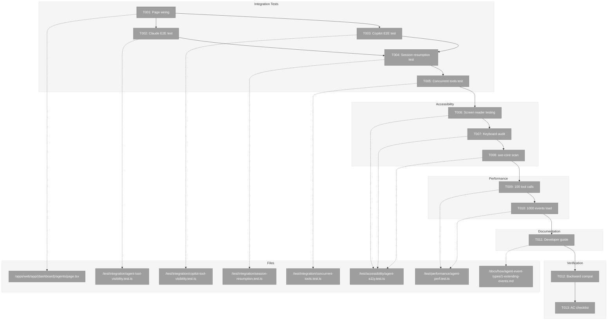
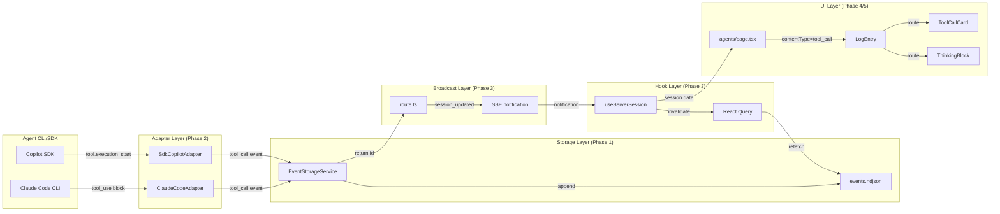
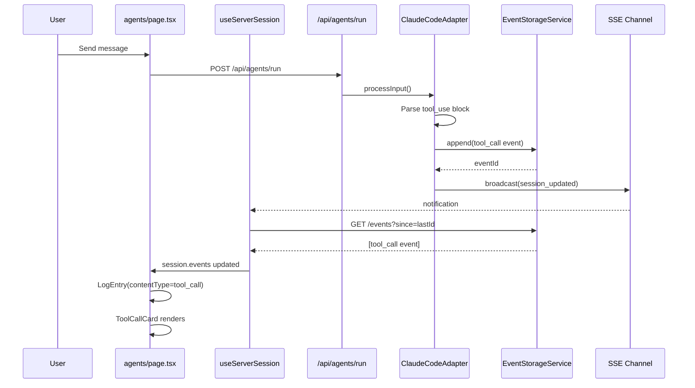

# Phase 5: Integration & Accessibility – Tasks & Alignment Brief

**Spec**: [../better-agents-spec.md](../better-agents-spec.md)
**Plan**: [../better-agents-plan.md](../better-agents-plan.md)
**Date**: 2026-01-27

---

## Executive Briefing

### Purpose
This phase wires together all the infrastructure built in Phases 1-4 into a fully functioning end-to-end system, then validates it against accessibility standards and performance baselines. It's the final phase that transforms isolated components into a production-ready feature.

### What We're Building
Complete integration of:
- **Agents page wiring**: Connect `useServerSession` hook to the agents page, replacing localStorage-based state with server-backed events
- **contentType routing**: Wire `LogEntry` component to render tool calls, tool results, and thinking blocks using Phase 4 components
- **Session resumption**: Page refresh reloads events from NDJSON storage via the Phase 3 notification-fetch pattern
- **Accessibility compliance**: Screen reader support, keyboard navigation, axe-core zero-violation baseline
- **Performance validation**: 100 tool calls and 1000 events respond within <500ms
- **Developer documentation**: Guide for extending event types across all 3 layers

### User Value
Users gain full visibility into agent activity:
- Watch tools execute in real-time (bash commands, file reads)
- See tool outputs (command results, file contents)
- Observe AI reasoning (thinking blocks)
- Resume sessions after page refresh without data loss
- Navigate entirely by keyboard or screen reader

### Example
**Before**: User sends "list files" → sees only final text response after ~5s
**After**: User sends "list files" →
1. Sees `Bash: ls -la` tool card appear within 500ms (running state)
2. Watches output stream into the card
3. Card transitions to "complete" state with green checkmark
4. Final assistant message appears below
5. Page refresh → all tool activity still visible (restored from storage)

---

## Objectives & Scope

### Objective
Complete end-to-end integration of agent activity visibility and verify all 22 acceptance criteria from the spec.

### Goals

- ✅ Wire agents page to use `useServerSession` for server-backed state
- ✅ Connect `LogEntry` contentType routing to display tool calls, tool results, thinking
- ✅ Verify Claude tool call → storage → SSE notification → UI display pipeline
- ✅ Verify Copilot tool call → storage → SSE notification → UI display pipeline
- ✅ Verify session resumption after page refresh (events fetched from storage)
- ✅ Verify concurrent tool calls render in correct order
- ✅ Pass screen reader testing (VoiceOver/NVDA)
- ✅ Pass keyboard navigation audit
- ✅ Pass axe-core scan with zero critical/serious violations
- ✅ Performance baseline: UI responsive with 100 tool calls
- ✅ Performance baseline: Load time <500ms with 1000 events
- ✅ Write developer guide for adding new event types
- ✅ Verify backward compatibility with existing sessions (no contentType field)
- ✅ All 22 spec acceptance criteria verified

### Non-Goals

- ❌ Virtualization for very large event lists (NG5 from spec—defer to future optimization)
- ❌ Refactoring agent-session-dialog.tsx (keep existing dialog working, don't break it)
- ❌ Performance optimization beyond baseline verification (future phase if needed)
- ❌ New event types beyond tool_call, tool_result, thinking (spec scope)
- ❌ Multi-workspace support (hardcoded "default" per spec AD1)
- ❌ Event compression or rotation (simplicity over optimization per spec NG5)

---

## Architecture Map

### Component Diagram
<!-- Status: grey=pending, orange=in-progress, green=completed, red=blocked -->
<!-- Updated by plan-6 during implementation -->



### Task-to-Component Mapping

<!-- Status: ⬜ Pending | 🟧 In Progress | ✅ Complete | 🔴 Blocked -->

| Task | Component(s) | Files | Status | Comment |
|------|-------------|-------|--------|---------|
| T001 | Page Integration | agents/page.tsx | ⬜ Pending | Wire useServerSession + contentType routing |
| T002 | Integration Test | agent-tool-visibility.test.ts | ⬜ Pending | Claude CLI → storage → SSE → UI |
| T003 | Integration Test | copilot-tool-visibility.test.ts | ⬜ Pending | Copilot SDK → storage → SSE → UI |
| T004 | Integration Test | session-resumption.test.ts | ⬜ Pending | Page refresh recovery (AC18) |
| T005 | Integration Test | concurrent-tools.test.ts | ⬜ Pending | Multiple tools in correct order |
| T006 | Accessibility | agent-a11y.test.ts | ⬜ Pending | VoiceOver/NVDA manual testing |
| T007 | Accessibility | agent-a11y.test.ts | ⬜ Pending | Full keyboard navigation |
| T008 | Accessibility | agent-a11y.test.ts | ⬜ Pending | axe-core automated scan |
| T009 | Performance | agent-perf.test.ts | ⬜ Pending | 100 tool calls baseline |
| T010 | Performance | agent-perf.test.ts | ⬜ Pending | 1000 events load time |
| T011 | Documentation | 1-extending-events.md | ⬜ Pending | Developer guide for event types |
| T012 | Verification | backward-compat.test.ts | ⬜ Pending | Old sessions without contentType |
| T013 | Verification | N/A | ⬜ Pending | Final 22 AC checklist |

---

## Tasks

| Status | ID | Task | CS | Type | Dependencies | Absolute Path(s) | Validation | Subtasks | Notes |
|--------|-----|------|----|------|--------------|------------------|------------|----------|-------|
| [ ] | T001 | Wire agents page to useServerSession and contentType routing | 3 | Core | – | /home/jak/substrate/015-better-agents/apps/web/app/(dashboard)/agents/page.tsx | Page renders tool calls, results, thinking via LogEntry contentType | – | Per Phase 4 DYK-P4-03 |
| [ ] | T002 | Write integration test: Claude tool call → UI display | 3 | Test | T001 | /home/jak/substrate/015-better-agents/test/integration/agent-tool-visibility.test.ts | Full pipeline from adapter to rendered ToolCallCard | – | AC1, AC2, AC3 |
| [ ] | T003 | Write integration test: Copilot tool call → UI display | 3 | Test | T001 | /home/jak/substrate/015-better-agents/test/integration/copilot-tool-visibility.test.ts | Full pipeline with Copilot event model | – | AC4, AC7 |
| [ ] | T004 | Write integration test: Session resumption after refresh | 3 | Test | T002, T003 | /home/jak/substrate/015-better-agents/test/integration/session-resumption.test.ts | Events fetched from storage, UI restored | – | AC18 |
| [ ] | T005 | Write integration test: Concurrent tool calls | 2 | Test | T004 | /home/jak/substrate/015-better-agents/test/integration/concurrent-tools.test.ts | Multiple tools render in correct order | – | |
| [ ] | T006 | Perform screen reader testing (VoiceOver/NVDA) | 2 | A11y | T005 | /home/jak/substrate/015-better-agents/test/accessibility/agent-a11y.test.ts | All interactive elements announced correctly | – | AC14, AC15, Manual |
| [ ] | T007 | Perform keyboard navigation audit | 2 | A11y | T006 | /home/jak/substrate/015-better-agents/test/accessibility/agent-a11y.test.ts | Full page navigable without mouse | – | AC16, Manual |
| [ ] | T008 | Run axe-core accessibility scan | 1 | A11y | T007 | /home/jak/substrate/015-better-agents/test/accessibility/agent-a11y.test.ts | Zero critical/serious violations | – | Automated |
| [ ] | T009 | Performance test: 100 tool calls in session | 2 | Perf | T008 | /home/jak/substrate/015-better-agents/test/performance/agent-perf.test.ts | UI responsive, no visible lag | – | |
| [ ] | T010 | Performance test: 1000 events in NDJSON file | 2 | Perf | T009 | /home/jak/substrate/015-better-agents/test/performance/agent-perf.test.ts | Load time < 500ms | – | |
| [ ] | T011 | Write developer guide for adding event types | 2 | Doc | T010 | /home/jak/substrate/015-better-agents/docs/how/agent-event-types/1-extending-events.md | Guide covers all 3 layers + tests | – | |
| [ ] | T012 | Verify backward compatibility with existing sessions | 2 | Test | T011 | /home/jak/substrate/015-better-agents/test/integration/backward-compat.test.ts | Old sessions load without contentType field | – | AC21, AC22 |
| [ ] | T013 | Final acceptance criteria checklist | 1 | Verify | T012 | N/A - Manual verification | All 22 ACs verified with evidence | – | |

---

## Alignment Brief

### Prior Phases Review

#### Cross-Phase Synthesis

**Phase-by-Phase Summary (Evolution):**

| Phase | Focus | Key Achievement |
|-------|-------|-----------------|
| **Phase 1** | Event Storage Foundation | EventStorageService with NDJSON persistence, timestamp-based IDs, Zod schemas |
| **Phase 2** | Adapter Event Parsing | Claude + Copilot adapters emit tool_call, tool_result, thinking events |
| **Phase 3** | SSE Broadcast Integration | Notification-fetch pattern with useServerSession hook, React Query |
| **Phase 4** | UI Components | ToolCallCard, ThinkingBlock, LogEntry contentType routing (53 tests) |

**Cumulative Deliverables Available to Phase 5:**

| Phase | Component | Path | Purpose for Phase 5 |
|-------|-----------|------|---------------------|
| P1 | EventStorageService | `packages/shared/src/services/event-storage.service.ts` | Read events for tests |
| P1 | FakeEventStorage | `packages/shared/src/fakes/fake-event-storage.ts` | Test helpers: seedEvents(), assertEventStored() |
| P1 | AgentStoredEventSchema | `packages/shared/src/schemas/agent-event.schema.ts` | Validate events in tests |
| P1 | validateSessionId | `packages/shared/src/lib/validators/session-id-validator.ts` | Path traversal prevention |
| P1 | GET /events API | `apps/web/app/api/agents/sessions/[sessionId]/events/route.ts` | Fetch events for resumption tests |
| P2 | Claude adapter parsing | `packages/shared/src/adapters/claude-code.adapter.ts:438-560` | Test with real Claude fixtures |
| P2 | Copilot adapter parsing | `packages/shared/src/adapters/sdk-copilot-adapter.ts:238-292` | Test with real Copilot fixtures |
| P2 | FakeAgentAdapter | `packages/shared/src/fakes/fake-agent-adapter.ts:239-322` | emitToolCall(), emitToolResult(), emitThinking() |
| P2 | Contract tests | `test/contracts/agent-tool-events.contract.test.ts` | Reference for event shape parity |
| P3 | useServerSession | `apps/web/src/hooks/useServerSession.ts` | Server-backed session state for page |
| P3 | SessionMetadataService | `packages/shared/src/services/session-metadata.service.ts` | Session CRUD for tests |
| P3 | Providers | `apps/web/src/components/providers.tsx` | QueryClientProvider wrapper |
| P4 | ToolCallCard | `apps/web/src/components/agents/tool-call-card.tsx` | Tool call/result display |
| P4 | ThinkingBlock | `apps/web/src/components/agents/thinking-block.tsx` | Thinking block display |
| P4 | LogEntry w/contentType | `apps/web/src/components/agents/log-entry.tsx` | Routes by contentType |
| P4 | ToolData, ThinkingData | `apps/web/src/components/agents/log-entry.tsx:29-56` | Props interfaces |

**Pattern Evolution:**
- Phase 1 established: Zod-first schema derivation, timestamp-based IDs
- Phase 2 established: Factory-based contract tests, additive code paths
- Phase 3 established: Notification-fetch (SSE hints, fetch is truth), React Query for state
- Phase 4 established: contentType routing, ToolData/ThinkingData interfaces

**Recurring Issues:**
- Schema mismatch between existing dialog (`role: 'tool'`) and new events (`contentType: 'tool_call'`) - Phase 5 handles via transformation or keeping separate
- TDD RED tests in Phase 3 useServerSession.test.ts still skipped (8 tests) - not blocking

**Reusable Test Infrastructure:**
- FakeEventStorage from Phase 1 for seeding/asserting events
- FakeAgentAdapter from Phase 2 for emitting test events
- Contract test factory pattern from Phase 2 for parity testing

#### Phase 1 Summary
- **Deliverables**: EventStorageService, IEventStorage interface, FakeEventStorage, Zod schemas (AgentToolCallEventSchema, AgentToolResultEventSchema, AgentThinkingEventSchema), GET /events API route, DI token EVENT_STORAGE
- **Key Decisions**: Timestamp-based IDs (avoid race conditions), silent skip for malformed NDJSON, dual-layer testing (real fs + DI fakes)
- **Dependencies Exported**: All event types, storage interface, API endpoint
- **Test Infrastructure**: 88 new tests, FakeEventStorage.seedEvents()/assertEventStored()

#### Phase 2 Summary
- **Deliverables**: Claude adapter tool_use/tool_result/thinking parsing, Copilot adapter tool.execution_*/assistant.reasoning parsing, contract tests
- **Key Decisions**: Return AgentEvent[] from Claude translator (mixed content blocks), factory-based contract tests, optional signature field
- **Dependencies Exported**: Adapters emit tool_call/tool_result/thinking events, FakeAgentAdapter helpers
- **Test Infrastructure**: 35 new tests, contract test factory pattern

#### Phase 3 Summary
- **Deliverables**: useServerSession hook, SessionMetadataService, Providers wrapper, route.ts event persistence + notification broadcast
- **Key Decisions**: Notification-fetch pattern (SSE is hint, fetch is truth), React Query for dedup, new hook vs modifying existing
- **Dependencies Exported**: useServerSession(), sessionQueryKey(), ServerSession interface
- **Test Infrastructure**: 8 TDD RED tests (stubs for future), real integration via route.ts changes

#### Phase 4 Summary
- **Deliverables**: ToolCallCard (258 lines), ThinkingBlock (121 lines), LogEntry contentType routing (+103 lines), ToolData/ThinkingData interfaces
- **Key Decisions**: Extract patterns from agent-session-dialog.tsx, dual contentType + messageRole discrimination
- **Critical Incomplete Item**: agents/page.tsx NOT wired to useServerSession (DYK-P4-03) - Phase 5 must complete this
- **Test Infrastructure**: 53 new tests (30 ToolCallCard, 16 ThinkingBlock, 7 LogEntry routing)

### Critical Findings Affecting This Phase

| Finding | Impact on Phase 5 | Tasks Addressing |
|---------|-------------------|------------------|
| **Critical Discovery 01**: Event storage before adapters | Foundation complete - Phase 5 can test full pipeline | T002-T005 |
| **Critical Discovery 02**: Three-layer sync atomic | All layers implemented - Phase 5 verifies integration | T002-T004 |
| **High Discovery 06**: Component needs contentType discrimination | Implemented in Phase 4 - Phase 5 wires to page | T001 |
| **Phase 4 DYK-P4-03**: Page not using useServerSession | Phase 5 must complete wiring | T001 |
| **Phase 4 DYK-P4-02**: Schema mismatch (dialog uses role: 'tool') | Keep existing dialog working, don't break it | T012 (non-goal: no dialog refactor) |

### ADR Decision Constraints

| ADR | Decision | Constraints for Phase 5 | Tasks Affected |
|-----|----------|-------------------------|----------------|
| **ADR-0007** | Single-channel SSE routing | Events include sessionId, route by ID not active session | T002-T005 |
| **ADR-0007 IMP-003** | API response fallback | Test that backgrounded tabs recover via API response | T004 |

### Invariants & Guardrails

- **Performance**: Page must remain responsive with 100+ tool calls
- **Load Time**: 1000 events must load in <500ms
- **Accessibility**: Zero critical/serious axe-core violations
- **Backward Compatibility**: Sessions without contentType must still render (default to 'text')

### Inputs to Read

| Path | Purpose |
|------|---------|
| `/home/jak/substrate/015-better-agents/apps/web/app/(dashboard)/agents/page.tsx` | Page to wire |
| `/home/jak/substrate/015-better-agents/apps/web/src/hooks/useServerSession.ts` | Hook to integrate |
| `/home/jak/substrate/015-better-agents/apps/web/src/components/agents/log-entry.tsx` | contentType routing |
| `/home/jak/substrate/015-better-agents/packages/shared/src/fakes/fake-event-storage.ts` | Test helpers |
| `/home/jak/substrate/015-better-agents/packages/shared/src/fakes/fake-agent-adapter.ts` | Event emitter helpers |
| `/home/jak/substrate/015-better-agents/test/contracts/agent-tool-events.contract.test.ts` | Reference for event shapes |
| `/home/jak/substrate/015-better-agents/docs/plans/015-better-agents/better-agents-spec.md` | AC definitions |

### Visual Alignment Aids

#### Flow Diagram: Full Event Pipeline



#### Sequence Diagram: Tool Call Flow



### Test Plan

| Test | Type | Rationale | Fixtures | Expected Output |
|------|------|-----------|----------|-----------------|
| Claude tool call E2E | Integration | Verify full pipeline (AC1, AC2, AC3) | CLAUDE_TOOL_USE_FIXTURE from plan | ToolCallCard visible with "Bash: ls -la" |
| Copilot tool call E2E | Integration | Verify different event model (AC4, AC7) | COPILOT_TOOL_EXECUTION_FIXTURE | ToolCallCard visible |
| Session resumption | Integration | Verify storage recovery (AC18) | Pre-seeded events.ndjson | All events restored after refresh |
| Concurrent tools | Integration | Verify ordering | 3 rapid tool_call events | Rendered in timestamp order |
| Screen reader | A11y | Verify announcements (AC14, AC15) | Running session | All elements announced correctly |
| Keyboard nav | A11y | Verify no mouse needed (AC16) | Full page | Tab through all controls |
| axe-core scan | A11y | Automated violations | Page with tool cards | Zero critical/serious |
| 100 tool calls | Perf | Verify responsiveness | Seeded 100 events | No visible lag on scroll |
| 1000 events load | Perf | Verify load time | Seeded 1000 events | Load < 500ms |
| Backward compat | Integration | Old sessions work (AC21, AC22) | Events without contentType | Default to text rendering |

**Mock Usage**: Per spec, use real fixtures from Phase 2 contract tests. FakeEventStorage for seeding test data, but EventStorageService for actual storage operations.

### Step-by-Step Implementation Outline

| Step | Task | Action |
|------|------|--------|
| 1 | T001 | Refactor agents/page.tsx to import useServerSession, map events to LogEntry with contentType |
| 2 | T002 | Create agent-tool-visibility.test.ts with Claude fixture, verify ToolCallCard renders |
| 3 | T003 | Create copilot-tool-visibility.test.ts with Copilot fixture, verify ToolCallCard renders |
| 4 | T004 | Create session-resumption.test.ts, seed events, simulate refresh, verify restoration |
| 5 | T005 | Create concurrent-tools.test.ts, emit 3 rapid events, verify order preserved |
| 6 | T006 | Manual VoiceOver/NVDA testing, document results in execution.log.md |
| 7 | T007 | Manual keyboard testing, document Tab order and Enter/Space toggles |
| 8 | T008 | Add axe-core to agent-a11y.test.ts, verify zero critical/serious |
| 9 | T009 | Create agent-perf.test.ts, seed 100 events, measure render time |
| 10 | T010 | Add 1000-event load test, verify < 500ms |
| 11 | T011 | Create docs/how/agent-event-types/1-extending-events.md |
| 12 | T012 | Create backward-compat.test.ts, verify events without contentType render |
| 13 | T013 | Walk through all 22 ACs with evidence, document in execution.log.md |

### Commands to Run

```bash
# Development
pnpm dev                     # Start dev server for manual testing

# Quality Checks
just fft                     # Fix, Format, Test (main quality gate)
just lint                    # Biome linter
just typecheck               # TypeScript strict mode
just test                    # Run all tests

# Specific Test Commands
pnpm test test/integration/agent-tool-visibility.test.ts  # Claude E2E
pnpm test test/integration/copilot-tool-visibility.test.ts  # Copilot E2E
pnpm test test/integration/session-resumption.test.ts  # Resumption
pnpm test test/accessibility/agent-a11y.test.ts  # A11y scan
pnpm test test/performance/agent-perf.test.ts  # Performance

# Build Verification
just build                   # Production build
```

### Risks & Unknowns

| Risk | Severity | Likelihood | Mitigation |
|------|----------|------------|------------|
| E2E test flakiness | Low | Medium | Use deterministic fixtures, retry logic |
| Screen reader testing requires manual effort | Medium | High | Budget time, document findings |
| Performance regression with many events | Medium | Low | Baseline first, alert on regression |
| Copilot SDK changes (technical preview) | Low | Low | Use fixtures from Phase 2, mock SDK |

### Ready Check

- [ ] Prior phases reviewed (Phases 1-4 complete, 53+ tests from Phase 4)
- [ ] ADR constraints mapped (ADR-0007 IMP-003 in T004)
- [ ] Critical findings from plan addressed in task design
- [ ] Test fixtures identified (contract tests from Phase 2)
- [ ] Inputs to read listed with absolute paths
- [ ] Commands verified (just fft, pnpm test patterns)

**Await explicit GO/NO-GO before proceeding to plan-6-implement-phase.**

---

## Phase Footnote Stubs

| Footnote | Date | Phase | Topic | Files Affected |
|----------|------|-------|-------|----------------|
| | | | | |

_Populated by plan-6 during implementation._

---

## Evidence Artifacts

| Artifact | Path | Purpose |
|----------|------|---------|
| Execution Log | `./execution.log.md` | Implementation narrative, decisions, issues |
| Integration Tests | `/test/integration/agent-*.test.ts` | E2E verification |
| A11y Tests | `/test/accessibility/agent-a11y.test.ts` | Accessibility verification |
| Performance Tests | `/test/performance/agent-perf.test.ts` | Performance baselines |
| Developer Guide | `/docs/how/agent-event-types/1-extending-events.md` | Documentation deliverable |

---

## Discoveries & Learnings

_Populated during implementation by plan-6. Log anything of interest to your future self._

| Date | Task | Type | Discovery | Resolution | References |
|------|------|------|-----------|------------|------------|
| | | | | | |

**Types**: `gotcha` | `research-needed` | `unexpected-behavior` | `workaround` | `decision` | `debt` | `insight`

**What to log**:
- Things that didn't work as expected
- External research that was required
- Implementation troubles and how they were resolved
- Gotchas and edge cases discovered
- Decisions made during implementation
- Technical debt introduced (and why)
- Insights that future phases should know about

_See also: `execution.log.md` for detailed narrative._

---

## Directory Layout

```
docs/plans/015-better-agents/
  ├── better-agents-spec.md
  ├── better-agents-plan.md
  └── tasks/
      ├── phase-1-event-storage-foundation/
      │   ├── tasks.md
      │   └── execution.log.md
      ├── phase-2-adapter-event-parsing/
      │   ├── tasks.md
      │   └── execution.log.md
      ├── phase-3-sse-broadcast-integration/
      │   ├── tasks.md
      │   └── execution.log.md
      ├── phase-4-ui-components/
      │   ├── tasks.md
      │   └── execution.log.md
      └── phase-5-integration-accessibility/   # ← THIS PHASE
          ├── tasks.md                        # ← THIS FILE
          └── execution.log.md                # ← Created by plan-6
```
