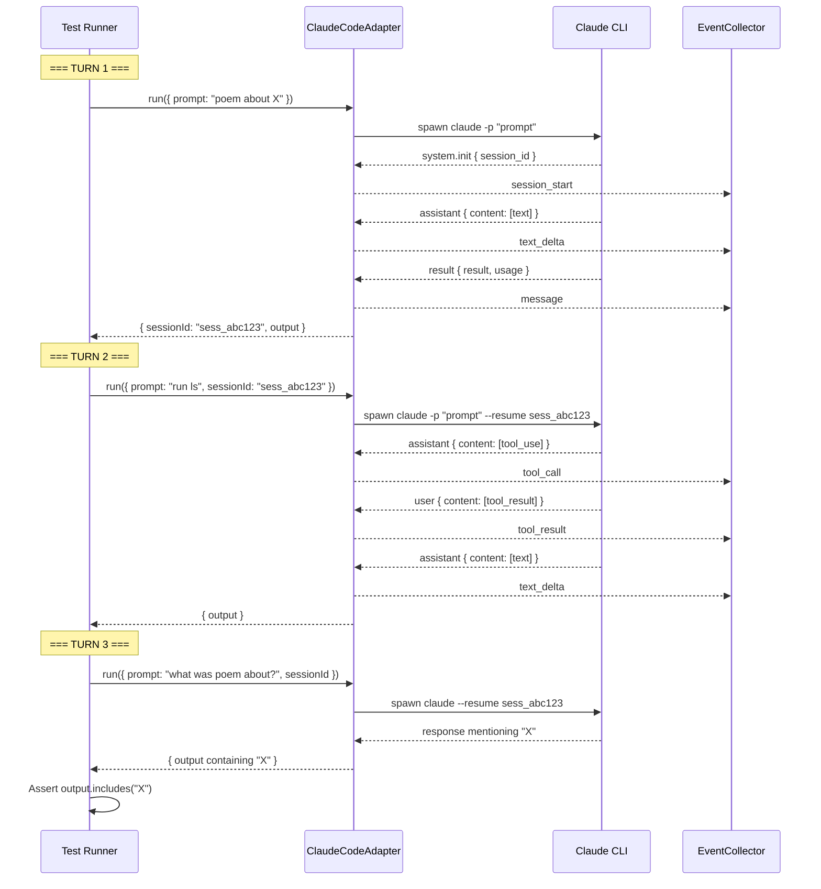

# Workshop: Real Agent Multi-Turn Integration Tests

**Type**: Integration Pattern  
**Plan**: 015-better-agents  
**Spec**: [Phase 5 Tasks](../tasks/phase-5-integration-accessibility/tasks.md)  
**Subtask**: [001-subtask-real-agent-multi-turn-tests](../tasks/phase-5-integration-accessibility/001-subtask-real-agent-multi-turn-tests.md)  
**Created**: 2026-01-27  
**Status**: Draft

**Related Documents**:
- [ADR-0007: Single SSE Channel with sessionId Routing](../../decisions/adr-0007-sse-routing.md)
- [Phase 2 Contract Tests](../../../../test/contracts/agent-tool-events.contract.test.ts)
- [demo-claude-multi-turn.ts](../../../../scripts/agent/demo-claude-multi-turn.ts)
- [demo-copilot-multi-turn.ts](../../../../scripts/agent/demo-copilot-multi-turn.ts)

---

## Purpose

Design a comprehensive, practical test harness for verifying that **real adapters** (Claude CLI & Copilot SDK) emit the new Phase 2 event types (`tool_call`, `tool_result`, `thinking`) correctly across multi-turn conversations with session reuse.

These tests are our "source of truth" for adapter behavior—when SSE or UI issues arise, we can isolate whether the problem is at the adapter layer or further downstream.

## Key Questions Addressed

- **Q1**: How do we capture and assert on `tool_call`/`tool_result` events from real agents?
- **Q2**: How do we prove session context is retained across multiple turns?
- **Q3**: How do we handle LLM non-determinism in assertions?
- **Q4**: How do we structure tests that are skip-by-default but runnable manually?
- **Q5**: How do we extract the sessionId from Turn 1 and reuse it in Turn 2?

---

## Overview

Unlike the existing contract tests (which use fakes), these integration tests talk to **real agents**:

| Aspect | Contract Tests | Real Agent Tests |
|--------|---------------|-----------------|
| Adapter | Fakes (FakeProcessManager, FakeCopilotClient) | Real (UnixProcessManager, CopilotClient) |
| Events | Pre-configured fixtures | Actual CLI/SDK output |
| Speed | Fast (~10ms) | Slow (10-60s per turn) |
| CI | Yes | No (describe.skip) |
| Auth | Not required | Required |

### Test Pattern Summary

```
┌──────────────────────────────────────────────────────────────────────────┐
│                         3-TURN TEST PATTERN                              │
├──────────────────────────────────────────────────────────────────────────┤
│                                                                          │
│  TURN 1: ESTABLISH CONTEXT                                               │
│  ┌────────────────────────────────────────────────────────────────────┐  │
│  │ Prompt: "Write a short poem about [random subject]"                │  │
│  │ Purpose: Get sessionId, establish context                          │  │
│  │ Capture: sessionId, basic events                                   │  │
│  └────────────────────────────────────────────────────────────────────┘  │
│                              │                                           │
│                              ▼                                           │
│  TURN 2: TRIGGER TOOL USE                                                │
│  ┌────────────────────────────────────────────────────────────────────┐  │
│  │ Prompt: "List the files in the current directory using ls"        │  │
│  │ Options: { sessionId } ← reuse from Turn 1                         │  │
│  │ Capture: tool_call, tool_result events ⬅ THE KEY ASSERTION         │  │
│  └────────────────────────────────────────────────────────────────────┘  │
│                              │                                           │
│                              ▼                                           │
│  TURN 3: VERIFY CONTEXT RETENTION                                        │
│  ┌────────────────────────────────────────────────────────────────────┐  │
│  │ Prompt: "What subject did you write the poem about?"               │  │
│  │ Options: { sessionId } ← same sessionId                            │  │
│  │ Assert: Response contains original subject                         │  │
│  └────────────────────────────────────────────────────────────────────┘  │
│                                                                          │
└──────────────────────────────────────────────────────────────────────────┘
```

---

## Test File Structure

### Location & Naming

```
test/integration/
├── agent-streaming.test.ts        # Existing: streaming events
├── claude-code-adapter.test.ts    # Existing: Claude adapter basics
├── sdk-copilot-adapter.test.ts    # Existing: Copilot adapter basics
└── real-agent-multi-turn.test.ts  # NEW: Multi-turn with tool events
```

### Imports

```typescript
// File: test/integration/real-agent-multi-turn.test.ts

import { execSync } from 'node:child_process';
import type {
  AgentEvent,
  AgentToolCallEvent,
  AgentToolResultEvent,
  AgentThinkingEvent,
} from '@chainglass/shared';
import { beforeAll, describe, expect, it } from 'vitest';
```

### Skip Logic Pattern

Follow the existing pattern from `agent-streaming.test.ts`:

```typescript
/**
 * Check if Claude CLI is installed and authenticated.
 */
function hasClaudeCli(): boolean {
  try {
    execSync('claude --version', { stdio: 'ignore', timeout: 5000 });
    return true;
  } catch {
    return false;
  }
}

/**
 * Check if Copilot SDK is available.
 */
function hasCopilotCli(): boolean {
  try {
    execSync('npx -y @github/copilot --version', { stdio: 'ignore', timeout: 30000 });
    return true;
  } catch {
    return false;
  }
}
```

---

## Adapter Initialization

### Claude Adapter Setup

```typescript
// Dynamic imports to avoid loading in unit test context
let ClaudeCodeAdapter: Awaited<typeof import('@chainglass/shared')>['ClaudeCodeAdapter'];
let UnixProcessManager: Awaited<typeof import('@chainglass/shared')>['UnixProcessManager'];
let FakeLogger: Awaited<typeof import('@chainglass/shared')>['FakeLogger'];

beforeAll(async () => {
  const shared = await import('@chainglass/shared');
  ClaudeCodeAdapter = shared.ClaudeCodeAdapter;
  UnixProcessManager = shared.UnixProcessManager;
  FakeLogger = shared.FakeLogger;
});

// Adapter creation helper
function createClaudeAdapter() {
  const logger = new FakeLogger();
  const processManager = new UnixProcessManager(logger);
  return new ClaudeCodeAdapter(processManager, { logger });
}
```

### Copilot Adapter Setup

```typescript
let SdkCopilotAdapter: Awaited<typeof import('@chainglass/shared/adapters')>['SdkCopilotAdapter'];
let CopilotClient: Awaited<typeof import('@github/copilot-sdk')>['CopilotClient'];

beforeAll(async () => {
  const adapters = await import('@chainglass/shared/adapters');
  const sdk = await import('@github/copilot-sdk');
  SdkCopilotAdapter = adapters.SdkCopilotAdapter;
  CopilotClient = sdk.CopilotClient;
});

// Adapter creation helper
function createCopilotAdapter() {
  const client = new CopilotClient();
  return { adapter: new SdkCopilotAdapter(client), client };
}
```

---

## Event Capture Pattern

### Event Collector Class

Create a reusable collector that categorizes events:

```typescript
/**
 * Collects and categorizes events during adapter.run()
 */
class EventCollector {
  private _all: AgentEvent[] = [];

  get all(): AgentEvent[] {
    return [...this._all];
  }

  get toolCalls(): AgentToolCallEvent[] {
    return this._all.filter((e): e is AgentToolCallEvent => e.type === 'tool_call');
  }

  get toolResults(): AgentToolResultEvent[] {
    return this._all.filter((e): e is AgentToolResultEvent => e.type === 'tool_result');
  }

  get thinking(): AgentThinkingEvent[] {
    return this._all.filter((e): e is AgentThinkingEvent => e.type === 'thinking');
  }

  get textDeltas(): AgentEvent[] {
    return this._all.filter((e) => e.type === 'text_delta');
  }

  handler = (event: AgentEvent): void => {
    this._all.push(event);
  };

  clear(): void {
    this._all = [];
  }

  /**
   * Pretty-print events for debugging
   */
  dump(): void {
    console.log('\n=== Event Dump ===');
    for (const event of this._all) {
      const ts = event.timestamp.split('T')[1]?.slice(0, 12) ?? '';
      console.log(`[${ts}] ${event.type}`, JSON.stringify(event.data).slice(0, 80));
    }
    console.log(`=== ${this._all.length} events ===\n`);
  }
}
```

### Usage in Test

```typescript
it('should capture tool_call and tool_result events', async () => {
  const adapter = createClaudeAdapter();
  const events = new EventCollector();

  const result = await adapter.run({
    prompt: 'List files using ls',
    onEvent: events.handler,
  });

  // Debug output (helpful when test fails)
  if (events.toolCalls.length === 0) {
    events.dump();
  }

  expect(events.toolCalls.length).toBeGreaterThanOrEqual(1);
  expect(events.toolResults.length).toBeGreaterThanOrEqual(1);
});
```

---

## Session Reuse Pattern

### Key Insight: `sessionId` Extraction

From `demo-claude-multi-turn.ts` lines 131-143:

```typescript
// Turn 1: Get sessionId
const turn1Result = await adapter.run({
  prompt: turn1Prompt,
  onEvent: (event) => events.push(event),
});

// Extract sessionId for reuse
const sessionId = turn1Result.sessionId;

// Turn 2: Reuse sessionId
const turn2Result = await adapter.run({
  prompt: turn2Prompt,
  sessionId,  // ← Pass the sessionId from Turn 1
  onEvent: (event) => events.push(event),
});
```

### Sequence Diagram



---

## Event Shape Reference

### tool_call Event

From `claude-code.adapter.ts` lines 479-488:

```typescript
// Claude CLI emits:
{
  "type": "assistant",
  "message": {
    "content": [
      {
        "type": "tool_use",
        "id": "toolu_01ABC123",
        "name": "Bash",
        "input": { "command": "ls -la" }
      }
    ]
  }
}

// Adapter translates to:
{
  type: 'tool_call',
  timestamp: '2026-01-27T12:30:00.000Z',
  data: {
    toolName: 'Bash',
    input: { command: 'ls -la' },
    toolCallId: 'toolu_01ABC123'
  }
}
```

### tool_result Event

From `claude-code.adapter.ts` lines 523-533:

```typescript
// Claude CLI emits:
{
  "type": "user",
  "message": {
    "content": [
      {
        "type": "tool_result",
        "tool_use_id": "toolu_01ABC123",
        "content": "file1.txt\nfile2.txt\n",
        "is_error": false
      }
    ]
  }
}

// Adapter translates to:
{
  type: 'tool_result',
  timestamp: '2026-01-27T12:30:01.000Z',
  data: {
    toolCallId: 'toolu_01ABC123',
    output: 'file1.txt\nfile2.txt\n',
    isError: false
  }
}
```

### thinking Event

```typescript
// Claude CLI emits (extended thinking mode):
{
  "type": "assistant",
  "message": {
    "content": [
      {
        "type": "thinking",
        "thinking": "Let me analyze the request...",
        "signature": "sig_abc123"
      }
    ]
  }
}

// Adapter translates to:
{
  type: 'thinking',
  timestamp: '2026-01-27T12:30:02.000Z',
  data: {
    content: 'Let me analyze the request...',
    signature: 'sig_abc123'  // Optional
  }
}
```

---

## Complete Test Implementation

### Claude 3-Turn Test

```typescript
describe.skip('Claude Real Multi-Turn Tests', { timeout: 120_000 }, () => {
  let ClaudeCodeAdapter: typeof import('@chainglass/shared')['ClaudeCodeAdapter'];
  let UnixProcessManager: typeof import('@chainglass/shared')['UnixProcessManager'];
  let FakeLogger: typeof import('@chainglass/shared')['FakeLogger'];

  beforeAll(async () => {
    if (!hasClaudeCli()) {
      console.log('Claude CLI not installed - skipping');
      return;
    }
    const shared = await import('@chainglass/shared');
    ClaudeCodeAdapter = shared.ClaudeCodeAdapter;
    UnixProcessManager = shared.UnixProcessManager;
    FakeLogger = shared.FakeLogger;
  });

  it('should emit tool_call and tool_result events across multi-turn session', async () => {
    /**
     * Test Doc:
     * - Why: Proves adapters emit new Phase 2 event types with real agents
     * - Contract: tool_call/tool_result events have correct shapes per schema
     * - Usage Notes: Requires Claude CLI authenticated, takes ~60s
     * - Quality Contribution: Source of truth for adapter behavior
     */
    const logger = new FakeLogger();
    const processManager = new UnixProcessManager(logger);
    const adapter = new ClaudeCodeAdapter(processManager, { logger });

    // Random subject to avoid caching/memorization
    const subjects = ['quantum physics', 'ancient Rome', 'jazz music', 'coral reefs', 'origami'];
    const subject = subjects[Math.floor(Math.random() * subjects.length)];

    // === TURN 1: Establish context ===
    console.log(`\n=== Turn 1: Writing poem about "${subject}" ===`);
    const turn1Events = new EventCollector();
    
    const turn1Result = await adapter.run({
      prompt: `Write a very short (2 line) poem about ${subject}. Be concise.`,
      onEvent: turn1Events.handler,
    });

    expect(turn1Result.status).toBe('completed');
    expect(turn1Result.sessionId).toBeTruthy();
    console.log(`SessionId: ${turn1Result.sessionId}`);
    console.log(`Turn 1 events: ${turn1Events.all.length}`);

    const sessionId = turn1Result.sessionId;

    // === TURN 2: Trigger tool use ===
    console.log('\n=== Turn 2: Triggering tool use (ls) ===');
    const turn2Events = new EventCollector();

    const turn2Result = await adapter.run({
      prompt: 'Please list the files in the current directory using the ls command.',
      sessionId,
      onEvent: turn2Events.handler,
    });

    expect(turn2Result.status).toBe('completed');
    
    // KEY ASSERTION: We captured tool events
    console.log(`Turn 2 events: ${turn2Events.all.length}`);
    console.log(`  tool_call: ${turn2Events.toolCalls.length}`);
    console.log(`  tool_result: ${turn2Events.toolResults.length}`);

    if (turn2Events.toolCalls.length === 0) {
      turn2Events.dump();
      throw new Error('Expected at least one tool_call event');
    }

    expect(turn2Events.toolCalls.length).toBeGreaterThanOrEqual(1);
    expect(turn2Events.toolResults.length).toBeGreaterThanOrEqual(1);

    // Verify tool_call shape
    const toolCall = turn2Events.toolCalls[0];
    expect(toolCall.data.toolName).toBeTruthy();
    expect(toolCall.data.toolCallId).toBeTruthy();
    expect(toolCall.timestamp).toMatch(/^\d{4}-\d{2}-\d{2}T/);

    // Verify tool_result shape
    const toolResult = turn2Events.toolResults[0];
    expect(toolResult.data.toolCallId).toBeTruthy();
    expect(typeof toolResult.data.output).toBe('string');
    expect(typeof toolResult.data.isError).toBe('boolean');

    // Verify correlation: tool_result links to tool_call
    expect(toolResult.data.toolCallId).toBe(toolCall.data.toolCallId);

    // === TURN 3: Verify context retention ===
    console.log('\n=== Turn 3: Verifying context retention ===');
    const turn3Events = new EventCollector();

    const turn3Result = await adapter.run({
      prompt: 'What was the subject of the poem you wrote earlier? Just say the topic in one word.',
      sessionId,
      onEvent: turn3Events.handler,
    });

    expect(turn3Result.status).toBe('completed');
    
    // Context check: output should mention the subject
    const outputLower = turn3Result.output.toLowerCase();
    const subjectLower = subject.toLowerCase().split(' ')[0]; // First word of subject
    
    console.log(`Subject was: "${subject}"`);
    console.log(`Turn 3 output: "${turn3Result.output}"`);

    expect(outputLower).toContain(subjectLower);
    
    console.log('\n✓ All assertions passed');
  });
});
```

### Copilot 3-Turn Test

```typescript
describe.skip('Copilot Real Multi-Turn Tests', { timeout: 120_000 }, () => {
  let SdkCopilotAdapter: typeof import('@chainglass/shared/adapters')['SdkCopilotAdapter'];
  let CopilotClient: typeof import('@github/copilot-sdk')['CopilotClient'];

  beforeAll(async () => {
    if (!hasCopilotCli()) {
      console.log('Copilot SDK not available - skipping');
      return;
    }
    const adapters = await import('@chainglass/shared/adapters');
    const sdk = await import('@github/copilot-sdk');
    SdkCopilotAdapter = adapters.SdkCopilotAdapter;
    CopilotClient = sdk.CopilotClient;
  });

  it('should emit tool_call and tool_result events across multi-turn session', async () => {
    /**
     * Test Doc:
     * - Why: Proves Copilot adapter emits same event shapes as Claude
     * - Contract: tool_call/tool_result match Phase 2 contract tests
     * - Usage Notes: Requires Copilot SDK authenticated
     */
    const client = new CopilotClient();
    const adapter = new SdkCopilotAdapter(client);

    try {
      const subjects = ['neural networks', 'medieval castles', 'blues guitar', 'rainforests', 'chess'];
      const subject = subjects[Math.floor(Math.random() * subjects.length)];

      // === TURN 1: Establish context ===
      console.log(`\n=== Turn 1: Writing poem about "${subject}" ===`);
      const turn1Events = new EventCollector();
      
      const turn1Result = await adapter.run({
        prompt: `Write a very short (2 line) poem about ${subject}. Be concise.`,
        onEvent: turn1Events.handler,
      });

      expect(turn1Result.status).toBe('completed');
      expect(turn1Result.sessionId).toBeTruthy();

      const sessionId = turn1Result.sessionId;

      // === TURN 2: Trigger tool use ===
      console.log('\n=== Turn 2: Triggering tool use (ls) ===');
      const turn2Events = new EventCollector();

      const turn2Result = await adapter.run({
        prompt: 'Please list the files in the current directory using the ls command.',
        sessionId,
        onEvent: turn2Events.handler,
      });

      expect(turn2Result.status).toBe('completed');
      
      console.log(`Turn 2 events: ${turn2Events.all.length}`);
      console.log(`  tool_call: ${turn2Events.toolCalls.length}`);
      console.log(`  tool_result: ${turn2Events.toolResults.length}`);

      // Copilot tool events come from tool.execution_start / tool.execution_complete
      expect(turn2Events.toolCalls.length).toBeGreaterThanOrEqual(1);
      expect(turn2Events.toolResults.length).toBeGreaterThanOrEqual(1);

      // Verify same shape as Claude (contract parity)
      const toolCall = turn2Events.toolCalls[0];
      expect(toolCall.data.toolName).toBeTruthy();
      expect(toolCall.data.toolCallId).toBeTruthy();

      const toolResult = turn2Events.toolResults[0];
      expect(toolResult.data.toolCallId).toBe(toolCall.data.toolCallId);
      expect(typeof toolResult.data.isError).toBe('boolean');

      // === TURN 3: Verify context retention ===
      console.log('\n=== Turn 3: Verifying context retention ===');

      const turn3Result = await adapter.run({
        prompt: 'What was the subject of the poem you wrote earlier?',
        sessionId,
        onEvent: () => {},
      });

      expect(turn3Result.status).toBe('completed');
      expect(turn3Result.output.toLowerCase()).toContain(subject.toLowerCase().split(' ')[0]);
      
      console.log('\n✓ All assertions passed');
    } finally {
      await client.stop();
    }
  });
});
```

---

## Assertion Strategies

### Handling LLM Non-Determinism

| What to Assert | How | Why |
|----------------|-----|-----|
| Event structure | `expect(event.data.toolName).toBeTruthy()` | Structure is deterministic |
| Event correlation | `expect(result.toolCallId).toBe(call.toolCallId)` | IDs are generated by CLI |
| Event count | `expect(events.length).toBeGreaterThanOrEqual(1)` | At least one, not exact |
| Subject recall | `output.toLowerCase().includes(subject.split(' ')[0])` | First word match |

### What NOT to Assert

```typescript
// ❌ DON'T: Assert exact content
expect(turn1Result.output).toBe('Roses are red, violets are blue');

// ❌ DON'T: Assert exact event count
expect(events.toolCalls.length).toBe(3);

// ❌ DON'T: Assert timing
expect(toolResult.timestamp - toolCall.timestamp).toBeLessThan(1000);

// ✅ DO: Assert structure and shapes
expect(toolCall.data.toolName).toBeTruthy();
expect(typeof toolResult.data.isError).toBe('boolean');
```

---

## Error Handling

### Graceful Skip on Auth Failure

```typescript
it('should handle missing authentication gracefully', async () => {
  const adapter = createClaudeAdapter();
  const events = new EventCollector();

  try {
    await adapter.run({
      prompt: 'test',
      onEvent: events.handler,
    });
  } catch (error: unknown) {
    if (error instanceof Error && error.message.includes('authentication')) {
      console.log('Auth not configured - test inconclusive');
      return; // Skip without failing
    }
    throw error;
  }
});
```

### Timeout Configuration

```typescript
describe.skip('Real Agent Tests', {
  timeout: 120_000,  // 2 minutes per test
  retry: 0,           // Don't retry (non-deterministic)
}, () => {
  // ...
});
```

---

## Running the Tests

### Manual Execution

```bash
# Run with .skip removed (edit file first) or use vitest flag
npx vitest run test/integration/real-agent-multi-turn.test.ts \
  --no-file-parallelism \
  --reporter=verbose

# With debug output
DEBUG=1 npx vitest run test/integration/real-agent-multi-turn.test.ts

# Just Claude tests
npx vitest run test/integration/real-agent-multi-turn.test.ts \
  --testNamePattern "Claude"
```

### Prerequisites Check

```bash
# Check Claude CLI
claude --version

# Check Copilot SDK
npx @github/copilot --version

# Verify authentication
claude "say hello" --max-tokens 10
```

---

## Debugging Tips

### Event Dump on Failure

```typescript
if (events.toolCalls.length === 0) {
  console.log('\n=== FAILURE: No tool_call events captured ===');
  events.dump();
  console.log('Raw turn output:', turn2Result.output);
  console.log('Session ID:', turn2Result.sessionId);
  throw new Error('Expected at least one tool_call event');
}
```

### Verbose Logging Helper

```typescript
const logger = {
  debug: (msg: string, data?: unknown) => console.log(`[DEBUG] ${msg}`, data ?? ''),
  trace: (msg: string, data?: unknown) => console.log(`[TRACE] ${msg}`, data ?? ''),
  info: (msg: string, data?: unknown) => console.log(`[INFO] ${msg}`, data ?? ''),
  warn: (msg: string, data?: unknown) => console.warn(`[WARN] ${msg}`, data ?? ''),
  error: (msg: string, err?: Error) => console.error(`[ERROR] ${msg}`, err?.message ?? ''),
  fatal: (msg: string, err?: Error) => console.error(`[FATAL] ${msg}`, err?.message ?? ''),
  child: () => logger,
};
```

---

## Open Questions

### Q1: Should we test `thinking` events?

**OPEN**: Thinking events require extended thinking mode which is:
- Claude: Requires specific flag or model capability
- Copilot: Only emitted with reasoning mode

**Options**:
- A: Skip thinking tests (Phase 2 contract tests already verify shape)
- B: Add separate test for thinking with specific prompts that trigger reasoning

**Recommendation**: Option A for now. Thinking events are verified by contract tests. Real agent tests focus on tool events (the primary user-visible feature).

### Q2: What if tool use is not triggered?

**RESOLVED**: The prompt "Please list the files in the current directory using the ls command" reliably triggers tool use because:
- It explicitly asks for file listing
- It mentions "using ls command" which hints at Bash tool
- We're in a cwd with files

If it still doesn't trigger, the test dumps all events for debugging.

### Q3: How to handle rate limits?

**RESOLVED**: These tests are `describe.skip` and run manually. Rate limits shouldn't be an issue for occasional manual runs. If they become a problem:
- Add delay between tests
- Skip tests if rate limit error detected

---

## Quick Reference

### Test File Skeleton

```typescript
import { execSync } from 'node:child_process';
import type { AgentEvent, AgentToolCallEvent, AgentToolResultEvent } from '@chainglass/shared';
import { beforeAll, describe, expect, it } from 'vitest';

// Skip checks
function hasClaudeCli(): boolean { /* ... */ }
function hasCopilotCli(): boolean { /* ... */ }

// Event collector
class EventCollector { /* ... */ }

// Claude tests
describe.skip('Claude Real Multi-Turn', { timeout: 120_000 }, () => {
  // Dynamic imports in beforeAll
  // 3-turn test
});

// Copilot tests  
describe.skip('Copilot Real Multi-Turn', { timeout: 120_000 }, () => {
  // Dynamic imports in beforeAll
  // 3-turn test
});
```

### Key Assertions Checklist

- [ ] `turn1Result.sessionId` is truthy
- [ ] `turn2Events.toolCalls.length >= 1`
- [ ] `turn2Events.toolResults.length >= 1`
- [ ] `toolCall.data.toolName` is truthy
- [ ] `toolCall.data.toolCallId` is truthy
- [ ] `toolResult.data.toolCallId === toolCall.data.toolCallId`
- [ ] `turn3Result.output` contains subject

### Commands

```bash
# Quality check
just fft

# Run tests (after removing .skip)
npx vitest run test/integration/real-agent-multi-turn.test.ts --no-file-parallelism

# Run single adapter
npx vitest run test/integration/real-agent-multi-turn.test.ts --testNamePattern "Claude"
```

---

## Appendix: Event Type Reference

| Event Type | Source (Claude) | Source (Copilot) | Data Fields |
|------------|-----------------|------------------|-------------|
| `tool_call` | `assistant.message.content[].type === 'tool_use'` | `tool.execution_start` | `toolName`, `input`, `toolCallId` |
| `tool_result` | `user.message.content[].type === 'tool_result'` | `tool.execution_complete` | `toolCallId`, `output`, `isError` |
| `thinking` | `assistant.message.content[].type === 'thinking'` | `assistant.reasoning` / `assistant.reasoning_delta` | `content`, `signature?` |

---

**END OF WORKSHOP**
