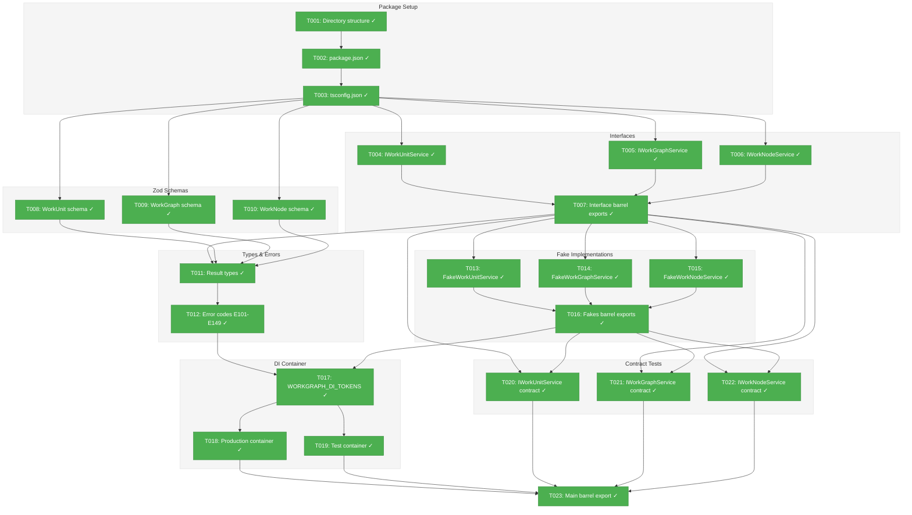
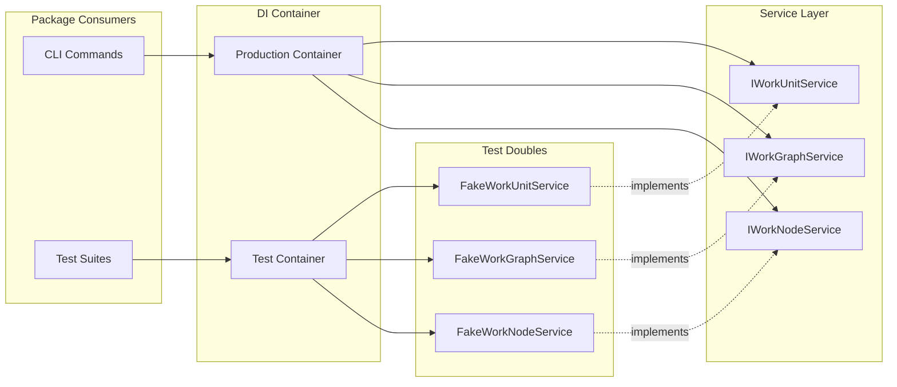
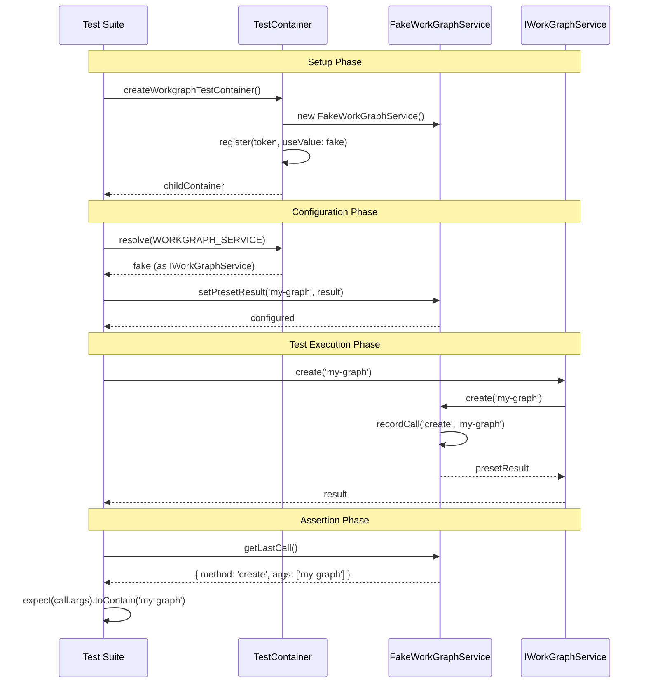

# Phase 1: Package Foundation & Core Interfaces – Tasks & Alignment Brief

**Spec**: [agent-units-spec.md](../../agent-units-spec.md)
**Plan**: [agent-units-plan.md](../../agent-units-plan.md)
**Date**: 2026-01-27

---

## Executive Briefing

### Purpose
This phase creates the foundational `packages/workgraph/` package with all interfaces, types, Zod schemas, DI tokens, and fake implementations. This is the architectural bedrock upon which all subsequent phases will build.

### What We're Building
A new TypeScript package (`@chainglass/workgraph`) containing:
- **Interfaces**: `IWorkUnitService`, `IWorkGraphService`, `IWorkNodeService` defining the service contracts
- **Zod Schemas**: Validation schemas for WorkUnit, WorkGraph, and WorkNode YAML/JSON structures
- **Result Types**: Extending `BaseResult` with `errors: ResultError[]` for agent-friendly error handling
- **Error Codes**: E101-E149 range allocated for WorkGraph-specific errors
- **DI Tokens**: `WORKGRAPH_DI_TOKENS` for type-safe dependency injection
- **Fakes**: Full fake implementations with call tracking for testing
- **Container Factories**: `createWorkgraphProductionContainer()` and `createWorkgraphTestContainer()`

### User Value
With this foundation in place, subsequent phases can implement WorkUnit and WorkGraph functionality with:
- Type-safe DI resolution
- Comprehensive test coverage using fakes
- Consistent error handling patterns
- Validated YAML/JSON schemas

### Example
After Phase 1, consumers can:
```typescript
// Production usage
const container = createWorkgraphProductionContainer();
const service = container.resolve<IWorkGraphService>(WORKGRAPH_DI_TOKENS.WORKGRAPH_SERVICE);

// Test usage
const container = createWorkgraphTestContainer();
const fakeService = container.resolve<IWorkGraphService>(WORKGRAPH_DI_TOKENS.WORKGRAPH_SERVICE);
fakeService.setPresetResult('my-graph', { graphSlug: 'my-graph', errors: [] });
```

---

## Objectives & Scope

### Objective
Create the `packages/workgraph/` package infrastructure following established patterns from `packages/workflow/` and `packages/shared/`. All interfaces, schemas, fakes, and DI setup must be in place before any service implementation.

### Goals

- ✅ Create package structure matching plan § 2.3 Directory Structure
- ✅ Define all interfaces per spec (IWorkUnitService, IWorkGraphService, IWorkNodeService)
- ✅ Create Zod schemas for WorkUnit, WorkGraph, WorkNode validation
- ✅ Define result types extending BaseResult with errors array (per Critical Discovery 02)
- ✅ Define error codes E101-E149 with documentation
- ✅ Create DI tokens following SHARED_DI_TOKENS pattern
- ✅ Implement fake services with call tracking
- ✅ Create container factories with child container pattern (per Critical Discovery 01)
- ✅ Write contract tests defining interface behavior
- ✅ Export all public APIs via barrel exports

### Non-Goals

- ❌ Service implementations (Phase 2-5)
- ❌ CLI commands (Phase 6)
- ❌ YAML file loading/parsing logic (Phase 2)
- ❌ Atomic write utilities (Phase 3)
- ❌ DAG validation algorithms (Phase 4)
- ❌ Node execution logic (Phase 5)
- ❌ Integration with existing workflow package (not needed)
- ❌ Migration tooling from legacy workflows (explicitly excluded in spec)

---

## Architecture Map

### Component Diagram
<!-- Status: grey=pending, orange=in-progress, green=completed, red=blocked -->
<!-- Updated by plan-6 during implementation -->



### Task-to-Component Mapping

<!-- Status: ⬜ Pending | 🟧 In Progress | ✅ Complete | 🔴 Blocked -->

| Task | Component(s) | Files | Status | Comment |
|------|-------------|-------|--------|---------|
| T001 | Package Setup | packages/workgraph/ | ✅ Complete | Create directory structure per plan § 2.3 |
| T002 | Package Config | packages/workgraph/package.json | ✅ Complete | Configure pnpm workspace package |
| T003 | TypeScript Config | packages/workgraph/tsconfig.json | ✅ Complete | TypeScript project references |
| T004 | WorkUnit Interface | packages/workgraph/src/interfaces/workunit-service.interface.ts | ✅ Complete | Define service contract |
| T005 | WorkGraph Interface | packages/workgraph/src/interfaces/workgraph-service.interface.ts | ✅ Complete | Define service contract |
| T006 | WorkNode Interface | packages/workgraph/src/interfaces/worknode-service.interface.ts | ✅ Complete | Define service contract |
| T007 | Interface Exports | packages/workgraph/src/interfaces/index.ts | ✅ Complete | Barrel export all interfaces |
| T008 | WorkUnit Schema | packages/workgraph/src/schemas/workunit.schema.ts | ✅ Complete | Zod validation schema |
| T009 | WorkGraph Schema | packages/workgraph/src/schemas/workgraph.schema.ts | ✅ Complete | Zod validation schema |
| T010 | WorkNode Schema | packages/workgraph/src/schemas/worknode.schema.ts | ✅ Complete | Zod validation schema |
| T011 | Result Types | packages/workgraph/src/types/index.ts | ✅ Complete | Extend BaseResult with errors array |
| T012 | Error Codes | packages/workgraph/src/errors/workgraph-errors.ts | ✅ Complete | E101-E149 error definitions |
| T013 | FakeWorkUnitService | packages/workgraph/src/fakes/fake-workunit-service.ts | ✅ Complete | Fake with call tracking |
| T014 | FakeWorkGraphService | packages/workgraph/src/fakes/fake-workgraph-service.ts | ✅ Complete | Fake with call tracking |
| T015 | FakeWorkNodeService | packages/workgraph/src/fakes/fake-worknode-service.ts | ✅ Complete | Fake with call tracking |
| T016 | Fakes Exports | packages/workgraph/src/fakes/index.ts | ✅ Complete | Barrel export all fakes |
| T017 | DI Tokens | packages/shared/src/di-tokens.ts | ✅ Complete | Add WORKGRAPH_DI_TOKENS |
| T018 | Production Container | packages/workgraph/src/container.ts | ✅ Complete | createWorkgraphProductionContainer() |
| T019 | Test Container | packages/workgraph/src/container.ts | ✅ Complete | createWorkgraphTestContainer() |
| T020 | WorkUnit Contract | test/contracts/workunit-service.contract.ts | ✅ Complete | Contract test suite |
| T021 | WorkGraph Contract | test/contracts/workgraph-service.contract.ts | ✅ Complete | Contract test suite |
| T022 | WorkNode Contract | test/contracts/worknode-service.contract.ts | ✅ Complete | Contract test suite |
| T023 | Main Barrel | packages/workgraph/src/index.ts | ✅ Complete | Package entry point |

---

## Tasks

| Status | ID | Task | CS | Type | Dependencies | Absolute Path(s) | Validation | Subtasks | Notes |
|--------|------|------|----|------|--------------|------------------|------------|----------|-------|
| [x] | T001 | Create packages/workgraph/ directory structure per plan § 2.3 | 1 | Setup | – | /home/jak/substrate/016-agent-units/packages/workgraph/ | Directories exist: src/{interfaces,services,adapters,schemas,fakes,errors,types} | – | |
| [x] | T002 | Create package.json with workspace dependencies | 1 | Setup | T001 | /home/jak/substrate/016-agent-units/packages/workgraph/package.json | `pnpm install` succeeds | – | Use @chainglass/workflow as template; add zod + zod-to-json-schema deps |
| [x] | T003 | Create tsconfig.json with project references | 1 | Setup | T002 | /home/jak/substrate/016-agent-units/packages/workgraph/tsconfig.json | `pnpm -F @chainglass/workgraph build` succeeds (with empty src/index.ts) | – | Reference ../shared |
| [x] | T004 | Define IWorkUnitService interface | 2 | Core | T003 | /home/jak/substrate/016-agent-units/packages/workgraph/src/interfaces/workunit-service.interface.ts | Interface exports list(), load(), create(), validate() methods | – | Per spec AC-14, AC-15 |
| [x] | T005 | Define IWorkGraphService interface | 2 | Core | T003 | /home/jak/substrate/016-agent-units/packages/workgraph/src/interfaces/workgraph-service.interface.ts | Interface exports create(), load(), show(), status(), addNodeAfter(), removeNode() methods | – | Per spec AC-01 through AC-08; graph structure ops moved here |
| [x] | T006 | Define IWorkNodeService interface | 2 | Core | T003 | /home/jak/substrate/016-agent-units/packages/workgraph/src/interfaces/worknode-service.interface.ts | Interface exports canRun(), start(), end(), getInputData(), saveOutputData() methods | – | Per spec AC-09 through AC-13; execution-focused only |
| [x] | T007 | Create interfaces barrel export | 1 | Setup | T004, T005, T006 | /home/jak/substrate/016-agent-units/packages/workgraph/src/interfaces/index.ts | All interfaces exported with `export type` | – | |
| [x] | T008 | Define WorkUnit Zod schema | 2 | Core | T003 | /home/jak/substrate/016-agent-units/packages/workgraph/src/schemas/workunit.schema.ts | Schema validates AgentUnit, CodeUnit, UserInputUnit YAML per workunit-data-model.md | – | Use Zod + zod-to-json-schema; export both ZodSchema and JSON Schema |
| [x] | T009 | Define WorkGraph Zod schema | 2 | Core | T003 | /home/jak/substrate/016-agent-units/packages/workgraph/src/schemas/workgraph.schema.ts | Schema validates work-graph.yaml per workgraph-data-model.md | – | Use Zod + zod-to-json-schema; export both ZodSchema and JSON Schema |
| [x] | T010 | Define WorkNode Zod schema | 2 | Core | T003 | /home/jak/substrate/016-agent-units/packages/workgraph/src/schemas/worknode.schema.ts | Schema validates node.yaml and state.json per workgraph-data-model.md | – | Use Zod + zod-to-json-schema; export both ZodSchema and JSON Schema |
| [x] | T011 | Define result types extending BaseResult | 2 | Core | T007, T008, T009, T010 | /home/jak/substrate/016-agent-units/packages/workgraph/src/types/result.types.ts | All result types have errors: ResultError[] property | – | Per Critical Discovery 02 |
| [x] | T012 | Define error codes E101-E149 with documentation | 1 | Core | T011 | /home/jak/substrate/016-agent-units/packages/workgraph/src/errors/workgraph-errors.ts | Error codes documented per plan § 3 Discovery 09 allocation | – | Per Discovery 09 |
| [x] | T013 | Create FakeWorkUnitService with call tracking | 2 | Test | T007 | /home/jak/substrate/016-agent-units/packages/workgraph/src/fakes/fake-workunit-service.ts | Fake has getCalls(), getLastCall(), setPresetResult(), reset() methods | – | Per Discovery 08 |
| [x] | T014 | Create FakeWorkGraphService with call tracking | 2 | Test | T007 | /home/jak/substrate/016-agent-units/packages/workgraph/src/fakes/fake-workgraph-service.ts | Fake has getCalls(), getLastCall(), setPresetResult(), reset() for 6 methods | – | Per Discovery 08; includes addNodeAfter/removeNode |
| [x] | T015 | Create FakeWorkNodeService with call tracking | 2 | Test | T007 | /home/jak/substrate/016-agent-units/packages/workgraph/src/fakes/fake-worknode-service.ts | Fake has getCalls(), getLastCall(), setPresetResult(), reset() for 5 methods | – | Per Discovery 08; execution-focused only |
| [x] | T016 | Create fakes barrel export | 1 | Setup | T013, T014, T015 | /home/jak/substrate/016-agent-units/packages/workgraph/src/fakes/index.ts | All fakes and call types exported | – | |
| [x] | T017 | Add WORKGRAPH_DI_TOKENS to shared package | 1 | Core | T012, T016 | /home/jak/substrate/016-agent-units/packages/shared/src/di-tokens.ts | Tokens for WORKUNIT_SERVICE, WORKGRAPH_SERVICE, WORKNODE_SERVICE, WORKUNIT_PARSER, WORKGRAPH_PARSER, WORKGRAPH_VALIDATOR | – | Per Critical Discovery 01 |
| [x] | T018 | Create createWorkgraphProductionContainer() | 2 | Core | T017 | /home/jak/substrate/016-agent-units/packages/workgraph/src/container.ts | Returns child container, registers with useFactory | – | Per Critical Discovery 01 |
| [x] | T019 | Create createWorkgraphTestContainer() | 2 | Core | T017 | /home/jak/substrate/016-agent-units/packages/workgraph/src/container.ts | Returns child container, registers fakes with useValue | – | Per Critical Discovery 01 |
| [x] | T020 | Write IWorkUnitService contract tests | 2 | Test | T007, T016 | /home/jak/substrate/016-agent-units/test/contracts/workunit-service.contract.ts | Contract tests define list(), load(), create(), validate() behavior | – | Parity tests: validates fake matches interface contract |
| [x] | T021 | Write IWorkGraphService contract tests | 2 | Test | T007, T016 | /home/jak/substrate/016-agent-units/test/contracts/workgraph-service.contract.ts | Contract tests define create(), load(), show(), status(), addNodeAfter(), removeNode() behavior | – | Parity tests: validates fake matches interface contract |
| [x] | T022 | Write IWorkNodeService contract tests | 2 | Test | T007, T016 | /home/jak/substrate/016-agent-units/test/contracts/worknode-service.contract.ts | Contract tests define canRun(), start(), end(), getInputData(), saveOutputData() behavior | – | Parity tests: validates fake matches interface contract |
| [x] | T023 | Create main barrel export (index.ts) | 1 | Setup | T018, T019, T020, T021, T022 | /home/jak/substrate/016-agent-units/packages/workgraph/src/index.ts | All public APIs exported, import @chainglass/workgraph works | – | |

---

## Alignment Brief

### Critical Findings Affecting This Phase

**Critical Discovery 01: DI Pattern with Child Containers** (Impact: Critical)
- Affects: T017, T018, T019
- Requirement: Use `container.createChildContainer()` for each command context
- Register services with `useFactory`, never `useValue` for production services
- Never use singleton registrations
- Tasks T018 and T019 must follow this pattern exactly

**Critical Discovery 02: Result Types with Errors Array** (Impact: Critical)
- Affects: T011
- Requirement: All service methods return `Promise<T extends BaseResult>` where BaseResult includes `errors: ResultError[]`
- Services must never throw exceptions for validation failures
- Task T011 must define result types following this pattern

**High Impact Discovery 08: Fake Implementation Pattern** (Impact: High)
- Affects: T013, T014, T015
- Requirement: Fakes must have call tracking with getCalls(), getLastCall(), getCallCount()
- Must provide setPresetResult() and setDefaultResult() for configuring responses
- Must implement same interface as production service

**High Impact Discovery 09: Error Code Allocation** (Impact: High)
- Affects: T012
- Requirement: E101-E199 reserved for WorkGraph
  - E101-E109: Graph operations (create, load, save)
  - E110-E119: Node execution errors
  - E120-E129: Unit operations
  - E130-E139: I/O operations
  - E140-E149: Validation errors

### Invariants & Guardrails

- **Interface-First**: Define interfaces (T004-T006) BEFORE any implementation
- **Fakes-Before-Real**: Create fakes (T013-T015) BEFORE real adapters (future phases)
- **Contract-First**: Write contract tests (T020-T022) to define expected behavior
- **No Mocking**: Use fakes only - no vi.mock(), jest.mock(), vi.spyOn()
- **Child Containers**: Always create fresh child containers, never use global container
- **Type Safety**: Use `export type` for interfaces and types in barrel exports

### Inputs to Read

| Purpose | Path |
|---------|------|
| WorkUnit Data Model | /home/jak/substrate/016-agent-units/docs/plans/016-agent-units/workunit-data-model.md |
| WorkGraph Data Model | /home/jak/substrate/016-agent-units/docs/plans/016-agent-units/workgraph-data-model.md |
| Shared Package Structure | /home/jak/substrate/016-agent-units/packages/shared/src/ |
| Workflow Package Structure | /home/jak/substrate/016-agent-units/packages/workflow/src/ |
| Existing DI Tokens | /home/jak/substrate/016-agent-units/packages/shared/src/di-tokens.ts |
| Existing Contract Tests | /home/jak/substrate/016-agent-units/test/contracts/filesystem.contract.ts |
| Existing Fakes | /home/jak/substrate/016-agent-units/packages/workflow/src/fakes/ |

### Visual Alignment Aids

#### System Flow Diagram



#### Component Interaction Sequence



### Test Plan

Following TDD and Fakes-Only policy per constitution § 4.

#### Contract Tests (T020, T021, T022)

**Purpose**: Define expected interface behavior that both fakes and future real implementations must satisfy.

| Test Suite | File | Tests | Rationale |
|------------|------|-------|-----------|
| workUnitServiceContractTests | test/contracts/workunit-service.contract.ts | list returns array, load returns unit or E120, create returns result with errors, validate checks schema | Define IWorkUnitService contract |
| workGraphServiceContractTests | test/contracts/workgraph-service.contract.ts | create returns slug or E101, load returns graph or E101, show returns tree, status returns node states, addNodeAfter validates inputs returns E103 if missing, removeNode returns E102 if has dependents | Define IWorkGraphService contract (includes graph structure ops) |
| workNodeServiceContractTests | test/contracts/worknode-service.contract.ts | canRun checks upstream completion, start/end lifecycle transitions, getInputData resolves from upstream, saveOutputData validates types | Define IWorkNodeService contract (execution-focused) |

**Test Doc Template**:
```typescript
it('should return E101 error for invalid graph slug', async () => {
  /*
  Test Doc:
  - Why: Services must never throw, always return errors (Critical Discovery 02)
  - Contract: create('') returns result with errors containing E101
  - Usage Notes: Check result.errors.length > 0 before using result data
  - Quality Contribution: Ensures agent-friendly error handling
  - Worked Example: create('') → { graphSlug: '', errors: [{ code: 'E101', ... }] }
  */
});
```

**Fixtures**: None required for Phase 1 - fakes configured inline

**Expected Outputs**: Contract tests pass for fake implementations (real implementations tested in future phases)

### Step-by-Step Implementation Outline

1. **T001-T003**: Package setup
   - Create directory structure
   - Create package.json (copy from workflow, update name to @chainglass/workgraph)
   - Create tsconfig.json with reference to ../shared
   - Create empty src/index.ts
   - Verify `pnpm install && pnpm -F @chainglass/workgraph build` passes

2. **T004-T007**: Interfaces
   - Read workunit-data-model.md and workgraph-data-model.md
   - Define IWorkUnitService with list/load/create/validate signatures
   - Define IWorkGraphService with create/load/show/status/addNodeAfter/removeNode signatures (6 methods)
   - Define IWorkNodeService with canRun/start/end/getInputData/saveOutputData signatures (5 methods, execution-focused)
   - Create interfaces/index.ts with `export type` for all interfaces

3. **T008-T010**: Zod Schemas
   - Define WorkUnitSchema matching unit.yaml structure from data model
   - Define WorkGraphSchema matching work-graph.yaml structure
   - Define WorkNodeSchema matching node.yaml and state.json structures
   - Create schemas/index.ts with all schema exports

4. **T011-T012**: Types and Errors
   - Define result types: UnitListResult, UnitLoadResult, GraphCreateResult, etc.
   - All extend BaseResult with `errors: ResultError[]`
   - Define WorkGraphError class and error code constants E101-E149
   - Create types/index.ts and errors/index.ts

5. **T013-T016**: Fakes
   - Implement FakeWorkUnitService with call tracking pattern
   - Implement FakeWorkGraphService with call tracking pattern
   - Implement FakeWorkNodeService with call tracking pattern
   - Create fakes/index.ts with all fake exports

6. **T017**: DI Tokens
   - Add WORKGRAPH_DI_TOKENS to packages/shared/src/di-tokens.ts
   - Update packages/shared/src/index.ts to export new tokens

7. **T018-T019**: Container Factories
   - Implement createWorkgraphProductionContainer() with useFactory registrations
   - Implement createWorkgraphTestContainer() with useValue fake registrations
   - Both must return childContainer, never global container

8. **T020-T022**: Contract Tests
   - Write workUnitServiceContractTests function
   - Write workGraphServiceContractTests function
   - Write workNodeServiceContractTests function
   - Create contract test runner files that invoke with fake implementations

9. **T023**: Main Barrel Export
   - Create src/index.ts exporting all public APIs
   - Verify `pnpm -F @chainglass/workgraph build` and `pnpm -F @chainglass/workgraph test` pass

### Commands to Run

```bash
# Environment setup (run once)
cd /home/jak/substrate/016-agent-units
pnpm install

# After each task
pnpm -F @chainglass/workgraph build
just typecheck
just lint

# Run tests
pnpm -F @chainglass/workgraph test

# Full quality check before completion
just fft  # fix, format, test
just check  # lint, typecheck, test
```

### Risks/Unknowns

| Risk | Severity | Likelihood | Mitigation |
|------|----------|------------|------------|
| Interface design needs revision during Phase 2-5 | Medium | Medium | Design from spec acceptance criteria; interfaces can evolve |
| Zod schema complexity for union types (AgentUnit/CodeUnit/UserInputUnit) | Low | Medium | Use Zod discriminatedUnion pattern; reference existing schema patterns |
| Contract test design unclear for async operations | Low | Low | Follow filesystem.contract.ts exemplar pattern |

### Ready Check

- [ ] Plan document read and understood (agent-units-plan.md § Phase 1)
- [ ] Spec acceptance criteria mapped to tasks (AC-01 through AC-17)
- [ ] Data model documents available (workunit-data-model.md, workgraph-data-model.md)
- [ ] Critical Discoveries understood (01, 02, 08, 09 affect this phase)
- [ ] Exemplar files identified for each pattern
- [ ] ADR constraints mapped to tasks (IDs noted in Notes column) - N/A: no ADRs exist for this plan
- [ ] Environment ready (`pnpm install` works)

---

## Phase Footnote Stubs

<!-- Footnotes added by plan-6a-update-progress during implementation -->

| # | Task | Change | Rationale |
|---|------|--------|-----------|
| | | | |

---

## Evidence Artifacts

**Execution Log**: `/home/jak/substrate/016-agent-units/docs/plans/016-agent-units/tasks/phase-1-package-foundation-core-interfaces/execution.log.md` (created by plan-6)

**Test Reports**: `pnpm -F @chainglass/workgraph test` output

**Build Artifacts**: `packages/workgraph/dist/` directory after successful build

---

## Discoveries & Learnings

_Populated during implementation by plan-6. Log anything of interest to your future self._

| Date | Task | Type | Discovery | Resolution | References |
|------|------|------|-----------|------------|------------|
| | | | | | |

**Types**: `gotcha` | `research-needed` | `unexpected-behavior` | `workaround` | `decision` | `debt` | `insight`

**What to log**:
- Things that didn't work as expected
- External research that was required
- Implementation troubles and how they were resolved
- Gotchas and edge cases discovered
- Decisions made during implementation
- Technical debt introduced (and why)
- Insights that future phases should know about

_See also: `execution.log.md` for detailed narrative._

---

## Directory Layout

```
docs/plans/016-agent-units/
├── agent-units-spec.md
├── agent-units-plan.md
├── research-dossier.md
├── workunit-data-model.md
├── workgraph-data-model.md
├── workgraph-command-flows.md
├── work-unit-command-flows.md
└── tasks/phase-1-package-foundation-core-interfaces/
    ├── tasks.md                    # This file
    └── execution.log.md            # Created by plan-6
```

---

**STOP**: Do not edit code. Wait for human **GO** to proceed to implementation via `/plan-6-implement-phase --phase 1`.

---

## Critical Insights Discussion

**Session**: 2026-01-27
**Context**: Phase 1 Tasks Dossier for WorkGraph Package Foundation
**Analyst**: AI Clarity Agent
**Reviewer**: Development Team
**Format**: Water Cooler Conversation (5 Critical Insights)

### Insight 1: Contract Test Ordering - "TDD: RED Phase" Annotation Misleading

**Did you know**: The "TDD: RED phase" annotation on T020-T022 is misleading because contract tests in this codebase are factory functions that require implementations to run against - they can't fail first in the classic TDD sense.

**Implications**:
- Contract tests are parity validators, not standalone failing tests
- The factory pattern means tests compile early but execute after fakes exist
- 002-agent-control Phase 1 successfully used this exact order

**Options Considered**:
- Option A: Reorder tests before fakes - Not Feasible (contract tests need implementations)
- Option B: Keep current order, update annotation - Feasible
- Option C: Split contract tests - Unnecessary complexity

**AI Recommendation**: Option B
- Reasoning: Matches proven pattern from 002-agent-control; annotation fix accurately describes what contract tests do

**Discussion Summary**: User agreed the annotation was causing confusion and approved fixing it.

**Decision**: Keep task order; change annotation to "Parity tests: validates fake matches interface contract"

**Action Items**: None - annotation updated in tasks.md

**Affects**: T020, T021, T022 Notes column

---

### Insight 2: Three Services Sharing state.json - Coordination Unnecessary

**Did you know**: IWorkUnitService, IWorkGraphService, and IWorkNodeService will all access state.json, but the single-user assumption and atomic writes make an explicit IStateManager coordinator unnecessary.

**Implications**:
- Single-user assumption (plan § 2.4) explicitly excludes concurrency handling
- Atomic writes (Critical Discovery 03) prevent corruption without coordination
- Workflow package already demonstrates this pattern successfully

**Options Considered**:
- Option A: Add IStateManager interface - Not Feasible (contradicts single-user assumption)
- Option B: Keep three services separate - Feasible (proven pattern)
- Option C: Merge IWorkGraphService and IWorkNodeService - Not Feasible (violates SRP)

**AI Recommendation**: Option B
- Reasoning: Atomic writes handle corruption, single-user assumption scopes out locking, existing pattern works

**Discussion Summary**: User confirmed the design is sound without additional coordination.

**Decision**: Keep three services separate; Phase 3 will implement atomic writes per Critical Discovery 03

**Action Items**:
- [ ] Consider adding getNodeStatus()/updateNodeStatus() to IWorkGraphService in T005

**Affects**: No Phase 1 changes; confirms architectural approach

---

### Insight 3: DI Token Placement - "Bloat" and "Circular Dependency" Concerns Unfounded

**Did you know**: Putting WORKGRAPH_DI_TOKENS in packages/shared (as T017 specifies) is exactly correct - the concerns about circular dependencies and bloat are unfounded.

**Implications**:
- ADR-0004 documents this as the accepted pattern
- WORKFLOW_DI_TOKENS already has 10 workflow-specific tokens in shared
- Tokens are pure string constants with no runtime code - no circular dependency possible
- File size increase is ~15 lines - negligible

**Options Considered**:
- Option A: Keep tokens in shared (current plan) - Feasible
- Option B: Create tokens in packages/workgraph - Breaks established pattern
- Option C: Split tokens between packages - Over-engineering

**AI Recommendation**: Option A
- Reasoning: Matches ADR-0004, follows WORKFLOW_DI_TOKENS precedent, no actual risk

**Discussion Summary**: User confirmed current plan is correct.

**Decision**: Keep WORKGRAPH_DI_TOKENS in packages/shared/src/di-tokens.ts per T017

**Action Items**: None - T017 is correctly specified

**Affects**: Confirms T017 implementation approach

---

### Insight 4: Zod vs JSON Schema - Data Model and Tasks Disagree

**Did you know**: Tasks T008-T010 say "Define Zod schema" but the data model documents define WORK_UNIT_SCHEMA as a JSON Schema object - these are different formats requiring different approaches.

**Implications**:
- apps/web uses Zod for TypeScript DX
- packages/workflow uses JSON Schema + AJV for CLI validation
- CLI testing pattern uses `ajv validate` which requires JSON Schema
- zod-to-json-schema is already in pnpm-lock.yaml

**Options Considered**:
- Option A: Use Zod only - Partial (won't work with CLI testing)
- Option B: Use JSON Schema + AJV only - Contradicts tasks.md
- Option C: Maintain both manually - Dual maintenance burden
- Option D: Use zod-to-json-schema to bridge both - Feasible (best of both worlds)

**AI Recommendation**: Option D
- Reasoning: Single source of truth (Zod), TypeScript DX, CLI validation compatibility, library already available

**Discussion Summary**: User agreed the bridge approach gives best of both worlds.

**Decision**: Use Zod schemas with zod-to-json-schema to auto-generate JSON Schema

**Action Items**: None - tasks updated

**Affects**: T002 (add dependencies), T008, T009, T010 (implementation approach)

---

### Insight 5: IWorkNodeService Has Too Many Responsibilities

**Did you know**: Task T006 defined IWorkNodeService with 7+ methods spanning three concerns (graph structure, execution lifecycle, I/O), violating Single Responsibility and creating fake complexity.

**Implications**:
- Command flows document groups operations by actor: graph builder, orchestrator, agent
- addAfter/remove are pre-execution graph-structure operations
- FakePhaseService (6 cohesive methods) is 1047 lines - mixed responsibilities would be worse
- Existing interfaces average 4-6 cohesive methods

**Options Considered**:
- Option A: Keep single interface (7+ methods) - Not Feasible (violates patterns, complex fake)
- Option B: Split into Lifecycle + IO services - Feasible
- Option C: Three-way split - Over-engineering
- Option D: Move addAfter/removeNode to IWorkGraphService - Feasible (cleanest separation)

**AI Recommendation**: Option D
- Reasoning: Graph-structure ops belong with graph service; both interfaces stay at 5-6 methods

**Discussion Summary**: User agreed the separation by actor/timing is cleaner.

**Decision**: Move addNodeAfter() and removeNode() to IWorkGraphService; keep IWorkNodeService execution-focused

**Action Items**: None - tasks updated

**Affects**: T005, T006, T014, T015, T021, T022, Test Plan, Step-by-Step outline

---

## Session Summary

**Insights Surfaced**: 5 critical insights identified and discussed
**Decisions Made**: 5 decisions reached through collaborative discussion
**Action Items Created**: 1 follow-up task identified (consider cross-service status methods)
**Areas Updated**:
- T002: Added zod + zod-to-json-schema dependencies
- T005: Expanded to include addNodeAfter(), removeNode() (6 methods)
- T006: Reduced to canRun(), start(), end(), getInputData(), saveOutputData() (5 methods)
- T008-T010: Clarified Zod + zod-to-json-schema approach
- T014-T015: Updated fake descriptions to match interface changes
- T020-T022: Changed "TDD: RED phase" to "Parity tests" annotation
- T021-T022: Updated contract test coverage descriptions
- Test Plan: Updated test suite descriptions
- Step-by-Step Implementation Outline: Updated method signatures

**Shared Understanding Achieved**: ✓

**Confidence Level**: High - All insights verified against codebase, decisions align with established patterns

**Next Steps**:
Run `/plan-6-implement-phase --phase 1` when ready to begin implementation
