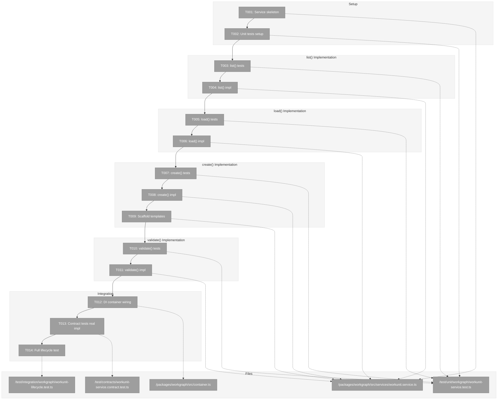
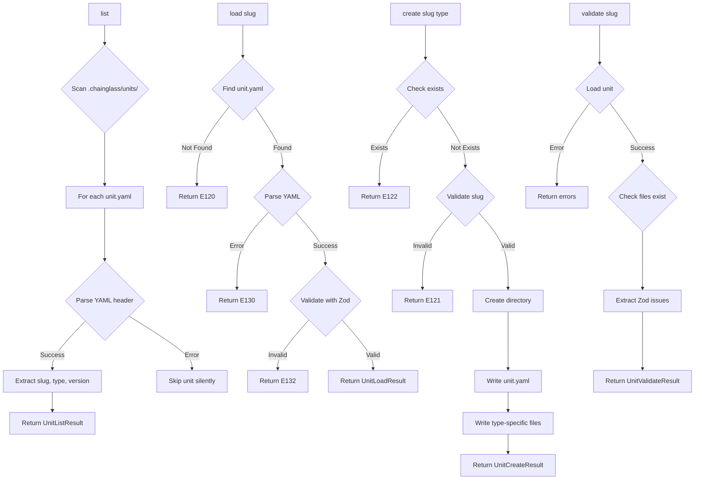
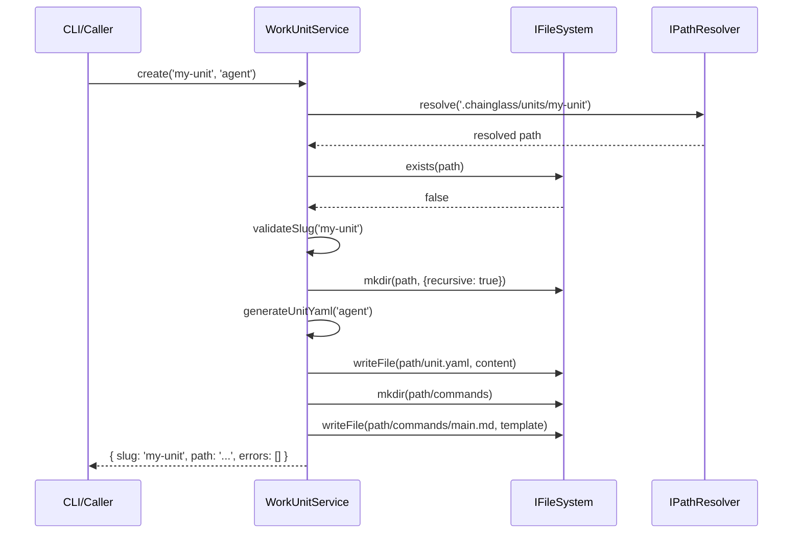

# Phase 2: WorkUnit Service Implementation – Tasks & Alignment Brief

**Spec**: [agent-units-spec.md](../../agent-units-spec.md)
**Plan**: [agent-units-plan.md](../../agent-units-plan.md)
**Date**: 2026-01-27

---

## Executive Briefing

### Purpose
This phase implements the real `WorkUnitService` class that fulfills the `IWorkUnitService` interface created in Phase 1. This is the first real service implementation in the workgraph package, enabling users to discover, load, create, and validate WorkUnits stored as YAML files in `.chainglass/units/`.

### What We're Building
A `WorkUnitService` class that:
- **list()**: Scans `.chainglass/units/**/unit.yaml` to discover available WorkUnits
- **load(slug)**: Reads and parses `unit.yaml`, validates with Zod schema, returns typed WorkUnit
- **create(slug, type)**: Scaffolds new unit directory with `unit.yaml` + type-specific files (e.g., `commands/main.md` for agent units)
- **validate(slug)**: Loads unit and extracts detailed Zod validation issues with JSON pointer paths

### User Value
Users can manage their WorkUnit library through a programmatic API:
- Discover available units with `list()` for building WorkGraph node selections
- Load full unit definitions for display or graph wiring validation
- Scaffold new units with correct structure via `create()`
- Validate unit definitions before use to catch errors early

### Example
**Before (Phase 1)**: FakeWorkUnitService returns preset results
**After (Phase 2)**: Real service reads filesystem

```typescript
// Real service reads from filesystem
const service = container.resolve<IWorkUnitService>(WORKGRAPH_DI_TOKENS.WORKUNIT_SERVICE);
const result = await service.list();
// → { units: [{ slug: 'write-poem', type: 'agent', version: '1.0.0' }], errors: [] }

const loadResult = await service.load('write-poem');
// → { unit: { slug: 'write-poem', type: 'agent', inputs: [...], outputs: [...] }, errors: [] }
```

---

## Objectives & Scope

### Objective
Implement WorkUnitService as specified in the plan § Phase 2, passing all existing contract tests and enabling real filesystem-based unit management.

### Behavior Checklist (from plan acceptance criteria)
- [ ] All unit tests pass
- [ ] Contract tests pass for both fake and real service
- [ ] Can create all three unit types (agent, code, user-input)
- [ ] Validation catches all schema errors with actionable messages

### Goals

- ✅ Create WorkUnitService class implementing IWorkUnitService
- ✅ Implement list() with glob discovery pattern
- ✅ Implement load() with YAML parsing and Zod validation
- ✅ Implement create() with type-specific scaffolding
- ✅ Implement validate() with detailed error extraction
- ✅ Wire into DI container (production container)
- ✅ Register real impl in contract tests alongside fake
- ✅ Write unit tests for each method (TDD approach)

### Non-Goals

- ❌ CLI commands (Phase 6)
- ❌ WorkGraph integration (Phase 3)
- ❌ Atomic file writes (defer to Phase 3 - not needed for unit creation)
- ❌ Unit versioning (v1 limitation per spec)
- ❌ Remote/cloud storage (local filesystem only per spec)
- ❌ Concurrent access handling (single user assumption per spec)
- ❌ Performance optimization (premature for v1)
- ❌ Unit migration tools (not in scope)

---

## Architecture Map

### Component Diagram
<!-- Status: grey=pending, orange=in-progress, green=completed, red=blocked -->
<!-- Updated by plan-6 during implementation -->



### Task-to-Component Mapping

<!-- Status: ⬜ Pending | 🟧 In Progress | ✅ Complete | 🔴 Blocked -->

| Task | Component(s) | Files | Status | Comment |
|------|-------------|-------|--------|---------|
| T001 | WorkUnitService | /packages/workgraph/src/services/workunit.service.ts | ⬜ Pending | Create class skeleton with constructor DI |
| T002 | Test Infrastructure | /test/unit/workgraph/workunit-service.test.ts | ⬜ Pending | Setup test file with fixtures |
| T002a | IFileSystem.glob() | /packages/shared/src/interfaces/filesystem.interface.ts, adapters, fakes | ⬜ Pending | Add glob method to interface + implementations |
| T003 | list() Tests | /test/unit/workgraph/workunit-service.test.ts | ⬜ Pending | TDD: Write failing tests first (uses glob) |
| T004 | list() Impl | /packages/workgraph/src/services/workunit.service.ts | ⬜ Pending | Glob discovery + YAML header parsing |
| T005 | load() Tests | /test/unit/workgraph/workunit-service.test.ts | ⬜ Pending | TDD: Write failing tests first |
| T006 | load() Impl | /packages/workgraph/src/services/workunit.service.ts | ⬜ Pending | YAML parse + Zod validate |
| T007 | create() Tests | /test/unit/workgraph/workunit-service.test.ts | ⬜ Pending | TDD: Write failing tests first |
| T008 | create() Impl | /packages/workgraph/src/services/workunit.service.ts | ⬜ Pending | Directory scaffold + YAML write |
| T009 | Scaffold Templates | /packages/workgraph/src/services/workunit.service.ts | ⬜ Pending | Type-specific file templates |
| T010 | validate() Tests | /test/unit/workgraph/workunit-service.test.ts | ⬜ Pending | TDD: Write failing tests first |
| T011 | validate() Impl | /packages/workgraph/src/services/workunit.service.ts | ⬜ Pending | Zod error extraction with paths |
| T012 | DI Container | /packages/workgraph/src/container.ts | ⬜ Pending | Wire real service in production container |
| T013 | Contract Tests | /test/contracts/workunit-service.contract.test.ts | ⬜ Pending | Add real impl to contract test suite |
| T014 | Integration Test | /test/integration/workgraph/workunit-lifecycle.test.ts | ⬜ Pending | Full create→validate→list→load cycle |

---

## Tasks

| Status | ID | Task | CS | Type | Dependencies | Absolute Path(s) | Validation | Subtasks | Notes |
|--------|-----|------|-----|------|--------------|------------------|------------|----------|-------|
| [x] | T000 | Extract IYamlParser, YamlParserAdapter, YamlParseError from workflow to @chainglass/shared | 3 | Refactor | – | /home/jak/substrate/016-agent-units/packages/shared/src/interfaces/yaml-parser.interface.ts, /home/jak/substrate/016-agent-units/packages/shared/src/adapters/yaml-parser.adapter.ts | Workflow tests still pass, shared exports new types | – | Per didyouknow decision: workflows may be deprecated |
| [x] | T001 | Create WorkUnitService class skeleton with constructor injection (IFileSystem, IPathResolver, IYamlParser) | 2 | Setup | T000 | /home/jak/substrate/016-agent-units/packages/workgraph/src/services/workunit.service.ts | Class compiles, methods return stub results | – | Per ADR-0004: useFactory pattern; IYamlParser from shared |
| [x] | T002 | Create unit test file with FakeFileSystem fixtures and test unit YAML samples | 2 | Setup | T001 | /home/jak/substrate/016-agent-units/test/unit/workgraph/workunit-service.test.ts | Test file runs, fixtures available | – | Use FakeFileSystem from @chainglass/shared |
| [x] | T002a | Add glob() method to IFileSystem interface; implement in NodeFileSystemAdapter (fast-glob) and FakeFileSystem | 3 | Refactor | T002 | /home/jak/substrate/016-agent-units/packages/shared/src/interfaces/filesystem.interface.ts, /home/jak/substrate/016-agent-units/packages/shared/src/adapters/node-filesystem.adapter.ts, /home/jak/substrate/016-agent-units/packages/shared/src/fakes/fake-filesystem.ts | Contract tests pass for glob; fast-glob added to shared deps | – | Per didyouknow decision: proper glob abstraction |
| [x] | T003 | Write failing tests for list(): empty dir, multiple units, invalid unit.yaml ignored | 2 | Test | T002a | /home/jak/substrate/016-agent-units/test/unit/workgraph/workunit-service.test.ts | Tests fail with expected assertions | – | TDD: RED phase; uses fs.glob() |
| [x] | T004 | Implement list() with fs.glob('.chainglass/units/**/unit.yaml') and YAML header extraction | 2 | Core | T003 | /home/jak/substrate/016-agent-units/packages/workgraph/src/services/workunit.service.ts | All list() tests pass | – | Per plan 2.1-2.2; uses IFileSystem.glob() from T002a |
| [x] | T005 | Write failing tests for load(): unit found, E120 not found, E130 YAML parse error, E132 schema validation | 2 | Test | T004 | /home/jak/substrate/016-agent-units/test/unit/workgraph/workunit-service.test.ts | Tests fail with expected error codes | – | TDD: RED phase |
| [x] | T006 | Implement load() with YAML parsing, Zod validation using WorkUnitSchema | 2 | Core | T005 | /home/jak/substrate/016-agent-units/packages/workgraph/src/services/workunit.service.ts | All load() tests pass | – | Per plan 2.3-2.4; try/catch YamlParseError→E130 |
| [x] | T007 | Write failing tests for create(): agent scaffold, code scaffold, user-input scaffold, E122 exists, E121 invalid slug | 2 | Test | T006 | /home/jak/substrate/016-agent-units/test/unit/workgraph/workunit-service.test.ts | Tests fail with expected assertions | – | TDD: RED phase |
| [x] | T008 | Implement create() with directory creation, unit.yaml generation from type-specific template | 3 | Core | T007 | /home/jak/substrate/016-agent-units/packages/workgraph/src/services/workunit.service.ts | All create() tests pass | – | Per plan 2.5-2.6 |
| [x] | T009 | Add scaffold template files: commands/main.md for agent, script placeholder for code | 2 | Core | T008 | /home/jak/substrate/016-agent-units/packages/workgraph/src/services/workunit.service.ts | Scaffold creates all expected files | – | Type-specific templates |
| [x] | T010 | Write failing tests for validate(): valid unit, schema errors with JSON paths, missing files | 2 | Test | T009 | /home/jak/substrate/016-agent-units/test/unit/workgraph/workunit-service.test.ts | Tests fail with expected ValidationIssue[] | – | TDD: RED phase |
| [x] | T011 | Implement validate() with Zod safeParse, error path extraction to ValidationIssue[] | 2 | Core | T010 | /home/jak/substrate/016-agent-units/packages/workgraph/src/services/workunit.service.ts | All validate() tests pass | – | Per plan 2.7-2.8; copy pattern from workflow-registry.service.ts:240 |
| [x] | T012 | Wire WorkUnitService in createWorkgraphProductionContainer() with useFactory | 2 | Integration | T011 | /home/jak/substrate/016-agent-units/packages/workgraph/src/container.ts | Container resolves real service | – | Per ADR-0004 IMP-002 |
| [x] | T013 | Add real WorkUnitService to contract test suite alongside FakeWorkUnitService | 2 | Test | T012 | /home/jak/substrate/016-agent-units/test/contracts/workunit-service.contract.test.ts | Both impl pass contract tests | – | Direct instantiation with Fake* test doubles (not container) |
| [x] | T014 | Write integration test: create('my-unit', 'agent') → validate('my-unit') → list() → load('my-unit') | 3 | Integration | T013 | /home/jak/substrate/016-agent-units/test/integration/workgraph/workunit-lifecycle.test.ts | Full lifecycle works end-to-end | – | Per plan 2.11 |

---

## Alignment Brief

### Prior Phases Review

#### Phase 1 Summary (Completed)
Phase 1 established the foundational `@chainglass/workgraph` package with all interfaces, types, schemas, fakes, and DI infrastructure.

**A. Deliverables Created**:
- `/home/jak/substrate/016-agent-units/packages/workgraph/src/interfaces/workunit-service.interface.ts` - IWorkUnitService with 4 methods
- `/home/jak/substrate/016-agent-units/packages/workgraph/src/schemas/workunit.schema.ts` - WorkUnitSchema (discriminated union)
- `/home/jak/substrate/016-agent-units/packages/workgraph/src/fakes/fake-workunit-service.ts` - FakeWorkUnitService with call tracking
- `/home/jak/substrate/016-agent-units/packages/workgraph/src/errors/workgraph-errors.ts` - Error codes E101-E149
- `/home/jak/substrate/016-agent-units/packages/workgraph/src/container.ts` - Container factories
- `/home/jak/substrate/016-agent-units/test/contracts/workunit-service.contract.ts` - Contract test factory

**B. Lessons Learned**:
- Build order matters: `@chainglass/shared` must build before `@chainglass/workgraph`
- pnpm install warnings about deprecated glob@7 are acceptable (transitive deps)

**C. Technical Discoveries**:
- None blocking Phase 2

**D. Dependencies Exported for Phase 2**:
- `IWorkUnitService` interface with result types
- `WorkUnitSchema` for validation
- `WORKGRAPH_DI_TOKENS.WORKUNIT_SERVICE` token
- `unitNotFoundError`, `yamlParseError`, `schemaValidationError` factory functions
- `createWorkgraphProductionContainer`, `createWorkgraphTestContainer`

**E. Critical Findings Applied**:
- Discovery 01 (DI Pattern): Container factories use `useFactory`, not singletons
- Discovery 02 (Result Types): All interfaces return `{ ..., errors: ResultError[] }`
- Discovery 08 (Fakes): All fakes have call tracking arrays

**F. Incomplete/Blocked Items**: None - Phase 1 fully complete (T001-T023)

**G. Test Infrastructure**:
- `/home/jak/substrate/016-agent-units/test/contracts/workunit-service.contract.ts` - Contract test factory
- 8 passing contract tests for IWorkUnitService

**H. Technical Debt**: None introduced in Phase 1

**I. Architectural Decisions**:
- Zod schemas with discriminated union on `type` field
- YAML snake_case fields mapped to TypeScript camelCase in interfaces
- Error codes E120-E129 for unit operations

**J. Scope Changes**: None

**K. Key Log References**:
- See `/home/jak/substrate/016-agent-units/docs/plans/016-agent-units/tasks/phase-1-package-foundation-core-interfaces/execution.log.md`

---

### Critical Findings Affecting This Phase

#### 🚨 Critical Discovery 02: Result Types with Errors Array
**Constrains**: All service methods must return results with `errors: ResultError[]`
**Addressed by**: T001, T004, T006, T008, T011 - All methods return proper result types

#### 🚨 Critical Discovery 03: Atomic File Writes Required
**Note**: Applies to state.json in Phase 3. For Phase 2 unit creation, atomic writes are NOT required since `create()` is not a hot path and partial failure is acceptable (user can retry).

#### High Impact Discovery 08: Fake Implementation Pattern
**Constrains**: Real service must pass same contract tests as fake
**Addressed by**: T013 - Add real impl to contract test suite

#### High Impact Discovery 09: Error Code Allocation
**Constrains**: Use E120-E129 for unit operations
**Error codes used in Phase 2**:
- E120: Unit not found (load)
- E121: Invalid unit slug format
- E122: Unit already exists (create)
- E130: YAML parse error
- E132: Schema validation failed

#### High Impact Discovery 10: Path Security
**Constrains**: Reject any path containing '..' before resolution
**Addressed by**: T001, T006 - Use IPathResolver for all path operations

---

### ADR Decision Constraints

#### ADR-0004: Dependency Injection Container Architecture
**Decision**: Use `useFactory` pattern for all service registrations, never `useClass` with decorators
**Constrains**: T001 (service construction), T012 (container wiring)
**Addressed by**: T001 uses constructor injection pattern; T012 uses useFactory

#### ADR-0003: Configuration System Architecture
**Decision**: Zod primary, JSON Schema export
**Constrains**: T006 (load validation), T011 (validate implementation)
**Addressed by**: Using existing WorkUnitSchema from Phase 1

---

### Invariants & Guardrails

- **Path Security**: No path may contain `..` (directory traversal)
- **Slug Format**: Must match `/^[a-z][a-z0-9-]*$/`
- **YAML Format**: `unit.yaml` must be valid YAML and pass WorkUnitSchema
- **Error Handling**: Never throw exceptions; always return errors array

---

### Inputs to Read

| Path | Purpose |
|------|---------|
| `/home/jak/substrate/016-agent-units/packages/workgraph/src/interfaces/workunit-service.interface.ts` | IWorkUnitService interface to implement |
| `/home/jak/substrate/016-agent-units/packages/workgraph/src/schemas/workunit.schema.ts` | WorkUnitSchema for validation |
| `/home/jak/substrate/016-agent-units/packages/workgraph/src/fakes/fake-workunit-service.ts` | Reference for expected behavior patterns |
| `/home/jak/substrate/016-agent-units/packages/workgraph/src/errors/workgraph-errors.ts` | Error factory functions |
| `/home/jak/substrate/016-agent-units/packages/workflow/src/adapters/yaml-parser.adapter.ts` | YAML parsing pattern to follow (will be moved to shared in T000) |
| `/home/jak/substrate/016-agent-units/packages/workflow/src/services/workflow.service.ts` | Reference for service implementation patterns |
| `/home/jak/substrate/016-agent-units/test/contracts/workunit-service.contract.ts` | Contract tests to satisfy |

---

### Visual Alignment Aids

#### Flow Diagram: WorkUnit Operations



#### Sequence Diagram: create() Flow



---

### Test Plan

**Approach**: Full TDD per spec § 4.1 Testing Philosophy

**Mock Usage Policy**: Fakes over mocks. Use `FakeFileSystem` from `@chainglass/shared`. NO `vi.mock()`.

#### Named Tests

| Test Name | Method | Rationale | Fixture | Expected Output |
|-----------|--------|-----------|---------|-----------------|
| `should return empty list for empty directory` | list() | Base case | Empty .chainglass/units/ | `{ units: [], errors: [] }` |
| `should discover multiple units` | list() | Multiple units | 3 unit dirs with unit.yaml | `{ units: [3 items], errors: [] }` |
| `should skip units with invalid YAML` | list() | Graceful degradation | 1 valid + 1 malformed | `{ units: [1 item], errors: [] }` |
| `should load existing unit` | load() | Happy path | write-poem unit.yaml | `{ unit: {...}, errors: [] }` |
| `should return E120 for non-existent unit` | load() | Not found | No files | `errors[0].code === 'E120'` |
| `should return E130 for malformed YAML` | load() | Parse error | Invalid YAML | `errors[0].code === 'E130'` |
| `should return E132 for schema invalid` | load() | Validation | Missing required field | `errors[0].code === 'E132'` |
| `should create agent unit scaffold` | create() | Agent type | None | Creates unit.yaml + commands/main.md |
| `should create code unit scaffold` | create() | Code type | None | Creates unit.yaml |
| `should create user-input unit scaffold` | create() | User-input type | None | Creates unit.yaml |
| `should return E122 if unit exists` | create() | Conflict | Existing dir | `errors[0].code === 'E122'` |
| `should return E121 for invalid slug` | create() | Validation | None | `errors[0].code === 'E121'` |
| `should validate correct unit` | validate() | Happy path | Valid unit | `{ valid: true, issues: [] }` |
| `should extract Zod errors with paths` | validate() | Error extraction | Missing required | `issues[0].path === '/outputs'` |
| `should check file existence` | validate() | Missing files | No commands/main.md | Warning issue |

---

### Step-by-Step Implementation Outline

| Step | Task ID | Action | Test First? |
|------|---------|--------|-------------|
| 0 | T000 | Extract IYamlParser, YamlParserAdapter, YamlParseError from workflow to shared | No (refactor) |
| 1 | T001 | Create WorkUnitService class with constructor accepting IFileSystem, IPathResolver, IYamlParser (from shared) | No (skeleton) |
| 2 | T002 | Create test file with imports, describe block, FakeFileSystem setup | No (setup) |
| 2a | T002a | Add glob() to IFileSystem; implement in NodeFileSystemAdapter + FakeFileSystem | No (interface) |
| 3 | T003 | Write tests for list(): 3 test cases (using fs.glob()) | ✅ TDD RED |
| 4 | T004 | Implement list() to pass tests | GREEN |
| 5 | T005 | Write tests for load(): 4 test cases | ✅ TDD RED |
| 6 | T006 | Implement load() to pass tests | GREEN |
| 7 | T007 | Write tests for create(): 5 test cases | ✅ TDD RED |
| 8 | T008 | Implement create() basic flow | GREEN |
| 9 | T009 | Add scaffold templates for all types | GREEN |
| 10 | T010 | Write tests for validate(): 3 test cases | ✅ TDD RED |
| 11 | T011 | Implement validate() to pass tests | GREEN |
| 12 | T012 | Wire service in container.ts useFactory | Integration |
| 13 | T013 | Add real impl to contract test suite | Contract |
| 14 | T014 | Write full lifecycle integration test | Integration |

---

### Commands to Run

```bash
# Environment setup
cd /home/jak/substrate/016-agent-units
pnpm install

# Build (ensure shared builds first)
pnpm build

# Run specific test file during development
pnpm vitest run test/unit/workgraph/workunit-service.test.ts

# Run contract tests
pnpm vitest run test/contracts/workunit-service.contract.test.ts

# Run all workgraph tests
pnpm vitest run --filter workgraph

# Type check
pnpm tsc --noEmit

# Lint
just lint

# Full quality check
just check
```

---

### Risks & Unknowns

| Risk | Severity | Likelihood | Mitigation |
|------|----------|------------|------------|
| YAML parsing edge cases | Low | Medium | Use existing yaml-parser.adapter.ts pattern; wrap in try/catch |
| Glob performance on large dirs | Low | Low | Single depth glob pattern; defer optimization |
| FakeFileSystem behavior gaps | Medium | Low | Run contract tests against both implementations |
| Zod error path extraction | ~~Medium~~ Resolved | ~~Medium~~ | Pattern found in workflow-registry.service.ts:240-248; use `'/' + issue.path.join('/')` |

---

### Ready Check

- [ ] Phase 1 deliverables verified (interfaces, schemas, fakes, DI tokens exist)
- [ ] Plan task mapping clear (2.1→T003-T004, 2.3→T005-T006, 2.5→T007-T009, 2.7→T010-T011)
- [ ] ADR constraints mapped to tasks (IDs noted in Notes column) - Per ADR-0004
- [ ] Error codes documented (E120-E122, E130, E132)
- [ ] Test fixtures identified (FakeFileSystem, sample unit.yaml)
- [ ] Commands to run validated

**Awaiting explicit GO/NO-GO before implementation.**

---

## Phase Footnote Stubs

| Footnote | Task | Description | Reference |
|----------|------|-------------|-----------|
| | | | |

_To be populated by plan-6 during implementation._

---

## Evidence Artifacts

| Artifact | Path | Purpose |
|----------|------|---------|
| Execution Log | `./execution.log.md` | Detailed implementation narrative |
| Unit Tests | `/home/jak/substrate/016-agent-units/test/unit/workgraph/workunit-service.test.ts` | TDD test suite |
| Contract Tests | `/home/jak/substrate/016-agent-units/test/contracts/workunit-service.contract.test.ts` | Contract parity |
| Integration Test | `/home/jak/substrate/016-agent-units/test/integration/workgraph/workunit-lifecycle.test.ts` | Full lifecycle |

---

## Discoveries & Learnings

_Populated during implementation by plan-6. Log anything of interest to your future self._

| Date | Task | Type | Discovery | Resolution | References |
|------|------|------|-----------|------------|------------|
| 2026-01-27 | T001 | decision | IYamlParser interface missing from workgraph; workflow's IYamlParser exists but workflow may be deprecated | Extract IYamlParser, YamlParserAdapter, YamlParseError from workflow to @chainglass/shared; workgraph imports from shared | V1-01 to V1-05 verification findings |
| 2026-01-27 | T004 | decision | IFileSystem has no glob() method; list() needs pattern matching for unit discovery | Add glob() to IFileSystem interface; implement in NodeFileSystemAdapter (fast-glob) and FakeFileSystem | V2-01 to V2-05 verification findings |
| 2026-01-27 | T011 | insight | Zod error path extraction is trivial - pattern already exists in workflow-registry.service.ts:240-248 | Copy pattern: `'/' + issue.path.join('/')` produces JSON pointer | V3-01 to V3-05 verification findings |
| 2026-01-27 | T006 | insight | YAML parser throws YamlParseError (not Result types); service must catch and convert | Follow workflow pattern: try/catch in load(), convert YamlParseError to E130 Result | V4-01 to V4-05 verification findings |
| 2026-01-27 | T013 | insight | Contract tests use direct instantiation with test doubles, NOT DI container | Pass FakeFileSystem, FakePathResolver, FakeYamlParser to constructor; matches ConfigService pattern | V5-01 to V5-05 verification findings |

**Types**: `gotcha` | `research-needed` | `unexpected-behavior` | `workaround` | `decision` | `debt` | `insight`

**What to log**:
- Things that didn't work as expected
- External research that was required
- Implementation troubles and how they were resolved
- Gotchas and edge cases discovered
- Decisions made during implementation
- Technical debt introduced (and why)
- Insights that future phases should know about

_See also: `execution.log.md` for detailed narrative._

---

## Directory Layout

```
docs/plans/016-agent-units/
├── agent-units-spec.md
├── agent-units-plan.md
└── tasks/
    ├── phase-1-package-foundation-core-interfaces/
    │   ├── tasks.md
    │   └── execution.log.md
    └── phase-2-workunit-service-implementation/
        ├── tasks.md          # This file
        └── execution.log.md  # Created by plan-6
```

---

## Critical Insights Discussion

**Session**: 2026-01-27
**Context**: Phase 2 WorkUnit Service Implementation Tasks & Alignment Brief
**Analyst**: AI Clarity Agent (Claude Opus 4.5)
**Reviewer**: Development Team
**Format**: Water Cooler Conversation (5 Critical Insights)

### Insight 1: Missing Workgraph-Specific Interfaces

**Did you know**: WorkUnitService cannot be implemented as specified because IYamlParser exists only in the workflow package, and workflow may be deprecated in a later phase.

**Implications**:
- DI tokens exist for IWorkgraphYamlParser but interface is not defined
- Cross-package dependency (workgraph→workflow) would be problematic
- Need shared infrastructure before service implementation

**Options Considered**:
- Option A: Reuse Workflow's IYamlParser - Creates cross-package dependency
- Option B: Define IWorkgraphYamlParser with identical contract - Duplicates code
- Option C: Extract common IYamlParser to @chainglass/shared - Clean architecture
- Option D: Skip abstraction, use yaml directly - Violates ADR-0004

**AI Recommendation**: Option A (Reuse Workflow's IYamlParser)
- Reasoning: Least work, same library, can refactor later

**Discussion Summary**:
User chose Option C due to potential deprecation of workflows in a later phase. This ensures workgraph has no dependency on a package that may be removed.

**Decision**: Extract IYamlParser, YamlParserAdapter, YamlParseError from workflow to @chainglass/shared

**Action Items**:
- [x] Add T000 task for extraction (CS-3)
- [x] Update T001 to depend on T000
- [x] Update Inputs to Read section

**Affects**: T000 (new), T001 (dependencies), step-by-step outline

---

### Insight 2: FakeFileSystem Has No glob() Method

**Did you know**: The list() implementation cannot use glob patterns because IFileSystem doesn't have a glob() method - only readDir() for directory listing.

**Implications**:
- Pattern matching for `.chainglass/units/**/unit.yaml` not possible via interface
- Would need manual directory traversal with readDir()
- FakeFileSystem tests would require complex directory setup

**Options Considered**:
- Option A: Manual directory traversal with readDir() - Works but more code
- Option B: Add glob() to IFileSystem interface - Clean API, future-proof
- Option C: Use glob package directly - Breaks abstraction, untestable

**AI Recommendation**: Option A (Manual Directory Traversal)
- Reasoning: Works today, no interface changes, sufficient for v1

**Discussion Summary**:
User chose Option B to "do it properly." Adding glob() to the interface provides a clean abstraction that's future-proof for nested unit structures.

**Decision**: Add glob() to IFileSystem; implement in NodeFileSystemAdapter (fast-glob) and FakeFileSystem

**Action Items**:
- [x] Add T002a task for glob implementation (CS-3)
- [x] Update T003 and T004 to reference glob usage
- [x] Update task-to-component mapping

**Affects**: T002a (new), T003 (depends on T002a), T004 (uses glob)

---

### Insight 3: Zod Error Path Extraction is Trivial

**Did you know**: The validate() implementation (T011) is much simpler than the "Medium risk" rating suggests - the exact pattern already exists in workflow-registry.service.ts.

**Implications**:
- Zod's `error.issues[i].path` is already an array
- `.join('/')` produces JSON pointer format instantly
- ValidationIssue interface expects exactly this format
- No custom parsing or complex logic needed

**Options Considered**:
- Option A: Direct pattern copy from workflow - Proven, 5 lines of code
- Option B: Create shared Zod error mapper utility - Over-engineering
- Option C: Use third-party Zod error library - Overkill, format mismatch

**AI Recommendation**: Option A (Direct Pattern Copy)
- Reasoning: 5 lines, proven pattern, YAGNI for abstraction

**Discussion Summary**:
User agreed with Option A. The pattern is trivial enough that no abstraction is needed.

**Decision**: Copy pattern from workflow-registry.service.ts:240-248; mark risk as resolved

**Action Items**:
- [x] Update Risks table to mark as Resolved
- [x] Update T011 notes to reference pattern location

**Affects**: T011 (notes), Risks table (resolved)

---

### Insight 4: YAML Parser Throws Exceptions, Not Result Types

**Did you know**: The YAML parser throws YamlParseError exceptions, which means load() must use try/catch and convert to Result types - a two-layer pattern.

**Implications**:
- Dossier says "never throw, always return errors array"
- But IYamlParser.parse() throws YamlParseError with line/column context
- Services must catch and convert to Result types
- This is the established pattern in WorkflowService

**Options Considered**:
- Option A: Follow established pattern (parser throws, service catches) - Consistent
- Option B: Create Result-returning YAML parser wrapper - Extra layer
- Option C: Modify IYamlParser to return Result types - Breaking change

**AI Recommendation**: Option A (Follow Established Pattern)
- Reasoning: Consistent with workflow, rich error context, no refactoring

**Discussion Summary**:
User agreed with Option A. The two-layer pattern (throw → catch → Result) is already established and works well.

**Decision**: Follow workflow pattern: try/catch in load(), convert YamlParseError to E130 Result

**Action Items**:
- [x] Update T006 notes to reference pattern

**Affects**: T006 (notes)

---

### Insight 5: Contract Tests Need Direct Instantiation

**Did you know**: T013 requires instantiating WorkUnitService with test doubles directly, NOT using the DI container - even though it depends on T012.

**Implications**:
- Contract tests don't use containers (verified in config tests)
- T012 (container wiring) and T013 (contract tests) are conceptually independent
- Real service needs FakeFileSystem, FakePathResolver, FakeYamlParser passed to constructor

**Options Considered**:
- Option A: Keep T012→T013 order, use direct instantiation - Logical flow
- Option B: Remove dependency, run in parallel - Accurate but confusing
- Option C: Have T013 use container - Wrong pattern for contract tests

**AI Recommendation**: Option A (Keep Order, Direct Instantiation)
- Reasoning: Logical flow, matches ConfigService precedent, clean separation

**Discussion Summary**:
User agreed with Option A. Keeping the logical ordering while using direct instantiation matches established patterns.

**Decision**: Keep T012→T013 order; T013 uses direct instantiation with Fake* test doubles

**Action Items**:
- [x] Update T013 notes to specify instantiation pattern

**Affects**: T013 (notes)

---

## Session Summary

**Insights Surfaced**: 5 critical insights identified and discussed
**Decisions Made**: 5 decisions reached through collaborative discussion
**Action Items Created**: 2 new tasks (T000, T002a), multiple note updates
**Areas Updated**:
- Tasks table: +2 new tasks, updated dependencies and notes
- Step-by-step outline: +2 new steps
- Task-to-component mapping: +2 entries
- Risks table: 1 risk marked resolved
- Discoveries table: 5 new entries

**Shared Understanding Achieved**: ✓

**Confidence Level**: High - All key architectural decisions made, risks addressed, patterns identified

**Next Steps**:
1. Begin implementation with T000 (extract IYamlParser to shared)
2. Continue with T001-T014 per updated dossier
3. Run `/plan-6-implement-phase` when ready

**Notes**:
- Two new pre-requisite tasks added (T000, T002a) that weren't in original dossier
- Workflow deprecation strategy influenced IYamlParser location decision
- All verification findings grounded in actual codebase patterns
