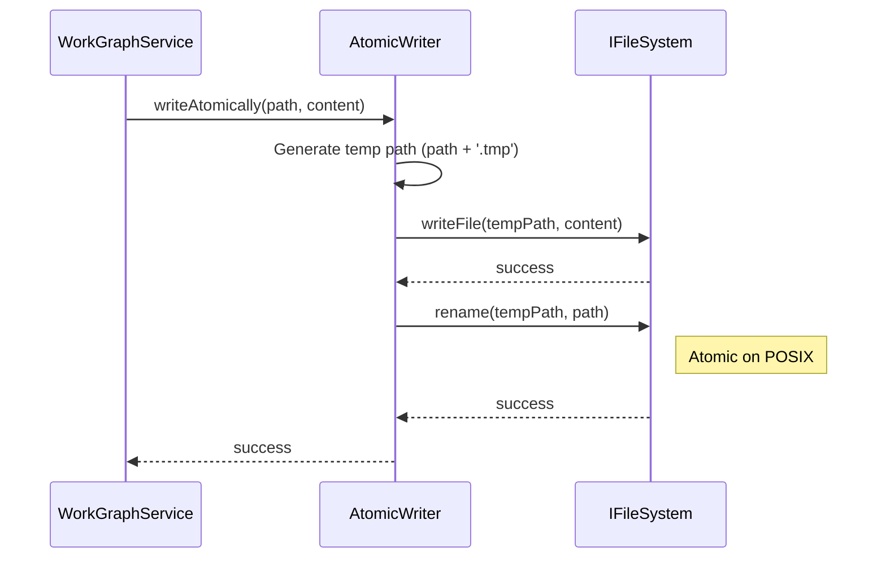

# Phase 3: WorkGraph Core – Tasks & Alignment Brief

**Spec**: [agent-units-spec.md](../../agent-units-spec.md)
**Plan**: [agent-units-plan.md](../../agent-units-plan.md)
**Date**: 2026-01-27

---

## Executive Briefing

### Purpose

This phase implements the core `WorkGraphService` that manages WorkGraph creation, loading, persistence, and status display. WorkGraphs are DAGs of WorkNodes stored in `.chainglass/work-graphs/` that represent executable workflows. Without this service, no graphs can be created or managed.

### What We're Building

A `WorkGraphService` class that:
- Creates new WorkGraphs with a start node and proper directory structure
- Loads existing graphs from `work-graph.yaml` and `state.json`
- Displays graph structure as a tree (for `cg wg show`)
- Reports execution status of all nodes (for `cg wg status`)
- Uses atomic file writes to prevent corruption

### User Value

Users can create reusable workflow graphs that persist across sessions. Each graph maintains its structure (`work-graph.yaml`) and runtime state (`state.json`) independently, enabling checkpoint/resume workflows.

### Example

**Create Graph**:
```bash
$ cg wg create my-workflow
Created graph: my-workflow
Path: .chainglass/work-graphs/my-workflow/
```

**Show Structure**:
```bash
$ cg wg show my-workflow
start
└── (empty)
```

**Status Check**:
```bash
$ cg wg status my-workflow
Graph: my-workflow (pending)
┌──────┬──────┬─────────┬───────────┬─────────────┐
│ ID   │ Unit │ Status  │ Started   │ Completed   │
├──────┼──────┼─────────┼───────────┼─────────────┤
│ start│ —    │ complete│ —         │ —           │
└──────┴──────┴─────────┴───────────┴─────────────┘
```

---

## Objectives & Scope

### Objective

Implement `WorkGraphService` with `create()`, `load()`, `show()`, and `status()` methods per spec AC-01 through AC-03, plus atomic file persistence per Critical Discovery 03.

### Goals

- ✅ Create new graphs with start node and proper directory structure
- ✅ Load graphs from YAML + JSON with schema validation
- ✅ Display graph as tree structure (linear and diverging)
- ✅ Report node execution status (all 6 states)
- ✅ Implement atomic write utility for state.json
- ✅ Handle corruption detection with actionable errors
- ✅ Wire real WorkGraphService into DI container

### Non-Goals (Scope Boundaries)

- ❌ `addNodeAfter()` / `removeNode()` (Phase 4)
- ❌ Cycle detection (Phase 4)
- ❌ Node execution (`start`, `end`, `canRun`) (Phase 5)
- ❌ CLI commands (Phase 6)
- ❌ Input/output data management (Phase 5)
- ❌ Multi-graph operations or graph listing
- ❌ Graph deletion or archival
- ❌ Concurrent access handling (single-user assumption per plan)

---

## Architecture Map

### Component Diagram
<!-- Status: grey=pending, orange=in-progress, green=completed, red=blocked -->
<!-- Updated by plan-6 during implementation -->


### Task-to-Component Mapping

<!-- Status: ⬜ Pending | 🟧 In Progress | ✅ Complete | 🔴 Blocked -->

| Task | Component(s) | Files | Status | Comment |
|------|-------------|-------|--------|---------|
| T001 | Test Setup | test/unit/workgraph/workgraph-service.test.ts | ✅ Complete | Create test file with fixtures |
| T002 | create() Tests | test/unit/workgraph/workgraph-service.test.ts | ✅ Complete | TDD RED: test create cases |
| T003 | create() Impl | packages/workgraph/src/services/workgraph.service.ts | ✅ Complete | TDD GREEN: implement create() |
| T004 | load() Tests | test/unit/workgraph/workgraph-service.test.ts | ✅ Complete | TDD RED: test load cases |
| T005 | load() Impl | packages/workgraph/src/services/workgraph.service.ts | ✅ Complete | TDD GREEN: implement load() |
| T006 | show() Tests | test/unit/workgraph/workgraph-service.test.ts | ✅ Complete | TDD RED: test show cases |
| T007 | show() Impl | packages/workgraph/src/services/workgraph.service.ts | ✅ Complete | TDD GREEN: implement show() |
| T008 | status() Tests | test/unit/workgraph/workgraph-service.test.ts | 🟧 In Progress | TDD RED: test status cases |
| T009 | status() Impl | packages/workgraph/src/services/workgraph.service.ts | ⬜ Pending | TDD GREEN: implement status() |
| T010 | Atomic Write | packages/workgraph/src/services/atomic-file.ts | ⬜ Pending | Per Critical Discovery 03 |
| T011 | State Tests | test/unit/workgraph/workgraph-service.test.ts | ⬜ Pending | Test state.json persistence |
| T012 | State Manager | packages/workgraph/src/services/workgraph.service.ts | ⬜ Pending | state.json load/save logic |
| T013 | DI Container | packages/workgraph/src/container.ts | ⬜ Pending | Wire real WorkGraphService |
| T014 | Integration | test/integration/workgraph/workgraph-lifecycle.test.ts | ⬜ Pending | create → load → show → status |

---

## Tasks

| Status | ID | Task | CS | Type | Dependencies | Absolute Path(s) | Validation | Subtasks | Notes |
|--------|-----|------|----|------|--------------|------------------|------------|----------|-------|
| [x] | T001 | Create workgraph-service.test.ts with fixtures and helpers | 2 | Setup | – | /home/jak/substrate/016-agent-units/test/unit/workgraph/workgraph-service.test.ts | File exists, fixtures defined | – | Sample YAML strings, FakeFileSystem setup helper |
| [x] | T002 | Write failing tests for create() | 2 | Test | T001 | /home/jak/substrate/016-agent-units/test/unit/workgraph/workgraph-service.test.ts | Tests fail with clear expected behavior | – | Success, duplicate slug (E106), invalid slug (E105) |
| [x] | T003 | Implement WorkGraphService.create() | 3 | Core | T002 | /home/jak/substrate/016-agent-units/packages/workgraph/src/services/workgraph.service.ts | All create() tests pass | – | Creates dirs, work-graph.yaml, state.json; **DYK#1**: state.json must include `{ "start": { "status": "complete" } }` |
| [x] | T004 | Write failing tests for load() | 2 | Test | T001 | /home/jak/substrate/016-agent-units/test/unit/workgraph/workgraph-service.test.ts | Tests fail with clear expected behavior | – | Found, not found (E101), corrupted YAML (E130), **DYK#5**: invalid schema (E132) |
| [x] | T005 | Implement WorkGraphService.load() | 2 | Core | T004 | /home/jak/substrate/016-agent-units/packages/workgraph/src/services/workgraph.service.ts | All load() tests pass | – | Parse YAML + JSON, validate schemas |
| [x] | T006 | Write failing tests for show() | 2 | Test | T001 | /home/jak/substrate/016-agent-units/test/unit/workgraph/workgraph-service.test.ts | Tests fail with clear expected behavior | – | **DYK#3**: Test structured TreeNode output, not strings; linear + diverging cases |
| [x] | T007 | Implement WorkGraphService.show() | 3 | Core | T006 | /home/jak/substrate/016-agent-units/packages/workgraph/src/services/workgraph.service.ts | All show() tests pass | – | **DYK#3**: Return `{ tree: TreeNode }` structure; define TreeNode type if needed |
| [x] | T008 | Write failing tests for status() | 2 | Test | T001 | /home/jak/substrate/016-agent-units/test/unit/workgraph/workgraph-service.test.ts | Tests fail with clear expected behavior | – | All 6 node states, graph status computation |
| [x] | T009 | Implement WorkGraphService.status() | 2 | Core | T008 | /home/jak/substrate/016-agent-units/packages/workgraph/src/services/workgraph.service.ts | All status() tests pass | – | **DYK#1**: Read stored status first, only compute if absent; handles start node uniformly |
| [x] | T010a | Add rename() to IFileSystem interface | 2 | Core | – | /home/jak/substrate/016-agent-units/packages/shared/src/interfaces/filesystem.interface.ts, /home/jak/substrate/016-agent-units/packages/shared/src/adapters/node-filesystem.adapter.ts, /home/jak/substrate/016-agent-units/packages/shared/src/fakes/fake-filesystem.ts | rename() works in both adapters | – | **DYK#4**: Blocking dependency for atomic writes; follows Phase 2 glob() pattern |
| [x] | T010 | Implement atomic file write utility | 2 | Core | T003, T010a | /home/jak/substrate/016-agent-units/packages/workgraph/src/services/atomic-file.ts | Write-then-rename pattern works | – | Per CD03; **DYK#2**: Always overwrite .tmp, no recovery logic needed |
| [x] | T011 | Write tests for state.json management | 2 | Test | T001 | /home/jak/substrate/016-agent-units/test/unit/workgraph/workgraph-service.test.ts | Tests cover persist, reload, corruption | – | |
| [x] | T012 | Implement state.json manager (using atomic writes) | 2 | Core | T010, T011 | /home/jak/substrate/016-agent-units/packages/workgraph/src/services/workgraph.service.ts | State persists across loads | – | Uses atomic-file.ts |
| [x] | T013 | Wire real WorkGraphService into DI container | 2 | Integration | T003, T005, T007, T009, T012 | /home/jak/substrate/016-agent-units/packages/workgraph/src/container.ts, /home/jak/substrate/016-agent-units/packages/workgraph/src/services/index.ts | Container resolves real service | – | Replace TODO placeholder |
| [x] | T014 | Integration test: create → load → show → status lifecycle | 3 | Integration | T013 | /home/jak/substrate/016-agent-units/test/integration/workgraph/workgraph-lifecycle.test.ts | Full lifecycle works end-to-end | – | Uses real filesystem |

---

## Alignment Brief

### Prior Phases Review

#### Phase-by-Phase Summary

**Phase 1: Package Foundation & Core Interfaces** (Complete)
- Created `packages/workgraph/` package with all interfaces, types, schemas, errors, and fakes
- Established DI container pattern with child containers per Critical Discovery 01
- All 23 tasks completed, 26 tests passing

**Phase 2: WorkUnit System** (Complete)
- Implemented real `WorkUnitService` with `list()`, `load()`, `create()`, `validate()`
- Extracted `IYamlParser` from workflow to shared package (prevents future coupling)
- Added `glob()` method to `IFileSystem` interface
- All 16 tasks completed, 304 tests passing across all workgraph tests

#### Cumulative Deliverables Available

**From Phase 1 (Foundation)**:
| Category | Path | Description |
|----------|------|-------------|
| Interfaces | `/packages/workgraph/src/interfaces/workgraph-service.interface.ts` | `IWorkGraphService` with all method signatures |
| Schemas | `/packages/workgraph/src/schemas/workgraph.schema.ts` | `WorkGraphDefinitionSchema`, `WorkGraphStateSchema` |
| Errors | `/packages/workgraph/src/errors/workgraph-errors.ts` | Error factories: `graphNotFoundError(E101)`, `invalidGraphSlugError(E105)`, `graphExistsError(E106)` |
| Fakes | `/packages/workgraph/src/fakes/fake-workgraph-service.ts` | `FakeWorkGraphService` with call tracking |
| DI | `/packages/workgraph/src/container.ts` | `createWorkgraphProductionContainer()`, `createWorkgraphTestContainer()` |
| Tokens | `/packages/shared/src/di-tokens.ts` | `WORKGRAPH_DI_TOKENS.WORKGRAPH_SERVICE` |

**From Phase 2 (WorkUnit)**:
| Category | Path | Description |
|----------|------|-------------|
| YAML Parser | `/packages/shared/src/interfaces/yaml-parser.interface.ts` | `IYamlParser`, `YamlParseError` |
| YAML Adapter | `/packages/shared/src/adapters/yaml-parser.adapter.ts` | Real YAML parser |
| YAML Fake | `/packages/shared/src/fakes/fake-yaml-parser.ts` | `FakeYamlParser` for testing |
| glob() | `/packages/shared/src/interfaces/filesystem.interface.ts:133-146` | `IFileSystem.glob()` for pattern matching |
| WorkUnitService | `/packages/workgraph/src/services/workunit.service.ts` | Real implementation (model for this phase) |

#### Pattern Evolution

1. **TDD Pattern**: Phase 1 established contract test factories; Phase 2 used TDD RED-GREEN; Phase 3 continues TDD
2. **Service Pattern**: Phase 2's `WorkUnitService` provides the template for `WorkGraphService`
3. **Error Handling**: Both phases use Result types with errors array (never throw)
4. **DI Pattern**: Child containers with `useFactory` for production, `useValue` for tests

#### Recurring Issues

- **instanceof across packages**: Phase 2 discovered this fails; use dual check `err instanceof X || err.name === 'X'`
- **Build order**: Must build shared before workgraph due to project references

#### Cross-Phase Learnings

- **IYamlParser extraction** (Phase 2 T000): Proactive extraction prevents coupling to potentially-deprecated workflow package
- **glob() addition** (Phase 2 T002a): New interface methods may be discovered during implementation

#### Reusable Test Infrastructure

| Location | Description |
|----------|-------------|
| `test/contracts/workgraph-service.contract.ts` | Contract test factory for IWorkGraphService |
| `FakeFileSystem` | From @chainglass/shared - supports `glob()` |
| `FakeYamlParser` | From @chainglass/shared - preset parse results |
| Test fixtures | Phase 2's YAML fixtures pattern to follow |

---

### Critical Findings Affecting This Phase

| Finding | Constraint | Tasks Affected |
|---------|------------|----------------|
| **Critical Discovery 02** (Result Types) | All methods return `{ ..., errors: ResultError[] }` | T003, T005, T007, T009 |
| **Critical Discovery 03** (Atomic Writes) | state.json writes use temp+rename pattern | T010, T012 |
| **Discovery 09** (Error Codes) | E101-E109 for graph operations, E130-E139 for I/O | T003, T005 |
| **Discovery 10** (Path Security) | Reject paths containing '..' | T003, T005 |

---

### ADR Decision Constraints

No ADRs directly reference workgraph/agent-units. N/A for this phase.

---

### Invariants & Guardrails

- **File Structure**: Graph stored at `.chainglass/work-graphs/<slug>/`
- **Required Files**: `work-graph.yaml` (structure), `state.json` (runtime state)
- **Start Node**: Every graph has a `start` node with status `complete`
- **Slug Format**: `/^[a-z][a-z0-9-]*$/` (lowercase, hyphens, starts with letter)
- **Single-User**: No concurrent access handling required

---

### Inputs to Read

| Path | Purpose |
|------|---------|
| `/packages/workgraph/src/interfaces/workgraph-service.interface.ts` | Method signatures |
| `/packages/workgraph/src/schemas/workgraph.schema.ts` | Zod schemas for validation |
| `/packages/workgraph/src/errors/workgraph-errors.ts` | Error factory functions |
| `/packages/workgraph/src/services/workunit.service.ts` | Reference implementation pattern |
| `/packages/shared/src/interfaces/yaml-parser.interface.ts` | YAML parsing contract |
| `/packages/shared/src/interfaces/filesystem.interface.ts` | File system operations |

---

### Visual Alignment Aids

#### Flow Diagram: WorkGraph Operations

```mermaid
flowchart TD
    subgraph Create["create(slug)"]
        C1[Validate slug format] --> C2{Slug valid?}
        C2 -->|No| C3[Return E105]
        C2 -->|Yes| C4{Graph exists?}
        C4 -->|Yes| C5[Return E106]
        C4 -->|No| C6[Create directories]
        C6 --> C7[Write work-graph.yaml]
        C7 --> C8[Write state.json atomically]
        C8 --> C9[Return success]
    end

    subgraph Load["load(slug)"]
        L1[Resolve path] --> L2{Directory exists?}
        L2 -->|No| L3[Return E101]
        L2 -->|Yes| L4[Read work-graph.yaml]
        L4 --> L5{Parse success?}
        L5 -->|No| L6[Return E130]
        L5 -->|Yes| L7[Validate schema]
        L7 --> L8{Valid?}
        L8 -->|No| L9[Return E132]
        L8 -->|Yes| L10[Read state.json]
        L10 --> L11[Return graph + status]
    end

    subgraph Show["show(slug)"]
        S1[Load graph] --> S2{Loaded?}
        S2 -->|No| S3[Return errors]
        S2 -->|Yes| S4[Build adjacency map]
        S4 --> S5[DFS from start]
        S5 --> S6[Build tree structure]
        S6 --> S7[Return tree]
    end

    subgraph Status["status(slug)"]
        ST1[Load graph] --> ST2{Loaded?}
        ST2 -->|No| ST3[Return errors]
        ST2 -->|Yes| ST4[For each node]
        ST4 --> ST5{Has stored status?}
        ST5 -->|Yes| ST6[Use stored status]
        ST5 -->|No| ST7[Compute from upstream]
        ST6 --> ST8[Build status table]
        ST7 --> ST8
        ST8 --> ST9[Compute graph status]
        ST9 --> ST10[Return result]
    end
```



#### Sequence Diagram: Atomic Write Flow



---

### Test Plan (Full TDD)

| Test | File | Purpose | Fixtures |
|------|------|---------|----------|
| `create() with valid slug succeeds` | workgraph-service.test.ts | Verify directory + files created | FakeFileSystem |
| `create() with duplicate slug returns E106` | workgraph-service.test.ts | Verify duplicate detection | Pre-existing graph |
| `create() with invalid slug returns E105` | workgraph-service.test.ts | Verify slug validation | Invalid slug patterns |
| `load() with existing graph succeeds` | workgraph-service.test.ts | Verify YAML + JSON parsing | Pre-created graph YAML |
| `load() with missing graph returns E101` | workgraph-service.test.ts | Verify not-found handling | Empty filesystem |
| `load() with corrupted YAML returns E130` | workgraph-service.test.ts | Verify parse error handling | Malformed YAML |
| `show() with linear graph builds correct tree` | workgraph-service.test.ts | Verify tree building | start → A → B |
| `show() with diverging graph builds correct tree` | workgraph-service.test.ts | Verify multiple children | start → [A, B] |
| `status() computes pending/ready correctly` | workgraph-service.test.ts | Verify status computation | Mixed state graph |
| `status() returns all 6 node states` | workgraph-service.test.ts | Verify all states handled | Various stored states |
| `state.json persists across loads` | workgraph-service.test.ts | Verify atomic persistence | Modify state, reload |
| `integration: full lifecycle` | workgraph-lifecycle.test.ts | create → load → show → status | Real filesystem |

**Mock Usage Policy**: Fakes only (FakeFileSystem, FakeYamlParser). No vi.mock().

---

### Step-by-Step Implementation Outline

1. **T001**: Create test file with fixtures
   - Import FakeFileSystem, FakeYamlParser, error codes
   - Define sample YAML strings for work-graph.yaml
   - Define sample JSON strings for state.json
   - Create helper: `setupGraph(slug, yaml, json)` sets up fake filesystem

2. **T002-T003**: create() (TDD cycle)
   - RED: Write 3 tests (success, duplicate, invalid)
   - GREEN: Implement create() with slug validation, directory creation, file writes

3. **T004-T005**: load() (TDD cycle)
   - RED: Write 3 tests (found, not found, corrupted)
   - GREEN: Implement load() with YAML parsing, schema validation, JSON parsing

4. **T006-T007**: show() (TDD cycle)
   - RED: Write 2 tests (linear, diverging)
   - GREEN: Implement show() with adjacency map and DFS tree building

5. **T008-T009**: status() (TDD cycle)
   - RED: Write 2 tests (computed states, all 6 states)
   - GREEN: Implement status() with upstream traversal for pending/ready computation

6. **T010**: Atomic write utility
   - Create `atomic-file.ts` with `writeAtomically(fs, path, content)` function
   - Pattern: write to `path.tmp`, then `rename()`

7. **T011-T012**: State management (TDD cycle)
   - RED: Write persistence tests
   - GREEN: Implement saveState() using atomic writes, loadState() with corruption detection

8. **T013**: DI container wiring
   - Update `container.ts` to register real WorkGraphService
   - Update `services/index.ts` barrel export
   - Replace TODO placeholder

9. **T014**: Integration test
   - Full lifecycle: create → load → show → status
   - Uses real filesystem (not fakes)
   - Verifies end-to-end behavior

---

### Commands to Run

```bash
# Environment setup (from repo root)
pnpm install

# Build shared first (project reference)
pnpm -F @chainglass/shared build

# Build workgraph
pnpm -F @chainglass/workgraph build

# Run all workgraph tests
pnpm -F @chainglass/workgraph test

# Run specific test file
pnpm vitest run test/unit/workgraph/workgraph-service.test.ts

# Run with watch mode during development
pnpm vitest test/unit/workgraph/workgraph-service.test.ts

# Type check
pnpm -F @chainglass/workgraph typecheck

# Lint
pnpm -F @chainglass/workgraph lint

# Full quality check
just check
```

---

### Risks/Unknowns

| Risk | Severity | Likelihood | Mitigation |
|------|----------|------------|------------|
| YAML parsing edge cases (empty files, whitespace) | Low | Medium | Comprehensive test cases, follow Phase 2 patterns |
| State file corruption mid-write | High | Low | Atomic write utility (T010) |
| Tree building for complex graphs | Medium | Low | Start with linear/diverging only; no merging in v1 |
| Status computation with cycles | Medium | N/A | Cycles prevented at add-after (Phase 4); not this phase |

---

### Ready Check

- [ ] Prior phases reviewed and understood
- [ ] Critical findings affecting this phase identified (02, 03, 09, 10)
- [ ] ADR constraints mapped to tasks (N/A - no relevant ADRs)
- [ ] All task dependencies documented
- [ ] Test plan covers all acceptance criteria
- [ ] Risks identified with mitigations

**Await explicit GO/NO-GO before implementation.**

---

## Phase Footnote Stubs

_Populated during implementation by plan-6._

| ID | Type | Description | Cross-ref |
|----|------|-------------|-----------|
| | | | |

---

## Evidence Artifacts

| Artifact | Location | Description |
|----------|----------|-------------|
| Execution Log | `./execution.log.md` | Implementation narrative with timestamps |
| Test Results | Captured in execution log | vitest output snapshots |
| Build Output | Captured in execution log | tsc/turbo output |

---

## Discoveries & Learnings

_Populated during implementation by plan-6. Log anything of interest to your future self._

| Date | Task | Type | Discovery | Resolution | References |
|------|------|------|-----------|------------|------------|
| | | | | | |

**Types**: `gotcha` | `research-needed` | `unexpected-behavior` | `workaround` | `decision` | `debt` | `insight`

**What to log**:
- Things that didn't work as expected
- External research that was required
- Implementation troubles and how they were resolved
- Gotchas and edge cases discovered
- Decisions made during implementation
- Technical debt introduced (and why)
- Insights that future phases should know about

_See also: `execution.log.md` for detailed narrative._

---

## Directory Layout

```
docs/plans/016-agent-units/
├── agent-units-spec.md
├── agent-units-plan.md
└── tasks/
    ├── phase-1-package-foundation-core-interfaces/
    │   ├── tasks.md
    │   └── execution.log.md
    ├── phase-2-workunit-service-implementation/
    │   ├── tasks.md
    │   └── execution.log.md
    └── phase-3-workgraph-core/
        ├── tasks.md          # ← This file
        └── execution.log.md  # Created by plan-6
```

---

## Critical Insights Discussion

**Session**: 2026-01-27
**Context**: Phase 3: WorkGraph Core - Tasks & Alignment Brief
**Analyst**: AI Clarity Agent
**Reviewer**: Development Team
**Format**: Water Cooler Conversation (5 Critical Insights)

### Insight 1: Start Node Complete Status Bootstrap

**Did you know**: The start node must be `complete` at creation, but status() computes from upstream — creating a bootstrap problem for nodes with no upstream.

**Implications**:
- Start node is semantically different (a gate, not work)
- Status algorithm needs to handle the root case explicitly
- Without handling, start could show as `pending` or crash

**Options Considered**:
- Option A: Hardcode start node check — simple but magic string
- Option B: Store status in state.json, trust it — uniform handling
- Option C: Zero upstream = complete — risky semantics for orphans

**AI Recommendation**: Option B (Store Status in state.json)
- Reasoning: Explicit state is cleaner; algorithm treats all nodes uniformly; future-proof for Phase 5 execution.

**Discussion Summary**: Quick agreement that storing explicit status is cleaner than hardcoded checks.

**Decision**: Store start node status explicitly in state.json at creation time

**Action Items**:
- [x] T003 notes updated to require `{ "start": { "status": "complete" } }` in state.json
- [x] T009 notes updated to read stored status first

**Affects**: T003, T009, T011, T012

---

### Insight 2: Atomic Write Temp File Recovery

**Did you know**: The atomic write pattern prevents partial writes but doesn't handle leftover `.tmp` files from previous crashes.

**Implications**:
- Stale `.tmp` files could exist after crashes
- Need to decide: clean up, ignore, or recover?
- Single-user CLI doesn't need complex recovery

**Options Considered**:
- Option A: Always overwrite temp, ignore on load — simplest
- Option B: Clean up temp files on load — cleaner filesystem
- Option C: Two-phase commit with marker — over-engineered

**AI Recommendation**: Option A (Always Overwrite, Ignore)
- Reasoning: Simplest approach; single-user assumption; leftover temps are harmless.

**Discussion Summary**: Agreement that YAGNI applies — no recovery logic needed.

**Decision**: Always overwrite temp files, ignore `.tmp` on load

**Action Items**:
- [x] T010 notes updated

**Affects**: T010, T012

---

### Insight 3: show() Output Format Ambiguity

**Did you know**: The `show()` method returns a "tree structure" but the interface doesn't specify whether it's pre-rendered ASCII or a structured object.

**Implications**:
- Pre-rendered string mixes concerns (service does presentation)
- Structured tree is testable and reusable for other formats
- CLI (Phase 6) needs to consume whatever we return

**Options Considered**:
- Option A: Return structured TreeNode object — clean separation
- Option B: Return pre-rendered string — simple CLI
- Option C: Return both — maximum flexibility but duplication

**AI Recommendation**: Option A (Structured Tree Object)
- Reasoning: Separation of concerns; testable structure; future flexibility for JSON/HTML output.

**Discussion Summary**: Agreement on structured data approach.

**Decision**: Return structured `TreeNode` object from `show()`, CLI handles rendering

**Action Items**:
- [x] T006 notes updated for structured output testing
- [x] T007 notes updated to define TreeNode type

**Affects**: T006, T007, Phase 6 (CLI)

---

### Insight 4: IFileSystem Missing rename() Method

**Did you know**: The atomic write pattern requires `rename()`, but `IFileSystem` doesn't have this method — blocking T010 implementation.

**Implications**:
- Can't implement atomic writes without rename
- Workarounds (copy+unlink) defeat the purpose
- Direct `fs.rename` breaks Critical Discovery 04

**Options Considered**:
- Option A: Add rename() to IFileSystem — correct fix
- Option B: Workaround with copyFile + unlink — not atomic
- Option C: Use fs.rename directly — breaks abstraction

**AI Recommendation**: Option A (Add rename() to IFileSystem)
- Reasoning: Follows Phase 2 pattern (glob addition); maintains abstraction; enables testable atomic writes.

**Discussion Summary**: Agreement to add new task following Phase 2 precedent.

**Decision**: Add `rename()` method to `IFileSystem` interface as T010a

**Action Items**:
- [x] Added T010a task for rename() implementation
- [x] Updated T010 to depend on T010a

**Affects**: T010, IFileSystem, NodeFileSystemAdapter, FakeFileSystem

---

### Insight 5: Missing E132 Schema Validation Test

**Did you know**: The test plan covers E130 (YAML parse error) but not E132 (valid YAML that fails schema validation).

**Implications**:
- E130 = syntax error, E132 = semantic error — different code paths
- Without E132 test, schema validation error handling is untested
- Phase 2 tested both patterns

**Options Considered**:
- Option A: Add E132 test case to T004 — one more test
- Option B: Separate task for validation tests — over-engineering
- Option C: Trust schema, don't test — risky

**AI Recommendation**: Option A (Add E132 to T004)
- Reasoning: One extra test case; follows Phase 2 pattern; ensures error path coverage.

**Discussion Summary**: Quick agreement on adding the test case.

**Decision**: Add E132 (schema validation error) test case to T004

**Action Items**:
- [x] T004 notes updated to include E132 test case

**Affects**: T004

---

## Session Summary

**Insights Surfaced**: 5 critical insights identified and discussed
**Decisions Made**: 5 decisions reached through collaborative discussion
**Action Items Created**: 6 task notes updated, 1 new task added (T010a)
**Task Count**: Now 15 tasks (was 14)

**Shared Understanding Achieved**: ✓

**Confidence Level**: High — Key implementation details clarified before coding begins.

**Next Steps**:
Proceed with `/plan-6-implement-phase` for Phase 3 implementation.

**Notes**:
- T010a (rename) follows same pattern as Phase 2's T002a (glob)
- TreeNode type may need to be added to interfaces during T007
- All decisions align with existing patterns from Phases 1-2
