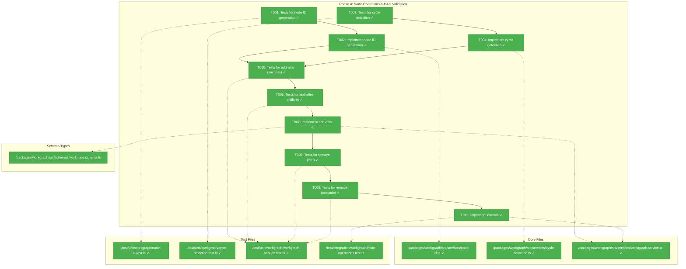
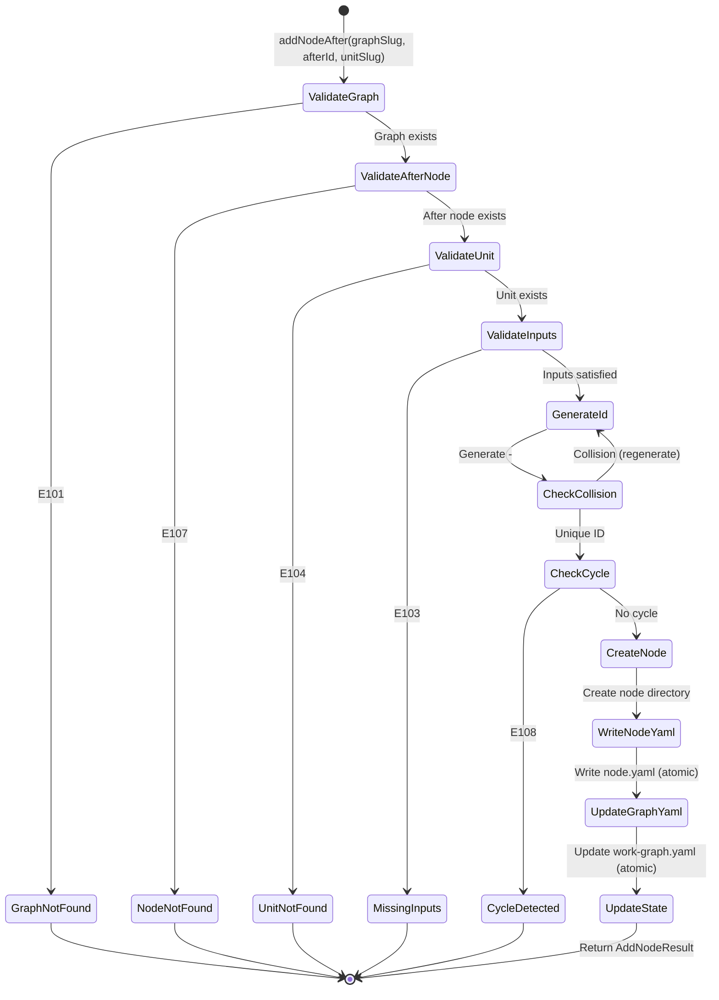
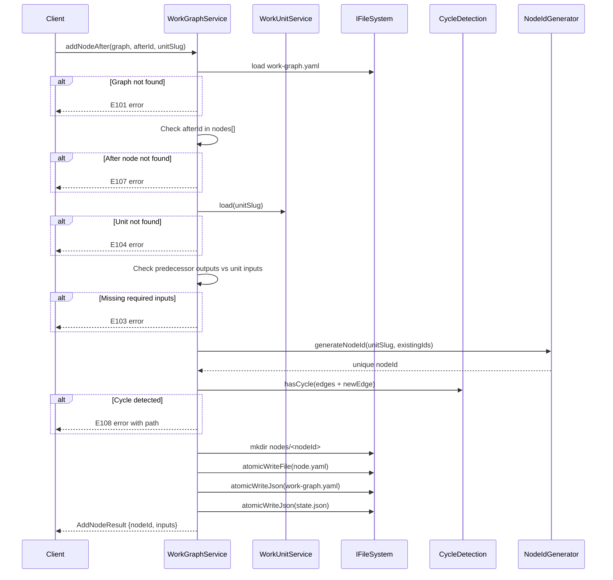

# Phase 4: Node Operations & DAG Validation – Tasks & Alignment Brief

**Spec**: [agent-units-spec.md](../../agent-units-spec.md)
**Plan**: [agent-units-plan.md](../../agent-units-plan.md)
**Date**: 2026-01-27

---

## Executive Briefing

### Purpose

This phase implements the core node manipulation operations (`addNodeAfter`, `removeNode`) and the DAG validation infrastructure that ensures graphs remain acyclic. Without these operations, users cannot build graphs beyond the initial start node or remove unwanted nodes.

### What We're Building

The `WorkGraphService` node operations that:
- Generate unique node IDs in format `<unit-slug>-<hex3>` (e.g., `write-poem-b2c`)
- Add nodes after existing nodes with automatic input/output wiring
- Detect cycles at insertion time using DFS algorithm (E108)
- Validate required inputs are satisfied (E103)
- Remove nodes (leaf or cascade) with proper cleanup

### User Value

Users can compose WorkGraphs by adding nodes after existing nodes. The system validates that inputs are available and prevents cycles, catching errors at build time rather than execution time. Users can also remove nodes they no longer need, either individually (leaf) or cascading dependent nodes.

### Example

**Add Node**:
```bash
$ cg wg node add-after start user-input-text --config prompt="Enter topic"
Created node: user-input-text-a7f
  Inputs: (none required)
  Outputs: text

$ cg wg node add-after user-input-text-a7f write-poem
Created node: write-poem-b2c
  Inputs: topic ← user-input-text-a7f.text
  Outputs: poem
```

**Remove Node**:
```bash
$ cg wg node remove write-poem-b2c
Removed node: write-poem-b2c

$ cg wg node remove user-input-text-a7f
Error E102: Cannot remove node with dependents: write-poem-b2c
  Use --cascade to remove all dependent nodes
```

---

## Objectives & Scope

### Objective

Implement node operations and DAG validation as specified in plan acceptance criteria AC-04 through AC-08, AC-16.

### Goals

- ✅ Generate node IDs in `<unit-slug>-<hex3>` format with collision detection
- ✅ Implement DFS-based cycle detection that returns the cycle path
- ✅ Implement `addNodeAfter()` with input validation (E103 for missing inputs)
- ✅ Implement `addNodeAfter()` with cycle detection (E108 for cycles)
- ✅ Implement `removeNode()` for leaf nodes
- ✅ Implement `removeNode()` with cascade option for non-leaf nodes (E102 without cascade)
- ✅ Write node.yaml and update state.json atomically
- ✅ Store unit schema snapshot in node.yaml for future validation

### Non-Goals

- ❌ Execution of nodes (Phase 5)
- ❌ CLI commands (Phase 6)
- ❌ Multi-parent support (merging/diamond patterns) - v1 limitation
- ❌ Unit versioning - v1 limitation
- ❌ Node reordering or edge modification after creation
- ❌ Subgraph nesting - v1 limitation

---

## Architecture Map

### Component Diagram
<!-- Status: grey=pending, orange=in-progress, green=completed, red=blocked -->
<!-- Updated by plan-6 during implementation -->



### Task-to-Component Mapping

<!-- Status: ⬜ Pending | 🟧 In Progress | ✅ Complete | 🔴 Blocked -->

| Task | Component(s) | Files | Status | Comment |
|------|-------------|-------|--------|---------|
| T001 | Node ID Tests | node-id.test.ts | ✅ Complete | TDD: Write tests for format, uniqueness, collision |
| T002 | Node ID Generator | node-id.ts | ✅ Complete | Format: `<unit-slug>-<hex3>`, handle collisions |
| T003 | Cycle Detection Tests | cycle-detection.test.ts | ✅ Complete | TDD: No cycle, simple cycle, complex cycle paths |
| T004 | Cycle Detection | cycle-detection.ts | ✅ Complete | DFS algorithm returning cycle path |
| T005 | Add-After Tests (Success) | workgraph-service.test.ts | ✅ Complete | Valid wiring scenarios |
| T006 | Add-After Tests (Failure) | workgraph-service.test.ts | ✅ Complete | E103 missing input, E108 cycle |
| T007 | Add-After Implementation | workgraph.service.ts | ✅ Complete | Core operation with all validations |
| T008 | Remove Tests (Leaf) | workgraph-service.test.ts | ✅ Complete | Simple leaf node removal |
| T009 | Remove Tests (Cascade) | workgraph-service.test.ts | ✅ Complete | E102 with dependents, --cascade option |
| T010 | Remove Implementation | workgraph.service.ts | ✅ Complete | Leaf and cascade removal |

---

## Tasks

| Status | ID | Task | CS | Type | Dependencies | Absolute Path(s) | Validation | Subtasks | Notes |
|--------|------|------|-----|------|--------------|------------------|------------|----------|-------|
| [x] | T001 | Write tests for node ID generation | 2 | Test | – | /home/jak/substrate/016-agent-units/test/unit/workgraph/node-id.test.ts | Tests cover: format `<unit>-<hex3>`, uniqueness, collision handling | – | Per Discovery 11 |
| [x] | T002 | Implement generateNodeId() utility | 2 | Core | T001 | /home/jak/substrate/016-agent-units/packages/workgraph/src/services/node-id.ts, /home/jak/substrate/016-agent-units/packages/workgraph/src/services/index.ts | All tests pass, IDs unique within graph | – | `start` reserved |
| [x] | T003 | Write tests for cycle detection | 3 | Test | – | /home/jak/substrate/016-agent-units/test/unit/workgraph/cycle-detection.test.ts | Tests cover: no cycle, simple A→B→C→A, complex diamond-like patterns, returns path | – | Per CD04 |
| [x] | T004 | Implement hasCycle() algorithm | 3 | Core | T003 | /home/jak/substrate/016-agent-units/packages/workgraph/src/services/cycle-detection.ts, /home/jak/substrate/016-agent-units/packages/workgraph/src/services/index.ts | DFS detects all cycles, returns cycle path for error messages | – | Per CD04 |
| [x] | T005 | Write tests for addNodeAfter() success cases | 2 | Test | T002, T004 | /home/jak/substrate/016-agent-units/test/unit/workgraph/workgraph-service.test.ts | Tests cover: valid wiring, auto-mapping inputs, node.yaml creation with unit_slug field | – | Plan 4.5; DYK#1 |
| [x] | T006 | Write tests for addNodeAfter() failure cases | 2 | Test | T005 | /home/jak/substrate/016-agent-units/test/unit/workgraph/workgraph-service.test.ts | Tests cover: E103 missing input, E103 name mismatch (DYK#3), E108 cycle, E101 graph not found, E104 unit not found, E107 after-node not found | – | Plan 4.6; Per CD05, DYK#3 |
| [x] | T007 | Implement addNodeAfter() with full validation | 3 | Core | T006 | /home/jak/substrate/016-agent-units/packages/workgraph/src/services/workgraph.service.ts, /home/jak/substrate/016-agent-units/packages/workgraph/src/schemas/worknode.schema.ts | All tests pass; creates node.yaml with unit_slug + unit schema snapshot; updates work-graph.yaml and state.json atomically | – | Plan 4.7; Per CD04, CD05, DYK#1, DYK#2 (add IWorkUnitService to constructor) |
| [x] | T008 | Write tests for removeNode() leaf case | 2 | Test | T007 | /home/jak/substrate/016-agent-units/test/unit/workgraph/workgraph-service.test.ts | Tests cover: leaf removal, directory deleted, edges cleaned | – | Plan 4.8 |
| [x] | T009 | Write tests for removeNode() with dependents | 2 | Test | T008 | /home/jak/substrate/016-agent-units/test/unit/workgraph/workgraph-service.test.ts | Tests cover: E102 without cascade, success with cascade, start node protected | – | Plan 4.9 |
| [x] | T010 | Implement removeNode() with cascade support | 3 | Core | T009 | /home/jak/substrate/016-agent-units/packages/workgraph/src/services/workgraph.service.ts, /home/jak/substrate/016-agent-units/test/integration/workgraph/node-operations.test.ts | All tests pass; atomic updates; returns list of removed nodes | – | Plan 4.10 |

---

## Alignment Brief

### Prior Phases Review

#### Phase 1: Package Foundation & Core Interfaces (Complete)

**A. Deliverables Created**:
- `/home/jak/substrate/016-agent-units/packages/workgraph/` - Full package structure
- Interfaces: `IWorkUnitService`, `IWorkGraphService`, `IWorkNodeService`
- Zod schemas: `WorkUnitSchema`, `WorkGraphDefinitionSchema`, `WorkNodeConfigSchema`
- Error codes E101-E149 with factory functions
- Fakes with call tracking: `FakeWorkUnitService`, `FakeWorkGraphService`, `FakeWorkNodeService`
- DI tokens: `WORKGRAPH_DI_TOKENS` in shared package
- Container factories: `createWorkgraphProductionContainer()`, `createWorkgraphTestContainer()`

**B. Lessons Learned**:
- Interface-first development with fakes before implementations
- `addNodeAfter()`/`removeNode()` belong in `IWorkGraphService` not `IWorkNodeService` (Insight 5)
- Contract tests require implementations to exist first (not true TDD RED)

**C. Technical Discoveries**:
- pnpm install warnings for glob@7/inflight@1 are acceptable (transitive deps)
- Build order: shared → workgraph (tsconfig references)

**D. Dependencies Exported**:
- `IWorkGraphService.addNodeAfter()` and `removeNode()` signatures
- Error factory functions: `graphNotFoundError()`, `unitNotFoundError()`, `cycleDetectedError()`, `missingRequiredInputsError()`, `cannotRemoveWithDependentsError()`
- `AddNodeResult`, `RemoveNodeResult`, `AddNodeOptions`, `RemoveNodeOptions` types

**E. Critical Findings Applied**: CD01 (DI containers), CD02 (Result types), CD08 (Fakes), CD09 (Error codes)

**F. Incomplete Items**: None

**G. Test Infrastructure**: Contract test factories in `/test/contracts/`

**H. Technical Debt**: None

**I. Architectural Decisions**: Fakes-only testing, child container isolation

**J. Scope Changes**: Interface split per Insight 5

---

#### Phase 2: WorkUnit System (Complete)

**A. Deliverables Created**:
- `/home/jak/substrate/016-agent-units/packages/workgraph/src/services/workunit.service.ts` - Full implementation (426 lines)
- `IYamlParser`, `YamlParserAdapter`, `FakeYamlParser` extracted to shared package
- `IFileSystem.glob()` method added for unit discovery
- 35 tests (15 unit + 16 contract + 4 integration)

**B. Lessons Learned**:
- `instanceof` gotcha: When re-exporting classes, original file must be pure re-export
- Dual error check pattern: `err instanceof X || err.name === 'X'` for cross-package safety

**C. Technical Discoveries**:
- fast-glob provides clean async API for pattern matching
- Zod error path extraction: `'/' + issue.path.join('/')` produces JSON pointer

**D. Dependencies Exported**:
- `WorkUnitService.load(slug)` - **CRITICAL FOR PHASE 4**: Used to validate unit exists and get input/output schema
- `WorkUnitService.list()` - For UI/CLI unit selection
- Error codes E120-E132

**E. Critical Findings Applied**: CD01, CD02, CD08, CD09, CD10 (Path security)

**F. Incomplete Items**: None

**G. Test Infrastructure**: FakeYamlParser, sample YAML fixtures for all unit types

**H. Technical Debt**: Empty catch block in list() (intentional for partial results)

**I. Architectural Decisions**: Constructor injection with 3 dependencies, JSON pointer paths for errors

**J. Scope Changes**: T000 (IYamlParser extraction), T002a (glob() addition)

---

#### Phase 3: WorkGraph Core (Complete)

**A. Deliverables Created**:
- `/home/jak/substrate/016-agent-units/packages/workgraph/src/services/workgraph.service.ts` - `create()`, `load()`, `show()`, `status()` implemented
- `/home/jak/substrate/016-agent-units/packages/workgraph/src/services/atomic-file.ts` - `atomicWriteFile()`, `atomicWriteJson()`
- `IFileSystem.rename()` method added for atomic operations
- 50 tests (27 unit + 4 integration + 19 from related files)

**B. Lessons Learned**:
- Start node stored as `{status: "complete"}` at creation (DYK#1)
- `.tmp` files always overwritten, no recovery needed (DYK#2)
- `show()` returns structured `ShowTreeNode`, not string (DYK#3)

**C. Technical Discoveries**:
- Slug validation must reject `..`, `/`, `\` for path traversal security
- Computed vs stored status: read stored first, only compute `pending`/`ready` if absent

**D. Dependencies Exported**:
- `WorkGraphService.load()` - **CRITICAL FOR PHASE 4**: Returns `WorkGraphDefinition` with nodes[] and edges[]
- `atomicWriteFile()`, `atomicWriteJson()` - **CRITICAL FOR PHASE 4**: Used for node.yaml and state.json updates
- `GraphEdge`, `InputMapping` types
- `ShowTreeNode` for tree traversal

**E. Critical Findings Applied**: CD02, CD03 (Atomic writes)

**F. Incomplete Items**: `addNodeAfter()` and `removeNode()` stubs (Phase 4 scope)

**G. Test Infrastructure**: `createTestContext()`, `setupGraph()` helpers; FakeFileSystem fixtures for graphs

**H. Technical Debt**: None

**I. Architectural Decisions**: Stored status first then computed fallback, structured tree return

**J. Scope Changes**: T010a (rename() interface addition)

---

### Cumulative Deliverables Available to Phase 4

| Component | Path | Purpose for Phase 4 |
|-----------|------|---------------------|
| WorkUnitService | `packages/workgraph/src/services/workunit.service.ts` | Load unit to get input/output schema |
| WorkGraphService | `packages/workgraph/src/services/workgraph.service.ts` | Extend with addNodeAfter/removeNode |
| atomicWriteFile | `packages/workgraph/src/services/atomic-file.ts` | Write node.yaml atomically |
| atomicWriteJson | `packages/workgraph/src/services/atomic-file.ts` | Update state.json atomically |
| IFileSystem.rename | `packages/shared/src/interfaces/filesystem.interface.ts` | Used by atomic writes |
| WorkGraphDefinition | `packages/workgraph/src/interfaces/workgraph-service.interface.ts` | Access nodes[], edges[] |
| FakeYamlParser | `packages/shared/src/fakes/fake-yaml-parser.ts` | Test fixtures |
| Contract tests | `test/contracts/workgraph-service.contract.ts` | Verify addNodeAfter/removeNode |

### Reusable Test Infrastructure

From Phase 1:
- Contract test factories for `IWorkGraphService`
- Fake services with call tracking

From Phase 2:
- FakeYamlParser with configurable results
- Sample YAML fixtures for unit types (agent, code, user-input)

From Phase 3:
- `createTestContext()` helper for fresh test setup
- `setupGraph()` helper for configuring FakeFileSystem with graph data
- Sample graph YAML fixtures (empty, linear, diverging)
- State.json fixtures with all 6 node status values

---

### Critical Findings Affecting This Phase

| Finding | Constraint/Requirement | Tasks Affected |
|---------|----------------------|----------------|
| **CD04: DAG Cycle Detection** | DFS-based detection at edge insertion time; E108 error with cycle path | T003, T004, T006, T007 |
| **CD05: Input/Output Name Matching** | Validate at insertion time; store unit schema snapshot in node.yaml | T005, T006, T007 |
| **Discovery 11: Node ID Format** | Format `<unit-slug>-<hex3>`; `start` reserved; collision detection | T001, T002 |
| **CD03: Atomic File Writes** | Use atomicWriteFile/Json for node.yaml and state.json | T007, T010 |
| **CD02: Result Types** | All methods return `{..., errors: ResultError[]}` | T007, T010 |

---

### ADR Decision Constraints

No ADRs directly reference WorkGraph/agent-units. N/A for this phase.

---

### Invariants & Guardrails

1. **Graph Acyclicity**: Graph must remain a DAG after every addNodeAfter() - validate before persisting
2. **Start Node Protected**: Start node cannot be removed (special case in removeNode)
3. **Atomic Persistence**: All file writes use temp+rename pattern
4. **Input Satisfaction**: Required inputs must be available from predecessor outputs
5. **Strict Name Matching**: Input wiring uses exact name matching only - output `foo` wires to input `foo`, not `bar` (DYK#3)
6. **First Node Constraint**: First node after START must have no required inputs, since START produces no outputs (DYK#4)

---

### Inputs to Read

| File | Purpose |
|------|---------|
| `packages/workgraph/src/services/workgraph.service.ts` | Extend with addNodeAfter/removeNode |
| `packages/workgraph/src/services/workunit.service.ts` | Load unit for input/output validation |
| `packages/workgraph/src/interfaces/workgraph-service.interface.ts` | AddNodeResult, RemoveNodeResult types |
| `packages/workgraph/src/errors/workgraph-errors.ts` | Error factory functions |
| `packages/workgraph/src/schemas/worknode.schema.ts` | Node config schema |
| `packages/workgraph/src/container.ts` | Update container factories for IWorkUnitService injection (DYK#2) |
| `test/unit/workgraph/workgraph-service.test.ts` | Add new test cases |

---

### Visual Alignment Aids

#### State Flow: addNodeAfter



#### Sequence: addNodeAfter



---

### Test Plan (Full TDD)

**Mock Policy**: Fakes only (per plan § 4.4)

#### T001/T002: Node ID Generation

| Test | Rationale | Expected |
|------|-----------|----------|
| `generates format <unit>-<hex3>` | Discovery 11 format | `write-poem-a7f` matches pattern |
| `generates unique IDs` | No collisions | 1000 generations = 1000 unique |
| `handles collision by regenerating` | Collision detection | If `abc` exists, generates different |
| `rejects 'start' as unit slug` | Reserved ID | Throws or returns error |

#### T003/T004: Cycle Detection

| Test | Rationale | Expected |
|------|-----------|----------|
| `returns false for empty graph` | Base case | `{hasCycle: false}` |
| `returns false for linear chain A→B→C` | Valid DAG | `{hasCycle: false}` |
| `returns true for simple cycle A→B→A` | CD04 requirement | `{hasCycle: true, path: [A,B,A]}` |
| `returns true for complex cycle A→B→C→A` | CD04 requirement | `{hasCycle: true, path: [A,B,C,A]}` |
| `returns true for cycle in middle A→B→C→B` | Inner cycle | `{hasCycle: true, path: [B,C,B]}` |
| `detects cycle after adding new edge` | Integration | Adding C→A to A→B→C = cycle |

#### T005: addNodeAfter Success Cases

| Test | Rationale | Expected |
|------|-----------|----------|
| `adds node after start with no inputs required` | AC-04 | Node created, edge added |
| `auto-maps inputs from predecessor outputs` | AC-06 | InputMapping populated correctly |
| `creates node.yaml with unit_slug field` | DYK#1 - avoid parsing ambiguity | node.yaml contains explicit unit_slug |
| `creates node.yaml with unit schema snapshot` | CD05 requirement | node.yaml contains unit_schema_snapshot |
| `updates state.json with pending status` | Consistency | New node in state.json |

#### T006: addNodeAfter Failure Cases

| Test | Rationale | Expected |
|------|-----------|----------|
| `returns E101 for non-existent graph` | Error handling | E101 with actionable message |
| `returns E107 for non-existent after-node` | Error handling | E107 |
| `returns E104 for non-existent unit` | Error handling | E104 |
| `returns E103 for missing required inputs` | AC-05, CD05 | E103 listing missing inputs |
| `returns E103 for name mismatch (text→topic)` | DYK#3 strict matching | E103 even when output exists with different name |
| `returns E108 with cycle path` | AC-16, CD04 | E108 with path array |

#### T008/T009/T010: removeNode

| Test | Rationale | Expected |
|------|-----------|----------|
| `removes leaf node` | AC-08 | Node removed, edge cleaned, dir deleted |
| `returns E102 for node with dependents` | AC-07 | E102 listing dependents |
| `removes node cascade with --cascade` | AC-07 alt | All dependents removed |
| `protects start node from removal` | Invariant | Error returned |
| `returns list of all removed nodes` | Result type | removedNodes[] complete |

---

### Step-by-Step Implementation Outline

1. **T001**: Create `/test/unit/workgraph/node-id.test.ts` with failing tests
2. **T002**: Create `/packages/workgraph/src/services/node-id.ts` with `generateNodeId()`
3. **T003**: Create `/test/unit/workgraph/cycle-detection.test.ts` with failing tests
4. **T004**: Create `/packages/workgraph/src/services/cycle-detection.ts` with `hasCycle()`
5. **T005**: Add success case tests to `workgraph-service.test.ts`
6. **T006**: Add failure case tests to `workgraph-service.test.ts`
7. **T007**: Implement `addNodeAfter()` in `workgraph.service.ts`:
   - Load graph, validate after-node exists
   - Load unit, validate inputs
   - Generate unique node ID
   - Check for cycles
   - Create node directory and node.yaml
   - Update work-graph.yaml and state.json atomically
8. **T008**: Add leaf removal tests
9. **T009**: Add cascade removal tests
10. **T010**: Implement `removeNode()`:
    - Find dependents
    - If dependents and !cascade, return E102
    - If cascade, collect all descendants
    - Delete node directories
    - Update work-graph.yaml and state.json atomically

---

### Commands to Run

```bash
# Environment setup
cd /home/jak/substrate/016-agent-units
pnpm install

# Run specific test file (during development)
pnpm vitest run test/unit/workgraph/node-id.test.ts
pnpm vitest run test/unit/workgraph/cycle-detection.test.ts
pnpm vitest run test/unit/workgraph/workgraph-service.test.ts

# Run all workgraph tests
pnpm vitest run --filter workgraph

# Type checking
pnpm typecheck

# Linting
pnpm lint

# Full check
just check
```

---

### Risks/Unknowns

| Risk | Severity | Mitigation |
|------|----------|------------|
| Cycle detection edge cases | Medium | Comprehensive test suite with varied graph shapes |
| Input wiring complexity | Medium | Exact name matching per spec; no type coercion in Phase 4 |
| Node ID collisions | Low | 16^3 = 4096 possible IDs; regenerate on collision |
| Concurrent file access | Low | Single-user assumption (plan § 2.4); atomic writes |

---

### Ready Check

- [ ] Phase 1-3 deliverables reviewed and available
- [ ] Critical Findings CD04, CD05, Discovery 11 understood
- [ ] Error codes E102, E103, E107, E108 defined in workgraph-errors.ts
- [ ] Test fixtures for graphs and units available
- [ ] ADR constraints mapped to tasks (IDs noted in Notes column) - N/A (no relevant ADRs)

**Awaiting explicit GO/NO-GO from human sponsor.**

---

## Phase Footnote Stubs

_Footnotes will be added by plan-6 during implementation as architectural decisions or deviations are recorded._

| ID | Task | Description | Impact |
|----|------|-------------|--------|
| | | | |

---

## Evidence Artifacts

**Execution Log**: `/home/jak/substrate/016-agent-units/docs/plans/016-agent-units/tasks/phase-4-node-operations-dag-validation/execution.log.md`

**Test Output**: Will be captured in execution log as tasks complete.

**Files Created/Modified**: Listed in execution log per task.

---

## Discoveries & Learnings

_Populated during implementation by plan-6. Log anything of interest to your future self._

| Date | Task | Type | Discovery | Resolution | References |
|------|------|------|-----------|------------|------------|
| 2026-01-27 | T005/T007 | decision | DYK#1: Unit slug parsing ambiguity - unit slugs ending in `-[a-f0-9]{3}` would be ambiguous when extracting from node ID | Store `unit_slug` explicitly in node.yaml instead of parsing from node ID | /didyouknow session |
| 2026-01-27 | T007 | decision | DYK#2: WorkGraphService needs WorkUnitService to validate inputs in addNodeAfter() | Add `IWorkUnitService` to constructor (interface injection); update container factories | /didyouknow session |
| 2026-01-27 | T005/T006 | decision | DYK#3: Input wiring uses strict name matching only - output `text` wires to input `text`, but `text` → `topic` fails with E103 | v1 uses exact name matching; explicit mapping deferred to v2 | /didyouknow session, CD05 |
| 2026-01-27 | T005/T006 | decision | DYK#4: First node after START must have no required inputs (START has no outputs) | v1: Document constraint, use UserInputUnit pattern; INPUT control node deferred to future | /didyouknow session, workshops/special-nodes.md |
| 2026-01-27 | – | insight | DYK#5: Special Nodes concept - control nodes (START, INPUT, OUTPUT) vs unit nodes; enables future graph composition | v1: START only; INPUT/OUTPUT deferred; see workshops/special-nodes.md for full design | /didyouknow session, /plan-2c-workshop |

**Types**: `gotcha` | `research-needed` | `unexpected-behavior` | `workaround` | `decision` | `debt` | `insight`

**What to log**:
- Things that didn't work as expected
- External research that was required
- Implementation troubles and how they were resolved
- Gotchas and edge cases discovered
- Decisions made during implementation
- Technical debt introduced (and why)
- Insights that future phases should know about

_See also: `execution.log.md` for detailed narrative._

---

## Directory Layout

```
docs/plans/016-agent-units/
├── agent-units-spec.md
├── agent-units-plan.md
└── tasks/
    ├── phase-1-package-foundation-core-interfaces/
    │   ├── tasks.md
    │   └── execution.log.md
    ├── phase-2-workunit-service-implementation/
    │   ├── tasks.md
    │   └── execution.log.md
    ├── phase-3-workgraph-core/
    │   ├── tasks.md
    │   └── execution.log.md
    └── phase-4-node-operations-dag-validation/
        ├── tasks.md              # This file
        └── execution.log.md      # Created by plan-6
```

---

## Critical Insights Discussion

**Session**: 2026-01-27
**Context**: Phase 4 Tasks Dossier Review (Node Operations & DAG Validation)
**Analyst**: AI Clarity Agent
**Reviewer**: jak
**Format**: Water Cooler Conversation (5 Critical Insights)

### Insight 1: Unit Slug Parsing Ambiguity (DYK#1)

**Did you know**: Unit slugs ending in `-[a-f0-9]{3}` would be ambiguous when extracting from node ID format `<unit-slug>-<hex3>`.

**Implications**:
- `extractUnitSlug()` regex could misparse edge cases
- Affects `show()`, `status()`, and future CLI display

**Options Considered**:
- Option A: Restrict unit slugs - Disallow hex-ending patterns
- Option B: Store explicitly - Add `unit_slug` field to node.yaml
- Option C: Different delimiter - Use `__` instead of `-`
- Option D: Longer hex - Use 6 chars instead of 3

**AI Recommendation**: Option B (Store explicitly)

**Decision**: Store `unit_slug` explicitly in node.yaml; never parse from node ID

**Action Items**:
- [x] T005/T007 updated to require `unit_slug` field
- [x] Test plan updated with explicit test case

**Affects**: T005, T007, worknode.schema.ts

---

### Insight 2: WorkUnitService Dependency (DYK#2)

**Did you know**: `addNodeAfter()` needs `WorkUnitService.load()` to validate inputs, but `WorkGraphService` constructor doesn't have this dependency.

**Implications**:
- Need to update constructor signature
- Affects DI container wiring
- Test setup needs FakeWorkUnitService

**Options Considered**:
- Option A: Constructor injection - Add IWorkUnitService param
- Option B: Method parameter - Pass unit data to addNodeAfter
- Option C: Service locator - Request from container at runtime
- Option D: Factory method - Separate factory handles wiring

**AI Recommendation**: Option A (Constructor injection)

**Decision**: Add `IWorkUnitService` to `WorkGraphService` constructor (interface injection)

**Action Items**:
- [x] T007 notes updated with DYK#2 reference
- [x] Inputs to Read updated with container.ts

**Affects**: T007, container factories, test setup

---

### Insight 3: Strict Name Matching (DYK#3)

**Did you know**: Input wiring assumes exact name matching, but this isn't explicitly validated. Output `text` should only wire to input `text`, not `topic`.

**Implications**:
- Name mismatch returns E103 even when output exists
- Forces consistent naming conventions
- Explicit mapping could be v2 feature

**Options Considered**:
- Option A: Strict matching only - Exact name match required
- Option B: Explicit mapping - Allow caller to specify mappings
- Option C: Auto-map by position - Single output → single input
- Option D: Always require mapping - No auto-wiring

**AI Recommendation**: Option A (Strict matching for v1)

**Decision**: v1 uses exact name matching; explicit mapping deferred to v2

**Action Items**:
- [x] T006 test cases updated for name mismatch scenario
- [x] Invariant #5 added: Strict Name Matching

**Affects**: T005, T006, T007

---

### Insight 4: First Node Constraint (DYK#4)

**Did you know**: Adding a node after `start` will always fail with E103 if the unit has required inputs, because START has no outputs.

**Implications**:
- First node must have zero required inputs
- Users need UserInputUnit pattern for data entry
- Could add INPUT control node in future

**Options Considered**:
- Option A: Document constraint - Use UserInputUnit pattern
- Option B: Config defaults - Allow config to satisfy inputs
- Option C: Literal mappings - Allow hardcoded values
- Option D: START outputs - Give START implicit outputs

**AI Recommendation**: Option A (Document it)

**Decision**: v1 documents constraint; users use UserInputUnit pattern; INPUT control node deferred

**Action Items**:
- [x] Invariant #6 added: First Node Constraint
- [x] Workshop created for Special Nodes concept

**Affects**: Documentation, user guidance

---

### Insight 5: Special Nodes Concept (DYK#5)

**Did you know**: START keeps being a special case throughout the code, suggesting need for a proper abstraction separating "control nodes" from "unit nodes".

**Implications**:
- Control nodes (START, INPUT, OUTPUT, GATE, etc.) vs Unit nodes
- Enables future graph composition (graph-as-unit)
- Cleaner type system with NodeKind discriminator

**Options Considered**:
- Option A: START only (v1) - Defer INPUT/OUTPUT to future
- Option B: Add INPUT (v1) - Implement INPUT control node now

**AI Recommendation**: Option A (START only for v1)

**Decision**: v1 keeps START as only control node; full Special Nodes design documented in workshop for future implementation

**Action Items**:
- [x] Workshop created: `workshops/special-nodes.md`
- [x] Workshop approved with v1 scope decision

**Affects**: Future phases, architecture documentation

---

## Session Summary

**Insights Surfaced**: 5 critical insights identified and discussed
**Decisions Made**: 5 decisions reached through collaborative discussion
**Action Items Created**: 12 updates applied during session
**Areas Updated**:
- Tasks table (T005, T006, T007 notes)
- Test Plan (new test cases)
- Invariants section (2 new invariants)
- Discoveries table (5 new entries)
- Inputs to Read (container.ts added)
- New workshop document created

**Shared Understanding Achieved**: ✓

**Confidence Level**: High - Key edge cases identified and resolved before implementation

**Next Steps**:
- Proceed with Phase 4 implementation (`/plan-6-implement-phase`)
- Reference DYK decisions during implementation

**Notes**:
- removeNode semantics (cascade vs orphans) deferred to implementation time
- Special Nodes workshop provides foundation for future INPUT/OUTPUT control nodes
