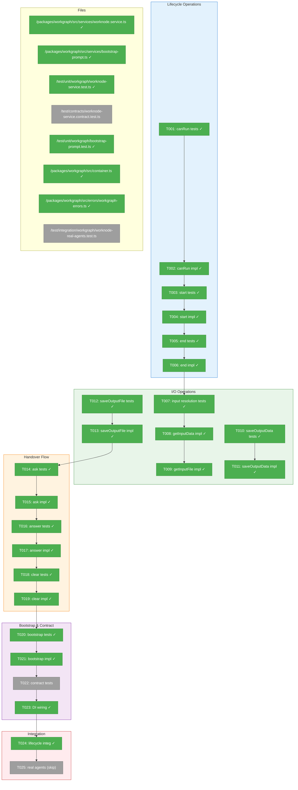
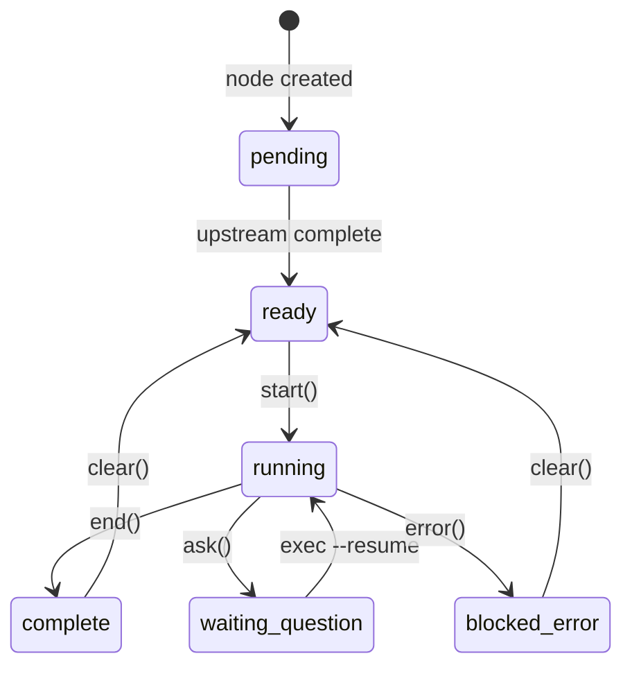
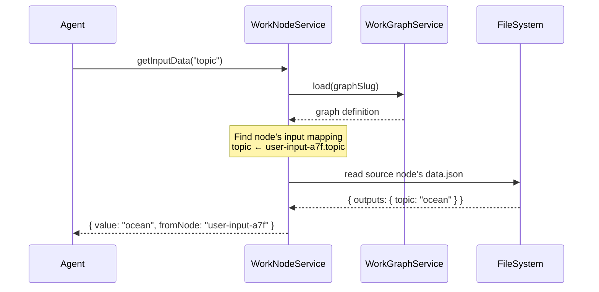
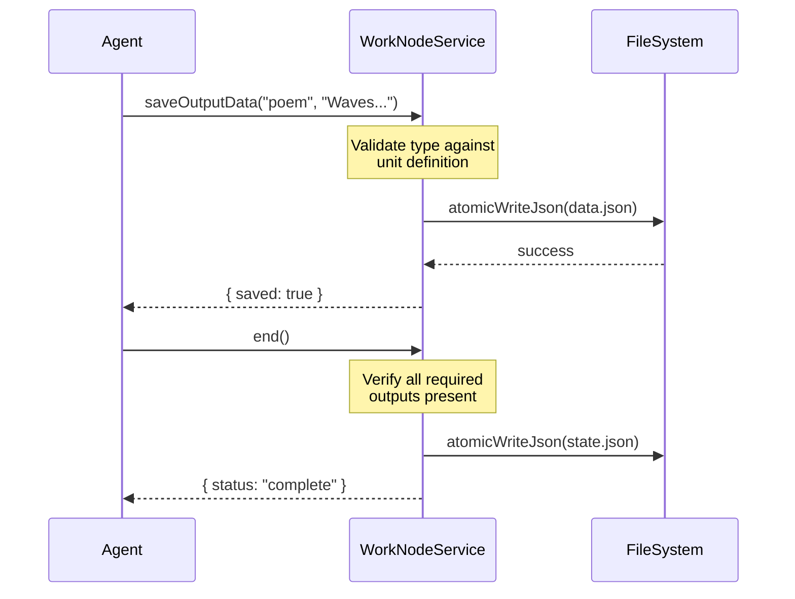

# Phase 5: Execution Engine – Tasks & Alignment Brief

**Spec**: [agent-units-spec.md](../../agent-units-spec.md)
**Plan**: [agent-units-plan.md](../../agent-units-plan.md)
**Date**: 2026-01-27

---

## Executive Briefing

### Purpose
This phase implements the execution engine that powers node lifecycle transitions, I/O operations, and the question/answer handover flow. Without this, nodes cannot actually execute work—they would remain forever in "ready" status.

### What We're Building
A `WorkNodeService` class that implements:
- **Lifecycle commands**: `canRun()`, `start()`, `end()` for node execution transitions
- **I/O operations**: `getInputData()`, `getInputFile()`, `saveOutputData()`, `saveOutputFile()` for data flow
- **Handover flow**: `ask()`, `answer()`, `clear()` for agent/orchestrator communication
- **Bootstrap prompt generation**: Creates the prompt that tells agents how to operate

### User Value
Users can execute nodes in their WorkGraphs, pass data between nodes, and agents can ask questions mid-execution. This transforms WorkGraphs from static diagrams into executable workflows.

### Example
**Before Phase 5**: Graph exists with nodes, but `cg wg node exec` fails  
**After Phase 5**:
```bash
$ cg wg node write-poem-b2c exec --type claude-code
✓ Agent launched for write-poem-b2c
Session: 15523ff5-a900-4dd9-ab49-73cb1e04342c

# Agent internally:
$ cg wg node write-poem-b2c start
✓ Node started. Status: running

$ cg wg node write-poem-b2c get-input-data text
"The ocean at sunset"

$ cg wg node write-poem-b2c save-output-data poem "Waves crash..."
✓ Output saved

$ cg wg node write-poem-b2c end
✓ Node complete. Status: complete
```

---

## Objectives & Scope

### Objective
Implement the complete node execution engine as specified in AC-09 through AC-13, enabling nodes to execute, read inputs, write outputs, and handle the question/answer handover flow.

### Behavior Checklist
- [ ] `canRun()` returns true only when all upstream nodes complete and inputs available
- [ ] `start()` transitions node from ready → running
- [ ] `end()` validates outputs and transitions running → complete
- [ ] Input resolution follows edges to source nodes dynamically
- [ ] Output types are validated/coerced at save time
- [ ] `ask()` records question and transitions to waiting-question
- [ ] `answer()` stores answer for later retrieval
- [ ] `clear()` removes outputs and cascades to downstream nodes
- [ ] Bootstrap prompt matches spec format

### Goals

- ✅ Implement IWorkNodeService with all 5 methods (canRun, start, end, getInputData, saveOutputData)
- ✅ Add extended methods: getInputFile, saveOutputFile, ask, answer, clear
- ✅ Dynamic input resolution via edge traversal
- ✅ Type validation for output data (text, number, boolean, json)
- ✅ Handover flow with question/answer state machine
- ✅ Downstream invalidation on clear/re-execute
- ✅ Bootstrap prompt generation for agent execution

### Non-Goals (Scope Boundaries)

- ❌ CLI commands (Phase 6 scope)
- ❌ Agent launching (`cg agent run`) - this phase only generates prompts
- ❌ Concurrent execution (single-user assumption)
- ❌ Retry/resume logic for errors (agent decides)
- ❌ Caching of resolved inputs (always traverse fresh)
- ❌ File content validation (only path validation)

### Real Agent Integration Testing (T025)

**Important**: We have full access to real agents for integration testing:
- **Copilot SDK** - Microsoft's agent framework
- **Claude** - Anthropic's Claude Code

These tests should be:
1. **Skipped by default** - Use `describe.skip()` or environment variable guard
2. **Run manually** - Enable via `RUN_REAL_AGENT_TESTS=true` or similar
3. **Executed LAST** - After all other tasks complete (T025 depends on T024)

**Agent Iteration Behavior**: When implementing T025, if problems arise:
- Iterate 2-3 times to resolve issues
- If still blocked, **stop and wait for user input** rather than continuing to spin
- Document the blocker clearly for human review

---

## Architecture Map

### Component Diagram
<!-- Status: grey=pending, orange=in-progress, green=completed, red=blocked -->
<!-- Updated by plan-6 during implementation -->



### Task-to-Component Mapping

<!-- Status: ⬜ Pending | 🟧 In Progress | ✅ Complete | 🔴 Blocked -->

| Task | Component(s) | Files | Status | Comment |
|------|-------------|-------|--------|---------|
| T001 | canRun tests | worknode-service.test.ts | ✅ Complete | RED: ready, blocked, missing input cases |
| T002 | canRun impl | worknode.service.ts | ✅ Complete | GREEN: check upstream status + input availability |
| T003 | start tests | worknode-service.test.ts | ✅ Complete | RED: success, already running, blocked |
| T004 | start impl | worknode.service.ts | ✅ Complete | GREEN: ready→running transition |
| T005 | end tests | worknode-service.test.ts | ✅ Complete | RED: success, missing outputs |
| T006 | end impl | worknode.service.ts | ✅ Complete | GREEN: running→complete, output validation |
| T007 | input resolution tests | worknode-service.test.ts | ✅ Complete | RED: data, file, chained inputs |
| T008 | getInputData impl | worknode.service.ts | ✅ Complete | GREEN: edge traversal for data |
| T009 | getInputFile impl | worknode.service.ts | ✅ Complete | GREEN: edge traversal for files |
| T010 | saveOutputData tests | worknode-service.test.ts | ✅ Complete | RED: types, overwrite (per Discovery 12) |
| T011 | saveOutputData impl | worknode.service.ts | ✅ Complete | GREEN: type coercion + atomic write |
| T012 | saveOutputFile tests | worknode-service.test.ts | ✅ Complete | RED: copy, overwrite |
| T013 | saveOutputFile impl | worknode.service.ts | ✅ Complete | GREEN: copy file to node storage |
| T014 | ask tests | worknode-service.test.ts | ✅ Complete | RED: all question types |
| T015 | ask impl | worknode.service.ts | ✅ Complete | GREEN: status→waiting-question |
| T016 | answer tests | worknode-service.test.ts | ✅ Complete | RED: answer validation |
| T017 | answer impl | worknode.service.ts | ✅ Complete | GREEN: answer stored in data.json |
| T018 | clear tests | worknode-service.test.ts | ✅ Complete | RED: output clearing (single node), force required |
| T019 | clear impl | worknode.service.ts | ✅ Complete | GREEN: single node, force required |
| T020 | bootstrap tests | bootstrap-prompt.test.ts | ✅ Complete | RED: prompt format matches spec |
| T021 | bootstrap impl | bootstrap-prompt.ts | ✅ Complete | GREEN: generate agent prompt |
| T022 | contract tests | worknode-service.contract.test.ts | ⬜ Pending | Validate fake matches real |
| T023 | DI wiring | container.ts | ✅ Complete | Register real WorkNodeService |
| T024 | Integration test | worknode-service.test.ts | ✅ Complete | End-to-end lifecycle test |
| T025 | Real agent tests | worknode-real-agents.test.ts | ⬜ Pending | Skipped; Copilot SDK + Claude |

---

## Tasks

| Status | ID | Task | CS | Type | Dependencies | Absolute Path(s) | Validation | Subtasks | Notes |
|--------|------|------|-----|------|--------------|------------------|------------|----------|-------|
| [x] | T001 | Write tests for canRun and markReady | 2 | Test | – | /home/jak/substrate/016-agent-units/test/unit/workgraph/worknode-service.test.ts | Tests cover: canRun (ready, blocked, missing input), markReady (success, already ready, blocked) | – | TDD RED phase |
| [x] | T002 | Implement canRun and markReady | 2 | Core | T001 | /home/jak/substrate/016-agent-units/packages/workgraph/src/services/worknode.service.ts | All T001 tests pass | – | canRun returns BlockingNode[]; markReady validates canRun then sets status |
| [x] | T003 | Write tests for start command | 2 | Test | T002 | /home/jak/substrate/016-agent-units/test/unit/workgraph/worknode-service.test.ts | Tests cover: success, already running (E111), blocked (E110) | – | TDD RED phase |
| [x] | T004 | Implement start | 2 | Core | T003 | /home/jak/substrate/016-agent-units/packages/workgraph/src/services/worknode.service.ts | Status transitions ready→running | – | Per CD02: never throw |
| [x] | T005 | Write tests for end command | 2 | Test | T004 | /home/jak/substrate/016-agent-units/test/unit/workgraph/worknode-service.test.ts | Tests cover: success, missing outputs (E113) | – | TDD RED phase |
| [x] | T006 | Implement end | 2 | Core | T005 | /home/jak/substrate/016-agent-units/packages/workgraph/src/services/worknode.service.ts | Validates outputs before completion | – | Per CD03: atomic write |
| [x] | T007 | Write tests for input resolution | 3 | Test | T006 | /home/jak/substrate/016-agent-units/test/unit/workgraph/worknode-service.test.ts | Tests cover: data, file, chained inputs | – | Edge traversal cases |
| [x] | T008 | Implement getInputData | 3 | Core | T007 | /home/jak/substrate/016-agent-units/packages/workgraph/src/services/worknode.service.ts | Dynamic traversal works | – | Follows edges to source |
| [x] | T009 | Implement getInputFile | 2 | Core | T008 | /home/jak/substrate/016-agent-units/packages/workgraph/src/services/worknode.service.ts | Returns file path from source | – | Per Discovery 10: path security |
| [x] | T010 | Write tests for saveOutputData | 2 | Test | T009 | /home/jak/substrate/016-agent-units/test/unit/workgraph/worknode-service.test.ts | Tests cover: types, overwrite | – | Per Discovery 12 |
| [x] | T011 | Implement saveOutputData with type validation | 2 | Core | T010 | /home/jak/substrate/016-agent-units/packages/workgraph/src/services/worknode.service.ts | Type coercion works | – | E123 for type mismatch |
| [x] | T012 | Write tests for saveOutputFile | 2 | Test | T011 | /home/jak/substrate/016-agent-units/test/unit/workgraph/worknode-service.test.ts | Tests cover: copy, overwrite | – | TDD RED phase |
| [x] | T013 | Implement saveOutputFile | 2 | Core | T012 | /home/jak/substrate/016-agent-units/packages/workgraph/src/services/worknode.service.ts | File copied to node storage | – | Per CD03: atomic |
| [x] | T014 | Write tests for ask command | 2 | Test | T013 | /home/jak/substrate/016-agent-units/test/unit/workgraph/worknode-service.test.ts | Tests cover: all question types | – | text, single, multi, confirm |
| [x] | T015 | Implement ask with auto-handback | 2 | Core | T014 | /home/jak/substrate/016-agent-units/packages/workgraph/src/services/worknode.service.ts | Status → waiting-question | – | Records in data.json |
| [x] | T016 | Write tests for answer command | 2 | Test | T015 | /home/jak/substrate/016-agent-units/test/unit/workgraph/worknode-service.test.ts | Tests cover: answer validation | – | Type-specific validation |
| [x] | T017 | Implement answer | 2 | Core | T016 | /home/jak/substrate/016-agent-units/packages/workgraph/src/services/worknode.service.ts | Answer stored in data.json | – | Per handover flow spec |
| [x] | T018 | Write tests for clear command | 2 | Test | T017 | /home/jak/substrate/016-agent-units/test/unit/workgraph/worknode-service.test.ts | Tests cover: output clearing (single node), force required, error without force | – | Per DYK#7: no cascade |
| [x] | T019 | Implement clear (single node, force required) | 2 | Core | T018 | /home/jak/substrate/016-agent-units/packages/workgraph/src/services/worknode.service.ts | Single node cleared, force param required | – | No cascade per DYK#7 |
| [x] | T020 | Write tests for bootstrap prompt generation | 2 | Test | T019 | /home/jak/substrate/016-agent-units/test/unit/workgraph/bootstrap-prompt.test.ts | Prompt matches spec format | – | TDD RED phase |
| [x] | T021 | Implement bootstrap prompt generation | 2 | Core | T020 | /home/jak/substrate/016-agent-units/packages/workgraph/src/services/bootstrap-prompt.ts | Prompt includes all instructions | – | Per command-flows spec |
| [ ] | T022 | Add contract tests for WorkNodeService | 2 | Test | T021 | /home/jak/substrate/016-agent-units/test/contracts/worknode-service.contract.test.ts | Fake matches real impl | – | Follow Phase 1 pattern |
| [x] | T023 | Update container to register real WorkNodeService | 2 | Core | T022 | /home/jak/substrate/016-agent-units/packages/workgraph/src/container.ts | Container resolves WorkNodeService | – | Per CD01: useFactory |
| [x] | T024 | Integration test: full node lifecycle | 3 | Integration | T023 | /home/jak/substrate/016-agent-units/test/unit/workgraph/worknode-service.test.ts | End-to-end test passes | – | create→start→save→end |
| [ ] | T025 | Real agent integration tests (skipped) | 4 | Integration | T024 | /home/jak/substrate/016-agent-units/test/integration/workgraph/worknode-real-agents.test.ts | Skipped tests exist, pass when enabled | – | Copilot SDK + Claude; run LAST |

---

## Alignment Brief

### Prior Phases Review

#### Phase-by-Phase Summary

**Phase 1 → Phase 2 → Phase 3 → Phase 4 Evolution**:

1. **Phase 1 (Foundation)**: Created `packages/workgraph/` with all interfaces, schemas, DI tokens, fakes, and contract tests. Established patterns: child containers per command, Result types with errors array, fakes with call tracking.

2. **Phase 2 (WorkUnit)**: Implemented `WorkUnitService` with list/load/create/validate. Added `IYamlParser` abstraction to shared. Key learning: `instanceof` fails across packages—need fallback `.name` check.

3. **Phase 3 (WorkGraph Core)**: Implemented `WorkGraphService.create/load/show/status()`. Added atomic file writes (`atomic-file.ts`). Key learning: Start node must have `status: 'complete'` in state.json at creation time.

4. **Phase 4 (Node Operations)**: Added `addNodeAfter/removeNode` to WorkGraphService. Implemented `generateNodeId()` and `detectCycle()`. Key learning: DFS three-color marking for cycle detection, strict name matching for input wiring.

#### Cumulative Deliverables Available to Phase 5

| Phase | Files | APIs |
|-------|-------|------|
| Phase 1 | interfaces/*.interface.ts, schemas/*.ts, fakes/*.ts, container.ts | IWorkNodeService, FakeWorkNodeService, error factories |
| Phase 2 | services/workunit.service.ts | WorkUnitService.load() for unit definitions |
| Phase 3 | services/workgraph.service.ts, services/atomic-file.ts | WorkGraphService.load(), atomicWriteFile/Json() |
| Phase 4 | services/node-id.ts, services/cycle-detection.ts | generateNodeId(), detectCycle() |

#### Cross-Phase Dependencies for Phase 5

| Dependency | From Phase | Used For |
|------------|------------|----------|
| `IWorkNodeService` interface | Phase 1 | Implement the real service |
| `FakeWorkNodeService` | Phase 1 | Contract tests verify parity |
| `WorkGraphService.load()` | Phase 3 | Load graph to find node + edges |
| `atomicWriteFile/Json()` | Phase 3 | Persist state.json, data.json |
| `WorkUnitService.load()` | Phase 2 | Load unit definition for output schema |
| Error factories | Phase 1 | E110, E111, E112, E113, E117, E118, E123 |

#### Reusable Test Infrastructure

- `createTestContext()` helper (Phase 3) - fresh service instances
- `setupGraph()` helper (Phase 3) - configure FakeFileSystem with graph data
- YAML fixtures for valid/invalid graphs (Phase 3)
- `FakeYamlParser.setPresetResult()` pattern (Phase 2)

#### Architectural Patterns to Maintain

1. **useFactory for DI** - never useValue or singletons for services
2. **Errors in results, never throw** - all methods return `{ ..., errors: [] }`
3. **Fakes with call tracking** - getCalls(), getLastCall(), setPresetResult(), reset()
4. **Atomic writes** - write-then-rename pattern for all JSON persistence
5. **instanceof + .name check** - for cross-package error type detection

---

### Critical Findings Affecting This Phase

| Finding | Impact | Tasks Addressing |
|---------|--------|------------------|
| **CD02: Result Types with Errors** | All WorkNodeService methods must return `Promise<T extends BaseResult>` with errors array | All impl tasks (T002, T004, T006, T008, T009, T011, T013, T015, T017, T019, T021) |
| **CD03: Atomic File Writes** | state.json and data.json writes must use atomic pattern | T006 (end), T011 (saveOutputData), T015 (ask), T017 (answer), T019 (clear) |
| **Discovery 10: Path Security** | Reject paths containing '..' in file I/O operations | T009 (getInputFile), T013 (saveOutputFile) |
| **Discovery 12: Type Coercion** | Parse/coerce values at save-output-data time, E123 for type mismatch | T010 (tests), T011 (saveOutputData impl) |

---

### Invariants & Guardrails

- **Single-user assumption**: No concurrent execution handling required
- **No file content validation**: Only validate paths exist, not content
- **Dynamic input resolution**: Always traverse edges fresh (no caching)
- **Atomic state transitions**: state.json writes must be atomic

---

### Inputs to Read

| File | Purpose |
|------|---------|
| `/home/jak/substrate/016-agent-units/packages/workgraph/src/interfaces/worknode-service.interface.ts` | Interface contract to implement |
| `/home/jak/substrate/016-agent-units/packages/workgraph/src/fakes/fake-worknode-service.ts` | Fake to match with contract tests |
| `/home/jak/substrate/016-agent-units/packages/workgraph/src/services/workgraph.service.ts` | Load graph, atomic patterns |
| `/home/jak/substrate/016-agent-units/packages/workgraph/src/services/atomic-file.ts` | Atomic write utilities |
| `/home/jak/substrate/016-agent-units/docs/plans/016-agent-units/workgraph-command-flows.md` | Bootstrap prompt format |

---

### Visual Alignment Aids

#### Node Lifecycle State Machine



#### Input Resolution Sequence



#### Save Output & Downstream Invalidation Sequence



---

### Test Plan (Full TDD)

#### Unit Tests (worknode-service.test.ts)

| Test Name | Purpose | Fixtures | Expected Output |
|-----------|---------|----------|-----------------|
| `canRun returns true when all inputs available` | Verify ready detection | Graph with complete upstream | `{ canRun: true }` |
| `canRun returns false with blocking nodes` | Verify blocked detection | Graph with pending upstream | `{ canRun: false, blockingNodes: [...] }` |
| `start transitions ready to running` | Verify state transition | Ready node | `{ status: "running" }` |
| `start returns E110 when blocked` | Verify blocked rejection | Blocked node | `{ errors: [E110] }` |
| `start returns E111 when already running` | Verify duplicate start | Running node | `{ errors: [E111] }` |
| `end validates required outputs` | Verify output check | Running node missing outputs | `{ errors: [E113], missingOutputs: [...] }` |
| `end transitions running to complete` | Verify completion | Running node with all outputs | `{ status: "complete" }` |
| `getInputData resolves from upstream` | Verify edge traversal | Graph with wired input | `{ value: "...", fromNode: "..." }` |
| `getInputData chains through multiple nodes` | Verify multi-hop | A→B→C graph | Value from A |
| `saveOutputData coerces number type` | Verify type coercion | String "42" for number output | Stored as number 42 |
| `saveOutputData returns E123 on type mismatch` | Verify type validation | String for boolean output | `{ errors: [E123] }` |
| `saveOutputFile copies to node storage` | Verify file copy | Source file path | File exists in node/data/outputs/ |
| `ask records question and changes status` | Verify ask flow | Running node | `{ status: "waiting-question" }` |
| `answer stores value in data.json` | Verify answer storage | Waiting node + answer | Answer retrievable |
| `clear removes outputs and cascades` | Verify invalidation | Complete node with dependents | Dependents status → ready |

#### Contract Tests (worknode-service.contract.test.ts)

Follow Phase 1 pattern: factory function that accepts service creator, runs against both fake and real.

#### Integration Tests (worknode-lifecycle.test.ts)

| Test Name | Scenario |
|-----------|----------|
| `complete lifecycle: start→getInput→saveOutput→end` | Happy path |
| `re-execution clears and cascades` | AC-12, AC-13 |
| `ask/answer handover flow` | AC-11 |
| `blocked node returns E110 with details` | AC-10 |

#### Real Agent Integration Tests (worknode-real-agents.test.ts) - SKIPPED BY DEFAULT

| Test Name | Scenario | Agent |
|-----------|----------|-------|
| `Claude Code executes simple node` | Bootstrap → start → save output → end | Claude |
| `Copilot SDK executes simple node` | Bootstrap → start → save output → end | Copilot SDK |
| `Agent handles missing input gracefully` | Error recovery | Both |
| `Agent completes multi-node pipeline` | Full graph execution | Both |

**Run with**: `RUN_REAL_AGENT_TESTS=true pnpm test`

**Note**: These tests require actual agent API access and may incur costs. Run manually after all other tests pass.

---

### Step-by-Step Implementation Outline

1. **T001-T002**: Implement `canRun()` and `markReady()` - check upstream status, orchestrator state control
2. **T003-T004**: Implement `start()` - validate canRun, transition to running
3. **T005-T006**: Implement `end()` - validate outputs, transition to complete
4. **T007-T009**: Implement input resolution - edge traversal for data and files
5. **T010-T013**: Implement output saving - type coercion, file copy
6. **T014-T017**: Implement handover flow - ask/answer state machine
7. **T018-T019**: Implement clear (single node, force required) - per DYK#7
8. **T020-T021**: Implement bootstrap prompt generation (minimal scope per DYK#8)
9. **T022-T023**: Contract tests and DI wiring
10. **T024**: Integration test for full lifecycle
11. **T025**: Real agent integration tests (skipped by default) - **RUN LAST**

### Implementation Notes for Coding Agent

- **Iteration limit**: If a problem persists after 2-3 attempts, **stop and wait for user input**
- **Don't spin**: Document the blocker clearly rather than continuing to try variations
- **T025 is special**: Real agent tests may have external dependencies - flag issues early

---

### Commands to Run

```bash
# Environment setup
cd /home/jak/substrate/016-agent-units
pnpm install

# Build shared first (dependency)
pnpm -F @chainglass/shared build

# Run tests during development
pnpm -F @chainglass/workgraph test

# Run specific test file
pnpm -F @chainglass/workgraph test -- worknode-service.test.ts

# Type check
pnpm -F @chainglass/workgraph typecheck

# Lint
pnpm lint

# Full quality check
just check
```

---

### Risks/Unknowns

| Risk | Severity | Mitigation |
|------|----------|------------|
| Re-execution invalidation complexity | Medium | Use Phase 4's BFS cascade pattern |
| Type coercion edge cases | Low | Strict validation, E123 on mismatch |
| Handover state machine edge cases | Medium | Comprehensive state transition tests |
| File path security | High | Reject '..' in all paths (Discovery 10) |

---

### Ready Check

- [x] Prior phases reviewed (Phases 1-4 complete)
- [x] Critical findings mapped to tasks
- [x] Acceptance criteria (AC-09 to AC-13) mapped to tasks
- [ ] ADR constraints mapped to tasks (IDs noted in Notes column) - N/A, no ADRs affect Phase 5
- [ ] Human GO/NO-GO received

---

## Phase Footnote Stubs

_To be populated during implementation by plan-6a-update-progress._

| # | Reference | Description |
|---|-----------|-------------|
| | | |

---

## Evidence Artifacts

**Execution Log**: `docs/plans/016-agent-units/tasks/phase-5-execution-engine/execution.log.md`

Will contain:
- Task completion timestamps
- Test results
- Implementation decisions
- Issues encountered and resolutions

---

## Discoveries & Learnings

_Populated during implementation by plan-6. Log anything of interest to your future self._

| Date | Task | Type | Discovery | Resolution | References |
|------|------|------|-----------|------------|------------|
| | | | | | |

**Types**: `gotcha` | `research-needed` | `unexpected-behavior` | `workaround` | `decision` | `debt` | `insight`

**What to log**:
- Things that didn't work as expected
- External research that was required
- Implementation troubles and how they were resolved
- Gotchas and edge cases discovered
- Decisions made during implementation
- Technical debt introduced (and why)
- Insights that future phases should know about

_See also: `execution.log.md` for detailed narrative._

---

## Directory Layout

```
docs/plans/016-agent-units/
├── agent-units-plan.md
├── agent-units-spec.md
├── workgraph-command-flows.md
└── tasks/
    ├── phase-1-package-foundation-core-interfaces/
    │   ├── tasks.md
    │   └── execution.log.md
    ├── phase-2-workunit-service-implementation/
    │   ├── tasks.md
    │   └── execution.log.md
    ├── phase-3-workgraph-core/
    │   ├── tasks.md
    │   └── execution.log.md
    ├── phase-4-node-operations-dag-validation/
    │   ├── tasks.md
    │   └── execution.log.md
    └── phase-5-execution-engine/
        ├── tasks.md                    # THIS FILE
        └── execution.log.md            # Created by plan-6
```

---

**STOP**: Do **not** edit code. Await human **GO** before proceeding to plan-6-implement-phase.

---

## Critical Insights Discussion

**Session**: 2026-01-27
**Context**: Phase 5: Execution Engine tasks.md analysis
**Analyst**: AI Clarity Agent
**Reviewer**: Development Team
**Format**: Water Cooler Conversation (5 Critical Insights)

### Insight 1: Start Node is Structural Only (DYK#6)

**Did you know**: The "start" node is purely a DAG anchor - it produces no outputs and nodes directly after it must be self-sufficient (no required inputs).

**Implications**:
- `canRun()` skips input validation for nodes whose only upstream is "start"
- First nodes after start are the actual entry points (e.g., user-input units)
- Aligns with Phase 4 DYK#4 decision

**Options Considered**:
- Option A: Start is input-only gateway (no outputs)
- Option B: Start can have outputs (configured at graph level)
- Option C: Start outputs populated via CLI

**AI Recommendation**: Option A - Start is structural only
- Reasoning: Simplest mental model, aligns with DYK#4, user-input nodes are the right place for data entry

**Discussion Summary**: User confirmed start node is just so the graph "starts somewhere" - we read nodes coming off it to know what entry points are.

**Decision**: Start node is purely structural, produces no outputs

**Action Items**: None - confirms existing design

**Affects**: T002 (canRun implementation)

---

### Insight 2: Orchestrator Controls pending→ready Transition (DYK#6)

**Did you know**: The tasks.md describes `pending → ready → running` but nothing implements the `pending → ready` transition - this is orchestrator responsibility for UI visibility.

**Implications**:
- Orchestrator calls `canRun()` to check executability
- Orchestrator explicitly calls `markReady()` to set UI-visible ready state
- `start()` then transitions `ready → running`

**Options Considered**:
- Option A: canRun is pure query, orchestrator calls separate markReady()
- Option B: start() handles both transitions atomically
- Option C: Automatic status propagation on upstream completion
- Option D: Generic setStatus() method

**AI Recommendation**: Option A - Add explicit markReady() method
- Reasoning: Clean contract, orchestrator controls UI state, validates canRun internally

**Discussion Summary**: User clarified that "ready" state needs to be visible in UI before agent is called - orchestrator sets this explicitly.

**Decision**: Add `markReady(graphSlug, nodeId)` method to IWorkNodeService

**Action Items**:
- [x] Add MarkReadyResult type to interface
- [x] Add markReady() method to IWorkNodeService
- [x] Add markReady() to FakeWorkNodeService
- [x] Update T001/T002 to include markReady tests and implementation

**Affects**: T001, T002, IWorkNodeService interface

---

### Insight 3: WorkNodeService Owns state.json After Creation (DYK#7)

**Did you know**: Two services could write to state.json (WorkGraphService and WorkNodeService), creating ownership ambiguity.

**Implications**:
- WorkGraphService writes initial state at `create()`
- All subsequent status transitions are execution lifecycle
- WorkNodeService owns all post-creation state.json writes

**Options Considered**:
- Option A: WorkNodeService owns all node state after creation
- Option B: Split state.json into per-node status files
- Option C: Shared state.json with file locking
- Option D: Write coordination via WorkGraphService

**AI Recommendation**: Option A - WorkNodeService owns node state
- Reasoning: Natural fit (execution = status), single writer principle, minimal change

**Discussion Summary**: User agreed with Option A.

**Decision**: WorkNodeService owns state.json after graph creation

**Action Items**: None - confirms design intent

**Affects**: T004, T006, T015, T017, T019 (all state.json writers)

---

### Insight 4: No Cascade on Clear (DYK#7)

**Did you know**: The planned cascade clear could wipe out hours of agent work with no undo - downstream nodes cleared automatically.

**Implications**:
- Clear affects only the specified node
- User must clear each node individually if they want multiple cleared
- Requires `--force` flag to confirm, returns helpful error otherwise
- Safer, more explicit, no accidental data loss

**Options Considered**:
- Option A: Cascade always (original design)
- Option B: Cascade with confirmation parameter
- Option C: Soft clear (mark invalid, don't delete)
- Option D: Backup before clear

**AI Recommendation**: Option B - Cascade with confirmation parameter
- Reasoning: Safe by default, explicit confirmation required

**Discussion Summary**: User preferred simpler approach - no cascade at all, clear each node individually, require `--force` flag.

**Decision**: No cascade on clear. Single node only. Requires `force: true` parameter.

**Action Items**:
- [x] Add ClearOptions and ClearResult types
- [x] Add clear() method with force parameter to interface
- [x] Add clear() to FakeWorkNodeService with E124 error when force=false
- [x] Update T018/T019 to remove cascade requirement

**Affects**: T018, T019, clear() method signature

---

### Insight 5: Minimal Bootstrap Prompt for Now (DYK#8)

**Did you know**: Bootstrap prompt could include full graph context (upstream/downstream nodes, position awareness) for better agent performance.

**Implications**:
- Agents work better with context
- But we don't know what agents actually need yet
- YAGNI - start simple, add features based on real feedback

**Options Considered**:
- Option A: Minimal prompt (node inputs/outputs + CLI commands)
- Option B: Full graph context in prompt
- Option C: Prompt + separate context file

**AI Recommendation**: Option B - Full graph context
- Reasoning: Agents work better with situational awareness

**Discussion Summary**: User preferred minimal approach - develop over time as needed based on real agent behavior.

**Decision**: Minimal bootstrap prompt, expand based on actual needs

**Action Items**: None - confirms existing T020/T021 scope

**Affects**: T020, T021

---

## Session Summary

**Insights Surfaced**: 5 critical insights identified and discussed
**Decisions Made**: 5 decisions reached through collaborative discussion
**Action Items Created**: 4 completed (interface updates), 0 pending
**Areas Updated**:
- IWorkNodeService interface (markReady, clear)
- FakeWorkNodeService (markReady, clear)
- tasks.md (T001, T002, T018, T019)

**Shared Understanding Achieved**: ✓

**Confidence Level**: High - Key architectural decisions clarified before implementation

**Next Steps**:
Await human GO, then proceed with /plan-6-implement-phase

**DYK Decisions Summary**:
- **DYK#6**: Start node is structural only; orchestrator controls pending→ready via markReady()
- **DYK#7**: WorkNodeService owns state.json after creation; no cascade on clear, force required
- **DYK#8**: Minimal bootstrap prompt, expand based on real needs
