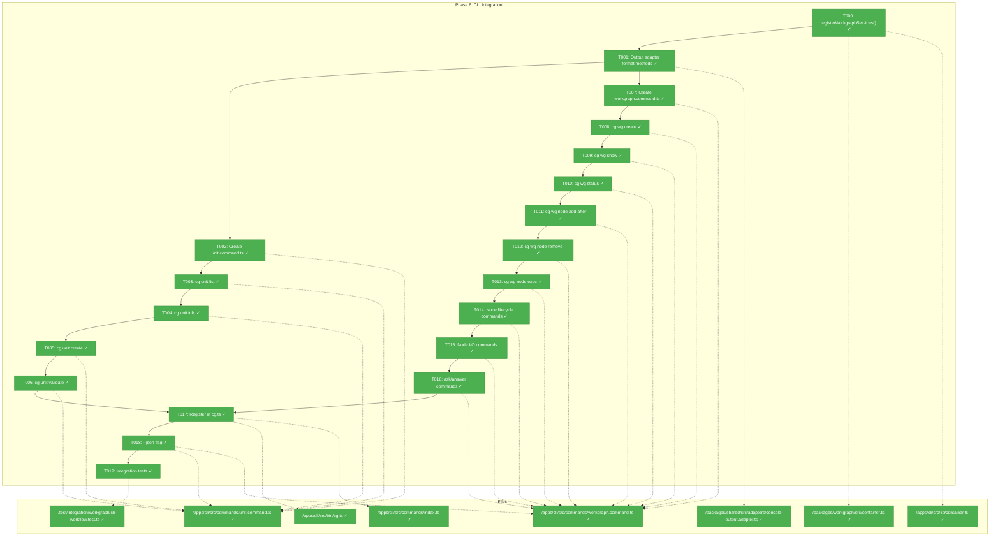
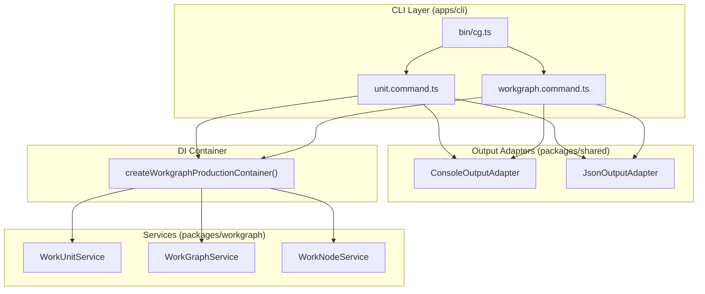
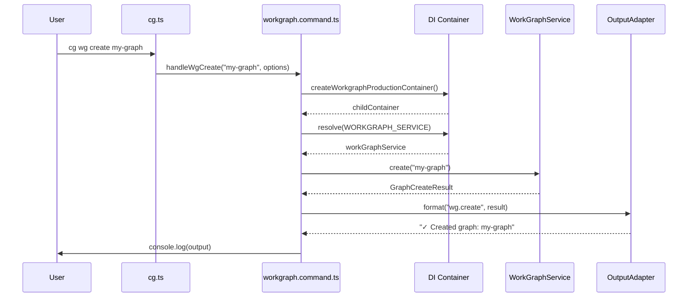

# Phase 6: CLI Integration – Tasks & Alignment Brief

**Spec**: [agent-units-spec.md](../../agent-units-spec.md)
**Plan**: [agent-units-plan.md](../../agent-units-plan.md)
**Date**: 2026-01-27

---

## Executive Briefing

### Purpose
This phase delivers the complete CLI interface for WorkGraph and WorkUnit operations, making the entire graph-based workflow system accessible via `cg wg` and `cg unit` commands. This is the final phase that transforms the backend services (Phases 1-5) into a usable developer tool.

### What We're Building
Two command groups integrated into the existing `cg` CLI:

**`cg unit` commands** (WorkUnit library management):
- `cg unit list` — List all units in `.chainglass/units/`
- `cg unit info <slug>` — Show unit details (inputs, outputs, type)
- `cg unit create <slug> --type <agent|code|user-input>` — Scaffold new unit
- `cg unit validate <slug>` — Validate unit definition

**`cg wg` commands** (WorkGraph operations):
- `cg wg create <slug>` — Create graph with start node
- `cg wg show <slug>` — Tree visualization of graph structure
- `cg wg status <slug>` — Node status table (6-state model)
- `cg wg node add-after <graph> <after-node> <unit>` — Add node with input wiring
- `cg wg node remove <graph> <node-id>` — Remove node (with `--cascade`)
- `cg wg node exec <graph> <node-id>` — Launch agent with bootstrap prompt
- `cg wg node start/end/can-run/can-end` — Lifecycle commands
- `cg wg node list-inputs/list-outputs/get-input-data/get-input-file/save-output-data/save-output-file` — I/O commands
- `cg wg node ask/answer` — Handover flow commands

### User Value
Users can orchestrate complex AI workflows through a simple CLI:
- Create reusable units once, compose into multiple graphs
- Visualize graph structure and execution status
- Execute nodes explicitly with full control
- Inspect and manipulate node inputs/outputs
- Use `--json` flag for agent consumption

### Example
```bash
# Create a unit and graph
$ cg unit create write-poem --type agent
✓ Created unit: write-poem

$ cg wg create my-workflow
✓ Created graph: my-workflow with start node

$ cg wg node add-after my-workflow start write-poem
✓ Added node: write-poem-a3f after start

$ cg wg show my-workflow
my-workflow
└── start [complete]
    └── write-poem-a3f [ready]

$ cg wg node start my-workflow write-poem-a3f
✓ Node write-poem-a3f status: running

$ cg wg status my-workflow --json
{"nodes":[{"id":"start","status":"complete"},{"id":"write-poem-a3f","status":"running"}],"errors":[]}
```

---

## Objectives & Scope

### Objective
Implement all CLI commands for WorkGraph and WorkUnit operations as specified in the plan, following established patterns from `workflow.command.ts`.

**Behavior Checklist** (from spec acceptance criteria):
- [ ] AC-01: `cg wg create <slug>` creates graph with start node
- [ ] AC-02: `cg wg show <slug>` displays tree structure
- [ ] AC-03: `cg wg status <slug>` shows node status table
- [ ] AC-04: `cg wg node add-after` adds node with input validation
- [ ] AC-05: `cg wg node add-after` rejects missing required inputs (E103)
- [ ] AC-06: `cg wg node add-after` rejects cycles (E108)
- [ ] AC-07: `cg wg node remove` removes leaf nodes
- [ ] AC-08: `cg wg node remove --cascade` removes nodes with dependents
- [ ] AC-09: `cg wg node start` transitions to running state
- [ ] AC-10: `cg wg node get-input-data/file` resolves inputs
- [ ] AC-11: `cg wg node save-output-data/file` stores outputs
- [ ] AC-12: `cg wg node end` validates outputs and completes
- [ ] AC-13: `cg wg node ask/answer` enables handover flow
- [ ] AC-14: `cg unit list` shows all units
- [ ] AC-15: `cg unit info <slug>` shows unit details
- [ ] AC-16: All commands support `--json` flag
- [ ] AC-17: All commands use DI container pattern (per Critical Discovery 01)

### Goals

- ✅ Create `unit.command.ts` with `registerUnitCommands()` export
- ✅ Create `workgraph.command.ts` with `registerWorkGraphCommands()` export
- ✅ Add format methods to ConsoleOutputAdapter for all workgraph.* result types
- ✅ Register commands in `bin/cg.ts`
- ✅ Implement all `cg unit` commands (list, info, create, validate)
- ✅ Implement all `cg wg` commands (create, show, status)
- ✅ Implement all `cg wg node` commands (add-after, remove, exec, lifecycle, I/O, ask/answer)
- ✅ Add `--json` flag to all commands
- ✅ Full integration test coverage

### Non-Goals

- ❌ GUI/Web interface (CLI only per spec)
- ❌ Batch execution (`run-all` command not supported per spec)
- ❌ Auto-next selection (explicit execution only)
- ❌ Real-time progress streaming (simple status polling)
- ❌ Tab completion (can be added post-launch)
- ❌ Modifying existing workflow commands
- ❌ Legacy workflow migration tools
- ❌ Automatic agent spawning (per DYK#4: `exec` prints prompt + Copilot CLI command; full agent integration deferred)

---

## Architecture Map

### Component Diagram
<!-- Status: grey=pending, orange=in-progress, green=completed, red=blocked -->
<!-- Updated by plan-6 during implementation -->



### Task-to-Component Mapping

<!-- Status: ⬜ Pending | 🟧 In Progress | ✅ Complete | 🔴 Blocked -->

| Task | Component(s) | Files | Status | Comment |
|------|-------------|-------|--------|---------|
| T000 | DI Integration | container.ts (workgraph + CLI) | ✅ Complete | registerWorkgraphServices() per DYK#1 |
| T001 | Output Adapter | console-output.adapter.ts | ✅ Complete | Add 36 format methods (18 types × success/failure); optionally group in helper |
| T002 | Unit Commands | unit.command.ts | ✅ Complete | registerUnitCommands() skeleton |
| T003 | Unit List | unit.command.ts | ✅ Complete | handleUnitList() with table format |
| T004 | Unit Info | unit.command.ts | ✅ Complete | handleUnitInfo() with details |
| T005 | Unit Create | unit.command.ts | ✅ Complete | handleUnitCreate() with --type flag |
| T006 | Unit Validate | unit.command.ts | ✅ Complete | handleUnitValidate() with issues |
| T007 | WorkGraph Commands | workgraph.command.ts | ✅ Complete | registerWorkGraphCommands() skeleton |
| T008 | WG Create | workgraph.command.ts | ✅ Complete | handleWgCreate() |
| T009 | WG Show | workgraph.command.ts | ✅ Complete | handleWgShow() tree format |
| T010 | WG Status | workgraph.command.ts | ✅ Complete | handleWgStatus() table format |
| T011 | Node Add-After | workgraph.command.ts | ✅ Complete | handleNodeAddAfter() with validation |
| T012 | Node Remove | workgraph.command.ts | ✅ Complete | handleNodeRemove() with --cascade |
| T013 | Node Exec | workgraph.command.ts | ✅ Complete | handleNodeExec() prints prompt + Copilot CLI example |
| T014 | Node Lifecycle | workgraph.command.ts | ✅ Complete | start, end, can-run, can-end |
| T015 | Node I/O | workgraph.command.ts | ✅ Complete | list-inputs/outputs, get/save |
| T016 | Ask/Answer | workgraph.command.ts | ✅ Complete | handleNodeAsk(), handleNodeAnswer() |
| T017 | CLI Registration | cg.ts, index.ts | ✅ Complete | Import and register commands |
| T018 | JSON Flag | unit.command.ts, workgraph.command.ts | ✅ Complete | --json support on all commands |
| T019 | Integration | cli-workflow.test.ts | ✅ Complete | End-to-end CLI test |

---

## Tasks

| Status | ID | Task | CS | Type | Dependencies | Absolute Path(s) | Validation | Subtasks | Notes |
|--------|------|------|-----|------|--------------|------------------|------------|----------|-------|
| [x] | T000 | Export registerWorkgraphServices(container) from workgraph package and call it from CLI container | 2 | Setup | – | /home/jak/substrate/016-agent-units/packages/workgraph/src/container.ts, /home/jak/substrate/016-agent-units/apps/cli/src/lib/container.ts | CLI container resolves workgraph services | – | Per ADR-0008: Module Registration Function Pattern |
| [x] | T001 | Add format methods to ConsoleOutputAdapter for workgraph.* result types (unit.list, unit.info, wg.create, wg.show, wg.status, node.addAfter, node.remove, node.exec, etc.) | 3 | Setup | T000 | /home/jak/substrate/016-agent-units/packages/shared/src/adapters/console-output.adapter.ts, /home/jak/substrate/016-agent-units/packages/shared/src/adapters/json-output.adapter.ts | Format methods exist for all 18 result types | – | Per Discovery 07; DYK#2: ~36 methods following existing pattern |
| [x] | T002 | Create unit.command.ts skeleton with registerUnitCommands() and DI container pattern | 2 | Setup | T001 | /home/jak/substrate/016-agent-units/apps/cli/src/commands/unit.command.ts | Exports registerUnitCommands(program: Command) | – | Per Discovery 06; use createCliProductionContainer() |
| [x] | T003 | Implement cg unit list command with table format | 2 | Core | T002 | /home/jak/substrate/016-agent-units/apps/cli/src/commands/unit.command.ts | Lists units from .chainglass/units/ | – | – |
| [x] | T004 | Implement cg unit info <slug> command | 2 | Core | T003 | /home/jak/substrate/016-agent-units/apps/cli/src/commands/unit.command.ts | Shows unit type, inputs, outputs | – | – |
| [x] | T005 | Implement cg unit create <slug> --type <type> command | 2 | Core | T004 | /home/jak/substrate/016-agent-units/apps/cli/src/commands/unit.command.ts | Creates scaffold for agent/code/user-input | – | – |
| [x] | T006 | Implement cg unit validate <slug> command | 2 | Core | T005 | /home/jak/substrate/016-agent-units/apps/cli/src/commands/unit.command.ts | Shows validation issues with JSON pointer paths | – | – |
| [x] | T007 | Create workgraph.command.ts skeleton with registerWorkGraphCommands() | 2 | Setup | T001 | /home/jak/substrate/016-agent-units/apps/cli/src/commands/workgraph.command.ts | Exports registerWorkGraphCommands(program: Command) | – | Per Discovery 06; DYK#3: triple-nested wg→node→cmd structure |
| [x] | T008 | Implement cg wg create <slug> command | 2 | Core | T007 | /home/jak/substrate/016-agent-units/apps/cli/src/commands/workgraph.command.ts | Creates graph with start node | – | – |
| [x] | T009 | Implement cg wg show <slug> command with tree visualization | 2 | Core | T008 | /home/jak/substrate/016-agent-units/apps/cli/src/commands/workgraph.command.ts | Tree output per spec format | – | – |
| [x] | T010 | Implement cg wg status <slug> command with status table | 2 | Core | T009 | /home/jak/substrate/016-agent-units/apps/cli/src/commands/workgraph.command.ts | Table shows 6-state node statuses | – | – |
| [x] | T011 | Implement cg wg node add-after <graph> <after> <unit> [--input name:source] | 3 | Core | T010 | /home/jak/substrate/016-agent-units/apps/cli/src/commands/workgraph.command.ts | Node added, validates inputs, rejects E103/E108 | – | Per CD05 |
| [x] | T012 | Implement cg wg node remove <graph> <node-id> [--cascade] | 2 | Core | T011 | /home/jak/substrate/016-agent-units/apps/cli/src/commands/workgraph.command.ts | Removes node, cascade removes dependents | – | – |
| [x] | T013 | Implement cg wg node exec <graph> <node-id> command with bootstrap prompt | 2 | Core | T012 | /home/jak/substrate/016-agent-units/apps/cli/src/commands/workgraph.command.ts | Prints prompt + Copilot CLI command | – | DYK#4: Prompt+instructions; default Copilot; defer agent spawning |
| [x] | T014 | Implement node lifecycle commands (start, end, can-run, can-end) | 3 | Core | T013 | /home/jak/substrate/016-agent-units/apps/cli/src/commands/workgraph.command.ts | State transitions work per 6-state model | – | – |
| [x] | T015 | Implement node I/O commands (list-inputs, list-outputs, get-input-data, get-input-file, save-output-data, save-output-file) | 3 | Core | T014 | /home/jak/substrate/016-agent-units/apps/cli/src/commands/workgraph.command.ts | Dynamic input resolution, output saving | – | Per CD05, CD10 |
| [x] | T016 | Implement ask/answer commands for handover flow | 2 | Core | T015 | /home/jak/substrate/016-agent-units/apps/cli/src/commands/workgraph.command.ts | Question types: text/single/multi/confirm | – | – |
| [x] | T017 | Register commands in bin/cg.ts and update index.ts exports | 1 | Integration | T006, T016 | /home/jak/substrate/016-agent-units/apps/cli/src/bin/cg.ts, /home/jak/substrate/016-agent-units/apps/cli/src/commands/index.ts | Commands visible in cg --help | – | – |
| [x] | T018 | Add --json flag to all unit and wg commands | 1 | Core | T017 | /home/jak/substrate/016-agent-units/apps/cli/src/commands/unit.command.ts, /home/jak/substrate/016-agent-units/apps/cli/src/commands/workgraph.command.ts | JSON output valid for all commands | – | DYK#3: Add --json to node subgroup; access via cmd.parent.opts().json |
| [x] | T019 | Write integration test for full CLI workflow (create unit → create graph → add node → execute) | 3 | Test | T018 | /home/jak/substrate/016-agent-units/test/integration/workgraph/cli-workflow.test.ts | End-to-end test passes | – | – |

---

## Alignment Brief

### Prior Phases Review

#### Phase-by-Phase Summary (Evolution of Implementation)

**Phase 1: Package Foundation & Core Interfaces** (23 tasks, 100%)
- Created `packages/workgraph/` package with all interfaces, schemas, error codes
- Established DI tokens (WORKGRAPH_DI_TOKENS), container factories
- Built FakeWorkUnitService, FakeWorkGraphService, FakeWorkNodeService with call tracking
- 26 contract tests validating interface contracts
- **Key Foundation**: Child container pattern with useFactory (CD01), Result types with errors array (CD02)

**Phase 2: WorkUnit System** (16 tasks, 100%)
- Implemented real WorkUnitService: list(), load(), create(), validate()
- Extracted IYamlParser to shared package for reuse
- Added glob() to IFileSystem interface (fast-glob library)
- 304 tests passing (unit + contracts + integration)
- **Key Export**: WorkUnit types (AgentUnit, CodeUnit, UserInputUnit), error codes E120-E129

**Phase 3: WorkGraph Core** (15 tasks, 100%)
- Implemented real WorkGraphService: create(), load(), show(), status()
- Added atomic write utility (temp-then-rename pattern per CD03)
- Created cycle-detection.ts with DFS three-color algorithm
- 50 tests passing
- **Key Export**: GraphDefinition, NodeStatus 6-state model, atomic-file.ts utilities

**Phase 4: Node Operations & DAG Validation** (10 tasks, 100%)
- Implemented addNodeAfter() with strict input validation (CD05)
- Implemented removeNode() with cascade support
- Node ID generation: `<unit-slug>-<hex3>` format (Discovery 11)
- Cycle detection integrated at edge insertion time (CD04)
- 105 tests passing
- **Key Export**: Node manipulation APIs, E103 (missing inputs), E108 (cycle) error handling

**Phase 5: Execution Engine** (25 tasks, 100%)
- Implemented real WorkNodeService: canRun, markReady, start, end
- Input resolution via edge traversal, output saving with type validation
- Question/answer handover flow (ask, answer)
- Bootstrap prompt generation
- 57 tests passing
- **Key Export**: All node execution APIs, handover state machine, path security (CD10)

#### Cumulative Deliverables Available to Phase 6

**Services (from packages/workgraph/src/services/)**:
- `WorkUnitService` — list(), load(), create(), validate()
- `WorkGraphService` — create(), load(), show(), status(), addNodeAfter(), removeNode()
- `WorkNodeService` — canRun(), markReady(), start(), end(), getInputData(), getInputFile(), saveOutputData(), saveOutputFile(), ask(), answer(), clear()
- `BootstrapPromptService` — generate()

**DI Container**:
- `WORKGRAPH_DI_TOKENS` — WORKUNIT_SERVICE, WORKGRAPH_SERVICE, WORKNODE_SERVICE
- `createWorkgraphProductionContainer()` — Returns child container with real services
- `createWorkgraphTestContainer()` — Returns child container with fakes

**Result Types** (extend BaseResult with errors array):
- `UnitListResult`, `UnitLoadResult`, `UnitCreateResult`, `UnitValidateResult`
- `GraphCreateResult`, `GraphLoadResult`, `GraphShowResult`, `GraphStatusResult`
- `AddNodeResult`, `RemoveNodeResult`
- `CanRunResult`, `StartResult`, `EndResult`
- `GetInputDataResult`, `GetInputFileResult`, `SaveOutputDataResult`, `SaveOutputFileResult`
- `AskResult`, `AnswerResult`, `ClearResult`

**Error Codes** (from workgraph-errors.ts):
- E101-E109: Graph operations (not found, already exists, invalid slug)
- E110-E119: Node execution (blocked, already running, missing outputs)
- E120-E129: Unit operations (not found, invalid slug, already exists, validation failed)
- E130-E139: Schema/YAML errors
- E140-E149: I/O errors (path traversal, file not found)

**Test Infrastructure**:
- FakeFileSystem, FakePathResolver, FakeYamlParser from @chainglass/shared
- FakeWorkUnitService, FakeWorkGraphService, FakeWorkNodeService with call tracking
- Sample YAML fixtures for all unit and graph types
- 500+ tests across all phases

#### Pattern Evolution & Architectural Continuity

**Patterns to Maintain**:
1. **Registration Function Pattern** (ADR-0008): Packages export `registerXxxServices(container)` for opt-in module inclusion
2. **DI Container Pattern** (CD01): Always use child containers with useFactory
3. **Result Types** (CD02): Never throw exceptions; return errors array
4. **Output Adapter Pattern** (Discovery 07): Format via ConsoleOutputAdapter/JsonOutputAdapter
5. **Command Registration** (Discovery 06): Export `register*Commands(program)` function
6. **Atomic Writes** (CD03): Use temp-then-rename for state.json updates
7. **Path Security** (CD10): Reject paths containing '..'

**Anti-Patterns to Avoid**:
- ❌ Singleton service registrations
- ❌ Exception-based error handling
- ❌ vi.mock() or jest.mock() in tests
- ❌ Direct file operations (use IFileSystem)
- ❌ Path concatenation (use IPathResolver)

### Critical Findings Affecting This Phase

| Finding | Constraints | Tasks Affected |
|---------|-------------|----------------|
| **ADR-0008: Module Registration Function Pattern** | Workgraph exports `registerWorkgraphServices(container)`, CLI calls it to add workgraph services | T000, T002, T007 |
| **CD01: DI Child Containers** | Use createCliProductionContainer() which includes workgraph services via T000 | T002, T007 |
| **CD02: Result Types** | All service results have errors array; format via adapter | T001, all command tasks |
| **Discovery 06: CLI Registration** | Export registerXCommands(program) function | T002, T007, T017 |
| **Discovery 07: Output Adapter** | Add format methods for all workgraph.* result types | T001 |

### Invariants & Guardrails

- **No exceptions in service layer**: All errors must be returned in result.errors
- **Exit code 1 on errors**: Commands must `process.exit(1)` if result.errors.length > 0
- **JSON output validity**: `--json` must produce valid JSON parseable by agents
- **Help text required**: Every command must have description for `cg --help`
- **Actionable errors** (DYK#5): Console errors show code + message + action + example command; JSON includes `diagnostics` object with full context for agent self-correction

### Inputs to Read

- `/home/jak/substrate/016-agent-units/apps/cli/src/commands/workflow.command.ts` — Pattern to follow
- `/home/jak/substrate/016-agent-units/apps/cli/src/bin/cg.ts` — Command registration point
- `/home/jak/substrate/016-agent-units/packages/shared/src/adapters/console-output.adapter.ts` — Output formatting
- `/home/jak/substrate/016-agent-units/packages/workgraph/src/index.ts` — Exports to import

### Visual Alignment Aids

#### System Flow Diagram



#### Command Sequence Diagram



### Test Plan (TDD per spec)

**Unit Tests** (via Vitest):

| Test | Fixture | Expected Output |
|------|---------|-----------------|
| handleUnitList empty | Empty units/ dir | `{ units: [], errors: [] }` |
| handleUnitList multiple | 3 units in units/ | Table with 3 rows |
| handleUnitInfo found | Valid unit.yaml | Unit details displayed |
| handleUnitInfo not found | No unit exists | E120 error, exit 1 |
| handleUnitCreate agent | slug="my-agent" | Scaffold created in units/my-agent/ |
| handleWgCreate success | Fresh graph slug | Graph dir with start node |
| handleWgCreate duplicate | Existing graph | E105 error, exit 1 |
| handleWgShow linear | start→A→B graph | Tree with 3 nodes |
| handleWgStatus mixed | Various node states | Table with status icons |
| handleNodeAddAfter valid | Matching inputs | Node added, wiring stored |
| handleNodeAddAfter cycle | Would create cycle | E108 error, exit 1 |
| handleNodeExec success | Running node | Bootstrap prompt output |
| handleNodeAsk/Answer | Question flow | State transitions |

**Integration Test** (cli-workflow.test.ts):
1. `cg unit create write-poem --type agent`
2. `cg wg create my-workflow`
3. `cg wg node add-after my-workflow start write-poem`
4. `cg wg show my-workflow`
5. `cg wg status my-workflow`
6. `cg wg node start my-workflow write-poem-xxx`
7. `cg wg node save-output-data my-workflow write-poem-xxx poem "Hello World"`
8. `cg wg node end my-workflow write-poem-xxx`
9. Verify final status shows "complete"

### Step-by-Step Implementation Outline

1. **T001**: Add format methods to ConsoleOutputAdapter
   - Add `formatUnitListSuccess`, `formatUnitInfoSuccess`, etc.
   - Add `formatWgCreateSuccess`, `formatWgShowSuccess`, `formatWgStatusSuccess`
   - Add `formatNodeAddAfterSuccess`, `formatNodeExecSuccess`, etc.
   - Update switch statement in `formatSuccess()`

2. **T002-T006**: Implement unit.command.ts
   - Create file following workflow.command.ts pattern
   - Implement `getWorkUnitService()` using DI container
   - Implement handlers: handleUnitList, handleUnitInfo, handleUnitCreate, handleUnitValidate
   - Export `registerUnitCommands(program)`

3. **T007-T010**: Implement basic workgraph.command.ts
   - Create file with `getWorkGraphService()`, `getWorkNodeService()`
   - Implement: handleWgCreate, handleWgShow, handleWgStatus

4. **T011-T016**: Implement node commands
   - Add subcommand `wg node` with nested commands
   - Implement add-after, remove, exec, lifecycle, I/O, ask/answer

5. **T017**: Register in cg.ts
   - Import registerUnitCommands, registerWorkGraphCommands
   - Call in createProgram()
   - Update index.ts exports

6. **T018**: Add --json flag
   - Add `--json` option to all commands
   - Use JsonOutputAdapter when flag is set

7. **T019**: Integration test
   - Test full workflow end-to-end
   - Verify error handling and exit codes

### Commands to Run

```bash
# Environment setup
cd /home/jak/substrate/016-agent-units
pnpm install

# Build workgraph package (dependency)
pnpm -F @chainglass/workgraph build

# Build shared package (for output adapters)
pnpm -F @chainglass/shared build

# Run tests during development
pnpm test --filter='**/workgraph/**'

# Type checking
pnpm typecheck

# Lint
pnpm lint

# Full quality check before commit
just check

# Test CLI commands manually
./apps/cli/dist/bin/cg.js unit list
./apps/cli/dist/bin/cg.js wg create test-graph
```

### Risks & Unknowns

| Risk | Severity | Mitigation |
|------|----------|------------|
| Commander.js nested command complexity | Medium | Follow workflow.command.ts pattern exactly |
| Output formatting edge cases | Low | Test with --json and visual inspection |
| Integration with agent execution | Medium | T013 may need IAgentAdapter integration |
| Process exit behavior in tests | Low | Use testMode option per existing pattern |

### Ready Check

- [ ] Prior phase reviews synthesized (Phases 1-5 complete, 500+ tests passing)
- [ ] All service APIs available from workgraph package
- [ ] DI container factories ready for production use
- [ ] Output adapter pattern understood from console-output.adapter.ts
- [ ] Command registration pattern understood from workflow.command.ts
- [ ] ADR constraints mapped to tasks — N/A (no ADRs for this phase)

**⏸️ AWAITING GO/NO-GO**

---

## Phase Footnote Stubs

| Footnote | Task | Description | Added By |
|----------|------|-------------|----------|
| | | | |

_Footnotes will be added by plan-6a-update-progress during implementation._

---

## Evidence Artifacts

**Execution Log**: `./execution.log.md` (created by plan-6)

**Supporting Files**:
- Unit command implementation: `/home/jak/substrate/016-agent-units/apps/cli/src/commands/unit.command.ts`
- WorkGraph command implementation: `/home/jak/substrate/016-agent-units/apps/cli/src/commands/workgraph.command.ts`
- Output adapter updates: `/home/jak/substrate/016-agent-units/packages/shared/src/adapters/console-output.adapter.ts`
- Integration tests: `/home/jak/substrate/016-agent-units/test/integration/workgraph/cli-workflow.test.ts`

---

## Discoveries & Learnings

_Populated during implementation by plan-6. Log anything of interest to your future self._

| Date | Task | Type | Discovery | Resolution | References |
|------|------|------|-----------|------------|------------|
| 2026-01-28 | T001 | decision | Format method explosion: 18 result types × 2 methods = 36 new methods (~400 LOC) | Continue existing pattern for consistency; optionally group into workgraph-formatters.ts helper | DYK#2 |
| 2026-01-28 | T007 | decision | Triple-nested commands: cg wg node <cmd> creates 3-level Commander.js structure | Proceed as designed; add --json to node subgroup, access via cmd.parent.opts().json | DYK#3 |
| 2026-01-28 | T013 | decision | Agent execution gap: no integration between BootstrapPromptService and agent launching | Prompt + Instructions approach; print prompt + Copilot CLI command; defer full agent spawning to future phase | DYK#4 |
| 2026-01-28 | T001+ | decision | Error feedback quality: agents need actionable context to self-correct | Hybrid: Console shows error+action+example; JSON includes diagnostics object with full context | DYK#5 |

**Types**: `gotcha` | `research-needed` | `unexpected-behavior` | `workaround` | `decision` | `debt` | `insight`

**What to log**:
- Things that didn't work as expected
- External research that was required
- Implementation troubles and how they were resolved
- Gotchas and edge cases discovered
- Decisions made during implementation
- Technical debt introduced (and why)
- Insights that future phases should know about

_See also: `execution.log.md` for detailed narrative._

---

## Directory Layout

```
docs/plans/016-agent-units/
├── agent-units-plan.md
├── agent-units-spec.md
├── research-dossier.md
└── tasks/
    ├── phase-1-package-foundation-core-interfaces/
    │   ├── tasks.md
    │   └── execution.log.md
    ├── phase-2-workunit-service-implementation/
    │   ├── tasks.md
    │   └── execution.log.md
    ├── phase-3-workgraph-core/
    │   ├── tasks.md
    │   └── execution.log.md
    ├── phase-4-node-operations-dag-validation/
    │   ├── tasks.md
    │   └── execution.log.md
    ├── phase-5-execution-engine/
    │   ├── tasks.md
    │   └── execution.log.md
    └── phase-6-cli-integration/           # THIS PHASE
        ├── tasks.md                       # This file
        └── execution.log.md               # Created by plan-6
```

---

*Generated by plan-5-phase-tasks-and-brief on 2026-01-27*

---

## Critical Insights Discussion

**Session**: 2026-01-28
**Context**: Phase 6: CLI Integration – Tasks & Alignment Brief
**Analyst**: AI Clarity Agent
**Reviewer**: Development Team
**Format**: Water Cooler Conversation (5 Critical Insights)

### Insight 1: DI Container Architecture Gap

**Did you know**: The CLI container and workgraph container are completely separate, with no registration for workgraph services in CLI, causing resolution failures.

**Implications**:
- `createWorkgraphProductionContainer()` creates from root, not CLI container
- Workgraph services can't resolve shared deps (YAML_PARSER, FILESYSTEM)
- Commands would fail at runtime without integration strategy

**Options Considered**:
- Option A: Merge registrations into CLI container
- Option B: Chain container creation (parent-child)
- Option C: Shared dependency registration in root
- Option D: Unified CLI+Workgraph container factory
- Option E: Registration Function Pattern (selected)

**AI Recommendation**: Option E - Registration Function Pattern
- Reasoning: Packages export `registerXxxServices(container)`, CLI calls to opt-in; encapsulates DI knowledge, explicit composition

**Discussion Summary**: User recalled existing module/factory concept. Research confirmed pattern aligns with MCP tools registration. ADR-0008 created to document the pattern.

**Decision**: Adopt Module Registration Function Pattern per ADR-0008

**Action Items**:
- [x] Created ADR-0008: Module Registration Function Pattern
- [ ] T000: Implement `registerWorkgraphServices(container)` in workgraph package

**Affects**: T000, T002, T007, container.ts files

---

### Insight 2: Output Adapter Format Method Explosion

**Did you know**: T001 requires adding 36 new format methods (~400 LOC) to ConsoleOutputAdapter for 18 workgraph result types.

**Implications**:
- File already 650+ lines, would grow to 1000+
- Each result type needs success + failure methods
- Switch statement becomes maintenance burden

**Options Considered**:
- Option A: Continue current pattern (explicit methods) - selected
- Option B: Generic formatter with result metadata
- Option C: Formatter registry pattern
- Option D: Minimal formatting + JSON default

**AI Recommendation**: Option A - Continue Current Pattern
- Reasoning: Consistency with existing code, human UX preserved, contained scope

**Discussion Summary**: Accepted recommendation. Suggested optimization: group workgraph formatters into helper file if needed.

**Decision**: Continue existing pattern; optionally group into workgraph-formatters.ts helper

**Action Items**:
- [ ] T001: Add 36 format methods following existing pattern

**Affects**: T001, console-output.adapter.ts

---

### Insight 3: Commander.js Triple-Nested Command Structure

**Did you know**: The `cg wg node <cmd>` structure creates 3-level nesting in Commander.js with potential quirks around option inheritance.

**Implications**:
- Users type 4 tokens before arguments: `cg wg node start <graph> <node>`
- `--json` flag must be handled at correct level
- Help text needs to work at each level

**Options Considered**:
- Option A: Triple nesting as designed - selected
- Option B: Flatten to double nesting (`cg wg node-start`)
- Option C: Separate command groups (`cg node`)
- Option D: Hybrid - common commands at wg level

**AI Recommendation**: Option A - Triple Nesting As Designed
- Reasoning: Spec alignment, discoverability via `cg wg node --help`, Commander.js handles it

**Discussion Summary**: Accepted. Implementation note: add `--json` to node subgroup, access via `cmd.parent.opts().json`.

**Decision**: Proceed with triple nesting; handle --json at node subgroup level

**Action Items**:
- [ ] T007: Implement wg → node → cmd structure
- [ ] T018: Add --json to node subgroup

**Affects**: T007, T014-T016, T018

---

### Insight 4: Agent Execution Gap in `cg wg node exec`

**Did you know**: T013 says "Launches agent with generated prompt" but there's no integration path between BootstrapPromptService and actual agent execution.

**Implications**:
- No code connects prompt generation to agent spawning
- Questions: Which agent? Blocking? Output handling? Error recovery?
- Full integration is significant scope

**Options Considered**:
- Option A: Full agent integration (AgentService)
- Option B: Prompt-only output
- Option C: Prompt + Instructions - selected
- Option D: Defer full integration to future phase - selected

**AI Recommendation**: Option C + D - Prompt + Instructions, defer full integration
- Reasoning: Scope control, immediately useful, testable foundation

**Discussion Summary**: Accepted with modification: default to Copilot CLI (not Claude Code), always show actionable feedback.

**Decision**: Print prompt + Copilot CLI command; defer agent spawning to future phase

**Action Items**:
- [ ] T013: Output bootstrap prompt + Copilot CLI example
- [ ] Future phase: Full agent spawning integration

**Affects**: T013, Non-Goals section updated

---

### Insight 5: Error Feedback Quality for Agent Consumption

**Did you know**: Error codes are designed for machine parsing, but CLI error output needs to be actionable for both humans AND agents to self-correct.

**Implications**:
- Current errors lack specifics for agent self-correction
- Agents need: what went wrong, what to do next, enough context
- Example commands dramatically improve agent success rate

**Options Considered**:
- Option A: Rich error context everywhere
- Option B: Minimal errors + separate query commands
- Option C: JSON errors with full context only
- Option D: Hybrid - actionable console + rich JSON - selected

**AI Recommendation**: Option D - Hybrid
- Reasoning: Humans get clean actionable output, agents get full diagnostic context via --json

**Discussion Summary**: Accepted. Console shows error+action+example; JSON includes diagnostics object.

**Decision**: Hybrid approach with actionable console output and rich JSON diagnostics

**Action Items**:
- [ ] All commands: Include actionable hints in error output
- [ ] JSON output: Add diagnostics object for agent self-correction

**Affects**: T001 (formatters), all command tasks, Invariants & Guardrails

---

## Session Summary

**Insights Surfaced**: 5 critical insights identified and discussed
**Decisions Made**: 5 decisions reached through collaborative discussion
**Action Items Created**: 8 follow-up tasks identified
**ADRs Created**: 1 (ADR-0008: Module Registration Function Pattern)

**Areas Updated**:
- tasks.md: T000 added, T001/T007/T013/T018 notes updated, Non-Goals updated, Invariants updated
- ADR index: ADR-0008 added
- Discoveries & Learnings: 5 entries added

**Shared Understanding Achieved**: ✓

**Confidence Level**: High - Key architectural decisions made, scope clarified, patterns established

**Next Steps**:
- Proceed to implementation starting with T000 (registerWorkgraphServices)
- Follow decisions documented in Discoveries & Learnings table
