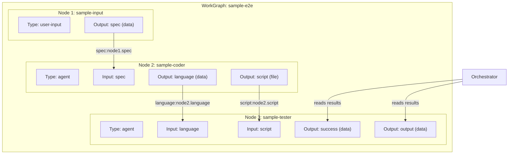
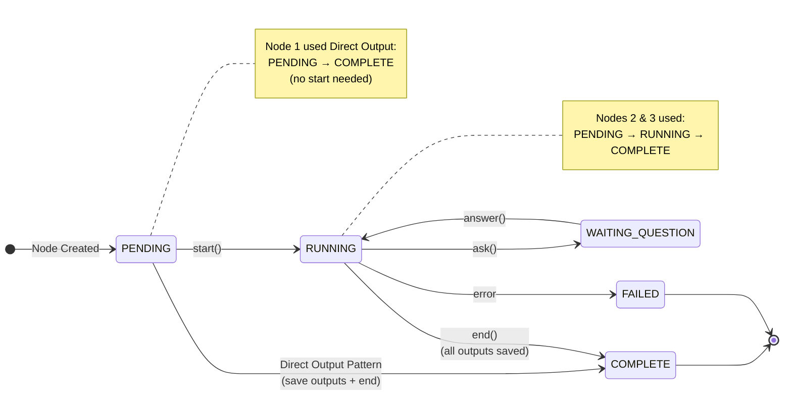
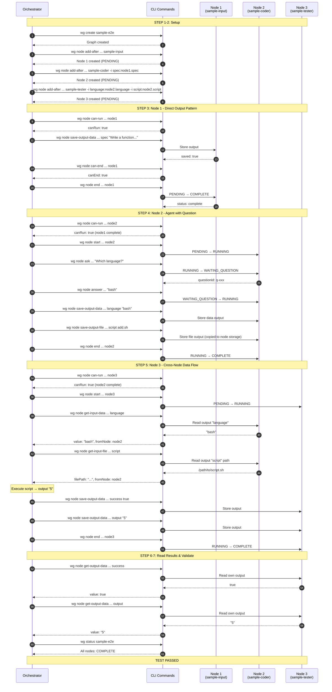
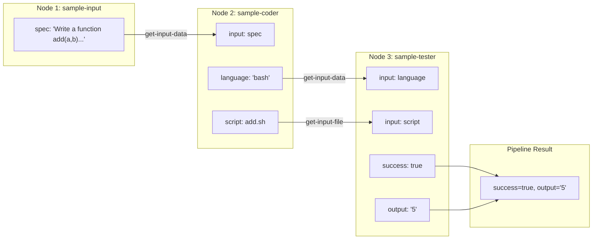

# E2E WorkGraph Flow Diagram

This document visualizes the validated data flow through the 3-node code generation pipeline.

## Pipeline Overview



## State Transitions



## Detailed Execution Flow



## Data Flow Summary



## CLI Commands Used

| Command | Purpose | Tested |
|---------|---------|--------|
| `wg create <slug>` | Create new graph | ✅ |
| `wg node add-after <graph> <after> <unit> [-i mapping]` | Add node with input mappings | ✅ |
| `wg node can-run <graph> <node>` | Check if node can start | ✅ |
| `wg node start <graph> <node>` | Transition PENDING → RUNNING | ✅ |
| `wg node ask <graph> <node> --type --text --options` | Agent asks question | ✅ |
| `wg node answer <graph> <node> <qid> <value>` | Answer pending question | ✅ |
| `wg node save-output-data <graph> <node> <name> <value>` | Save data output | ✅ |
| `wg node save-output-file <graph> <node> <name> <path>` | Save file output | ✅ |
| `wg node get-input-data <graph> <node> <name>` | Read upstream data via mapping | ✅ |
| `wg node get-input-file <graph> <node> <name>` | Read upstream file via mapping | ✅ |
| `wg node get-output-data <graph> <node> <name>` | Read node's own output | ✅ |
| `wg node can-end <graph> <node>` | Check if outputs complete | ✅ |
| `wg node end <graph> <node>` | Transition to COMPLETE | ✅ |
| `wg status <graph>` | Get graph and node status | ✅ |
| `wg delete <slug> --force` | Delete graph | ✅ |

## Key Patterns Validated

### 1. Direct Output Pattern
Node 1 demonstrates that orchestrators can save outputs to a PENDING node and call `end()` directly, skipping the `start()` step entirely:

```
PENDING → save-output-data → can-end → end → COMPLETE
```

### 2. Agent Question/Answer Handover
Node 2 demonstrates the full agent lifecycle including questions:

```
PENDING → start → RUNNING → ask → WAITING_QUESTION → answer → RUNNING → save outputs → end → COMPLETE
```

### 3. Cross-Node Data Flow
Node 3 demonstrates reading data from upstream nodes via input mappings:

```
get-input-data(language) → reads node2.language → "bash"
get-input-file(script) → reads node2.script → file path
```

### 4. Orchestrator Output Reading
The orchestrator can read a node's outputs after completion using `get-output-data`:

```
get-output-data(node3, success) → true
get-output-data(node3, output) → "5"
```
