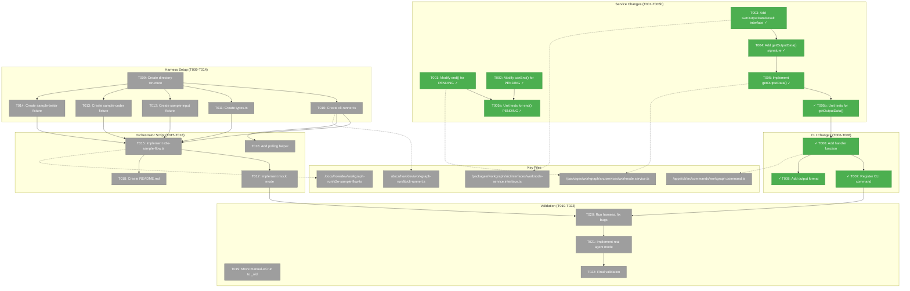
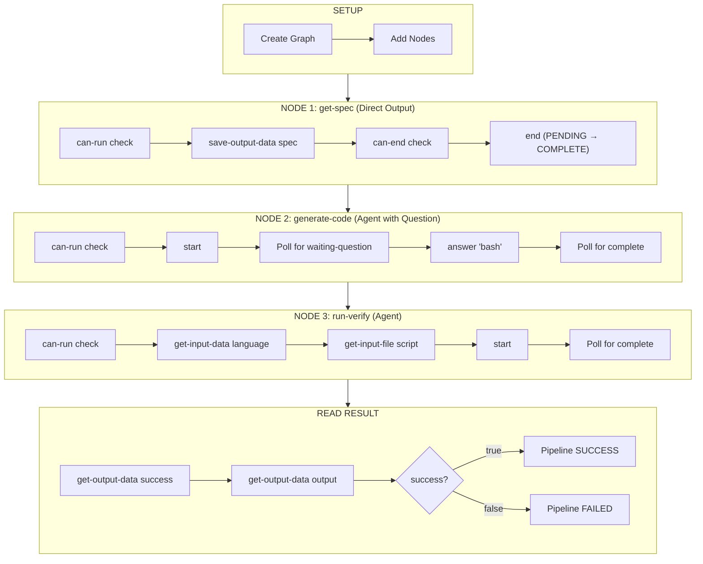
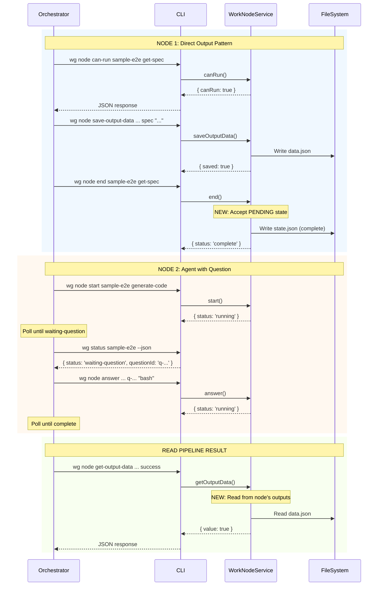

# Implementation Phase – Tasks & Alignment Brief

**Spec**: [../../agent-graph-manual-validate-spec.md](../../agent-graph-manual-validate-spec.md)
**Plan**: [../../agent-graph-manual-validate-plan.md](../../agent-graph-manual-validate-plan.md)
**Workshop**: [../../workshops/e2e-sample-flow.md](../../workshops/e2e-sample-flow.md)
**Date**: 2026-01-28
**Mode**: Simple (single phase)

---

## Executive Briefing

### Purpose

This phase implements a complete end-to-end validation harness for the WorkGraph system. The harness proves that the WorkGraph system from Plan 016 works correctly when orchestrated programmatically—validating CLI commands, state transitions, question/answer handover, and cross-node data flow. This is the first comprehensive shakedown of the WorkGraph system.

### What We're Building

A TypeScript orchestrator script (`e2e-sample-flow.ts`) that:
- Creates a 3-node WorkGraph (get-spec → generate-code → run-verify)
- Executes nodes sequentially with proper pre-execution checks (`can-run`, `can-end`)
- Demonstrates the "direct output pattern" (PENDING → COMPLETE without `start`)
- Handles agent question/answer handover (orchestrator auto-answers "bash")
- Validates cross-node data and file flow
- Reports pipeline SUCCESS/FAILED based on final node outputs

Plus supporting infrastructure:
- Service changes to allow `end()` from PENDING state (per Workshop § Critical Discovery)
- New `get-output-data` CLI command (orchestrator reads completed node outputs)
- Unit tests for service modifications (per Constitution Principle 3)
- Sample unit fixtures (sample-input, sample-coder, sample-tester)

### User Value

Developers validating WorkGraph changes get fast feedback on whether the system works end-to-end. Future orchestrators (UI, CI/CD, LLM agents) have a reference implementation to follow. Bugs in Plan 016 code are surfaced and fixed before broader adoption.

### Example

**Before (without harness)**:
```
Developer makes WorkGraph change → Manual testing → Misses edge case → Bug in production
```

**After (with harness)**:
```bash
$ npx tsx docs/how/dev/workgraph-run/e2e-sample-flow.ts

╔═══════════════════════════════════════════════════════════════╗
║           E2E Test: Sample Code Generation Flow               ║
╚═══════════════════════════════════════════════════════════════╝

STEP 1: Create Graph
  ✓ Created graph: sample-e2e

STEP 3: Execute get-spec (Direct Output)
  ✓ can-run: true (no upstream dependencies)
  ✓ Saved output: spec = "Write a function add(a, b)..."
  ✓ Completed: get-spec → complete (no start needed!)

...

═══════════════════════════════════════════════════════════════
                    ✅ TEST PASSED
═══════════════════════════════════════════════════════════════
```

---

## Objectives & Scope

### Objective

Implement the complete E2E validation harness as specified in the plan, validating all acceptance criteria (AC-0 through AC-10) and fixing any bugs discovered in Plan 016 code during iteration.

### Goals

- ✅ Modify `end()` and `canEnd()` to accept PENDING state when outputs present (Workshop § Critical Discovery)
- ✅ Add `getOutputData()` method and `get-output-data` CLI command
- ✅ Write unit tests for service changes per Constitution Principle 3
- ✅ Create harness directory structure at `docs/how/dev/workgraph-run/`
- ✅ Implement CLI runner utility with JSON parsing
- ✅ Create sample unit fixtures (sample-input, sample-coder, sample-tester)
- ✅ Implement orchestrator script with mock mode
- ✅ Add real agent mode as optional `--with-agent` flag
- ✅ Deprecate old `manual-wf-run/` harness to `_old/`
- ✅ Run harness successfully in both modes

### Non-Goals (Scope Boundaries)

- ❌ **Production error recovery** - Fail-fast is acceptable for validation (per spec Non-Goals)
- ❌ **Performance optimization** - Correctness over speed (per spec Non-Goals)
- ❌ **Multi-graph orchestration** - Single graph focus only (per spec Non-Goals)
- ❌ **Parallel node execution** - Sequential execution only (per spec Non-Goals)
- ❌ **Real-time UI integration** - CLI orchestrator only (per spec Non-Goals)
- ❌ **Unit tests for harness utilities** - The harness IS the test (per spec Testing Strategy)
- ❌ **Adding new node types** - Using existing agent, code, user-input types
- ❌ **Schema migrations** - Uses existing state.json and data.json (per spec Complexity D=0)

---

## Architecture Map

### Component Diagram

<!-- Status: grey=pending, orange=in-progress, green=completed, red=blocked -->
<!-- Updated by plan-6 during implementation -->



### Task-to-Component Mapping

<!-- Status: ⬜ Pending | 🟧 In Progress | ✅ Complete | 🔴 Blocked -->

| Task | Component(s) | Files | Status | Comment |
|------|-------------|-------|--------|---------|
| T001 | WorkNodeService | worknode.service.ts | ✅ Complete | Allow `end()` from PENDING when outputs present |
| T002 | WorkNodeService | worknode.service.ts | ✅ Complete | Allow `canEnd()` from PENDING |
| T003 | IWorkNodeService | worknode-service.interface.ts | ✅ Complete | New result type interface |
| T004 | IWorkNodeService | worknode-service.interface.ts | ✅ Complete | Add method signature |
| T005 | WorkNodeService | worknode.service.ts | ✅ Complete | Implement getOutputData() |
| T005a | Unit Tests | worknode.service.test.ts | ✅ Complete | Tests for PENDING → COMPLETE |
| T005b | Unit Tests | worknode.service.test.ts | ✅ Complete | Tests for getOutputData() |
| T006 | CLI Handlers | workgraph.command.ts | ✅ Complete | New handler function |
| T007 | CLI Commands | workgraph.command.ts | ✅ Complete | Register command |
| T008 | Output Adapters | console-output.adapter.ts | ✅ Complete | Format handler |
| T009 | Directory Structure | docs/how/dev/workgraph-run/ | 🔄 In Progress | Create folders |
| T010 | CLI Runner | lib/cli-runner.ts | ⬜ Pending | Subprocess execution |
| T011 | Type Definitions | lib/types.ts | ⬜ Pending | CLI response types |
| T012 | Fixture | fixtures/units/sample-input/ | ⬜ Pending | user-input unit |
| T013 | Fixture | fixtures/units/sample-coder/ | ⬜ Pending | agent unit with command |
| T014 | Fixture | fixtures/units/sample-tester/ | ⬜ Pending | agent unit with command |
| T015 | Orchestrator | e2e-sample-flow.ts | ⬜ Pending | Main script |
| T016 | Polling Helper | lib/cli-runner.ts | ⬜ Pending | pollForStatus() + event streaming |
| T017 | Mock Mode | e2e-sample-flow.ts | ⬜ Pending | Simulate agent work |
| T018 | Documentation | README.md | ⬜ Pending | Usage instructions |
| T019 | Cleanup | docs/how/dev/_old/ | ⬜ Pending | Deprecate old harness |
| T020 | Validation | Various | ⬜ Pending | Run harness, fix bugs |
| T021 | Real Agent Mode | e2e-sample-flow.ts | ⬜ Pending | --with-agent flag |
| T022 | Final Validation | e2e-sample-flow.ts | ⬜ Pending | Both modes succeed |

---

## Tasks

| Status | ID | Task | CS | Type | Dependencies | Absolute Path(s) | Validation | Subtasks | Notes |
|--------|-----|------|----|------|--------------|------------------|------------|----------|-------|
| [x] | T001 | Modify `end()` to accept PENDING state when outputs present | 2 | Core | -- | /home/jak/substrate/016-agent-units/packages/workgraph/src/services/worknode.service.ts | `end()` succeeds on PENDING node with outputs; E112 still returned if no outputs | -- | Per Workshop § Critical Discovery; Line 446-460 |
| [x] | T002 | Modify `canEnd()` to accept PENDING state | 1 | Core | -- | /home/jak/substrate/016-agent-units/packages/workgraph/src/services/worknode.service.ts | `canEnd()` returns true for PENDING node with outputs | -- | Line 627-641; Same pattern as T001 |
| [x] | T003 | Add `GetOutputDataResult` interface | 1 | Core | -- | /home/jak/substrate/016-agent-units/packages/workgraph/src/interfaces/worknode-service.interface.ts | Interface compiles, exports properly | -- | Model after GetInputDataResult (line 109-120) |
| [x] | T004 | Add `getOutputData()` method signature to `IWorkNodeService` | 1 | Core | T003 | /home/jak/substrate/016-agent-units/packages/workgraph/src/interfaces/worknode-service.interface.ts | Method signature in interface | -- | Add after getInputFile() (around line 340) |
| [x] | T005 | Implement `getOutputData()` in WorkNodeService | 2 | Core | T003, T004 | /home/jak/substrate/016-agent-units/packages/workgraph/src/services/worknode.service.ts | Reads value from `data/data.json` outputs; returns structured result | -- | Follow pattern of getInputData() (line 728-880) |
| [x] | T005a | Write unit tests for `end()` PENDING state transition | 2 | Test | T001, T002 | /home/jak/substrate/016-agent-units/packages/workgraph/src/services/__tests__/worknode.service.test.ts | Tests: (1) PENDING + outputs → complete, (2) PENDING + no outputs → E113, (3) running → complete unchanged | -- | Per Constitution Principle 3; add Test Doc |
| [x] | T005b | Write unit tests for `getOutputData()` method | 2 | Test | T005 | /home/jak/substrate/016-agent-units/packages/workgraph/src/services/__tests__/worknode.service.test.ts | Tests: (1) returns saved output, (2) error for missing output, (3) error for missing node | -- | Per Constitution Principle 3; add Test Doc |
| [x] | T006 | Add `handleNodeGetOutputData` handler function | 2 | CLI | T005, T005b | /home/jak/substrate/016-agent-units/apps/cli/src/commands/workgraph.command.ts | Handler follows existing pattern, calls service, formats output | -- | Model after handleNodeGetInputData (line 413-430) |
| [x] | T007 | Register `get-output-data` CLI command | 1 | CLI | T006 | /home/jak/substrate/016-agent-units/apps/cli/src/commands/workgraph.command.ts | `cg wg node get-output-data <graph> <node> <name> [--json]` works; help text clarifies "reads this node's own outputs" (vs get-input-data which reads upstream) | -- | Add near line 731-757; per didyouknow insight #4 |
| [x] | T008 | Add `wg.node.get-output-data` output format | 1 | CLI | T006 | /home/jak/substrate/016-agent-units/packages/shared/src/adapters/console-output.adapter.ts | Console and JSON output works for new command | -- | Add format handler |
| [~] | T009 | Create `docs/how/dev/workgraph-run/` directory structure | 1 | Setup | -- | /home/jak/substrate/016-agent-units/docs/how/dev/workgraph-run/, /home/jak/substrate/016-agent-units/docs/how/dev/workgraph-run/lib/, /home/jak/substrate/016-agent-units/docs/how/dev/workgraph-run/fixtures/units/ | Directories exist with proper structure | -- | Per Workshop § File Structure |
| [ ] | T010 | Create `lib/cli-runner.ts` utility | 2 | Harness | T009 | /home/jak/substrate/016-agent-units/docs/how/dev/workgraph-run/lib/cli-runner.ts | Utility executes `cg` commands, returns typed JSON results | -- | Use child_process.spawn; per Workshop § Key Script Logic |
| [ ] | T011 | Create `lib/types.ts` with result interfaces | 1 | Harness | T009 | /home/jak/substrate/016-agent-units/docs/how/dev/workgraph-run/lib/types.ts | All CLI result types defined (CanRunData, CanEndData, GetOutputDataData, GraphStatusData, etc.) | -- | Per Workshop § Type Definitions |
| [ ] | T012 | Create `fixtures/units/sample-input/unit.yaml` | 1 | Fixture | T009 | /home/jak/substrate/016-agent-units/docs/how/dev/workgraph-run/fixtures/units/sample-input/unit.yaml | Unit validates with `cg unit validate sample-input` | -- | Per Workshop § Unit 1: sample-input |
| [ ] | T013 | Create `fixtures/units/sample-coder/` unit with command | 2 | Fixture | T009 | /home/jak/substrate/016-agent-units/docs/how/dev/workgraph-run/fixtures/units/sample-coder/unit.yaml, /home/jak/substrate/016-agent-units/docs/how/dev/workgraph-run/fixtures/units/sample-coder/commands/main.md | Unit validates, command references inputs | -- | Per Workshop § Unit 2: sample-coder |
| [ ] | T014 | Create `fixtures/units/sample-tester/` unit with command | 2 | Fixture | T009 | /home/jak/substrate/016-agent-units/docs/how/dev/workgraph-run/fixtures/units/sample-tester/unit.yaml, /home/jak/substrate/016-agent-units/docs/how/dev/workgraph-run/fixtures/units/sample-tester/commands/main.md | Unit validates, command references inputs | -- | Per Workshop § Unit 3: sample-tester |
| [ ] | T015 | Implement `e2e-sample-flow.ts` orchestrator script | 3 | Harness | T010, T011, T012, T013, T014 | /home/jak/substrate/016-agent-units/docs/how/dev/workgraph-run/e2e-sample-flow.ts | Script runs to completion in mock mode, all nodes complete, reports SUCCESS; includes `getLatestQuestionId()` helper to read question ID from node status | -- | Per Workshop § Key Script Logic |
| [ ] | T016 | Add polling helper for status changes | 2 | Harness | T010 | /home/jak/substrate/016-agent-units/docs/how/dev/workgraph-run/lib/cli-runner.ts | `pollForStatus()` waits with 500ms interval, 5min timeout; logs elapsed time every 30s; streams agent events to terminal in real-time | -- | Per Workshop § Polling Helper + didyouknow insight #2 |
| [ ] | T017 | Implement mock mode execution logic | 2 | Harness | T015 | /home/jak/substrate/016-agent-units/docs/how/dev/workgraph-run/e2e-sample-flow.ts | Mock mode completes in < 30 seconds; uses real `ask`/`answer` CLI commands to test question flow; orchestrator calls `ask` directly then `answer` (no real agent) | -- | Per didyouknow insight #3: mock tests CLI round-trip, not agent |
| [ ] | T018 | Create README.md with usage instructions | 1 | Docs | T015 | /home/jak/substrate/016-agent-units/docs/how/dev/workgraph-run/README.md | Clear quick-start, describes mock vs real mode | -- | Per spec Documentation Strategy |
| [ ] | T019 | Move `manual-wf-run/` to `_old/` | 1 | Cleanup | -- | /home/jak/substrate/016-agent-units/docs/how/dev/_old/manual-wf-run/ | Old harness preserved but deprecated | -- | Per spec Q2 resolution |
| [ ] | T020 | Run harness in mock mode, fix any Plan 016 bugs discovered | 3 | Validation | T001-T018 | Various (bugs may be anywhere in workgraph package) | Harness runs successfully, all nodes complete, pipeline reports SUCCESS | -- | Primary validation; expect iteration per spec |
| [ ] | T021 | Implement real agent mode (`--with-agent` flag) | 2 | Harness | T020 | /home/jak/substrate/016-agent-units/docs/how/dev/workgraph-run/e2e-sample-flow.ts | Real agents invoked via `cg agent run`, 500ms polling, 5min timeout | -- | Optional mode; per Workshop § Mock vs Real |
| [ ] | T022 | Final validation: run both modes, verify pipeline reports SUCCESS | 1 | Validation | T020, T021 | /home/jak/substrate/016-agent-units/docs/how/dev/workgraph-run/e2e-sample-flow.ts | Mock mode < 30s, real mode completes, exit code 0 | -- | Plan complete when this passes |

---

## Alignment Brief

### Critical Findings Affecting This Phase

| Finding | Title | Impact | Addressed By |
|---------|-------|--------|--------------|
| #01 | `end()` requires `running` state | Blocks direct output pattern | T001, T002, T005a |
| #02 | `canEnd()` also requires `running` | Same as #01 | T002, T005a |
| #03 | `getOutputData()` does not exist | Orchestrator can't read final outputs | T003, T004, T005, T005b, T006, T007, T008 |
| #04 | State machine: `end` only from `running` | Must add `pending → complete` path | T001, T002 |
| #05 | Output validation in `end()` | Rely on existing; ensure fixtures correct | T012, T013, T014 |
| #06 | CLI commands use DI pattern | Follow for new command | T006 |
| #08 | Project rules: `useFactory` DI | No decorators | T006 |
| #09 | Ask/answer flow | Orchestrator must poll, detect, answer | T015, T016 |
| #10 | TypeScript preferred | Implement in TS with child_process | T010, T015 |
| #12 | `saveOutputData()` works on PENDING | Direct output pattern is valid | T015 |

### Invariants & Guardrails

Per Workshop and Spec:
- **State machine integrity**: `end()` from PENDING only allowed when ALL required outputs present
- **Error codes preserved**: E112 still returned when outputs missing
- **Polling budget**: 500ms interval, 5 minute timeout for real agent mode
- **Polling visibility**: Log elapsed time every 30s; stream agent events to terminal in real-time
- **Mock mode speed**: Must complete in < 30 seconds
- **Exit codes**: 0 for SUCCESS, 1 for FAILED

### Inputs to Read

| File | Purpose | Task |
|------|---------|------|
| `/home/jak/substrate/016-agent-units/packages/workgraph/src/services/worknode.service.ts` | Modify `end()`, `canEnd()`, add `getOutputData()` | T001, T002, T005 |
| `/home/jak/substrate/016-agent-units/packages/workgraph/src/interfaces/worknode-service.interface.ts` | Add interface and method signature | T003, T004 |
| `/home/jak/substrate/016-agent-units/apps/cli/src/commands/workgraph.command.ts` | Add CLI command handler and registration | T006, T007 |
| `/home/jak/substrate/016-agent-units/packages/shared/src/adapters/console-output.adapter.ts` | Add output format handler | T008 |

### Visual Alignment: Flow Diagram

Per Workshop § Execution Flow, the orchestrator executes this sequence:



### Visual Alignment: Sequence Diagram

Per Workshop § State Transitions:



### Test Plan (Hybrid Approach)

Per spec Testing Strategy and Constitution Principle 3:

**Unit Tests (T005a, T005b)** - Required for service changes:

| Test Name | Purpose | Fixture | Expected |
|-----------|---------|---------|----------|
| `should end PENDING node when outputs present` | Validates direct output pattern | Graph with PENDING node, outputs saved | Status: complete |
| `should return E112 when PENDING node has no outputs` | Validates output requirement | Graph with PENDING node, no outputs | Error E112 |
| `should end running node unchanged` | Backward compatibility | Graph with running node, outputs saved | Status: complete |
| `should return output value for saved data output` | getOutputData success case | Graph with complete node, outputs saved | Value returned |
| `should return error for missing output` | getOutputData error case | Graph with complete node, output not saved | Error E404 or similar |
| `should return error for missing node` | getOutputData error case | Graph without target node | Error E101 |

**E2E Validation (T020, T022)** - The harness IS the test:

| Scenario | Mode | Expected |
|----------|------|----------|
| Complete pipeline success | Mock | All nodes complete, exit 0, < 30s |
| Direct output pattern | Mock | get-spec completes without start |
| Question handover (CLI round-trip) | Mock | Orchestrator calls `ask` CLI → polls for `waiting-question` → calls `answer` CLI |
| Cross-node data flow | Mock | run-verify reads language + script |
| Pipeline success reporting | Mock | Reads success=true, reports SUCCESS |
| Complete pipeline with real agents | Real | All nodes complete, exit 0 |

### Step-by-Step Implementation Outline

**Phase 1: Service Changes (T001-T005b)**

1. **T001**: In `worknode.service.ts` line ~447, change:
   ```typescript
   // FROM:
   if (nodeStatus.status !== 'running') {
   // TO:
   if (nodeStatus.status !== 'running' && nodeStatus.status !== 'pending') {
   ```

2. **T002**: Same change in `canEnd()` at line ~628

3. **T003**: Add `GetOutputDataResult` interface in worknode-service.interface.ts:
   ```typescript
   export interface GetOutputDataResult extends BaseResult {
     nodeId: string;
     outputName: string;
     value?: unknown;
   }
   ```

4. **T004**: Add method signature to `IWorkNodeService`

5. **T005**: Implement `getOutputData()` following `getInputData()` pattern

6. **T005a**: Write unit tests for PENDING state transition

7. **T005b**: Write unit tests for getOutputData()

**Phase 2: CLI Changes (T006-T008)**

8. **T006**: Add `handleNodeGetOutputData()` handler

9. **T007**: Register `get-output-data` command

10. **T008**: Add output format handler

**Phase 3: Harness Setup (T009-T014)**

11. **T009**: Create directory structure per Workshop § File Structure

12. **T010**: Create `cli-runner.ts` per Workshop § Key Script Logic

13. **T011**: Create `types.ts` per Workshop § Type Definitions

14. **T012-T014**: Create fixtures per Workshop § Unit Definitions

**Phase 4: Orchestrator (T015-T018)**

15. **T015**: Implement `e2e-sample-flow.ts` per Workshop § Key Script Logic

16. **T016**: Add `pollForStatus()` per Workshop § Polling Helper + real-time event streaming:
    - Log elapsed time every 30s: `"... still waiting for {node} (90s elapsed)"`
    - Stream agent events to terminal as they occur (tail event log or similar)

17. **T017**: Implement mock mode - orchestrator calls real CLI commands:
    - For agent nodes: `start` → `ask` → poll for `waiting-question` → `answer` → save outputs → `end`
    - Tests CLI ask/answer round-trip without invoking real agents
    - Difference from real mode: orchestrator calls `ask` directly instead of agent doing it

18. **T018**: Create README.md

**Phase 5: Validation (T019-T022)**

19. **T019**: Move old harness to `_old/`

20. **T020**: Run harness, fix any bugs discovered (expect iteration)

21. **T021**: Add `--with-agent` flag for real agent mode

22. **T022**: Final validation - both modes succeed

### Commands to Run

```bash
# Environment setup
cd /home/jak/substrate/016-agent-units
pnpm install

# Type checking
just typecheck

# Run unit tests
just test

# Run linter
just lint

# Full quality check
just check

# Build CLI
pnpm build

# Run harness (mock mode)
npx tsx docs/how/dev/workgraph-run/e2e-sample-flow.ts

# Run harness (real agent mode)
npx tsx docs/how/dev/workgraph-run/e2e-sample-flow.ts --with-agent
```

### Risks & Mitigations

| Risk | Severity | Likelihood | Mitigation |
|------|----------|------------|------------|
| State machine edge cases in `end` from PENDING | Medium | Medium | Unit tests (T005a) cover success + failure paths |
| Undiscovered bugs in Plan 016 code | Medium | High | Expected; T020 allocates CS-3 for iteration |
| Mock-Real divergence | Low | Medium | Run both modes; document differences |
| CLI output format changes | Medium | Low | Use typed interfaces; detect parse failures |
| Question ID discovery | Low | Medium | Read from status command per workshop |

### Ready Check

Before proceeding to implementation:

- [x] Plan reviewed and understood
- [x] Workshop referenced for all implementation details
- [x] Critical findings mapped to tasks
- [x] Unit test requirements identified (T005a, T005b)
- [x] Mock usage policy confirmed (avoid mocks entirely)
- [x] Directory structure defined
- [x] Commands to run documented
- [ ] **AWAIT EXPLICIT GO/NO-GO**

---

## Phase Footnote Stubs

_Populated during implementation by plan-6a. Footnote numbers are assigned sequentially._

| Footnote | Task | FlowSpace Node IDs |
|----------|------|--------------------|
| [^1] | TBD | TBD |
| [^2] | TBD | TBD |
| [^3] | TBD | TBD |

---

## Evidence Artifacts

Implementation will write:
- `execution.log.md` - Detailed narrative of implementation progress (this directory)
- Unit test files - In `packages/workgraph/src/services/__tests__/`
- Harness files - In `docs/how/dev/workgraph-run/`

---

## Discoveries & Learnings

_Populated during implementation by plan-6. Log anything of interest to your future self._

| Date | Task | Type | Discovery | Resolution | References |
|------|------|------|-----------|------------|------------|
| | | | | | |

**Types**: `gotcha` | `research-needed` | `unexpected-behavior` | `workaround` | `decision` | `debt` | `insight`

**What to log**:
- Things that didn't work as expected
- External research that was required
- Implementation troubles and how they were resolved
- Gotchas and edge cases discovered
- Decisions made during implementation
- Technical debt introduced (and why)
- Insights that future phases should know about

_See also: `execution.log.md` for detailed narrative._

---

## Directory Layout

```
docs/plans/017-agent-graph-manual-validate/
├── agent-graph-manual-validate-spec.md
├── agent-graph-manual-validate-plan.md
├── workshops/
│   └── e2e-sample-flow.md
├── research/
│   └── e2e-sample-flow-research.md
└── tasks/
    └── implementation/
        ├── tasks.md                 # This file
        └── execution.log.md         # Created by /plan-6
```

---

**STOP**: Do NOT edit code. Awaiting explicit **GO** to proceed to `/plan-6-implement-phase`.

---

## Critical Insights Discussion

**Session**: 2026-01-28
**Context**: Implementation Phase Tasks Dossier - E2E WorkGraph Validation Harness
**Analyst**: AI Clarity Agent
**Reviewer**: jak
**Format**: Water Cooler Conversation (5 Critical Insights)

### Insight 1: Direct Output Pattern Error Handling

**Did you know**: Calling `end()` from PENDING without saving outputs could corrupt graph state - but E112 validation catches this.

**Implications**:
- Orchestrator could call `end()` before `save-output-data()`
- Validation in `end()` returns E112 error when outputs missing
- Node stays PENDING, no corruption occurs

**Options Considered**:
- Option A: Rely on existing E112 validation (current plan)
- Option B: Add explicit pre-check warning in orchestrator
- Option C: Make `can-end` a required step before `end`

**AI Recommendation**: Option C (Required can-end step)
- Reasoning: Explicit contracts prevent silent failures

**Discussion Summary**: User pointed out that E112 error already catches this - calling `end()` without outputs fails explicitly, no silent corruption.

**Decision**: Rely on existing E112 validation - no additional guards needed

**Action Items**: None

**Affects**: Nothing - plan already correct

---

### Insight 2: Polling Visibility During Agent Execution

**Did you know**: 5-minute timeout with no intermediate feedback means users wait blindly if an agent gets stuck.

**Implications**:
- No visibility during poll loop
- Can't distinguish "working slowly" from "stuck"
- Debugging is painful

**Options Considered**:
- Option A: Accept current behavior (silent polling)
- Option B: Add progress logging every 30s + stream agent events
- Option C: Exponential backoff with stall detection
- Option D: Configurable timeout flag

**AI Recommendation**: Option B (Progress logging)
- Reasoning: Minimal effort, big UX improvement

**Discussion Summary**: User agreed with B and added requirement to stream agent events in real-time to terminal.

**Decision**: Add elapsed time logging every 30s + stream agent events during polling

**Action Items**:
- [x] Updated T016 validation criteria
- [x] Bumped T016 to CS-2
- [x] Added "Polling visibility" to Invariants

**Affects**: T016 (polling helper)

---

### Insight 3: Mock Mode Question Flow

**Did you know**: Mock mode and real mode would diverge completely on question handling - mock would skip it entirely.

**Implications**:
- AC-3 (question handover) untestable in mock mode
- Mock tests different code paths than real mode
- `getLatestQuestionId()` undefined in workshop

**Options Considered**:
- Option A: Mock skips agent behavior (direct output for all nodes)
- Option B: Mock simulates question flow using real CLI commands
- Option C: Add "headless agent" intermediate mode

**AI Recommendation**: Option A (Mock skips questions)
- Reasoning: Clear separation - mock tests data flow, real tests agent integration

**Discussion Summary**: User disagreed - mock mode must test the CLI ask/answer round-trip. The point is testing WorkGraph commands work, not testing agent behavior.

**Decision**: Mock mode calls real `ask` and `answer` CLI commands to test the full round-trip

**Action Items**:
- [x] Updated T017 to clarify mock uses real CLI commands
- [x] Updated T015 to include `getLatestQuestionId()` helper
- [x] Updated implementation outline for T017
- [x] Updated Test Plan scenario description

**Affects**: T015, T017

---

### Insight 4: getOutputData vs getInputData Naming

**Did you know**: `getInputData` reads from upstream nodes, but `getOutputData` reads from the current node - asymmetric semantics.

**Implications**:
- "input" = cross-node (what flows in from elsewhere)
- "output" = same-node (what this node produced)
- Could confuse future developers

**Options Considered**:
- Option A: Keep current naming
- Option B: Rename to `get-my-output` or `read-output`
- Option C: Add clear documentation explaining difference

**AI Recommendation**: Option A + C (Keep naming, add docs)
- Reasoning: Naming is semantically correct, docs clarify direction

**Discussion Summary**: User agreed with A + C.

**Decision**: Keep `get-output-data` naming, add clear CLI help text

**Action Items**:
- [x] Updated T007 to require help text clarifying semantics

**Affects**: T007 (CLI registration)

---

### Insight 5: T020 Unbounded Bug-Fixing Scope

**Did you know**: T020 "fix any Plan 016 bugs" is open-ended with no upper bound on bugs that might be discovered.

**Implications**:
- CS-3 may be underestimated
- No triage mechanism for critical vs cosmetic bugs
- T021/T022 blocked until T020 passes

**Options Considered**:
- Option A: Accept unbounded scope (status quo)
- Option B: Add bug triage criteria (blocking vs defer)
- Option C: Time-box with checkpoint

**AI Recommendation**: Option B (Bug triage criteria)
- Reasoning: Clear decision framework, prevents scope creep

**Discussion Summary**: User will guide T020 carefully themselves - human-in-the-loop provides the judgment.

**Decision**: Accept unbounded scope; user guides iteration directly

**Action Items**: None

**Affects**: Nothing - T020 stays as-is

---

## Session Summary

**Insights Surfaced**: 5 critical insights identified and discussed
**Decisions Made**: 5 decisions reached through collaborative discussion
**Action Items Created**: 4 tasks updated with new requirements
**Areas Updated**:
- T007: CLI help text requirement
- T015: `getLatestQuestionId()` helper
- T016: Elapsed logging + event streaming (CS-1 → CS-2)
- T017: Mock mode uses real ask/answer CLI

**Shared Understanding Achieved**: ✓

**Confidence Level**: High - Key ambiguities resolved, mock/real mode behavior clarified

**Next Steps**: Await explicit **GO** to proceed to `/plan-6-implement-phase`
