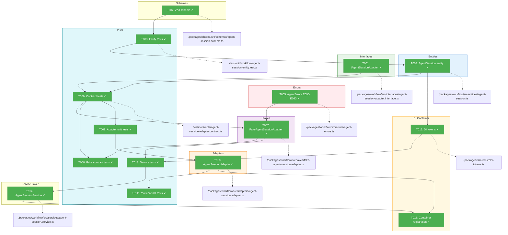
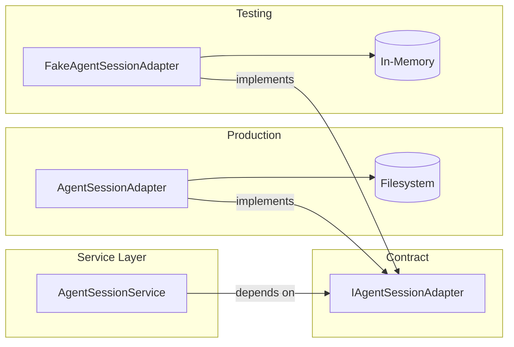
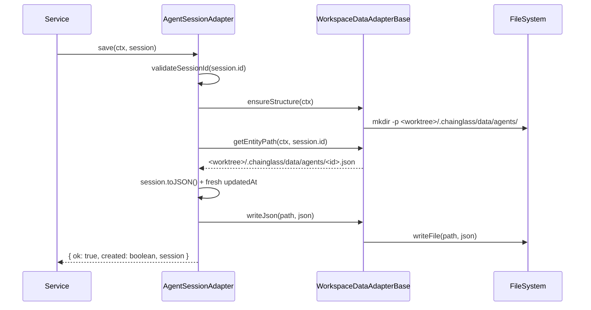

# Phase 1: AgentSession Entity + AgentSessionAdapter + Contract Tests – Tasks & Alignment Brief

**Spec**: [agents-workspace-data-model-spec.md](../../agents-workspace-data-model-spec.md)
**Plan**: [agents-workspace-data-model-plan.md](../../agents-workspace-data-model-plan.md)
**Date**: 2026-01-28

---

## Executive Briefing

### Purpose
This phase creates the foundational AgentSession entity and adapter layer for workspace-scoped agent storage. Without this, agent sessions cannot be stored per-worktree following the workspace data model established in Plan 014. This is the critical foundation for all subsequent phases.

### What We're Building
A complete AgentSession domain implementation following the Sample exemplar pattern:
- **AgentSession entity** with factory method, serialization, and validation
- **IAgentSessionAdapter interface** defining CRUD operations with WorkspaceContext
- **AgentSessionAdapter** extending WorkspaceDataAdapterBase for filesystem I/O
- **FakeAgentSessionAdapter** with three-part API (state setup, call inspection, error injection)
- **Contract test suite** ensuring fake-real parity
- **Error classes E090-E093** for agent-specific error handling
- **DI tokens** for dependency injection

### User Value
Agent sessions become workspace-scoped - each worktree gets its own agent sessions stored at `<worktree>/.chainglass/data/agents/<id>.json`. This enables:
- Multi-project isolation (different workspaces have different agents)
- Server-side session metadata (browser refresh works)
- Future git-based team sharing

### Example
**Before (Plan 015)**: Sessions stored in localStorage + non-standard server paths
```
localStorage: agent-sessions = [{ id: "abc", type: "claude", ... }]
Server: .chainglass/workspaces/default/data/abc/events.ndjson
```

**After (Plan 018)**: Workspace-scoped server-side storage
```
Server: <worktree>/.chainglass/data/agents/abc.json (metadata)
Server: <worktree>/.chainglass/data/agents/abc/events.ndjson (events - Phase 2)
```

---

## Objectives & Scope

### Objective
Implement the AgentSession entity and adapter layer following the Sample exemplar pattern, satisfying AC-01 through AC-06 and AC-23.

**Behavior Checklist**:
- [ ] AC-01: AgentSession entity has required fields (id, type, status, createdAt, updatedAt)
- [ ] AC-02: AgentSession serializes to/from JSON with camelCase + ISO-8601 dates
- [ ] AC-03: AgentSessionAdapter extends WorkspaceDataAdapterBase with domain='agents'
- [ ] AC-04: Sessions stored as individual JSON files at `<worktree>/.chainglass/data/agents/<id>.json`
- [ ] AC-05: list() returns all sessions in worktree, ordered by createdAt (newest first)
- [ ] AC-06: FakeAgentSessionAdapter passes contract tests (same tests as real adapter)
- [ ] AC-23: FakeAgentSessionAdapter has three-part API (State Setup, Inspection, Error Injection)

### Goals

- ✅ Create AgentSession entity with private constructor + static factory
- ✅ Define IAgentSessionAdapter interface (save, load, list, remove, exists)
- ✅ Implement AgentSessionAdapter extending WorkspaceDataAdapterBase
- ✅ Implement FakeAgentSessionAdapter with three-part testing API
- ✅ Create contract test factory running against both fake and real
- ✅ Define error codes E090-E093 for agent domain
- ✅ Create Zod schema for validation
- ✅ Register DI tokens in WORKSPACE_DI_TOKENS
- ✅ Implement AgentSessionService with business logic

### Non-Goals

- ❌ Event storage (Phase 2 - AgentEventAdapter)
- ❌ Web UI routes or React components (Phase 3)
- ❌ Migration from old storage paths (Phase 4)
- ❌ SSE integration (already exists in Plan 015, just path changes in Phase 2)
- ❌ Slug generation from session ID (ID IS the slug for agent sessions)
- ❌ Session name/title field (not required per spec - keep minimal)

---

## Architecture Map

### Component Diagram
<!-- Status: grey=pending, orange=in-progress, green=completed, red=blocked -->
<!-- Updated by plan-6 during implementation -->



### Task-to-Component Mapping

<!-- Status: ⬜ Pending | 🟧 In Progress | ✅ Complete | 🔴 Blocked -->

| Task | Component(s) | Files | Status | Comment |
|------|-------------|-------|--------|---------|
| T001 | Interface | `/packages/workflow/src/interfaces/agent-session-adapter.interface.ts` | ✅ Complete | Define 5-method CRUD interface with WorkspaceContext |
| T002 | Schema | `/packages/shared/src/schemas/agent-session.schema.ts` | ✅ Complete | Zod schema for validation |
| T003 | Test | `/test/unit/workflow/agent-session.entity.test.ts` | ✅ Complete | TDD: Write entity tests first |
| T004 | Entity | `/packages/workflow/src/entities/agent-session.ts` | ✅ Complete | Implement entity to pass tests |
| T005 | Errors | `/packages/workflow/src/errors/agent-errors.ts` | ✅ Complete | E090-E093 error codes + classes |
| T006 | Contract | `/test/contracts/agent-session-adapter.contract.ts` | ✅ Complete | Contract test factory function |
| T007 | Fake | `/packages/workflow/src/fakes/fake-agent-session-adapter.ts` | ✅ Complete | Three-part API fake implementation |
| T008 | Test | `/test/contracts/agent-session-adapter.contract.test.ts` | ✅ Complete | Run contracts against fake |
| T009 | Test | `/test/unit/workflow/agent-session-adapter.test.ts` | ✅ Complete | TDD: Contract tests cover adapter |
| T010 | Adapter | `/packages/workflow/src/adapters/agent-session.adapter.ts` | ✅ Complete | Real adapter with filesystem I/O |
| T011 | Test | `/test/contracts/agent-session-adapter.contract.test.ts` | ✅ Complete | Run contracts against real adapter |
| T012 | DI | `/packages/shared/src/di-tokens.ts` | ✅ Complete | Add AGENT_SESSION_* tokens |
| T013 | Test | `/test/unit/workflow/agent-session-service.test.ts` | ✅ Complete | TDD: Service tests with fake |
| T014 | Service | `/packages/workflow/src/services/agent-session.service.ts` | ✅ Complete | Business logic layer |
| T015 | DI | `/packages/workflow/src/container.ts` | ✅ Complete | Register adapter + service |
| T016 | Checkpoint | N/A | ✅ Complete | Run `pnpm test packages/workflow` |

---

## Tasks

| Status | ID | Task | CS | Type | Dependencies | Absolute Path(s) | Validation | Subtasks | Notes |
|--------|-----|------|----|------|--------------|------------------|------------|----------|-------|
| [x] | T001 | Write IAgentSessionAdapter interface | 1 | Interface | – | `/home/jak/substrate/015-better-agents/packages/workflow/src/interfaces/agent-session-adapter.interface.ts` | Interface exports: save, load, list, remove, exists with WorkspaceContext; result types defined | – | Follow ISampleAdapter pattern |
| [x] | T002 | Write Zod schema for AgentSession | 1 | Schema | – | `/home/jak/substrate/015-better-agents/packages/shared/src/schemas/agent-session.schema.ts` | Schema validates: id (string), type ('claude'\|'copilot'), status ('active'\|'completed'\|'terminated'), createdAt (ISO string), updatedAt (ISO string) | – | Export AgentSessionSchema, AgentSessionJSON type |
| [x] | T003 | Write tests for AgentSession entity (TDD RED) | 2 | Test | T002 | `/home/jak/substrate/015-better-agents/test/unit/workflow/agent-session.entity.test.ts` | Tests fail with "not implemented" or import errors; tests cover: create(), toJSON(), fromJSON(), validation | – | Per Critical Discovery 01: Must use factory pattern |
| [x] | T004 | Implement AgentSession entity (TDD GREEN) | 2 | Core | T003 | `/home/jak/substrate/015-better-agents/packages/workflow/src/entities/agent-session.ts` | All entity tests pass; entity has private constructor, static create(), toJSON() with ISO dates | – | Per DYK-P3-02: Adapter owns updatedAt |
| [x] | T005 | Write agent error classes (E090-E093) | 1 | Errors | – | `/home/jak/substrate/015-better-agents/packages/workflow/src/errors/agent-errors.ts` | Errors defined: E090 AgentSessionNotFound, E091 AgentSessionExists, E092 InvalidAgentSessionData, E093 AgentEventNotFound | – | Per Discovery 07 |
| [x] | T006 | Write contract tests for IAgentSessionAdapter | 3 | Test | T001, T004 | `/home/jak/substrate/015-better-agents/test/contracts/agent-session-adapter.contract.ts` | Factory function exports with 12+ test cases covering save, load, list, remove, exists; includes workspace isolation tests | – | Per Discovery 09: Test both fake and real |
| [x] | T007 | Write FakeAgentSessionAdapter with three-part API | 3 | Fake | T005, T006 | `/home/jak/substrate/015-better-agents/packages/workflow/src/fakes/fake-agent-session-adapter.ts` | Fake has: addSession/getSessions (state), saveCalls/loadCalls/etc (inspection), injectSaveError/etc (injection), reset() | – | Per Discovery 08: Copy FakeSampleAdapter pattern |
| [x] | T008 | Run contract tests against FakeAgentSessionAdapter | 1 | Test | T006, T007 | `/home/jak/substrate/015-better-agents/test/contracts/agent-session-adapter.contract.test.ts` | All 12+ contract tests pass for FakeAgentSessionAdapter | – | Must pass before implementing real adapter |
| [x] | T009 | Write unit tests for AgentSessionAdapter (TDD RED) | 2 | Test | T006 | `/home/jak/substrate/015-better-agents/test/unit/workflow/agent-session-adapter.test.ts` | Tests fail; cover: save, load, list, remove, exists with filesystem assertions; include validateSessionId tests | – | Per Discovery 05: Session ID validation |
| [x] | T010 | Implement AgentSessionAdapter extending WorkspaceDataAdapterBase | 3 | Core | T009 | `/home/jak/substrate/015-better-agents/packages/workflow/src/adapters/agent-session.adapter.ts` | Adapter passes unit tests; domain='agents'; uses getEntityPath(), writeJson(), readJson(); validateSessionId() called | – | Per Discovery 01: Extend base class |
| [x] | T011 | Run contract tests against AgentSessionAdapter | 1 | Test | T006, T010 | `/home/jak/substrate/015-better-agents/test/contracts/agent-session-adapter.contract.test.ts` | All 12+ contract tests pass for real adapter (SAME tests as fake) | – | Contract parity verified |
| [x] | T012 | Add agent DI tokens to WORKSPACE_DI_TOKENS | 1 | DI | T004 | `/home/jak/substrate/015-better-agents/packages/shared/src/di-tokens.ts` | Tokens defined: AGENT_SESSION_ADAPTER, AGENT_SESSION_SERVICE, AGENT_EVENT_ADAPTER | – | Per Discovery 14: Use WORKSPACE_DI_TOKENS |
| [x] | T013 | Write AgentSessionService tests using fake (TDD RED) | 2 | Test | T007, T012 | `/home/jak/substrate/015-better-agents/test/unit/workflow/agent-session-service.test.ts` | Tests fail; service tests use FakeAgentSessionAdapter; verify createSession, getSession, listSessions, deleteSession | – | Per Discovery 06: Service depends on interface |
| [x] | T014 | Implement AgentSessionService | 2 | Core | T013 | `/home/jak/substrate/015-better-agents/packages/workflow/src/services/agent-session.service.ts` | Service passes tests; depends on IAgentSessionAdapter interface; implements business logic (generateId, validation) | – | Per Discovery 18: ID generation handles races |
| [x] | T015 | Register adapters in workflow DI container | 1 | DI | T010, T014 | `/home/jak/substrate/015-better-agents/packages/workflow/src/container.ts` | Production container uses AgentSessionAdapter; exports token bindings | – | Per Discovery 14: useFactory pattern |
| [x] | T016 | Verify all tests pass (unit + contract) | 1 | Checkpoint | T008, T011, T014 | N/A | `pnpm test packages/workflow` passes; 50+ new tests; no vi.mock usage | – | Phase complete checkpoint |

---

## Alignment Brief

### Prior Phases Review
*Not applicable - this is Phase 1 (foundational phase).*

### Critical Findings Affecting This Phase

| Finding | Constraint/Requirement | Addressed By |
|---------|------------------------|--------------|
| Discovery 01: WorkspaceDataAdapterBase Pattern | AgentSessionAdapter MUST extend base class, set domain='agents' | T010 |
| Discovery 02: WorkspaceContext | All adapter methods require WorkspaceContext as first param | T001, T010 |
| Discovery 05: Session ID Validation | validateSessionId() MUST be called before filesystem ops | T009, T010 |
| Discovery 06: Service → Adapter Dependency | Service MUST depend on interface, never concrete adapter | T013, T014 |
| Discovery 07: Error Codes E090-E099 | Define E090-E093 for agent errors | T005 |
| Discovery 08: Fake Three-Part API | State Setup, Call Inspection, Error Injection pattern | T007 |
| Discovery 09: Contract Tests | Same tests MUST run against both fake and real | T006, T008, T011 |
| Discovery 14: DI useFactory Pattern | Register with useFactory, no decorators | T015 |
| Discovery 16: Entity Serialization | toJSON() uses camelCase + ISO-8601 dates | T004 |
| Discovery 18: ID Generation | Timestamp + UUIDv4 short suffix for collision prevention | T014 |

### ADR Decision Constraints

| ADR | Constraint | Affected Tasks |
|-----|-----------|----------------|
| ADR-0008 | Storage at `<worktree>/.chainglass/data/<domain>/` | T010 |
| ADR-0008 | No cross-workspace data leakage | T006 (isolation tests) |

### Invariants & Guardrails

- **Session ID format**: `[a-zA-Z0-9_-]{1,255}` - reject path traversal attempts (`../`, `/`, `\`, `.`)
- **Entity immutability**: All entity properties are `readonly`
- **Adapter owns updatedAt**: Entity.create() can set updatedAt, but adapter ALWAYS overwrites on save
- **No caching**: Always fresh filesystem reads (per Sample spec Q5)
- **Error propagation**: All errors use E090-E093 codes

### Inputs to Read

| File | Purpose |
|------|---------|
| `/home/jak/substrate/015-better-agents/packages/workflow/src/entities/sample.ts` | Entity pattern to follow |
| `/home/jak/substrate/015-better-agents/packages/workflow/src/interfaces/sample-adapter.interface.ts` | Interface pattern |
| `/home/jak/substrate/015-better-agents/packages/workflow/src/adapters/workspace-data-adapter-base.ts` | Base class to extend |
| `/home/jak/substrate/015-better-agents/packages/workflow/src/fakes/fake-sample-adapter.ts` | Fake three-part API pattern |
| `/home/jak/substrate/015-better-agents/test/contracts/sample-adapter.contract.ts` | Contract test factory pattern |
| `/home/jak/substrate/015-better-agents/packages/workflow/src/errors/sample-errors.ts` | Error code pattern |
| `/home/jak/substrate/015-better-agents/packages/shared/src/di-tokens.ts` | DI token registration |

### Visual Alignment Aids

#### Entity/Adapter Flow Diagram



#### Adapter Method Sequence (save)



### Test Plan (Full TDD, Fakes Only)

| Test File | Test Cases | Fixture/Setup | Expected Output |
|-----------|------------|---------------|-----------------|
| `agent-session.entity.test.ts` | create(), toJSON(), fromJSON(), validation, invariants | None | Entity correctly serializes |
| `agent-session-adapter.contract.ts` | 12+ contract tests (save new, update, load, load missing, list, list empty, remove, remove missing, exists true, exists false, workspace isolation, ensureStructure) | createDefaultContext(), test sessions | Both fake and real pass identical tests |
| `agent-session-adapter.test.ts` | validateSessionId, filesystem I/O, error handling | FakeFileSystem | Adapter uses base class correctly |
| `agent-session-service.test.ts` | createSession, getSession, listSessions, deleteSession, error paths | FakeAgentSessionAdapter | Business logic correct |

**Test Fixtures**:
```typescript
const SESSION_1 = AgentSession.create({
  id: 'test-session-1',
  type: 'claude',
  status: 'active',
  createdAt: new Date('2026-01-28T10:00:00Z'),
});

const SESSION_2 = AgentSession.create({
  id: 'test-session-2',
  type: 'copilot',
  status: 'completed',
  createdAt: new Date('2026-01-28T11:00:00Z'),
});
```

### Step-by-Step Implementation Outline

1. **T001**: Create interface file following ISampleAdapter pattern
2. **T002**: Create Zod schema in packages/shared
3. **T003**: Write failing entity tests (RED)
4. **T004**: Implement entity to pass tests (GREEN)
5. **T005**: Create error classes E090-E093
6. **T006**: Write contract test factory (will fail - no implementations yet)
7. **T007**: Implement FakeAgentSessionAdapter
8. **T008**: Run contracts against fake - must pass
9. **T009**: Write failing adapter unit tests (RED)
10. **T010**: Implement AgentSessionAdapter (GREEN)
11. **T011**: Run contracts against real - must pass (same as fake)
12. **T012**: Add DI tokens
13. **T013**: Write failing service tests (RED)
14. **T014**: Implement service (GREEN)
15. **T015**: Register in DI container
16. **T016**: Final verification - all tests pass

### Commands to Run

```bash
# Environment setup
cd /home/jak/substrate/015-better-agents
pnpm install

# Run tests during development (watch mode)
pnpm test packages/workflow --watch

# Type checking
pnpm typecheck

# Linting + formatting
just fft

# Final verification
pnpm test packages/workflow packages/shared
```

### Risks/Unknowns

| Risk | Severity | Mitigation |
|------|----------|------------|
| WorkspaceDataAdapterBase API differences | Medium | Read base class thoroughly; reference SampleAdapter |
| DI container registration issues | Low | Follow existing Sample pattern exactly |
| validateSessionId not available | Low | Implement as utility if not existing |
| Test isolation failures | Medium | Use reset() in beforeEach; composite keys |

### Ready Check

- [ ] ADR constraints mapped to tasks (ADR-0008 storage path → T010)
- [ ] Critical findings mapped to tasks (all 10 findings addressed)
- [ ] Interface pattern reviewed (ISampleAdapter)
- [ ] Entity pattern reviewed (Sample)
- [ ] Fake pattern reviewed (FakeSampleAdapter)
- [ ] Contract test pattern reviewed (sample-adapter.contract.ts)
- [ ] Error code pattern reviewed (sample-errors.ts)
- [ ] DI registration pattern reviewed (container.ts)

---

## Phase Footnote Stubs

| Footnote | Task | Description | Date Added |
|----------|------|-------------|------------|
| | | _Populated by plan-6 during implementation_ | |

---

## Evidence Artifacts

**Execution Log**: `execution.log.md` (created by plan-6 in this directory)

**Supporting Files** (created during implementation):
- Contract test output showing fake-real parity
- Coverage report for new code
- Type check results

---

## Discoveries & Learnings

_Populated during implementation by plan-6. Log anything of interest to your future self._

| Date | Task | Type | Discovery | Resolution | References |
|------|------|------|-----------|------------|------------|
| | | | | | |

**Types**: `gotcha` | `research-needed` | `unexpected-behavior` | `workaround` | `decision` | `debt` | `insight`

**What to log**:
- Things that didn't work as expected
- External research that was required
- Implementation troubles and how they were resolved
- Gotchas and edge cases discovered
- Decisions made during implementation
- Technical debt introduced (and why)
- Insights that future phases should know about

_See also: `execution.log.md` for detailed narrative._

---

## Directory Layout

```
docs/plans/018-agents-workspace-data-model/
├── agents-workspace-data-model-spec.md
├── agents-workspace-data-model-plan.md
└── tasks/
    └── phase-1-agentsession-entity/
        ├── tasks.md              # ← This file
        └── execution.log.md      # ← Created by plan-6 during implementation
```

---

**STOP**: Do **not** edit code. Await explicit **GO** from human sponsor.
