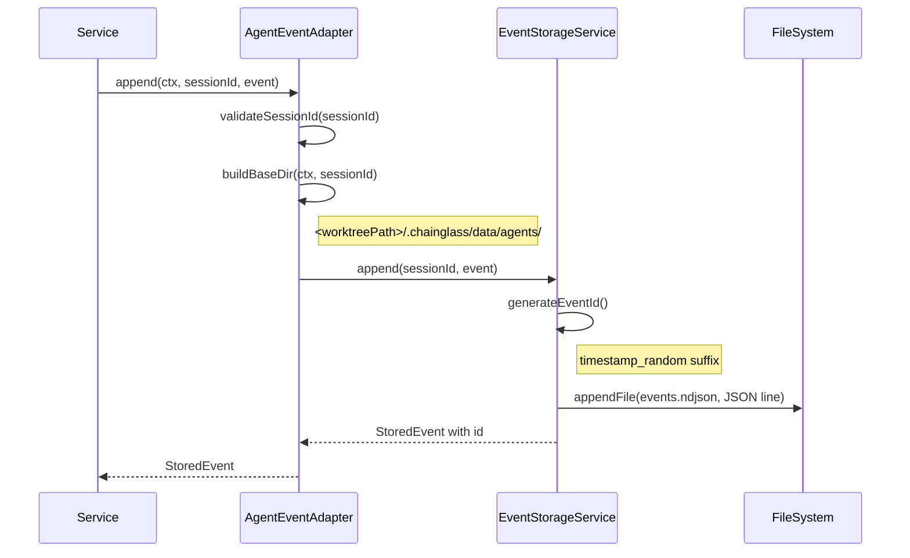
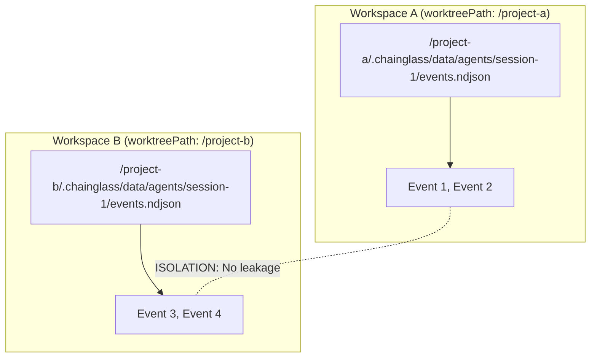

# Phase 2: AgentEventAdapter (Workspace-Scoped Event Storage) – Tasks & Alignment Brief

**Spec**: [agents-workspace-data-model-spec.md](../../agents-workspace-data-model-spec.md)
**Plan**: [agents-workspace-data-model-plan.md](../../agents-workspace-data-model-plan.md)
**Date**: 2026-01-28

---

## Executive Briefing

### Purpose
This phase makes agent event storage workspace-aware by wrapping the existing `EventStorageService` with an `AgentEventAdapter` that accepts `WorkspaceContext`. Without this, events remain stored at the legacy Plan 015 path (`<cwd>/.chainglass/workspaces/default/data/`) instead of the proper workspace-scoped path per ADR-0008.

### What We're Building
An `AgentEventAdapter` that:
- Wraps `EventStorageService` with workspace context resolution
- Stores events at `<worktreePath>/.chainglass/data/agents/<sessionId>/events.ndjson`
- Maintains all existing DYK behaviors (timestamp IDs, NDJSON format, malformed line skipping)
- Enables workspace isolation (events from workspace A invisible to workspace B)
- Exports `EventStorageService` from server-only entry point (browser safety)

### User Value
Agent events become workspace-scoped - each worktree gets its own event history. Combined with Phase 1's session metadata, this enables:
- Multi-project isolation (no cross-workspace data leakage)
- Foundation for Phase 3's workspace-scoped web UI
- Existing SSE streaming continues working (just with new paths)

### Example
**Before (Plan 015)**: Events at non-workspace path
```
Server: <cwd>/.chainglass/workspaces/default/data/session-abc/events.ndjson
```

**After (Plan 018)**: Workspace-scoped storage
```
Server: <worktree>/.chainglass/data/agents/session-abc/events.ndjson
                                 ↑ agents domain under workspace data path
```

---

## Objectives & Scope

### Objective
Implement workspace-aware event storage via AgentEventAdapter, satisfying AC-07 through AC-12 while maintaining all Plan 015 DYK behaviors.

**Behavior Checklist**:
- [ ] AC-07: IAgentEventAdapter interface defines append, getAll, getSince, archive, exists with WorkspaceContext
- [ ] AC-08: Events stored at `<worktreePath>/.chainglass/data/agents/<sessionId>/events.ndjson`
- [ ] AC-09: NDJSON format preserved, DYK-04 behavior (skip malformed lines) maintained
- [ ] AC-10: Workspace isolation - events in workspace A invisible to workspace B queries
- [ ] AC-11: Session ID validation via validateSessionId() before filesystem operations
- [ ] AC-12: FakeAgentEventAdapter with three-part API passes contract tests

### Goals

- ✅ Create IAgentEventAdapter interface (5 methods with WorkspaceContext)
- ✅ Implement AgentEventAdapter wrapping EventStorageService
- ✅ Implement FakeAgentEventAdapter with three-part testing API
- ✅ Create contract tests ensuring fake-real parity
- ✅ Write workspace isolation integration tests
- ✅ Export EventStorageService from server-only entry point
- ✅ Add optional logging for malformed line skipping
- ✅ Register AgentEventAdapter in DI container
- ✅ Verify SSE integration still works with new paths

### Non-Goals

- ❌ Web UI routes or React components (Phase 3)
- ❌ Session metadata storage (Phase 1 - complete)
- ❌ Migration from old event paths (Phase 4)
- ❌ Event schema changes (preserve existing AgentStoredEvent)
- ❌ SSE broadcast refactoring (keep existing mechanism, just path changes)
- ❌ Event filtering or transformation (adapter is pass-through)
- ❌ Compression or event log rotation (out of scope for this plan)

---

## Architecture Map

### Component Diagram

```mermaid
flowchart TD
    classDef pending fill:#9E9E9E,stroke:#757575,color:#fff
    classDef inprogress fill:#FF9800,stroke:#F57C00,color:#fff
    classDef completed fill:#4CAF50,stroke:#388E3C,color:#fff
    classDef blocked fill:#F44336,stroke:#D32F2F,color:#fff

    style Interfaces fill:#E8F5E9,stroke:#388E3C
    style Adapters fill:#FFF3E0,stroke:#F57C00
    style Fakes fill:#F3E5F5,stroke:#7B1FA2
    style Tests fill:#E0F7FA,stroke:#00838F
    style Server fill:#E3F2FD,stroke:#1976D2

    subgraph Interfaces["Interfaces"]
        T001["T001: IAgentEventAdapter"]:::pending
    end

    subgraph Tests["Tests"]
        T002["T002: Adapter unit tests (TDD)"]:::pending
        T004["T004: Workspace isolation tests"]:::pending
        T005["T005: Event ID generation tests"]:::pending
        T006["T006: Session ID validation tests"]:::pending
        T008["T008: NDJSON malformed line tests"]:::pending
        T012["T012: SSE integration test"]:::pending
    end

    subgraph Adapters["Adapters"]
        T003["T003: AgentEventAdapter"]:::pending
    end

    subgraph Fakes["Fakes"]
        T010["T010: FakeAgentEventAdapter"]:::pending
    end

    subgraph Server["Server Export"]
        T007["T007: Server-only entry point"]:::pending
        T009["T009: Optional logging"]:::pending
    end

    subgraph DI["DI Container"]
        T011["T011: Container registration"]:::pending
    end

    %% Dependencies
    T001 --> T002
    T002 --> T003
    T001 --> T010
    T003 --> T004
    T003 --> T005
    T003 --> T006
    T003 --> T007
    T003 --> T008
    T003 --> T009
    T010 --> T011
    T003 --> T011
    T011 --> T012

    %% File mappings (dotted lines)
    T001 -.-> IF1["/packages/workflow/src/interfaces/agent-event-adapter.interface.ts"]
    T002 -.-> TF1["/test/unit/workflow/agent-event-adapter.test.ts"]
    T003 -.-> AF1["/packages/workflow/src/adapters/agent-event.adapter.ts"]
    T004 -.-> IF2["/test/integration/workspace-agent-isolation.test.ts"]
    T007 -.-> SF1["/packages/shared/src/index.server.ts"]
    T010 -.-> FF1["/packages/workflow/src/fakes/fake-agent-event-adapter.ts"]
    T011 -.-> DIF1["/packages/workflow/src/container.ts"]
```

<!-- Status: grey=pending, orange=in-progress, green=completed, red=blocked -->
<!-- Updated by plan-6 during implementation -->



### Task-to-Component Mapping

<!-- Status: ⬜ Pending | 🟧 In Progress | ✅ Complete | 🔴 Blocked -->

| Task | Component(s) | Files | Status | Comment |
|------|-------------|-------|--------|---------|
| T001 | Interface | `/packages/workflow/src/interfaces/agent-event-adapter.interface.ts` | ⬜ Pending | Define 5-method interface (append, getAll, getSince, archive, exists) with WorkspaceContext |
| T002 | Test | `/test/unit/workflow/agent-event-adapter.test.ts` | ⬜ Pending | TDD: Write adapter unit tests first |
| T003 | Adapter | `/packages/workflow/src/adapters/agent-event.adapter.ts` | ⬜ Pending | Implement NDJSON logic directly (replaces EventStorageService) |
| T004 | Test | `/test/integration/workspace-agent-isolation.test.ts` | ⬜ Pending | Verify events don't leak across workspaces |
| T005 | Test | `/test/unit/workflow/agent-event-adapter.test.ts` | ⬜ Pending | Verify timestamp-based ID format per DYK-01 |
| T006 | Test | `/test/unit/workflow/agent-event-adapter.test.ts` | ⬜ Pending | Verify validateSessionId() called per Discovery 05 |
| T007 | Export | `/packages/shared/src/index.server.ts` | ⬜ Pending | SKIP - EventStorageService being deleted |
| T008 | Test | `/test/unit/workflow/agent-event-adapter.test.ts` | ⬜ Pending | Verify malformed line skipping per DYK-04 |
| T009 | Adapter | `/packages/workflow/src/adapters/agent-event.adapter.ts` | ⬜ Pending | Add optional logger for malformed lines per Discovery 20 |
| T010 | Fake | `/packages/workflow/src/fakes/fake-agent-event-adapter.ts` | ⬜ Pending | Three-part API (state, inspection, injection) |
| T011 | Test | `/test/contracts/agent-event-adapter.contract.ts` | ⬜ Pending | Contract tests: fake↔real parity (transfers quality from old tests) |
| T012 | DI | `/packages/workflow/src/container.ts` | ⬜ Pending | Register AgentEventAdapter with useFactory pattern |
| T013 | Test | `/test/integration/sse-workspace-integration.test.ts` | ⬜ Pending | Verify SSE still works with new paths |
| T014 | Cleanup | `/packages/shared/src/services/event-storage.service.ts` + tests | ⬜ Pending | Delete EventStorageService, FakeEventStorage, IEventStorage, and their tests |
| T015 | Cleanup | `/apps/web/src/lib/di-container.ts` | ⬜ Pending | Remove DI_TOKENS.EVENT_STORAGE registration |
| T016 | Migration | `/apps/web/app/api/workspaces/[slug]/agents/run/route.ts` + test | ⬜ Pending | Move route + tests together, update to use AgentEventAdapter |
| T017 | Migration | `/apps/web/app/api/workspaces/[slug]/agents/sessions/[sessionId]/events/route.ts` + test | ⬜ Pending | Move route + tests together, update to use AgentEventAdapter |
| T018 | Checkpoint | N/A | ⬜ Pending | Run `pnpm test` - full test suite with contract tests |

---

## Tasks

| Status | ID | Task | CS | Type | Dependencies | Absolute Path(s) | Validation | Subtasks | Notes |
|--------|-----|------|----|------|--------------|------------------|------------|----------|-------|
| [ ] | T001 | Write IAgentEventAdapter interface | 1 | Interface | – | `/home/jak/substrate/015-better-agents/packages/workflow/src/interfaces/agent-event-adapter.interface.ts` | Interface exports: append, getAll, getSince, archive, exists with WorkspaceContext as first param; result types defined | – | Follow IEventStorage pattern, add WorkspaceContext |
| [ ] | T002 | Write tests for AgentEventAdapter (TDD RED) | 2 | Test | T001 | `/home/jak/substrate/015-better-agents/test/unit/workflow/agent-event-adapter.test.ts` | Tests fail; cover: workspace-scoped paths, NDJSON format, DYK-04 behavior, session ID validation | – | Per Discovery 02: All methods take WorkspaceContext |
| [ ] | T003 | Implement AgentEventAdapter with NDJSON logic | 3 | Core | T002 | `/home/jak/substrate/015-better-agents/packages/workflow/src/adapters/agent-event.adapter.ts` | Adapter passes unit tests; implements NDJSON append/read directly (not wrapping EventStorageService); path: `<worktreePath>/.chainglass/data/agents/<sessionId>/events.ndjson` | – | Per DYK session: Replaces EventStorageService, owns all NDJSON logic |
| [ ] | T004 | Write workspace isolation integration tests | 2 | Test | T003 | `/home/jak/substrate/015-better-agents/test/integration/workspace-agent-isolation.test.ts` | Tests verify: events in workspace A don't appear in workspace B getAll(); same sessionId different workspaces stay isolated | – | Per AC-10 |
| [ ] | T005 | Verify event ID generation tests (timestamp-based) | 1 | Test | T003 | `/home/jak/substrate/015-better-agents/test/unit/workflow/agent-event-adapter.test.ts` | Tests verify: generateEventId() format matches DYK-01 pattern (YYYY-MM-DDTHH:mm:ss.sssZ_xxxxx) | – | Reuse existing EventStorageService tests logic |
| [ ] | T006 | Write session ID validation tests in append() | 1 | Test | T003 | `/home/jak/substrate/015-better-agents/test/unit/workflow/agent-event-adapter.test.ts` | Tests verify: validateSessionId() called before filesystem operations; path traversal rejected | – | Per Discovery 05: Security critical |
| [ ] | T007 | SKIP - Server-only export no longer needed | 0 | Skip | – | – | EventStorageService being deleted; AgentEventAdapter lives in packages/workflow which is already server-only | – | Per DYK session: No legacy code to export |
| [ ] | T008 | Write tests for NDJSON malformed line handling | 2 | Test | T003 | `/home/jak/substrate/015-better-agents/test/unit/workflow/agent-event-adapter.test.ts` | Tests verify: corrupted lines skipped per DYK-04; valid lines parsed; partial corruption doesn't fail entire load | – | Per Discovery 10: Maintain existing resilience |
| [ ] | T009 | Add optional logging to malformed line skipping | 1 | Core | T003, T008 | `/home/jak/substrate/015-better-agents/packages/workflow/src/adapters/agent-event.adapter.ts` | Logger.warn() called when skipping malformed line (if logger injected); silent if no logger | – | Per Discovery 20: Optional observability |
| [ ] | T010 | Write FakeAgentEventAdapter with three-part API | 2 | Fake | T001 | `/home/jak/substrate/015-better-agents/packages/workflow/src/fakes/fake-agent-event-adapter.ts` | Fake has: addEvent/getEvents (state), appendCalls/getAllCalls (inspection), injectAppendError (injection), reset() | – | Per Discovery 08: Same pattern as FakeAgentSessionAdapter |
| [ ] | T011 | Create AgentEventAdapter contract tests (fake↔real parity) | 2 | Test | T003, T010 | `/home/jak/substrate/015-better-agents/test/contracts/agent-event-adapter.contract.ts`, `/home/jak/substrate/015-better-agents/test/contracts/agent-event-adapter.contract.test.ts` | Contract factory with 10+ test cases; both FakeAgentEventAdapter and AgentEventAdapter pass identical tests | – | Per DYK session: Transfer test quality from EventStorageService contract tests |
| [ ] | T012 | Register AgentEventAdapter in workflow DI container | 1 | DI | T003, T010 | `/home/jak/substrate/015-better-agents/packages/workflow/src/container.ts` | Production container uses AgentEventAdapter; test container uses FakeAgentEventAdapter; uses WORKSPACE_DI_TOKENS.AGENT_EVENT_ADAPTER | – | Per Discovery 14: useFactory pattern |
| [ ] | T013 | Verify SSE integration still works with new paths | 2 | Test | T012 | `/home/jak/substrate/015-better-agents/test/integration/sse-workspace-integration.test.ts` | Integration test: append event via adapter, trigger SSE broadcast, client receives notification; no regression to Plan 015 | – | Regression test for Plan 015 SSE functionality |
| [ ] | T014 | Delete legacy EventStorageService, tests, and related code | 2 | Cleanup | T011 | `/home/jak/substrate/015-better-agents/packages/shared/src/services/event-storage.service.ts`, `/home/jak/substrate/015-better-agents/packages/shared/src/fakes/fake-event-storage.ts`, `/home/jak/substrate/015-better-agents/packages/shared/src/interfaces/event-storage.interface.ts`, `/home/jak/substrate/015-better-agents/test/unit/shared/event-storage-service.test.ts`, `/home/jak/substrate/015-better-agents/test/contracts/event-storage.contract.test.ts` | Files deleted; exports removed from barrel files; old tests removed; no remaining imports | – | Per DYK session: Clean break, contract tests replaced by T011 |
| [ ] | T015 | Remove DI_TOKENS.EVENT_STORAGE from web DI container | 1 | Cleanup | T014 | `/home/jak/substrate/015-better-agents/apps/web/src/lib/di-container.ts` | EVENT_STORAGE token removed from DI_TOKENS; production and test registrations removed | – | Per DYK session: No dual-path confusion |
| [ ] | T016 | Move and migrate run/route.ts to workspace-scoped URL | 3 | Migration | T012, T015 | `/home/jak/substrate/015-better-agents/apps/web/app/api/workspaces/[slug]/agents/run/route.ts`, `/home/jak/substrate/015-better-agents/test/unit/web/api/workspaces/[slug]/agents/run.test.ts` | Route moved to new path; uses AgentEventAdapter with WorkspaceContext; tests moved and updated to match; old route + test files deleted | – | Per DYK session: Route + tests move together |
| [ ] | T017 | Move and migrate events/route.ts to workspace-scoped URL | 3 | Migration | T012, T015 | `/home/jak/substrate/015-better-agents/apps/web/app/api/workspaces/[slug]/agents/sessions/[sessionId]/events/route.ts`, `/home/jak/substrate/015-better-agents/test/unit/web/api/workspaces/[slug]/agents/sessions/[sessionId]/events.test.ts` | Route moved to new path; uses AgentEventAdapter with WorkspaceContext; tests moved and updated to match; old route + test files deleted | – | Per DYK session: Route + tests move together |
| [ ] | T018 | Verify all tests pass (unit + integration + contract) | 1 | Checkpoint | T002, T004, T005, T006, T008, T011, T013, T016, T017 | N/A | `pnpm test` passes; contract tests verify fake↔real parity; all legacy EventStorage tests removed; no vi.mock usage | – | Phase complete checkpoint |

---

## Alignment Brief

### Prior Phases Review

#### Phase 1: AgentSession Entity + AgentSessionAdapter + Contract Tests

**Summary**: Phase 1 established the foundational AgentSession entity and adapter layer following the Sample exemplar pattern. All 16 tasks completed with 50 new tests passing.

**A. Deliverables Created** (12 files):

| Component | Absolute Path | Purpose |
|-----------|--------------|---------|
| Entity | `/packages/workflow/src/entities/agent-session.ts` | Immutable domain entity with factory pattern |
| Interface | `/packages/workflow/src/interfaces/agent-session-adapter.interface.ts` | 5-method CRUD contract |
| Schema | `/packages/shared/src/schemas/agent-session.schema.ts` | Zod validation + session ID validator |
| Adapter (Real) | `/packages/workflow/src/adapters/agent-session.adapter.ts` | Production filesystem I/O |
| Adapter (Fake) | `/packages/workflow/src/fakes/fake-agent-session-adapter.ts` | Three-part testing API |
| Service | `/packages/workflow/src/services/agent-session.service.ts` | Business logic layer |
| Errors | `/packages/workflow/src/errors/agent-errors.ts` | E090-E093 error classes |
| Tests (Entity) | `/test/unit/workflow/agent-session.entity.test.ts` | 13 entity tests |
| Tests (Service) | `/test/unit/workflow/agent-session-service.test.ts` | 11 service tests |
| Tests (Contract) | `/test/contracts/agent-session-adapter.contract.ts` | 13 contract test cases |
| Tests (Runner) | `/test/contracts/agent-session-adapter.contract.test.ts` | 26 total (fake + real) |
| DI Registration | `/packages/workflow/src/container.ts` | Production + test containers |

**B. Lessons Learned**:

| Learning | Impact on Phase 2 |
|----------|-------------------|
| TDD RED-GREEN cycle prevents drift | Apply same approach: write event adapter tests first |
| Adapter owns timestamps | Event adapter generates event IDs (not caller) |
| Contract tests catch fake drift | Implement contract tests for event adapter |
| Three-part fake API essential | FakeAgentEventAdapter needs state/inspection/injection |
| validateSessionId() critical path | Must call in append(), getAll(), getSince() |

**C. Technical Discoveries (DYK)**:

| Discovery | Impact on Phase 2 |
|-----------|-------------------|
| DYK-P3-01: Constructor injection pattern | AgentEventAdapter receives fs, pathResolver in constructor |
| DYK-P3-02: Adapter owns updatedAt | Event adapter generates timestamp-based IDs |
| Domain path resolution via `domain` property | Set `domain = 'agents'` for path computation |

**D. Dependencies Exported for Phase 2**:

```typescript
// From Phase 1 (available for Phase 2)
export interface IAgentSessionAdapter { save, load, list, remove, exists }
export class AgentSession { id, type, status, createdAt, updatedAt }
export function validateSessionId(id: string): void // Throws if invalid

// DI Token (reserved in Phase 1)
WORKSPACE_DI_TOKENS.AGENT_EVENT_ADAPTER // Ready to register
```

**E. Critical Findings Applied in Phase 1**:

| Finding | How Applied | Reference |
|---------|-------------|-----------|
| Discovery 01: WorkspaceDataAdapterBase | AgentSessionAdapter extends base | `agent-session.adapter.ts:42` |
| Discovery 02: WorkspaceContext first param | All interface methods | `agent-session-adapter.interface.ts` |
| Discovery 05: validateSessionId | Called in save, load, remove, exists | `agent-session.adapter.ts:59,92,182,214` |
| Discovery 06: Service→Interface | Service constructor takes interface | `agent-session.service.ts:40` |
| Discovery 08: Three-part fake API | Implemented in FakeAgentSessionAdapter | `fake-agent-session-adapter.ts` |
| Discovery 09: Contract test parity | 13 tests × 2 adapters | `contract.test.ts` |

**F. Incomplete/Blocked Items**: None - all tasks complete ✅

**G. Test Infrastructure Created**:
- Contract test factory pattern (reusable for event adapter)
- FakeAgentSessionAdapter with three-part API
- Test fixtures: SESSION_1, SESSION_2
- 50 new tests, 100% passing

**H. Technical Debt**: None critical (minor: no caching, O(n) list)

**I. Architectural Decisions**:
- Immutable entity with private constructor
- Service→Interface dependency (clean architecture)
- No caching (fresh filesystem reads)
- WorkspaceContext in every method

**J. Scope Changes**: None - executed as planned

**K. Key Log References**:
- `execution.log.md#task-t001-write-iagentsessionadapter-interface` - Interface creation
- `execution.log.md#task-t003-write-tests-for-agentsession-entity-tdd-red` - TDD RED phase
- `execution.log.md#phase-1-summary` - Final verification

### Critical Findings Affecting This Phase

| Finding | Constraint/Requirement | Addressed By |
|---------|------------------------|--------------|
| Discovery 01: WorkspaceDataAdapterBase Pattern | AgentEventAdapter uses getDomainPath() for path resolution | T003 |
| Discovery 02: WorkspaceContext | All adapter methods require WorkspaceContext as first param | T001, T003 |
| Discovery 03: Browser Incompatibility | EventStorageService exported from server-only entry point | T007 |
| Discovery 05: Session ID Validation | validateSessionId() MUST be called before filesystem ops | T006, T003 |
| Discovery 08: Three-Part Fake API | FakeAgentEventAdapter needs State, Inspection, Injection | T010 |
| Discovery 10: NDJSON Malformed Line Handling | Skip corrupted lines per DYK-04, continue with valid | T008, T003 |
| Discovery 20: Optional Logging for Corruption | Logger.warn() when skipping malformed line (if injected) | T009 |

### ADR Decision Constraints

| ADR | Constraint | Affected Tasks |
|-----|-----------|----------------|
| ADR-0008 | Events stored at `<worktreePath>/.chainglass/data/agents/<sessionId>/events.ndjson` | T003 |
| ADR-0008 | No cross-workspace event leakage | T004 |

### Invariants & Guardrails

- **Session ID format**: `[a-zA-Z0-9_-]{1,255}` - reject path traversal attempts
- **Event ID format**: `YYYY-MM-DDTHH:mm:ss.sssZ_xxxxx` (timestamp + random suffix)
- **NDJSON format**: One JSON object per line, newline-delimited
- **No caching**: Always fresh filesystem reads
- **Error propagation**: Use E093 for AgentEventNotFound
- **Workspace isolation**: Events scoped to single worktree

### Inputs to Read

| File | Purpose |
|------|---------|
| `/home/jak/substrate/015-better-agents/packages/shared/src/interfaces/event-storage.interface.ts` | IEventStorage interface to mirror |
| `/home/jak/substrate/015-better-agents/packages/shared/src/services/event-storage.service.ts` | EventStorageService to wrap |
| `/home/jak/substrate/015-better-agents/packages/workflow/src/adapters/agent-session.adapter.ts` | Pattern for workspace-aware adapter |
| `/home/jak/substrate/015-better-agents/packages/workflow/src/fakes/fake-agent-session-adapter.ts` | Fake three-part API pattern |
| `/home/jak/substrate/015-better-agents/packages/shared/src/lib/validators/session-id-validator.ts` | validateSessionId() function |
| `/home/jak/substrate/015-better-agents/packages/workflow/src/adapters/workspace-data-adapter-base.ts` | getDomainPath() utility |

### Visual Alignment Aids

#### Event Storage Flow Diagram

```mermaid
flowchart LR
    subgraph Client["Web / CLI"]
        REQ[append(ctx, sessionId, event)]
    end
    
    subgraph Adapter["AgentEventAdapter"]
        VAL[validateSessionId]
        PATH[getDomainPath + sessionId]
        DEL[EventStorageService.append]
    end
    
    subgraph Storage["Filesystem"]
        FILE[events.ndjson]
    end
    
    REQ --> VAL
    VAL --> PATH
    PATH --> DEL
    DEL --> FILE
```

#### Adapter Method Sequence (append)



#### Workspace Isolation Diagram



### Test Plan (Full TDD, Fakes Only)

| Test File | Test Cases | Fixture/Setup | Expected Output |
|-----------|------------|---------------|-----------------|
| `agent-event-adapter.test.ts` | workspace-scoped paths, NDJSON format, event ID generation, session validation, malformed line skip | FakeFileSystem, createMockWorkspaceContext | Adapter delegates correctly |
| `workspace-agent-isolation.test.ts` | events isolated by workspace, same sessionId different workspaces | Two WorkspaceContexts, real filesystem | No cross-workspace leakage |
| `sse-workspace-integration.test.ts` | append triggers SSE broadcast, client receives | Real adapter + SSE endpoint | SSE still works |

**Test Fixtures**:
```typescript
const TEST_EVENT_1: AgentStoredEvent = {
  type: 'tool_call',
  timestamp: '2026-01-28T10:00:00.000Z',
  data: { toolName: 'Bash', input: { command: 'ls' }, toolCallId: 'toolu_123' },
};

const TEST_EVENT_2: AgentStoredEvent = {
  type: 'result',
  timestamp: '2026-01-28T10:00:01.000Z',
  data: { success: true, output: 'file.txt\n' },
};

const CTX_WS1 = createMockWorkspaceContext({
  worktreePath: '/project-a',
  workspaceSlug: 'ws-a',
});

const CTX_WS2 = createMockWorkspaceContext({
  worktreePath: '/project-b',
  workspaceSlug: 'ws-b',
});
```

### Step-by-Step Implementation Outline

1. **T001**: Create IAgentEventAdapter interface following IEventStorage pattern + WorkspaceContext
2. **T002**: Write failing unit tests for AgentEventAdapter (RED)
3. **T003**: Implement AgentEventAdapter wrapping EventStorageService (GREEN)
4. **T004**: Write workspace isolation integration tests
5. **T005**: Verify event ID generation tests match DYK-01 format
6. **T006**: Write session ID validation tests
7. **T007**: Create server-only export entry point
8. **T008**: Write NDJSON malformed line handling tests
9. **T009**: Add optional logging to malformed line skipping
10. **T010**: Implement FakeAgentEventAdapter with three-part API
11. **T011**: Register adapters in DI container
12. **T012**: Verify SSE integration regression test passes
13. **T013**: Final verification - all tests pass

### Commands to Run

```bash
# Environment setup
cd /home/jak/substrate/015-better-agents
pnpm install

# Run tests during development (watch mode)
pnpm test packages/workflow --watch

# Run specific test file
pnpm test test/unit/workflow/agent-event-adapter.test.ts

# Type checking
pnpm typecheck

# Linting + formatting
just fft

# Final verification
pnpm test packages/workflow packages/shared
```

### Risks/Unknowns

| Risk | Severity | Mitigation |
|------|----------|------------|
| EventStorageService API changes needed | Medium | Wrap, don't modify - adapter delegates to existing service |
| Server-only export breaks existing imports | Medium | Verify apps/web imports work before/after change |
| SSE broadcast path mismatch | Medium | Integration test T012 verifies end-to-end |
| Workspace path resolution edge cases | Low | Reuse getDomainPath from base class (tested in Phase 1) |

### Ready Check

- [ ] ADR constraints mapped to tasks (ADR-0008 storage path → T003, T004)
- [ ] Critical findings mapped to tasks (7 findings addressed)
- [ ] Phase 1 review completed (deliverables, patterns, dependencies documented)
- [ ] IEventStorage interface reviewed (pattern to follow)
- [ ] EventStorageService implementation reviewed (wrap without modification)
- [ ] FakeAgentSessionAdapter pattern reviewed (three-part API)
- [ ] validateSessionId() function location verified

---

## Phase Footnote Stubs

| Footnote | Task | Description | Date Added |
|----------|------|-------------|------------|
| | | _Populated by plan-6 during implementation_ | |

---

## Evidence Artifacts

**Execution Log**: `execution.log.md` (created by plan-6 in this directory)

**Supporting Files** (created during implementation):
- Unit test output showing TDD RED-GREEN cycle
- Integration test output showing workspace isolation
- SSE integration test results

---

## Discoveries & Learnings

_Populated during implementation by plan-6. Log anything of interest to your future self._

| Date | Task | Type | Discovery | Resolution | References |
|------|------|------|-----------|------------|------------|
| | | | | | |

**Types**: `gotcha` | `research-needed` | `unexpected-behavior` | `workaround` | `decision` | `debt` | `insight`

**What to log**:
- Things that didn't work as expected
- External research that was required
- Implementation troubles and how they were resolved
- Gotchas and edge cases discovered
- Decisions made during implementation
- Technical debt introduced (and why)
- Insights that future phases should know about

_See also: `execution.log.md` for detailed narrative._

---

## Directory Layout

```
docs/plans/018-agents-workspace-data-model/
├── agents-workspace-data-model-spec.md
├── agents-workspace-data-model-plan.md
└── tasks/
    ├── phase-1-agentsession-entity/
    │   ├── tasks.md              # Phase 1 complete
    │   └── execution.log.md      # Phase 1 execution log
    └── phase-2-agenteventadapter/
        ├── tasks.md              # ← This file
        └── execution.log.md      # ← Created by plan-6 during implementation
```

---

**STOP**: Do **not** edit code. Await explicit **GO** from human sponsor.

---

## Critical Insights Discussion

**Session**: 2026-01-28 05:04 - 06:37 UTC
**Context**: Phase 2: AgentEventAdapter Tasks Dossier - Pre-implementation Review
**Analyst**: AI Clarity Agent
**Reviewer**: Development Team
**Format**: Water Cooler Conversation (5 Critical Insights)

### Insight 1: Hardcoded DI Path Creates Split-Brain Risk

**Did you know**: The current `EventStorageService` DI registration uses `process.cwd()/.chainglass/workspaces/default/data/` - completely disconnected from WorkspaceContext.

**Implications**:
- SSE broadcasts might read from wrong location
- Session metadata and events could be at different paths
- Phase 3 UI would see incomplete event history

**Options Considered**:
- Option A: Replace DI_TOKENS.EVENT_STORAGE entirely (clean break)
- Option B: Two DI tokens coexist (gradual migration)
- Option C: Make EventStorageService itself workspace-aware
- Option D: Wrapper + deprecation marker

**AI Recommendation**: Option D (Wrapper + Deprecation)
- Reasoning: Follows dossier design, explicit deprecation helps track migration

**Discussion Summary**: User preferred clean break approach - no legacy code, delete old system entirely.

**Decision**: Option A - Remove `DI_TOKENS.EVENT_STORAGE` entirely. AgentEventAdapter becomes THE event access point.

**Action Items**:
- [x] Add T013: Delete legacy EventStorageService
- [x] Add T014/T015: Remove DI registrations and migrate routes

**Affects**: T011-T017 (cleanup and migration tasks added)

---

### Insight 2: Route Handlers Lack WorkspaceContext Resolution

**Did you know**: The route handlers `run/route.ts` and `events/route.ts` have no concept of WorkspaceContext and no obvious way to get one.

**Implications**:
- AgentEventAdapter requires WorkspaceContext as first parameter
- Routes currently receive only sessionId from HTTP request
- Need mechanism to resolve workspace from request

**Options Considered**:
- Option A: Workspace slug in URL path (`/api/workspaces/[slug]/agents/...`)
- Option B: Workspace slug in request header
- Option C: Workspace slug in query parameter
- Option D: Derive workspace from session metadata

**AI Recommendation**: Option A (URL Path)
- Reasoning: Explicit, RESTful, aligns with Phase 3 web UI routes

**Discussion Summary**: User confirmed URL restructuring approach.

**Decision**: Option A - Move routes to `/api/workspaces/[slug]/agents/...`

**Action Items**:
- [x] Update T015/T016 to reflect new URL paths

**Affects**: T015, T016 (route file locations changed)

---

### Insight 3: Deleting EventStorageService Kills Contract Tests

**Did you know**: Existing contract tests for EventStorageService will break when we delete it, and new contract tests are needed for AgentEventAdapter.

**Implications**:
- Old test files become orphaned/broken
- Test quality must transfer to new adapter
- Contract tests ensure fake↔real parity

**Options Considered**:
- Option A: Delete old tests, create explicit new contract test task
- Option B: Fold contract tests into T002 (scope creep)
- Option C: Adapt existing tests (more work than rewrite)

**AI Recommendation**: Option A (Explicit Contract Test Task)
- Reasoning: Follows Phase 1 pattern, clear accountability

**Discussion Summary**: User confirmed test quality transfer is essential.

**Decision**: Option A - Add T011 for AgentEventAdapter contract tests; T014 includes deleting old tests.

**Action Items**:
- [x] Add T011: Contract tests for AgentEventAdapter
- [x] Update T014: Include deletion of old test files

**Affects**: T011, T014 (new task, expanded cleanup scope)

---

### Insight 4: Route Tests Need Migration Too

**Did you know**: `run/route.ts` and `events/route.ts` have dedicated test files that will break when routes move.

**Implications**:
- Tests import from wrong paths after move
- Tests use wrong DI tokens
- Tests miss workspace slug parameter handling

**Options Considered**:
- Option A: Update existing tests in-place
- Option B: Delete old tests, write new
- Option C: Move tests to match route structure, then update

**AI Recommendation**: Option C (Move + Update)
- Reasoning: Structural consistency, tests mirror code location

**Discussion Summary**: User confirmed elegant approach - move tests with routes.

**Decision**: Option C - Move tests to match new route structure, then update.

**Action Items**:
- [x] Update T016/T017 to include test file migration

**Affects**: T016, T017 (now include test moves)

---

### Insight 5: Phase 2 Scope Grew to ~28 CS

**Did you know**: Through our discussion, Phase 2 grew from 13 tasks (~18 CS) to 18 tasks (~28 CS).

**Implications**:
- Implementation takes longer than originally estimated
- More files touched = higher merge conflict risk
- Now medium-large phase rather than medium

**Options Considered**:
- Option A: Accept expanded scope as single phase
- Option B: Split into Phase 2a (Adapter) + Phase 2b (Migration)
- Option C: Add explicit midpoint checkpoint

**AI Recommendation**: Option A (Accept Expanded Scope)
- Reasoning: Coherent unit, clean break at end, ~28 CS manageable

**Discussion Summary**: User confirmed single phase approach.

**Decision**: Option A - Accept expanded scope as single cohesive phase (~28 CS).

**Action Items**: None - scope documented in task list

**Affects**: Phase 2 expectations

---

## Session Summary

**Insights Surfaced**: 5 critical insights identified and discussed
**Decisions Made**: 5 decisions reached through collaborative discussion
**Action Items Created**: 8 task updates applied
**Areas Updated**:
- T003: Changed from "wrapping" to "implements NDJSON directly"
- T007: Marked as SKIP (no longer needed)
- T011: NEW - Contract tests for AgentEventAdapter
- T013-T018: Renumbered and expanded (cleanup, migration, tests)
- T016/T017: Now include test file migration

**Shared Understanding Achieved**: ✓

**Confidence Level**: High - Clean architecture, no legacy, proper test coverage

**Next Steps**:
1. Run `/plan-6-implement-phase` to begin Phase 2 implementation
2. Follow TDD approach: T001 (interface) → T002 (tests RED) → T003 (adapter GREEN)
3. Contract tests (T011) before cleanup (T014)

**Notes**:
- Phase 2 now delivers: workspace-scoped event storage + complete legacy removal + route restructuring
- Total: 18 tasks, ~28 CS
- Key pattern change: AgentEventAdapter implements NDJSON directly (doesn't wrap EventStorageService)
