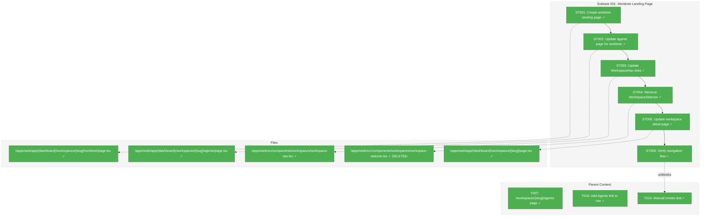
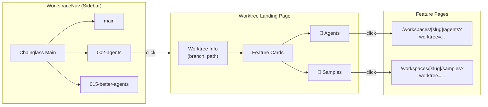

# Subtask 001: Worktree Landing Page & Agents Page Restructure

**Parent Plan:** [agents-workspace-data-model-plan.md](../../agents-workspace-data-model-plan.md)
**Parent Phase:** Phase 3: Web UI Integration
**Parent Task(s):** [T007: /workspaces/[slug]/agents page](../tasks.md#task-t007), [T010: Add Agents link to workspace nav](../tasks.md#task-t010)
**Plan Task Reference:** [Task 3.7 in Plan](../../agents-workspace-data-model-plan.md#phase-3-web-ui-integration-workspace-scoped-agents-page)

**Why This Subtask:**
During manual smoke testing (T014), discovered that worktree navigation is broken:
1. `WorkspaceNav` links worktrees directly to samples page, not a generic landing
2. Agents page doesn't properly scope by worktree (uses `?worktree=` param but no direct nav)
3. Need a worktree landing page that serves as hub for all worktree-scoped features

**Created:** 2026-01-28
**Requested By:** Development Team (smoke test findings)

---

## Executive Briefing

### Purpose
This subtask creates a worktree landing page that serves as the entry point for all worktree-scoped features (agents, samples, future features). It restructures navigation so users can browse worktrees and access their agents without navigating through multiple pages.

### What We're Building
1. **Worktree Landing Page** (`/workspaces/[slug]/worktree?worktree=...`):
   - Shows worktree metadata (branch name, path, isMainWorktree)
   - Card-based navigation to: Agents, Samples (extensible for future features)
   - Consistent with existing workspace detail page design

2. **Worktree-Scoped Agents Page** (update existing):
   - Explicitly requires `?worktree=` query param
   - Session list filtered to THIS worktree only
   - Creation form with type selector + name input
   - Redirect if `?worktree=` missing → worktree landing page

3. **Updated `WorkspaceNav`**:
   - Worktree links go to landing page (not samples)
   - Highlight active worktree based on current `?worktree=` param

### Unblocks
- T014: Manual smoke test (currently blocked - can't navigate to agents properly)
- Future: Agent interaction UI (needs proper worktree-scoped agents page first)

### Example
**Before (broken):**
- Click "002-agents" in nav → goes to samples page
- No way to reach agents for that worktree without editing URL

**After:**
- Click "002-agents" in nav → worktree landing page
- Landing page shows cards: "Agents (2 sessions)", "Samples (5 items)"
- Click Agents card → agents list page for that worktree

---

## Objectives & Scope

### Objective
Create a proper worktree landing page and restructure navigation so users can access worktree-scoped agents through the sidebar navigation.

### Goals

- ✅ Create worktree landing page at `/workspaces/[slug]/worktree?worktree=...`
- ✅ Update agents page to require explicit `?worktree=` param
- ✅ Update `WorkspaceNav` to link worktrees to landing page
- ✅ Remove incorrect `WorkspaceSelector` component (created during earlier fix attempt)
- ✅ Ensure agents creation form works on worktree-scoped page
- ✅ Verify navigation flow: Nav → Landing → Agents → Create/View

### Non-Goals

- ❌ Agent interaction/chat UI (separate future work)
- ❌ Migration of existing agent sessions (Phase 4)
- ❌ Multi-select or batch operations on sessions
- ❌ Session renaming or editing

---

## Architecture Map

### Component Diagram
<!-- Status: grey=pending, orange=in-progress, green=completed, red=blocked -->
<!-- Updated by plan-6 during implementation -->



### Task-to-Component Mapping

<!-- Status: ⬜ Pending | 🟧 In Progress | ✅ Complete | 🔴 Blocked -->

| Task | Component(s) | Files | Status | Comment |
|------|-------------|-------|--------|---------|
| ST001 | Worktree Landing | /apps/web/app/(dashboard)/workspaces/[slug]/worktree/page.tsx | ✅ Complete | New page showing worktree info + feature cards |
| ST002 | Agents Page | /apps/web/app/(dashboard)/workspaces/[slug]/agents/page.tsx | ✅ Complete | Update to require ?worktree= param |
| ST003 | WorkspaceNav | /apps/web/src/components/workspaces/workspace-nav.tsx | ✅ Complete | Change worktree links to landing page |
| ST004 | Cleanup | /apps/web/src/components/workspaces/workspace-selector.tsx | ✅ Complete | Delete incorrect component |
| ST005 | Workspace Detail | /apps/web/app/(dashboard)/workspaces/[slug]/page.tsx | ✅ Complete | Update worktree links to landing page |
| ST006 | Verification | Manual + Browser Automation | ✅ Complete | End-to-end navigation test |

---

## Tasks

| Status | ID | Task | CS | Type | Dependencies | Absolute Path(s) | Validation | Subtasks | Notes |
|--------|------|------|-----|------|--------------|------------------|------------|----------|-------|
| [x] | ST001 | Create worktree landing page with feature cards | 2 | Core | – | /home/jak/substrate/015-better-agents/apps/web/app/(dashboard)/workspaces/[slug]/worktree/page.tsx | Page renders with worktree info; shows Agents + Samples cards; `dynamic = 'force-dynamic'` | – | Follow samples page pattern for context resolution |
| [x] | ST002 | Update agents page to require ?worktree= param with redirect | 2 | Core | ST001 | /home/jak/substrate/015-better-agents/apps/web/app/(dashboard)/workspaces/[slug]/agents/page.tsx | Missing ?worktree= redirects to workspace detail (`/workspaces/[slug]`); creation form works; sessions filtered by worktree | – | Redirect to workspace detail shows all worktrees for easy selection |
| [x] | ST003 | Update WorkspaceNav to link worktrees to landing page | 1 | UI | ST001 | /home/jak/substrate/015-better-agents/apps/web/src/components/workspaces/workspace-nav.tsx | Clicking worktree goes to /workspaces/[slug]/worktree?worktree=...; active state works | – | Change buildWorktreeUrl + isWorktreeSelected to use generic query param check (pathname.startsWith + worktree param match) |
| [x] | ST004 | Remove WorkspaceSelector component (incorrect fix attempt) | 1 | Cleanup | ST003 | /home/jak/substrate/015-better-agents/apps/web/src/components/workspaces/workspace-selector.tsx, /home/jak/substrate/015-better-agents/apps/web/app/(dashboard)/workspaces/[slug]/agents/page.tsx | File deleted; no import errors; agents page header updated | – | Created during earlier debugging |
| [x] | ST005 | Update workspace detail page worktree links | 1 | UI | ST001 | /home/jak/substrate/015-better-agents/apps/web/app/(dashboard)/workspaces/[slug]/page.tsx | Worktree rows link to landing page (not direct to agents/samples) | – | Keep Agents/Samples quick links as secondary |
| [x] | ST006 | Verify navigation flow with browser automation | 1 | Verification | ST005 | – | Nav → Landing → Agents → Create session works; all links functional | – | Use Next.js MCP + browser automation |

---

## Alignment Brief

### Objective Recap

This subtask restructures worktree navigation to provide a proper landing page for worktree-scoped features. The current navigation goes directly to samples, making agents inaccessible without URL editing. After this subtask, users can navigate through the sidebar to any worktree and access both agents and samples.

**Parent Phase Goal**: Integrate agents into workspace navigation system
**This Subtask's Contribution**: Fix the navigation gap discovered during smoke testing

### Checklist (From Parent Acceptance Criteria)

- [x] ✅ Agents link visible in workspace navigation (AC from T010 - landing page provides this)
- [x] ✅ No regressions to existing agent features (verify creation form works)
- [x] ✅ Worktree context properly resolved for all pages

### Critical Findings Affecting This Subtask

| Finding | Constraint | Tasks Addressing |
|---------|-----------|------------------|
| **Discovery 04**: Next.js Dynamic Rendering | Landing page MUST have `export const dynamic = 'force-dynamic'` | ST001 |
| **Discovery 11**: Async Route Params | `await params` and `await searchParams` before access | ST001, ST002 |
| **DYK-02**: Worktree context via query param | Use `?worktree=` for worktree scoping (not path segment) | ST001, ST002, ST003 |

### ADR Decision Constraints

**ADR-0008: Workspace Split Storage Data Model**
- Decision: Per-worktree data at `<worktree>/.chainglass/data/<domain>/`
- Constraints: All domain pages must be worktree-aware; worktree path via `?worktree=` query param
- Addressed by: ST001, ST002 (both resolve WorkspaceContext from worktree param)

### Invariants & Guardrails

- **Worktree param required**: Agents page without `?worktree=` redirects to landing
- **Context resolution**: Use `workspaceService.resolveContextFromParams(slug, worktreePath)`
- **Consistent URLs**: All worktree-scoped pages use `?worktree=<encoded-path>` format

### Inputs to Read

| File | Purpose |
|------|---------|
| `/home/jak/substrate/015-better-agents/apps/web/app/(dashboard)/workspaces/[slug]/samples/page.tsx` | Pattern for worktree-scoped pages |
| `/home/jak/substrate/015-better-agents/apps/web/src/components/workspaces/workspace-nav.tsx` | Current nav implementation to modify |
| `/home/jak/substrate/015-better-agents/apps/web/app/(dashboard)/workspaces/[slug]/page.tsx` | Workspace detail page pattern |
| `/home/jak/substrate/015-better-agents/apps/web/app/(dashboard)/workspaces/[slug]/agents/page.tsx` | Current agents page to update |

### Visual Alignment Aids

#### Navigation Flow Diagram



#### URL Structure

```
/workspaces/chainglass-main                    # Workspace detail (lists worktrees)
/workspaces/chainglass-main/worktree?worktree=/path/to/002-agents    # Worktree landing
/workspaces/chainglass-main/agents?worktree=/path/to/002-agents      # Agents for worktree
/workspaces/chainglass-main/samples?worktree=/path/to/002-agents     # Samples for worktree
```

### Test Plan

**Manual Testing Approach** (per parent phase):
1. Start dev server with `just dev`
2. Navigate through sidebar to a worktree
3. Verify landing page shows correct info
4. Click Agents card → verify agents page loads with correct worktree
5. Create a new agent session → verify it appears in list
6. Navigate to samples → verify worktree context preserved

**Browser Automation Verification** (ST006):
- Use Next.js MCP to check for errors
- Use browser automation to verify DOM structure
- Confirm no console errors during navigation

### Implementation Outline

| Step | Task | Test/Verification |
|------|------|-------------------|
| 1 | Create worktree landing page (ST001) | Page renders, shows cards |
| 2 | Update agents page for worktree param (ST002) | Redirect works, sessions filtered |
| 3 | Update WorkspaceNav links (ST003) | Nav clicks go to landing |
| 4 | Remove WorkspaceSelector (ST004) | No import errors |
| 5 | Update workspace detail links (ST005) | Links point to landing |
| 6 | End-to-end verification (ST006) | Full flow works |

### Commands to Run

```bash
# During development
just dev                           # Start dev server

# After implementation
just fft                           # Fix, format, test

# Verification
# Use browser automation via Next.js MCP tools
```

### Risks & Unknowns

| Risk | Likelihood | Impact | Mitigation |
|------|------------|--------|------------|
| Breaking existing agents page | Low | High | Verify creation form still works |
| WorkspaceNav state management | Low | Medium | Test active state highlighting |
| Missing context on redirect | Low | Medium | Ensure worktree param preserved |

### Ready Check

Before implementing, verify:

- [x] Parent phase tasks T007, T010 complete (agents page exists)
- [x] Understand `?worktree=` query param pattern from samples page
- [x] Understand `resolveContextFromParams` for context resolution
- [x] **GO**: Implementation complete!

---

## Phase Footnote Stubs

_Populated by plan-6 during implementation._

| ID | Change | Task | Commit |
|----|--------|------|--------|
| | | | |

---

## Evidence Artifacts

- **Execution Log**: `001-subtask-worktree-landing-page.execution.log.md`
- **Artifacts Directory**: Store screenshots in `phase-3-web-ui-integration/artifacts/`

---

## Discoveries & Learnings

_Populated during implementation by plan-6. Log anything of interest to your future self._

| Date | Task | Type | Discovery | Resolution | References |
|------|------|------|-----------|------------|------------|
| | | | | | |

**Types**: `gotcha` | `research-needed` | `unexpected-behavior` | `workaround` | `decision` | `debt` | `insight`

---

## Critical Insights Discussion

**Session**: 2026-01-28 09:14 UTC
**Context**: Subtask 001 - Worktree Landing Page & Agents Page Restructure
**Analyst**: AI Clarity Agent
**Reviewer**: Development Team
**Format**: Water Cooler Conversation (5 Critical Insights)

### Insight 1: WorkspaceSelector Wrong Abstraction

**Did you know**: The WorkspaceSelector component selects between workspaces, but users need to switch between worktrees within the same workspace.

**Implications**:
- Current UI treats workspaces as primary navigation unit (wrong)
- Users can't compare agents across worktrees in same workspace
- Changing workspace loses all worktree context

**Options Considered**:
- Option A: Delete WorkspaceSelector entirely - navigation via sidebar
- Option B: Replace with WorktreeSelector - dropdown for worktrees
- Option C: Enhanced breadcrumb navigation

**AI Recommendation**: Option A - Delete WorkspaceSelector
- Reasoning: Simpler, consistent with sidebar-first navigation model

**Discussion Summary**: User confirmed the central agents page is being removed; only workspace-scoped agents page exists. Sidebar provides all navigation needed.

**Decision**: Delete WorkspaceSelector as planned in ST004

**Action Items**: None - ST004 already covers this

**Affects**: ST004 task (confirmed correct)

---

### Insight 2: Direct Links Fragility

**Did you know**: If someone shares a direct URL to agents page and the `?worktree=` param gets stripped, the plan originally redirected to landing page with no context about which worktree was intended.

**Implications**:
- Shared links become fragile
- Error case provides no guidance
- User has to guess which worktree was intended

**Options Considered**:
- Option A: Redirect to landing (loses context)
- Option B: Redirect to workspace detail (shows all worktrees)
- Option C: Default to main worktree (silent failure)
- Option D: Show error on agents page with worktree list

**AI Recommendation**: Option B - Redirect to Workspace Detail
- Reasoning: User sees all worktrees and can pick the right one

**Discussion Summary**: User chose Option B for clear recovery path.

**Decision**: Redirect to workspace detail page (`/workspaces/[slug]`) when `?worktree=` missing

**Action Items**: None - ST002 updated

**Affects**: ST002 task - updated redirect target

---

### Insight 3: Landing Page Value Question

**Did you know**: With redirect to workspace detail, the landing page might add unnecessary clicks since workspace detail already has Agents/Samples links per worktree.

**Implications**:
- Landing page could duplicate functionality
- Extra click to reach destination
- But provides room for future worktree-specific features

**Options Considered**:
- Option A: Keep landing page (future extensibility)
- Option B: Skip landing - direct to feature
- Option C: Enhance workspace detail instead

**AI Recommendation**: Option A - Keep Landing Page
- Reasoning: Future extensibility, clear mental model, room for growth

**Discussion Summary**: User confirmed keep it simple, don't over-engineer. UI tidy up later.

**Decision**: Keep landing page as planned

**Action Items**: None

**Affects**: No changes

---

### Insight 4: isWorktreeSelected Will Break

**Did you know**: The `isWorktreeSelected()` function only checks for `/samples` path, so after navigation changes, worktree highlighting will stop working on landing page and agents page.

**Implications**:
- Worktree won't highlight on landing page
- Worktree won't highlight on agents page
- Only highlights on samples (old behavior)

**Options Considered**:
- Option A: Check multiple paths (hardcoded list)
- Option B: Check just query param (generic)

**AI Recommendation**: Option B - Check Query Param Only
- Reasoning: Works automatically for any future worktree-scoped page

**Discussion Summary**: User confirmed generic approach - "we will be adding lots of these"

**Decision**: Use generic `pathname.startsWith` + worktree param check

**Action Items**: None - ST003 updated

**Affects**: ST003 task - updated notes with implementation approach

---

### Insight 5: Task Order Risk

**Did you know**: Current task order means building landing page (ST001) and agents update (ST002) before navigation works (ST003), requiring manual URL testing for first 2 tasks.

**Implications**:
- 2 tasks of "blind" development
- If design is wrong, discovered late
- Harder to iterate on UX

**Options Considered**:
- Option A: Keep current order (build before link)
- Option B: Reorder to nav-first (temporary 404)

**AI Recommendation**: Option A - Keep Current Order
- Reasoning: Tasks are small (CS-1/CS-2), manual URL testing during dev is normal

**Discussion Summary**: User agreed to keep current order.

**Decision**: Keep task order as-is

**Action Items**: None

**Affects**: No changes

---

## Session Summary

**Insights Surfaced**: 5 critical insights identified and discussed
**Decisions Made**: 5 decisions reached
**Action Items Created**: 0 (all covered by existing tasks)
**Areas Updated**:
- ST002: Redirect target changed to workspace detail
- ST003: Added generic isWorktreeSelected implementation note

**Shared Understanding Achieved**: ✓

**Confidence Level**: High - Plan is solid, key edge cases addressed

**Next Steps**: Proceed to implementation with `go` command

**Notes**: User preference for simplicity confirmed - no over-engineering, UI tidy up later

**What to log**:
- Things that didn't work as expected
- External research that was required
- Implementation troubles and how they were resolved
- Gotchas and edge cases discovered
- Decisions made during implementation
- Technical debt introduced (and why)
- Insights that future phases should know about

_See also: `execution.log.md` for detailed narrative._

---

## After Subtask Completion

**This subtask resolves a blocker for:**
- Parent Task: [T014: Manual smoke test](../tasks.md#task-t014)
- Plan Task: [3.14 in Plan](../../agents-workspace-data-model-plan.md#phase-3-web-ui-integration-workspace-scoped-agents-page)

**When all ST### tasks complete:**

1. **Record completion** in parent execution log:
   ```
   ### Subtask 001-subtask-worktree-landing-page Complete

   Resolved: Created worktree landing page, fixed navigation, agents now accessible via sidebar
   See detailed log: [subtask execution log](./001-subtask-worktree-landing-page.execution.log.md)
   ```

2. **Update parent task** (if it was blocked):
   - Open: [`tasks.md`](../tasks.md)
   - Find: T014
   - Update Status: `[ ]` → can now proceed
   - Update Notes: Add "Subtask 001-subtask-worktree-landing-page complete"

3. **Resume parent phase work:**
   ```bash
   /plan-6-implement-phase --phase "Phase 3: Web UI Integration" \
     --plan "/home/jak/substrate/015-better-agents/docs/plans/018-agents-workspace-data-model/agents-workspace-data-model-plan.md"
   ```
   (Note: NO `--subtask` flag to resume main phase)

**Quick Links:**
- 📋 [Parent Dossier](../tasks.md)
- 📄 [Parent Plan](../../agents-workspace-data-model-plan.md)
- 📊 [Parent Execution Log](../execution.log.md)

---

## Directory Structure After Subtask

```
docs/plans/018-agents-workspace-data-model/tasks/phase-3-web-ui-integration/
├── tasks.md                                           # Parent dossier
├── execution.log.md                                   # Parent execution log
├── 001-subtask-worktree-landing-page.md              # This subtask dossier
├── 001-subtask-worktree-landing-page.execution.log.md # Subtask execution log (created by plan-6)
└── artifacts/                                         # Screenshots, evidence
```
