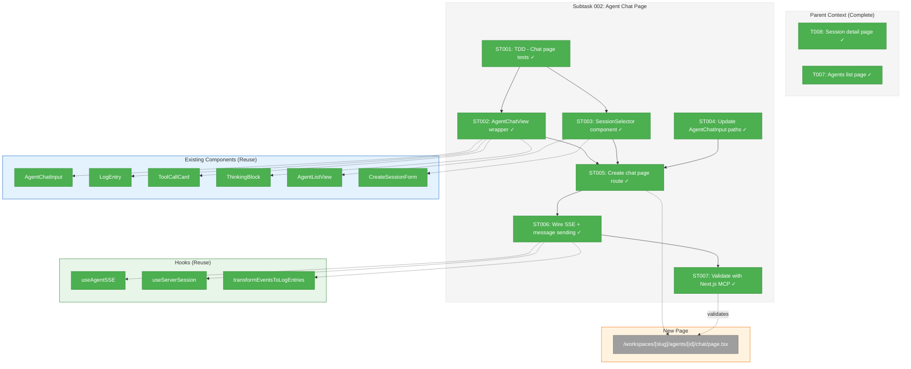
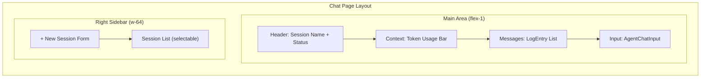
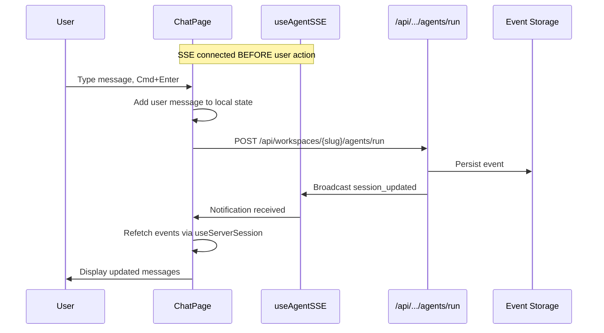

# Subtask 002: Agent Chat Page with Session Selector

**Parent Plan:** [agents-workspace-data-model-plan.md](../../agents-workspace-data-model-plan.md)
**Parent Phase:** Phase 3: Web UI Integration
**Parent Task(s):** [T008: /workspaces/[slug]/agents/[id] page](./tasks.md#task-t008)
**Plan Task Reference:** [Task 3.8 in Plan](../../agents-workspace-data-model-plan.md#phase-3-web-ui-integration-workspace-scoped-agents-page)

**Why This Subtask:**
The current session detail page (`/workspaces/[slug]/agents/[id]`) only displays raw JSON events. Users cannot interact with agents (send messages, see streaming responses) or switch between agents without navigating back to the list. The original chat functionality (backed up at `page.tsx.bak`) needs to be restored in a workspace-scoped form with a session selector menu.

**Created:** 2026-01-28
**Requested By:** User request - restore agent chat interaction capability

---

## Executive Briefing

### Purpose
This subtask restores the full agent chat experience on workspace-scoped pages. Users can send messages to agents, see real-time streaming responses (tool calls, thinking blocks, text), and switch between agents in the same workspace using a sidebar selector—all without leaving the page.

### What We're Building
A dedicated chat page at `/workspaces/[slug]/agents/[id]/chat` with:
- **Chat Interface**: Message input with Cmd/Ctrl+Enter, streaming response display
- **Session Selector**: Right sidebar listing all agents in the current workspace for quick switching
- **Create Agent**: Inline form to create new agent sessions without navigation
- **Event Rendering**: Tool call cards, thinking blocks, and text messages using existing components
- **SSE Integration**: Real-time updates via `useAgentSSE` and `useServerSession` hooks

### Unblocks
- Restores full agent interaction capability removed during Plan 018 workspace migration
- Enables users to chat with agents scoped to their worktree

### Example
**Before (current):** Session detail shows raw JSON events:
```json
[{"type":"tool_call","data":{"toolName":"Bash",...}}]
```

**After:** Full chat interface:
```
┌─────────────────────────────────────┬──────────────────┐
│ Chat with agent-session-abc123      │ Session Selector │
│─────────────────────────────────────│──────────────────│
│ [User]: What files are in src/?     │ + New Session    │
│                                     │ ─────────────────│
│ [Agent]: Running Bash: ls src/...   │ ▸ session-abc123 │
│ ┌─────────────────────────────────┐ │   session-def456 │
│ │ 🔧 Bash (running)               │ │   session-ghi789 │
│ │ $ ls src/                       │ │                  │
│ └─────────────────────────────────┘ │                  │
│                                     │                  │
│ [Input: Send a message... ⌘+Enter]  │                  │
└─────────────────────────────────────┴──────────────────┘
```

---

## Objectives & Scope

### Objective
Create a dedicated agent chat page that restores the interactive agent experience (from `page.tsx.bak`) in a workspace-scoped form, with a session selector for switching between agents.

### Goals

- ✅ Create `/workspaces/[slug]/agents/[id]/chat` page with full chat interface
- ✅ Implement session selector sidebar showing all agents in current worktree
- ✅ Integrate `AgentChatInput` for message submission
- ✅ Render events using `LogEntry`, `ToolCallCard`, `ThinkingBlock` components
- ✅ Wire up SSE via `useAgentSSE` for real-time streaming
- ✅ Add inline session creation form (reuse `CreateSessionForm`)
- ✅ Ensure all components work with workspace-scoped API paths
- ✅ Write headless TDD tests before UI implementation
- ✅ Validate with Next.js MCP server

### Non-Goals

- ❌ Session archiving/soft-delete (already implemented as hard delete)
- ❌ Multi-agent parallel chat (one active agent at a time)
- ❌ Mobile-optimized layout (desktop-first for MVP)
- ❌ Message editing or deletion (send-only)
- ❌ Virtualized message list (defer unless performance issues)

---

## Architecture Map

### Component Diagram
<!-- Status: grey=pending, orange=in-progress, green=completed, red=blocked -->
<!-- Updated by plan-6 during implementation -->



### Task-to-Component Mapping

<!-- Status: ⬜ Pending | 🟧 In Progress | ✅ Complete | 🔴 Blocked -->

| Task | Component(s) | Files | Status | Comment |
|------|-------------|-------|--------|---------|
| ST001 | Tests | /test/unit/web/app/agents/chat-page.test.tsx | ✅ Complete | TDD: Write tests first |
| ST002 | AgentChatView | /apps/web/src/components/agents/agent-chat-view.tsx | ✅ Complete | Client wrapper for chat UI |
| ST003 | SessionSelector | /apps/web/src/components/agents/session-selector.tsx | ✅ Complete | Right sidebar with session list |
| ST004 | AgentChatInput | /apps/web/src/components/agents/agent-chat-input.tsx | ✅ Complete | Verify paths, may need updates |
| ST005 | Chat Page | /apps/web/app/(dashboard)/workspaces/[slug]/agents/[id]/page.tsx | ✅ Complete | Replace existing detail page with chat UI |
| ST006 | SSE Integration | Multiple hooks | ✅ Complete | Wire useAgentSSE + message sending |
| ST007 | Validation | Browser automation | ✅ Complete | Next.js MCP verification |

---

## Tasks

| Status | ID | Task | CS | Type | Dependencies | Absolute Path(s) | Validation | Subtasks | Notes |
|--------|------|------|-----|------|--------------|------------------|------------|----------|-------|
| [x] | ST001 | Write TDD tests for chat page components | 2 | Test | – | /home/jak/substrate/015-better-agents/test/unit/web/app/agents/chat-page.test.tsx, /home/jak/substrate/015-better-agents/test/unit/web/components/agents/session-selector.test.tsx | Tests exist and initially fail (RED) | – | Per Testing Philosophy: TDD headless first |
| [x] | ST002 | Create AgentChatView client component wrapper | 3 | Core | ST001 | /home/jak/substrate/015-better-agents/apps/web/src/components/agents/agent-chat-view.tsx | Component renders chat UI, passes tests (GREEN) | – | Combines LogEntry, ToolCallCard, ThinkingBlock |
| [x] | ST003 | Create SessionSelector component with create form | 2 | Core | ST001 | /home/jak/substrate/015-better-agents/apps/web/src/components/agents/session-selector.tsx | Lists sessions, allows selection, inline create | – | Reuses AgentListView pattern + CreateSessionForm |
| [x] | ST004 | Verify/update AgentChatInput for workspace paths | 1 | Fix | – | /home/jak/substrate/015-better-agents/apps/web/src/components/agents/agent-chat-input.tsx | Component works with workspace-scoped API | – | May need no changes if props-driven |
| [x] | ST005 | Replace detail page with chat page | 2 | Core | ST002, ST003, ST004 | /home/jak/substrate/015-better-agents/apps/web/app/(dashboard)/workspaces/[slug]/agents/[id]/page.tsx | Page renders chat UI; `dynamic = 'force-dynamic'`; raw events in collapsible section | – | Replace existing JSON view with AgentChatView |
| [x] | ST006 | Wire SSE streaming + message sending to API | 3 | Core | ST005 | /home/jak/substrate/015-better-agents/apps/web/src/components/agents/agent-chat-view.tsx | Messages send via POST /api/workspaces/[slug]/agents/run; SSE updates display | – | Pattern from page.tsx.bak lines 324-416 |
| [x] | ST007 | Validate full flow with Next.js MCP + browser | 1 | Verification | ST006 | – | Create session → send message → see response → switch session works | – | Use browser automation for E2E |

---

## Alignment Brief

### Objective Recap

This subtask restores the full agent chat experience that was removed during the Plan 018 workspace migration. The original `/agents` page (now backed up) had a complete chat interface with:
- Session sidebar with selection
- Message input with streaming responses
- Tool call and thinking block rendering
- SSE-based real-time updates

The new implementation must work with the workspace-scoped architecture established in Phase 3 while reusing as many existing components as possible.

### Checklist (From Parent Acceptance Criteria)

- [ ] ✅ Agent chat restores interactive experience from page.tsx.bak
- [ ] ✅ Session selector allows switching agents without navigation
- [ ] ✅ Create agent form works inline (no separate page needed)
- [ ] ✅ SSE streaming displays tool calls, thinking, text in real-time
- [ ] ✅ No regressions to existing agent features (from T008)
- [ ] ✅ Works with workspace-scoped API paths

### Critical Findings Affecting This Subtask

| Finding | Constraint | Tasks Addressing |
|---------|-----------|------------------|
| **Discovery 04**: Next.js Dynamic Rendering | Page MUST have `export const dynamic = 'force-dynamic'` for DI access | ST005 |
| **Discovery 11**: Async Route Params | `await params` before use (Next.js 16+) | ST005 |
| **DYK-01**: Connect-First SSE Pattern | SSE hook must mount BEFORE API call to avoid missing events | ST006 |
| **DYK-04**: Workspace SSE URLs | Use `/api/workspaces/${slug}/agents/events` for SSE | ST006 |
| **DYK-P5-02**: Event Transformation | Use `transformEventsToLogEntries()` for event→UI mapping | ST002 |

### ADR Decision Constraints

**ADR-0007: SSE Architecture**
- Decision: Single global `agents` channel for all agent events
- Constraint: Continue using existing SSE pattern, don't create per-session channels
- Addressed by: ST006

**ADR-0008: Workspace Split Storage**
- Decision: Per-worktree data at `<worktree>/.chainglass/data/<domain>/`
- Constraint: All API calls must include workspace slug and worktree path
- Addressed by: ST005, ST006

### Invariants & Guardrails

From parent phase + new constraints:

1. **Worktree Context Required**: Chat page requires `?worktree=` param (redirect if missing)
2. **Server Component Wrapper**: Page must be server component; chat UI is client component
3. **No localStorage**: Session state comes from server, not localStorage
4. **SSE Before API**: Mount SSE hook before calling `/agents/run` endpoint
5. **Reuse Components**: Prefer updating existing components over creating new ones

### Inputs to Read

| File | Purpose |
|------|---------|
| `/home/jak/substrate/015-better-agents/apps/web/app/(dashboard)/agents/page.tsx.bak` | Original chat implementation (555 lines) |
| `/home/jak/substrate/015-better-agents/apps/web/src/components/agents/agent-chat-input.tsx` | Input component to reuse |
| `/home/jak/substrate/015-better-agents/apps/web/src/components/agents/log-entry.tsx` | Message rendering component |
| `/home/jak/substrate/015-better-agents/apps/web/src/hooks/useAgentSSE.ts` | SSE subscription hook |
| `/home/jak/substrate/015-better-agents/apps/web/src/hooks/useServerSession.ts` | Server-backed session state |
| `/home/jak/substrate/015-better-agents/apps/web/src/lib/transformers/stored-event-to-log-entry.ts` | Event transformation |

### Visual Alignment Aids

#### Page Layout Diagram



#### Message Flow Sequence



### Test Plan

**Testing Approach**: Full TDD (headless first, browser validation last)

**ST001 - Unit Tests (Write First)**:
```typescript
// test/unit/web/components/agents/session-selector.test.tsx
describe('SessionSelector', () => {
  it('renders session list from props');
  it('highlights active session');
  it('calls onSelect when session clicked');
  it('renders create form');
  it('calls onCreate with form data');
});

// test/unit/web/app/agents/chat-page.test.tsx
describe('AgentChatView', () => {
  it('renders messages from events');
  it('transforms events using transformEventsToLogEntries');
  it('renders streaming content');
  it('calls onSendMessage with input');
  it('shows error state');
});
```

**ST007 - Browser Validation**:
1. Navigate to `/workspaces/{slug}/agents/{id}/chat?worktree=...`
2. Verify chat UI renders
3. Create new session via sidebar
4. Send message, verify SSE streaming
5. Switch sessions via selector

### Implementation Outline

| Step | Task | Test/Verification |
|------|------|-------------------|
| 1 | Write failing tests (ST001) | Tests exist, all RED |
| 2 | Create AgentChatView (ST002) | Chat UI tests pass |
| 3 | Create SessionSelector (ST003) | Selector tests pass |
| 4 | Verify AgentChatInput (ST004) | Input works with paths |
| 5 | Create page route (ST005) | Page renders |
| 6 | Wire SSE + API (ST006) | Messages send/receive |
| 7 | Browser validation (ST007) | Full flow works |

### Commands to Run

```bash
# During development
just dev                           # Start dev server

# TDD cycle
pnpm test test/unit/web/components/agents/session-selector.test.tsx --watch
pnpm test test/unit/web/app/agents/chat-page.test.tsx --watch

# After implementation
just fft                           # Fix, format, test

# Verification
# Use Next.js MCP + browser automation
```

### Risks & Unknowns

| Risk | Likelihood | Impact | Mitigation |
|------|------------|--------|------------|
| SSE event format changed | Low | High | Compare with page.tsx.bak patterns |
| Component props incompatible | Medium | Medium | Review all component interfaces first |
| Worktree context not propagating | Low | High | Test with multiple worktrees |
| Performance with many messages | Low | Medium | Defer virtualization to future |

### Ready Check

Before implementing, verify:

- [x] Parent phase T008 complete (session detail page exists)
- [x] Understand workspace-scoped API patterns from Phase 3
- [x] Reviewed page.tsx.bak for chat implementation patterns
- [x] Identified all components to reuse
- [x] Understand SSE hook patterns (DYK-01, DYK-04)
- [ ] **GO**: Start implementation with ST001

---

## Phase Footnote Stubs

_Populated by plan-6 during implementation._

| ID | Change | Task | Commit |
|----|--------|------|--------|
| | | | |

---

## Evidence Artifacts

- **Execution Log**: `002-subtask-agent-chat-page.execution.log.md`
- **Test Files**: 
  - `test/unit/web/components/agents/session-selector.test.tsx`
  - `test/unit/web/app/agents/chat-page.test.tsx`
- **Artifacts Directory**: Store screenshots in `phase-3-web-ui-integration/artifacts/`

---

## Discoveries & Learnings

_Populated during implementation by plan-6. Log anything of interest to your future self._

| Date | Task | Type | Discovery | Resolution | References |
|------|------|------|-----------|------------|------------|
| | | | | | |

**Types**: `gotcha` | `research-needed` | `unexpected-behavior` | `workaround` | `decision` | `debt` | `insight`

**What to log**:
- Things that didn't work as expected
- External research that was required
- Implementation troubles and how they were resolved
- Gotchas and edge cases discovered
- Decisions made during implementation
- Technical debt introduced (and why)
- Insights that future phases should know about

_See also: `execution.log.md` for detailed narrative._

---

## After Subtask Completion

**This subtask resolves a blocker for:**
- Restoring agent chat interaction capability
- User request to re-introduce the agent page

**When all ST### tasks complete:**

1. **Record completion** in parent execution log:
   ```
   ### Subtask 002-subtask-agent-chat-page Complete

   Resolved: Created dedicated chat page with session selector, restored full agent interaction capability
   See detailed log: [subtask execution log](./002-subtask-agent-chat-page.execution.log.md)
   ```

2. **Update parent task** (if applicable):
   - Open: [`tasks.md`](./tasks.md)
   - No blocked tasks - this adds new functionality

3. **Add link from session detail page**:
   - Update `/workspaces/[slug]/agents/[id]/page.tsx` to link to `/chat`

4. **Resume parent phase work (if needed):**
   ```bash
   /plan-6-implement-phase --phase "Phase 3: Web UI Integration" \
     --plan "/home/jak/substrate/015-better-agents/docs/plans/018-agents-workspace-data-model/agents-workspace-data-model-plan.md"
   ```
   (Note: NO `--subtask` flag to resume main phase)

**Quick Links:**
- 📋 [Parent Dossier](./tasks.md)
- 📄 [Parent Plan](../../agents-workspace-data-model-plan.md)
- 📊 [Parent Execution Log](./execution.log.md)

---

## Directory Structure After Subtask

```
docs/plans/018-agents-workspace-data-model/tasks/phase-3-web-ui-integration/
├── tasks.md                                           # Parent dossier
├── execution.log.md                                   # Parent execution log
├── 001-subtask-worktree-landing-page.md              # Prior subtask (complete)
├── 001-subtask-worktree-landing-page.execution.log.md
├── 002-subtask-agent-chat-page.md                    # THIS subtask dossier
├── 002-subtask-agent-chat-page.execution.log.md      # Created by plan-6
└── artifacts/                                         # Screenshots, evidence
```

---

## Critical Insights Discussion

**Session**: 2026-01-28 10:44 UTC
**Context**: Subtask 002 Agent Chat Page Dossier - Pre-implementation clarity
**Analyst**: AI Clarity Agent
**Reviewer**: Development Team
**Format**: Water Cooler Conversation (5 Critical Insights)

### Insight 1: SSE Channel Strategy

**Did you know**: The backup uses a single global SSE channel (`agents`) but the new workspace-scoped API allows client-controlled channel names, creating potential cross-session event leakage.

**Implications**:
- Multiple users on same worktree could receive each other's events
- SessionId filtering in UI handles this naturally
- Single connection is simpler than per-session channels

**Options Considered**:
- Option A: Keep Global Channel - single `agents` channel, filter by sessionId
- Option B: Per-Session Channel - one EventSource per session
- Option C: Per-Workspace Channel - scoped to workspace

**AI Recommendation**: Option A - Keep Global Channel
- Reasoning: Proven pattern from backup, sessionId filtering handles isolation, simpler single connection.

**Discussion Summary**: User confirmed this is one agent management system managing agents that store files in different places. Global channel with sessionId filtering is sufficient.

**Decision**: Keep global `agents` channel (matches backup pattern)

**Action Items**: None - confirms existing approach

**Affects**: ST006 (SSE wiring)

---

### Insight 2: Dual Page Problem

**Did you know**: ST005 was creating a NEW `/chat` route, but `/workspaces/[slug]/agents/[id]/page.tsx` already exists showing raw JSON events - resulting in two pages for the same session.

**Implications**:
- User confusion about which URL to use
- Two pages to maintain for same session
- Links from session list go to detail page, not chat

**Options Considered**:
- Option A: Keep Both Pages - raw for debugging, chat for interaction
- Option B: Replace Detail Page - single page with chat UI, raw events in collapsible section
- Option C: Redirect Detail to Chat - keep both files, add redirect

**AI Recommendation**: Option B - Replace Detail Page
- Reasoning: Single source of truth, no URL confusion, raw events can be a collapsible toggle.

**Discussion Summary**: User chose Option B. Verified the current detail page shows raw JSON in `<pre>` tags with `JSON.stringify()`.

**Decision**: Replace existing detail page with chat UI; add collapsible raw events section

**Action Items**: 
- [x] Update ST005 file path to existing page.tsx (not new /chat route)

**Affects**: ST005 task definition, architecture diagram

---

### Insight 3: localStorage vs Server Storage

**Did you know**: The backup creates sessions client-side with `generateSessionId()` and persists to localStorage, but the new architecture expects server-side session creation at `<worktree>/.chainglass/data/agents/`.

**Implications**:
- Can't copy backup's client-side session creation pattern
- CreateSessionForm must POST to server first
- Session list comes from server API, not localStorage

**Options Considered**:
- Option A: Server-First Creation - POST to API, then update local state
- Option B: Optimistic Creation - create locally, sync to server async with rollback

**AI Recommendation**: Option A - Server-First Creation
- Reasoning: 50-100ms delay is negligible, simpler, guarantees consistency with server storage.

**Discussion Summary**: User chose Option A. Server is source of truth, no need for optimistic complexity.

**Decision**: Server-first session creation via POST API

**Action Items**: None - clarifies implementation approach for ST003

**Affects**: ST003 (SessionSelector/CreateSessionForm implementation)

---

### Insight 4: Session Switching UX

**Did you know**: The detail page needs to fetch both the current session AND all sessions for the sidebar selector, and when switching sessions we need to decide between URL navigation (page reload) vs client-side switching (faster but complex state).

**Implications**:
- Two server fetches needed on page load (session + session list)
- URL navigation gives back button support and shareable links
- Client-side switching is faster but URL doesn't reflect state

**Options Considered**:
- Option A: URL Navigation - `router.push()` to new session URL, page reloads
- Option B: Client-Side Switching - keep URL, fetch new session via API

**AI Recommendation**: Option A - URL Navigation
- Reasoning: URL is source of truth, browser back works, 200-500ms reload acceptable for MVP.

**Discussion Summary**: User chose Option A. URL-based navigation is simpler and provides better UX guarantees.

**Decision**: Session switching via URL navigation (`router.push()`)

**Action Items**: None - clarifies implementation approach

**Affects**: ST003 (SessionSelector click handler)

---

### Insight 5: TDD Chicken-and-Egg

**Did you know**: ST001 wants to write tests first, but the component interfaces (props, callbacks) for `AgentChatView` and `SessionSelector` don't exist yet - classic TDD challenge.

**Implications**:
- Need to know component props before writing tests
- Backup provides existing patterns (AgentListView, etc.) we can copy
- Interface-first design adds overhead

**Options Considered**:
- Option A: Interface-First TDD - define types in .types.ts, write tests, implement
- Option B: Test-As-You-Go - write stubs, tests, implement iteratively
- Option C: Copy Backup Interfaces - use existing component patterns as design doc

**AI Recommendation**: Option C - Copy Backup Interfaces
- Reasoning: Proven patterns, fastest path, already reusing AgentListView and CreateSessionForm.

**Discussion Summary**: User chose Option C. The backup's interfaces are battle-tested and serve as the design doc.

**Decision**: Use backup component interfaces as TDD design template

**Action Items**: ST001 tests reference AgentListView props pattern

**Affects**: ST001 (test design approach)

---

## Session Summary

**Insights Surfaced**: 5 critical insights identified and discussed
**Decisions Made**: 5 decisions reached through collaborative discussion
**Action Items Created**: 1 (ST005 path update - completed)
**Areas Updated**: ST005 task definition in this dossier

**Shared Understanding Achieved**: ✓

**Confidence Level**: High - All architectural questions resolved, clear implementation path.

**Next Steps**: Run `/plan-6-implement-phase` to begin implementation with ST001

**Notes**:
- Key pattern: Global SSE channel, URL-based navigation, server-first storage
- Backup (`page.tsx.bak`) serves as primary reference for component interfaces
- Detail page replacement (not new route) simplifies architecture
