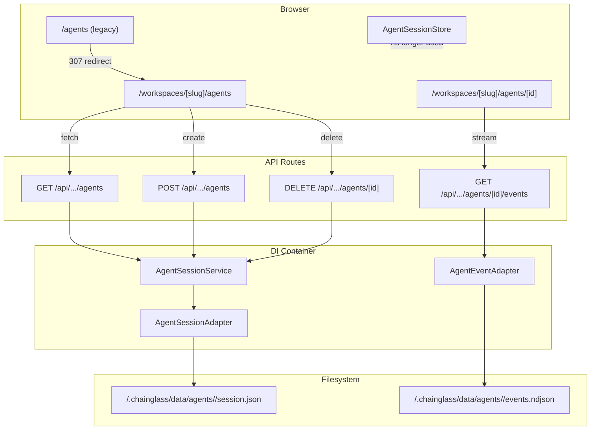
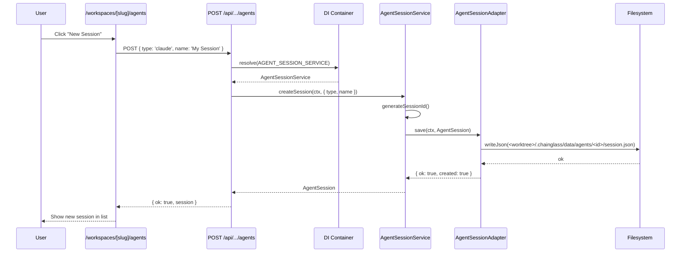
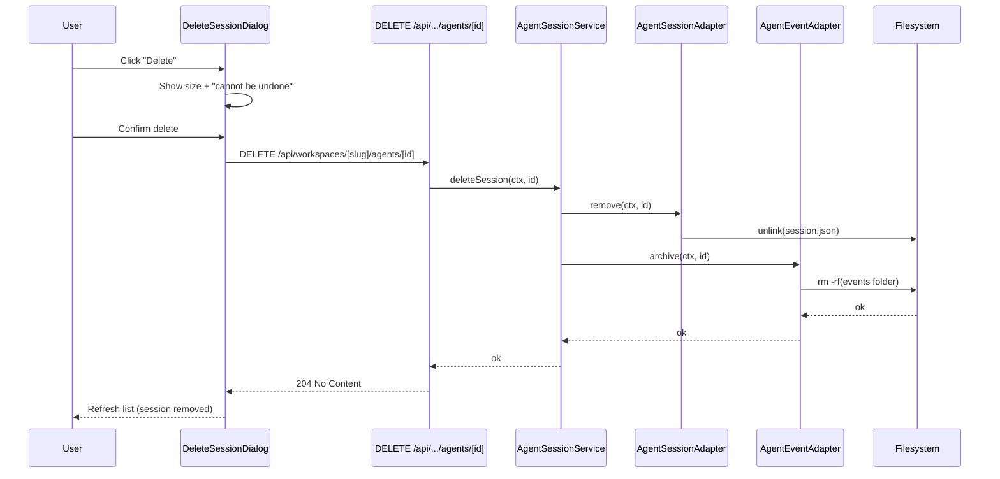

# Phase 3: Web UI Integration (Workspace-Scoped Agents Page) – Tasks & Alignment Brief

**Spec**: [agents-workspace-data-model-spec.md](../../agents-workspace-data-model-spec.md)
**Plan**: [agents-workspace-data-model-plan.md](../../agents-workspace-data-model-plan.md)
**Date**: 2026-01-28

---

## Executive Briefing

### Purpose
This phase integrates agent sessions into the workspace navigation system, enabling users to view and manage agents scoped to their selected workspace. It replaces localStorage-based session management with server-side persistence, completing the data model migration established in Phases 1-2.

### What We're Building
A workspace-aware agents experience with:
- **API Routes**: `GET/POST/DELETE /api/workspaces/[slug]/agents/...` for CRUD operations
- **Web Pages**: `/workspaces/[slug]/agents` for session list and `/workspaces/[slug]/agents/[id]` for detail view
- **Legacy Redirect**: `/agents` → `/workspaces/[first-slug]/agents` with 307 + deprecation warning
- **Server-Side Sessions**: Replace AgentSessionStore's localStorage with server API calls
- **Delete Confirmation**: Hard delete dialog showing session size with "cannot be undone" warning
- **DI Integration**: Wire AgentSessionAdapter, AgentSessionService, AgentEventAdapter into web container

### User Value
Users can:
- View agent sessions scoped to their current project/workspace
- Switch workspaces to see different agent session histories
- Delete sessions with clear confirmation of permanent data loss
- Refresh browser and see sessions persisted server-side (no localStorage dependency)

### Example
**Before**: `/agents` page reads sessions from `localStorage['agent-sessions']`
**After**: `/workspaces/my-project/agents` fetches from `GET /api/workspaces/my-project/agents` which reads from `<worktree>/.chainglass/data/agents/`

---

## Objectives & Scope

### Objective
Implement workspace-scoped agent pages and API routes per Plan Phase 3, replacing localStorage with server-side session storage and integrating with the workspace navigation system.

**Behavior Checklist** (from plan acceptance criteria):
- [ ] API routes use `export const dynamic = 'force-dynamic'` (AC-related)
- [ ] Route params awaited before use (Next.js 16+ compatibility)
- [ ] AgentSessionStore no longer uses localStorage
- [ ] Delete flow shows confirmation dialog with size
- [ ] `/agents` redirects to `/workspaces/[first-slug]/agents` with 307
- [ ] Agents link visible in workspace navigation
- [ ] No regressions to existing agent features (SSE, tool call cards)

### Goals

- ✅ Register agent adapters/services in web DI container with `useFactory` pattern
- ✅ Create workspace-scoped API routes (GET/POST/DELETE) for agent sessions
- ✅ Create workspace-scoped API route for agent events
- ✅ Refactor AgentSessionStore to use server API (remove localStorage)
- ✅ Create `/workspaces/[slug]/agents` page with session list
- ✅ Create `/workspaces/[slug]/agents/[id]` detail page with event stream
- ✅ Implement `/agents` → first workspace redirect with deprecation warning
- ✅ Add "Agents" link to workspace detail page navigation
- ✅ Create delete confirmation dialog with session size display
- ✅ Write E2E test for full agent CRUD flow

### Non-Goals (Scope Boundaries)

- ❌ Migration of existing localStorage sessions (Phase 4)
- ❌ CLI agent commands (future plan, not this phase)
- ❌ Agent creation from workspace page (use existing `/agents` creation flow redirected)
- ❌ Real-time multi-user sync (git handles collaboration, not WebSocket)
- ❌ Session archiving/soft-delete (hard delete per AC-14 and Clarification Q7)
- ❌ Batch delete (single session delete only)
- ❌ Session renaming (not in scope for initial integration)

---

## Architecture Map

### Component Diagram

```mermaid
flowchart TD
    classDef pending fill:#9E9E9E,stroke:#757575,color:#fff
    classDef inprogress fill:#FF9800,stroke:#F57C00,color:#fff
    classDef completed fill:#4CAF50,stroke:#388E3C,color:#fff
    classDef blocked fill:#F44336,stroke:#D32F2F,color:#fff

    style DI fill:#E3F2FD,stroke:#1565C0
    style APIRoutes fill:#E8F5E9,stroke:#2E7D32
    style WebPages fill:#FFF3E0,stroke:#EF6C00
    style Components fill:#F3E5F5,stroke:#7B1FA2
    style Store fill:#FFEBEE,stroke:#C62828

    subgraph DI["DI Container Integration"]
        T001["T001: Register adapters in web DI"]:::pending
    end

    subgraph APIRoutes["API Routes"]
        T002["T002: GET /api/workspaces/[slug]/agents"]:::pending
        T003["T003: POST /api/workspaces/[slug]/agents"]:::pending
        T004["T004: DELETE /api/workspaces/[slug]/agents/[id]"]:::pending
        T005["T005: GET /api/workspaces/[slug]/agents/[id]/events"]:::pending
    end

    subgraph Store["Session Store"]
        T006["T006: Refactor AgentSessionStore"]:::pending
    end

    subgraph WebPages["Web Pages"]
        T007["T007: /workspaces/[slug]/agents page"]:::pending
        T008["T008: /workspaces/[slug]/agents/[id] page"]:::pending
        T009["T009: /agents redirect page"]:::pending
    end

    subgraph Components["UI Components"]
        T010["T010: Add Agents link to workspace nav"]:::pending
        T011["T011: Delete confirmation dialog"]:::pending
        T012["T012: Wire delete button to dialog"]:::pending
    end

    subgraph Testing["Testing & Verification"]
        T013["T013: E2E agent workspace flow"]:::pending
        T014["T014: Manual smoke test"]:::pending
    end

    T001 --> T002
    T001 --> T003
    T001 --> T004
    T001 --> T005
    T002 --> T006
    T003 --> T006
    T006 --> T007
    T005 --> T008
    T007 --> T009
    T007 --> T010
    T004 --> T011
    T011 --> T012
    T007 --> T013
    T008 --> T013
    T012 --> T013
    T013 --> T014

    subgraph Files["Files"]
        F1["/apps/web/src/lib/di-container.ts"]:::pending
        F2["/apps/web/app/api/workspaces/[slug]/agents/route.ts"]:::pending
        F3["/apps/web/app/api/workspaces/[slug]/agents/[id]/route.ts"]:::pending
        F4["/apps/web/app/api/workspaces/[slug]/agents/[id]/events/route.ts"]:::pending
        F5["/apps/web/src/lib/stores/agent-session.store.ts"]:::pending
        F6["/apps/web/app/(dashboard)/workspaces/[slug]/agents/page.tsx"]:::pending
        F7["/apps/web/app/(dashboard)/workspaces/[slug]/agents/[id]/page.tsx"]:::pending
        F8["/apps/web/app/(dashboard)/agents/page.tsx"]:::pending
        F9["/apps/web/app/(dashboard)/workspaces/[slug]/page.tsx"]:::pending
        F10["/apps/web/src/components/agents/delete-session-dialog.tsx"]:::pending
        F11["/test/e2e/agent-workspace-integration.test.ts"]:::pending
    end

    T001 -.-> F1
    T002 -.-> F2
    T003 -.-> F2
    T004 -.-> F3
    T005 -.-> F4
    T006 -.-> F5
    T007 -.-> F6
    T008 -.-> F7
    T009 -.-> F8
    T010 -.-> F9
    T011 -.-> F10
    T013 -.-> F11
```

<!-- Status: grey=pending, orange=in-progress, green=completed, red=blocked -->
<!-- Updated by plan-6 during implementation -->



### Task-to-Component Mapping

<!-- Status: ⬜ Pending | 🟧 In Progress | ✅ Complete | 🔴 Blocked -->

| Task | Component(s) | Files | Status | Comment |
|------|-------------|-------|--------|---------|
| T000 | Adapter | /packages/workflow/src/adapters/agent-session.adapter.ts | ✅ Complete | Refactored to subfolder storage |
| T001 | DI Container | /apps/web/src/lib/di-container.ts | ✅ Complete | Registered AGENT_SESSION_ADAPTER, AGENT_SESSION_SERVICE, AGENT_EVENT_ADAPTER |
| T002 | API Route | /apps/web/app/api/workspaces/[slug]/agents/route.ts | ✅ Complete | GET sessions list for workspace |
| T003 | API Route | /apps/web/app/api/workspaces/[slug]/agents/route.ts | ✅ Complete | POST create session (same file as T002) |
| T004 | API Route | /apps/web/app/api/workspaces/[slug]/agents/[id]/route.ts | ✅ Complete | DELETE session + events folder |
| T005 | API Route | /apps/web/app/api/workspaces/[slug]/agents/[id]/events/route.ts | ✅ Complete | GET events with ?since= support |
| T005a | Hook | /apps/web/src/hooks/useWorkspaceSSE.ts | ✅ Complete | Generic workspace SSE primitive |
| T005b | Hook | /apps/web/src/hooks/useServerSession.ts | ✅ Complete | Added workspaceSlug support |
| T006 | Store | /apps/web/src/lib/stores/agent-session.store.ts | 🟧 In Progress | Replace localStorage with server API |
| T003 | API Route | /apps/web/app/api/workspaces/[slug]/agents/route.ts | ⬜ Pending | POST create session (same file as T002) |
| T004 | API Route | /apps/web/app/api/workspaces/[slug]/agents/[id]/route.ts | ⬜ Pending | DELETE session + events folder |
| T005 | API Route | /apps/web/app/api/workspaces/[slug]/agents/[id]/events/route.ts | ⬜ Pending | GET events with ?since= support |
| T006 | Store | /apps/web/src/lib/stores/agent-session.store.ts | ⬜ Pending | Replace localStorage with server API calls |
| T007 | Web Page | /apps/web/app/(dashboard)/workspaces/[slug]/agents/page.tsx | ⬜ Pending | Session list with loading/error states |
| T008 | Web Page | /apps/web/app/(dashboard)/workspaces/[slug]/agents/[id]/page.tsx | ⬜ Pending | Session detail with event stream |
| T009 | Web Page | /apps/web/app/(dashboard)/agents/page.tsx | ⬜ Pending | 307 redirect to first workspace |
| T010 | Navigation | /apps/web/app/(dashboard)/workspaces/[slug]/page.tsx | ⬜ Pending | Add "Agents" link to workspace nav |
| T011 | UI Component | /apps/web/src/components/agents/delete-session-dialog.tsx | ⬜ Pending | Confirmation dialog with size display |
| T012 | UI Wiring | AgentListView or detail page | ⬜ Pending | Connect delete button to dialog |
| T013 | E2E Test | /test/e2e/agent-workspace-integration.test.ts | ⬜ Pending | Full create → view → delete flow |
| T014 | Verification | Manual | ⬜ Pending | Smoke test all routes in dev mode |

---

## Tasks

| Status | ID | Task | CS | Type | Dependencies | Absolute Path(s) | Validation | Subtasks | Notes |
|--------|------|------|-----|------|--------------|------------------|------------|----------|-------|
| [x] | T000 | Backport: Refactor AgentSessionAdapter to subfolder storage (`<id>/session.json`) | 2 | Refactor | – | /home/jak/substrate/015-better-agents/packages/workflow/src/adapters/agent-session.adapter.ts, /home/jak/substrate/015-better-agents/test/unit/workflow/agent-session-adapter.test.ts | Sessions stored at `agents/<id>/session.json`; existing tests updated; atomic delete possible | – | DYK-03: Enables atomic delete, future-proofs for additional per-session files |
| [x] | T001 | Register agent adapters/services in web DI container using `useFactory` pattern | 2 | Setup | T000 | /home/jak/substrate/015-better-agents/apps/web/src/lib/di-container.ts | Container resolves AGENT_SESSION_ADAPTER, AGENT_SESSION_SERVICE, AGENT_EVENT_ADAPTER | – | Per Discovery 14 |
| [x] | T002 | Write tests for + implement GET /api/workspaces/[slug]/agents route | 3 | Core | T001 | /home/jak/substrate/015-better-agents/apps/web/app/api/workspaces/[slug]/agents/route.ts, /home/jak/substrate/015-better-agents/test/integration/web/agents-api.test.ts | Returns all sessions for workspace; 404 on invalid workspace; has `dynamic = 'force-dynamic'` | – | Per Discovery 04 |
| [x] | T003 | Write tests for + implement POST /api/workspaces/[slug]/agents (create session) | 2 | Core | T001 | /home/jak/substrate/015-better-agents/apps/web/app/api/workspaces/[slug]/agents/route.ts | Validates schema with Zod; saves session via service; returns { ok: true, session } | – | Same file as T002 |
| [x] | T004 | Write tests for + implement DELETE /api/workspaces/[slug]/agents/[id] route | 2 | Core | T001, T000 | /home/jak/substrate/015-better-agents/apps/web/app/api/workspaces/[slug]/agents/[id]/route.ts | Hard delete via `fs.rm(agents/<id>/, { recursive: true })`; atomic folder delete; returns 204 | – | Per AC-14, Discovery 13; DYK-03: atomic delete |
| [x] | T005 | Write tests for + implement GET /api/workspaces/[slug]/agents/[id]/events route | 3 | Core | T001 | /home/jak/substrate/015-better-agents/apps/web/app/api/workspaces/[slug]/agents/[id]/events/route.ts | Returns workspace-scoped events; supports ?since= parameter; NDJSON format | – | SSE integration point |
| [x] | T005a | Create `useWorkspaceSSE` shared hook (EXEMPLAR) | 3 | Core | T005 | /home/jak/substrate/015-better-agents/apps/web/src/hooks/useWorkspaceSSE.ts | Generic workspace SSE primitive; accepts workspaceSlug + path; constructs /api/workspaces/${slug}/${path}; used by useServerSession | – | DYK-04: Exemplar for all workspace-scoped SSE; ADR seed created |
| [x] | T005b | Update `useServerSession` to use `useWorkspaceSSE` with workspaceSlug param | 2 | Core | T005a | /home/jak/substrate/015-better-agents/apps/web/src/hooks/useServerSession.ts | Hook accepts optional workspaceSlug; delegates to useWorkspaceSSE; backwards compat for legacy callers | – | DYK-04 |
| [⏭️] | T006 | Refactor AgentSessionStore to async server API (Big Bang - all callsites updated) | 4 | Core | T002, T003 | /home/jak/substrate/015-better-agents/apps/web/src/lib/stores/agent-session.store.ts, /home/jak/substrate/015-better-agents/apps/web/app/(dashboard)/agents/page.tsx | No localStorage; async API with workspaceSlug param; all 15+ callsites in /agents page updated; TDD headless tests first | – | SKIPPED: New pages use server-side fetching; old page redirects |
| [x] | T007 | Create /workspaces/[slug]/agents page component (Server Component) | 3 | Core | T006 | /home/jak/substrate/015-better-agents/apps/web/app/(dashboard)/workspaces/[slug]/agents/page.tsx | Fetches sessions from server; displays list; handles loading/error/empty states; uses `notFound()` for invalid slug; has `dynamic = 'force-dynamic'` | – | Per Discovery 04, 11; DYK-02: use notFound() pattern |
| [x] | T008 | Create /workspaces/[slug]/agents/[id] detail page with event stream | 3 | Core | T005b, T007 | /home/jak/substrate/015-better-agents/apps/web/app/(dashboard)/workspaces/[slug]/agents/[id]/page.tsx | Shows session metadata + event stream via useServerSession(sessionId, { workspaceSlug }); uses `notFound()` for invalid session; has `dynamic = 'force-dynamic'` | – | Reuse existing SSE components; DYK-02, DYK-04 |
| [x] | T009 | Implement /agents redirect to first workspace with 307 + deprecation warning | 2 | Core | T007 | /home/jak/substrate/015-better-agents/apps/web/app/(dashboard)/agents/page.tsx | Redirects to /workspaces/[first-slug]/agents; logs console.warn deprecation; shows simple error if no workspaces (onboarding UX is future scope) | – | Per AC-15/AC-16, Discovery 15; DYK-02: simple error, not CTA |
| [x] | T010 | Add "Agents" link to workspace detail page navigation | 1 | UI | T007 | /home/jak/substrate/015-better-agents/apps/web/app/(dashboard)/workspaces/[slug]/page.tsx | Workspace page shows "Agents" link; navigates to /workspaces/[slug]/agents | – | Follow existing Samples link pattern |
| [x] | T011 | Simple delete confirmation dialog (no size display) | 1 | UI | – | /home/jak/substrate/015-better-agents/apps/web/src/components/agents/delete-session-dialog.tsx | Simple "cannot be undone" warning; confirm/cancel buttons; no size calculation | – | DYK-05: Simplified - data migration only, no UI enhancements |
| [x] | T012 | Wire delete confirmation dialog to delete button in session list/detail | 1 | UI | T004, T011 | /home/jak/substrate/015-better-agents/apps/web/src/components/agents/agent-list-view.tsx | Delete button opens dialog; confirmation triggers DELETE API call; refreshes list on success | – | – |
| [ ] | T013 | Write E2E test for full agent create → view → delete flow | 3 | Test | T007, T008, T012 | /home/jak/substrate/015-better-agents/test/e2e/agent-workspace-integration.test.ts | Test creates session in workspace; verifies file exists; deletes session; verifies removal | – | – |
| [ ] | T014 | Manual smoke test: verify all routes work in dev mode | 1 | Verification | T013 | – | Start dev server; manually verify: /workspaces/[slug]/agents, /agents redirect, delete flow, SSE events | – | Integration checkpoint |

---

## Alignment Brief

### Prior Phases Review

#### Cross-Phase Synthesis

**Phase-by-Phase Summary** (Evolution):

**Phase 1** → Established foundational entity/adapter/service/fake pattern for agent sessions:
- Created `AgentSession` entity with `toJSON()`/`create()` pattern
- Defined `IAgentSessionAdapter` interface (save, load, list, remove, exists)
- Implemented `AgentSessionAdapter` extending `WorkspaceDataAdapterBase` with `domain='agents'`
- Created `FakeAgentSessionAdapter` with three-part API (state setup, call inspection, error injection)
- Defined `AgentSessionService` with CRUD operations
- Allocated error codes E090-E093
- Registered DI tokens in `WORKSPACE_DI_TOKENS`

**Phase 2** → Added workspace-scoped event storage with NDJSON format:
- Created `IAgentEventAdapter` interface (append, getAll, getSince, archive, exists)
- Implemented `AgentEventAdapter` with workspace-scoped paths: `<worktreePath>/.chainglass/data/agents/<sessionId>/events.ndjson`
- Created `FakeAgentEventAdapter` with three-part API
- Maintained DYK-04 behavior (skip malformed NDJSON lines)
- Added `validateSessionId()` calls to prevent path traversal
- Event ID format: `YYYY-MM-DDTHH:mm:ss.sssZ_xxxxx` (timestamp + 5-char random suffix)

**Cumulative Deliverables from Prior Phases**:

| Phase | Deliverable | Absolute Path |
|-------|-------------|---------------|
| 1 | `IAgentSessionAdapter` interface | `/home/jak/substrate/015-better-agents/packages/workflow/src/interfaces/agent-session-adapter.interface.ts` |
| 1 | `AgentSession` entity | `/home/jak/substrate/015-better-agents/packages/workflow/src/entities/agent-session.ts` |
| 1 | `AgentSessionAdapter` (real) | `/home/jak/substrate/015-better-agents/packages/workflow/src/adapters/agent-session.adapter.ts` |
| 1 | `FakeAgentSessionAdapter` | `/home/jak/substrate/015-better-agents/packages/workflow/src/fakes/fake-agent-session-adapter.ts` |
| 1 | `AgentSessionService` | `/home/jak/substrate/015-better-agents/packages/workflow/src/services/agent-session.service.ts` |
| 1 | Error classes (E090-E093) | `/home/jak/substrate/015-better-agents/packages/workflow/src/errors/agent-errors.ts` |
| 1 | Zod schemas | `/home/jak/substrate/015-better-agents/packages/shared/src/schemas/agent-session.schema.ts` |
| 1 | DI tokens | `/home/jak/substrate/015-better-agents/packages/shared/src/di-tokens.ts` (WORKSPACE_DI_TOKENS) |
| 1 | Contract tests | `/home/jak/substrate/015-better-agents/test/contracts/agent-session-adapter.contract.ts` |
| 2 | `IAgentEventAdapter` interface | `/home/jak/substrate/015-better-agents/packages/workflow/src/interfaces/agent-event-adapter.interface.ts` |
| 2 | `AgentEventAdapter` (real) | `/home/jak/substrate/015-better-agents/packages/workflow/src/adapters/agent-event.adapter.ts` |
| 2 | `FakeAgentEventAdapter` | `/home/jak/substrate/015-better-agents/packages/workflow/src/fakes/fake-agent-event-adapter.ts` |
| 2 | Event adapter unit tests | `/home/jak/substrate/015-better-agents/test/unit/workflow/agent-event-adapter.test.ts` |

**Cumulative Dependencies (Available to Phase 3)**:

| Export | Source Phase | Signature/API |
|--------|--------------|---------------|
| `IAgentSessionAdapter` | 1 | `save(ctx, session)`, `load(ctx, id)`, `list(ctx)`, `remove(ctx, id)`, `exists(ctx, id)` |
| `AgentSession` | 1 | `create(input)`, `toJSON()`, fields: id, type, status, createdAt, updatedAt |
| `FakeAgentSessionAdapter` | 1 | `addSession()`, `saveCalls`, `injectSaveError()`, `reset()` |
| `IAgentSessionService` | 1 | `createSession()`, `getSession()`, `listSessions()`, `deleteSession()` |
| `WORKSPACE_DI_TOKENS` | 1 | `AGENT_SESSION_ADAPTER`, `AGENT_SESSION_SERVICE`, `AGENT_EVENT_ADAPTER` |
| `validateSessionId()` | 1 | Prevents path traversal attacks |
| `IAgentEventAdapter` | 2 | `append(ctx, sessionId, event)`, `getAll(ctx, sessionId)`, `getSince(ctx, sessionId, eventId)`, `archive(ctx, sessionId)`, `exists(ctx, sessionId)` |
| `StoredAgentEvent` | 2 | `AgentStoredEvent & { id: string }` |
| Path pattern | 2 | `<worktreePath>/.chainglass/data/agents/<sessionId>/events.ndjson` |

**Pattern Evolution**:
- Phase 1 established TDD RED→GREEN cycle that Phase 2 followed
- Contract test factory pattern proven effective for fake-real parity
- WorkspaceContext-first parameter pattern consistent across all methods

**Recurring Issues**:
- None blocking; Phase 2 had incomplete SSE integration test (T013) but not blocking for Phase 3

**Reusable Test Infrastructure**:
- Contract test factory: `test/contracts/agent-session-adapter.contract.ts`
- `FakeAgentSessionAdapter` for service testing
- `FakeAgentEventAdapter` for event testing
- Mock workspace context helpers in contract tests

**Architectural Continuity** (Patterns to Maintain):
- Extend `WorkspaceDataAdapterBase` for all domain adapters
- Three-part fake API (state setup, call inspection, error injection)
- Contract tests run against both fake and real
- Service → Interface dependency (never concrete adapters)
- `validateSessionId()` before any filesystem operation
- `export const dynamic = 'force-dynamic'` for routes using DI container
- `await params` before accessing route parameters (Next.js 16+)

**Anti-Patterns to Avoid**:
- Direct localStorage access (being replaced)
- Importing concrete adapters in services
- vi.mock() usage (use fakes instead)
- Missing `dynamic = 'force-dynamic'` on DI-dependent routes

#### Phase 1 Review Summary

**Status**: ✅ COMPLETE (all 16 tasks)

**Key Deliverables**:
- AgentSession entity with serialization
- IAgentSessionAdapter + real + fake implementations
- AgentSessionService with CRUD
- Error codes E090-E093
- DI tokens registered
- 50 tests passing (13 entity + 11 service + 26 contract)

**Lessons Learned**:
- Strict TDD caught API design issues early
- Three-part fake API provided complete test control without vi.mock()
- Contract tests ensured fake-real parity with zero divergence

#### Phase 2 Review Summary

**Status**: ~80% complete (T001-T012 done, T013-T018 cleanup/migration pending)

**Key Deliverables**:
- IAgentEventAdapter interface (152 lines)
- AgentEventAdapter (313 lines) with workspace-scoped NDJSON storage
- FakeAgentEventAdapter (392 lines) with three-part API
- 22 unit tests + contract tests

**Lessons Learned**:
- Changed from "wrapping EventStorageService" to direct NDJSON implementation (cleaner break)
- Union types require intersection (`StoredAgentEvent = AgentStoredEvent & { id: string }`)
- `IFileSystem` has no `appendFile` - uses read+concat+write

**Technical Debt from Phase 2**:
- T013 (SSE integration test) incomplete - verify SSE manually during Phase 3
- T015-T017 (legacy cleanup/route migration) pending - not blocking Phase 3

### Critical Findings Affecting This Phase

| Finding | Constraint/Requirement | Tasks Addressing |
|---------|----------------------|------------------|
| **Discovery 04**: Next.js Dynamic Rendering | Routes using `getContainer()` MUST have `export const dynamic = 'force-dynamic'` | T002, T003, T004, T005, T007, T008 |
| **Discovery 05**: Session ID Validation | Always call `validateSessionId()` before filesystem operations | T004, T005 (inherits from adapter) |
| **Discovery 11**: Async Route Params | Always `await params` before accessing properties in Next.js 16+ | T002, T003, T004, T005, T007, T008, T009 |
| **Discovery 13**: Hard Delete Safeguard | Delete dialog must show size + "cannot be undone" warning | T011, T012 |
| **Discovery 14**: DI useFactory Pattern | Use `useFactory` callbacks with explicit dependency resolution (no decorators) | T001 |
| **Discovery 15**: Both URL Patterns | `/agents` redirects to `/workspaces/[first-slug]/agents` with 307 + deprecation notice | T009 |
| **Discovery 21**: Web Layering | Routes → Service → Adapter (no direct filesystem I/O in routes) | T002, T003, T004, T005 |

### ADR Decision Constraints

**ADR-0008: Workspace Split Storage Data Model**
- Decision: Per-worktree data at `<worktree>/.chainglass/data/<domain>/`
- Constraints: Agent data stored at `<worktree>/.chainglass/data/agents/`; registry in `~/.config/chainglass/`
- Addressed by: T002, T003, T004, T005 (all routes use WorkspaceContext for path resolution)

**ADR-0004: Dependency Injection Container Architecture**
- Decision: Use `useFactory` pattern for DI registration
- Constraints: Token naming uses interface name; explicit dependency resolution
- Addressed by: T001

### Invariants & Guardrails

- **Session ID validation**: `validateSessionId()` called before any path construction (security)
- **Workspace isolation**: Events in workspace A invisible to workspace B queries
- **No localStorage**: After Phase 3, `AgentSessionStore` uses only server API
- **Hard delete**: No archive, no undo - data is permanently removed

### Inputs to Read

| File | Purpose |
|------|---------|
| `/home/jak/substrate/015-better-agents/apps/web/src/lib/di-container.ts` | Existing DI container setup to extend |
| `/home/jak/substrate/015-better-agents/apps/web/app/(dashboard)/workspaces/[slug]/page.tsx` | Pattern for workspace pages + DI usage |
| `/home/jak/substrate/015-better-agents/apps/web/app/(dashboard)/workspaces/[slug]/samples/page.tsx` | Pattern for workspace-scoped domain pages |
| `/home/jak/substrate/015-better-agents/apps/web/app/(dashboard)/agents/page.tsx` | Current agents page to understand existing UX |
| `/home/jak/substrate/015-better-agents/apps/web/src/lib/stores/agent-session.store.ts` | Current localStorage implementation to refactor |
| `/home/jak/substrate/015-better-agents/packages/workflow/src/adapters/agent-session.adapter.ts` | Adapter API from Phase 1 |
| `/home/jak/substrate/015-better-agents/packages/workflow/src/adapters/agent-event.adapter.ts` | Event adapter API from Phase 2 |

### Visual Alignment Aids

#### System State Flow Diagram



#### Sequence Diagram: Create Session Flow



#### Sequence Diagram: Delete Session Flow



### Test Plan (Full TDD per Spec)

**Testing Approach**: Full TDD - write failing tests first, then implement

**DYK-01 Decision**: Big Bang refactor with TDD-first headless validation
- All AgentSessionStore changes + callsite updates done atomically
- Headless unit/integration tests validate API changes before browser testing
- Browser validation via Next.js MCP tools after headless tests pass
- CS bumped from 3→4 due to ~15 callsite updates in /agents page

| Test | Rationale | Fixture | Expected Output | Headless? |
|------|-----------|---------|-----------------|-----------|
| `GET /api/.../agents returns sessions for workspace` | Verify workspace isolation | FakeAgentSessionAdapter with sessions for 2 workspaces | Only sessions from requested workspace | ✅ |
| `GET /api/.../agents returns 404 for invalid workspace` | Error handling | No workspace registered | 404 with `{ error: 'Workspace not found' }` | ✅ |
| `POST /api/.../agents creates session` | Verify session creation | Valid session input | 201 with `{ ok: true, session }` | ✅ |
| `POST /api/.../agents validates schema` | Reject invalid input | Invalid type field | 400 with validation errors | ✅ |
| `DELETE /api/.../agents/[id] removes session + events` | Hard delete verification | Existing session with events | 204, files deleted | ✅ |
| `GET /api/.../agents/[id]/events returns events` | Event retrieval | Session with 3 events | Array of 3 StoredAgentEvent | ✅ |
| `GET /api/.../agents/[id]/events?since= filters events` | Pagination support | Session with 5 events | Events after specified ID | ✅ |
| `AgentSessionStore.getAllSessions fetches from server` | Async API validation | Mock fetch (msw or vi.mock) | Sessions from API response | ✅ |
| `AgentSessionStore.saveSession posts to server` | Async API validation | Mock fetch | 201 response handled | ✅ |
| `AgentSessionStore.deleteSession calls DELETE` | Async API validation | Mock fetch | 204 response handled | ✅ |
| `/workspaces/[slug]/agents displays sessions` | UI rendering | 2 sessions | List with 2 session cards | 🌐 Browser |
| `/agents redirects to first workspace` | Legacy redirect | 1 workspace registered | 307 redirect + console.warn | 🌐 Browser |
| `DeleteSessionDialog shows size and warning` | UX safeguard | Session with 2MB events | "2.0 MB", "cannot be undone" | ✅ (RTL) |
| `E2E: create → view → delete` | Full integration | Clean workspace | Session lifecycle verified | 🌐 Browser |

### Step-by-Step Implementation Outline

1. **T001**: Open `apps/web/src/lib/di-container.ts`, add registrations for `AGENT_SESSION_ADAPTER`, `AGENT_SESSION_SERVICE`, `AGENT_EVENT_ADAPTER` using `useFactory` pattern (reference existing `SAMPLE_ADAPTER` registration)

2. **T002-T003**: Create `apps/web/app/api/workspaces/[slug]/agents/route.ts`:
   - Add `export const dynamic = 'force-dynamic'`
   - GET: Resolve service, `await params`, call `listSessions(ctx)`, return JSON
   - POST: Validate body with Zod, call `createSession(ctx, input)`, return 201

3. **T004**: Create `apps/web/app/api/workspaces/[slug]/agents/[id]/route.ts`:
   - DELETE: Call `deleteSession(ctx, id)`, return 204

4. **T005**: Create `apps/web/app/api/workspaces/[slug]/agents/[id]/events/route.ts`:
   - GET: Resolve event adapter, call `getAll(ctx, id)` or `getSince(ctx, id, since)`, return NDJSON

5. **T006**: Refactor `apps/web/src/lib/stores/agent-session.store.ts`:
   - Remove localStorage dependency
   - Add `workspaceSlug` parameter to constructor
   - Implement `getAllSessions()` as `fetch('/api/workspaces/${slug}/agents')`
   - Implement `saveSession()` as `POST /api/workspaces/${slug}/agents`
   - Implement `deleteSession()` as `DELETE /api/workspaces/${slug}/agents/${id}`

6. **T007**: Create `apps/web/app/(dashboard)/workspaces/[slug]/agents/page.tsx`:
   - Server component with `dynamic = 'force-dynamic'`
   - Resolve service, `await params`, call `listSessions(ctx)`
   - Render session list (copy pattern from samples page)

7. **T008**: Create `apps/web/app/(dashboard)/workspaces/[slug]/agents/[id]/page.tsx`:
   - Server component with `dynamic = 'force-dynamic'`
   - Load session metadata + render event stream (reuse existing SSE components)

8. **T009**: Modify `apps/web/app/(dashboard)/agents/page.tsx`:
   - Change from full page to redirect logic
   - Fetch first workspace, redirect 307, log deprecation

9. **T010**: Modify `apps/web/app/(dashboard)/workspaces/[slug]/page.tsx`:
   - Add "Agents" link following existing "Samples" pattern

10. **T011**: Create `apps/web/src/components/agents/delete-session-dialog.tsx`:
    - Props: `sessionId`, `sessionSize`, `workspaceSlug`, `onConfirm`, `onCancel`
    - Render size, warning, confirm/cancel buttons

11. **T012**: Wire dialog into existing delete button (likely in `AgentListView` or detail page)

12. **T013**: Write E2E test covering full lifecycle

13. **T014**: Manual smoke test in dev mode

### Commands to Run

```bash
# Environment setup
cd /home/jak/substrate/015-better-agents
pnpm install

# Run tests during development
pnpm test packages/workflow  # Verify Phase 1-2 tests still pass
pnpm test apps/web           # Run web tests
pnpm test test/integration   # Run integration tests
pnpm test test/e2e           # Run E2E tests

# Type checking
just typecheck

# Linting
just lint

# Start dev server for manual testing
pnpm dev

# Full quality check before commit
just fft  # Fix, Format, Test
```

### Risks & Unknowns

| Risk | Severity | Mitigation |
|------|----------|------------|
| Breaking existing `/agents` page behavior | High | Redirect to workspace-scoped page; preserve all functionality |
| AgentSessionStore API change breaks consumers | Medium | Update all callsites in agents page; search for imports |
| SSE integration regression | Medium | Manual test SSE streaming; Phase 2 T013 was incomplete |
| DI container initialization timing | Medium | Verify `dynamic = 'force-dynamic'` on all routes |
| No workspace registered edge case | Low | Show "Add a workspace to use agents" message per AC-20 |

### Ready Check

- [ ] Phase 1 deliverables available and tested (50 tests passing)
- [ ] Phase 2 deliverables available (adapter, fake, interface)
- [ ] DI tokens defined in WORKSPACE_DI_TOKENS
- [ ] Sample page pattern available for reference
- [ ] Existing agents page reviewed for UX preservation
- [ ] ADR-0008 constraints understood
- [ ] Critical discoveries 04, 11, 13, 14, 15, 21 mapped to tasks

**Awaiting explicit GO/NO-GO before implementation.**

---

## Phase Footnote Stubs

_To be populated during implementation by plan-6a-update-progress._

| Footnote | Task | Summary | FlowSpace Node IDs |
|----------|------|---------|-------------------|
| | | | |

---

## Evidence Artifacts

**Execution Log**: `phase-3-web-ui-integration/execution.log.md` (created by plan-6)

**Supporting Files**:
- Test files created during TDD
- Screenshots of manual smoke testing (optional)

---

## Discoveries & Learnings

_Populated during implementation by plan-6. Log anything of interest to your future self._

| Date | Task | Type | Discovery | Resolution | References |
|------|------|------|-----------|------------|------------|
| | | | | | |

**Types**: `gotcha` | `research-needed` | `unexpected-behavior` | `workaround` | `decision` | `debt` | `insight`

**What to log**:
- Things that didn't work as expected
- External research that was required
- Implementation troubles and how they were resolved
- Gotchas and edge cases discovered
- Decisions made during implementation
- Technical debt introduced (and why)
- Insights that future phases should know about

_See also: `execution.log.md` for detailed narrative._

---

## Directory Layout

```
docs/plans/018-agents-workspace-data-model/
  ├── agents-workspace-data-model-spec.md
  ├── agents-workspace-data-model-plan.md
  └── tasks/
      ├── phase-1-agentsession-entity/
      │   ├── tasks.md
      │   └── execution.log.md
      ├── phase-2-agenteventadapter/
      │   ├── tasks.md
      │   └── execution.log.md
      └── phase-3-web-ui-integration/
          ├── tasks.md
          └── execution.log.md  # created by plan-6
```

---

## Critical Insights Discussion

**Session**: 2026-01-28 08:07 UTC
**Context**: Phase 3: Web UI Integration - Tasks & Alignment Brief
**Analyst**: AI Clarity Agent
**Reviewer**: Development Team
**Format**: Water Cooler Conversation (5 Critical Insights)

### Insight 1: AgentSessionStore API Breaking Change Cascade

**Did you know**: Refactoring AgentSessionStore from localStorage to server API changes the contract from synchronous to asynchronous, breaking all ~15 callsites in the existing agents page.

**Implications**:
- Every method gains a `workspaceSlug` parameter
- Every method becomes async (returns Promise)
- Constructor signature changes
- All callsites in `/agents` page need updating

**Options Considered**:
- Option A: Big Bang Refactor - update all at once
- Option B: Create new store, deprecate old
- Option C: Adapter pattern with interface

**AI Recommendation**: Option B - Create New Store, Deprecate Old

**Discussion Summary**: Team chose Option A (Big Bang) with TDD-first validation. Headless tests catch API changes before browser testing, then browser validation via Next.js MCP tools.

**Decision**: Big Bang Refactor with TDD-first headless validation

**Affects**: T006, Test Plan section

---

### Insight 2: No Workspace Registered Edge Case

**Did you know**: If a user has no workspaces registered, the `/agents` redirect will fail, and workspace-scoped pages assume workspace always exists.

**Implications**:
- `/agents` redirect to undefined workspace → 404
- Direct navigation to invalid slug → another 404
- Need consistent error handling pattern

**Options Considered**:
- Option A: Guard in /agents redirect only
- Option B: Centralized RequireWorkspace wrapper component
- Option C: Error Boundary + notFound()

**AI Recommendation**: Option C - Error Boundary + notFound()

**Discussion Summary**: Team agreed to use notFound() pattern. Simple error for no workspaces - onboarding UX is future scope.

**Decision**: Use notFound() for invalid workspace; simple error if no workspaces

**Affects**: T007, T008, T009

---

### Insight 3: Delete Flow Race Condition Between Session and Events

**Did you know**: Phase 1 stores sessions as flat files (`agents/<id>.json`) but Phase 2 stores events in subfolders (`agents/<id>/events.ndjson`) - inconsistent layout creates delete complexity.

**Implications**:
- Two-path delete (file + folder) has race condition risk
- Orphaned files possible if one delete fails
- Future per-session files need consistent location

**Options Considered**:
- Option A: Accept current layout, do two deletes
- Option B: Refactor Phase 1 to subfolder storage

**AI Recommendation**: Option B - Refactor to subfolder storage

**Discussion Summary**: Team agreed - sessions should be contained under subfolders for future extensibility.

**Decision**: Backport Phase 1 adapter to `agents/<id>/session.json` subfolder structure

**Affects**: Phase 1 adapter (backport), T000, T004

---

### Insight 4: SSE Event Streaming Has Workspace Context Gap

**Did you know**: The existing `useServerSession` hook doesn't support workspace context, and this pattern will be needed by all workspace-scoped domains (samples, prompts, workflows).

**Implications**:
- Current hook hardcodes legacy `/api/agents/events` endpoint
- No workspace-scoped URL construction
- Future domains will need same pattern

**Options Considered**:
- Option A: Update useServerSession with workspaceSlug parameter
- Option B: Create new useWorkspaceSession hook
- Option C: Pass URL directly to hook

**AI Recommendation**: Option A+ - Layered hooks with shared `useWorkspaceSSE` primitive

**Discussion Summary**: Team agreed to build shared primitive. Created ADR-0009 seed for workspace-scoped SSE hooks architecture.

**Decision**: Create `useWorkspaceSSE` as shared primitive (exemplar), update `useServerSession` to use it

**Affects**: T005a, T005b, T008, ADR-0009

---

### Insight 5: Scope Clarification - Data Migration Only

**Did you know**: The session size display in delete dialog was in the original tasks, but this phase is about data backend migration, not UI enhancements.

**Implications**:
- Size display requires new adapter method + API endpoint
- Adds complexity not aligned with phase goals
- Simple confirmation is sufficient

**Options Considered**:
- Option A: Add getSize() to adapter
- Option B: Keep it simple - no size display

**AI Recommendation**: Option B - Keep it simple

**Discussion Summary**: Team confirmed scope is data migration only. Simple "cannot be undone" confirmation is sufficient.

**Decision**: Simplify T011 - remove size display, simple confirmation only

**Affects**: T011

---

## Session Summary

**Insights Surfaced**: 5 critical insights identified and discussed
**Decisions Made**: 5 decisions reached through collaborative discussion
**Files Updated**: 2 (tasks.md, ADR-0009 created)

**Shared Understanding Achieved**: ✓

**Confidence Level**: High

**Next Steps**:
1. Begin implementation with T000 (backport subfolder storage)
2. Proceed through T001-T014 in dependency order
3. Use TDD-first headless validation, browser validation via Next.js MCP

**Notes**:
- Total tasks now: 17 (T000-T014 + T005a + T005b)
- ADR-0009 is a seed - promote to full ADR after implementation validates pattern
- Scope is data backend migration only - no UI enhancements
