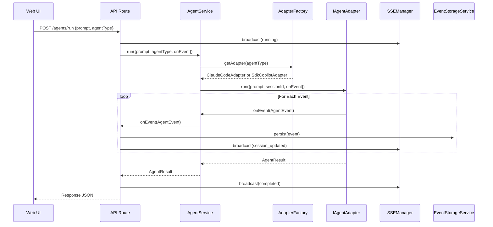

# Research Report: Agent System Refactoring

**Generated**: 2026-01-28T21:45:00Z
**Research Query**: "Research the current agent architecture for refactoring to AgentManager/AgentInstance/AgentNotifier pattern"
**Mode**: Pre-Plan (New Plan Folder)
**Location**: docs/plans/019-agent-manager-refactor/research-dossier.md
**FlowSpace**: Available
**Findings**: 70+ findings from 7 subagents
**Branch**: 015-better-agents

---

## Executive Summary

### What It Does
The Agent System is a **layered architecture** enabling AI coding agent execution (Claude Code, GitHub Copilot) with session continuity, real-time SSE streaming, and persistent NDJSON storage. It spans 4 packages (`packages/shared`, `packages/workflow`, `apps/web`, `apps/cli`) with clear separation of concerns.

### Business Purpose
Enable users to interact with AI coding agents through web UI and CLI, with:
- Multi-session management (multiple agents running concurrently)
- Real-time event streaming via SSE
- Session persistence and resumption
- Workspace-scoped data storage

### Key Insights
1. **The adapters work well** - `IAgentAdapter` interface with `ClaudeCodeAdapter` and `SdkCopilotAdapter` implementations are mature and well-tested
2. **The system is flakey due to fragmentation** - Session management is split across 5+ locations (AgentService, AgentSessionService, AgentSessionStore, adapters, UI state)
3. **No central registry** - There's no single source of truth for "all running agents across all workspaces"
4. **Plan 018 was stopped mid-execution** - Migration tool never built, old sessions invisible to new UI

### Quick Stats
- **Components**: 15+ files, 8 core classes
- **Dependencies**: 4 internal packages, 2 external SDKs (Claude CLI, Copilot SDK)
- **Test Coverage**: 2,415 passing tests, 23 skipped (require real CLI auth)
- **Complexity**: Medium-High (CS-4 estimated for refactor)
- **Prior Learnings**: 15 relevant discoveries from previous implementations

---

## How It Currently Works

### Entry Points

| Entry Point | Type | Location | Purpose |
|------------|------|----------|---------|
| AgentService.run() | API | packages/shared/src/services/agent.service.ts | Core orchestration |
| POST /api/workspaces/[slug]/agents/run | REST | apps/web/app/api/.../route.ts | Web agent execution |
| cg agent run | CLI | apps/cli/src/commands/agent.command.ts | CLI agent execution |
| useAgentSession | Hook | apps/web/src/hooks/useAgentSession.ts | React state management |

### Core Execution Flow



### Data Flow

1. **Request** → Web UI sends prompt + agentType + sessionId
2. **Adapter Selection** → AdapterFactory creates appropriate adapter
3. **Execution** → Adapter runs agent (process spawn or SDK call)
4. **Event Streaming** → Events flow: Adapter → onEvent callback → Storage → SSE → UI
5. **Persistence** → Events stored as NDJSON at `<worktree>/.chainglass/data/agents/<sessionId>/events.ndjson`
6. **Response** → Final `AgentResult` returned with sessionId for resumption

### State Management

**Server-Side State**:
- `AgentSessionAdapter`: Session metadata (JSON files)
- `AgentEventAdapter`: Event logs (NDJSON files)
- `AgentService._activeSessions`: In-memory Map for termination

**Client-Side State**:
- `AgentSessionStore`: localStorage wrapper for UI state
- `useAgentSession`: React reducer for session lifecycle
- React Query: Caching layer for fetched data

**🚨 PROBLEM**: No central registry of running agents across all sessions/workspaces!

---

## Architecture & Design

### Current Component Map

```
┌─────────────────────────────────────────────────────────────────┐
│                         AGENT SYSTEM                            │
├─────────────────────────────────────────────────────────────────┤
│                                                                 │
│  ORCHESTRATION LAYER (packages/shared)                         │
│  ┌──────────────────────────────────────────────────────┐      │
│  │ AgentService                                          │      │
│  │ • Stateless orchestrator                              │      │
│  │ • Timeout enforcement via Promise.race                │      │
│  │ • Active sessions Map (for termination only)          │      │
│  └──────────────────────────────────────────────────────┘      │
│                           │                                     │
│                           ▼                                     │
│  ADAPTER LAYER (packages/shared)                               │
│  ┌──────────────────────────────────────────────────────┐      │
│  │ IAgentAdapter (interface)                             │      │
│  │ ├─ ClaudeCodeAdapter (CLI + NDJSON parsing)          │      │
│  │ ├─ SdkCopilotAdapter (SDK + event translation)       │      │
│  │ └─ FakeAgentAdapter (testing)                        │      │
│  └──────────────────────────────────────────────────────┘      │
│                                                                 │
│  STORAGE LAYER (packages/workflow)                             │
│  ┌──────────────────────────────────────────────────────┐      │
│  │ IAgentEventAdapter  → NDJSON event storage            │      │
│  │ IAgentSessionAdapter → JSON session metadata          │      │
│  │ IAgentSessionService → Business logic                 │      │
│  └──────────────────────────────────────────────────────┘      │
│                                                                 │
│  STREAMING LAYER (apps/web)                                    │
│  ┌──────────────────────────────────────────────────────┐      │
│  │ SSEManager (singleton with HMR survival)              │      │
│  │ • Channel-based routing                               │      │
│  │ • Heartbeat every 30s                                 │      │
│  │ • Automatic cleanup on disconnect                     │      │
│  └──────────────────────────────────────────────────────┘      │
│                                                                 │
│  UI LAYER (apps/web)                                           │
│  ┌──────────────────────────────────────────────────────┐      │
│  │ AgentChatView → SessionSelector → ToolCallCard        │      │
│  │ useAgentSession hook → AgentSessionStore              │      │
│  └──────────────────────────────────────────────────────┘      │
└─────────────────────────────────────────────────────────────────┘
```

### Design Patterns Identified

| Pattern | Where Used | Quality |
|---------|------------|---------|
| **Adapter** | ClaudeCodeAdapter, SdkCopilotAdapter | ✅ Excellent |
| **Factory** | AdapterFactory in DI container | ✅ Good |
| **Result Type** | All adapter/service operations | ✅ Good |
| **Observer-lite** | onEvent callback pattern | ✅ Excellent |
| **Singleton** | SSEManager with globalThis | ⚠️ Works but fragile |
| **Template Method** | WorkspaceDataAdapterBase | ✅ Good |
| **Fake Pattern** | FakeAgentAdapter, FakeProcessManager | ✅ Excellent |

### System Boundaries

- **Internal Boundaries**: Agent system ends at adapter interface; everything below is provider-specific
- **External Interfaces**: Claude CLI (process), Copilot SDK (library), filesystem (NDJSON/JSON)
- **Integration Points**: SSE for real-time updates, REST for CRUD operations

---

## Dependencies & Integration

### What Agent System Depends On

#### Internal Dependencies
| Dependency | Type | Purpose | Risk if Changed |
|------------|------|---------|-----------------|
| IFileSystem | Required | Storage I/O | High - storage breaks |
| IProcessManager | Required | Claude CLI spawning | High - Claude adapter breaks |
| IPathResolver | Required | Path security | High - path traversal risk |
| ILogger | Optional | Debug output | Low - graceful fallback |
| WorkspaceContext | Required | Storage paths | High - wrong storage location |
| CopilotClient | Required | Copilot SDK | High - Copilot adapter breaks |

#### External Dependencies
| Service/Library | Version | Purpose | Criticality |
|-----------------|---------|---------|-------------|
| @github/copilot-sdk | Latest | Copilot integration | High |
| claude CLI | External | Claude integration | High |
| tsyringe | ^4.x | DI container | Medium |
| zod | ^3.x | Schema validation | Medium |
| pino | ^8.x | Logging | Low |

### What Depends on Agent System

#### Direct Consumers
- **Web UI** (`apps/web/app/(dashboard)/agents/`): Full chat interface
- **CLI** (`apps/cli/src/commands/agent.command.ts`): Command-line agent invocation
- **Workflows** (future): May invoke agents as workflow steps

#### Transitive Consumers
- Workspace navigation (links to agent sessions)
- Menu items (show agent status at glance)

---

## Quality & Testing

### Current Test Coverage
- **Unit Tests**: 101 files, comprehensive coverage
- **Contract Tests**: 19 files, ensure Fake/Real parity
- **Integration Tests**: 16 files, **23 skipped** (require auth)
- **E2E Tests**: None for agents specifically

### Why Tests Are Skipped

```typescript
// test/integration/real-agent-multi-turn.test.ts
describe.skip('Claude Real Multi-Turn Tests', { timeout: 120_000 }, () => {
  // Per Phase 5 Subtask 001: Uses describe.skip - tests require auth and take 60s+.
  // To run manually: Remove .skip and ensure CLI is authenticated.
```

**Root Cause**: Integration tests require:
1. Claude CLI installed and authenticated
2. Copilot SDK with valid credentials
3. 60+ seconds per test (expensive in CI)

### Known Issues & Technical Debt

| Issue | Severity | Location | Impact |
|-------|----------|----------|--------|
| No central agent registry | High | Missing | Can't list all running agents |
| Missing timeout in adapters | Medium | Both adapters | CLIs can hang indefinitely |
| Session ID confusion | Medium | AgentSession | `id` vs `agentSessionId` unclear |
| Validation duplication | Low | Both adapters | DRY violation |
| Base class too rigid | Low | WorkspaceDataAdapterBase | Forces override |

### Flakiness Root Causes

The "flakiness" stems from:
1. **Skipped integration tests** - Real adapter behavior not validated in CI
2. **Missing timeout implementation** - CLIs can hang indefinitely
3. **Race conditions in SSE** - Must connect BEFORE calling /agents/run
4. **No central source of truth** - Session state scattered across 5+ locations

---

## Modification Considerations

### ✅ Safe to Modify (Adapters Work Well)

1. **IAgentAdapter interface** - Well-defined contract, preserve it
2. **ClaudeCodeAdapter** - Mature, tested, keep as-is
3. **SdkCopilotAdapter** - Mature, tested, keep as-is
4. **FakeAgentAdapter** - Excellent test double, keep as-is
5. **Event types** - 8 discriminated union types, well-designed

### ⚠️ Modify with Caution

1. **AgentService** - Currently stateless; adding state requires careful threading
   - Risk: Breaking existing orchestration
   - Mitigation: Wrap in new AgentManager, don't modify directly

2. **SSEManager** - Singleton with globalThis
   - Risk: HMR issues in development
   - Mitigation: Add test coverage before changes

3. **Storage paths** - Plan 018 migration incomplete
   - Risk: Breaking existing sessions
   - Mitigation: Build migration tool first

### 🚫 Danger Zones

1. **AgentSessionStore (localStorage)** - Used by UI state
   - Dependencies: React hooks, hydration logic
   - Alternative: Replace with server-side session list

2. **Event ID format** - Timestamp-based ordering
   - Dependencies: getSince() pagination, event ordering
   - Alternative: Don't change format, just add central registry

---

## Prior Learnings (From Previous Implementations)

### 🚨 PL-01: Event-Sourced Storage Before SSE (CRITICAL)
**Source**: docs/plans/015-better-agents/tasks/phase-3-sse-broadcast-integration/tasks.md
**Original**: "storage is truth, SSE is hint"

**What They Found**:
> Persist to server-side storage FIRST, then broadcast tiny notification (sessionId only). Client fetches via REST.

**Why This Matters Now**:
The new AgentNotifier must follow this pattern: persist first, notify second.

---

### 🚨 PL-02: Session Destruction Race Conditions (CRITICAL)
**Source**: Plan 002, Phase 3 SDK Copilot Adapter

**What They Found**:
> Session destruction during message wait causes exception. Always check session validity before operations.

**Why This Matters Now**:
AgentInstance must handle graceful shutdown when agent is terminated mid-stream.

---

### 🚨 PL-03: Path Traversal Prevention (SECURITY)
**Source**: Plan 015, AgentEventAdapter

**What They Found**:
> ALL sessionId parameters need validation before filesystem operations.

**Why This Matters Now**:
AgentManager must validate all session IDs before storage operations.

---

### ⚠️ PL-04: Three-Layer Type Sync
**Source**: Plan 015, Phase 1

**What They Found**:
> Schemas (Zod), types (TS), and unions must update atomically or runtime breaks.

**Why This Matters Now**:
New AgentInstance type must have Zod schema, TS interface, and be added to union simultaneously.

---

### ⚠️ PL-05: SSE Connect Before Run (TIMING)
**Source**: Plan 015, DYK-01

**What They Found**:
> Register event handler BEFORE sendAndWait. If you subscribe after, you miss events.

**Why This Matters Now**:
UI components must subscribe to AgentNotifier SSE BEFORE starting agent run.

---

### ⚠️ PL-06: NDJSON Corruption Handling
**Source**: Plan 015, DYK-04

**What They Found**:
> Silently skip malformed NDJSON lines with optional logging.

**Why This Matters Now**:
Event storage must remain resilient to partial writes.

---

## Critical Discoveries from Research

### 🚨 CD-01: No Central Agent Registry Exists
**Impact**: Critical
**Source**: IA-01 (Implementation Archaeologist)

The current `AgentService._activeSessions` is:
- Only for termination (not listing)
- Cleared on process restart
- Not shared across web server instances

**Required for AgentManager**: A central registry that:
- Persists across restarts
- Is queryable (list all agents by workspace)
- Survives server restart

---

### 🚨 CD-02: Session State is Fragmented
**Impact**: Critical
**Source**: DC-03 (Dependency Cartographer)

Session state lives in 5+ places:
1. `AgentService._activeSessions` (in-memory, termination)
2. `AgentSessionAdapter` (JSON files, metadata)
3. `AgentEventAdapter` (NDJSON files, events)
4. `AgentSessionStore` (localStorage, UI state)
5. `useAgentSession` (React state, UI lifecycle)

**Required for AgentInstance**: Single source of truth with:
- id, name, type, workspace
- status (working, stopped, question, error)
- intent (what agent is doing)
- Derived from adapter events

---

### 🚨 CD-03: SSE is Global, Not Per-Agent
**Impact**: High
**Source**: DC-04 (Dependency Cartographer)

Current SSEManager broadcasts to channels, but:
- Clients filter by sessionId manually
- No server-side filtering
- All agents on same channel

**Required for AgentNotifier**: 
- Single SSE stream (as specified)
- Clients filter by agent ID
- Server broadcasts all agent events to all listeners

---

### 🔔 CD-04: Plan 018 Never Completed Migration
**Impact**: Medium
**Source**: DE-01 (Documentation Historian)

Plan 018 completed phases 1-3 but:
- Phase 4 (Migration Tool) never started
- Old sessions at `.chainglass/workspaces/default/data/` are invisible
- No migration path for existing data

**Recommendation**: Either complete Plan 018 first, or accept data loss for old sessions.

---

## Proposed Architecture (Based on User Vision)

```
┌─────────────────────────────────────────────────────────────────┐
│                    NEW AGENT ARCHITECTURE                        │
├─────────────────────────────────────────────────────────────────┤
│                                                                 │
│  AGENT MANAGER (Central Authority)                             │
│  Location: ~/.config/chainglass/agents/                        │
│  ┌──────────────────────────────────────────────────────┐      │
│  │ • Create agent: createAgent(name, type, workspace)    │      │
│  │ • List agents: getAgents(filter?: workspace)          │      │
│  │ • Get agent: getAgent(id)                             │      │
│  │ • Attaches to each AgentInstance for events           │      │
│  └──────────────────────────────────────────────────────┘      │
│                           │                                     │
│                           ▼                                     │
│  AGENT INSTANCE                                                │
│  ┌──────────────────────────────────────────────────────┐      │
│  │ Properties:                                           │      │
│  │ • id, name, type, workspace                          │      │
│  │ • status: 'working' | 'stopped' | 'question' | 'error'│      │
│  │ • intent: string (what agent is doing)               │      │
│  │ • sessionId (from adapter)                           │      │
│  │                                                       │      │
│  │ Methods:                                              │      │
│  │ • run(prompt) → uses IAgentAdapter (no changes!)     │      │
│  │ • terminate()                                         │      │
│  │ • getEvents() → returns all events for rehydration   │      │
│  │ • onEvent(handler) → subscribe to live events        │      │
│  └──────────────────────────────────────────────────────┘      │
│                           │                                     │
│                           ▼                                     │
│  AGENT NOTIFIER (SSE Broadcast)                                │
│  ┌──────────────────────────────────────────────────────┐      │
│  │ • Single SSE endpoint: /api/agents/events            │      │
│  │ • Broadcasts all agent events                        │      │
│  │ • Clients filter by agent ID                         │      │
│  │ • Event types: status, intent, text_delta, tool, etc │      │
│  └──────────────────────────────────────────────────────┘      │
│                                                                 │
│  STORAGE (Unchanged from Plan 018)                             │
│  ┌──────────────────────────────────────────────────────┐      │
│  │ ~/.config/chainglass/agents/                         │      │
│  │ ├─ registry.json  (agent list with workspace refs)   │      │
│  │ └─ <agent-id>/                                        │      │
│  │    ├─ instance.json (AgentInstance metadata)         │      │
│  │    └─ events.ndjson (event history)                  │      │
│  └──────────────────────────────────────────────────────┘      │
│                                                                 │
│  ADAPTERS (No Changes Needed)                                  │
│  ┌──────────────────────────────────────────────────────┐      │
│  │ IAgentAdapter, ClaudeCodeAdapter, SdkCopilotAdapter  │      │
│  │ (These work well - leave alone!)                     │      │
│  └──────────────────────────────────────────────────────┘      │
└─────────────────────────────────────────────────────────────────┘
```

---

## Recommendations

### If Modifying This System

1. **Preserve IAgentAdapter and implementations** - They work well
2. **Create AgentManager as NEW layer** - Don't modify AgentService directly
3. **AgentInstance wraps AgentService** - Composition over inheritance
4. **Single SSE endpoint** - Replace channel-based routing with client filtering
5. **Central storage at ~/.config/chainglass/agents/** - Cross-workspace registry

### If Extending This System

1. **Add new agent types** via AdapterFactory pattern
2. **Add new event types** by extending AgentEvent union
3. **Add new status values** to AgentInstance status enum

### If Refactoring This System

1. **Build AgentManager first** - Central registry, TDD
2. **Build AgentInstance second** - Wraps adapter, manages state
3. **Build AgentNotifier third** - Single SSE, broadcasts all
4. **Migrate web UI last** - Once core is proven

---

## External Research Opportunities

### Research Opportunity 1: SSE vs WebSockets for Agent Streaming

**Why Needed**: Current SSE implementation has race conditions and no built-in reconnection. Modern alternatives may be better.

**Impact on Plan**: Could simplify AgentNotifier architecture

**Ready-to-use prompt**:
```
/deepresearch "Compare Server-Sent Events (SSE) vs WebSockets vs HTTP/3 Server Push for real-time AI agent streaming in 2024-2025. 

Context:
- Next.js 16 application with React 19
- Need to stream events from multiple concurrent AI agents
- Events include: text deltas, tool calls, status changes
- Must support reconnection and catch-up on missed events
- Currently using SSE with manual reconnection

Questions:
1. Is SSE still the right choice for this use case?
2. How do modern frameworks handle SSE reconnection?
3. Should we use WebSockets instead for bidirectional needs?
4. What's the best pattern for event buffering/catch-up?"
```

### Research Opportunity 2: State Management for Concurrent Agents

**Why Needed**: Current system has fragmented state across 5+ locations. Need patterns for centralized state with multiple concurrent agents.

**Ready-to-use prompt**:
```
/deepresearch "Best practices for managing state of multiple concurrent AI agents in a web application (2024-2025).

Context:
- TypeScript monorepo with Next.js
- Multiple agents can run simultaneously in different tabs/sessions
- Each agent has: id, status, intent, event history
- Need central registry queryable by workspace
- Storage at ~/.config/app-name/agents/ (not in repo)

Questions:
1. What state management patterns work for concurrent long-running processes?
2. How to handle process restart (agent state persistence)?
3. What's the right abstraction for "AgentInstance" lifecycle?
4. How do other AI IDEs (Cursor, Windsurf) manage agent state?"
```

---

## Appendix: File Inventory

### Core Files
| File | Purpose | Lines | Package |
|------|---------|-------|---------|
| agent.service.ts | Orchestration | 308 | shared |
| agent-adapter.interface.ts | Contract | 50 | shared |
| claude-code.adapter.ts | Claude CLI | 561 | shared |
| sdk-copilot-adapter.ts | Copilot SDK | 472 | shared |
| agent-event.adapter.ts | Event storage | 338 | workflow |
| agent-session.adapter.ts | Session storage | 183 | workflow |
| sse-manager.ts | SSE broadcast | 140 | web |
| run/route.ts | API endpoint | 374 | web |

### Test Files
| File | Tests | Status |
|------|-------|--------|
| agent-service.test.ts | 25 | ✅ Passing |
| claude-code-adapter.test.ts | 30 | ✅ Passing |
| sdk-copilot-adapter.test.ts | 28 | ✅ Passing |
| real-agent-multi-turn.test.ts | 8 | ⏭️ Skipped (auth) |
| agent-streaming.test.ts | 8 | ⏭️ Skipped (auth) |

---

## Next Steps

**This research is complete.** Based on findings:

1. ✅ IAgentAdapter and implementations are solid - don't modify
2. 🔄 Plan 018 was stopped mid-execution - consider completing migration
3. 🆕 New AgentManager/AgentInstance/AgentNotifier layer needed
4. 📝 Recommend creating spec with `/plan-1b-specify` next

**Ready for**:
- `/plan-1b-specify "AgentManager/AgentInstance/AgentNotifier refactor"` - Create specification
- Or manual refinement of this research

---

**Research Complete**: 2026-01-28T21:45:00Z
**Report Location**: docs/plans/019-agent-manager-refactor/research-dossier.md
