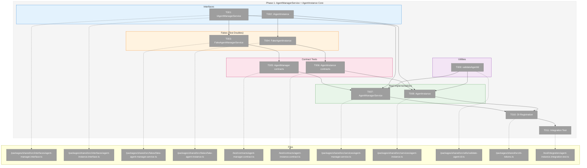
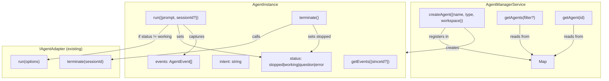
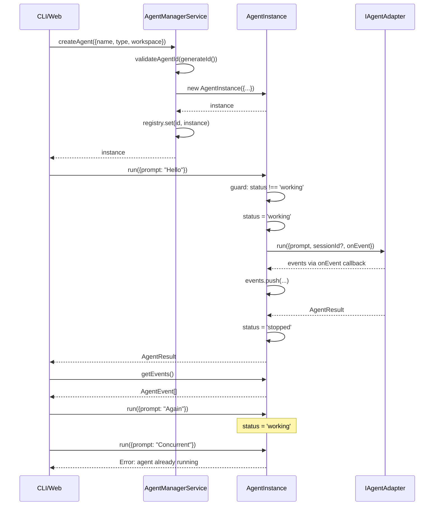

# Phase 1: AgentManagerService + AgentInstance Core – Tasks & Alignment Brief

**Spec**: [../agent-manager-refactor-spec.md](../agent-manager-refactor-spec.md)
**Plan**: [../agent-manager-refactor-plan.md](../agent-manager-refactor-plan.md)
**Date**: 2026-01-29

---

## Executive Briefing

### Purpose
This phase creates the foundational headless agent management system that enables CLI usage and establishes a single source of truth for all agent state. Without this foundation, the web UI, CLI, and workflows cannot reliably manage agents across workspaces.

### What We're Building
A central agent management architecture with two core components:
- **AgentManagerService**: Central registry for creating and tracking all agents across all workspaces. Returns agents regardless of which workspace/worktree they belong to.
- **AgentInstance**: Self-contained representation of a running agent that wraps the existing `IAgentAdapter` implementations, manages status transitions (`working`|`stopped`|`question`|`error`), intent, and event history.

### User Value
Users (via CLI or web) can:
- Create named agents tied to a workspace
- List all agents across all projects
- Get events from any agent for conversation rehydration
- Run prompts on agents with guard against double-run collisions

### Example
**Before**: Fragmented state in 5+ locations; no way to list "all running agents"
**After**:
```typescript
// Create agent
const agent = agentManager.createAgent({
  name: 'chat-assistant',
  type: 'claude-code',
  workspace: '/projects/myapp'
});
// agent: { id: 'a1b2c3', name: 'chat-assistant', type: 'claude-code', workspace: '/projects/myapp', status: 'stopped' }

// List all agents (cross-workspace)
const all = agentManager.getAgents();
// [{ id: 'a1b2c3', ... }, { id: 'd4e5f6', workspace: '/projects/other', ... }]

// Filter by workspace
const mine = agentManager.getAgents({ workspace: '/projects/myapp' });

// Run prompt (with double-run guard)
await agent.run({ prompt: 'Explain the codebase' });
// status: 'working' → 'stopped', events captured
```

---

## Objectives & Scope

### Objective
Implement AgentManagerService and AgentInstance as the foundation for unified agent management, achieving AC-01 through AC-12, AC-23, AC-24, AC-26, AC-27, AC-29 from the specification.

### Behavior Checklist
- [ ] AgentManagerService creates agents with unique IDs (AC-01)
- [ ] AgentManagerService lists all agents regardless of workspace (AC-02)
- [ ] AgentManagerService filters agents by workspace (AC-03)
- [ ] AgentManagerService returns null for unknown agent (AC-04)
- [ ] AgentInstance has required properties: id, name, type, workspace, status, intent, sessionId (AC-06)
- [ ] AgentInstance runs prompts using IAgentAdapter (AC-07)
- [ ] AgentInstance guards against double-run (AC-07a)
- [ ] AgentInstance updates intent during execution (AC-08)
- [ ] AgentInstance provides event history (AC-09)
- [ ] AgentInstance supports incremental event fetching (AC-10)
- [ ] AgentInstance can be terminated (AC-11)
- [ ] AgentInstance stores adapter sessionId (AC-12)
- [ ] Invalid agent IDs rejected with path traversal prevention (AC-23)
- [ ] Agent not found handled gracefully (AC-24)
- [ ] FakeAgentManagerService provides test helpers (AC-26)
- [ ] FakeAgentInstance provides test helpers (AC-27)
- [ ] Contract tests verify Fake/Real parity (AC-29)

### Goals

- ✅ Define IAgentManagerService interface with createAgent, getAgents, getAgent methods
- ✅ Define IAgentInstance interface with run, terminate, getEvents methods and properties
- ✅ Create FakeAgentManagerService with state setup, inspection, and error injection
- ✅ Create FakeAgentInstance with configurable events, status control, and call tracking
- ✅ Write contract tests that run against BOTH Fake and Real implementations
- ✅ Implement AgentManagerService with in-memory registry
- ✅ Implement AgentInstance wrapping IAgentAdapter with status state machine
- ✅ Add path traversal validation for agent IDs
- ✅ Register services in DI container using useFactory pattern
- ✅ Integration test verifying AgentInstance delegates to FakeAgentAdapter

### Non-Goals

- ❌ Persistence to disk (Phase 3 - storage layer)
- ❌ SSE broadcasting (Phase 2 - AgentNotifierService)
- ❌ Web API routes (Phase 4 - web integration)
- ❌ CLI commands (Phase 4 - web integration)
- ❌ AgentSession consolidation (Phase 5 - cleanup)
- ❌ Modifying IAgentAdapter or existing adapters (explicitly preserved)
- ❌ Complex distributed locking (simple status guard is sufficient per spec)
- ❌ Event sourcing to disk (Phase 3)

---

## Architecture Map

### Component Diagram
<!-- Status: grey=pending, orange=in-progress, green=completed, red=blocked -->
<!-- Updated by plan-6 during implementation -->



### Task-to-Component Mapping

<!-- Status: ⬜ Pending | 🟧 In Progress | ✅ Complete | 🔴 Blocked -->

| Task | Component(s) | Files | Status | Comment |
|------|-------------|-------|--------|---------|
| T000 | Feature Folder | /packages/shared/src/features/019-agent-manager-refactor/ | ✅ Complete | PlanPak folder structure |
| T001 | IAgentManagerService | /packages/shared/src/features/019-agent-manager-refactor/agent-manager.interface.ts | ✅ Complete | Define central manager interface |
| T002 | IAgentInstance | /packages/shared/src/features/019-agent-manager-refactor/agent-instance.interface.ts | ✅ Complete | Define agent instance interface |
| T003 | FakeAgentManagerService | /packages/shared/src/features/019-agent-manager-refactor/fake-agent-manager.service.ts | ✅ Complete | Test double with helpers |
| T004 | FakeAgentInstance | /packages/shared/src/features/019-agent-manager-refactor/fake-agent-instance.ts | ✅ Complete | Test double with helpers |
| T005 | Contract Tests | /test/contracts/agent-manager.contract.ts | ✅ Complete | Contract tests for manager |
| T006 | Contract Tests | /test/contracts/agent-instance.contract.ts | ✅ Complete | Contract tests for instance |
| T007 | AgentManagerService | /packages/shared/src/features/019-agent-manager-refactor/agent-manager.service.ts | ✅ Complete | Real implementation |
| T008 | AgentInstance | /packages/shared/src/features/019-agent-manager-refactor/agent-instance.ts | ✅ Complete | Real implementation wrapping adapter |
| T009 | validateAgentId | /packages/shared/src/utils/validate-agent-id.ts | ✅ Complete | Security: path traversal prevention |
| T010 | DI Registration | /packages/shared/src/di-tokens.ts, /apps/web/src/lib/di-container.ts | ✅ Complete | Register in container |
| T011 | Integration Test | /test/integration/agent-instance.integration.test.ts | ✅ Complete | End-to-end with FakeAgentAdapter |

---

## Tasks

| Status | ID | Task | CS | Type | Dependencies | Absolute Path(s) | Validation | Subtasks | Notes |
|--------|------|------|----|------|--------------|------------------|------------|----------|-------|
| [x] | T000 | Create feature folder structure | 1 | Setup | – | /home/jak/substrate/015-better-agents/packages/shared/src/features/019-agent-manager-refactor/ | Directory exists | – | plan-scoped |
| [x] | T001 | Define IAgentManagerService interface | 2 | Interface | T000 | /home/jak/substrate/015-better-agents/packages/shared/src/features/019-agent-manager-refactor/agent-manager.interface.ts | Exports: IAgentManagerService, CreateAgentParams, AgentFilter; compiles without error | – | plan-scoped |
| [x] | T002 | Define IAgentInstance interface | 2 | Interface | T000 | /home/jak/substrate/015-better-agents/packages/shared/src/features/019-agent-manager-refactor/agent-instance.interface.ts | Exports: IAgentInstance, AgentInstanceStatus ('working'\|'stopped'\|'error'); properties: id, name, type, workspace, status, intent, sessionId, createdAt, updatedAt; constructor receives adapterFactory | – | plan-scoped, DYK-01, DYK-02 |
| [x] | T003 | Write FakeAgentManagerService with test helpers | 2 | Fake | T001 | /home/jak/substrate/015-better-agents/packages/shared/src/features/019-agent-manager-refactor/fake-agent-manager.service.ts | Has: addAgent(), getCreatedAgents(), setError(), implements IAgentManagerService | – | plan-scoped |
| [x] | T004 | Write FakeAgentInstance with test helpers | 2 | Fake | T002 | /home/jak/substrate/015-better-agents/packages/shared/src/features/019-agent-manager-refactor/fake-agent-instance.ts | Has: setStatus(), setEvents(), assertRunCalled(), setIntent(); implements IAgentInstance; composes FakeAgentAdapter internally for consistent test behavior | – | plan-scoped, DYK-03 |
| [x] | T005 | Write contract tests for IAgentManagerService | 2 | Test | T003 | /home/jak/substrate/015-better-agents/test/contracts/agent-manager.contract.ts, /home/jak/substrate/015-better-agents/test/contracts/agent-manager.contract.test.ts | Tests cover AC-01, AC-02, AC-03, AC-04, AC-23, AC-24; run against Fake AND Real (with FakeAdapterFactory injected); tests FAIL initially | – | plan-scoped, DYK-05 |
| [x] | T006 | Write contract tests for IAgentInstance | 2 | Test | T004 | /home/jak/substrate/015-better-agents/test/contracts/agent-instance.contract.ts, /home/jak/substrate/015-better-agents/test/contracts/agent-instance.contract.test.ts | Tests cover AC-06, AC-07, AC-07a, AC-09, AC-10, AC-11, AC-12; run against Fake AND Real (with FakeAdapterFactory); tests FAIL initially | – | plan-scoped, DYK-05 |
| [x] | T007 | Implement AgentManagerService to pass contracts | 3 | Core | T005, T009 | /home/jak/substrate/015-better-agents/packages/shared/src/features/019-agent-manager-refactor/agent-manager.service.ts | All contract tests pass; uses in-memory Map<agentId, IAgentInstance>; validates agent IDs | – | plan-scoped, Per Critical Finding 01 |
| [x] | T008 | Implement AgentInstance to pass contracts | 3 | Core | T006, T009 | /home/jak/substrate/015-better-agents/packages/shared/src/features/019-agent-manager-refactor/agent-instance.ts | All contract tests pass; wraps IAgentAdapter via factory pattern; stores sessionId; status guard prevents double-run; events captured | – | plan-scoped, Per Critical Finding 04, DYK-01 |
| [x] | T009 | Add path validation for agent IDs (security) | 2 | Security | – | /home/jak/substrate/015-better-agents/packages/shared/src/utils/validate-agent-id.ts | validateAgentId rejects: `..`, `/`, `\`, null bytes, whitespace; exports ValidationError | – | cross-cutting, Per Critical Finding 03, PL-09 |
| [x] | T010 | Register services in DI container | 2 | DI | T007, T008 | /home/jak/substrate/015-better-agents/packages/shared/src/di-tokens.ts, /home/jak/substrate/015-better-agents/apps/web/src/lib/di-container.ts | Add AGENT_MANAGER_SERVICE token; factory registration works; resolves in tests | – | cross-cutting, Per ADR-0004 |
| [x] | T011 | Integration test: AgentInstance uses FakeAgentAdapter | 3 | Integration | T008, T010 | /home/jak/substrate/015-better-agents/test/integration/agent-instance.integration.test.ts | run() delegates to adapter; events captured; status transitions verified; double-run rejected | – | plan-scoped |

---

## Alignment Brief

### Critical Findings Affecting This Phase

| # | Finding | Impact | Tasks Addressing |
|---|---------|--------|------------------|
| 01 | No central agent registry exists (CD-01, I1-01) | Must create AgentManagerService with Map<agentId, AgentInstance> | T001, T003, T005, T007 |
| 02 | Session state fragmented across 5+ locations (CD-02, I1-06) | AgentInstance becomes single source of truth for agent state | T002, T004, T006, T008 |
| 03 | Path traversal risk in session IDs (R1-05, PL-09) | Centralize validation in validateAgentId() called at every method entry | T009, T007, T008 |
| 04 | Race condition in concurrent runs (R1-02) | Status guard check before adapter.run() - simple check, not lock | T006, T008 |

### ADR Decision Constraints

- **ADR-0004: DI Container Architecture** – Use `useFactory` pattern, no `@injectable` decorators (RSC compatibility)
  - Constrains: T010 (DI Registration)
  - Addressed by: T010 uses factory pattern per ADR-0004 IMP-003

### Prior Learnings Applied

| PL | Learning | How Applied |
|----|----------|-------------|
| PL-09 | Path traversal prevention in session IDs | T009: validateAgentId() rejects dangerous characters |
| PL-11 | Dual-layer testing with contract parity | T005, T006: Contract tests run against both Fake and Real |
| PL-14 | AgentStoredEvent union type pattern | Use intersection types for extending discriminated unions |

### Invariants & Guardrails

1. **Status State Machine**: `stopped` → `working` → `stopped|error` (three states only: `'working'|'stopped'|'error'`)
2. **Agent ID Format**: Alphanumeric + dash/underscore, max 64 chars, no path separators
3. **Workspace Path**: Must be absolute path or valid slug
4. **Agent Type**: Enum `'claude-code' | 'copilot'` only
5. **Adapter Factory Pattern**: AgentInstance receives `adapterFactory: (type: AgentType) => IAgentAdapter` at construction, NOT a concrete adapter. Adapters are stateless; sessionId is stored by AgentInstance and passed to adapter on each run().

### Inputs to Read

| File | Purpose |
|------|---------|
| `/home/jak/substrate/015-better-agents/packages/shared/src/interfaces/agent-adapter.interface.ts` | IAgentAdapter interface to wrap |
| `/home/jak/substrate/015-better-agents/packages/shared/src/interfaces/agent-types.ts` | AgentEvent, AgentResult types |
| `/home/jak/substrate/015-better-agents/packages/shared/src/fakes/fake-agent-adapter.ts` | FakeAgentAdapter pattern to follow |
| `/home/jak/substrate/015-better-agents/packages/shared/src/di-tokens.ts` | Existing DI token pattern |
| `/home/jak/substrate/015-better-agents/test/contracts/agent-adapter.contract.ts` | Contract test pattern to follow |

### Visual Alignment: Flow Diagram



### Visual Alignment: Sequence Diagram



### Test Plan (TDD)

Per constitution Principle 3 (TDD) and Principle 4 (Fakes over mocks):

#### Contract Tests (run against BOTH Fake and Real)

| Test Name | AC | Purpose | Fixtures |
|-----------|------|---------|----------|
| `creates agent with required properties` | AC-01 | Verify createAgent returns complete AgentInstance | None |
| `lists all agents regardless of workspace` | AC-02 | Verify getAgents returns cross-workspace | 2 agents in different workspaces |
| `filters agents by workspace` | AC-03 | Verify getAgents({workspace}) filters correctly | 2 agents in different workspaces |
| `returns null for unknown agent` | AC-04 | Verify getAgent graceful handling | None |
| `rejects invalid agent ID with path traversal` | AC-23 | Security: path traversal prevention | IDs: `../etc`, `foo/bar`, `a\b` |
| `instance has required properties` | AC-06 | Verify property presence | Created agent |
| `runs prompts using adapter` | AC-07 | Verify adapter delegation | FakeAgentAdapter |
| `guards against double-run` | AC-07a | Verify status check | Agent with status='working' |
| `provides event history` | AC-09 | Verify getEvents returns captured events | Agent after run with events |
| `supports incremental event fetching` | AC-10 | Verify sinceId filtering | Agent with 10+ events |
| `can be terminated` | AC-11 | Verify terminate() calls adapter | Running agent |
| `stores adapter sessionId` | AC-12 | Verify sessionId persistence | Agent after run |

#### Fake Test Helpers Required

**FakeAgentManagerService**:
- `addAgent(instance)`: Pre-populate state for tests
- `getCreatedAgents()`: Inspect agents created via createAgent
- `setError(methodName, error)`: Inject errors for error path testing

**FakeAgentInstance**:
- `setStatus(status)`: Control status for double-run tests
- `setEvents(events)`: Pre-populate events
- `setIntent(intent)`: Control intent
- `assertRunCalled(options)`: Verify run was called with expected args
- `assertTerminateCalled()`: Verify terminate was called

### Step-by-Step Implementation Outline

| Step | Task(s) | Action |
|------|---------|--------|
| 1 | T001, T002 | Define interfaces first (types before code) |
| 2 | T003, T004 | Create Fakes implementing interfaces |
| 3 | T005, T006 | Write contract tests (RED phase - tests should fail) |
| 4 | T009 | Implement validateAgentId utility |
| 5 | T007 | Implement AgentManagerService (GREEN phase) |
| 6 | T008 | Implement AgentInstance (GREEN phase) |
| 7 | T010 | Register in DI container |
| 8 | T011 | Integration test with FakeAgentAdapter |
| 9 | – | REFACTOR: Clean up, optimize, document |

### Commands to Run

```bash
# Run all tests (verify baseline)
just test

# Run specific contract tests during development
pnpm -F @chainglass/shared test -- --grep "AgentManagerService"
pnpm -F @chainglass/shared test -- --grep "AgentInstance"

# Run contract tests only
pnpm test -- test/contracts/agent-manager.contract.test.ts
pnpm test -- test/contracts/agent-instance.contract.test.ts

# TypeScript compilation check
just typecheck

# Lint check
just lint

# Quick quality gate (fix, format, test)
just fft

# Full quality check before completion
just check
```

### Risks & Unknowns

| Risk | Severity | Likelihood | Mitigation |
|------|----------|------------|------------|
| Double-run race condition in async code | High | Medium | Use synchronous status check BEFORE any async work |
| Agent ID validation edge cases | Medium | Medium | Comprehensive test cases including unicode, special chars |
| DI container circular dependencies | Low | Low | AgentInstance receives adapter factory, not concrete adapter |

### Ready Check

- [ ] Interfaces defined and reviewed (T001, T002)
- [ ] Fakes implemented with required helpers (T003, T004)
- [ ] Contract tests written and initially failing (T005, T006)
- [ ] Path validation comprehensive (T009)
- [ ] ADR-0004 constraints applied in DI registration (T010)

**GO / NO-GO**: Await human confirmation before proceeding to implementation.

---

## Phase Footnote Stubs

_Populated by plan-6 during implementation when significant decisions or deviations occur._

| # | Date | Task | Type | Description | References |
|---|------|------|------|-------------|------------|
| | | | | | |

**Types**: `deviation` | `discovery` | `decision` | `blocker` | `debt`

---

## Evidence Artifacts

Implementation will produce:
- `execution.log.md` in this directory - detailed narrative of implementation
- Test results from `just test`
- TypeScript compilation output from `just typecheck`

---

## Discoveries & Learnings

_Populated during implementation by plan-6. Log anything of interest to your future self._

| Date | Task | Type | Discovery | Resolution | References |
|------|------|------|-----------|------------|------------|
| | | | | | |

**Types**: `gotcha` | `research-needed` | `unexpected-behavior` | `workaround` | `decision` | `debt` | `insight`

**What to log**:
- Things that didn't work as expected
- External research that was required
- Implementation troubles and how they were resolved
- Gotchas and edge cases discovered
- Decisions made during implementation
- Technical debt introduced (and why)
- Insights that future phases should know about

_See also: `execution.log.md` for detailed narrative._

---

## Directory Layout

```
docs/plans/019-agent-manager-refactor/
├── agent-manager-refactor-plan.md
├── agent-manager-refactor-spec.md
├── prior-learnings.md
├── research-dossier.md
└── tasks/
    └── phase-1-agentmanagerservice-agentinstance-core/
        ├── tasks.md              # This file
        └── execution.log.md      # Created by plan-6 during implementation
```

---

## Critical Insights Discussion

**Session**: 2026-01-29
**Context**: Phase 1 Task Dossier - AgentManagerService & AgentInstance Core
**Analyst**: AI Clarity Agent
**Reviewer**: Development Team
**Format**: Water Cooler Conversation (5 Critical Insights)

### Insight 1: AgentInstance Needs AdapterFactory, Not Concrete Adapter

**Did you know**: AgentInstance should receive an `adapterFactory: (type: AgentType) => IAgentAdapter` at construction rather than a concrete adapter instance, because adapters are stateless and sessionId is what provides conversation continuity.

**Implications**:
- sessionId stored by AgentInstance, passed to adapter on each run()
- Factory enables injecting FakeAgentAdapter for tests
- Factory enables future agent types without changing AgentInstance
- AgentManagerService holds Map<agentId, IAgentInstance>, creates instances on createAgent()

**Options Considered**:
- Option A: Inject AdapterFactory - AgentInstance calls factory(this.type) when needed
- Option B: Inject AgentAdapterRegistry - Registry lookup pattern
- Option C: Inject Concrete Adapter - Direct injection at construction

**AI Recommendation**: Option A - Inject AdapterFactory
- Reasoning: Simplest approach, enables testability, follows existing patterns

**Discussion Summary**:
User asked clarifying questions about when AgentInstance objects are created and how conversation continuity works across restarts. Explained that Phase 3 persistence stores sessionId in registry.json, and initialize() restores agents with status='stopped'.

**Decision**: Inject AdapterFactory into AgentInstance

**Action Items**:
- [x] Add Invariant #5 documenting factory pattern
- [x] Tag T002 and T008 with DYK-01

**Affects**: T002 (interface), T008 (implementation), Invariants section

---

### Insight 2: 'question' Status Has No Trigger Mechanism

**Did you know**: The status type `'working'|'stopped'|'question'|'error'` includes 'question' but there's no defined trigger for when an agent enters that state - neither the adapter nor any other component emits "I need user input" signals.

**Implications**:
- 'question' state was a workflow concept, not an agent state
- Simplifies state machine significantly
- Reduces complexity in status transitions

**Options Considered**:
- Option A: Simplify to `'working'|'stopped'|'error'` only (3 states)
- Option B: Add adapter-level question detection
- Option C: Keep 'question' for future use

**AI Recommendation**: Option A - Simplify status states
- Reasoning: 'question' was a workflow concept; agent state should be simple

**Discussion Summary**:
User clarified that "question" was from a different workflow concept and doesn't belong in agent status. Agreed to simplify to three states.

**Decision**: Status is `'working'|'stopped'|'error'` only

**Action Items**:
- [x] Update Invariant #1 to show 3-state machine
- [x] Tag T002 with DYK-02

**Affects**: T002 (interface), T007 (AgentInstance implementation)

---

### Insight 3: FakeAgentInstance Can't Fake run() Without Adapter

**Did you know**: FakeAgentInstance needs to produce realistic event streams from run(), but without composing a real/fake adapter internally, it can only emit hardcoded events - which may diverge from actual adapter behavior.

**Implications**:
- FakeAgentInstance should compose FakeAgentAdapter internally
- Consistent test infrastructure across codebase
- Same fake adapter used everywhere = predictable test behavior

**Options Considered**:
- Option A: FakeAgentInstance composes FakeAgentAdapter internally
- Option B: FakeAgentInstance is pure fake with hardcoded behavior
- Option C: Make FakeAgentInstance configurable

**AI Recommendation**: Option A - Compose FakeAgentAdapter
- Reasoning: Consistent test infrastructure, adapter may be reused by other things

**Discussion Summary**:
User chose composition for test consistency - same FakeAgentAdapter should be used everywhere.

**Decision**: FakeAgentInstance uses FakeAgentAdapter internally

**Action Items**:
- [x] Update T004 validation to document composition pattern
- [x] Tag T004 with DYK-03

**Affects**: T004 (FakeAgentInstance implementation)

---

### Insight 4: Event Capturing Timing

**Did you know**: Status flips to 'stopped' after adapter.run() returns, but all onEvent callbacks happen during run() - so the final status change happens after all events are emitted, with no explicit "run completed" event.

**Implications**:
- No race condition in practice (await blocks until all events emitted)
- Events are for content (tool_call, thinking, messages)
- Status is metadata, handled separately
- Phase 2 SSE will broadcast status changes

**Options Considered**:
- Option A: No special run lifecycle events - keep it simple
- Option B: Add explicit 'run_started' and 'run_completed' events
- Option C: Emit status change as event type

**AI Recommendation**: Option A - No special events
- Reasoning: KISS principle, events are for content, Phase 2 handles status broadcasting

**Discussion Summary**:
User agreed with keeping it simple - events capture content, status is metadata.

**Decision**: No special run lifecycle events

**Action Items**: None - confirms current approach

**Affects**: No changes needed

---

### Insight 5: Contract Tests Need Two Different Test Contexts

**Did you know**: Running contract tests against FakeAgentManagerService vs real AgentManagerService requires different setup - real service creates real AgentInstances which need adapters, but we don't want real Claude/Copilot calls in tests.

**Implications**:
- Contract tests of Real AgentManagerService need FakeAdapterFactory
- Factory pattern (DYK-01) enables this perfectly
- "Real service with fake adapters" test context validates actual code paths

**Options Considered**:
- Option A: Inject FakeAdapterFactory into Real Service for tests
- Option B: Skip Real contract tests in Phase 1
- Option C: Create Test DI Container

**AI Recommendation**: Option A - Inject FakeAdapterFactory
- Reasoning: Validates DI design, tests real code paths, follows "fakes over mocks"

**Discussion Summary**:
User agreed - injecting fake factory tests real code paths and validates the DYK-01 factory pattern.

**Decision**: Contract tests inject FakeAdapterFactory into Real AgentManagerService

**Action Items**:
- [x] Update T005 and T006 to run against Fake AND Real (with FakeAdapterFactory)
- [x] Tag T005 and T006 with DYK-05

**Affects**: T005, T006 (contract test setup)

---

## Session Summary

**Insights Surfaced**: 5 critical insights identified and discussed
**Decisions Made**: 5 decisions reached through collaborative discussion
**Action Items Created**: 0 outstanding (all completed during session)
**Areas Updated During Session**:
- Invariant #1: Simplified to 3-state machine
- Invariant #5: Added factory pattern requirement
- T002, T004, T005, T006, T008: Tagged with DYK references

**Shared Understanding Achieved**: ✓

**Confidence Level**: High - All architectural questions resolved, clear patterns established

**Next Steps**:
Proceed with `/plan-6-implement-phase` to begin TDD implementation

**Notes**:
Key patterns established: Factory injection for adapters, composition for fakes, contract tests against real implementations with fake dependencies. These patterns align with constitution principles (fakes over mocks, contract testing).
